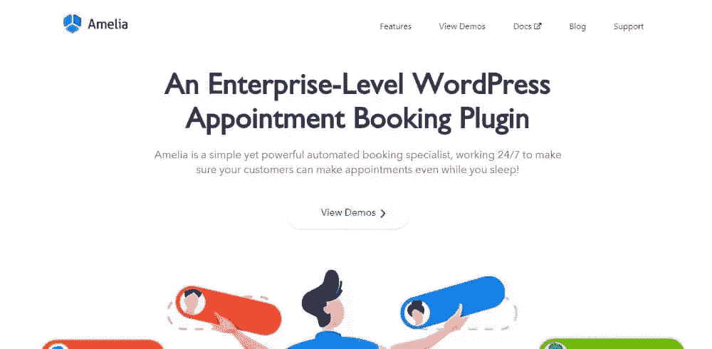
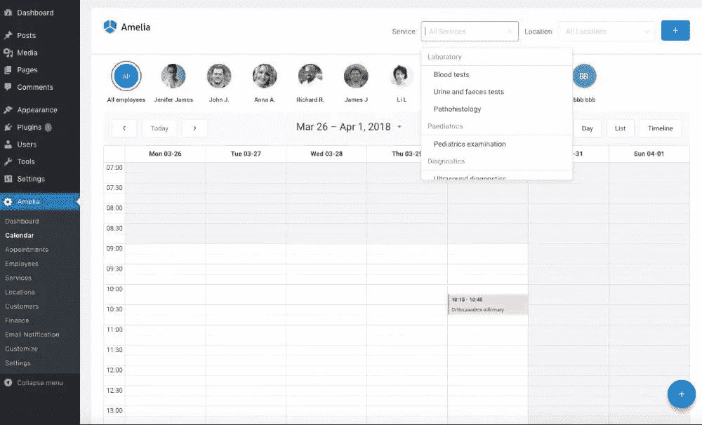
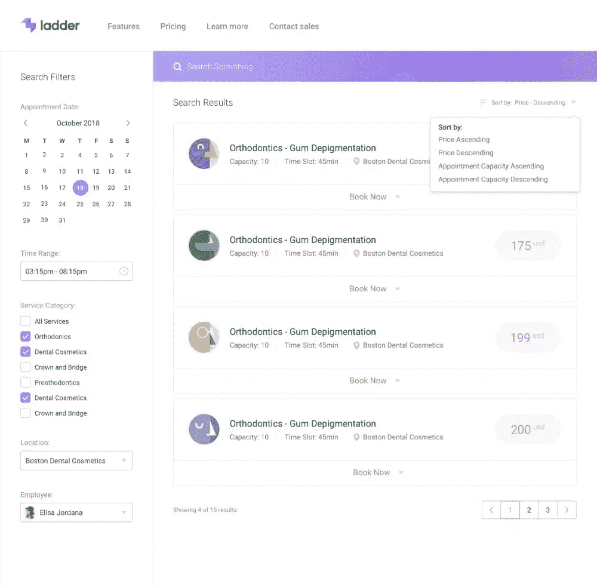
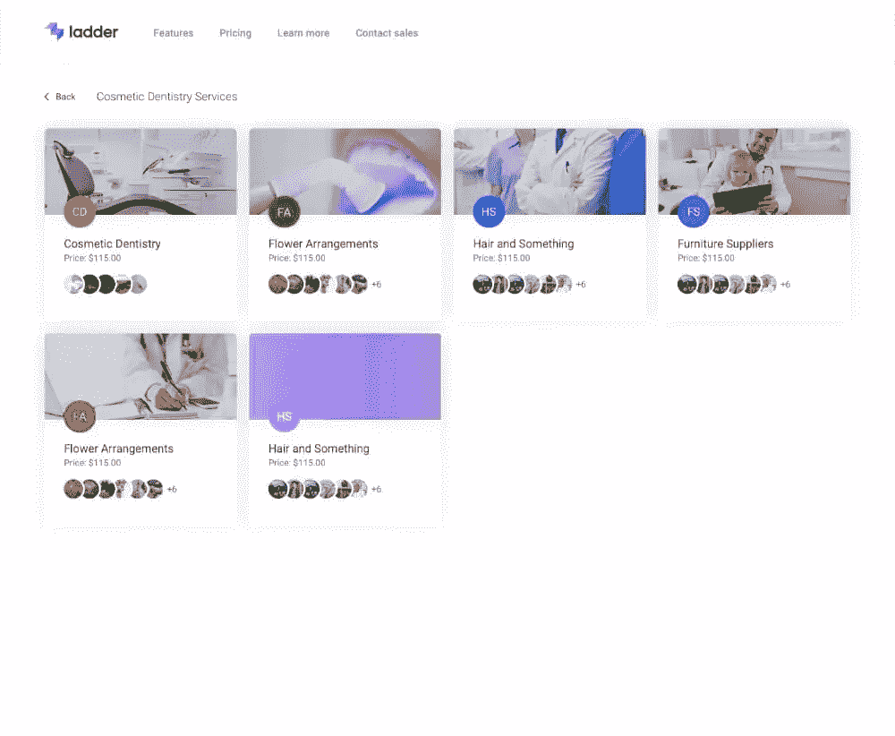
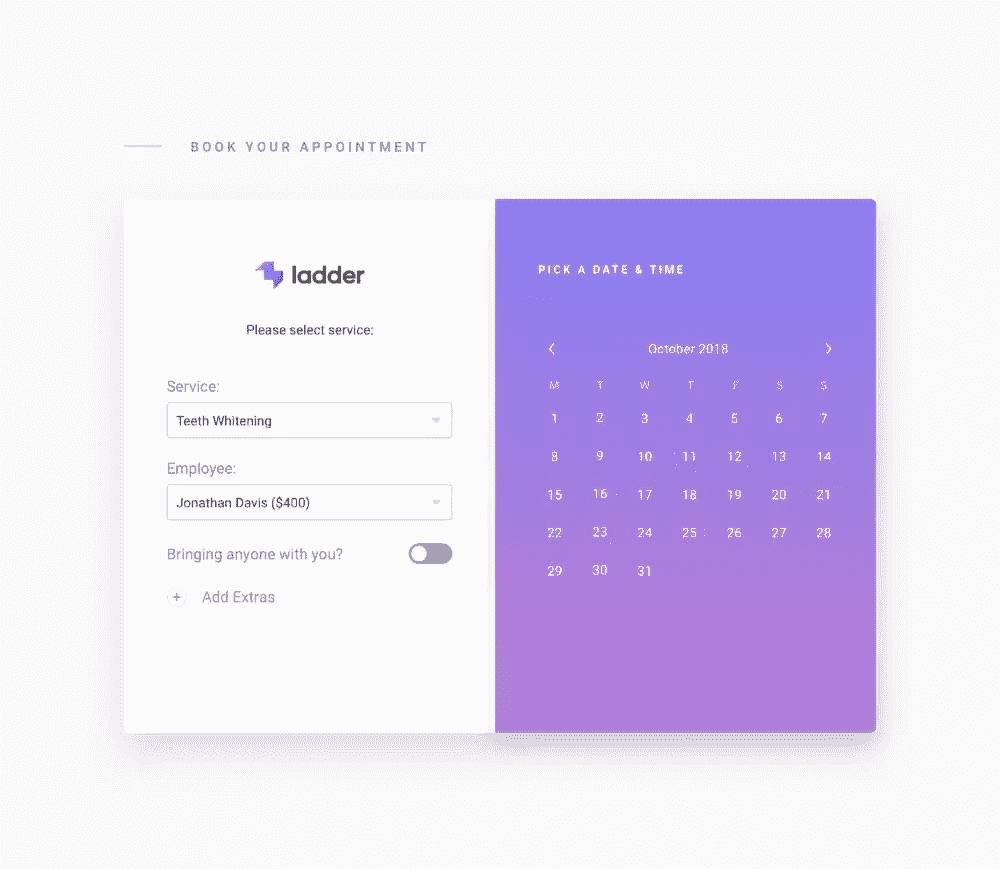

# 阿米莉亚:下一级 WordPress 预订插件

> 原文：<https://www.sitepoint.com/amelia-the-next-level-wordpress-booking-plugin/>

*本文是与 [BAWMedia](https://bawmedia.com/) 合作创作的。感谢您对使 SitePoint 成为可能的合作伙伴的支持。*

预约似乎是一件小事，但是管理预约比你想象的要花费更多的时间、精力和金钱，尤其是在非常活跃的行业，如咨询公司、健康和健身俱乐部以及美容院。

人工预订方式通常效果不错，但绝非完美无缺。会犯错误，任命会从缝隙中溜走，当变化发生时，适当的当事人可能无法得到适当的通知。

避免这些陷阱的一个很好的方法是**简化预订过程**，同时使其完全可靠并且没有错误。那条路有个名字。这是[阿米莉亚](https://wpamelia.com/?utm_source=sitepoint.com&utm_medium=content&utm_campaign=jul18)，阿米莉亚甚至在你睡觉的时候工作。

这是一款全面的预订软件，支持:

*   多名员工(供应商)拥有自定义的工作时间和休息日。
*   多种服务和服务类别，额外服务。
*   多个营业地点。
*   业务绩效 KPI 的图形和图表。
*   还有很多([见功能列表](https://wpamelia.com/demos/#Features-list&utm_source=sitepoint.com&utm_medium=content&utm_campaign=jul18))。

## 介绍自动预订专家 Amelia

它的用户会告诉你，是时候使用像 Amelia 这样的工具了，它是一个 WordPress 插件，可以不间断地安排和管理约会。阿米莉亚是与个人和企业一起创建的，如教练和私人教练、私人诊所和健身俱乐部、顾问和美容院。

请观看这段视频，快速了解阿米莉亚的情况。

[https://www.youtube.com/embed/hMzGTIjPQOI](https://www.youtube.com/embed/hMzGTIjPQOI)

**Amelia 不需要任何专业技术**来安装，它很容易设置，一旦完成，它是 100%自动化的。客户可以在白天或晚上的任何时间进行预约，只需点击几下鼠标，您就可以从一个地方完美地设置您的日历、查看这些预约并管理您的业务团队。

安装 Amelia，你就用一个可靠的约会系统取代了便签、匆忙和出席会议的错误，这个系统可以完美地自动运行。

你可以在这里查看阿米莉亚的前端演示，在这里查看 T2 的后端演示。

已经装好了？然后你就知道界面有多直观了。有了这么好的用户体验，你的客户几秒钟就能预约。

## Amelia 的最大优势

 

你会比你想象的节省更多的钱。你不按小时支付 Amelia，Amelia 也不是受薪员工。您只需一次性支付 Amelia 将永远为您服务的费用，该费用非常低，您的投资回报几乎是即时的。从阿米莉娅安装并运行的那一刻起，**你就在省钱**。

你将有更多的时间投入到工作中。您不必中断工作来接受、更改或取消约会。都为你做好了。只要顾客和客户知道他们的预约请求或预约变更已经得到处理，预约是由人还是由软件进行并不重要。

你会看起来更专业。当预约是一项快速而顺畅的操作时，客户当然会注意到并欣赏这一点——此外，它还能让您的业务运营看起来更专业。客户可以用智能手机预约。没有等待，也没有电话或电子邮件标签。

你会更有条理。当所有东西都放在一个地方，就在你面前，可以随时取用时，变得更容易整理和保持有序。这正是阿米莉亚为你做的。没有更多的便利贴或纸条，往往会游走到谁知道在哪里。

你将掌控一切。随之而来的是，当约会被自动管理时，你就不会不断地被打断，你需要管理它们的一切都在一个地方，你会发现自己完全控制了客户和员工的约会。因为这让你处于优化工作流程和资金流动的位置，这对你的业务和职业地位都有好处。

## 阿米莉亚的主要特征

这些顶级功能加起来就是一个强大的自动预订工具。虽然它们有很多，但它们都是为了让你的工作更容易，而不是更困难或更复杂。您将特别喜欢选择颜色和字体的功能，使 Amelia 的预订控件与您的主题和品牌风格相匹配。

**向导:**搜索预约向导的过滤标准帮助您按服务、员工或时间查看预约。可以使用相同的标准来安排约会。

**跟踪和报告:**您可以在仪表板上跟踪和查看业务的关键财务和转换相关 KPI，并从 Amelia 的日历或列表视图中选择多个工作流管理选项。

**目录视图:**通过填写有关您的服务的文本和图像，您可以制作您的企业提供的服务的在线目录。

 

员工管理:在 WordPress 数据库中存储相关的员工时间表和绩效信息。Amelia 可以为多个位置执行此操作。

**预订:** Amelia 支持团体和个人预订，包括预订期和团体容量信息。Amelia 还通过电子邮件发送约会通知，包括特殊事件和约会跟进。

**支付:** Amelia 通过 PayPal 和 Stripe 这两个最流行的在线支付系统整合支付。

## 最近添加到 Amelia 的功能

这些最近添加的功能，虽然单独来说很有帮助，但在节省时间、避免错误以及让客户和顾客满意方面，加起来可以获得巨大的投资回报。

—单向 Google 同步，可在员工日历中添加约会，并可选择隐藏预订流程中的“添加到日历”步骤。还有一个选项允许员工配置他们自己的时间表。
—员工第二天预约提醒
—当服务价格为 0 时隐藏价格计算
—当只有一个
时在首页隐藏员工—员工可以编辑他们的个人详细信息

## 为什么你现在应该尝试阿米莉亚

如果你有一个面向客户的业务，并且你非常认真地想要控制你的预订活动，这个 WordPress 插件是必须的。 **Amelia 安装简单，使用直观**。学习曲线几乎是平坦的，因此您不需要任何培训，并且您可以定制该工具来适应您的业务，而不是相反。[今天就试试](https://wpamelia.com/?utm_source=sitepoint.com&utm_medium=content&utm_campaign=jul18)自己去发现吧。

注意:如果你购买了 [Amelia](https://wpamelia.com/?utm_source=sitepoint.com&utm_medium=content&utm_campaign=jul18) 插件，并发现它不适合你，有 15 天的退款保证，没有任何问题。

## 分享这篇文章