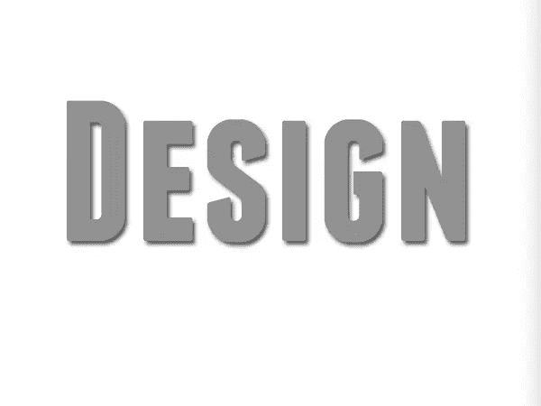
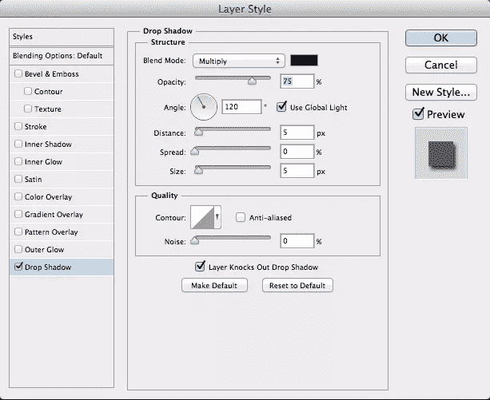
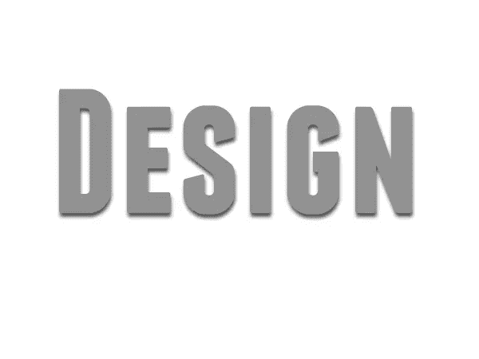
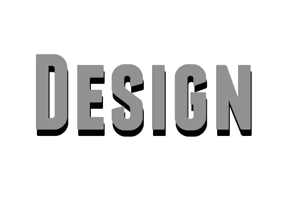
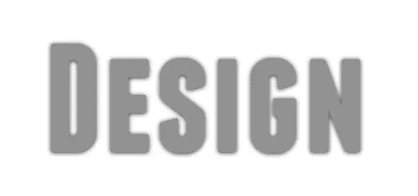
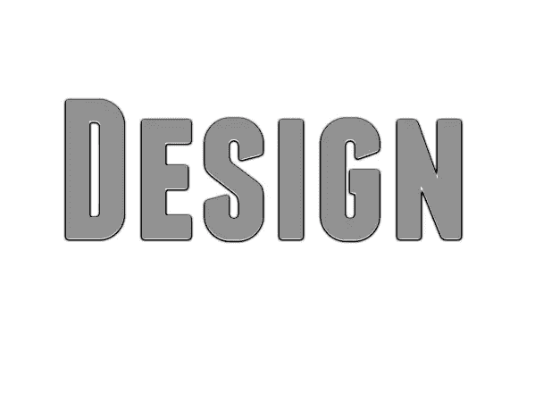
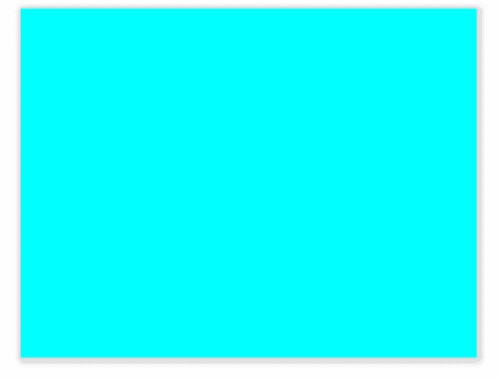

# 对投影的启发性观察

> 原文：<https://www.sitepoint.com/an-illuminating-look-at-drop-shadows/>

许多媒介中最常见的设计挑战之一是在三维不可用的情况下创造深度。平面设计可能会令人厌烦和单调。为了解决这个问题，我们的工作就是创造跳出页面的设计。多年来，设计师们一直通过使用一种叫做投影的普通技术来创造深度错觉。投影在设计元素(如对象或类型)后面放置一个伪阴影。这个假阴影通过某些参数来控制，以创建不同程度的强度和柔和度来模拟真实的阴影。使用这种技术可以让设计元素看起来悬浮在页面上，跳出来吸引更多的注意力。

投影可以在 Photoshop 等应用程序中创建，也可以使用 CSS 样式在 web 上渲染。我们将看看这两者，以及如何使用不同的参数和技术来创建许多不同种类的投影。

### 在 Photoshop 中投影

可以在 Photoshop 中使用图层样式创建投影。打开 Photoshop 并创建一个新文档。我将使用粗体无衬线字体，“特许经营”，用中灰色创建。为此教程键入一个单词或一条消息。在“图层”面板中，双击文本图层。图层样式菜单将弹出。选择“投影”，我们将尝试不同的设置来创建不同的外观。

#### 角

默认混合模式是“乘”，不透明度设置为 75%。您可以将它增加到 100%以获得更强烈的阴影。角度是一个非常重要的设置，因为它决定了投影的整体外观。你选择的角度决定了光源，阴影会在对面。上图中，光源的角度是 120 °,位于左上角。阴影在右下边缘结束。如果将文本正上方的角度更改为 90 °,阴影将位于文本的底部边缘。

如果您在 Photoshop 中的设计中放置了多个对象，取消选中“使用全局灯光”可能是个好主意否则，如果您更改对象内的光源角度，它将更新同一 Photoshop 文档中应用了投影的其他对象。

#### 距离

距离是决定投影效果的另一个主要因素。选择的距离值越大，对象看起来离下面的表面越远。如果您将距离设置为 0，它会显得非常近。下面，我设置距离为 13px，不透明度增加到 100%。这会产生强烈的阴影，使文本看起来像是漂浮在背景之上。

#### 传播

“扩散”控制基础阴影扩散的程度，这使阴影呈现另一个维度。这可以使阴影看起来更清晰和强烈，并且它可以达到你的大小设置的界限。将“扩散”与“大小”结合使用，可以控制阴影拉伸和模糊的程度。

#### 大小

大小是指应用于投影的模糊的大小或数量。上面显示的示例的大小设置为 18px。错觉是灰色表面凸起。结合 20%的扩散和 13px 的距离设置，会产生文本可能比二维平面更厚的错觉。阴影设置欺骗了眼睛，让你不确定阴影的深度和被它们隐藏的表面。

如果将“大小”值降低到 0，则没有模糊，因此阴影是清晰和粗糙的，而不是柔和和漫射的。这给人一种错觉，即光源比增大尺寸设置时更近、更强。

去掉传播值完全柔化了阴影。没有阴影的强度，它更加微妙。

#### 质量/轮廓

投影的质量决定了投影的形状，这可以让您获得一些非常有趣的结果。在下面的例子中，我把轮廓改成了“锯齿”，这给了文本一个有光泽的边缘的外观。使用这样的设置对玻璃和其他反射表面的效果非常有帮助。

将环形设置与 1px 的距离相结合，将使文本看起来像一个斜边，在底部有一个小亮点。光线和阴影的不同角度会对任何物体的外观产生巨大的影响。

### 在网络上投下阴影

您也可以将投影应用到 web 上的元素。您可以使用 box-shadow 属性将它们应用于 div 元素，使用 text-shadow 属性将它们应用于 text 元素。它们是基于 Photoshop 的投影图层样式的相同原理构建的，但是你用 CSS 来控制参数。

### CSS

 `#container{
width:575px;
height: 440px;
background:#0FF;
-moz-box-shadow: 2px 2px 7px 4px #222;
-webkit-box-shadow: 2px 2px 7px 4px #222;
box-shadow: 2px 2px 7px 4px #222;
}` 

CSS 背后的基础相当简单。box-shadow 的第一个值决定水平偏移。这决定了阴影向左或向右偏移多少像素。第二个值是垂直等效值。这控制阴影向上或向下偏移的距离。将两个值都设置为 0px 将确保阴影完全居中。

第三个值是模糊设置，它决定了阴影的软硬程度。将该值设置为 0px 将创建一个清晰、坚硬的阴影，而增加模糊量将创建一个柔和、微妙的阴影。第四个值决定了阴影的范围，或者说阴影的大小和强度。

文字阴影 CSS 属性的工作方式就像框阴影一样，但是没有扩展值。

### 阴影颜色

有时，您可能想要处理非纯黑色的阴影。在 CSS 中插入一个十六进制的颜色值是控制阴影颜色的一种方法，但是除了十六进制值之外，还有另一种方法来决定颜色。您也可以使用 RGBa 方法，使用红色、绿色和蓝色值的组合来确定阴影的颜色，“a”代表 alpha 透明度。您可以使用从 0.1(表示 10%不透明度)到 1(表示 100%)的数字范围来确定 alpha。如果您决定使用 RGBa 方法，下面是它的一个示例。

 ``box-shadow: 2px 2px 7px 4px (35, 35, 35, .5);`

### 结论

投影可以增加设计的深度和趣味性。它们经常出现，但是很少被研究。只需很少的努力，你就可以将你的作品从平面的二维画布转变成看起来像是从页面上脱离出来的充满深度的设计。理解光源和光影如何创造深度的错觉是在你的作品中创造真实深度的基础之一。

你有什么技巧可以在你的作品中创造出很棒的阴影吗？你有什么技巧可以用投影来增加你作品的立体感吗？请在下面的评论区分享它们。` 

## `分享这篇文章`