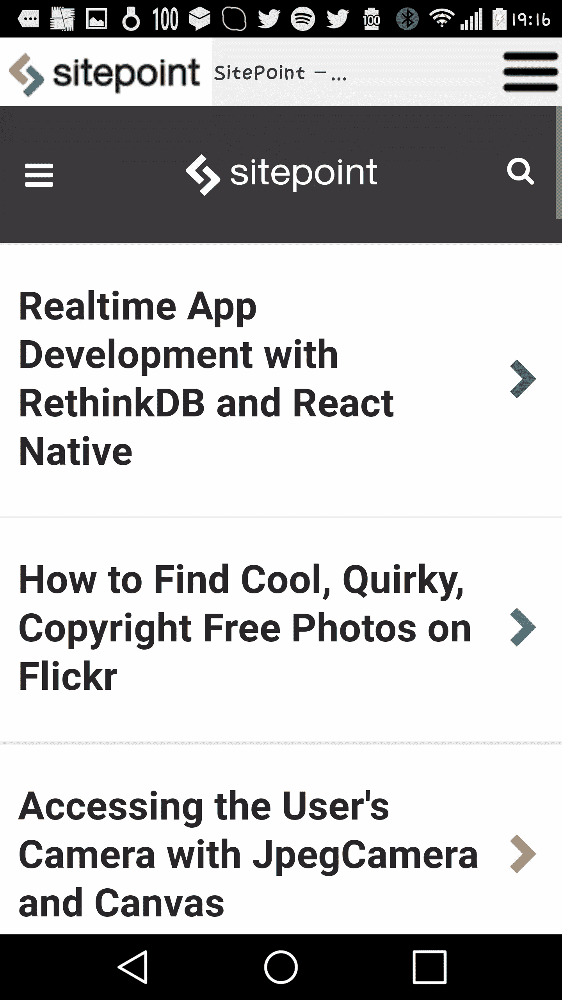
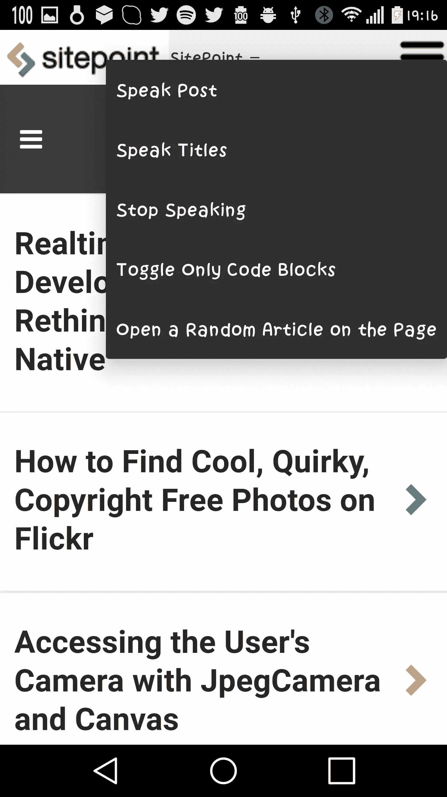

# 带有 ThemeableBrowser PhoneGap 插件的应用内浏览器

> 原文：<https://www.sitepoint.com/an-in-app-browser-with-themeablebrowser-phonegap-plugin/>

PhoneGap 是一个框架，允许开发者使用 HTML、CSS 和 JavaScript 构建移动应用。有了它，你可以为 Android、iOS 和 Windows Mobile 等多种移动操作系统构建应用。大量的核心插件和 API 挂钩是可用的，并且有一个繁荣的社区生态系统。

例如，使用[Cordova-plugin-geolocation](https://github.com/apache/cordova-plugin-geolocation)你可以获得用户的位置，使用 [cordova-plugin-vibration](https://github.com/apache/cordova-plugin-vibration) 你可以让用户的设备振动。在本教程中，我将重点介绍一个不属于核心套件的特定插件，[‘themablebrowser’](https://github.com/initialxy/cordova-plugin-themeablebrowser)。它是应用浏览器插件的核心[的一个分支，允许你在一个应用程序中打开外部网站，设置浏览器风格并添加自定义操作。](https://cordova.apache.org/docs/en/latest/reference/cordova-plugin-inappbrowser/)

本教程结束时，您将创建一个简单的移动应用程序，该应用程序显示 SitePoint 的网站以及一些额外的功能。



*注意右边的汉堡图标、左边的标志和中间的当前网页标题*




你可以在 [GitHub](https://github.com/sitepoint-editors/spmobile) 上找到这个教程的代码。

## 创建“Hello World”PhoneGap 应用程序

您需要安装节点和 npm。如果你还不知道，那么请阅读 [SitePoint 的快速提示](https://www.sitepoint.com/beginners-guide-node-package-manager/)开始吧。

现在，在您的终端中运行以下命令来安装 PhoneGap:

```
npm install -g phonegap@latest 
```

现在您可以运行:

```
phonegap create project-name 
```

在命令行上创建一个新项目和一个*项目名*文件夹。在这个文件夹中有一个 *www* 文件夹，其中包含了基于 HTML 的应用程序。

要在浏览器运行中测试应用程序:

```
phonegap serve 
```

或者在仿真器(在本例中为 iOS)或设备上运行应用程序，该设备具有:

```
phonegap run ios 
```

您可以使用`phonegap build`命令构建应用程序的测试版本。如果您想为发布到适当的设备存储(在本例中是 Android)准备一个版本，运行`phonegap build android --release --buildConfig fileWithKeyInformation.json`，在 JSON 文件中传递命令构建数据(比如一个 keystore)。

您可能需要下载其他依赖项来为不同的设备构建移动应用程序。例如，要为谷歌 Play 商店开发一个应用，你需要安装 [Android SDK](https://developer.android.com/studio/index.html) 、 [Java SE 运行时环境](http://www.oracle.com/technetwork/java/javase/downloads/jre8-downloads-2133155.html)和[Java 开发工具包](http://www.oracle.com/technetwork/java/javase/downloads/jdk8-downloads-2133151.html)。

## 安装和管理所需的插件

你可以通过在 PhoneGap 项目文件夹中输入`phonegap plugin list`来查看应用程序正在使用的插件。您可以使用`phonegap plugin remove plugin-name`删除不需要的插件。您可以使用`phonegap plugin add plugin-name`添加插件。删除你不需要的插件是一个很好的做法，因为许多使用权限可能是不必要的，并会吓跑潜在的用户。

要声明您想要使用 ThemeableBrowser 插件，请在项目文件夹中运行`phonegap plugin add cordova-plugin-themeablebrowser`。然后，您可以使用`cordova.ThemeableBrowser`在 JavaScript 代码中调用它的方法。您还需要添加一个文本到语音(tts) API，以便在自定义浏览器中使用。通过运行`phonegap plugin add https://github.com/domaemon/org.apache.cordova.plugin.tts.git`并在 JavaScript 代码中使用`navigator.tts`来实现这一点。您可以在包含的 JavaScript 文件中看到 tts [的所有可用方法。](https://github.com/domaemon/org.apache.cordova.plugin.tts/blob/master/www/tts.js)

## 启动自定义移动浏览器

由于应用程序的代码仅包含 HTML、CSS 和 JavaScript，因此您可以使用适合自己的文件和文件夹结构。“Hello World”PhoneGap 应用程序附带了一个*index.html*文件(您可以在 *config.xml* 中定义应用程序启动的文件)，您可以在其中添加您的逻辑并加载应用程序所需的其他资产，如 JavaScript 文件。

代码部分使用 JQuery，因此将其作为依赖项添加到*index.html*:

```
<script src="https://code.jquery.com/jquery-1.12.4.min.js" integrity="sha256-ZosEbRLbNQzLpnKIkEdrPv7lOy9C27hHQ+Xp8a4MxAQ=" crossorigin="anonymous"></script> 
```

打开 *www/js/index.js* 你会注意到:

```
...
bindEvents: function() {
    document.addEventListener('deviceready', this.onDeviceReady, false);
},
... 
```

使用 PhoneGap，最好在`deviceready`事件触发后触发应用程序逻辑。此事件在所有 PhoneGap APIs 都已加载并且设备准备好执行进一步的代码后触发。如果您在任何代码被触发之前运行它，并使用硬件 API，例如地理定位，应用程序就有可能崩溃。

在收到设备准备就绪的通知后，调用将使用`receivedEvent`函数中的浏览器打开 SitePoint 网站的方法:

```
receivedEvent: function(id) {
    app.openPage("https://www.sitepoint.com");
    ...
} 
```

`openPage`方法获取一个 URI，调用`cordova.ThemeableBrowser.open`，向其传递 URI 和一个带有选项的对象，并将对打开的网页的引用保存在一个属性中。如果您想在用户浏览这个页面时导航到另一个页面，或者如果您想关闭 web 浏览器，则需要该属性。

在 *www/js/index.js* 中创建函数:

```
...
openPage: function(url) {
   var options = app.getBrowserOptions();
   app.properties.ref = cordova.ThemeableBrowser.open(url, '_blank', options);
   app.addEventListeners();
},
... 
```

以及将选项传递给函数的相关联的`getBrowserOptions`函数:

```
...
getBrowserOptions: function() {
    var options = {
      ...
    }
    return options;
},
... 
```

在`options`对象中，添加一个状态栏和一个工具栏属性，该属性将工具栏的高度设置为 44 像素，并添加一个白色背景色:

```
var options = {
  statusbar: {
    color: '#ffffffff'
},
  toolbar: {
      height: 44,
      color: '#f0f0f0ff'
  },
} 
```

添加另一个属性，表明您希望在工具栏中间显示打开的网页的标题，并为其指定特定的颜色:

```
var options = {
 toolbar: {
     height: 44,
     color: '#f0f0f0ff'
 },
 title: {
     color: '#003264ff',
     align: "center",
     showPageTitle: true
 }
} 
```

添加一个`customButtons`属性，该属性包含要添加到浏览器中的自定义按钮的数组。要添加一个新按钮，您需要传递一个具有按钮特性的对象。

对于这个特定的按钮，向对象传递一个带有按钮图像 URL 的`image`或`wwwImage`属性。`wwwImage`与`image`属性的不同之处在于，当使用`wwwImage`时，图像的路径从`www`文件夹开始，而`image`需要本地项目中的图像。你可以在这里找到例子[中使用的图片。](https://github.com/sitepoint-editors/spmobile/tree/master/www/img/btns)

将按钮与工具栏的左侧对齐，并告诉 ableBrowser 您希望在单击按钮时触发名为`SitePointSitePressed`的事件。稍后您将添加该事件。

```
...
options.customButtons = [{
    wwwImage: 'img/btns/sitepoint-logo.png',
    wwwImagePressed: 'img/btns/sitepoint-logo.png',
    wwwImageDensity: 1,
    align: 'left',
    event: 'SitePointSitePressed'
}]
... 
```

通过创建一个`menu`属性向工具栏添加一个菜单，同样传递一个图像。将其向右对齐，并添加一个`items`属性，该属性包含不同菜单项的数组以及被选中时将要触发的事件。

```
...
options.menu = {
    wwwImage: 'img/btns/menu.png',
    imagePressed: 'img/btns/menu-pressed.png',
    wwwImageDensity: 1,
    title: 'Effects',
    cancel: 'Cancel',
    align: 'right',
    items: [{
        event: 'speakPostPressed',
        label: "Speak Post"
    },
        {
            event: 'speakTitlesPressed',
            label: "Speak Titles"
        }, {
            event: 'stopSpeakingPressed',
            label: "Stop Speaking"
        }, {
            event: 'viewCodeBlocks',
            label: 'Toggle Only Code Blocks'
        },
        {
            event: 'randomArticlePressed',
            label: 'Open a Random Article on the Page'
        }
    ]
}
... 
```

现在您需要添加事件侦听器和函数。为此，在您拥有的对`cordova.ThemeableBrowser.open`结果的引用上设置事件监听器，即之前设置的`app.properties.ref`。

这些事件监听器调用处理应用程序逻辑的对象的`run`方法，为每个事件传递不同的参数。`run`方法将尝试调用您作为参数传递的方法。

```
addEventListeners: function() {
  app.properties.ref.addEventListener('viewCodeBlocks', function(e) {
        SitePointPostOptions.run("viewCodeBlocks");
    }).addEventListener('speakPostPressed', function(e) {
        SitePointPostOptions.run("speakPost");

    }).addEventListener(cordova.ThemeableBrowser.EVT_ERR, function(e) {
        console.error(e.message);
    }).addEventListener(cordova.ThemeableBrowser.EVT_WRN, function(e) {
        console.log(e.message);

    }).addEventListener("stopSpeakingPressed", function(e) {
        SitePointPostOptions.run("stopSpeaking");

    }).addEventListener("speakTitlesPressed", function(e) {
        SitePointPostOptions.run("speakTitles");
    })
    .addEventListener("SitePointSitePressed", function(e) {
        SitePointPostOptions.run("logoClick");
    })
    .addEventListener("randomArticlePressed", function(e) {
        SitePointPostOptions.run("randomArticle");
    }).addEventListener("loadstop", function(evt) {
        if (SitePointPostOptions.properties && SitePointPostOptions.properties.length) {
            SitePointPostOptions.properties.areCodeBlocksShown = false;
        }
}, 
```

下一步至关重要。为属性的`loadstop`事件添加一个额外的事件侦听器，该事件侦听器包含对已打开网页的引用。每当浏览器完成加载网页时，就会触发`loadstop`事件。它可以是刚刚打开的网页，也可以是用户后来导航到的任何其他网页。

在侦听器中，如果用户不在 SitePoint 网站上，则从函数返回。如果是，则在用户所在的网页上执行 JavaScript 代码。

调用`document.body.innerHTML`获取网页的 HTML 内容，并添加一个回调函数，将内容保存到一个属性中。使用此属性，您可以遍历并读取用户导航到的任何网页的内容。

```
addEventListeners: function() {
  app.properties.ref.addEventListener('viewCodeBlocks', function(e) {
          SitePointPostOptions.run("viewCodeBlocks");
      }).addEventListener('speakPostPressed', function(e) {
          SitePointPostOptions.run("speakPost");

      }).addEventListener(cordova.ThemeableBrowser.EVT_ERR, function(e) {
          console.error(e.message);
      }).addEventListener(cordova.ThemeableBrowser.EVT_WRN, function(e) {
          console.log(e.message);

      }).addEventListener("stopSpeakingPressed", function(e) {
          SitePointPostOptions.run("stopSpeaking");

      }).addEventListener("speakTitlesPressed", function(e) {
          SitePointPostOptions.run("speakTitles");
      })
      .addEventListener("SitePointSitePressed", function(e) {
          SitePointPostOptions.run("logoClick");
      })
      .addEventListener("randomArticlePressed", function(e) {
          SitePointPostOptions.run("randomArticle");
      }).addEventListener("loadstop", function(evt) {
          if (SitePointPostOptions.properties && SitePointPostOptions.properties.length) {
              SitePointPostOptions.properties.areCodeBlocksShown = false;
          }

       if (evt.url.indexOf("sitepoint.com") === -1) {
           return;
       }
       app.properties.ref.executeScript({
               code: "document.body.innerHTML"
           },
           function(values) {
               alert("The app's menu is now ready for use.");
               app.properties.pageContents = values;
           }
       );
   })
}, 
```

打开随机文章的方法展示了一些有趣的东西，如何关闭打开的网页并打开一个新的。这将对打开页面的属性使用`close`方法，并为浏览器的`exit`事件设置一个侦听器。每当浏览器将要退出时，等待几秒钟，让它关闭，然后用新的 URI 调用`openPage`方法打开一个新页面。新的 URI 是包含文章列表的 SitePoint 页面中所有文章的锚的随机`href`属性。如果页面不包含任何文章，弹出警告。

将浏览器背后的逻辑添加到新的*www/js/menu logic/logic . js*文件中:

```
SitePointPostOptions = {};
SitePointPostOptions.properties = {};
SitePointPostOptions.properties.areCodeBlocksShown = false;

SitePointPostOptions.run = function(type, options) {
    SitePointPostOptions[type].call(this, options);
}

SitePointPostOptions.randomArticle = function() {
    var articles = $(app.properties.pageContents[0]).find(".article .article_title a");
    if (!articles.length) {
        alert("You are probably not on a SitePoint page with a list of articles!");
    }
    var randomIndex = Math.floor(Math.random() * articles.length);
    var linkToFollow = articles[randomIndex].getAttribute("href");
    app.properties.ref.addEventListener("exit", function() {
        setTimeout(function() {
            app.properties.ref = null;
            app.openPage(linkToFollow);
        }, 2000)

    })
    app.properties.ref.close();
} 
```

在*index.html*链接到这个新文件:

```
<script type='text/javascript' src='js/menuLogic/logic.js'></script> 
```

当用户单击徽标(左侧添加的自定义按钮)时，使用系统的默认浏览器打开 SitePoint 网站。要在内部浏览器之外打开一个网页，用值`_system`给`cordova.ThemeableBrowser.open`方法提供第二个参数。

仍在*www/js/menu logic/logic . js*内，添加:

```
SitePointPostOptions.logoClick = function() {
  cordova.ThemeableBrowser.open("https://www.sitepoint.com", "_system");
} 
```

下一个方法通过将所有标题元素的文本传递给`speakText`助手来读出网页的标题。

```
SitePointPostOptions.speakTitles = function() {
    //TODO: Speak only the tiles of the pages
    var titlesContents = $(app.properties.pageContents[0]).find("h1,h2,h3,h4,h5,h6");
    if (!titlesContents.length) {
        alert("There is probably no title out there to speak aloud!");
    }
    titlesContents = titlesContents.text();
    SitePointPostOptions.speakText(titlesContents);
} 
```

下一个方法朗读文章的内容，并附带一个停止朗读的方法:

```
SitePointPostOptions.speakPost = function() {
    //TODO: speak post
    var postContents = $(app.properties.pageContents[0]).find(".ArticleCopy").find("p,h1,h2,h3,h4,h5,h6");
    if (!postContents.length) {
        alert("There is probably no post open to speak aloud.");
    }
    postContents = postContents.text();
    SitePointPostOptions.speakText(postContents);
}

SitePointPostOptions.stopSpeaking = function() {
    navigator.tts.stop(function() { /*success callback*/ }, function() { /*err callback*/ });
    navigator.tts.interrupt("", function() { /*success callback*/ }, function() { /*err callback*/ });

    navigator.tts.shutdown(function() {
        /*successfully shut down tts*/
    }, function() { /*err*/ })
} 
```

下一个方法通过向用户正在查看的网页插入特定的 CSS 规则来切换给定 SitePoint 帖子上的代码块:

```
SitePointPostOptions.viewCodeBlocks = function() {
  //TODO: filter only code blocks;
  if (SitePointPostOptions.properties.areCodeBlocksShown) {
      app.properties.ref.insertCSS({
          code: ".ArticleCopy > *:not(pre) { display:block !important;}"
      })
      SitePointPostOptions.properties.areCodeBlocksShown = false;
      return;
  }
  app.properties.ref.insertCSS({
      code: ".ArticleCopy > *:not(pre) { display:none !important;}"
  })
  SitePointPostOptions.properties.areCodeBlocksShown = true;
} 
```

## 还有什么？

你已经创建了一个装满好东西的移动应用浏览器。您可以扩展这些功能，以包括适合您的应用使用情形的定制品牌和功能。

*您以前是否实现过定制的移动浏览器，或者您是否有想要创建的东西？这是什么？*

## 分享这篇文章