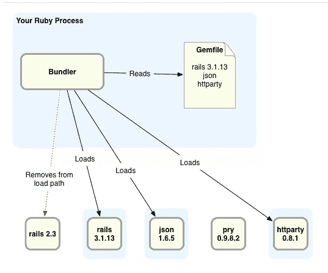

# 采访来自 Bundler 团队的 Andre Arko 和 Terence Lee

> 原文：<https://www.sitepoint.com/an-interview-with-andre-arko-and-terence-lee-from-the-bundler-team/>

你们谁还记得在 Bundler 出现之前的生活是什么样的？让一个 Rails 应用程序正常工作通常是一个漫长、乏味的试错过程:您会启动应用程序，希望已经安装了所有必需的组件。然后，当应用程序不工作时，您必须找出哪些 gem 丢失了，并一个接一个地安装它们，希望您不会破坏其他应用程序。

特伦斯·李

随着 Bundler 的出现，所有这些都变得容易多了。现在每个 Ruby 应用程序都可以指定它需要的 gem 列表，以及每个 gem 的精确版本。然后，Bundler 将允许 Ruby 应用程序只访问指定的 gem，而不访问机器上可能存在的其他 gem。

本周，我有幸有机会与联邦德勒核心团队的两位成员交谈:[安德烈·阿科](http://arko.net/)和[特伦斯·李](http://twitter.com/hone02)。我们讨论了 Bundler 如何工作，他们如何参与 Bundler，Bundler 1.1 何时推出，Bundler 测试套件如何工作，以及其他一些事情…

## 谁啊。

问:你们是谁？给我们介绍一下你自己。

安德烈·阿尔科

我是安德烈·阿科。我住在旧金山，为 [Plex](http://plexapp.com) 工作，主要是开发网络应用和服务。因为整天编程是不够的，所以我也从事开源工作——我是 Bundler 的核心团队成员，我是 jquery-rails gem 的作者，该 gem 由 Rails 3.1 推广。

嘿，我是特伦斯·李。我在 Heroku 工作，维护 Ruby 堆栈。由于我的兴趣倾向于基础设施，我维护 Bundler，最近接管了 Resque gem。当我不去参加令人敬畏的 Heroku 或 Ruby 活动时，我住在德克萨斯州的奥斯汀，美国的 taco 之都。

## Bundler 基础

问:Bundler 是做什么的，为什么要有人使用它？

Bundler 帮助您以一致、可靠和可预测的方式管理应用程序的库依赖关系。你可能还记得，在 Ruby 开发糟糕的过去，你多少希望 Readme 有一个你的应用程序需要的最新的 gem 列表——当然，它从来没有。然后你会安装这些 gem，并尝试运行应用程序，以找出哪些 gem 不在 Readme 中…然后大约一个小时后，你会发现至少有一个 gem 的版本太新，它有一个不同的 API，并在应用程序的某个地方隐藏了一个功能，现在已被破坏。

Bundler 允许你的应用程序只加载 gem 文件
中列出的宝石(图表由[丹尼尔·希金博瑟姆](http://www.flyingmachinestudios.com/)绘制)

问:那是很久很久以前的 2009 年，对吗？其实也没多久。

事实上，这是 Rails 3.0 之前的一切。除非您特意找到 Bundler 并开始使用它，否则即使在 Rails 2.3 中，您仍然会被它所困扰。

## 你们两个是怎么和邦德勒扯上关系的？

问:你们两个是怎么开始为 Bundler 工作的？是在那个时候吗？

我先来，因为按时间顺序特伦斯在我之后开始。当时我一直在 Engine Yard 工作，我真的很想玩这个很酷的新 Rails 3 beta，我说“下班后我要回家，坐下来写一个 Rails 3 应用程序！”我使用 Rails 3 应用程序不到 10 分钟，就在 Bundler 中发现了两三个导致异常错误并修复了它们。这真的是微不足道的事情；碰巧我遇到了那个建筑有一个非常明显的缺陷。

第二天上班时，我找到了耶胡达，对他说:“耶胡达，你应该把我的修补程序应用到邦德勒身上！”他说:“哦，不，我太忙了——你现在在 Bundler 上有提交权！去修！”仅仅一两个月前，我在 Engine Yard 的老板找到我说:“嘿，如果你还在 Bundler 工作，你还能按时完成项目软件吗？你看起来做得很好……”我说:“我当然能做到！”然后我有 50%的带薪工作时间在 Bundler 上！

问:你呢，特伦斯？

耶胡达和卡尔来到德克萨斯州奥斯汀的孤星红宝石会议，做了一个关于 Bundler 的演讲，我想是在 Bundler 0.7 或者 0.8 的时候。出于和安德烈之前说的一样的原因……不得不在没有它的情况下做一个项目，然后尝试它，我说:“这一定是自切片面包以来最伟大的事情！”当我开始在 Heroku 工作时，我与 Carl 和 Yehuda 取得了联系，并试图通知他们 Heroku 特有的问题。其中一些东西来自 Bamboo 堆栈，例如只读文件系统，他们的测试没有包含任何这些东西，因为通常你不会考虑这些东西。在 1.0 rc 的日子里，我最终接管了 Bundler 对 Heroku 的支持——在 1.0 出来后，Carl 走过来对我说:“兄弟，你应该支持 Bundler”，他给了我一点承诺。在那之后，我决定:我想我应该用这个做点什么。我做的第一件事是修复构建，因为它是坏的。

## Bundler 1.1 什么时候发布？

早在十月份，我就写过[为什么 Bundler 1.1 会比 Bundler 1.0 快得多](http://patshaughnessy.net/2011/10/14/why-bundler-1-1-will-be-much-faster)以及它如何使用新的 RubyGems.org 依赖 API，但从那以后它仍然没有正式发布。我决定问问安德烈和特伦斯为什么要花这么长时间…

问:那么 Bundler 1.1 什么时候发布呢？

这是每个人都想知道的——就我而言，答案是只要它能工作，而且令人高兴的是，几乎所有东西都能工作。特伦斯和我明天会亲自去配对。当您在 gem 文件中声明了一个 gemspec，并且 git 中的子 gem 被声明为您在 gem 文件中引用的 gemspec 中的子依赖项时，只有当您运行“捆绑包更新”时，才会出现一个棘手、奇怪的回归，有时它会提取错误的 gemspec。

问:哇——这可真够长的！

隔离起来真的很有趣，但是我们有一个失败的测试用例，我们只需要准确地跟踪从 1.0 开始内部哪里开始出错了。据我所知，那是最后一个 bug。

问:听起来你们真的很亲密！

我希望如此，但是对于一些 bug，比如一个缓存解析器 bug，我们花了两三个月才找出问题所在。

是的，那真是太棒了。原来 Bundler 依赖解析器代码的工作方式使用了大量的捕捉和抛出。这意味着一些你认为不重要的副作用会变成非常重要的副作用。

问:这就是从事如此重要和有帮助的工作的另一面:在发布之前，你真的需要确保它是有效的。

作为一个不得不取消我发布的 Bundler 的每一个其他点的人，天哪，那可能是 10 个发布，随着时间的推移，我越来越意识到这一点的重要性。特伦斯实际上充当了“理性之声”的角色，他说:“不！不要接受那个拉动请求！东西可能会坏掉！”

问:所以你是理性的代言人，特伦斯？

我只是对事情比较保守。Bundler 作为一个整体有很多其他的东西，我认为不是 Bundler 做的核心部分。之前我们讨论了 Bundler 的实际工作，我认为它的核心是依赖管理。一旦 André和我弄清楚如何做一个插件架构，这是我们路线图上的某个地方，我想把人们想在 Bundler 中拥有的所有这些伟大的东西都拿出来。

## Bundler 实际上是如何工作的？

问:当大多数人想到 Bundler 时，他们会想到“bundle install”或“bundle update”以及更新依赖项。但是载荷路径呢？Bundler 实际上是如何限制 Ruby 只加载 Gemfile 中的宝石的？Bundler 会这么做吗？或者实际上是由 RubyGems 自己处理的？

这实际上是在 Bundler 中，但它只是在 Bundler 中，因为 RubyGems 没有提供一种机制来实际做这样的事情。

Bundler 背后的观点是，你的 Gemfile 中的东西应该是你唯一可以加载的东西。为了使这个工作，卡尔和耶胡达写了一个方法，叫做 cripple _ rubygems！