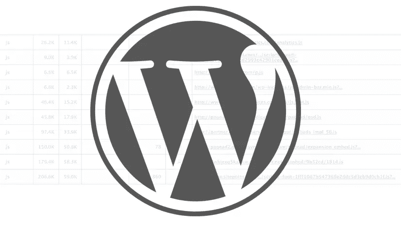

# WordPress 中的资产处理介绍

> 原文：<https://www.sitepoint.com/an-introduction-to-asset-handling-in-wordpress/>

作为一个 WordPress 主题或插件开发者，在你的开发过程中会有一段时间，你需要在你的插件或主题中包含第三方脚本或样式表。当然，简单地在页眉或页脚中链接资产肯定是可行的，但是坚持使用提供的 WordPress API 的标准实践将确保你的主题或插件将与 WordPress 生态系统中的其他插件很好地配合。

如果你想提供与其他可用插件和主题的最大兼容性，WordPress 中的资产处理绝对是你应该掌握的技能。

这篇文章的目标读者是 WordPress 的初学者，假设你已经掌握了 WordPress 操作和过滤挂钩的工作知识。



## 基础知识

WordPress 已经提供了一些基本的功能来帮助开发者正确地加载他们的主题或者插件的自定义资产。您将经常使用的四个主要功能是`wp_register_script`、`wp_enqueue_script`、`wp_register_style`和`wp_enqueue_style`。

让我们一个一个的来看看这四大功能。

### `wp_register_script( $handle, $src, $deps, $ver, $in_footer );`

我将继续粘贴[中提供的关于这个函数的描述。](https://codex.wordpress.org/Function_Reference/wp_register_script)

> 在 WordPress 中注册一个脚本文件，以后链接到一个页面，这样可以安全地处理脚本依赖。

只有`$handle`和`$src`参数是必需的，后三个是可选的。

`$handle`是脚本的名称，应该是唯一的。这是将您的脚本入队时最重要的部分，因为`$handle`将是要加载的脚本的标识符。

`$src`是脚本的 URL。您可以使用提供的内置函数获得正确的 URL，如`plugin_url()`、`get_template_directory_uri()`和`get_stylesheet_uri()`。对于远程 URL，可以使用与协议无关的 URL，比如`//ajax.googleapis.com/ajax/libs/jquery/2.1.3/jquery.min.js`。

应该是你的脚本所依赖的脚本句柄的数组。通过在这里定义它们，WordPress 将在加载你的自定义脚本之前首先加载那些依赖项。

`$ver`只是您的脚本版本，它将作为查询字符串附加在您的`script`标签的`src`参数中。

`$in_footer`是一个布尔标志，告诉 WordPress 是在文档的`head`部分加载你的脚本，还是在页脚加载。确保主题正确地包括`wp_head()`和`wp_footer()`，这样才能正常工作。

### `wp_enqueue_script( $handle, $src, $deps, $ver, $in_footer );`

该功能与`wp_register_script`相似，只是只需要`$handle`参数。如果您已经在执行之前使用`wp_register_script`注册了您的脚本，那么您可以使用`wp_enqueue_script('your-registered-handle')`直接将它们入队。

这是将您的脚本链接到生成的页面的实际函数，因此该函数需要与`wp_register_script`结合使用。

### `wp_register_style( $handle, $src, $deps, $ver, $media );`

这是`wp_register_script`的对应函数，只是这个函数将处理所有的样式表注册。让我们看看这个函数的每个参数。

`$handle`是样式表的惟一标识符，类似于`wp_register_script`和`wp_enqueue_script`的标识符。这是一个必需的参数，你的句柄对于你的 WordPress 安装应该是唯一的。

`$src`将是你的 CSS 文件的 URL。同样，你可以将它链接到你的主题或插件中的本地文件，它也可以使用远程 URL。

将处理你的 CSS 的所有依赖，它应该被定义为一个样式句柄的数组。

`$ver`是一个可选参数，您可以在其中定义您的 CSS 版本，它也将作为查询字符串附加到 URL。

`$media`是你的 CSS 的 CSS 媒体类型。可接受值的完整列表可在本页中找到。

### `wp_enqueue_style( $handle, $src, $deps, $ver, $media );`

这个函数将你的 CSS 链接到生成的页面，类似于`wp_enqueue_script`的工作方式。因此，基本上，您可以将先前注册的 CSS 入队，或者也可以通过定义`$src`参数来随时将 CSS 入队。

## 我们什么时候让他们排队？

有三个合适的钩子推荐给你的脚本和样式表入队。

使用 [`wp_enqueue_scripts`](http://codex.wordpress.org/Plugin_API/Action_Reference/wp_enqueue_scripts) 动作钩子，无论何时你想把你的脚本放到你的站点的前端。不要和名字混淆，因为同样的钩子也可以用于你的风格入队。

管理页面怎么样？好吧，你可以把你的入队函数挂在 [`admin_enqueue_scripts`](http://codex.wordpress.org/Plugin_API/Action_Reference/admin_enqueue_scripts) 上，你所有的脚本和样式都会被正确地加载到管理端。为了在登录页面专门加载您的脚本和样式，提供了 [`login_enqueue_scripts`](http://codex.wordpress.org/Plugin_API/Action_Reference/login_enqueue_scripts) 动作钩子。

## 入队与注册

乍一看，在将脚本和样式表入队之前先注册它们似乎是多余的。那么，当实际上我们可以直接使用`wp_enqueue_script`和`wp_enqueue_style`来代替时，为什么我们首先需要使用`wp_register_script`和`wp_register_style`？嗯，技术上来说，你不需要。

但是，如果您希望基于各种条件动态加载脚本和样式表，您最好先注册它们，这样您就可以在任何时间、任何执行点将它们排队，而不用重复自己。

让我们看看这个简单的例子:

```
wp_register_script( 'my-custom-js', ... );
	wp_register_script( 'my-second-js', ... );

	if ( is_page( 32 ) ) {
		wp_enqueue_script('my-custom-js');
	}

	if ( $var ) {
		wp_enqueue_script('my-second-js');
	}
```

基于这个片段，您可以看到我们首先注册了两个定制脚本，`my-custom-js`和`my-second-js`。基于几个条件，在这种情况下，当加载的页面 ID 为 32，或者`$var`设置为`true`时，我们可以动态地将它们排队。

当你想在网站的不同部分使用相同的脚本时，首先注册它们也是有用的。正如前面指出的，为了在前端面向端和管理端加载脚本和样式表，需要使用两种不同的钩子。因此，通过首先注册它们，您只需要注册它们一次，并将它们放入两个相关的钩子中。

## 已经包含了什么？

许多开发者求助于包含他们自己的第三方库，这导致了大的插件或主题尺寸和潜在的不兼容性。WordPress 自带一些有用的 JavaScript 库，为什么不利用它呢？

在这个页面的[句柄和它们的脚本路径被 WordPress](http://codex.wordpress.org/Function_Reference/wp_register_script#Handles_and_Their_Script_Paths_Registered_by_WordPress) 注册的部分下面，列出了已经包含在各自句柄中的详尽列表。这个列表可能会过时，所以如果您想直接查看源代码，可以看看 [`wp-includes/script-loader.php`](https://core.trac.wordpress.org/browser/tags/4.1/src/wp-includes/script-loader.php#L50) 源代码，具体来说是在`wp_default_scripts`函数内部。

你可以找到很多有用的库，它们可以被重用，而不需要包含在你的插件或主题中。

## 附加功能

除了注册和排列你的脚本和样式的四个主要功能，WordPress 还提供了一些功能来帮助管理你的插件或主题资产。让我们来看看其中的一些。

### 用`wp_localize_script`让你的 PHP 变量在客户端可用

尽管该函数主要用于为客户端代码提供正确的本地化字符串(即名称)翻译，但它实际上也可以用于使服务器端的任何数据在客户端可用。

```
wp_localize_script( $handle, $name, $data );
```

如上面的代码所示，这个函数将接受三个必需的参数。`$handle`指的是要为其附加数据的脚本的句柄。值得注意的是，脚本必须首先注册或排队，以确保`wp_localize_script`正常工作。

`$name`是将在客户端可用的变量名，将包含您在数组中定义的所有指定的`$data`。

这里有一个简单的片段来解释这个函数的作用:

```
wp_register_script( 'my-custom-js', ... );

	$args = array(
				'foo' => 'bar'
			);

	wp_localize_script( 'my-custom-js', 'my_var', $args );
	wp_enqueue_script( 'my-custom-js' );
```

当`my-custom-js`入队时，WordPress 将处理给定的数据，使其在客户端代码上可用。因为`$args`将被 JSON 编码并赋给名为`my_var`的变量，所以您可以像通常对任何 JavaScript 对象那样在脚本中访问该值。

```
<script>
	console.log( my_var.foo ); // print out "bar" in console
</script>
```

### 用`wp_enqueue_media`将所有相关脚本加入 WordPress 媒体库

如果你想在你的插件或主题中使用本地 WordPress 媒体上传器，你需要在你可以访问所有可用的相关 API 之前，将所有需要的相关资产排队。为了让事情变得更简单，WordPress 提供了一个助手功能，可以帮助你将所有与媒体 API 相关的脚本、样式和模板进行排队。

```
wp_enqueue_media( $args );
```

唯一的参数是`$args`，它是可选的，如果您想要将与特定 post 相关联的所有相关资产入队，可以使用它。我不会过多地探究如何使用可用的 API 在你的插件或主题中实现原生媒体上传器，因为它本身值得一篇文章，但这里有一个小片段让你开始。

```
wp_enqueue_media(); 						// basic usage, enqueue all related scripts, styles and templates
wp_enqueue_media( array( 'post' => 32 ) ); 	// enqueue all related assets for post with ID of 32
```

### 使用`wp_style_add_data`向样式表添加元数据

该函数仅适用于样式表，当您希望向自定义样式表添加元数据(如条件注释、RTL 支持和备用标题)时，该函数尤其有用。

```
wp_style_add_data( $handle, $key, $value );
```

这三个参数都是必需的。让我们逐一看看它们代表了什么。

是我们想要添加元数据的特定样式表句柄。

`$key`是数据点。有五个可接受的值，分别是`conditional`、`rtl`、`suffix`、`alt`和`title`

`$value`是与先前指定的`$key`相结合的数据字符串。

下面是一个例子片段，说明我们如何利用这个函数来加载特定于 Internet Explorer 的样式表。

```
wp_enqueue_style( 'custom-ie-style', get_template_directory_uri() . '/css/ie.css' );
wp_style_add_data( 'custom-ie-style', 'conditional', 'IE' );
```

就是这样！一旦您的样式表链接到生成的页面，这就是实际打印在文档的`head`部分的内容。

```
<!--[if IE]>
		<link rel="stylesheet" id="custom-ie-style-css" href="http://www.example.com/wp-content/themes/example/css/ie.css" type="text/css" media="all">
<![endif]-->
```

### 使用`filemtime`自动缓存破坏

这实际上不是 WordPress 特有的，但是我发现自己在我的客户项目中一次又一次地使用这个代码。它实际上做的是利用`wp_enqueue_script`中的版本参数和相关函数，通过检查文件的最后修改时间作为缓存破坏方法。显然，这只适用于本地文件，因为我们使用了 [`filemtime`](http://php.net/manual/en/function.filemtime.php) PHP 函数来检测该文件的最后修改时间戳。

下面是我们如何定义版本参数，以`wp_enqueue_script`函数为例:

```
wp_enqueue_script( 'my-custom-js', get_template_directory_uri() . '/js/custom.js', array(), get_template_directory() . 'js/custom.js' );
```

注意,`filemtime`需要文件的路径，而不是 URL，因此在上面的代码片段中，我们使用了`get_template_directory`函数来获取主题目录的路径。

从现在开始，对文件的任何修改都会导致不同的版本值，我们的查询字符串也会相应地更新。

## 结论

作为一个负责任的 WordPress 开发者，将最佳实践应用到你的开发过程中是至关重要的，这包括学习如何在你的自定义插件或主题中正确加载资源。这将确保你的插件或主题与其他插件或主题兼容，并随着 WordPress 的发展减少冲突和错误。

## 分享这篇文章