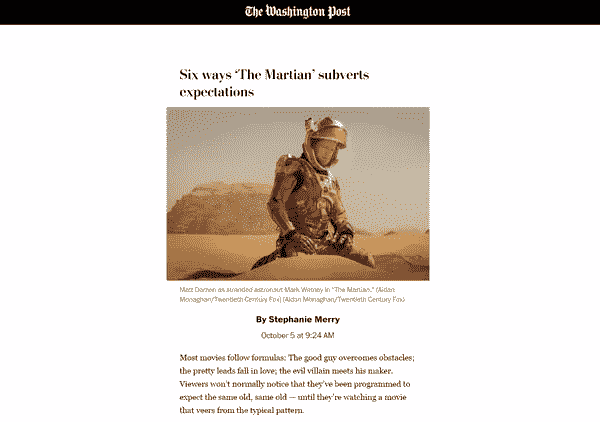
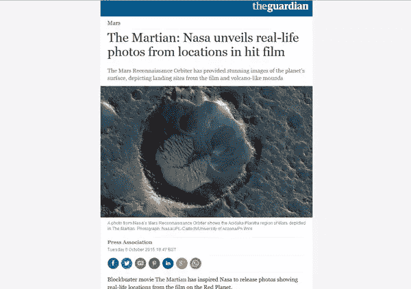
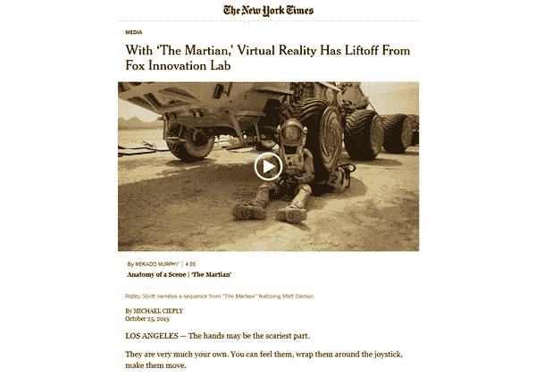
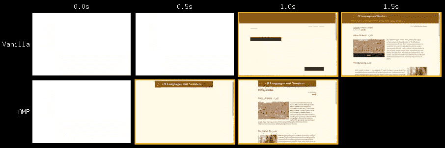
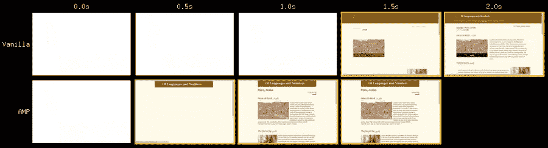
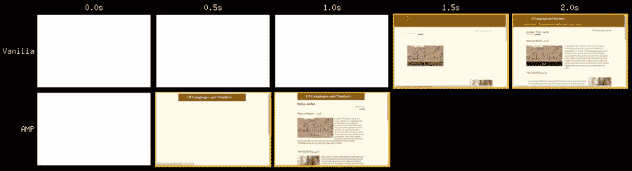
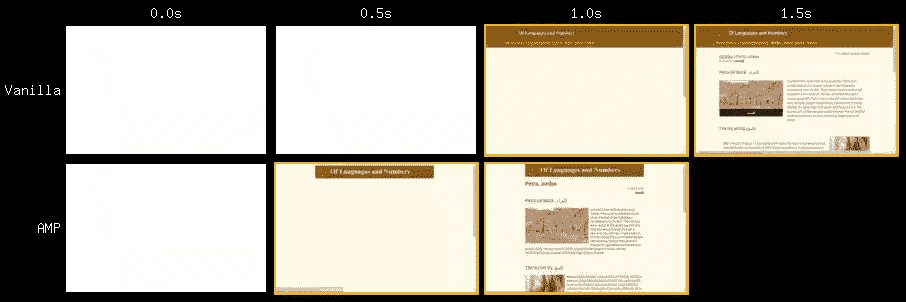
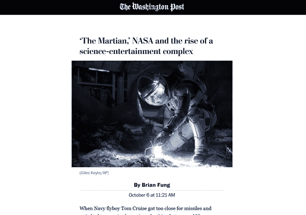

# 谷歌加速移动页面(AMP)简介

> 原文：<https://www.sitepoint.com/an-introduction-to-googles-accelerated-mobile-pages-amp/>

*此文也有[法文](https://www.linkedin.com/pulse/introduction-%C3%A0-lamp-de-google-accelerated-mobile-pages-alexis-ulrich)*

自从十月初在[推出](https://googleblog.blogspot.ca/2015/10/introducing-accelerated-mobile-pages.html)以来，谷歌的加速移动页面计划得到了大量曝光。让我们看看它是什么，它是如何工作的，以及如何发布自己的 AMP HTML 页面。

## 速度很重要

在这个速度的时代，一个超过几秒钟加载的页面正在失去吸引力，这在手机上尤为重要。

许多研究表明，页面负载对销售有直接影响。例如，[转换率在一秒钟后下降 27%，而跳出率在同样长的时间后下降 56%](https://www.soasta.com/blog/mobile-web-performance-monitoring-conversion-rate/) 。

在搜索引擎优化方面，[页面速度是谷歌排名的众多因素之一](https://www.mattcutts.com/blog/site-speed/)，因此如果速度太慢，你的网站的可见性就会受到威胁。

因此，用户体验、商业目标和可查找性都会受到站点速度的影响。

响应式的网页设计和精心制作的网站是解决方案的一部分。在处理这些问题时，我们不能责怪别人，否则我们很快就会被关在有围墙的花园里。

[脸书的即时文章](https://instantarticles.fb.com/)和[苹果新闻](https://www.apple.com/news/)都在用自己的方式回答这些问题。幸运的是， [AMP 项目](https://www.ampproject.org)虽然是由谷歌推广的，但它是一个开源项目，你应该试一试。



*[来源](https://www.washingtonpost.com/amphtml/lifestyle/style/six-ways-the-martian-subverts-expectations/2015/10/05/6bba4d42-6873-11e5-8325-a42b5a459b1e_story.html)*

## AMP 功能概述

性能最佳实践内置于 <abbr title="Accelerated Mobile Pages">AMP</abbr> 中:组件上的异步调用和延迟加载，加载页面时没有重绘，没有 <abbr title="Flash Of Unstyled Content">FOUC</abbr> 效果，内联关键 CSS，没有大量使用 <abbr title="Central Processing Unit">CPU</abbr> 和 <abbr title="Graphics Processing Unit">GPU</abbr> ，最少的 JavaScript 使用，脚本默认使用 <abbr title="Content Delivery Detwork">CDN</abbr> ，以及最小的跟踪足迹。

在开发快速渲染页面时，我们应该牢记的一切都已经为我们强制实施了:

*   HTML 的[子集，带有由 JavaScript 运行时呈现器处理的](https://github.com/ampproject/amphtml/blob/master/spec/amp-tag-addendum.md)[几个新标签](https://github.com/ampproject/amphtml/blob/master/spec/amp-html-format.md)；
*   仅允许 CSS 的[子集；](https://github.com/ampproject/amphtml/blob/master/spec/amp-html-format.md)
*   一个 JavaScript 来管理它们，只有少数允许的扩展脚本，所有这些都通过 Google 的 CDN 交付；
*   每个组件的宽度和高度都声明为在异步加载时防止任何重画。



*[来源](https://www.theguardian.com/science/2015/oct/06/mars-photos-the-martian-movie-nasa/amp)*

## AMP 页面剖析

这里是一个极简 AMP 页面:

```
<!doctype html>
<html amp lang="en">
  <head>
    <meta charset="utf-8">
    <link rel="canonical" href="__CANONICAL_URL__" >
    <meta name="viewport"
          content="width=device-width,minimum-scale=1,initial-scale=1">
    <style>body {opacity: 0}</style>
    <noscript>
      <style>body {opacity: 1}</style>
    </noscript>
    <style amp-custom> __YOUR_OWN_CSS__ </style>
    <script async src="https://cdn.ampproject.org/v0.js">  </script>
  </head>
  <body>
    Your actual content.
  </body>
</html>
```

正如你所看到的，有一个默认的样式，你可以添加你自己的内联 CSS，和一个异步调用的脚本托管在 CDN 上。我们还有一个 viewport 元标签和一个规范链接。仅此而已。

**样式**
你可以在`<style amp-custom>`元素中添加自己的样式。然而，[并不是所有的功能都被允许](https://github.com/ampproject/amphtml/blob/master/spec/amp-html-format.md)。

**JavaScript**
AMP JavaScript 库包含内置组件，并在后台处理外部资源的加载，尽可能广泛地延迟加载。它还负责页面的绘制。



*[来源](http://mobile.nytimes.com/2015/10/26/business/media/virtual-reality-has-liftoff-from-fox-innovation-lab.amp.html)*

## 动手问答

如何验证我的 AMP HTML 代码？
谷歌 Chrome 的 DevTools 内提供了代码的验证。导航到在 URL 末尾添加了散列值 *#development=1* 的页面可以进行验证。

**如何在普通 HTML 页面中引用 AMP HTML 页面？**
AMP 页面被声明为替代类型的内容，有点像 RSS 提要。然而，用于 RSS 的完整自动发现机制还没有实现，因为它需要创建另一种 MIME 类型，如`text/amphtml`。

相反，我们在匹配的常规 HTML 页面头中为`<link>`标签的`rel`属性使用一个新值。

```
<link rel="amphtml" href="__MY_AMP_URL__">
```

如何告诉浏览器 AMP HTML 页面的存在？
我们可以告诉浏览器一个 AMP 页面是一个成熟的 HTML 页面的版本。因为我们不希望有任何重复内容损失，所以我们将该页面声明为规范页面。

```
<link rel="canonical" href="__MY_REGULAR_HTML_PAGE__">
```

使用这种新形式的 SEO 优势是什么？
正如我们在上面看到的，AMP 页面是普通页面的相关版本，被声明为规范的。搜索引擎不会同时列出这两个页面，只会列出规范页面——除非搜索是在移动设备上进行的，在这种情况下，AMP 页面可能会受到青睐。

当搜索特定的新闻项目时，会显示一个带有匹配 AMP 页面预览的转盘，正如你在 Addy Osmani 的 YouTube 视频中看到的[。](https://www.youtube.com/watch?v=i2_lAEzmOPo)

**为什么 AMP HTML 有一个隐藏了< body >元素的 CSS 规则？**
客户端不支持 JavaScript 时，`<body>`元素默认隐藏，CSS 不透明。由于整个布局是由 AMP 的 JavaScript 呈现的，所以临时隐藏的主体可以防止显示一个损坏的页面。

这样做还有另一个好处，因为它可以防止使用 CSS 字体时出现任何 <abbr title="Flash Of Unstyled Text">FOUT</abbr> 效果。通常，浏览器一遇到应用于文档元素的样式中的 CSS 字体就加载它，因此它可以在调用外部字体之前开始呈现页面。在 AMP 页面中，一旦加载了页面中使用的字体，不透明度样式就会被删除。

**如何嵌入图像？**T5``元素不被 AMP 支持，被`<amp-img>`元素替代。一个 [AMP image](https://github.com/ampproject/amphtml/blob/master/builtins/amp-img.md) 必须设置它的宽度和高度，并提供对一个`attribution`属性的支持。

```
<div class="image_container">
  <amp-img
    src="pine-trees-snow.jpg"
    alt="Pine trees covered with snow"
    width="220" height="318">
</div>
```

**如何嵌入视频？**
html 5`<video>`元素被 [amp-video](https://github.com/ampproject/amphtml/blob/master/builtins/amp-video.md) 元素取代，是内置组件。

在支持的扩展中，你可以找到一个 [YouTube 扩展](https://github.com/ampproject/amphtml/blob/master/extensions/amp-youtube/amp-youtube.md)来处理 YouTube 视频。与其他扩展一样，您需要在页面的`<head>`中调用特定的 JavaScript 来支持它，在本例中:

```
<script async
  custom-element="amp-youtube"
  src="https://cdn.ampproject.org/v0/amp-youtube-0.1.js">  </script>
```

如果您想要支持响应视频，组件的宽度和高度值应该匹配 16:9 的纵横比。

```
<amp-youtube
  data-videoid="SqT0glwuYYo"
  layout="responsive"
  width="480" height="270">
</amp-youtube>
```

还有其他可用的组件吗？
AMP 组件分为内置组件(直接由主 JavaScript 渲染器支持)和扩展组件(需要为每个组件调用特定的脚本)。

[当前内置组件列表](https://github.com/ampproject/amphtml/tree/master/builtins)包括:

*   amp-ad:显示广告的容器
*   amp-img:HTML``元素的替换
*   amp-pixel:用作跟踪像素来计算页面浏览量
*   amp-video:html 5`<video>`元素的替换

[当前扩展名列表](https://github.com/ampproject/amphtml/tree/master/extensions)包括:

*   amp-anim:运行时管理的动画图像，通常是 GIF
*   amp-audio:html 5`<audio>`元素的替换
*   amp-carousel:通用的圆盘传送带，用于沿水平轴显示多条相似的内容
*   amp-fit-text:放大或缩小字体大小以适应给定空间内的内容
*   显示一个 iframe 元素
*   amp-image-lightbox:允许“图像灯箱”或类似的体验
*   amp-instagram:显示 instagram 嵌入
*   amp-lightbox:允许“灯箱”或类似的体验
*   amp-twitter:显示一条推文
*   amp-youtube:显示 youtube 视频

如何显示来自 Google AdSense 的广告？
[*amp-ad*组件](https://github.com/ampproject/amphtml/blob/master/builtins/amp-ad.md)用于显示广告。与其他组件一样，必须设置宽度和高度值(我猜您现在已经习惯了)。

要显示 AdSense 广告，代码如下(不要忘记用自己的值替换`data-ad-client`和`data-ad-slot`属性的值)。

```
<amp-ad width="300" height="200" type="adsense"
  data-ad-client="ca-pub-1234567890123456"
  data-ad-slot="1234567890">
</amp-ad>
```

目前支持的广告网络有 [A9](https://github.com/ampproject/amphtml/blob/master/ads/a9.md) 、 [AdReactor](https://github.com/ampproject/amphtml/blob/master/ads/adreactor.md) 、 [AdSense](https://github.com/ampproject/amphtml/blob/master/ads/adsense.md) 、 [AdTech](https://github.com/ampproject/amphtml/blob/master/ads/adtech.md) 和 [Doubleclick](https://github.com/ampproject/amphtml/blob/master/ads/doubleclick.md) 。每一个都有自己的属性。
你也可以[从自定义域名](https://github.com/ampproject/amphtml/blob/master/builtins/amp-ad.md)投放广告。

如何使用 Google Analytics 跟踪我的访客？
跟踪器是通过 [amp-pixel 元素](https://github.com/ampproject/amphtml/blob/master/builtins/amp-pixel.md)来实现统计页面浏览量的。要在 AMP 页面上使用谷歌分析跟踪器，您需要遵循[分析测量协议](https://developers.google.com/analytics/devguides/collection/protocol/v1/reference):

```
<amp-pixel src="https://ssl.google-analytics.com/collect?v=1
                &tid=UA-12345678-1&t=pageview&cid=__CID__
                &dt=__PAGE_TITLE__&dl=__PAGE_URL__
                &z=__RANDOM_STRING__">
</amp-pixel>
```

客户端 ID ( `CID`值)在服务器端生成为[有效 v4 UUID](https://en.wikipedia.org/wiki/Universally_unique_identifier#Version_4_.28random.29),`PAGE_TITLE`和`PAGE_URL`应该是 URL 编码的，`z`参数是缓存破坏者。

## 速度加快了

安迪·戴维斯向我们展示了由《卫报》和 BuzzFeed 实现的 AMP 页面的一些好处。通过使用[网页测试](http://www.webpagetest.org)，他描绘了一幅各种网络速度提升的复杂画面。

这里有一个相同的比较，一个普通的网站位于法国的一个服务器上，从美国纽约打来。最上面的一组图片是当前[成熟的网页](http://www.languagesandnumbers.com/articles/en/petra-jordan)，最下面的是 [AMP 版本](http://www.languagesandnumbers.com/articles-amp/en/petra-jordan)。

**3G**
T3

**3GFast**
[](http://www.webpagetest.org/video/compare.php?tests=151031_7G_JCX-r%3A1-c%3A0,151031_FY_JCZ-r%3A1-c%3A0)

**电报**
[](http://www.webpagetest.org/video/compare.php?tests=151031_H8_JQV-r%3A1-c%3A0%2C151031_E9_JR0-r%3A1-c%3A0)

**无网络塑形**
[](http://www.webpagetest.org/video/compare.php?tests=151031_8J_JT9-r%3A1-c%3A0%2C151031_GT_JTA-r%3A1-c%3A0)

普通页面发出 34 个 HTTP 请求，而 AMP 版本只发出 13 个。当然，请求的数量(和页面权重)根据所提供的广告而变化。AMP 版本总是更快，它比 vanilla 版本早大约半秒开始渲染，有时甚至在 vanilla 版本开始渲染之前就完成了视觉效果(在 3G 和电缆连接上)。

一旦您在自己的代码结构中有了工作示例，我热情地邀请您参加测试，因为结果在很大程度上取决于您已经实现的优化。



## 一些大出版商的设计理念

AMP 格式已经被出版业的许多大公司所接受。下面是他们中一些人的简短列表，以说明他们对设计简化的看法。

*   卫报:[常规 HTML](http://www.theguardian.com/science/2015/oct/06/mars-photos-the-martian-movie-nasa) / [AMP](https://www.theguardian.com/science/2015/oct/06/mars-photos-the-martian-movie-nasa/amp)
*   华盛顿邮报:[常规 HTML](https://www.washingtonpost.com/lifestyle/style/six-ways-the-martian-subverts-expectations/2015/10/05/6bba4d42-6873-11e5-8325-a42b5a459b1e_story.html) / [AMP](https://www.washingtonpost.com/amphtml/lifestyle/style/six-ways-the-martian-subverts-expectations/2015/10/05/6bba4d42-6873-11e5-8325-a42b5a459b1e_story.html)
*   国家:[普通 html](http://economia.elpais.com/economia/2015/10/04/actualidad/1443971365_887425.html)/
*   圣保罗图纸:[普通 html](http://www1.folha.uol.com.br/ilustrada/2015/10/1700162-com-2-album-rock-psicodelico-do-boogarins-amplia-sucesso-fora-do-pais.shtml)/
*   La Stampa: [常规 HTML](http://www.lastampa.it/2015/10/14/scienza/tuttoscienze/scattata-la-corsa-per-marte-e-non-c-soltanto-la-nasa-wizfUBQ6Ox0PgrOHfZmxDJ/pagina.html) / [AMP](http://www.lastampa.it/2015/10/14/scienza/tuttoscienze/scattata-la-corsa-per-marte-e-non-c-soltanto-la-nasa-wizfUBQ6Ox0PgrOHfZmxDJ/amphtml/pagina.amp.html)
*   纽约时报:[普通 HTML](http://www.nytimes.com/2015/10/26/business/media/virtual-reality-has-liftoff-from-fox-innovation-lab.html) / [AMP](http://mobile.nytimes.com/2015/10/26/business/media/virtual-reality-has-liftoff-from-fox-innovation-lab.amp.html)
*   大西洋:[常规 HTML](http://www.theatlantic.com/politics/archive/2015/10/a-short-history-of-whether-obama-is-black-enough-featuring-rupert-murdoch/409642/) / AMP

## 现在轮到你了

[加速移动页面](https://www.ampproject.org/)计划完全是为了提高页面交付速度。为了执行其规则，应用了许多限制——但在这些限制中存在专注于内容的真正自由。

在本文中，您已经看到了开发简单但功能齐全的页面所需的步骤，这些页面包含图片、视频、广告和跟踪器。动画、旋转木马、SVG 和许多其他组件可用于创建出色的用户体验。

如果能在评论里分享一下自己的创作就太好了。

## 分享这篇文章