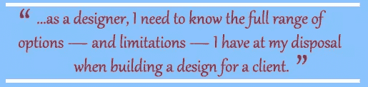
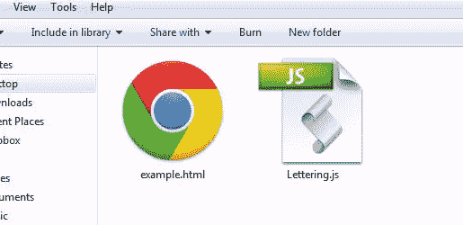
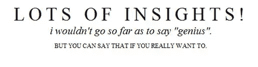

# 面向设计者的 jQuery 介绍

> 原文：<https://www.sitepoint.com/an-introduction-to-jquery-for-designers/>


我发现使用 jQuery 是一种可怕的经历，因为我不是开发人员。实现 JavaScript 是“他们”在网站后端做的事情，但与我创建网站设计的过程没有什么关系。

但作为一名设计师，我需要知道在为客户设计时，我拥有的所有选择和限制。jQuery 为设计提供了一些令人惊叹的选项。如果我想成为这个领域的顶尖人物，我觉得我需要把自己从盒子里推出来，学习 jQuery 到底是怎么一回事。

[](https://www.sitepoint.com/wp-content/uploads/2012/01/02-quote.jpg)

### 什么是 jQuery？

简而言之，它是一个代码库，让你告诉网络浏览器如何做一些有趣的事情。更简短、更技术性的描述是，jQuery 是一个 JavaScript 库，它使快速实现 AJAX、CSS 和其他 web 技术变得容易，并在各种浏览器——甚至是移动浏览器——之间获得一致的结果。

现在，后退一步，不要惊慌(深呼吸！).正如我将要演示的，你不需要知道所有这些技术上的东西是什么，就可以理解 jQuery 如何让你的设计更具交互性和令人兴奋。

### 为什么我需要了解 jQuery？

我知道有些人会坚决反对我，但是 jQuery 就是未来。更重要的是，jQuery 为您提供了一套全新的设计工具，作为设计师，您应该了解这些工具。如果你不知道某些功能，你永远不会使用它们。jQuery 提供了一系列全新的可视化机会。

作为一名设计师，你至少需要知道你有哪些选择来实现客户的愿景。如果您知道如何实现 jQuery 之类的东西，您将变得更有价值。

### jQuery 能为我的设计做些什么？

很多。从排版升级，到图片库，再到漂亮的评论表格——jQuery 已经有数千个预建的现成资源，可以极大地改善你的设计的外观和感觉。

一旦你对 jQuery 有了一点了解，你的设计选项就会爆炸。您可能会发现这项技术非常容易使用，并且可以创建自己的代码。至少，你可以开始寻找你可能完全没有探索过的设计工具。

### 实现 jQuery 有多难？

这其实很容易，但你必须以正确的方式开始。我会解释得好像你以前从未使用过 HTML 一样。您可以将此代码复制并粘贴到文本编辑器中，并保存为. HTML 文件，它将在浏览器中打开。用文件名“example.html”保存您的文件，这样我们就能保持一致了:

```
<html>
<head>
<title>jQuery for Designers</title>
</head>
<body>
Lots of insightful stuff here.
</body>
</html>
```

*jQuery 示例#1*

现在这已经是最基本的了，我为那些已经非常熟悉 HTML 的设计师们感到抱歉。很快就好了。

现在，在 HTML 文档的这一部分，我们将使用这个简单的代码来实现 jQuery(突出显示以示强调):

```
<html>
<head>
<title>jQuery for Designers</title>

<script type="text/javascript" src="https://ajax.googleapis.com/ajax/libs/jquery/1.7.1/jquery.min.js"></script>

</head>
<body>
Lots of insightful stuff here.
</body>
</html>
```

*jQuery 示例 2*

这里有几个要点。首先，我引用的是 Google 托管的一个文档。你可以下载这个文件并把它放在你的网站上，但是我更喜欢让大公司来托管这些文件，这样我的服务器就不会有压力了。你可能想参考别人而不是谷歌。该文件的另外两个流行来源是微软和 T2 媒体圣殿。这些文件位于开发人员社区中称为内容交付网络(CDN)的地方，这些文件可供公众使用。

回到代码，我们所做的就是告诉浏览器运行 JavaScript。如果您将它复制并粘贴到新文档中，您将看不到对网页的任何更改。至少现在还没有。

让我们来测试一下，看看发生了什么。如果你从未深入研究过 web 开发，这将是一个令人激动的时刻。新代码突出显示:

```
<html>
<head>
<title>jQuery for Designers</title>
<script type="text/javascript" src="https://ajax.googleapis.com/ajax/libs/jquery/1.7.1/jquery.min.js"></script>

<script type="text/javascript">
$(document).ready(function(){
alert("I made a jQuery!");
});
</script>

</head>
<body>
Lots of insightful stuff here.
</body>
</html>
```

*jQuery 示例 3*

将它粘贴到一个空白文档中，保存为 HTML 文件，然后在浏览器中打开它。您将看到一个漂亮的弹出窗口，显示“我做了一个 jQuery！”消息。为了证明这实际上是一个简单的 jQuery 实现而不仅仅是 JavaScript，注释掉 jQuery 脚本并运行相同的代码:

```
<html>
<head>
<title>jQuery for Designers</title>

<!-- <script type="text/javascript" src="https://ajax.googleapis.com/ajax/libs/jquery/1.7.1/jquery.min.js"></script> -->

<script type="text/javascript">
$(document).ready(function(){
alert("I made a jQuery!");
});
</script>
</head>
<body>
Lots of insightful stuff here.
</body>
</html>
```

*jQuery 示例#4*

你看，妈妈！没有弹出窗口！这是因为您没有调用 jQuery 来告诉浏览器应该打开警告框。删除注释或者只粘贴上面示例 2 中的代码，这样就有了所需的 jQuery 代码参考。

### 所以我做了一个弹出窗口。现在怎么办？

是的，所以弹出的例子非常简单，但是如果您从未自己完成过实现 jQuery 的步骤，这对您来说是一个巨大的飞跃。所以不要太轻视它，尽管你可以随意取笑我的弹出窗口。

接下来要做的是找到想要实现的 jQuery。选择很多！根据你的需要，你可以找到各种各样的奇特效果来应用到你的网页上。

### 你能告诉我如何实现一个 jQuery 插件吗？

当然可以！我将用我最喜欢的(新)jQuery 插件之一——由 Davatron5000 开发的 Lettering，带您看一个例子。

首先，您需要下载 jQuery 代码，它几乎总是一个. JS 文件，就像上面例子中的“jquery.min.js”。[可以从 Github](https://github.com/davatron5000/Lettering.js/blob/master/jquery.lettering.js) 下载 Lettering.js。将代码复制到一个空白的文本文档中，并将其作为 Lettering.js 保存在与您的【example.html】文件*相同的文件夹中。*

其次，将 Davatron5000 中的脚本添加到上面的示例 2 代码中:

```
<html>
<head>
<title>jQuery for Designers</title>
<script type="text/javascript" src="https://ajax.googleapis.com/ajax/libs/jquery/1.7.1/jquery.min.js"></script>

<script type="text/javascript" src="Lettering.js"></script>
<script>
$(document).ready(function() {
$("#triple_threat").lettering('lines');
});

</script>

</head>
<body>
Lots of insightful stuff here.
</body>
</html>
```

*jQuery 示例# 5–添加 Lettering.js 并调用“lines”函数*

所以让我们慢一点。在从上往下数的第五行中，我们引用了新的 Lettering.js 文件。您可以将该文件放在 web 服务器上，并在某个时候直接引用它。

接下来我们来看看我们的剧本。我把这个小东西叫做“三重威胁”,因为我要把字体分成三行。Lettering.js 可以做很多令人惊讶的事情，包括自动将每个字母分解成它自己的 CSS 类，这样你就可以非常容易地操作每个字母。

我不想重复每封信的动作，我只想要三行。为了做到这一点，我引用了代码“刻字(‘线’)，正如你在第八行看到的。你也可以将代码留空，将每个字母分开。刻字()；。或者，通过使用“单词”,你可以让它自动分解每个单词。

为了确保我们在同一页上，您的文件夹的内容应该是这样的:

[](https://www.sitepoint.com/wp-content/uploads/2012/01/03-folder-contents.jpg)

既然 Lettering.js 已经使用 jQuery 来分解 HTML，我们需要一些 CSS 来施展我们的魔法。将上面的代码添加到示例 5 中:

```
<html>
<head>
<title>jQuery for Designers</title>
<script type="text/javascript" src="https://ajax.googleapis.com/ajax/libs/jquery/1.7.1/jquery.min.js"></script>
<script type="text/javascript" src="Lettering.js"></script>
<script>
$(document).ready(function() {
$("#triple_threat").lettering('lines');
});
</script>

<style type="text/css">
#triple_threat .line1{
font-size: 38px;
text-transform: uppercase;
display:block;
text-align:center;
letter-spacing: 8px;
}

#triple_threat .line2{
font-size: 21px;
text-transform: lowercase;
font-style: italic;
display:block;
text-align:center;
margin-bottom: 6px;
}

#triple_threat .line3{
font-size: 13px;
text-transform: uppercase;
display:block;
text-align:center;
line-height: 24px;
}
</style>

</head>
<body>
Lots of insightful stuff here.
</body>
</html>
```

*jQuery 示例 6–添加 CSS*

我们现在有一些 CSS 类。您可以参考“triple_threat”类并查看结果。因此，让我们将该类添加到我们的 example.html 中。记住，我们需要三行，所以我们将使用
标签来创建它们。对于那些 HTML 新手来说，我知道这是大量的信息，但现在只是复制和粘贴，如果需要的话，以后再研究这些概念。

```
<html>
<head>
<title>jQuery for Designers</title>
<script type="text/javascript" src="https://ajax.googleapis.com/ajax/libs/jquery/1.7.1/jquery.min.js"></script>
<script type="text/javascript" src="Lettering.js"></script>
<script>
$(document).ready(function() {
$("#triple_threat").lettering('lines');
});
</script>
<style type="text/css">
#triple_threat .line1{font-size: 38px; text-transform: uppercase; display:block; text-align:center; letter-spacing: 8px; } #triple_threat .line2{font-size: 21px; text-transform: lowercase; font-style: italic; display:block; text-align:center; margin-bottom: 6px; } #triple_threat .line3{font-size: 13px; text-transform: uppercase; display:block; text-align:center; line-height: 24px; }
</style>
</head>
<body>

<p id="triple_threat">Lots of insights!<br />
I wouldn't go so far as to say "genius".<br />
But you can say that if you really want to.<br />
</p>

</body>
</html>
```

*jQuery 示例# 7–实现 jQuery*

我合并了 CSS 以节省空间，并添加了“三重威胁”段落。结果并不惊人，但是如果您成功地转换了角色，那么您就实现了 jQuery！

[](https://www.sitepoint.com/wp-content/uploads/2012/01/01-jquery-lettering.jpg)

### 我上钩了！我在哪里可以找到更多信息？！

很高兴你问了。jQuery 代码方面的主要来源在 jQuery.com[结束。](http://www.jquery.com)

对于您现在可以使用的 jQuery 插件，请查看以下资源:

*   [jQueryPlugins.com](http://www.jqueryplugins.com/)
*   [巨大的滑块和旋转效果列表](http://www.tripwiremagazine.com/2012/01/jquery-slider.html)
*   [另一个滑块例子](http://www.awkwardgroup.com/sandbox/awkward-showcase-a-jquery-plugin/)
*   [光滑的灯箱效果](http://ajwebdesigner.in/blog/5-awesome-jquery-lightbox-useful-for-website/)
*   [布局 jQuery 插件的加载](http://www.webresourcesdepot.com/28-high-quality-jquery-plugins-for-building-responsive-websites/)
*   [来自 DesignFestival.com 的精彩幻灯片](https://www.sitepoint.com/how-to-create-a-showcase-with-jquery/)
*   [表单验证](https://www.sitepoint.com/pretty-inputs-help-users-enter-the-right-data-with-jquery/)

欢迎来到 jQuery 的世界，你这个聪明的设计师，你！一定要让我知道哪些 jQuery 插件成为你的最爱！

## 分享这篇文章