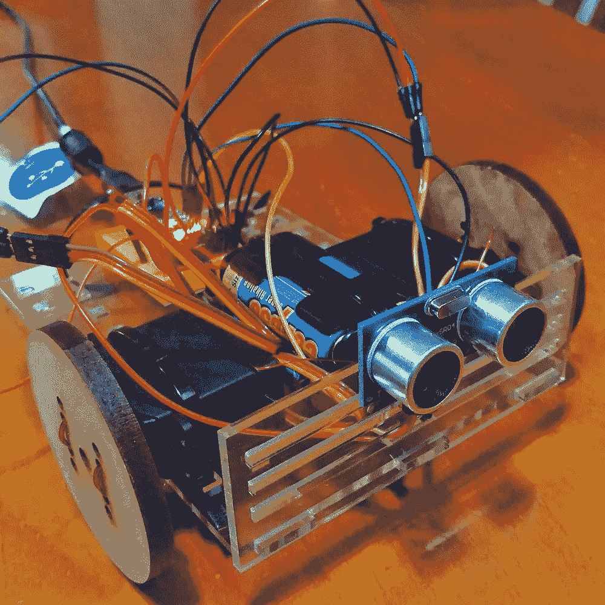

# 节点机器人简介

> 原文：<https://www.sitepoint.com/an-introduction-to-nodebots/>

许多网络开发人员都希望有机会建造一个可以通过 JavaScript 控制的非常酷的机器人，对吗？我在这里告诉你，这在今天已经成为可能！就现在。

节点机器人已经存在了一段时间，它们周围的社区正在像野火一样增长。在这篇文章中，我将解释什么是节点机器人，它们是如何工作的，以及你如何开始修补机器人的创作。

## 什么是微控制器？

在我深入讨论之前，我们会经常提到微控制器。微控制器是一种非常简单的微型计算机。它有一个简单的物理可编程电路板，可以检测各种输入并发送输出。Arduino 是一种微控制器。这实际上是新人最常尝试的方法之一。也有其他种类的微控制器可以由节点供电，包括[粒子板](http://particle.io)(我的最爱！)、 [BeagleBone 板](http://beagleboard.org/)、 [Tessel 板](https://tessel.io)(板本身运行在 JS 上)和 [Espruino 板](http://www.espruino.com/)(也运行在 JS 上)。在本文中，我将重点关注 Arduinos，因为它们是最常见的。

## 什么是节点机器人？

节点机器人(字面意思)是一种或另一种可以通过节点控制的机器人。他们可以拥有一切，从轮子、可移动的手臂和腿、运动探测器、相机、LED 显示屏、播放声音的能力等等。唯一的限制是你的想象力和你能找到并组装起来的组件！

NodeBots 的整个想法是通过 Node.js 不断增强的功能和一些开发人员的兴趣发展起来的，这些开发人员包括[尼古拉·翁肯](http://twitter.com/nonken)、[约恩·扎弗勒](http://twitter.com/bassistance)、[克里斯·威廉姆斯](http://twitter.com/voodootikigod)、[朱利安·戈蒂埃](https://twitter.com/jagautier)和[里克·沃尔德伦](https://twitter.com/rwaldron)，他们致力于开发我们今天在 NodeBots 中使用的各种节点模块。由克里斯·威廉姆斯开发的名为 [node-serialport](https://github.com/voodootikigod/node-serialport) 的节点包启动了这一切，允许通过低级别的串口读写来访问真实世界的设备。

Julian Gautier 随后使用他的 Node.js [Firmata](https://github.com/jgautier/firmata) 库中的 JavaScript 实现了 Firmata 协议，该协议用于通过计算机上的软件访问 Arduinos 等微控制器。

里克·沃尔德伦更进了一大步。使用 Firmata 库作为构建模块，他创建了一个完整的 JavaScript 机器人和物联网编程框架，名为 [Johnny-Five](https://github.com/rwaldron/johnny-five) 。Johnny-Five 框架使得控制从 led 到各种类型的传感器变得相对简单和容易。这是许多节点机器人现在用来实现一些非常令人印象深刻的壮举！

## 从哪里开始

如果你对构建机器人和任何一种真实世界的 JavaScript 控制的设备完全陌生，那么有大量令人难以置信的资源供你开始使用。我建议你做的第一件事是给自己找一个好的 Arduino 套件，它提供了一系列的组件和传感器，给你一系列的项目来玩。下面，我列出了一些来自不同公司的 Arduino 初学者工具包。如果下面的列表看起来势不可挡，不要担心！它们都包含非常相似的组件，对于初学者来说都是很好的选择。

### 初学者工具包

*   **SparkFun 发明家套件**。这是几年前为我开启这一切的套件！它配备了一系列标准组件，如彩色 LED 灯、传感器、按钮、电机、微型扬声器等。它还附带了一个指南和示例项目，您可以使用它们来培养您的技能。你可以在这里找到: [SparkFun 发明家工具包](https://www.sparkfun.com/products/12060)。
*   **用于 Arduino 的 Freetronics 实验者套件**。这个工具包是由澳大利亚的一家名为 Freetonics 的公司开发的。它的组件与 SparkFun 非常相似，只是有一些小差异。它也有自己的示例项目指南。对于那些总部设在澳大利亚，这些套件和其他自由电子零件可在 Jaycar。你也可以在这里在线订购: [Freetronics 实验者套件](http://www.freetronics.com.au/collections/kits/products/experimenters-kit-for-arduino#.VaxII2SIFk0)。
*   **Seeed Studio ARDX 入门套件**。Seeed Studio 也有自己的初学者工具包，它也非常类似于 SparkFun 和 Freetronics。它有自己的指南和诸如此类的东西！你可以在这里找到:[ARDX——Arduino](http://www.seeedstudio.com/depot/ARDX-The-starter-kit-for-Arduino-p-1153.html)的入门套件。
*   **用于 Arduino 的 Adafruit ARDX 实验套件**。这个工具包也非常类似于上面那些有自己的指南。你可以在这里找到:[阿达果 ARDX Arduino 实验套件](http://www.adafruit.com/products/170)。
*   **Arduino 入门套件**。Arduino.cc 的人也有他们自己的官方装备。初学者工具包与上面的工具包类似，但是有一些有趣的示例项目，如“Love-O-Meter”。你可以在这里找到，也经常在其他经销商那里找到:Arduino Starter Kit。

对于上述所有工具包，请记住它们都不是针对 NodeBot 开发的。所以小册子中的例子是用 Arduino 使用的简化 C++代码编写的。有关使用 Node 的示例，请参见下面的参考资料。

## 学习节点机器人的资源

有几个关键点可以让您了解如何在 Web 上整合各种 NodeBot 项目。以下是一些建议:

*   [用 Node.js 和 Johnny-Five](https://www.sitepoint.com/controlling-arduino-nodejs-johnny-five/) 控制 Arduino。这是我不久前录制的一个免费的 SitePoint 截屏，介绍了将 Arduino 连接到 Node.js 并使用该框架打开和关闭 LED 灯的基础知识。
*   [Arduino 实验者指南 NodeJS](http://node-ardx.org/) 。由 Anna Gerber 和 NodeBots 社区的其他成员改编自 SparkFun 版本的。:oomlout:。s ARDX 指南。它展示了如何在 Node 中实现上述工具包中的许多示例，而不是 Arduino 中的简化 C++代码。
*   [Johnny-Five 官方网站](http://johnny-five.io/)。不久前，Johnny-Five 框架发布了一个全新的网站，上面有关于如何在 Arduino 和其他平台上使用该框架的大量文档！
*   [制作:JavaScript 机器人学书籍](http://shop.oreilly.com/product/0636920031390.do)。Rick Waldron 和 NodeBot 社区中的其他人发布了一本新书，提供了一系列使用各种设备的 JS 项目。非常适合那些已经掌握了绝对基础知识并想探索一些新项目的人！
*   [NodeBots 官方网站](http://nodebots.io)。如果你正在寻找一个你附近的本地节点机器人聚会，或者阅读更多关于节点机器人的信息，请访问这个页面。
*   [node bots——JS 机器人的崛起](http://www.voodootikigod.com/nodebots-the-rise-of-js-robotics/)。克里斯·威廉姆斯发表了一篇关于节点机器人如何诞生的伟大文章。对感兴趣的人来说，这是一本好书。

### 简单机器人

安德鲁·费希尔，一位澳大利亚 NodeBot 爱好者，为人们的第一次 NodeBot 体验搭建了一个相当简单的项目。它被称为“简单机器人”，名副其实。这是一个节点机器人，你通常可以在一天内完成。如果你热衷于让一个真正的机器人启动并运行，而不仅仅是一套基本的传感器和灯的开关，这是一个很好的项目选择。正是出于这个原因，它以一种门票形式提供给 NodeBots 日的澳大利亚参与者(见下文)!这是一个有轮子和超声波传感器的机器人，可以检测它是否会撞到东西。这是我自己完成的版本——几年前我为 NodeBots 日准备的样本:

在 SimpleBot GitHub repo 的[中可以找到所需的 SimpleBot 材料列表和一些 Node.js 示例代码。安德鲁在 YouTube 上还有一段视频，展示了](https://github.com/nodebotsau/simplebot)[如何组装简易机器人](https://youtu.be/KoACCjtkHIg)。

安德鲁还与 Freetronics 的团队合作，组装了一个 SimpleBot Arduino 盾牌，对于那些想尝试一下而不需要焊接任何东西的人来说，这可能也很有用。

## 结论

对节点机器人世界的简单介绍到此结束！如果您有兴趣参与，您已经获得了开始 NodeBot 体验所需的所有信息。

如果你想更多地参与节点机器人，请关注一年一度的国际节点机器人日。(每年 7 月左右发生。)在这一天，世界各地各种各样的人聚集在一起参加各种活动，构建 JavaScript 驱动的机器人，度过一段美好的时光。

如果你用上面的资源为自己建造了一个非常漂亮的 NodeBot，请在评论中留言或在 Twitter 上联系我( [@thatpatrickguy](http://www.twitter.com/thatpatrickguy) )，我很乐意看看你的 JavaScript 驱动的机器人！

## 分享这篇文章