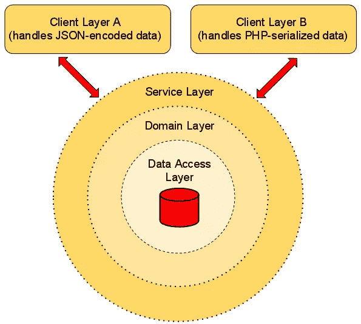

# 服务介绍

> 原文：<https://www.sitepoint.com/an-introduction-to-services/>

诚然，这个概念来自经验领域而不是学术领域，但它非常适用于现实世界的实用主义——大多数软件应用程序的行为非常像异想天开的婴儿，不可避免地“倾向于”随着时间的推移而变得越来越大和越来越复杂。让婴儿到处健康成长没有什么本质上的错误，但是应用程序的情况可能会完全不同，特别是当他们变得臃肿、扭曲，与他们曾经可爱的小生物没有什么关系的时候。

问题不在于增长本身，因为让一个经得起未来考验的应用程序向更远的地方展开翅膀可能是一个好设计的标志。真正的问题是，扩展过程是以分散在不同层的冗余样板实现为代价的。我们都经历过这种情况，我们都知道逻辑复制是一种严重的软件疾病。

即使可信的编程技术有助于去除重复的逻辑，有时它们本身也不足以解决问题。一个明显的例子是 MVC 模型([领域模型](http://martinfowler.com/eaaCatalog/domainModel.html)，而不是引人注目的、包罗万象的数据库模型)在宽松的隔离中完成它的业务，然后瘦控制器通过[映射器](http://martinfowler.com/eaaCatalog/dataMapper.html)或[存储库](http://martinfowler.com/eaaCatalog/repository.html)获取模型的数据，将其传递给视图或任何其他输出处理器以进一步渲染。该计划可能会实现，但它的规模不大。

假设模型数据应该以某种额外的方式进行处理，并连接到外部 API，如脸书、Twitter、第三方邮件程序等等，在多个地方*。在这种情况下，整个按摩/接口过程是从上到下的应用逻辑，因此是控制器的责任。在您知道之前，您被迫在一堆控制器之间复制相同的逻辑，从而将您的脚趾放在逻辑复制的禁区上。终结了。*

 *如果你像我一样，你可能想知道如何在不碰壁的情况下解决这个问题。事实上，有几种方法可以很好地完成这项工作。有一个特别吸引我的地方，因为它与领域模型配合得很好，因此与[领域驱动设计](http://en.wikipedia.org/wiki/Domain-driven_design)配合得很好。更重要的是，如果你看过文章的标题，你可能已经猜到我指的是服务。

## 什么是服务？

服务是位于域模型之上的抽象层，它封装了单个 API 背后的通用应用程序逻辑，以便不同的客户端层可以轻松使用。

不要让这个定义吓到你，好像你已经使用 MVC 一段时间了，很可能你已经使用过一个服务了。控制器通常被称为服务，因为它们执行应用程序逻辑，此外还能够连接到几个客户端层，即视图。当然，在要求更高的环境中，如果没有上述的复制，简单的控制器在处理几个客户端时会失败，所以这就是为什么独立层的构造更适合这种情况。

## 创建一个简单的领域模型

当处理企业级应用程序时，服务是真正的杀手，这些应用程序的主干建立在丰富的领域模型的支柱上，并且与多个客户端的交互是常规而不是例外。这并不意味着你不能为你的下一个宠物博客项目使用服务，因为事实上你可以，而且很可能没有人会因为这样一个史诗般的努力而惩罚你。

不过，我不得不承认，我自己的话迟早会回来困扰我，因为我在这里的“顽皮”计划是从头创建一个服务，它将把由几个用户对象组成的域模型的数据连接到两个独立的客户机层。听起来有些过火，当然，但希望最后能有所启发。

下图简要显示了这个实验性服务将如何在其最基本的级别上运行:



该服务的行为相当琐碎。它的职责可以归结为只是从域模型中获取数据，然后对这些数据进行 JSON 编码/序列化，并向几个客户机公开(客户机层 A 和客户机层 B)。这种方案的美妙之处在于，整个编码/序列化逻辑将存在于模型之上的服务类的 API 之后，从而保护应用程序免受冗余实现问题的影响，同时仍然为将来插入其他客户端敞开大门。

假设构建服务将自下而上进行，那么要构建的第一层是数据访问层(DAL)。由于绑定到基础设施的任务将限于从数据库中存储/获取模型数据，这一层看起来与我在上一篇文章中写的[非常相似。](https://www.sitepoint.com/building-a-domain-model)

随着 DAL 完成它的工作，让我们更进一步，开始提炼领域模型。这一个将是相当原始的，任务是建模一般用户:

```
<?php
namespace Model;

abstract class AbstractEntity
{
    public function __set($field, $value) {
        if (!property_exists($this, $field)) {
            throw new InvalidArgumentException(
                "Setting the field '$field' is not valid for this entity.");
        }

        $mutator = "set" . ucfirst(strtolower($field));
        method_exists($this, $mutator) &&
            is_callable(array($this, $mutator))
            ? $this->$mutator($value) : $this->$field = $value;

        return $this;
    }

    public function __get($field) {
        if (!property_exists($this, $field)) {
            throw new InvalidArgumentException(
                "Getting the field '$field' is not valid for this entity.");
        }

        $accessor = "get" . ucfirst(strtolower($field));
        return method_exists($this, $accessor) &&
            is_callable(array($this, $accessor))
            ? $this->$accessor() : $this->$field;
    }

    public function toArray() {
        return get_object_vars($this);
    }
}
```

```
<?php
namespace Model;

interface UserInterface
{
     public function setId($id);
     public function getId();

     public function setName($name);
     public function getName();

     public function setEmail($email);
     public function getEmail();

     public function setRanking($ranking);
     public function getRanking();
}
```

```
<?php
namespace Model;

class User extends AbstractEntity implements UserInterface
{
    const LOW_POSTER = "low";
    const MEDIUM_POSTER = "medium";
    const TOP_POSTER = "high";

    protected $id;
    protected $name;
    protected $email;
    protected $ranking;

    public function __construct($name, $email, $ranking = self::LOW_POSTER) {
        $this->setName($name);
        $this->setEmail($email);
        $this->setRanking($ranking);
    }

    public function setId($id) {
        if ($this->id !== null) {
            throw new BadMethodCallException(
                "The ID for this user has been set already.");
        }
        if (!is_int($id) || $id < 1) {
            throw new InvalidArgumentException(
                "The user ID is invalid.");
        }
        $this->id = $id;
        return $this;
    }

    public function getId() {
        return $this->id;
    }

    public function setName($name) {
        if (strlen($name) < 2 || strlen($name) > 30) {
            throw new InvalidArgumentException(
                "The user name is invalid.");
        }
        $this->name = htmlspecialchars(trim($name), ENT_QUOTES);
        return $this;
    }

    public function getName() {
        return $this->name;
    }

    public function setEmail($email) {
        if (!filter_var($email, FILTER_VALIDATE_EMAIL)) {
            throw new InvalidArgumentException(
                "The user email is invalid.");
        }
        $this->email = $email;
        return $this;
    }

    public function getEmail() {
        return $this->email;
    }

    public function setRanking($ranking) {
        switch ($ranking) {
            case self::LOW_POSTER:
            case self::MEDIUM_POSTER:
            case self::TOP_POSTER:
                $this->ranking = $ranking;
                break;
            default:
                throw new InvalidArgumentException(
                    "The post ranking '$ranking' is invalid.");
        }
        return $this;
    }

    public function getRanking() {
        return $this->ranking;
    }
}
```

除了做一些典型的 setter/getter 映射，并对数据执行基本的验证之外，`AbstractEntity`和`User`类的行为没有更进一步。不管怎样，它们可以很方便地带来一个小而干净的领域模型，可以随意调整。

模型应该以某种方式连接到 DAL，而不会失去它们彼此之间的原始独立性。实现这一点的一个直接而简单的方式是通过数据映射器的工具。

## 将模型与 DAL 连接起来

如果您曾经处理过这一过程，您就会知道，构建一个能够处理多个域对象并即时捕捉任何阻抗不匹配的全栈数据映射器并不是一项简单的任务，在许多情况下，即使是最大胆的编码人员也能有效地将其拒之门外。但是由于这里的域模型相当简单，所以我计划在这里部署的用户映射器非常简单。

```
<?php
namespace ModelMapper;
use ModelUserInterface;

interface UserMapperInterface
{
    public function fetchById($id);    
    public function fetchAll(array $conditions = array());

    public function insert(UserInterface $user);
    public function delete($id);
}
```

```
<?php
namespace ModelMapper;
use LibraryDatabaseDatabaseAdapterInterface,
    ModelUserInterface,
    ModelUser;

class UserMapper implements UserMapperInterface
{    
    protected $entityTable = "users";

    public function __construct(DatabaseAdapterInterface $adapter) {
        $this->adapter = $adapter;
    }

    public function fetchById($id) {
        $this->adapter->select($this->entityTable,
            array("id" => $id));        
        if (!$row = $this->adapter->fetch()) {
            return null;
        }
        return $this->createUser($row);
    }

    public function fetchAll(array $conditions = array()) {
        $users = array();
        $this->adapter->select($this->entityTable, $conditions);
        $rows = $this->adapter->fetchAll();

        if ($rows) {
            foreach ($rows as $row) {
                $users[] = $this->createUser($row);
            }
        }
        return $users;
    }

    public function insert(UserInterface $user) {
        $user->id = $this->adapter->insert($this->entityTable, array(
            "name"    => $user->name,
            "email"   => $user->email,
            "ranking" => $user->ranking));
        return $user->id;
    }

    public function delete($id) {
        if ($id instanceof UserInterface) {
            $id = $id->id;
        }
        return $this->adapter->delete($this->entityTable,
            array("id = $id"));
    }

    protected function createUser(array $row) {
        $user = new User($row["name"], $row["email"],
            $row["ranking"]);
        $user->id = $row["id"];
        return $user;
    }
}
```

当然，作为一个生产就绪的组件，`UserMapper`类还有很长的路要走，但是它的表现还不错。简而言之，它在域模型上运行一些 CRUD 操作，并通过它的`createUser()`方法重构用户对象。(我把用户更新留给读者做练习，所以准备好享受额外的乐趣吧)。

此外，随着映射器舒适地位于模型和 DAL 之间，向外部世界输出 JSON 编码数据的服务的实现现在应该成为一个更具延展性的过程。通常，在进一步阐述这一概念时，具体的代码示例是难以超越的。所以，现在让我们用几个步骤来构建服务。

## 构建可插拔服务层

有一个普遍的共识，即服务应该是只包装应用程序逻辑的薄容器，这与福勒和 T2 的想法一致。另一方面，业务逻辑应该转移到领域模型的边界之内。由于我喜欢坚持来自高层的聪明建议，这里的服务将坚持这些建议。

说到这里，是时候创建服务层的第一个元素了。这是一个基本接口，它使我们能够在运行时将不同的编码器/序列化器策略注入到服务的内部，而无需修改任何一行客户端代码:

```
<?php
namespace Service;

interface EncoderInterface
{
    public function encode();
}
```

有了上面的接口，产生一些实现者就非常简单了。此外，下面的 JSON 包装器证明了为什么我的说法是正确的:

```
<?php
namespace Service;

class JsonEncoder implements EncoderInterface
{
    protected $data = array();

    public function setData(array $data) {
        foreach ($data as $key => $value) {
            if (is_object($value)) {
                $array = array();
                $reflect = new ReflectionObject($value);

                foreach ($reflect->getProperties() as $prop) {
                    $prop->setAccessible(true);
                    $array[$prop->getName()] =
                        $prop->getValue($value);
                }
                $data[$key] = $array;
            }
        }

        $this->data = $data;
        return $this;
    }

    public function encode() {
        return array_map("json_encode", $this->data);
    }
}
```

如果您发现很容易理解`JsonEncoder`是如何做它的事情的，请确保查看下面设置了一个简单的 PHP 序列化程序的代码:

```
<?php
namespace Service;

class Serializer implements EncoderInterface
{
    protected $data = array();

    public function setData(array $data) {
        $this->data = $data;
        return $this;
    }

    public function encode() {
        return array_map("serialize", $this->data);
    }
}
```

由于编码器和序列化器提供了现成的功能，现在可以放心地实现 JSON 编码和序列化模型数据的服务了。以下是该服务的外观:

```
<?php
namespace Service;
use ModelMapperUserMapperInterface;

class UserService
{
    protected $userMapper;
    protected $encoder;

    public function __construct(UserMapperInterface $userMapper, EncoderInterface $encoder = null) {
        $this->userMapper = $userMapper;
        $this->encoder = $encoder;
    }

    public function setEncoder(EncoderInterface $encoder) {
        $this->encoder = $encoder;
        return $this;
    }

    public function getEncoder() {
        if ($this->encoder === null) {
            throw new RuntimeException(
                "There is not an encoder to use.");
        }
        return $this->encoder;
    }

    public function fetchById($id) {
        return $this->userMapper->fetchById($id);
    }

    public function fetchAll(array $conditions = array()) {
        return $this->userMapper->fetchAll($conditions); 
    }

    public function fetchByIdEncoded($id) {
        $user = $this->fetchById($id);
        return $this->getEncoder()->setData(array($user))->encode();
    }

    public function fetchAllEncoded(array $conditions = array()) {
        $users = $this->fetchAll($conditions);
        return $this->getEncoder()->setData($users)->encode($users);
    }
}
```

乍一看，`UserService`类似乎不敬地坐在用户映射器上，唯一的目的是吃掉它的查找器或充当一个普通的存储库。但实际上它做的远不止这些，因为它的`fetchByIdEncoded()`和`fetchAllEncoded()`方法根据传递给构造函数或设置函数的编码器，将编码/序列化模型数据所需的所有逻辑封装在一个地方。

虽然该类的功能有限，但它简单地展示了如何构建一个服务层，在模型和一些期望以特定格式获取数据的客户端之间进行协调。当然，如果我不向您展示如何最终使用这样一个服务，我会是一个笨蛋，所以，下面的示例使用它从数据库中获取用户:

```
<?php
use LibraryLoaderAutoloader,
    LibraryDatabasePdoAdapter,
    ModelMapperUserMapper,
    ServiceUserService,
    ServiceSerializer,
    ServiceJsonEncoder;

require_once __DIR__ . "/Library/Loader/Autoloader.php";
$autoloader = new Autoloader;
$autoloader->register();

$adapter = new PdoAdapter("mysql:dbname=mydatabase", "myfancyusername", "mysecretpassword");

$userService = new UserService(new UserMapper($adapter));

$userService->setEncoder(new JsonEncoder);
print_r($userService->fetchAllEncoded());
print_r($userService->fetchByIdEncoded(1));

$userService->setEncoder(new Serializer());
print_r($userService->fetchAllEncoded(array("ranking" => "high")));
print_r($userService->fetchByIdEncoded(1));
```

尽管有一些明显的限制，但可以清楚地看到该服务是一个灵活的组件，它不仅根据一些预定义的格式对用户对象进行编码，而且由于[策略模式](http://en.wikipedia.org/wiki/Strategy_pattern)的便利，它还允许添加更多的编码器。当然，它最吸引人的优点是能够将通用的应用程序逻辑放在干净的 API 后面，这对于需要执行大量额外的集中任务的应用程序来说是必须的，例如进一步处理域模型数据、验证、日志记录等等。

## 摘要

尽管服务仍在 PHP 的主流中小心翼翼地迈出第一步(除了一些特定的平台，如 [FLOW3](http://flow3.typo3.org/) 和其他一些框架，它们小心翼翼地提供了一个以无痛方式创建服务的基础蓝图)，但它们是企业世界中可靠的、经过良好验证的解决方案，在企业世界中，系统通常建立在丰富的领域模型的基础上，并与各种各样的客户端层进行交互。

尽管这是一个相当难以应付的场景，但是没有什么可以明确地阻止您在更小、更普通的环境中享受服务的好处，尤其是如果您正在研究 DDD 的一些核心概念的话。因此，现在您已经了解了服务的本质，请放心尝试一下。你不会后悔的。

图片通过[肯托](http://www.shutterstock.com/gallery-168430p1.html) / [快门](http://shutterstock.com)

## 分享这篇文章*