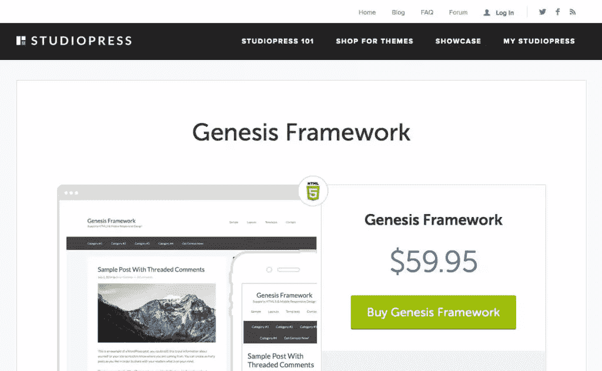

# 创世纪框架简介

> 原文：<https://www.sitepoint.com/an-introduction-to-the-genesis-framework/>

不管你是已经使用 WordPress 很多年了，还是刚刚开始使用，都没有关系。WordPress 可能是一个复杂的内容管理系统，有很多选项。这些选项包括主题、插件、产品和服务。很容易被所有事情压垮。这就是为什么找到最好的产品让你的生活变得轻松非常重要。一种方法是使用可信的主题框架。最流行的主题框架之一被 StudioPress 称为 **[创世纪框架](http://www.studiopress.com/)** 。

## 什么是主题框架？

你可能听说过 WordPress 主题，但是你可能不知道什么是主题框架。一个主题框架是一个 WordPress 主题结构，它被放置在适当的位置来构建。把主题框架想象成一个交通工具的框架。唯一的区别是，你可以在这个框架的基础上构建你喜欢的任何类型的主题。

主题框架使得创建你想要的任何类型的网站的外观变得非常容易。

## 为什么是创世纪？

Genesis 是最受欢迎的 WordPress 主题框架之一，让我们来看看一些主要原因。

## 它建造得很好

Genesis 是以干净代码的优先级构建的。这意味着它实现了最新的 HTML5 和 CSS3 功能。这个框架编码得很好，让你的网站像预期的那样工作。大多数创世纪主题在移动设备上看起来也很棒，并且响应迅速，使得整个主题选择成为各地企业的最佳选择。

这也让你的网站在搜索引擎上看起来很棒。你不必担心搜索引擎在索引你的网站时会有麻烦。您可以专注于创建杀手级内容，而不用担心技术搜索引擎优化方面。

## 它很轻

如果你曾经安装了一个主题，让你的网站爬得比一只垂死的乌龟还慢，那么你就会明白为什么轻量级的主题是重要的。我去过那里。我安装了一个漂亮的主题，却发现它让我的服务器陷入了困境，产生了太多的请求，而且整体过于庞大。尽管《创世纪》充满了各种功能，但你在这里看不到任何滞后。

## 它得到了很好的支持

当您一次性购买 Genesis 框架时，您将获得终身更新和支持。如果您有任何问题，可以随时联系他们的支持人员，这很有帮助。对支持的无限制访问意味着您的站点将始终如您所愿地正常运行。太多次我看到主题所有者拿着袋子离开，当他们需要的只是一点点帮助。

## 它相对便宜

仅框架一项就要 60 美元，而且是一次性购买。然后，儿童主题也只是在 20-50 美元的区间，相对便宜。您也可以以合理的价格一次性购买他们的所有主题。如果你是一个企业家，并且你只是想用很少的投资来启动和运行，这是非常好的。此外，如果你拥有不止一家企业，你将有一个可供选择的主题库。

## 它是安全的，定期更新

StudioPress 定期推出更新来改进他们的代码库。这对于保证你的网站安全是很重要的。他们努力让网站尽可能快速安全地运行。定期更新的问题是担心它会破坏你的网站。事实并非如此，我们将在我的下一个观点中讨论。

## 它很灵活，利用了儿童主题

Genesis 框架使用子主题进行设计。这一点非常重要，因为它保证了网站设计的安全性。你可以更新到最新版本的框架，你的网站将保持原样。它的工作方式是，你安装创世纪，然后你安装儿童主题。创世纪仍然存在，但是儿童主题赋予了它额外的功能和风格。你可以改变孩子的主题，不用担心破坏你的网站，或者搞砸一些事情。

这让你不用担心网站的安全和更新。这彻底根除了 WordPress 用户在拥有一个漂亮的设计和维护一个安全、更新的 WordPress 站点之间面临的杂耍游戏。

## 有大量的设计选择

当你拿起“所有主题”包时，它包括了 StudioPress 的所有 42 个创世纪儿童主题。这是一个非常棒的儿童主题集合，适用于所有不同类型的企业。这意味着你将有多种网站选择。无论你是摄影师、作家还是设计师，你的网站看起来都会很棒。

你也不仅仅局限于那 42 个儿童主题。你还可以在高端市场找到其他儿童主题。也有独立开发者提供华丽的免费创世纪儿童主题。他们中的一些人甚至与 WooCommerce 合作，使你能够用 WordPress 建立你自己的 SEO 优化在线商店。

## 它是在考虑 SEO 的情况下构建的

创建 Genesis 框架是为了从 SEO 中获得最大收益，开箱即用。它的构建方式，以及它构建文章和类别的方式，确保了你的内容易于查找和理解。对于人和搜索引擎都是如此。

它还利用了微数据，这对于使你的网站更相关，更吸引搜索引擎和用户是很重要的。微数据为搜索引擎提供了更多关于你的网站、文章和页面以及内容的信息。有了微数据，像谷歌这样的搜索引擎会在搜索结果中显示更多你的数据。您可能仍然只有一个结果，但它将是一个包含更多详细信息的更丰富的结果。

## 结论

如果你想要一个高质量的 WordPress 主题框架，Genesis 框架是最好的，也是最受支持的框架之一。它的优势对任何企业来说都是必不可少的，可以让他们的网站迅速建立并运行起来。此外，它消除了一些 WordPress 站点常见的维护问题。如果你想要一个结构良好的框架来解决网页设计和搜索引擎优化的问题，Genesis 框架是一个很好的选择。

在 StudioPress.com 你可以学到更多关于创世纪的知识。

## 分享这篇文章