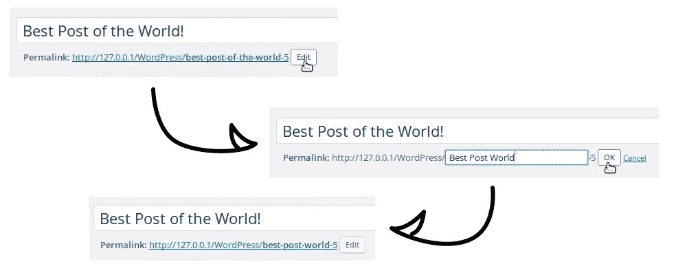

# WordPress 永久链接简介

> 原文：<https://www.sitepoint.com/an-introduction-to-wordpress-permalinks/>

网站所有者通常希望读者在他们自己的网站或社交网络上分享他们的内容。要做到这一点，读者需要一个分享的链接。

## 什么是 WordPress 永久链接？

“永久链接”是指向网站上特定页面或帖子的“永久链接”。当你分享一个链接时，你希望它不会改变，并且会成为一个永久的资源。

WordPress 为你创建的每个帖子或页面生成一个永久链接，可以编辑。

WordPress 使用几种类型的永久链接。在这篇文章中，我将介绍永久链接，这样你就能为你的 WordPress 站点选择最好的类型。

## 默认和丑陋的永久链接

您创建的每个帖子或页面都有一个唯一的标识符，称为 ID。这是一个可以唯一识别你的文章或页面的号码，所以它非常适合默认的永久链接系统，也是 WordPress 选择的那个。

让我们假设你写了一篇有`ID 308`的文章。那么，它的默认永久链接将是`http://example.com/?p=308`。根据定义，`ID`是唯一的，所以通过访问 URL 中包含的`p`标签的值，WordPress 将知道检索哪个帖子。

这是一个简单的系统，有一个很大的优势:它可以在任何服务器上工作，所以任何人都可以使用它。然而，这些永久链接是丑陋的，不是真正明确的，这就是为什么漂亮的永久链接存在。

## 在 WordPress 中启用漂亮的永久链接

漂亮的永久链接(也称为搜索友好的 URL)通常包含几个单词，就像他们引用的文章的标题一样。比如`http://example.com/my-blog-post`。这样，我们可以通过阅读 URL 来了解页面或帖子的内容。此外，它还可以被搜索引擎读取，从而有助于搜索引擎排名。

### 选择永久链接结构

要启用漂亮的永久链接，请进入 WordPress 仪表盘中的设置>永久链接菜单。在那里你会发现几个选项，你可以选择永久链接的结构。

“丑陋的永久链接”选项是默认配置，带有`p`参数。其他可用的选项是“漂亮的永久链接”，你可以在屏幕上的例子中看到使用了什么信息。如果你不喜欢 WordPress 提供的选项，你甚至可以用最后一个选项“自定义结构”来选择你想要的结构。

您可以在这个结构中添加任何您想要的文本(但是请确保只使用 URL 友好的字符！).有些标签允许你包含文章的年份或标题等细节。这些标签被称为“[结构标签](https://codex.wordpress.org/Using_Permalinks)”，这是一个用来描述永久链接中使用的变量的术语。请注意，这不要与你用来帮助你的内容分类的标准标签混淆。

您的结构可以指定发布的日期和时间。职位的年份可用`%year%`。包括有`%monthnum%`的月份和有`%day%`的日子。发布时间有`%hour%`、`%minute%`和`%second%`三种。

两个标签允许你添加文章的更多信息:带有`%category%`的类别和带有`%author%`的作者。对于一个有多个类别的帖子，使用`%category%`只会包含一个类别:按字母顺序排列的第一个类别。

最后，我们发现两个重要的标签:`%post_id%`和`%postname%`，它们分别指向文章 ID 和文章标题。请注意，`%postname%`并不包含确切的文章标题:相反，它是包含在内的 slug，一个代表标题的字符串，但只有 URL 友好的字符。

如果选择自定义结构，必须包含`%post_id%`或`%postname%`标签，或者两者都包含。如果没有这些标签中的一个，你就不能确定每个 URL 只有一篇文章。

让我们举一个长得荒谬的例子来说明什么是可能的。要添加文章的日期、时间和作者，我们可以选择以下结构:

```
/%year%/%monthnum%/%day%/%hour%:%minute%:%second%/%postname%/written-by-%author% 
```

我们将得到如下所示的 URL

```
http://example.com/2016/08/02/08:06:22/hello-world/written-by-jeremy 
```

### 类别和标签

漂亮的永久链接不仅仅是你的帖子。事实上，它们对你的类别、标签和档案的页面也很有用。如果你为你的文章 URL 选择了除“丑陋永久链接”之外的任何其他选项，WordPress 将自动为这些页面启用漂亮永久链接。

这样你的类别就会有类似于`http://example.com/category/uncategorized/`的 URL，而不是默认的`http://example.com/?cat=1`。对于您的标签，标签 slug 将带有前缀`/tag/`。对于归档，您将获得虚拟目录，例如`http://example.com/2016/08/`。通过填写“可选”部分的字段，您可以为您的类别和标签选择前缀。

### 编辑`.htaccess`

为了工作，pretty permalinks 使用了一个`.htaccess`文件。这个文件必须在 WordPress 安装的根目录下。它将所有访问者的查询重定向到`index.php`文件，该文件解释这些查询并显示正确的页面。

如果 WordPress 可以自己编辑`.htaccess`文件，你所要做的就是点击设置>永久链接中的“保存更改”按钮来启用漂亮的永久链接。然而，在某些情况下(这取决于你的主机配置)，WordPress 不能编辑它，所以你必须自己做。

如果是这种情况，您将在永久链接页面的底部看到一条消息，指示您必须编辑`.htaccess`文件。如果你在 WordPress 安装的根目录下没有一个`.htaccess`文件，创建它，然后复制 WordPress 给你的文本区域的内容。如果该文件已经存在，使用文本编辑器将屏幕上显示的内容追加到该文件中。

## 几乎漂亮的永久链接

有些情况下，不允许你使用漂亮的永久链接。事实上，如果你不能使用`.htaccess`文件，漂亮的永久链接将不会为你所用。好消息是，这并不意味着你将不得不永远使用丑陋的永久链接。

WordPress 提供了一个中间选择:“几乎漂亮”的永久链接。这些永久链接以`/index.php/`为前缀。除了这个细节，它们类似于漂亮的永久链接，给你同样的选项和标签。例如，使用我们上面的例子(太大了)和“几乎相当永久链接”，你可以填写“自定义结构”字段:

```
/index.php/%year%/%monthnum%/%day%/%hour%:%minute%:%second%/%postname%/written-by-%author% 
```

然后你会得到如下网址:

```
http://example.com/index.php/2016/08/02/08:06:22/hello-world/written-by-jeremy 
```

这一切都不需要一个`.htaccess`文件。

至于漂亮的永久链接，如果你启用了“几乎漂亮的永久链接”，你的类别、标签和档案页面也会得到几乎漂亮的网址。同样，它们将具有与漂亮的永久链接相同的结构，但带有前缀`/index.php/`。

## 编辑文章摘要

如果你在永久链接结构中使用了`%postname%`标签，你可以定制更多的 URL。对于每篇文章，你可以编辑 WordPress 生成的 slug。

默认情况下，WordPress 接受标题，并将其转换为仅使用 URL 友好字符。例如，空格被转换成破折号，特殊字符也被转换，或者干脆被删除:“é”将变成“e”，“à”将变成“a”，以及“？”或者'！'将被移除。

WordPress 不会删除像“the”或“for”这样的小词，即所谓的“停用词”。这些词在 URL 中的意义不是很大，你可能想把它们去掉。这是可能的，一篇接一篇。

值得一提的是，有几个 SEO 插件会自动移除停用词，所以你的网站上可能已经有这个功能了。Amit Diwan 有一篇很棒的文章[回顾了流行的 SEO 插件](https://www.sitepoint.com/top-wordpress-seo-plugins-reviewed/)。

在文章标题的编辑栏下面，你可以看到文章的永久链接。在这个链接旁边，有一个标有“编辑”的按钮，可以让你编辑帖子的永久链接。

一旦你用新的 slug 编辑了字段，点击“Ok”按钮。请注意，WordPress 将通过使用您输入的文本创建 slug 来确保您的新 URL 是有效的。如果你输入“你好，世界！”，那么你就会得到‘hello-world’，比如说。



## 结论

漂亮(或几乎漂亮)的永久链接对于可读性和 SEO 友好的 URL 是有用的。它们可以包含有用的信息，如文章的日期或标题。这些永久链接是高度可定制的，你可以为你的网站选择任何你想要的结构。

请注意，你应该花时间选择一个结构。例如，如果你改变了文章的结构，旧的 URL 将会产生 404 错误，这些错误都需要被重定向。例如，最好不要为搜索引擎或在论坛上分享你的帖子的人更改它们。

## 分享这篇文章