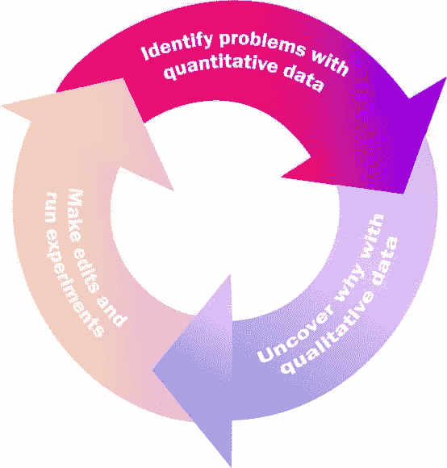
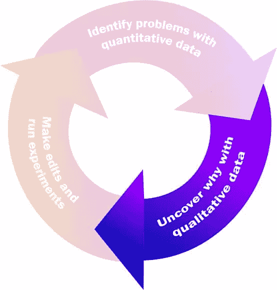
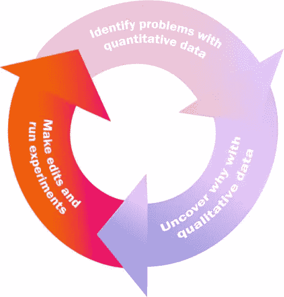

# 分析幸福:定量数据与定性研究

> 原文：<https://www.sitepoint.com/analytics-bliss-quantitative-data-with-qualitative-research/>

*本文最初发表在 [Fullstory 博客](https://blog.fullstory.com/quantitative-data-vs-qualitative-research-analytics-work-better-together/)上，经允许在此转载。*

了解你的网站上发生了什么很难。您可以拥有世界上所有的用户数据，但不知道如何处理这些数据，没有管理这些数据的流程，也没有办法从噪音中过滤出信号。你从哪里开始？一旦你开始，你会去哪里？你需要的是一个系统化的方法——和正确的工具。

说到了解，传统上有两种方法可供选择。第一种是定量方法。定量分析用数字来描述一切。从事*活动的用户数量*——跳出率、转换率、网站停留时间……诸如此类。定量研究是一种处理数字和从高层次看待事物的非常干净的方式。

定量数据的缺点是在翻译过程中会丢失很多数据。重要的细微差别丢失了。(决定功能性分析工具的是另一个主题，但无论如何，[您选择的分析工具应该服务于您的需求和预算](https://blog.fullstory.com/the-high-cost-of-web-analytics/)。)在缺乏信息的情况下，定量数据可能会在我们识别模式的大脑上耍花招。我们可以看到不存在的东西——就像我们可以看到物体上的脸一样。

*谷歌图片搜索“物体中的面孔”的最初几个结果不会令人失望。*

要真正了解你的网站或 web 应用程序上发生了什么，你需要一种方法来了解其中的细微差别。这就是第二种方法的用武之地——定性方法。定性分析侧重于用户的主观品质——推动数字的细微动作。是描述性研究。定性方法也是主观的。用户在此暂停。[在那里肆虐](https://blog.fullstory.com/rage-clicks-turn-analytics-into-actionable-insights/)。他们似乎对这个 UI 感到困惑:这是怎么回事？定性数据很乱。但它有丰富的见解。

定性研究方法的主要问题是它们发生在个体层面。定性研究每个访问你网站的用户是不可能的。你永远做不到，也没有用。

那你是做什么的？两者都用。

**最佳分析将定量和定性研究相结合，创造出持续产品改进的飞轮**。您使用定量信息将注意力集中在最大的问题(和机会)上，然后通过定性研究“放大”到用户级别，以完善您的理解，并解决问题。

这种一对二的研究方法可以将你的见解转化为行动。这是一个定量定性的飞轮，可以用来持续改进你的网站或应用程序。

它是这样工作的…

### 定量数据提醒你注意问题。从这里开始。

最基本的网络分析工具是定量的——而且是免费的。毫不奇怪，网站所有者在推出新网站时首先要做的事情之一就是安装谷歌分析(Google Analytics)。

像 GA 这样的定量分析工具提供了可靠的高级指标，如用户信息、页面访问量、事件、转化率、跳出率、网站停留时间等。最重要的是，它们允许你看到你的站点不同方面的状态，并帮助你集中注意问题或机会。

随着功能性定量分析工具的启动和运行，您已准备好识别问题和改进机会。这是建立定量-定性飞轮的第一步。(另见我们关于[用户指标是否让你变得无情](https://blog.fullstory.com/aggregated-quantitative-analytics-vs-empathy-individual/)的讨论。)

*定量-定性飞轮从通过定量分析识别问题开始。*

一旦你有了跟踪客户数据的量化工具，你会很快被[洞察力的幻觉](https://blog.fullstory.com/analytics-theater/)所迷惑。对抗被节目催眠的倾向。

带着目标来获得你新发现的定量数据能力。否则，你很容易不知所措。

考虑这些量化指标的变化，这些变化让团队努力理解量化*什么*背后的*为什么*:

*   Wistia [看到的客户流失增加无法解释或重现](https://www.fullstory.com/customers/wistia/)。为什么顾客会蜂拥而至？
*   **减少某些功能的使用**，就像客户服务软件公司[伽椰子在分析功能采用](https://www.fullstory.com/customers/kayako/)时看到的那样。为什么客户不尝试新功能？
*   翻译服务 SpanishDict 在其主页上看到的、[页面反弹增加。在第一次接触的时候，是什么在破坏？](https://blog.fullstory.com/three-ux-tweaks-spanishdict-found-using-fullstory-to-improve-retention)

记住:在每一个量化指标的背后，都有一个客户试图[完成一些工作](https://blog.fullstory.com/clayton-christensen-jobs-to-be-done-framework-product-development/)。你需要弄清楚的是那份工作是什么。为了做到这一点，在你的飞轮中建立下一步。

### 定性数据给你*为什么*

使用定量分析来识别需要额外分析的问题后，您需要一种方法来“放大”单个用户的行为。这就是为什么你需要一个定性分析工具。

定性数据可以为你提供大量关于个人用户行为的细微信息。这是最密集的数据级别，是通过会话回放得到的[。使用定性分析工具，您可以了解个人用户如何与您的产品互动。](https://www.fullstory.com/resources/the-definitive-guide-to-session-replay/)

*定量-定性飞轮的第二步是使用定性分析来理解个人层面的行为。*

它是如何工作的？如何从定量数据走向定性研究？使用像 [FullStory](https://www.fullstory.com) 这样的工具，你可以在你的网站上搜索用户行为的整个目录，寻找那些会影响你正在研究的任何定量数据的行为。

继续以上我们公司的例子，定性数据用于揭示定量数据变化背后的*为什么*:

*   **愤怒点击**向 Wistia 表明**他们的客户流失大部分是由于对如何使用该产品的困惑**造成的。
*   观察到大多数用户跳过了入职培训让我们明白了为什么伽椰子用户不知道某些功能或者不知道如何使用它们。
*   **从用户的角度看网站布局**帮助 SpanishDict 看到用户不知道如何开始，因为一个横幅广告挡住了搜索栏。

在上述每个案例中，定性研究(使用 FullStory 完成)为理解通过其他定量工具确定的问题提供了必要的额外见解。

在使用定性研究了解了为什么你会看到定量数据的变化之后，是时候采取行动了。

### 实验并检查改进

有了用户从个体到整体的完整视图，你现在有了你需要的洞察力去*做一些事情*，而这些事情就是进行编辑和运行实验。这是定量-定性飞轮的最后一步。

通过定量和定性分析彻底了解问题后，进行必要的编辑或进行实验。

根据您要解决的问题，需要进行哪些编辑会有很大的不同。进行编辑，运行实验(A/B 测试在这里很有帮助)，然后测量您的结果。

你回到了飞轮的顶端，我们继续前进。

### 完整的圆圈

而不是定性与定量，也许分析师应该一起使用两者。

定量识别总体问题，然后定性理解这些问题背后的潜在行为，这已经成为推动产品改进的关键工作流程:

*   对于 Wistia，通过向客户支持部门分配额外资源，用户对如何使用产品的困惑减少了**。**
*   伽椰子了解到他们需要彻底检查他们的用户入职，于是**设计了一个全新的入职流程**来引导用户完成他们最感兴趣的产品部分。
*   SpanishDict **通过移动阻挡搜索栏的广告横幅**来提高参与度，从而为移动用户进行优化。

定量-定性飞轮确保你的大脑永远不会去填补空白。最好的定性和定量分析工具一起工作来揭示你的网站上用户行为的全部情况。

让飞轮开始工作，并获得改善网络客户体验的回报。

## 分享这篇文章