# Android 应用可访问性清单

> 原文：<https://www.sitepoint.com/android-app-accessibility-checklist/>

移动应用程序的开发人员和设计人员必须始终关注确保视力和听力受损用户的可访问性。本文将提供一些您应该完成的清单，以确保您的应用程序更易访问。

### 可触摸控件大小

在任何应用上工作时，用户都依赖于可触摸的控件。控件应该具有适当的大小，并且容易看到。你的应用程序应该有长度和宽度至少为 *48dp* 的控件。它大约等于 *9mm* ，建议用于用户可以选择或执行操作的控件。

在下图中，您可以看到调整按钮大小的较少使用和较多使用的方法。

**不易接近**
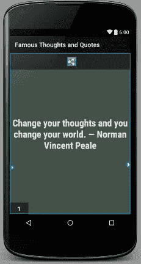

**更易接近**
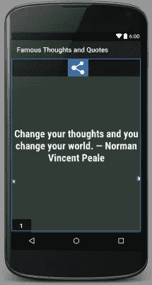

### 文本字段提示

`EditText`是一个将自身配置为可编辑的控件。为了确保可访问性，为`EditText`字段添加一个`android:hint`属性。添加属性将有助于用户理解文本字段为空时所写的内容。可以说出`android:hint`属性的内容。

```
android:hint="Enter First Name"
```

**不易接近**
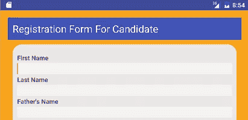

**更易接近**
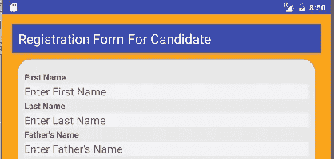

### 自定义控件

如果你的应用程序有一个完全可见的自定义控件，那么提供一个*虚拟视图层次*是一个很好的实践。这一点很重要，因为默认的辅助功能服务处理可能无法为用户提供足够的描述。

虚拟视图层次结构为辅助功能服务提供了一个补充视图层次结构，并在后台运行。对于应用程序开发人员来说，它可以被认为是一种紧密匹配屏幕上实际信息的方法。当可访问性事件被触发时，可访问性服务接收系统的回调，并向用户提供更有用的上下文信息。

下面，你可以看到日历控件，其中日历是在单一视图中实现的。

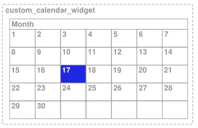
[图片来源](https://developer.android.com/guide/topics/ui/accessibility/apps.html)

正如您在上面看到的，选择了一天，但是默认的可访问性服务将只通知年和月。因此，没有视觉的用户将很难选择正确的日子。这是因为辅助功能服务只接收完整日历控件的描述信息，而不是特定日期的描述信息。

为了避免这样的问题，添加一个虚拟视图层次结构。

这也适用于相关控件的提示，如`DatePicker. Below you can see an example of a` DatePicker `添加“出生日期”的控件。

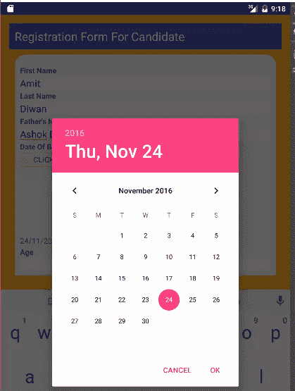

### 一组小控件的描述

为了确保可访问性，使用*视图组*对一组小控件进行分组。如果它们小于应用程序屏幕中推荐的最小触摸尺寸，请添加它们。分组后，为该组提供`android:contentDescription`。

`ViewGroup`类是 View 类的子类，作为容器将视图实例组合在一起。

以下是一些常用的`ViewGroup`子类:

*   线性布局
*   相对布局
*   显示数据表格（一种控件）

在下文中，您将看到如何向相对布局“视图组”添加内容描述。

例如，让我们将`android:contentDescription`属性添加到下面给出的`RelativeLayout`中。

```
<RelativeLayout
    xmlns:android="http://schemas.android.com/apk/res/android"
    xmlns:tools="http://schemas.android.com/tools"
    android:layout_width="match_parent"
    android:layout_height="900dp"
    android:background="#2E4058"
    android:contentDescription=”Send email section”
    tools:context="amit.net.demoapplication.MainActivity"> 
```

### 避免描述装饰性的图像和图形

比方说，你的应用程序中有一些元素，比如用于边框或装饰的图像，这并不支持用户操作。对于这些类型的图像和图形，避免添加可访问性内容描述，即`android:contentDescription`。

例如，避免在如下所示的应用程序屏幕中添加装饰图像的描述。

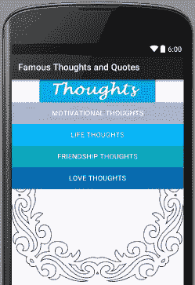

### 像改变功能的语音按钮这样的控制

对于改变功能的按钮或控件，这些按钮的*Android:content description*要适当更改。

例如，您有两个按钮:*发言*和*暂停*，当用户访问它们时，它们会改变功能。当用户要输入时，按下 *Speak* ，当用户停止说话时，按下 *Pause* 。

在本例中，speech 按钮从 Speak 变为 Pause，因此您可以添加以下带有属性`android:contentDescription`的内容描述。

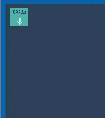

```
android:contentDescription="Speak" 
```

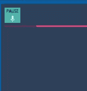

```
android:contentDescription="Pause" 
```

### 合适的应用标题

一个应用的标题对每个用户都至关重要，包括弱视或视障用户。标题的内容是用屏幕阅读器、对讲或画外音讲给用户的。

比如，我们在`AndroidManifest.xml`中添加 app 标题。

```
android:label="@string/app_name" 
```

这里，字符串值设置在 *strings.xml* 中，即

```
<string name="app_name">Voter Registration</string> 
```

所以，app 标题是*选民登记*如下图。


如果你不更改应用标题，Android 会自动显示应用名称。

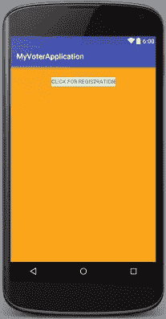

### 合适的间距

控件之间适当的间距是帮助用户正确阅读文本的关键。在接下来的两个例子中，您可以看到添加控件的正确方法和错误方法。

**不易接近**
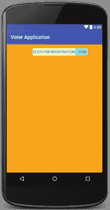

正如你在上面看到的，阅读起来相当困难。但是有了正确的间距，你可以很容易地阅读写在按钮上的内容，并且很容易区分两个按钮。

**无障碍**


### 色对比度

前景色和背景色的颜色对比应该符合 WCAG 标准，以确保文本的可读性。

你可以使用[这个在线工具](https://snook.ca/technical/colour_contrast/colour.html#fg=33FF33,bg=333333)来检查任意一组颜色的对比度。

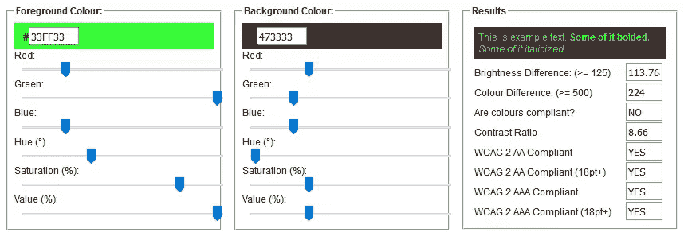

如上图，[检查对比度](https://snook.ca/technical/colour_contrast/colour.html#fg=33FF33,bg=333333)，如果在*结果*中可以看到*是*，则说明您已经设置了足够的前景色和背景色。

例如，在下面的文本中，您可以看到前景和背景颜色是 WCAG 兼容的。

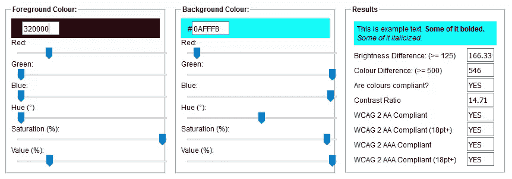

在下图中，我们添加了和上面一样的前景色和背景色。

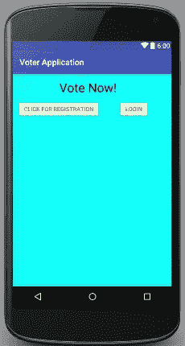

## 清单

*   可触摸控件大小
*   文本字段提示
*   可视控件应该在虚拟视图层次结构中
*   添加`android:contentDescription`属性
*   如果控制改变功能，确保`android:contentDescription`改变
*   你的应用应该有足够的`app_name`
*   在控件之间放置适当的间距
*   确保背景色和前景色有足够的对比度

## 分享这篇文章