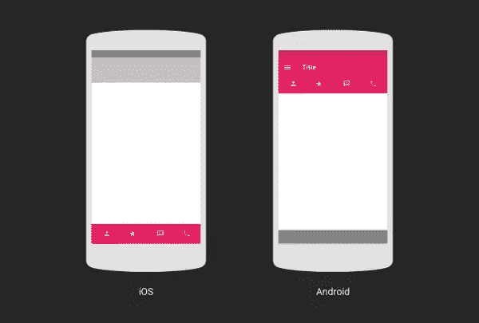
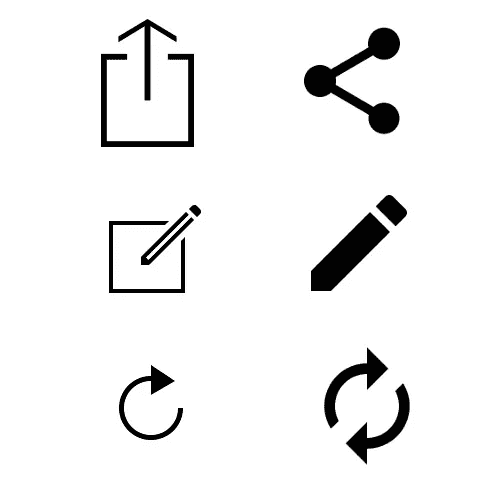
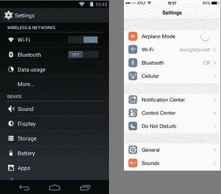
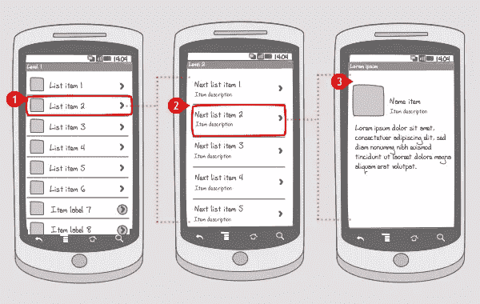

# Android 设计反模式和常见陷阱

> 原文：<https://www.sitepoint.com/android-design-anti-patterns-pitfalls/>

照片:Lucas Zallio

越多的应用程序按照我们期望的方式运行，它们就越容易使用；它们使用起来越直观，我们就越容易专注于我们真正的目标。

最好的用户界面是如此直观，以至于用户界面消失了，让我们专注于真正重要的事情。人们往往意识不到应用程序中的用户体验，除非它不符合他们的期望。

根据[维基百科](http://en.wikipedia.org/wiki/Anti-pattern)的说法，*反模式*(或反模式)是对一个经常出现的问题的常见回应，这通常是无效的，并且有高度适得其反的风险。在本文中，我们将探讨一些 Android 应用程序中常见的反模式和不良实践，它们阻碍了用户完成任务，从而提供了糟糕的用户体验。

## 笔直的港口

Straight Port 是一个应用程序，最初是为另一个平台(通常是 iOS)开发的，后来迅速和最小限度地为 Android 工作。这通常会导致 [Android 应用拥有其他平台](http://lukesleeman.com.au/ui-anti-patterns-in-porting-ios-apps-to-android/)的视觉风格和 UI 约定。

“一次设计，随处发货”的方法很少奏效。不同的平台有不同的关于用户界面和可用性的规则和指导方针，当你为一个特定的平台设计时，你必须考虑到这一点。你的用户的期望和行为已经被在那个平台上使用的其他应用所塑造和影响。

如果你的 app 达不到这些，势必会造成挫败感。Android 用户期待 Android 应用，因此有必要浏览一下 [Android 设计文档](http://developer.android.com/design/index.html)以熟悉该平台的惯例。

直端口的一些常见缺陷是:

#### 1.底部标签栏

在安卓系统中，标签属于顶部。

*(来源:[http://www . Google . com/design/articles/design-from-IOs-to-Android/](http://www.google.com/design/articles/design-from-ios-to-android/))*

#### 2.使用其他平台的图标

#### 3.列表项上的右向光标

*(来源:[http://developer . Android . com/design/patterns/pure-Android . html](http://developer.android.com/design/patterns/pure-android.html))* 

关于这方面的更多信息，你可以阅读这个关于如何为纯 Android 设计的指南。还有一篇关于从 iOS 到 Android 的设计的[文章](http://www.google.com/design/articles/design-from-ios-to-android/)是最近的，因为它涵盖了在材料设计时代为 Android 设计。

## 为一种外形设计

在其他平台上，你可以决定你的应用程序将在什么设备上运行——手机还是平板电脑，并知道屏幕大小，而在 Android 上，这是不可能的。因此，你必须将你的应用程序设计成自适应的，这样它就能在手机和平板电脑上很好地工作。这些设备的屏幕尺寸也各不相同，因此您必须考虑到这一点。一个设计良好的 Android 应用程序在任何设备和屏幕尺寸上都很好用，很好看。

除了为手机和平板电脑设计，你还应该确保当用户改变设备方向时，你的设计不会中断。你应该同时设计肖像和风景模式。

不要假设用户只会纵向使用 app，而忽略横向。当开发人员没有提供横向方向的规范时，Android 系统会尝试尽可能好地布局 UI。这通常会导致在纵向模式下看到的相同 UI 展开以填充更大的横向方向。元素通常在屏幕上被拉长，并且间隔很大。

## 小触摸目标

摄影:珍妮·唐宁

小触摸目标会减慢用户的速度，因为如果该目标靠近其他目标，它们会增加用户做出错误选择的机会。该应用程序也可能看起来没有反应，因为用户在他们认为受触摸影响的区域上点击，看不到任何明显的动作发生。

在 Android 上，触摸目标的理想尺寸至少是 48dps。材料设计规范文档为您在设计应用时可以使用的关键词和指标提供了[指南。](https://www.google.com/design/spec/layout/metrics-keylines.html#metrics-keylines-touch-target-size)

## 忽略触摸反馈

选择需要立即显而易见。可触摸的元素应该有一个按下并聚焦的状态。当用户采取行动时不给用户反馈会增加应用程序的感知延迟——应用程序看起来更慢。

通过使用颜色和形状(例如将图标/字体加粗)使所选项目变得明显。在材质设计中，阴影用来表示一个元素在最前面。

材料设计强调触摸反馈的使用，不仅利用阴影、颜色和形状，还强烈鼓励使用动画和过渡来给用户反馈。以下是来自[材料设计指南](https://www.google.com/design/spec/material-design/introduction.html#)的一些要点。

*   从输入点(手指的接触点或语音的麦克风图标)，使视觉反应呈放射状。这被视为从接触点产生的波纹。
*   当用户触发新素材的创建时，它应该从输入点开始增长。材料从接触点出现，将元素连接到接触点。
*   为您的视图指定标高。提升元素时使用动画。
*   当卡或可分离元件被激活时，卡应该抬起以指示激活状态。

## 穷举形式

摄影:seniorliving.org

手机和平板电脑通常不是输入大量文本的最佳设备。你应该尽量减少用户必须填写的字段数量。

如果表单是注册表单，并且您确实需要来自用户的所有信息，那么您可以只要求移动注册表单上的一些细节，并选择在登录到 web 应用程序后完成该过程。

删除重复或不必要的字段，如密码确认字段，最好不要对可接受的用户输入设置太多限制，如密码必须是 X 个字符长，包括一个大写字母、一个特殊字符、字母数字字符等等。你还应该为用户提供正确的键盘，用于特定的字段，例如，数字键盘用于只需要数字的字段，电子邮件键盘用于电子邮件字段，等等

尽可能为输入字段提供合理的默认值。例如，对于电子邮件字段，您可以建议设备已知的电子邮件地址。对于登录和注册，你可以通过使用 FaceBook、Google+和 Twitter 等常见的提供商来完全放弃表单(但仍然包括电子邮件选项)。你应该努力使填表过程尽可能的无痛。

## 忽略滑动视图(水平分页)模式

[水平翻页](https://developer.android.com/training/design-navigation/descendant-lateral.html#paging)允许用户使用简单的滑动手势在项目之间高效移动，从而使浏览和使用数据的体验更加流畅。水平分页通常用于选项卡和详细信息页面。

在手机上，由于主页和详细信息页面在不同的屏幕上，导航这些视图通常需要用户在列表和详细信息视图之间来回跳转，也称为 pogosticking。

如果用户想要连续查看多个详细项目，请使用滑动手势导航到下一个/上一个详细视图，以避免“pogosticking”。这可以在 Android Gmail 应用程序上看到，一旦你打开一封电子邮件，你可以使用滑动手势导航连续的电子邮件。

如果您的应用程序使用操作栏选项卡，请启用推送在不同视图之间导航。这是一些应用程序通常会忽略的，导致标签无法滑动。用户不需要点击特定的标签项来导航到那个视图。

每当使用导航抽屉时，从左向右滑动应该可以调出它。用户不需要点击汉堡图标来打开抽屉。

水平分页使导航速度更快，但在某些情况下不应该使用它们，例如当视图包含水平平移表面(如地图)时，在这样的视图中包含水平分页可能会由于交互冲突而影响屏幕的可用性。

## 基于列表的深度导航(下钻列表导航)

一种基于列表的深度导航，称为向下钻取导航，其中列表导致更多的列表，从而导致更多的列表。使用起来往往效率不高，很麻烦。使用这种导航方式访问内容所需的触摸次数通常非常高，导致用户体验不佳，尤其是对于移动用户。

这种类型的导航通常使用起来很乏味，因为做出错误的选择意味着回到正确的列表，重新定位自己并做出另一个选择。这很快就会变得令人沮丧。

Image: UNITiD

基于列表的深度导航通常是试图给用户太多选择和/或在应用程序中加入太多特性的结果。这两者都会导致糟糕的用户体验。

《选择的悖论》一书谈到了给人们太多选择的负面影响。有很多选择通常是令人生畏的，它会减慢决策过程。从少量选择中挑选比从大量选择中挑选更快更容易。

在你的应用程序中加入太多的功能通常是为了给每个人创建一个伟大的应用程序，这通常会导致为任何人创建一个伟大的应用程序。记住 80/20 法则——80%的用户只会使用应用程序 20%的功能，或者换句话说:80%的时候，人们只会使用应用程序 20%的功能。

如果你向人们展示他们不需要的功能或他们不关心的信息，那只会分散他们的注意力，妨碍他们完成任务。人们也倾向于浏览长列表或冗长的信息，这通常会导致他们跳过一些项目。他们跳过的内容很可能就是他们在应用程序中寻找的内容。因此，他们可能会认为该应用程序没有提供他们需要的东西，并卸载它以寻找更好的东西。

## Pogosticking

图库页面(列表和网格视图)是在应用程序中向用户展示信息的常用方式。大多数导航决策都是在这些页面上做出的。只有在实际参与项目时，才有必要深入到详细信息页面。

图片:gfpeck

设计不良的列表和网格视图不能提供足够的信息来做出好的导航决策，因此用户必须像一个人在 pogostick 上一样在多个细节页面之间跳来跳去。因此，UX 设计师 [Jared Spool](https://twitter.com/jmspool) 创造了术语 pogosticking 来解释这一点。

列表和网格项目应该在上面显示足够的信息，以便用户知道从项目的详细信息页面中可以得到什么。

### 将操作栏溢出用于核心应用导航

在 Android 上，主要的应用程序导航是使用导航抽屉、标签或微调器来完成的。操作栏溢出用于与操作相关的项目，如搜索和设置。你还应该注意相反的情况:不要把与核心导航无关的东西放在导航抽屉之类的地方。

一个常见的格言是导航在左边，动作在右边。

## 结论

以上并不是为 Android 设计时需要注意的详尽列表，但希望它能帮助你做出设计决定，并对你可能在应用中实现的任何反模式有所启发。当然，了解更多关于 Android 设计的最佳起点是官方文档。还有一个很棒的资源，展示了流行应用的 iOS 和 Android 版本。

这不仅是寻找设计灵感的好地方，也是了解平台惯例的好地方。

## 分享这篇文章