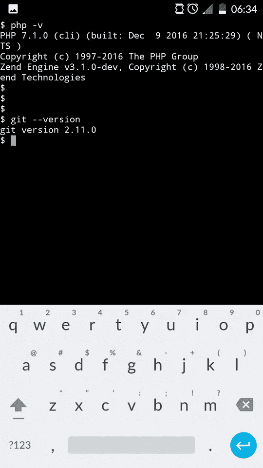
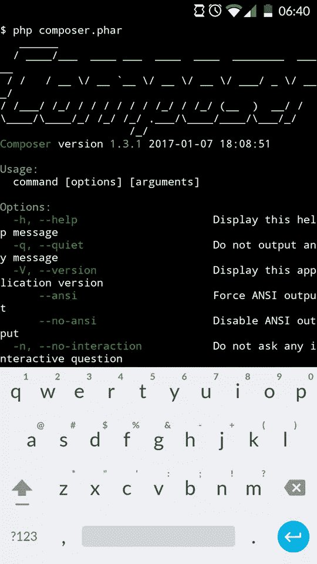
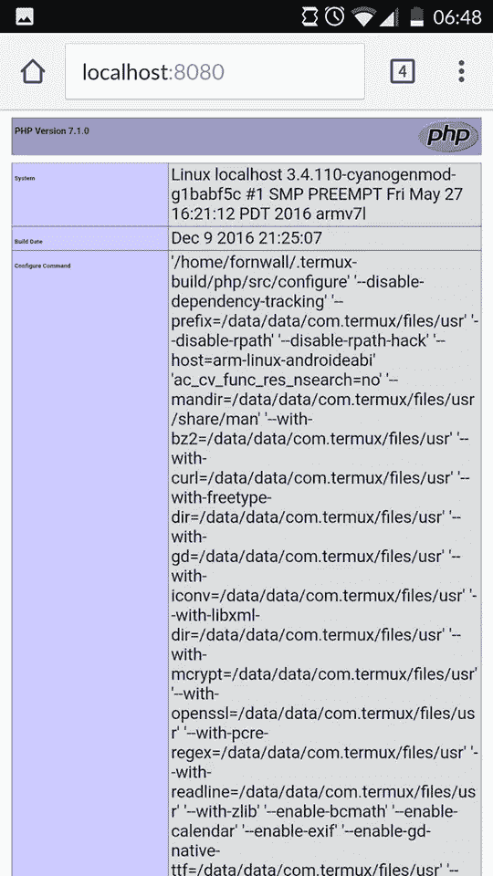
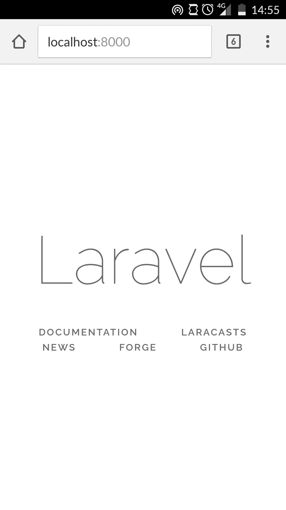
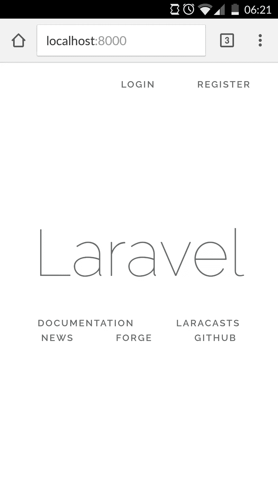

# Android 手机上的 Android elephant–Laravel？

> 原文：<https://www.sitepoint.com/android-elephpant-laravel-android-phone/>

不久前，克里斯托弗·皮特写了一篇关于 T2 在 iPad 上编写和运行 PHP 代码的优秀文章。读完之后，我对自己说“在 Android 上做同样的事情真的很酷”:能够动态地编写和编辑代码，例如在旅行中，而不必到处带着笔记本电脑。所以我决定做些研究，看看我能发现什么。


对于本文，您可以使用任何类型的 Android 设备。我已经在我的手机上完成了，但带蓝牙键盘的 Android 平板电脑可能是理想的设置。

Android 有几个不同的外壳应用程序。在本教程中，我们将使用一个叫做 [Termux](https://termux.com/) 的工具。


Termux 结合了强大的终端仿真和广泛的 Linux 软件包集合。它也是完全免费和易于使用的。

从 Play Store 安装 Termux 后，首先要做的就是运行`apt update`命令。根据文档:*“该命令最初需要在安装后直接运行，之后定期运行以接收更新。”*

现在是有趣的部分。我想说的前两个命令是`apt list`和`apt list --installed`命令。第一个将列出 Termux 的所有可用包。我们可以看到，它支持许多不同的编程语言、文本编辑器，并有一些有用的实用工具包，如 zip、tar 等。第二个命令将列出所有已安装的软件包。正如我们所看到的，Termux 已经预装了一些像 apt 和 bash 这样的包。

测试 Termux 时，我的目标是看看我是否能组装一个合适的 PHP 开发环境，所以我从安装一个文本编辑器开始。我更喜欢 Vim，但也有更多的选择，如 Emacs 和 Nano。Vim 有一点学习曲线，但是当你掌握了它的基础知识后，它会变得非常容易。您可以使用`apt install vim`命令获得 Vim。

如果你想了解更多关于 vim 的知识，这里有[这篇非常好的文章](https://www.sitepoint.com/getting-started-vim/)，或者，安装之后，键入`vimtutor`使用内置教程。

如果你在 Android 手机上测试这个，运行 vim 会带来第一组问题。我怎样才能按下`Escape`键？Termux 有一个很大的快捷键列表，用于模拟 Android 键盘上没有的按钮:

| 命令 | 钥匙 |
| --- | --- |
| 音量调高+E | 换码键 |
| 音量增大+T | Tab 键 |
| 音量提高+1 | F1(和音量增加+2 → F2，等等) |
| 音量调高+0 | F10 |
| 音量调高+B | Alt+B，使用 readline 时后退一个单词 |
| 音量调高+F | Alt+F，使用 readline 时前进一个单词 |
| 音量增大+X | Alt+X |
| 音量增大+W | 向上箭头键 |
| 音量调高+A | 左箭头键 |
| 音量调高+S | 向下箭头键 |
| 音量调高+D | 右箭头键 |
| 音量调高+L | (管道字符) |
| 音量增大+U | _(下划线) |
| 提高音量 | 页上移 |
| 音量增大+N | 下一页 |
| 音量调高+。 | Ctrl+\ (SIGQUIT) |
| 音量调高+V | 显示音量控制 |

现在我们已经启动并运行了编辑器，是时候安装我们需要的包了:PHP、Git 和 Composer。

```
apt install php
apt install git 
```

这将安装最新的 PHP 和 Git 包。



对于作曲家，我们需要做一点额外的工作。我们需要转到 [Composer 下载页面](https://getcomposer.org/download/)并使用命令行安装说明:

```
php -r "copy('https://getcomposer.org/installer', 'composer-setup.php');"
php -r "if (hash_file('SHA384', 'composer-setup.php') === '55d6ead61b29c7bdee5cccfb50076874187bd9f21f65d8991d46ec5cc90518f447387fb9f76ebae1fbbacf329e583e30') { echo 'Installer verified'; } else { echo 'Installer corrupt'; unlink('composer-setup.php'); } echo PHP_EOL;"
php composer-setup.php
php -r "unlink('composer-setup.php');" 
```

这将下载安装程序，验证它，运行它并删除它。如果一切顺利，我们应该可以从 Termux 运行 Composer。



现在我们已经安装了所有的工具，我们应该测试我们的 PHP 安装是否正确运行。为此，让我们做一个简单的`phpinfo()`测试。让我们创建一个新文件夹并测试我们的 PHP 安装。

```
mkdir test
cd test
echo "<?php phpinfo();" > index.php
php -S localhost:8080 
```

这将创建一个新文件夹，然后创建一个包含`phpinfo()`命令的`index.php`文件。我将它直接回显到文件中，但是您可以使用 Vim 来完成。最后，我们使用 PHP 服务器为本地主机提供服务。当在我们的浏览器中访问`localhost:8080`时，我们应该会看到这样的内容:



我们现在有 Composer 用于依赖性管理，git 用于版本控制。但是我知道你在想什么:“我们刚刚做了一个简单的`phpinfo`测试，剩下的呢？”。

## 我们可以在 Android 设备上安装 Laravel 吗？

至此，我们已经具备了在 Android 设备上安装和运行 Laravel 所需的一切。要创建一个新的 Laravel 项目，我们需要运行以下命令:

```
php composer.phar create-project --prefer-dist laravel/laravel new_project 
```

这将在`new_project`文件夹中创建一个新的 Laravel 项目。`--prefer-dist`选项在这里[有很好的证明。安装可能需要一点时间。完成后，我们可以使用 Laravel 自己的 Artisan 命令行界面运行我们新创建的项目。在`new_project`文件夹中，我们可以运行命令:](https://getcomposer.org/doc/03-cli.md#install)

```
php artisan serve 
```

在浏览器中访问`localhost:8000` URL 应该会显示 Laravel 主屏幕。



成功！我们的 Laravel 安装完成了。我们已经成功安装了编写和执行代码所需的工具。但是如果没有持久化数据的方法，任何开发环境都是不完整的。

谈到 Android 设备，大多数时候，内存和存储容量是真正的问题。因此，Termux 只提供了`sqlite`作为持久化数据的方式。SQLite 是一个无服务器的、基于文件的数据库引擎。它是轻量级的，是少量数据的理想选择，你可以[在这里](https://www.sitepoint.com/getting-started-sqlite3-basic-commands/)阅读，在这个[超越基础的帖子](https://www.sitepoint.com/sqlite-3-beyond-basics/)阅读。首先，我们需要安装它。

```
apt install sqlite 
```

接下来，我们需要配置我们的 Laravel 项目来使用 sqlite。在我们项目的根目录中，我们有一个`.env`文件。这是环境配置文件，也是我们需要编辑的第一个文件。使用您选择的编辑器编辑以下行:

```
DB_CONNECTION=sqlite
DB_HOST=127.0.0.1
DB_PORT=3306
DB_DATABASE=homestead
DB_USERNAME=homestead
DB_PASSWORD=secret

BROADCAST_DRIVER=log
CACHE_DRIVER=file
SESSION_DRIVER=file
QUEUE_DRIVER=sync 
```

然后转到`config/database.php`文件，将下面一行从:

```
'default' => env('DB_CONNECTION', 'mysql'), 
```

到

```
'default' => env('DB_CONNECTION', 'sqlite'), 
```

这将使`sqlite`成为来自`connections`阵列的默认连接。

```
'connections' => [
        'sqlite' => [
            'driver' => 'sqlite',
            'database' => env('DB_DATABASE', database_path('database.sqlite')),
            'prefix' => '',
        ],
        'mysql' => [
            'driver' => 'mysql',
            'host' => env('DB_HOST', '127.0.0.1'),
            'port' => env('DB_PORT', '3306'),
            'database' => env('DB_DATABASE', 'forge'),
            'username' => env('DB_USERNAME', 'forge'),
            'password' => env('DB_PASSWORD', ''),
            'charset' => 'utf8mb4',
            'collation' => 'utf8mb4_unicode_ci',
            'prefix' => '',
            'strict' => true,
            'engine' => null,
        ],
        'pgsql' => [
            'driver' => 'pgsql',
            'host' => env('DB_HOST', '127.0.0.1'),
            'port' => env('DB_PORT', '5432'),
            'database' => env('DB_DATABASE', 'forge'),
            'username' => env('DB_USERNAME', 'forge'),
            'password' => env('DB_PASSWORD', ''),
            'charset' => 'utf8',
            'prefix' => '',
            'schema' => 'public',
            'sslmode' => 'prefer',
        ],
    ], 
```

数据库路径指向一个`database.sqlite`文件。这个文件还不存在，所以我们需要创建它。

```
touch database/database.sqlite 
```

这是我们需要告诉 Laravel 使用 SQLite 的所有配置——我们现在准备测试它。我们将使用 Laravel 的预建认证系统。要创建脚手架，我们需要运行以下命令:

```
php artisan make:auth 
```

之后，我们将运行迁移来构建我们的数据库模式。这将创建`users`和`password_reset`表格。

```
php artisan migrate 
```

如果我们再次运行`php artisan serve`，我们会看到现在我们可以选择注册和登录。我们的认证 CRUD 已成功创建！



## 结论

这些都是我在安卓手机上做的。这种设置非常适合小型开发任务，因为它拥有在小型设备上开始开发所需的所有工具，而不需要随身携带笔记本电脑。

虽然不完全是生产力的巅峰，但当需要做紧急修复时，或者当您想看看可以从 Android 设备中获得多少 PHP 性能时，它可以很容易地派上用场。

试试吧，告诉我们你的想法，如果你在 Android 上用 PHP 开发了有趣的东西，把概念卖给我们，我们会写下来的！

* * *

**适合上下文的恰当含义。Android 手机不会运行 MySQL，也不能运行复杂的测试套件，尤其是 e2e 测试，但其他东西可能会工作得足够好，足以完成一些工作。*

## 分享这篇文章