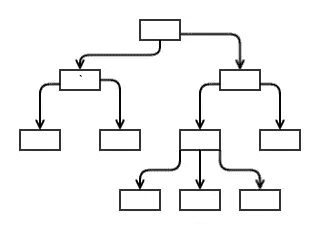
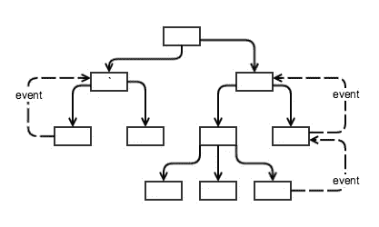
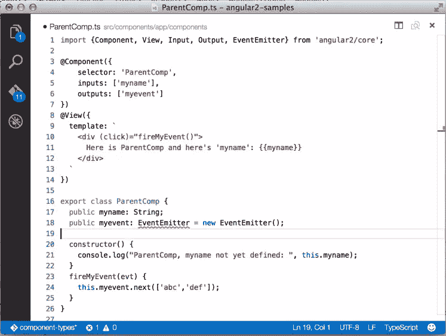
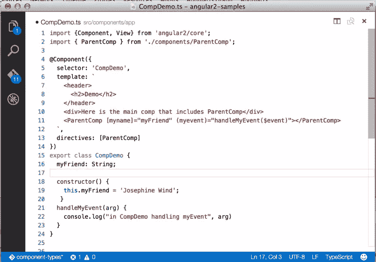
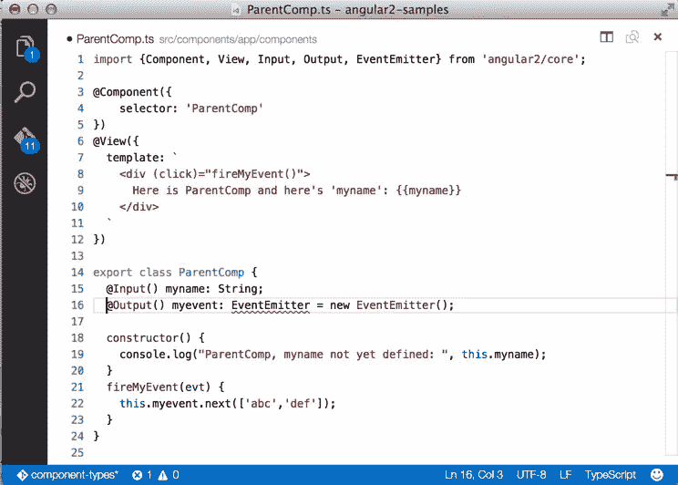

# 角度 2 分量:输入和输出

> 原文：<https://www.sitepoint.com/angular-2-components-inputs-outputs/>

在本文中，我们将更深入地了解 Angular 2 组件——它们是如何定义的，以及如何将数据放入和取出它们。

这是 Angular 2 系列的第二部分。你可以在这里阅读《T2》的第一部分。我们在以前的文章中讨论了组件和装饰器的基本概念，并且特别看到了用于构建 Angular 应用程序的`@Component`和`@View`装饰器。这篇文章更深入一点。然而，我们不可能在一篇文章中涵盖所有关于组件的内容，所以以后的文章将会讨论 Angular 2 组件的其他方面。

这篇文章和系列中其他文章的代码可以在 [angular2-samples](https://github.com/DevelopIntelligenceBoulder/angular2-samples) repo 中找到。你也可以看到样品运行在:【http://angular2-samples.azurewebsites.net/】T2。

虽然可以用 ECMAScript 5(浏览器支持的最常见的 JavaScript 版本)编写 [Angular 2](https://angular.io/) 应用程序，但我们更喜欢用[类型脚本](http://www.typescriptlang.org/)编写。Angular 2 本身是用 TypeScript 编写的，它在开发时对我们有帮助，并包含一些特性，使我们更容易定义 Angular 2 组件。

特别是，TypeScript 支持装饰器(有时称为“注释”)，这些装饰器用于声明性地添加或更改现有的“事物”。例如，类装饰者可以向类的构造函数添加元数据，甚至改变类的行为方式。关于 decorator 和可以用它们做的事情类型的更多信息，请参见 JavaScript decorators 的提案。Angular 2 包括几个装饰者。

正如我们在之前的文章中提到的，Angular 2 组件是 Angular 应用程序的关键构件。它们包括用 HTML 和 CSS 定义的视图，以及实现视图所需功能的相关控制器。主计长有三项主要职责:

*   管理模型，即视图使用的应用程序数据
*   实现视图所需的方法，例如提交数据或隐藏/显示 UI 的部分
*   管理与视图状态相关的数据，例如当前选择了列表中的哪个项目。

根据你的背景，上面的列表可能听起来很熟悉。事实上，角度组件控制器听起来非常像 John Gossman 在 2005 年定义的视图模型的原始定义:

> 这个术语的意思是“视图的模型”，可以被认为是视图的抽象，但是它也提供了视图可以用于数据绑定的模型的专门化。在后一个角色中，ViewModel 包含将模型类型转换为视图类型的数据转换器，并且它包含视图可以用来与模型交互的命令。— [来源](http://blogs.msdn.com/b/johngossman/archive/2005/10/08/478683.aspx?WT.mc_id=16549-DEV-sitepoint-article85)(拍摄于 2015 年 11 月 27 日)

因为 Angular 2 组件不是本地 JavaScript 实体，Angular 提供了一种通过将构造函数与视图配对来定义组件的方法。您可以通过定义一个构造函数(在 TypeScript 中它被定义为一个类)并使用一个装饰器将您的视图与构造函数相关联来实现这一点。装饰者还可以为组件设置各种配置参数。这个魔术是使用我们在本系列第一篇文章中看到的`@Component`装饰器完成的。

## 组件层次结构

上面描述了一个单独的组件，但是 Angular 2 应用程序实际上是由一个组件层次结构组成的——它们从一个根组件开始，根组件包含应用程序中使用的所有组件的后代。Angular 2 组件是独立的，因为我们希望封装我们的组件功能，并且我们不希望其他代码随意进入我们的组件来读取或更改属性。此外，我们不希望我们的组件影响其他人编写的另一个组件。一个明显的例子是 CSS:如果我们为一个组件设置 CSS，我们不希望我们的 CSS“渗出”到另一个组件，就像我们不希望其他 CSS“渗进”我们的组件一样。

同时，组件确实需要交换数据。Angular 2 组件可以从其父组件接收数据，只要接收组件明确表示愿意接收数据。类似地，组件可以通过触发父组件监听的事件向其父组件发送数据。让我们看看组件层次结构是如何表现的。首先，我们可以把它画成这样:

每个盒子都是一个组件，从技术上来说，这种表示被称为“图”——一种由节点和连接“边”组成的数据结构箭头表示从一个组件到另一个组件的数据流，我们可以看到数据只向一个方向流动——从上到下到后代。另外，请注意，没有路径允许您从一个节点出发，通过其他节点，然后返回到开始的节点。这种数据结构的正式名称是“有向无环图”——也就是说，它只向一个方向流动，并且没有循环路径。

这种结构有一些重要的特性:它是可预测的，它很容易遍历，并且很容易看到当进行更改时会受到什么影响。出于 Angular 的目的，当一个节点中的数据发生变化时，很容易找到可能受到影响的下游节点。

如何使用它的一个简单示例是一个包含客户及其信息的行的表，其中一个表组件包含代表每个客户的多个单独的行组件。表组件可以管理包含所有客户的记录集，并将单个客户的数据传递给它包含的每个行组件。

这对于简单地显示数据来说很好，但是在现实世界中，数据需要以另一种方式流动——沿层次结构向上流动——比如当用户编辑一行时。在这种情况下，行需要告诉表组件某一行的数据已经更改，以便将更改发送回服务器。问题是，如上图所示，数据只能沿层次结构向下流动，而不能向上流动。为了确保我们保持沿层次结构向下的单向数据流的简单性，Angular 2 使用一种不同的机制将数据沿层次结构向上发送:事件。

现在，当一个子组件采取了一个父组件需要知道的动作时，子组件会触发一个被父组件捕获的事件。父节点可以采取它需要的任何行动，包括更新数据，通过通常的单向向下数据流，更新下游组件。通过将向下的数据流与向上的数据流分开，事情变得更简单，数据管理也表现得更好。

## 角度 2 分量:输入和输出

有了 Angular 2 组件的高级视图，让我们看看可以传递给`@Component`装饰器来实现向下和向上数据流的两个属性:“输入”和“输出”这些有时会令人困惑，因为在 Angular 2 alpha 的早期版本中，它们被称为“属性”(表示“输入”)和“事件”(表示“输出”)，一些开发人员对名称的改变不太感兴趣，尽管它似乎很有意义:[https://github.com/angular/angular/pull/4435](https://github.com/angular/angular/pull/4435)。

正如您从上面的层次结构讨论中所猜测的，“输入”指定了您可以在组件上设置的属性，而“输出”标识了组件可以触发的事件，以将信息沿层次结构向上发送到其父级。

图 1:在`@Component`装饰器中使用“输入”和“输出”属性的组件

关于上面的输入和输出，有几点需要注意:

*   传递给`@Components`装饰器的“inputs”属性将“myname”列为可以接收数据的组件属性。我们还将“myname”声明为`ParentComp`类中的公共属性。如果不声明它，TypeScript 编译器可能会发出警告。
*   “outputs”属性将“myevent”列为一个自定义事件，它的父级可以接收到这个事件。在 ParentComp 类中，“myevent”被声明为并被设置为一个`EventEmitter`。`EventEmitter`是 Angular 自带的一个内置类，它为我们提供了管理和触发自定义事件的方法。注意，我们必须将`EventEmitter`添加到文件顶部的导入语句中。
*   该组件在视图中显示传入的“myname ”,但是当我们试图在`ParentComp`构造函数中访问它时，它还没有被定义。这是因为在视图呈现之前，输入属性不可用，这发生在构造函数运行之后。
*   我们在模板中添加了一个“click”事件处理程序，它调用 myeventEventEmitter 的“`next()`”方法，并向它传递我们希望随事件一起发送的数据。这是沿组件层次结构向上发送数据的标准模式——使用“EventEmitter”调用“`next()`”方法。

既然我们已经看了如何在组件中定义“输入”和“输出”，让我们看看如何使用它们。CompDemo 组件的模板使用 ParentComp 组件:

图 2:该组件使用由 ParentComp 定义的输入和输出

使用“ParentComp”的语法非常简单:

*   `[myname] = "myFriend"`:这告诉 Angular 将 ParentComp 输入属性“myname”设置为插值为 CompDemo 属性的“myFriend”的值。注意，我们在构造函数中设置了“myFriend”
*   `(myevent) = "handleMyEvent($event)"`:这告诉 Angular 在 ParentComp 触发“myevent”时调用 CompDemo " `handleMyEvent($event)`"方法我们在 ParentComp 中传递给“`next()`”方法的数据可以在 CompDemo 中通过将“`$event`”作为“`handleMyEvent()`”方法的参数来获得。

在这两种情况下，属性的左边引用 ParentComp 中的内容(输入属性或输出事件)，右边引用 CompDemo 上下文中解释的内容(实例属性或方法)。

如果您试图在 ParentComp 上设置一个属性，而没有将其指定为输入属性，Angular 不会抛出错误，但也不会设置该属性。上面的模式——通过“输入”属性传入数据，通过“输出”事件发送数据——是在 Angular 2 组件之间共享数据的主要方式。我们将在以后的文章中看到，通过定义可以注入到组件中的服务，我们还可以在组件之间共享数据，这有效地为我们提供了一种在组件之间共享数据或功能的方法。

## @Input()和@Output()

有一种替代语法可用于定义组件中的输入属性和输出事件。在上面的例子中，我们使用了传递给`@Component`装饰器的对象的“输入”和“输出”属性。Angular 还让我们使用一个`@Input`和`@Output`装饰器来获得相同的结果:

图 3:采用`@Input`和`@Output`装饰器

在上面版本的 ParentComp 中，我们去掉了`@Component`定义对象的“输入”和“输出”属性。相反，我们在第 2 行的导入命令中添加了“输入”和“输出”，并使用 ParentComp 类中的`@Input`和`@Output`装饰器来声明“我的名字”和“我的事件”

无论您使用输入/输出还是`@Input` / `@Output`，结果都是一样的，因此选择使用哪一个在很大程度上是一个风格决定。

## 包裹

在本文中，我们更深入地研究了 Angular 2 组件，它们是如何关联的，以及如何将数据传入和传出。就组件而言，我们仍然只是触及表面；它们可以说是 Angular 2 的主要特性，并且涉及到设计和构建 Angular 2 应用程序的方方面面。在以后的文章中，我们将继续探索 Angular 2 组件，更详细地研究 Angular services，将其作为重用代码和封装关键功能的一种方式。

## 更多的 Web 开发实践

这篇文章是微软和 [DevelopIntelligence](http://www.developintelligence.com/) 关于实用 JavaScript 学习、开源项目和互操作性最佳实践的 web 开发系列的一部分，包括[微软 Edge](http://blogs.windows.com/msedgedev/2015/05/06/a-break-from-the-past-part-2-saying-goodbye-to-activex-vbscript-attachevent/?WT.mc_id=16549-DEV-sitepoint-article85) 浏览器和新的 [EdgeHTML 渲染引擎](http://blogs.windows.com/msedgedev/2015/02/26/a-break-from-the-past-the-birth-of-microsofts-new-web-rendering-engine/?WT.mc_id=16549-DEV-sitepoint-article85)。

[DevelopIntelligence](http://www.developintelligence.com/) 为技术团队和组织提供讲师指导的 [JavaScript 培训](http://www.developintelligence.com/catalog/javascript-training)、 [AngularJS 培训](http://www.developintelligence.com/catalog/web-development-training/angularjs)和其他 [Web 开发培训](http://www.developintelligence.com/catalog/web-development-training)。

我们鼓励您在 dev.microsoftedge.com 使用免费工具进行跨浏览器和设备测试，包括 Windows 10 的默认浏览器 Microsoft Edge:

*   [扫描你的网站，寻找过时的库、布局问题和可访问性](http://dev.modern.ie/tools/staticscan/?utm_source=SitePoint&utm_medium=article85&utm_campaign=SitePoint)
*   [下载适用于 Mac、Linux 和 Windows 的免费虚拟机](http://dev.modern.ie/tools/vms/windows/?utm_source=SitePoint&utm_medium=article85&utm_campaign=SitePoint)
*   [跨浏览器检查网络平台状态，包括微软 Edge 路线图](https://dev.modern.ie/platform/status/?utm_source=SitePoint&utm_medium=article85&utm_campaign=SitePoint)
*   [在您自己的设备上远程测试 Microsoft Edge](https://remote.modern.ie/?utm_source=SitePoint&utm_medium=article85&utm_campaign=SitePoint)

从我们的工程师和传道者那里获得更深入的学习:

*   **互操作性最佳实践** ( [系列](https://channel9.msdn.com/Blogs/BeLux-Developer/Riding-the-Modern-Web-5-things-to-consider-as-a-web-developer?WT.mc_id=16549-DEV-sitepoint-article85)):
    *   [如何避免浏览器检测](https://channel9.msdn.com/Blogs/BeLux-Developer/Riding-the-Modern-Web-Avoiding-Browser-Detection?WT.mc_id=16549-DEV-sitepoint-article85)
    *   [使用 CSS 前缀的最佳实践](https://channel9.msdn.com/Blogs/BeLux-Developer/Riding-the-Modern-Web-CSS-Vendor-Prefixes?WT.mc_id=16549-DEV-sitepoint-article85)
    *   [保持你的 JS 框架&库更新](https://channel9.msdn.com/Blogs/BeLux-Developer/Riding-the-Modern-Web-Dealing-with-JavaScript-Libraries?WT.mc_id=16549-DEV-sitepoint-article85)
    *   [构建插件免费网络体验](https://channel9.msdn.com/Blogs/BeLux-Developer/Riding-the-Modern-Web-Dealing-with-Plugins?WT.mc_id=16549-DEV-sitepoint-article85)
*   GitHub 上的编码实验室:跨浏览器测试和最佳实践
*   哇，我可以在 Mac 电脑上测试 Edge & IE 浏览器& Linux！(来自雷伊·班戈)
*   [在不破坏网络的情况下推进 JavaScript】(来自 Christian Heilmann)](http://channel9.msdn.com/Events/WebPlatformSummit/2015/Advancing-JavaScript-without-breaking-the-web?WT.mc_id=16549-DEV-sitepoint-article85)
*   [用 WebGL 释放 3D 渲染](https://channel9.msdn.com/Events/WebPlatformSummit/2015/Unleash-3D-rendering-with-WebGL-and-Microsoft-Edge?WT.mc_id=16549-DEV-sitepoint-article85)(来自 David Catuhe)
*   托管网络应用和网络平台创新

我们的社区开源项目:

*   伏龙。JS (跨设备远程 JavaScript 测试)
*   [manifoldJS](http://manifoldjs.com/?WT.mc_id=16549-DEV-sitepoint-article85) (部署跨平台托管的 web 应用)
*   [babylonJS](http://babylonjs.com/?WT.mc_id=16549-DEV-sitepoint-article85) (轻松制作 3D 图形)

更多免费工具和后端 web 开发工具:

*   [Visual Studio 代码](https://code.visualstudio.com/?WT.mc_id=16549-DEV-sitepoint-article85)(用于 Mac、Linux 或 Windows 的轻量级代码编辑器)
*   [Visual Studio 开发基础知识](https://www.visualstudio.com/en-us/products/visual-studio-dev-essentials-vs.aspx?WT.mc_id=16549-DEV-sitepoint-article85)(基于订阅的免费培训和云优势)
*   [用节点编码。JS](https://www.microsoftvirtualacademy.com/en-US/training-courses/building-apps-with-node-js-jump-start-8422?WT.mc_id=16549-DEV-sitepoint-article85) 与[在蔚蓝云上试用](https://azure.microsoft.com/en-us/pricing/free-trial/?WT.mc_id=16549-DEV-sitepoint-article85)

* * *

本文是微软网站开发系列的一部分。感谢您对使 SitePoint 成为可能的合作伙伴的支持。

## 分享这篇文章