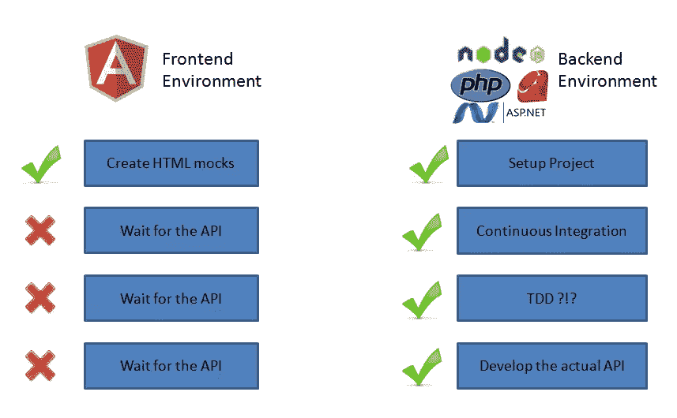
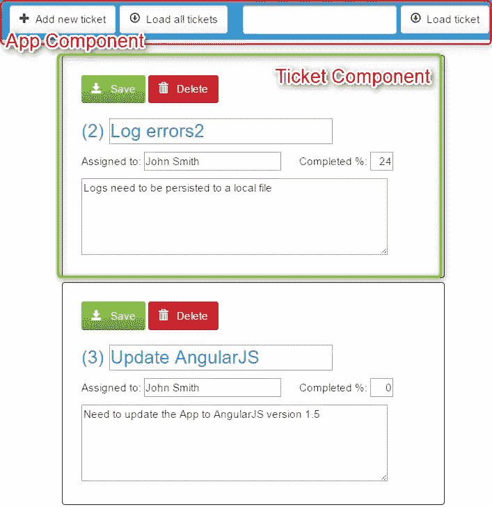

# 使用 MockBackend 开发不带后端的 Angular 应用程序

> 原文：<https://www.sitepoint.com/angular-2-mockbackend/>

在这篇文章中，我们展示了如何使用 Angular 2 MockBackend 类开发应用程序，为前端团队提供了一种独立于后端的方法，以及一个减少结构变化风险的有用接口。

让你的前端和后端团队全速前进肯定是每个公司都在寻找的东西。然而，团队经常会陷入阻塞依赖关系的陷阱。在这些情况下，一个团队即将进行的工作被另一个团队拥有的用户故事所阻碍。

其中一个例子是前端和后端之间的通信过程。最近，REST APIs 登上了所谓的通信标准的宝座。使用 JSON(一种简单而有效的数据传输格式)的好处是前端工作人员不再需要关心实际的后端。跨越网络的任何东西都是可以直接使用的，并且可以用来将数据引入到您的应用程序中。因此毫不奇怪，这些基本实体通常在前端根本没有建模，而是在到达时就被消费掉了。这给我们带来了一个基本问题，即必须等待后端团队提供有用的东西。如下图所示，我们看到两个团队并行开始，但是在某个时间，一个团队一直在等待另一个团队赶上。



除此之外，没有固定的结构使得每一个变化都是潜在的危险。因此，本文的重点是提供一种方法，使前端团队可以独立于后端，同时提供一个有用的接口，减少结构变化的风险。

*本文已根据 Angular 的最新版本 2.1.2 进行了更新。链接的 Plunkr 示例应用程序也已更新。*

## 一个没有真正后端的票务系统

为了实现这种独立性，必须开始提前思考你的项目。你打算用什么实体？因此会产生什么样的通信端点？

这可以通过创建一个小表来实现，突出显示必要的 REST 端点并描述它们的用途。请记住，我们提前这么做的原因是为了让双方就沟通的通用结构达成一致。这并不意味着它必须完美地完成，但它应该帮助你开始最重要的步骤。久而久之，只要根据需要更新你的界面。

创建一个无止境的环境的实际过程是捕获所有 HTTP 请求，而不是将它们放在外面，用一个包含我们想要的信息的假响应进行回复。本文将通过描述一个简单的票务系统来演示这种方法。它使用下表中显示的端点。

*注意，这个例子在更新和创建路由时都使用了`POST`动词。另一个选择是利用`PUT`对[进行更新过程](http://restcookbook.com/HTTP%20Methods/put-vs-post/)。但是请记住，PUT 应该是[幂等的](http://www.restapitutorial.com/lessons/idempotency.html)，这意味着每个连续的调用都必须产生相同的结果。请随意选择适合你需要的东西。*

| 方法 | 途径 | 请求正文 | 描述 |
| --- | --- | --- | --- |
| 得到 | /票 | 没有人 | 请求所有门票 |
| 得到 | /ticket/:id | 没有人 | 通过提供的:id 参数请求一张票 |
| 邮政 | /票 | 票务实体 | 创建新票证或更新现有票证 |
| 删除 | /ticket/:id | 没有人 | 删除由:id 参数标识的票据 |

<small>表 1:票务系统的消费端点</small>

票证实体是一个简单的 TypeScript 类，包含一些基本的票证信息:

```
export class Ticket {
  public _id: string;
  public title: string;
  public assignedTo: string;
  public description: string;
  public percentageComplete: number;

  constructor(id: string, title: string, assignedTo: string,
    description: string, percentageComplete: number) {
    this._id = id;
    this.title = title;
    this.assignedTo = assignedTo;
    this.description = description;
    this.percentageComplete = percentageComplete;
  }
} 
```

<small>`ticket.entity.ts`描述票务实体</small>

您可以在 [Plunker](http://plnkr.co/wfl1NjvEgkmjOqhHBelY) 上找到这个例子的完整代码和预览:

[https://embed.plnkr.co/R85tyr/?show=preview](https://embed.plnkr.co/R85tyr/?show=preview)

## Angular 2 项目设置

理论已经讲得够多了，让我们动手做一些编码吧。此处显示的项目结构是基于提议的 [Angular 2 入门指南](https://angular.io/docs/ts/latest/quickstart.html)构建的。因此，我们不会浪费太多时间来解释它的每一部分。如果你正在寻找一篇介绍性的文章，看看[使用 TypeScript](https://www.sitepoint.com/getting-started-with-angular-2-using-typescript/) 开始使用 Angular 2。对于本文，您可以打开上面提到的 Plunker，按照下面解释的代码部分进行操作。

由于大多数单页应用程序都是从一个`index.html`文件开始的，所以让我们先来看看这个文件。第一部分导入必要的聚合填充。接下来我们可以看到对`system.config.js`的另一个引用，它配置第三方依赖和 Angular 的应用文件。反应式扩展(Rx)实际上并不是一个真正的依赖，而是简化了 Angular 的可观测量的工作，它取代了以前使用的承诺。我强烈推荐科里·瑞兰的[这篇文章，以了解关于这个话题的更多信息。](https://coryrylan.com/blog/angular-2-observable-data-services)

请注意，手动脚本引用并不是创建生产就绪型应用程序的推荐方式。你应该使用像 [npm](https://www.npmjs.com/) 或者 [jspm](https://jspm.io/) 这样的包管理器。后者与 SystemJS 协同工作，如第二部分所述。SystemJS 是一个模块加载器，之前基于 ECMAScript 2015 草案，现在是 [WHATWG 的加载器规范](https://whatwg.github.io/loader/)的一部分。因此，它支持使用`import x from 'module'`语法。为了正确使用它，我们需要在前面提到的文件`system.config.js`中配置它，然后导入应用程序的主入口点`app`，它指向文件`app/boot.ts`。

*本文不会深入探讨`system.config.js`的细节，因为这些只是基于 Angular Quickstart 示例的一个示例。*

最后，我们通过使用名为`my-app`的定制标签来创建应用程序。这些被称为组件，有点类似于角度。JS 1.x 指令。

```
<!DOCTYPE html>
<html>

  <head>
    <title>ng2 Ticketing System</title>

   <!-- 1\. Load libraries -->
     <!-- Polyfill(s) for older browsers -->
    <script src="https://unpkg.com/core-js/client/shim.min.js"></script>

    <script src="https://cdnjs.cloudflare.com/ajax/libs/lodash.js/3.10.1/lodash.min.js"></script>

    <script src="https://unpkg.com/zone.js@0.6.25?main=browser"></script>
    <script src="https://unpkg.com/reflect-metadata@0.1.8"></script>
    <script src="https://unpkg.com/systemjs@0.19.39/dist/system.src.js"></script>

    <!-- 2\. Configure SystemJS -->
    <script src="system.config.js"></script>
    <script> System.import('app')
            .then(null, console.error.bind(console)); </script>

    <meta charset="utf-8"/>
    <link href="vendor/bootstrap/css/bootstrap.min.css" rel="stylesheet"/>
    <link rel="stylesheet" href="styles.css"/>

  </head>

  <!-- 3\. Display the application -->
  <body>
    <my -app>Loading ...</my>
  </body>
</html> 
```

文件`boot.ts`用于将 Angular 引导至`my-app`组件。连同所有特定应用程序的代码，它位于文件夹`app`中。在`boot.ts`内部，我们将执行必要的第一步，以便利用一个模拟的后端，它将作为真实后端的替代品。

我们首先创建一个根模块来存放我们的应用程序。它的`provider`部分用来告诉 Angular 的 DI(依赖注入)系统我们想要使用一个类的哪个实际实例以及它需要什么依赖。`BaseRequestOptions`提供了一般的 http 助手，MockBackend 注册了一个模拟实现的实例，我们将用它来创建我们的假回复。如果我们查看第三个提供者配置，创建一个`Http`服务的定制实例，我们可以看到请求的依赖项(`deps`)被传递给了`useFactory`方法。这些然后被用来创建一个新的`Http`实例。

然后使用`imports`属性声明额外的模块依赖关系，之后是`declarations`，注册根模块的所有可用组件。这种模块范围的注册使每个组件知道什么是可用的，而不必像 Angular 2 的以前版本那样明确地声明指令请求。最后一个属性`bootstrap`用于声明哪个组件应该是入口点。

最后，使用 bootstrapModule 方法来启动应用程序。

```
import { platformBrowserDynamic } from '@angular/platform-browser-dynamic';
import { BrowserModule } from '@angular/platform-browser';
import { NgModule } from '@angular/core';
import { MockBackend } from '@angular/http/testing';
import { Http, BaseRequestOptions } from '@angular/http';
import { FormsModule }   from '@angular/forms';

import {AppComponent} from './app.component';
import {TicketComponent} from './ticket.component';

@NgModule({
  providers: [
     BaseRequestOptions,
     MockBackend,
     {
       provide: Http,
       deps: [MockBackend, BaseRequestOptions],
       useFactory: (backend, options) => { return new Http(backend, options); }
     }
  ],
  imports: [BrowserModule, FormsModule],
  declarations: [ AppComponent, TicketComponent ],
  bootstrap: [AppComponent]
})
export class AppModule { }

const platform = platformBrowserDynamic();
platform.bootstrapModule(AppModule); 
```

MockBackend 类最初是为了在单元测试场景中使用，目的是模拟真实的服务器调用，从而保持单元测试运行的快速和隔离。你可以在[官方 Http 文档](https://angular.io/docs/js/latest/api/http/Http-class.html)中读到更多相关内容。

## 使用组件

现在是时候看一看完成的应用程序，以确定我们将要使用的组件。与每个 Angular 2 应用程序一样，有一个所谓的`AppComponent`，它充当应用程序的主要入口点。它也可以用作容器，显示一般导航和托管子组件。说到这些，我们可以看到`TicketComponent`被反复使用来显示多个票实体。



app 组件被配置为与选择器`my-app`一起使用，加载位于`templates`子文件夹中的模板`index.html`。最后，`providers`告诉 Angular 的 DI 我们想要获得`TicketService`的一个实例。

```
...
@Component({
  selector: 'my-app',
  templateUrl: 'app/templates/index.html',
  providers: [TicketService]
})
export class AppComponent { 
```

接下来我们定义一个`db`类属性，它将保存一组假票。

```
// Fake Tickets DB
private db: Ticket[] = [
new Ticket(
  '1', 'Missing Exception', 'John Smith',
  'Method XYZ should throw exception in case ABC', 0),
new Ticket(
  '2', 'Log errors', 'John Smith',
  'Logs need to be persisted to a local file', 24),
new Ticket(
  '3', 'Update AngularJS', 'John Smith',
  'Need to update the App to AngularJS version 1.5', 0),
new Ticket(
  '4', 'Border is missing', 'Jane Doe',
  'The element div.demo has no border defined', 100),
new Ticket(
  '5', 'Introduce responsive grid', 'Jane Doe',
  'Implement reponsive grid for better displays on mobile devices', 17)
]; 
```

构造函数现在接收注入的`TicketService`以及伪后端。在这里，我们现在订阅了`connections`流。对于每个传出的请求，我们现在将检查它的`request.method`和`request.url`，以便找出请求的端点类型。如果匹配了正确的路由，我们使用`mockRespond`方法进行回复，用一个包含预期结果的新`Response`作为主体，用类`ResponseOptions`进行初始化。

```
constructor(private service: TicketService, private backend: MockBackend) {
this.backend.connections.subscribe( c => {

  let singleTicketMatcher = /\/api\/ticket\/([0-9]+)/i;

  // return all tickets
  // GET: /ticket
  if (c.request.url === "http://localhost:8080/api/ticket" && c.request.method === 0) {
    let res = new Response( new ResponseOptions({
      body: JSON.stringify(this.db)
    }));

    c.mockRespond(res);
  } 
```

当请求单个票证时，我们使用上面定义的`singleTicketMatcher`来对`request.url`执行正则表达式搜索。之后，我们搜索给定的 ID 并用相应的票据实体进行回复。

```
// return ticket matching the given id
// GET: /ticket/:id
else if (c.request.url.match(singleTicketMatcher) && c.request.method === 0) {
let matches = this.db.filter( (t) => {
  return t._id == c.request.url.match(singleTicketMatcher)[1]
});

c.mockRespond(new Response( new ResponseOptions({
  body: JSON.stringify(matches[0])
})));
} 
```

在更新和创建新票据的情况下，我们通过请求体而不是查询参数或 URL 模式来获得票据实体。除此之外，这项工作相当简单。我们首先检查票证是否已经存在并更新它，否则我们创建一个新的票证并将其与响应一起发送回去。我们这样做是为了通知请求者新的票证 ID。

```
 // Add or update a ticket
  // POST: /ticket
  else if (c.request.url === 'http://localhost:8080/api/ticket' && c.request.method === 1) {
    let newTicket: Ticket = JSON.parse(c.request._body);

    let existingTicket = this.db.filter( (ticket: Ticket) => { return ticket._id == newTicket._id});
    if (existingTicket && existingTicket.length === 1) {
      Object.assign(existingTicket[0], newTicket);

      c.mockRespond(new Response( new ResponseOptions({
        body: JSON.stringify(existingTicket[0])
      })));
    } else {
      newTicket._id = parseInt(_.max(this.db, function(t) {
        return t._id;
      })._id || 0, 10) + 1 + '';

      this.db.push(newTicket);

      c.mockRespond(new Response( new ResponseOptions({
        body: JSON.stringify(newTicket)
      })));
    }
  }
  // Delete a ticket
  // DELETE: /ticket/:id
  else if (c.request.url.match(singleTicketMatcher) && c.request.method === 3) {
    let ticketId = c.request.url.match(singleTicketMatcher)[1];
    let pos = _.indexOf(_.pluck(this.db, '_id'), ticketId);

    this.db.splice(pos, 1);

    c.mockRespond(new Response( new ResponseOptions({
      body: JSON.stringify({})
    })));
  }

});
} 
```

最后但同样重要的是，当组件完全呈现时，页面生命周期钩子`ngOnInit`将触发所有标签的加载。

```
public ngOnInit() {
    this.service.loadAllTickets();
  }
} 
```

在一个真正的生产应用程序中，你可以将模拟设置分离到一个单独的服务中，并将其作为一个依赖项注入到 AppComponent 中。或者更好的是，你可以创建一个全新的模块来存放你的虚拟服务器，并把它添加到你的应用程序的根模块中。为了使演示更简单，这里省略了这一点。

查看`TicketComponent`我们可以看到，除了组件装饰器之外，没有什么太有趣的事情发生。我们将`ticket`定义为选择器，并再次指向一个单独的模板文件。现在，与`AppComponent`相反，我们期望创建一个带有名为`title`的属性的标签，并获得要呈现的实体。

然后，构造函数最终获得注入的`TicketService`，并将其分配给一个类属性`service`。

```
import {
  Component,
  Input
} from '@angular/core';

import {Ticket} from './ticket.entity';
import {TicketService} from './ticket.service';

@Component({
  moduleId: module.id,
  selector: 'ticket',
  templateUrl: 'templates/ticket.html',
  //providers: [TicketService] < -- this would override the parent DI instance
})
export class TicketComponent {
  @Input('ticket') ticket: Ticket;

  constructor(private service: TicketService) { }
} 
```

## 票务服务

最后缺少的是`TicketService`，用于将 Ajax 调用从组件中抽象出来。正如我们所看到的，它期望注入`http`服务。现在，记住最初的`boot.ts`文件，我们知道提供的实例将是带有模拟后端的那个。通过利用`post`或`get`之类的`HTTP`服务请求方法，映射结果——在本例中是假回复——并继续定制应用程序逻辑，实际请求保持不变。

```
import {Ticket} from './ticket.entity';
import {Injectable} from '@angular/core';
import {Http, Headers} from '@angular/http';
import 'rxjs/add/operator/map';

@Injectable()
export class TicketService {
  tickets: Ticket[] = [];

  constructor(private http: Http) {

  }

  addNewTicket() {
    var headers = new Headers();
    headers.append('Content-Type', 'application/json');

      var newTicket = new Ticket("0", 'New Ticket', 'Nobody', 'Enter ticket description here', 0);
    this.http
      .post('http://localhost:8080/api/ticket', JSON.stringify(newTicket), headers)
      .map(res => res.json())
      .subscribe(
        data => this.tickets.push(data),
        err => this.logError(err),
        () => console.log('Updated Ticket')
      );
  }

  saveTicket(ticket: Ticket) {
    ...
  }

  deleteTicket(ticket: Ticket) {
    ...
  }

  loadAllTickets() {
    ...
  }

  loadTicketById(id) {
    ...
  }

  logError(err) {
    console.error('There was an error: ' + err);
  }
} 
```

## 结论

总之，我们看到了 Angular 的依赖注入如何帮助我们用一个模拟的后端替换默认的`HTTP`服务的`XHRBackend`。在`AppComponent`中，我们创建了我们的假数据库，拦截每一个传出的请求，并用定制的假响应进行回复。我们现在获得的好处是完全独立于后端团队，同时有一个定义好的接口。现在，一旦生产后端就位，我们需要做的就是移除依赖注入覆盖和伪造的后端，我们就可以开始了。

*这篇文章由[丹普林斯](https://www.sitepoint.com/author/dprince)和[拉比基兰](https://www.sitepoint.com/author/rkiran/)进行了同行评审。感谢 SitePoint 的所有同行评审员使 SitePoint 的内容尽可能做到最好！*

## 分享这篇文章