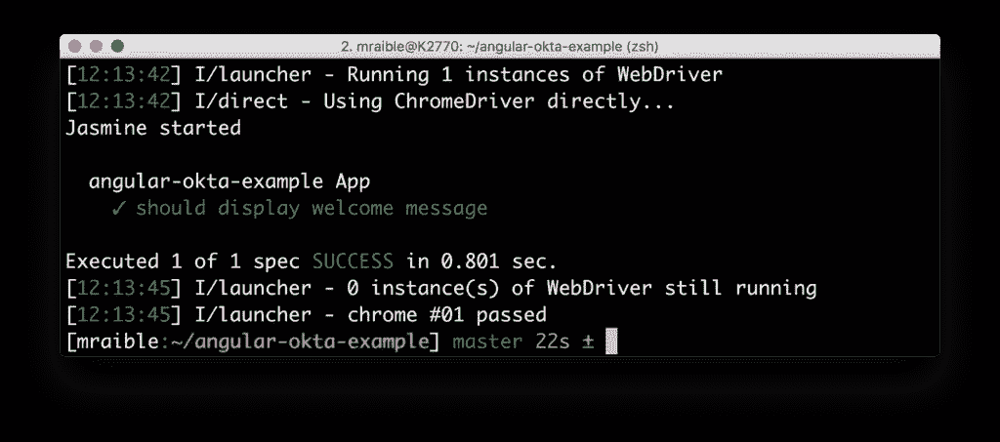
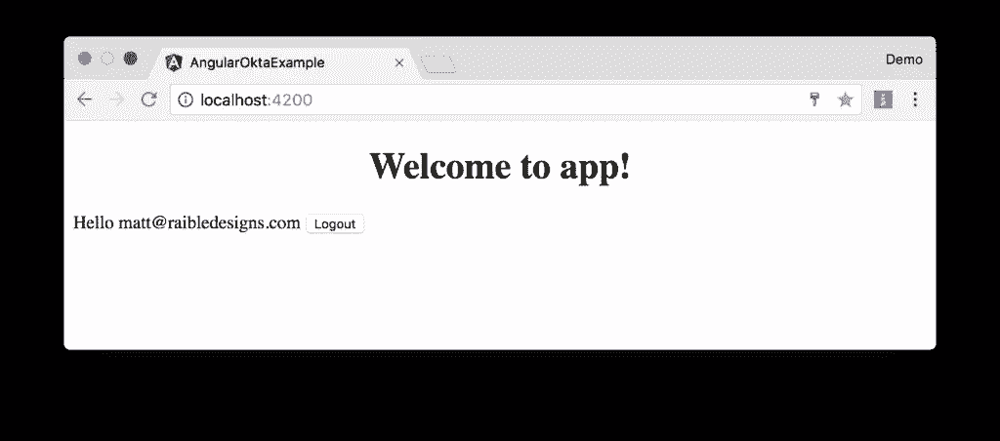
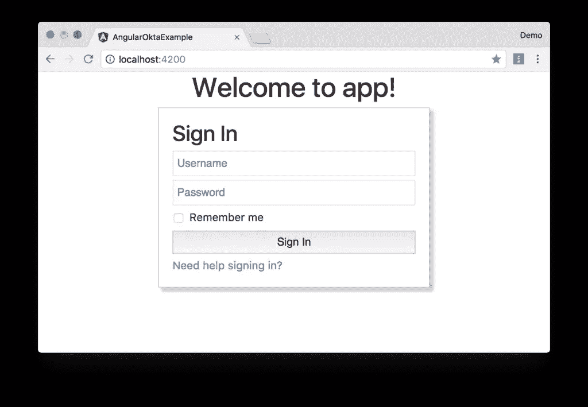

# Angular 和用户身份验证入门

> 原文：<https://www.sitepoint.com/angular-app-sign-in/>

*本文最初发表在 [OKTA 开发者博客](https://developer.okta.com/blog/2017/03/27/angular-okta-sign-in-widget)上。感谢您对使 SitePoint 成为可能的合作伙伴的支持。*

AngularJS 作为 JavaScript MVC 框架之王统治了好几年。然而，当 Angular 团队宣布他们不会为他们的下一个版本提供向后兼容性时，在其社区中引起了一点轰动，为 React 和 Vue.js 这样的框架提供了蓬勃发展的机会。快进几年，Angular 2 和 Angular 4 都已经发布。许多开发人员正在尝试它的 TypeScript，并发现这是一种愉快的体验。根据 JAXenter 的说法，它做得非常好，并且保持着作为第三大流行 UI 框架的优势，仅次于 React 和 HTML5。

在本文中，我将向您展示一种快速入门 Angular 的方法，并使用 [Okta 的登录小部件](https://developer.okta.com/code/javascript/okta_sign-in_widget)添加用户认证。如果你刚刚开始使用 Angular，你可能想看看我的 [Angular 教程](http://gist.asciidoctor.org/?github-mraible/ng-demo//README.adoc)。如果你想获得本文中使用的源代码，你可以[在 GitHub](https://github.com/oktadeveloper/okta-angular-sign-in-widget-example) 上找到它。

## 为什么要用 Okta 进行用户认证？

Okta 提供了一个 API 服务，允许开发者创建、编辑和安全存储用户账户和用户账户数据，并将它们与一个或多个应用程序连接起来。我们使用户帐户管理更加简单、安全和可扩展，以便您可以更快投入生产。

Okta 登录小部件提供了一个可嵌入的 JavaScript 登录实现，可以很容易地定制。登录小工具在每个租户的标准 Okta 登录页面中具有相同的功能集，并增加了更改外观和感觉的灵活性。这个小部件包括对密码重置、忘记密码和强认证的支持——所有这些都是由 Okta 中配置的策略驱动的。开发人员不必编写一行代码就可以在小部件中触发这些功能。对于面向消费者的网站，小部件也支持社交提供商。

## 创建角度应用程序

Angular 4 最近发布了，还有 [Angular CLI 1.0](https://github.com/angular/angular-cli/releases/tag/v1.4.4) 。要了解如何在简单的 Angular 应用程序中使用 Okta 的登录小部件，请使用 Angular CLI 创建一个新的应用程序。首先，你需要安装 Angular CLI。

```
npm install -g @angular/cli 
```

该命令完成后，您可以创建一个新的应用程序。

```
[mraible:~] $ ng new angular-okta-example
  create angular-okta-example/README.md (1034 bytes)
  create angular-okta-example/.angular-cli.json (1255 bytes)
  create angular-okta-example/.editorconfig (245 bytes)
  create angular-okta-example/.gitignore (516 bytes)
  create angular-okta-example/src/assets/.gitkeep (0 bytes)
  create angular-okta-example/src/environments/environment.prod.ts (51 bytes)
  create angular-okta-example/src/environments/environment.ts (387 bytes)
  create angular-okta-example/src/favicon.ico (5430 bytes)
  create angular-okta-example/src/index.html (305 bytes)
  create angular-okta-example/src/main.ts (370 bytes)
  create angular-okta-example/src/polyfills.ts (2498 bytes)
  create angular-okta-example/src/styles.css (80 bytes)
  create angular-okta-example/src/test.ts (1085 bytes)
  create angular-okta-example/src/tsconfig.app.json (211 bytes)
  create angular-okta-example/src/tsconfig.spec.json (304 bytes)
  create angular-okta-example/src/typings.d.ts (104 bytes)
  create angular-okta-example/e2e/app.e2e-spec.ts (302 bytes)
  create angular-okta-example/e2e/app.po.ts (208 bytes)
  create angular-okta-example/e2e/tsconfig.e2e.json (235 bytes)
  create angular-okta-example/karma.conf.js (923 bytes)
  create angular-okta-example/package.json (1325 bytes)
  create angular-okta-example/protractor.conf.js (722 bytes)
  create angular-okta-example/tsconfig.json (363 bytes)
  create angular-okta-example/tslint.json (2968 bytes)
  create angular-okta-example/src/app/app.module.ts (314 bytes)
  create angular-okta-example/src/app/app.component.css (0 bytes)
  create angular-okta-example/src/app/app.component.html (1120 bytes)
  create angular-okta-example/src/app/app.component.spec.ts (986 bytes)
  create angular-okta-example/src/app/app.component.ts (207 bytes)
You can `ng set --global packageManager=yarn`.
Installing packages for tooling via npm.
Installed packages for tooling via npm.
Successfully initialized git.
Project 'angular-okta-example' successfully created.
[mraible:~] 2m6s $ 
```

这将创建一个新的`angular-okta-example`目录并安装所有必要的依赖项。为了验证一切正常，在终端窗口中运行`ng e2e`。所有测试都应该通过，您应该会看到如下结果。



## 在 Angular 中集成 Okta 的登录小部件

现在，我们将利用 Okta 的登录窗口小部件实现一个可轻松定制的登录视图。首先，使用 npm 安装 [Okta 登录小部件](https://github.com/okta/okta-signin-widget)。

```
npm install --save @okta/okta-signin-widget 
```

将小部件的 CSS 添加到`src/styles.css`:

```
@import '~https://ok1static.oktacdn.com/assets/js/sdk/okta-signin-widget/2.1.0/css/okta-sign-in.min.css';
@import '~https://ok1static.oktacdn.com/assets/js/sdk/okta-signin-widget/2.1.0/css/okta-theme.css'; 
```

创建`src/app/shared/okta/okta.service.ts`并使用它包装小部件的配置，使其成为可注入的服务。

```
import { Injectable } from '@angular/core';
import * as OktaSignIn from '@okta/okta-signin-widget/dist/js/okta-sign-in.min.js';

@Injectable()
export class Okta {
  widget;

  constructor() {
    this.widget = new OktaSignIn({
      baseUrl: 'https://{yourOktaDomain}.com',
      clientId: '{clientId}',
      redirectUri: 'http://localhost:4200'
    });
  }

  getWidget() {
    return this.widget;
  }
} 
```

为了使这个服务对应用程序中的所有组件可用，修改`app.module.ts`并将`Okta`列为提供者。

```
import { Okta } from './shared/okta/okta.service';

@NgModule({
  ...
  providers: [Okta],
  bootstrap: [AppComponent]
}) 
```

在此之前，您需要在 Okta 中创建一个 OpenID Connect (OIDC)应用程序，这样您就可以在初始化小部件时替换`{yourOktaDomain}`和`{clientId}`引用。

## 在 Okta 创建一个 OpenID Connect 应用程序

OpenID Connect 建立在 OAuth 2.0 协议之上。它允许客户端验证用户的身份，并获取他们的基本配置文件信息。要了解更多信息，请参见 http://openid.net/connect。

登录你的 Okta 账户，或者[创建一个](https://developer.okta.com/signup/)，如果你没有的话。导航至**应用程序**并点击**添加应用程序**按钮。选择 **SPA** 并点击下一个的**。在下一页中，将`http://localhost:4200`指定为基本 URI，登录重定向 URI，注销重定向 URI。点击**完成**，您应该会看到如下设置。**


## 显示登录小部件

完成这些更改后，将您的客户端 ID 和平台 ID 复制到`okta.service.ts`中。然后修改`app.component.ts`来使用`Okta`服务和小部件登录/注销。

```
import { Component, OnInit } from '@angular/core';
import { Okta } from './shared/okta/okta.service';

@Component({
  selector: 'app-root',
  templateUrl: './app.component.html',
  styleUrls: ['./app.component.css']
})
export class AppComponent implements OnInit {
  title = 'app works!';
  user;
  oktaSignIn;

  constructor(private okta: Okta) {
    this.oktaSignIn = okta.getWidget();
  }

  showLogin() {
    this.oktaSignIn.renderEl({el: '#okta-login-container'}, (response) => {
      if (response.status === 'SUCCESS') {
        this.user = response.claims.email;
      }
    });
  }

  ngOnInit() {
    this.oktaSignIn.session.get((response) => {
      if (response.status !== 'INACTIVE') {
        this.user = response.login
      } else {
        this.showLogin();
      }
    });
  }

  logout() {
    this.oktaSignIn.signOut(() => {
      this.showLogin();
      this.user = undefined;
    });
  }
} 
```

并修改`app.component.html`，使`<div>`带有`id="okta-login-container"`，并显示登录用户的电子邮件。

```
<div *ngIf="!user" id="okta-login-container"></div>

<div *ngIf="user">
  Hello {{user}}

  <button (click)="logout()">Logout</button>
</div> 
```

运行`ng serve`，打开浏览器到 [http://localhost:4200](http://localhost:4200) 。您应该会看到登录小部件。输入您的用户凭证之一
进行登录。您应该会看到带有注销按钮的“Hello {email}”消息。



**注意:**您可能会遇到登录过程似乎挂起的问题。点击浏览器窗口的任意位置似乎可以解决这个问题。我不确定为什么会这样。你可以在这里追踪这个问题[。](https://github.com/okta/okta-signin-widget/issues/268)

如果成功了，恭喜你！如果没有，请用一个 [okta 标签](http://stackoverflow.com/questions/tagged/okta)发布一个问题到 Stack Overflow，或者在 Twitter 上打我[。](https://twitter.com/mraible)

#### 自定义小部件 CSS

如果你想定制小部件的 CSS，最简单的方法是你自己写 CSS。删除添加到`src/styles.css`中的 CSS `@import`语句。为 [Bootstrap 4](https://getbootstrap.com/) 添加一个`@import`和一些样式规则来定位元素。将下面的代码复制到`src/styles.css`中。

```
@import url(https://maxcdn.bootstrapcdn.com/bootstrap/4.0.0-beta/css/bootstrap.min.css);

#okta-login-container {
  margin: 0 auto;
  max-width: 400px;
  border: 1px solid silver;
  padding: 20px;
  box-shadow: 5px 5px 5px 0 silver;
}

#okta-login-container input {
  margin-bottom: 5px;
  width: 100%;
  padding: 5px;
}

#okta-login-container input[type=checkbox] {
  width: 25px;
} 
```

进行这些更改后，登录小部件将类似于下面的屏幕截图。



## 修复您的测试

如果您尝试运行`npm test`或`ng test`，测试将会失败:

```
Chrome 61.0.3163 (Mac OS X 10.12.6): Executed 3 of 3 (3 FAILED) (0 secs / 0.157 secs)
Chrome 61.0.3163 (Mac OS X 10.12.6) AppComponent should render title in a h1 tag FAILED
    Failed: No provider for Okta! 
```

要解决这个问题，请在`src/app/app.component.spec.ts`中将`Okta`指定为提供者。

```
import { Okta } from './shared/okta/okta.service';

describe('AppComponent', () => {
  beforeEach(async(() => {
    TestBed.configureTestingModule({
      declarations: [
        AppComponent
      ],
      providers: [Okta]
    }).compileComponents();
  })); 
```

做出这些改变后，你应该会看到成功的甜蜜味道。

```
Chrome 61.0.3163 (Mac OS X 10.12.6): Executed 3 of 3 SUCCESS (0.77 secs / 0.759 secs) 
```

量角器测试应该仍然有效。您可以通过在终端窗口中运行`ng e2e`来证明这一点。

## 角度+八分之一

你可以在 GitHub 上找到这篇博文[中创建的应用程序的完整版本。在以后的文章中，我将向您展示如何创建一个更有角度的原生体验，其中您可以控制登录表单的 HTML。](https://github.com/oktadeveloper/okta-angular-sign-in-widget-example)

在应用程序中建立身份验证很难。在你构建的每个应用中一遍又一遍的构建就更没意思了。Okta 为您完成了最难的部分，并使开发变得更加有趣！注册一个永远免费的开发者账户，今天就来试试 Okta 吧！。

我希望你喜欢我们的角度支持快速游览。如果你对 okta 的功能有疑问，或者我们下一步要做什么，请在 Twitter 上给我打电话，[发表一个问题，用“Okta”标签堆叠溢出](http://stackoverflow.com/questions/tagged/okta)，或者[在 GitHub 上开一期](https://github.com/oktadeveloper/okta-angular-sign-in-widget-example/issues/new)。

## 分享这篇文章