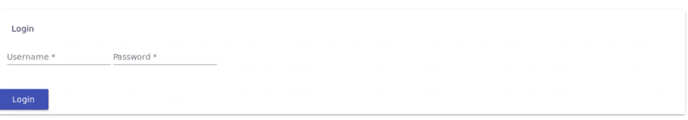
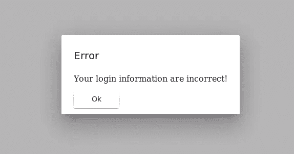
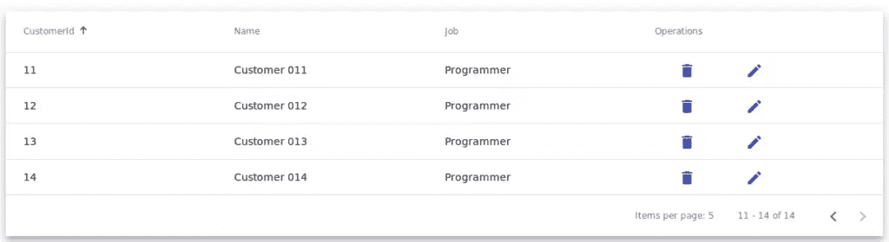
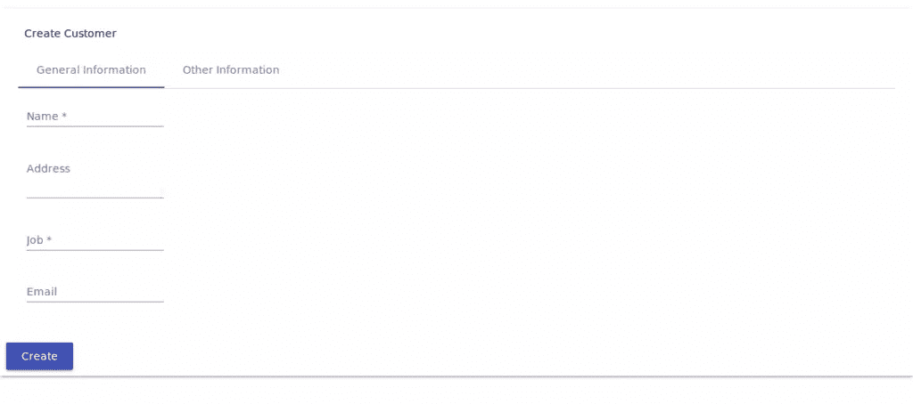

# 使用角度材料设计组件创建用户界面

> 原文：<https://www.sitepoint.com/angular-material-design-components/>

在本教程中，我将向您介绍 Angular 中的材质设计，然后我们将看看如何创建一个简单的 Angular 应用程序，该程序具有由各种 Angular 材质组件构建的 UI。

Angular、React 和 Vue.js 等基于组件的框架的广泛采用，使得越来越多的预构建 UI 组件集合变得可用。使用这样的集合可以帮助开发人员快速创建专业外观的应用程序。

## 什么是材料设计？

材料设计(代号**量子纸**)是一种视觉语言，可以用来创造数字体验。这是一套跨平台和设备的原则和指南，用于交互、运动和组件，简化团队设计产品的设计工作流程。

Material 组件允许您创建具有强大的模块化、主题化和定制功能的专业用户界面。

## 角状材料介绍

[有角材料](https://material.angular.io)是对有角材料设计原则和准则的贯彻。它包含各种 UI 组件，例如:

*   表单控件(输入、选择、复选框、日期选择器和滑块等。),
*   导航模式(菜单、侧导航和工具栏)
*   布局组件(网格、卡片、选项卡和列表)
*   按钮
*   指示器(进度条和微调器)
*   弹出窗口和模态
*   带有标题和分页等的数据表。

## 要求

在继续本教程之前，您需要确保您有一台安装了 Node (6.9.0+)和 NPM (3+)的开发机器。

您还需要安装 Angular CLI。如果不是这样，只需在终端或命令提示符下运行以下命令:

```
npm install -g @angular/cli 
```

## 使用 Angular CLI 创建项目

现在让我们使用 Angular CLI 创建 Angular 项目。只需运行以下命令:

```
ng new angularmaterialdemo 
```

然后，您可以通过运行以下命令为您的应用程序提供服务:

```
cd angularmaterialdemo
ng serve 
```

应用程序将在`http://localhost:4200`运行。

由于我们将演示不同的角形材料组件，因此需要为一个简单的演示应用程序创建一些角形组件和路由配置，因此继续使用 CLI 来生成组件:

```
ng g component login
ng g component CustomerList
ng g component CustomerCreate 
```

接下来，打开`src/app/app.module.ts`并添加路由器配置:

```
/*...*/

import { RouterModule, Routes } from  '@angular/router';

/*...*/

const  appRoutes:  Routes  = [
{ path:  'customer-list', component:  CustomerListComponent },
{ path:  'customer-create', component:  CustomerCreateComponent },
{
path:  'login',
component:  LoginComponent
},
{ path:  '',

redirectTo:  '/login',

pathMatch:  'full'

},
]; 
```

## 开始使用角形材料

现在我们有了一个基本的应用程序，让我们开始安装 Angular Material 及其不同的依赖项，以实现不同的功能，如手势和动画。

### 安装角形材料和角形 CDK

让我们从安装 npm 的角度材质和角度 CDK 开始。

回到您的终端，运行以下命令:

```
npm install --save @angular/material @angular/cdk 
```

### 添加锤子以支持手势

像`mat-slide-toggle`、`mat-slider`和`matTooltip`这样的组件需要 [HammerJS](http://hammerjs.github.io/) 库来支持手势，所以你需要安装它来获得这些组件的全部特性。只需在终端中运行以下命令:

```
npm install --save hammerjs 
```

接下来，打开`src/main.js`(应用程序的入口点)并导入`hammerjs`

```
import 'hammerjs'; 
```

### 添加主题

棱角分明的素材有一堆预置的主题。要使用主题，您只需在`styles.css`中导入它:

```
@import "~@angular/material/prebuilt-themes/indigo-pink.css"; 
```

你可以在本[指南](https://material.angular.io/guide/theming)中找到更多关于主题化的信息。

### 添加有角度的材料图标

Angular Material 自带了一个用于图标的`mat-icon`组件，所以在使用之前需要加载图标字体。

将以下标签添加到您的`index.html`文件中:

```
<link href="https://fonts.googleapis.com/icon?family=Material+Icons" rel="stylesheet"> 
```

### 使用带有角度材质组件的动画

最后一件事是启用动画。一些组件依赖角度动画模块来进行高级转换，因此您需要安装`@angular/animations`模块，并在您的应用程序模块配置中包含`BrowserAnimationsModule`。

首先，回到您的终端，运行以下命令:

```
npm install --save @angular/animations 
```

接下来，打开`src/app/app.module.ts`并添加以下代码:

```
/* ... */
import {BrowserAnimationsModule} from '@angular/platform-browser/animations';

@NgModule({
/*...*/
imports: [
BrowserModule,
BrowserAnimationsModule,
],
})
export  class  AppModule { } 
```

## 导入角度材料组件

在使用任何角度材质组件之前，您必须导入其模块。每个组件都有自己的模块，因此您可以只包含将要使用的组件。

另一种方法是创建一个单独的模块，导入您需要使用的所有角度材料组件，然后简单地将该模块包含在您的应用程序模块中。

因此，继续创建一个`src/app/material.module.ts`文件，然后添加以下内容:

```
import { NgModule } from  '@angular/core';
import {MatNativeDateModule,MatSnackBarModule,MatIconModule,MatDialogModule, MatButtonModule, MatTableModule, MatPaginatorModule , MatSortModule,MatTabsModule, MatCheckboxModule, MatToolbarModule, MatCard, MatCardModule, MatFormField, MatFormFieldModule, MatProgressSpinnerModule, MatInputModule } from  '@angular/material';
import {MatDatepickerModule} from  '@angular/material/datepicker';
import {MatRadioModule} from  '@angular/material/radio';
import {MatSelectModule} from  '@angular/material/select';
import {MatSliderModule} from  '@angular/material/slider';
import {MatDividerModule} from  '@angular/material/divider';

@NgModule({
imports: [MatTabsModule,MatDividerModule,MatSliderModule,MatSelectModule,MatRadioModule,MatNativeDateModule,MatDatepickerModule,MatSnackBarModule,MatIconModule,MatDialogModule,MatProgressSpinnerModule,MatButtonModule,MatSortModule,MatTableModule,MatTabsModule, MatCheckboxModule, MatToolbarModule, MatCardModule, MatFormFieldModule, MatProgressSpinnerModule, MatInputModule, MatPaginatorModule],
exports: [MatTabsModule,MatDividerModule,MatSliderModule,MatSelectModule,MatRadioModule,MatNativeDateModule,MatDatepickerModule,MatSnackBarModule,MatIconModule,MatDialogModule,MatProgressSpinnerModule,MatButtonModule,MatSortModule, MatCheckboxModule, MatToolbarModule, MatCardModule,MatTableModule,MatTabsModule, MatFormFieldModule, MatProgressSpinnerModule, MatInputModule, MatPaginatorModule],

})

export  class  MyMaterialModule { } 
```

接下来，将该模块包含在`src/app/app.module.ts`中:

```
import { MyMaterialModule } from  './material.module';

/*...*/

@NgModule({

/*...*/

imports: [

/*...*/
MyMaterialModule,
],
/*...*/
})

export  class  AppModule { } 
```

就是这样:您现在可以在您的角度应用程序中使用导入的角度材质组件。

## 为应用程序创建用户界面

您之前已经创建了应用程序组件并添加了路由器配置。现在让我们使用有角度的材质组件来构建不同组件的 UI。

### 为 AppComponent 构建 UI

继续打开`src/app/app.component.html`，然后添加:

*   带有三个材质按钮(`mat-button`)的材质工具栏，用于链接到应用程序组件
*   路由器出口`<router-outlet>`，匹配路由器路径的组件将被插入。

这是组件的 HTML 代码:

```
<mat-toolbar  color="primary"  class="fixed-header">
<mat-toolbar-row>
<span></span>
<a  mat-button  routerLink="/customer-list"  routerLinkActive="active">Customers</a>
<a  mat-button  routerLink="/customer-create">Create Customer</a>
<a  mat-button  routerLink="/login">Login</a>
</mat-toolbar-row>
</mat-toolbar>
<main>
<router-outlet  style="margin-top: 80px;"></router-outlet>
</main> 
```

通过添加一些样式，这就是工具栏的外观:


要创建工具栏，可以使用`<mat-toolbar>`组件，然后使用`<mat-toolbar-row>`组件在工具栏中创建一行或多行。

注意，我们已经从`material.module.ts`中的`@angular/material`导入了`MatToolbarModule`和`MatButtonModule`模块。

您还可以使用其他导航组件，如[菜单](https://material.angular.io/components/menu/overview)和[侧边栏](https://material.angular.io/components/sidenav/overview)。

### 为登录组件构建用户界面

在为我们的应用程序的根组件创建 UI 之后，让我们为登录组件创建 UI。

打开`src/app/login/login.component.html`并添加以下 HTML 代码。添加一个角材卡来包含登录表单:

```
<mat-card  class="login-card">
<mat-card-header>
    <mat-card-title>Login</mat-card-title>
</mat-card-header>
    <mat-card-content>
    <!-- The form goes here -->
    </mat-card-content> 
```

组件充当文本、照片和动作的单对象容器。从[文档](https://material.angular.io/components/card/overview)中找到更多关于卡片的细节。

接下来，在卡片的内容部分，添加 HTML 表单:

```
 <form  class="login-form">
        <!-- Form elements are here -->
    </form> 
```

现在，让我们添加两个输入来获取用户的用户名和密码凭证:

```
<mat-form-field>
<input  matInput  placeholder="Username" [(ngModel)]="username"  name="username"  required>
</mat-form-field>
<mat-form-field>
<input  matInput  placeholder="Password" [(ngModel)]="password"  type="password"  name="password"  required>
</mat-form-field> 
```

许多有角度的材料组件需要包装在一个 [<mat></mat>](https://material.angular.io/components/form-field/overview)组件中，以具有通用的[文本字段](https://material.io/guidelines/components/text-fields.html)样式，例如下划线、浮动标签和提示消息。

这些是设计用于包装在`<mat-form-field>`内的组件:

*   [`<input matInput>`和`<textarea matInput>`](https://material.angular.io/components/input/overview)
*   [T2`<mat-select>`](https://material.angular.io/components/select/overview)
*   [`<mat-chip-list>`](https://material.angular.io/components/chips/overview) 。

最后，在卡片的动作部分，让我们为登录动作添加一个有角度的材质按钮:

```
<mat-card-actions>
    <button  mat-raised-button (click)="login()"  color="primary">Login</button>
</mat-card-actions>
</mat-card> 
```

要创建一个有角度的材质按钮，只需使用原生 HTML `<button>`和`<a>`元素，并添加材质属性，如`mat-button`和`mat-raised-button`。更多详情，请查看[文档](https://material.angular.io/components/button/overview)。

这是登录表单的外观:



如果登录成功(*用户名:演示，密码:演示*)，用户将被重定向到*客户列表*组件。否则，用户将得到一条错误消息:“您的登录信息不正确！”

#### 创建错误模式对话框

`MatDialog`可用于创建和打开模态对话框。该对话框需要加载一个组件，因此首先创建一个角度组件，显示通过的错误消息。

创建`src/app/error.component.ts`，然后添加以下代码:

```
import {Component, Inject, Injectable} from  '@angular/core';

import {MatDialogRef, MAT_DIALOG_DATA, MatDialog} from  '@angular/material';

@Component({
templateUrl:  'error.component.html'
})
export  class  ErrorComponent {
    constructor(private  dialogRef:  MatDialogRef<ErrorComponent>, @Inject(MAT_DIALOG_DATA) public  data:  any) {
    }
    public  closeDialog() {
        this.dialogRef.close();
    }
} 
```

这个组件将被创建并用`MatDialog`打开，这样它可以注入`MatDialogRef`，它提供了一个打开的对话框的句柄，可以用来关闭对话框，并在对话框关闭时接收通知。(`closeDialog()`方法使用这个引用来关闭对话框。)

我们的错误组件需要一种方法来向用户显示错误消息。(当使用`MatDialog` open 方法打开组件时，消息将被传递。)您可以使用`MAT_DIALOG_DATA`注入令牌访问对话框组件中的数据，该令牌可以从`'@angular/material'`导入，然后使用`@Inject()`注入到组件中。

接下来，创建`src/app/error.component.html`并添加以下代码:

```
<h2  mat-dialog-title>Error</h2>
<mat-dialog-content  class="error">{{data.message}}</mat-dialog-content>
<mat-dialog-actions>
<button  mat-raised-button (click)="closeDialog()">Ok</button>
</mat-dialog-actions> 
```

我们使用许多可用的指令来构造对话框组件:

*   `mat-dialog-title`:用于对话框标题，需要应用于标题元素`<h1>`、`<h2>`等。
*   `<mat-dialog-content>`:用于对话框的滚动内容
*   `<mat-dialog-actions>`:用作对话框动作的容器。

接下来，打开`src/app/app.module.ts`并将该组件添加到模块中:

```
@NgModule({

declarations: [

/*...*/
    ErrorComponent
],

imports: [/*...*/
],
entryComponents: [ErrorComponent],
/*...*/
})

export  class  AppModule { } 
```

现在让我们将`login()`方法(触发错误对话框)添加到`LoginComponent`中:

```
import { Component, OnInit } from  '@angular/core';
import { MatDialog, MatDialogRef } from  '@angular/material';

/* ... */

@Component({
/* ... */
})
export  class  LoginComponent{

    public  username:  string  =  "";
    public  password:  string  =  "";

    constructor(private  dialog:  MatDialog, private  router:  Router) { }
    login(){
        if(this.username  ===  "demo"  &&  this.password  === "demo")
        {
            this.router.navigate(['customer-list']);
        }
        else
        {
            this.dialog.open(ErrorComponent,{ data: {
            message:  "Your login information are incorrect!"
            }});
        }
    }
} 
```

我们简单地注入`MatDialog`组件，并使用它打开一个对话框(如果用户凭证不正确的话),该对话框带有`ErrorComponent`组件和一个保存将要传递的数据的配置对象。`open()`方法返回一个`MatDialogRef`的实例。

这是错误对话框的屏幕截图:



你可以从[文档](https://material.angular.io/components/dialog/overview)中找到更多关于对话框的信息。

### 为 CustomerList 组件构建用户界面

对于`CustomerList`组件，我们将利用不同的角形材料组件，最重要的是:

*   [分页器](https://material.angular.io/components/paginator/overview)
*   [表](https://material.angular.io/components/table/overview)
*   [进度微调器](https://material.angular.io/components/progress-spinner/overview)

打开`src/app/customer-list/customer-list.component.html`并添加以下标记:

```
<div  class="mat-elevation-z8">
<!-- Other contents here -->
</div> 
```

`mat-elevation-z8`类是一个角度材质高程类，允许您添加沿 z 轴的元素之间的间隔。你可以从这个[链接](https://material.angular.io/guide/elevation)中找到更多细节。

#### 添加加载微调器

当数据仍在加载时，我们使用`<mat-spinner>`来显示一个微调器，我们使用`setTimeout()`函数来模拟:

```
<mat-spinner [style.display]="loading ? 'block' : 'none'"></mat-spinner> 
```

如果`loading`变量等于`true`，CSS `display`属性被赋予`block`值。否则，它会被赋予`none`，这样它就会消失。

您需要向组件类添加一个加载变量，该变量最初取值为`true`。

```
 loading  =  true;
    /*...*/
    constructor() {}
ngOnInit():  void {

    setTimeout(() => {

        this.loading  =  false;

    }, 2000);

    /*...*/ 
```

#### 添加带有数据源的数据表

然后我们使用`<mat-table>`创建一个材料数据表，只有当`loading`等于`false`时才显示:

```
<mat-table [style.display]="loading === false ? 'block' : 'none'" #table [dataSource]="dataSource">
<!-- Other contents here -->
</mat-table> 
```

数据表接受一个用于为表提供数据的属性`dataSource`。您可以简单地将一个数据数组传递到表中，但是对于真实世界的用例，您需要使用高级数据源，例如 Angular Material 提供的`MatTableDataSource`，它封装了高级操作的逻辑，例如分页、排序和过滤:

```
export  class  CustomerListComponent  implements  OnInit {

    customers:  Customer[] = [
    { id:1, name:'Customer 001',job:'Programmer'},
    /*...*/
    ];

    dataSource  =  new  MatTableDataSource<Customer>(this.customers); 
```

#### 添加列模板

对于每个列定义，您需要为其标题和行单元格提供唯一的名称和内容。例如，这是用于显示客户 ID 的列:

```
<ng-container  matColumnDef="id">
<mat-header-cell *matHeaderCellDef> CustomerId </mat-header-cell>
<mat-cell *matCellDef="let customer"> {{customer.id}} </mat-cell>
</ng-container> 
```

这是一个名为`id`的简单列定义。标题单元格包含文本`CustomerId`，每行单元格将呈现每行数据的`id`属性。

以类似的方式，您可以添加其他列定义。

对于操作栏，我们使用两个有角度的材质图标:`delete`和`edit`包裹着材质按钮:

```
<ng-container  matColumnDef="operations">

<mat-header-cell *matHeaderCellDef  mat-sort-header> Operations </mat-header-cell>

<mat-cell *matCellDef="let element">  <button  mat-button  color="primary" (click)="deleteCustomer(element.id)"><mat-icon>delete</mat-icon>

</button>  <button  mat-button  color="primary" (click)="editCustomer(element.id)"><mat-icon>edit</mat-icon></button>  </mat-cell>

</ng-container> 
```

#### 添加行模板

定义列模板之后，您需要定义行模板，因此首先您需要向组件添加一个变量，该变量包含您拥有的列的列表:

```
displayedColumns  = ['id', 'name', 'job', 'operations']; 
```

接下来，您需要将`<mat-header-row>`和`<mat-row>`添加到您的`<mat-table>`的内容中，并提供您的列列表作为输入:

```
<mat-header-row *matHeaderRowDef="displayedColumns"></mat-header-row>
<mat-row *matRowDef="let row; columns: displayedColumns;"></mat-row> 
```

#### 添加分页

只需在`<mat-table>`之后添加一个`<mat-paginator>`组件，就可以为数据表添加分页:

```
<mat-paginator #paginator [style.display]="loading === false ? 'block' : 'none'" [pageSize]="5"></mat-paginator> 
```

使用`MatTableDataSource`的一个好处是，通过简单地向数据源提供`MatPaginator`就可以获得现成的分页。

首先确保您在`material.module.ts`中导入了`MatPaginatorModule`。然后，您需要获得分页器指令:

```
@ViewChild(MatPaginator) paginator:  MatPaginator; 
```

最后，您只需将分页器传递给表的数据源:

```
ngAfterViewInit() {
    this.dataSource.paginator  =  this.paginator;
} 
```

#### 添加排序

使用`MatTableDataSource`你也可以通过添加一些东西来进行开箱整理。

首先，确保在您的模块(`material.module.ts`)中导入了`MatSortModule`。

接下来，将`matSort`指令添加到`<mat-table>`组件，然后将`mat-sort-header`添加到需要排序的每个列标题单元格。

例如，让我们将排序添加到`name`列:

```
<ng-container  matColumnDef="name">
<mat-header-cell *matHeaderCellDef  mat-sort-header> Name </mat-header-cell>
<mat-cell *matCellDef="let customer"> {{customer.name}} </mat-cell>
</ng-container> 
```

最后，您需要向数据源提供`MatSort`指令，它将自动进行排序:

```
import {MatTableDataSource, MatPaginator, MatSort} from  '@angular/material';
/*...*/
export  class  CustomerListComponent  implements  OnInit {

@ViewChild(MatSort) sort:  MatSort;

ngAfterViewInit() {
    /*...*/
    this.dataSource.sort  =  this.sort;
} 
```

您还可以在表格中添加过滤和选择功能。查看[文档](https://material.angular.io/components/table/overview)了解更多信息。

使用`MatTableDataSource`为您提供了许多开箱即用的内置特性，但它只支持客户端分页。对于服务器端分页或其他定制特性，您需要创建您的[定制数据源](https://material.angular.io/components/table/overview#datasource)。

在定制数据源的情况下，您需要监听分页器的`(page)`事件来实现分页，监听排序器的`(matSortChange)`事件来实现数据排序。

这是`CustomerList`组件的屏幕截图:



#### 添加 SnackBar 通知

首先确保你已经将`MatSnackBarModule`导入到你的模块中。接下来，将`MatSnackBar`导入并注入到组件中，然后简单地调用`MatSnackBar`实例的`open()`方法:

```
import {MatSnackBar} from  '@angular/material';
/*...*/
constructor(public  snackBar:  MatSnackBar) {}

deleteCustomer(id){
    let  snackBarRef  =  this.snackBar.open(`Deleting customer #${id}`);
}
editCustomer(id){
    let  snackBarRef  =  this.snackBar.open(`Editing customer #${id}`);
} 
```

### 为 CustomerCreate 组件构建 UI

对于`CustomerCreate`组件，我们将使用一组有角度的材料组件，例如:

*   卡组件(`<mat-card>`)
*   选项卡组件(`<mat-tab>`和`<mat-tab-group>`)
*   标签(`<mat-label>`)和输入(`<input matInput>`和`<textarea matInput>`)组件
*   表单字段(`<mat-form-field>`)组件
*   复选框(`<mat-checkbox>`)组件
*   日期选择器(`<mat-datepicker>`)组件
*   单选按钮(`<mat-radio-button`)组件
*   选择(`<mat-select>`)组件。

因此，打开`src/app/customer-create/customer-create.component.html`，开始添加保存客户创建表单的卡组件:

```
<mat-card  class="my-card">
<mat-card-header>
    <mat-card-title>Create Customer</mat-card-title>
</mat-card-header>

    <mat-card-content>
    <!-- The form goes here -->
    </mat-card-content>
    <mat-card-actions>
    <!-- Actions go here -->
    </mat-card-actions>
</mat-card> 
```

在卡片内容部分，让我们添加一个 HTML 表单:

```
<form  class="my-form">
<!-- Form fields here -->
</form> 
```

接下来，让我们使用角度材料选项卡组件将表单字段组织成水平选项卡。在 form 元素中，添加以下代码以创建两个标签为*一般信息*和*其他信息*的选项卡:

```
<mat-tab-group>
<mat-tab  label="General Information"  class="my-tab">
<!-- Form fields here -->
</mat-tab>
<mat-tab  label="Other Information"  class="my-tab">
<!-- Form fields here -->
</mat-tab>
</mat-tab-group> 
```

在每个选项卡中，我们将添加一个 HTML 表格来将表单字段组织到表格单元格中:

```
<table  style="width: 100%"  cellspacing="10">
<tr>
    <td> <!-- Form fields here --> </td>
</tr>
</table> 
```

为第一个选项卡添加以下内容。在表格行/单元格内，为客户名称添加一个字段:

```
<mat-form-field>
    <mat-label>Name</mat-label>
    <input  matInput  placeholder="Name" [(ngModel)]="name"  name="name"  required>
</mat-form-field> 
```

接下来为客户地址创建一个输入:

```
<mat-form-field>
    <mat-label>Address</mat-label>
    <textarea [(ngModel)]="address"  matInput></textarea>
</mat-form-field> 
```

最后，为客户电子邮件创建一个输入字段:

```
<mat-form-field>
    <mat-label>Email</mat-label>
    <input  matInput  placeholder="Email" [(ngModel)]="email"  name="email">
</mat-form-field> 
```

我们使用`<mat-label>`创建标签，`<input matInput />`创建输入字段，`<textarea matInput>`创建文本区域字段。

对于第二个选项卡，添加以下内容。在表格的第一行/单元格中，添加*是公司？*复选框:

```
<mat-checkbox [checked]="isCompany">Is company?</mat-checkbox> 
```

`checked`属性决定复选框是否被选中。

接下来，添加一个日期输入，日期选择器包裹在角形材料表单字段中:

```
<mat-form-field>
    <mat-label>Created At</mat-label>
    <input  [value]="createdAt.value" matInput [matDatepicker]="picker"  placeholder="Date of creation">
    <mat-datepicker-toggle  matSuffix [for]="picker"></mat-datepicker-toggle>
    <mat-datepicker #picker></mat-datepicker>
</mat-form-field> 
```

如[角度材料文件](https://material.angular.io/components/datepicker/overview)中所述:

> datepicker 允许用户通过文本输入或从日历中选择日期来输入日期。它由几个协同工作的组件和指令组成。

接下来，添加一组单选按钮来选择客户的性别:

```
<mat-label>Gender</mat-label>
<mat-radio-group [(value)]="selectedGender">
    <mat-radio-button  value="male">Male</mat-radio-button>
    <mat-radio-button  value="female">Female</mat-radio-button>
</mat-radio-group> 
```

要获得组中当前选中的单选按钮，只需将一个变量绑定到`value`属性。

最后，添加一个选择字段来选择销售线索/客户的来源:

```
<mat-form-field>
    <mat-label>Lead Source</mat-label>
        <mat-select [(value)]="selectedSource" placeholder="Source">
        <mat-option>None</mat-option>
        <mat-option value="email">Email Marketing</mat-option>
        <mat-option value="social">Social Media</mat-option>
        <mat-option value="affiliate">Affiliate</mat-option>
    </mat-select>
</mat-form-field> 
```

`<mat-select>`组件支持双向绑定到`value`属性，而不需要角度形式。

现在让我们添加一个按钮，从表单信息中创建客户:

```
<mat-card-actions>
    <button  mat-raised-button (click)="createCustomer()"  color="primary">Create</button>
</mat-card-actions> 
```

现在您需要创建绑定到这些控件的变量。在`src/app/customer-create/customer-create.component.ts`中，将以下代码添加到组件类中:

```
name:  string  =  "";
email:  string  =  "";
job:  string  =  "";
address:  string  =  "";
selectedSource:  string  =  "email";
selectedGender:  string  =  "male";
isCompany  :  boolean  =  false;
createdAt  =  new  FormControl(new  Date());
public  createCustomer(){
/* logic to create a customer from the form information*/
} 
```

这是组件用户界面的屏幕截图:



你可以在这里看到这个[的现场演示。](http://angularmaterial.surge.sh)

## 结论

凭借国际化、可访问性、无 bug 和高性能，Angular Material 旨在使用 Angular 并基于材料设计规范构建一组高质量的 UI 组件。

在本教程中，我们已经建立了一个简单的用户界面使用角材料与各种用户界面组件。您可以从[角材文档](https://material.angular.io/)中找到一整套可用的角材组件。

你可以在 GitHub 库的[中找到我们在本教程中构建的演示的源代码。](https://github.com/techiediaries/angular-material-demo)

## 分享这篇文章