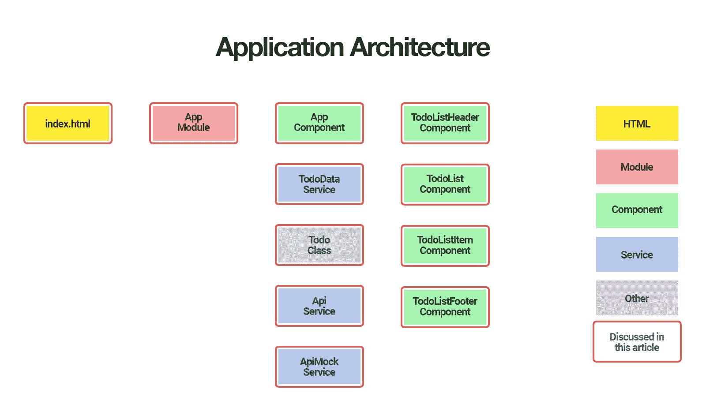
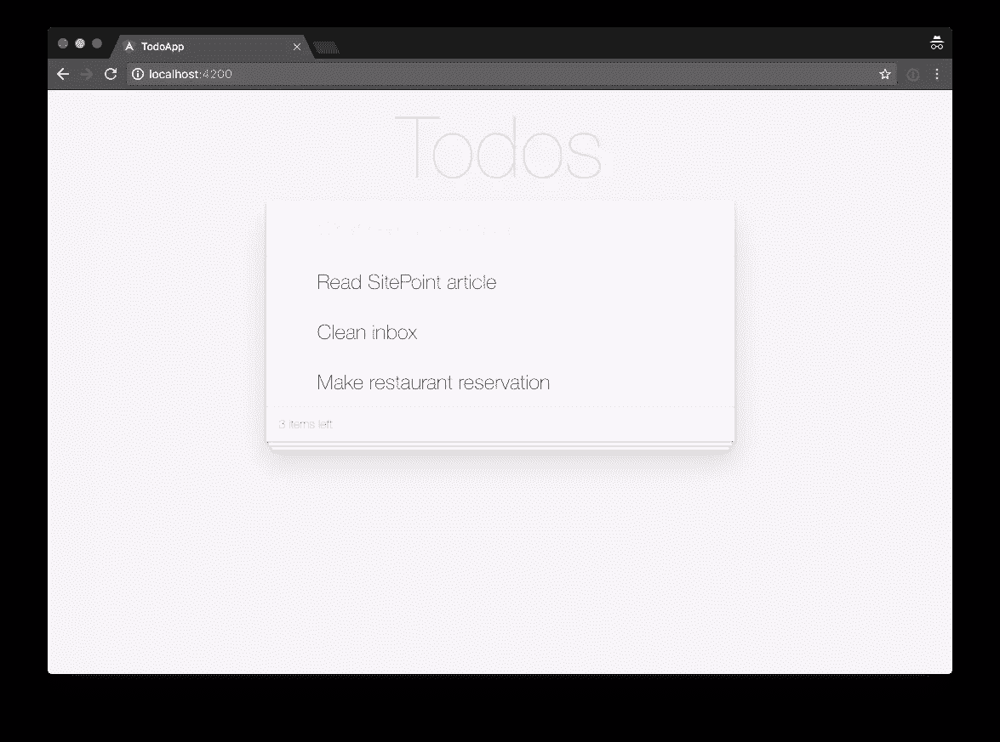
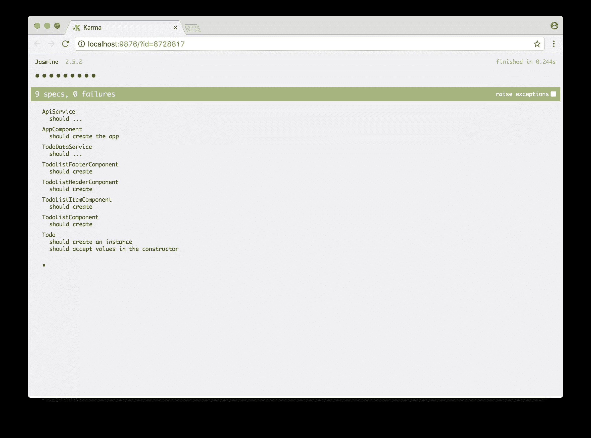

# Angular 和 RxJS:添加 REST API 后端

> 原文：<https://www.sitepoint.com/angular-rxjs-create-api-service-rest-backend/>

**本文是 SitePoint [Angular 2+教程](https://www.sitepoint.com/angular-2-tutorial/)的第 3 部分，讲述如何用 [Angular CLI](https://github.com/angular/angular-cli) 创建 CRUD 应用。在本文中，我们将更新我们的应用程序，以便与 REST API 后端进行通信。**

*更喜欢用循序渐进的视频课程学习 Angular？在 SitePoint Premium 上查看* [学习 Angular 5](https://www.sitepoint.com/premium/courses/learn-angular-5-3000?ref_source=sitepoint&ref_medium=article-copy&ref_campaign=angular-5-course) *。*

在第一部分中，我们学习了如何启动并运行我们的 Todo 应用程序，并将其部署到 GitHub 页面。这工作得很好，但不幸的是，整个应用程序被塞进了一个组件。

在[第二部分](https://www.sitepoint.com/understanding-component-architecture-angular/)中，我们研究了更加模块化的组件架构，并了解了如何将单个组件分解为更小组件的结构化树，以便于理解、重用和维护。

1.  [第 0 部分—极限角度 CLI 参考指南](https://www.sitepoint.com/ultimate-angular-cli-reference/)
2.  [第 1 部分—启动并运行我们的第一个 Todo 应用程序版本](https://www.sitepoint.com/angular-2-tutorial/)
3.  [第 2 部分—创建单独的组件来显示待办事项列表和单个待办事项](https://www.sitepoint.com/understanding-component-architecture-angular/)
4.  **第 3 部分—更新 Todo 服务以与 REST API 后端通信**
5.  [第 4 部分—使用角度路由器解析数据](https://www.sitepoint.com/component-routing-angular-router/)
6.  [第 5 部分—添加身份验证以保护私人内容](https://www.sitepoint.com/angular-2-authentication-protecting-private-content/)
7.  第 6 部分——如何将 Angular 项目更新到最新版本。

你不需要按照本教程的第一部分和第二部分学习三遍才有意义。你可以简单地拿一份[我们的回购](https://github.com/sitepoint-editors/angular-todo-app)，检查第二部分的代码，并以此为起点。这将在下面更详细地解释。


## 快速回顾一下

下面是我们的应用程序架构在第 2 部分结束时的样子:


目前，`TodoDataService`将所有数据存储在内存中。在第三篇文章中，我们将更新我们的应用程序，改为与 REST API 后端进行通信。

我们将:

*   创建一个模拟 REST API 后端
*   将 API URL 存储为环境变量
*   创建一个`ApiService`来与 REST API 后端通信
*   更新`TodoDataService`以使用新的`ApiService`
*   更新`AppComponent`来处理异步 API 调用
*   创建一个`ApiMockService`来避免运行单元测试时真正的 HTTP 调用。



到本文结束时，您会明白:

*   如何使用环境变量存储应用程序设置
*   如何使用 Angular HTTP 客户端来执行 HTTP 请求
*   如何处理 Angular HTTP 客户端返回的可观察数据
*   在运行单元测试时，如何模拟 HTTP 调用来避免真正的 HTTP 请求。

所以，让我们开始吧！

## 运行正常的

确保您安装了最新版本的 Angular CLI。如果没有，您可以使用以下命令安装它:

```
npm install -g @angular/cli@latest 
```

如果需要删除以前版本的 Angular CLI，您可以:

```
npm uninstall -g @angular/cli angular-cli
npm cache clean
npm install -g @angular/cli@latest 
```

之后，您将需要第二部分代码的副本。这个可以在 [GitHub](https://github.com/sitepoint-editors/angular-todo-app) 上找到。本系列中的每篇文章在存储库中都有一个相应的标记，因此您可以在应用程序的不同状态之间来回切换。

我们在第二部分的[中结束的代码和我们在本文中开始的代码被标记为](https://www.sitepoint.com/understanding-component-architecture-angular/)[第二部分](https://github.com/sitepoint-editors/angular-todo-app/tree/part-2)。我们结束这篇文章的代码被标记为[第三部分](https://github.com/sitepoint-editors/angular-todo-app/tree/part-3)。

*您可以将标签想象成特定提交 id 的别名。您可以使用`git checkout`在它们之间切换。你可以在这里阅读《T2》。*

因此，要启动并运行(安装了最新版本的 Angular CLI ),我们应该这样做:

```
git clone git@github.com:sitepoint-editors/angular-todo-app.git
cd angular-todo-app
git checkout part-2
npm install
ng serve 
```

然后访问 [http://localhost:4200/](http://localhost:4200/) 。如果一切正常，你应该看到工作的应用程序。

## 设置 REST API 后端

让我们使用 [json-server](https://github.com/typicode/json-server) 来快速建立一个模拟后端。

从应用程序的根目录，运行:

```
npm install json-server --save 
```

接下来，在我们的应用程序的根目录中，创建一个名为`db.json`的文件，其内容如下:

```
{
  "todos": [
    {
      "id": 1,
      "title": "Read SitePoint article",
      "complete": false
    },
    {
      "id": 2,
      "title": "Clean inbox",
      "complete": false
    },
    {
      "id": 3,
      "title": "Make restaurant reservation",
      "complete": false
    }
  ]
} 
```

最后，给`package.json`添加一个脚本来启动我们的后端:

```
"scripts": {
  ...
  "json-server": "json-server --watch db.json"
} 
```

我们现在可以使用以下代码启动 REST API 后端:

```
npm run json-server 
```

这应该会显示以下内容:

```
 \{^_^}/ hi!

  Loading db.json
  Done

  Resources
  http://localhost:3000/todos

  Home
  http://localhost:3000 
```

就是这样！我们现在有一个 REST API 后端监听端口 3000。

要验证您的后端是否按预期运行，您可以将浏览器导航到`http://localhost:3000`。

支持以下端点:

*   `GET /todos`:获取所有已有的待办事项
*   `GET /todos/:id`:获取现有的待办事项
*   `POST /todos`:创建新的待办事项
*   `PUT /todos/:id`:更新现有的待办事项
*   `DELETE /todos/:id`:删除已有的待办事项

因此，如果您将浏览器导航到`http://localhost:3000/todos`，您应该会看到一个 JSON 响应，其中包含来自`db.json`的所有 todos。

要了解更多关于 json-server 的信息，请务必使用 json-server 查看[模拟 REST APIs。](https://www.sitepoint.com/mock-rest-apis-using-json-server/)

## 存储 API URL

现在我们已经有了后端，我们必须在我们的 Angular 应用程序中存储它的 URL。

理想情况下，我们应该能够这样:

1.  将 URL 存储在一个地方，这样当我们需要更改它的值时，只需更改一次
2.  让我们的应用程序在开发期间连接到开发 API，并在生产中连接到生产 API。

幸运的是，Angular CLI 支持环境。默认有两个环境:开发和生产，都有一个对应的环境文件:`src/environments/environment.ts`和'`src/environments/environment.prod.ts`。

让我们将 API URL 添加到这两个文件中:

```
// src/environments/environment.ts
// used when we run `ng serve` or `ng build`
export const environment = {
  production: false,

  // URL of development API
  apiUrl: 'http://localhost:3000'
}; 
```

```
// src/environments/environment.prod.ts
// used when we run `ng serve --environment prod` or `ng build --environment prod`
export const environment = {
  production: true,

  // URL of production API
  apiUrl: 'http://localhost:3000'
}; 
```

这将允许我们稍后通过执行以下操作从我们的 Angular 应用程序中的环境获取 API URL:

```
import { environment } from 'environments/environment';

// we can now access environment.apiUrl
const API_URL = environment.apiUrl; 
```

当我们运行`ng serve`或`ng build`时，Angular CLI 使用开发环境中指定的值(`src/environments/environment.ts`)。

但是当我们运行`ng serve --environment prod`或`ng build --environment prod`时，Angular CLI 使用`src/environments/environment.prod.ts`中指定的值。

这正是我们需要使用不同的 API URL 进行开发和生产，而不必更改我们的代码。

*本系列文章中的应用程序没有在生产环境中托管，所以我们在开发和生产环境中指定相同的 API URL。这允许我们在本地运行`ng serve --environment prod`或`ng build --environment prod`,看看是否一切都按预期工作。*

在`.angular-cli.json`中可以找到`dev`和`prod`及其对应的环境文件之间的映射关系:

```
"environments": {
  "dev": "environments/environment.ts",
  "prod": "environments/environment.prod.ts"
} 
```

您还可以通过添加一个键来创建其他环境，如`staging`:

```
"environments": {
  "dev": "environments/environment.ts",
  "staging": "environments/environment.staging.ts",
  "prod": "environments/environment.prod.ts"
} 
```

并创建相应的环境文件。

要了解更多关于 Angular CLI 环境的信息，请务必查看[终极 Angular CLI 参考指南](https://www.sitepoint.com/ultimate-angular-cli-reference/)。

既然我们已经在环境中存储了 API URL，我们可以创建一个 Angular 服务来与 REST API 后端进行通信。

## 创建与 REST API 后端通信的服务

让我们使用 Angular CLI 创建一个`ApiService`来与我们的 REST API 后端通信:

```
ng generate service Api --module app.module.ts 
```

这将产生以下输出:

```
installing service
  create src/app/api.service.spec.ts
  create src/app/api.service.ts
  update src/app/app.module.ts 
```

`--module app.module.ts`选项告诉 Angular CLI 不仅要创建服务，还要在`app.module.ts`中定义的 Angular 模块中将其注册为提供者。

让我们打开`src/app/api.service.ts`:

```
import { Injectable } from '@angular/core';

@Injectable()
export class ApiService {

  constructor() { }

} 
```

接下来，我们注入我们的环境和 Angular 的内置 HTTP 服务:

```
import { Injectable } from '@angular/core';
import { environment } from 'environments/environment';
import { Http } from '@angular/http';

const API_URL = environment.apiUrl;

@Injectable()
export class ApiService {

  constructor(
    private http: Http
  ) {
  }

} 
```

在实现我们需要的方法之前，我们先来看看 Angular 的 HTTP 服务。

*如果你不熟悉语法，为什么不买我们的高级课程，[介绍打字稿](https://www.sitepoint.com/premium/courses/introducing-typescript-2933)。*

## Angular HTTP 服务

Angular HTTP 服务是从`@angular/http`开始作为一个可注入类提供的。

它[构建在 XHR/JSONP](https://angular.io/docs/ts/latest/guide/server-communication.html) 之上，为我们提供了一个 HTTP 客户端，我们可以使用它在我们的 Angular 应用程序中发出 HTTP 请求。

以下方法可用于执行 HTTP 请求:

*   `delete(url, options)`:执行删除请求
*   `get(url, options)`:执行获取请求
*   `head(url, options)`:执行机头请求
*   `options(url, options)`:执行选项请求
*   `patch(url, body, options)`:执行补丁请求
*   `post(url, body, options)`:执行 POST 请求
*   `put(url, body, options)`:执行一个 PUT 请求。

这些方法都返回一个 RxJS 可观察值。

与返回承诺的 AngularJS 1.x HTTP 服务方法相反，Angular HTTP 服务方法返回 Observables。

如果你还不熟悉 RxJS Observables，不要担心。我们只需要启动和运行我们的应用程序的基础。当您的应用程序需要可用的操作符时，您可以逐渐了解更多关于它们的信息，并且[react vex 网站](http://reactivex.io/)提供了精彩的文档。

如果你想了解更多关于 Observables 的知识，也值得看看 SitePoint 的[用 RxJS](https://www.sitepoint.com/functional-reactive-programming-rxjs/) 介绍函数式反应编程。

## 实现 ApiService 方法

如果我们回想一下端点，我们的 REST API 后端公开了:

*   `GET /todos`:获取所有已有的待办事项

*   `GET /todos/:id`:获取现有的待办事项

*   `POST /todos`:创建新的待办事项

*   `PUT /todos/:id`:更新现有的待办事项

*   `DELETE /todos/:id`:删除已有的待办事项

我们已经可以创建一个我们需要的方法和它们相应的角度 HTTP 方法的大致轮廓:

```
import { Injectable } from '@angular/core';
import { environment } from 'environments/environment';

import { Http, Response } from '@angular/http';
import { Todo } from './todo';
import { Observable } from 'rxjs/Observable';

const API_URL = environment.apiUrl;

@Injectable()
export class ApiService {

  constructor(
    private http: Http
  ) {
  }

  // API: GET /todos
  public getAllTodos() {
    // will use this.http.get()
  }

  // API: POST /todos
  public createTodo(todo: Todo) {
    // will use this.http.post()
  }

  // API: GET /todos/:id
  public getTodoById(todoId: number) {
    // will use this.http.get()
  }

  // API: PUT /todos/:id
  public updateTodo(todo: Todo) {
    // will use this.http.put()
  }

  // DELETE /todos/:id
  public deleteTodoById(todoId: number) {
    // will use this.http.delete()
  }
} 
```

让我们仔细看看每一种方法。

### getAllTodos()

`getAllTodos()`方法允许我们从 API 中获取所有 todos:

```
public getAllTodos(): Observable<Todo[]> {
  return this.http
    .get(API_URL + '/todos')
    .map(response => {
      const todos = response.json();
      return todos.map((todo) => new Todo(todo));
    })
    .catch(this.handleError);
} 
```

首先，我们发出一个 GET 请求，从我们的 API 中获取所有 todos:

```
this.http
  .get(API_URL + '/todos') 
```

这将返回一个可观察值。

然后，我们调用可观察对象上的`map()`方法，将来自 API 的响应转换成一组`Todo`对象:

```
.map(response => {
  const todos = response.json();
  return todos.map((todo) => new Todo(todo));
}) 
```

传入的 HTTP 响应是一个字符串，因此我们首先调用`response.json()`将 JSON 字符串解析为其对应的 JavaScript 值。

然后，我们在 API 响应的 todos 上循环，并返回一个 Todo 实例数组。注意，`map()`的第二次使用是使用`Array.prototype.map()`，而不是 RxJS 操作符。

最后，我们附加一个错误处理程序来记录控制台的潜在错误:

```
.catch(this.handleError); 
```

我们在一个单独的方法中定义了错误处理程序，这样我们就可以在其他方法中重用它:

```
private handleError (error: Response | any) {
  console.error('ApiService::handleError', error);
  return Observable.throw(error);
} 
```

在运行这段代码之前，我们必须从 RxJS 库中导入必要的依赖项:

```
import { Observable } from 'rxjs/Observable';
import 'rxjs/add/operator/map';
import 'rxjs/add/operator/catch';
import 'rxjs/add/observable/throw'; 
```

注意，RxJS 库很大。不要使用`import * as Rx from 'rxjs/Rx'`导入整个 RxJS 库，建议只导入您需要的部分。这将极大地减少最终代码包的大小。

在我们的应用程序中，我们导入了`Observable`类:

```
import { Observable } from 'rxjs/Observable'; 
```

我们导入代码所需的三个操作符:

```
import 'rxjs/add/operator/map';
import 'rxjs/add/operator/catch';
import 'rxjs/add/observable/throw'; 
```

导入操作符可以确保我们的可观察实例有相应的附加方法。

如果我们的代码中没有`import 'rxjs/add/operator/map'`，那么下面的代码将不起作用:

```
this.http
  .get(API_URL + '/todos')
  .map(response => {
    const todos = response.json();
    return todos.map((todo) => new Todo(todo));
  }) 
```

这是因为由`this.http.get`返回的可观察对象没有`map()`方法。

我们只需导入操作符一次，就可以在应用程序中全局启用相应的可观察方法。然而，多次导入它们不是问题，也不会增加最终的包大小。

### getTodoById()

`getTodoById()`方法允许我们获得一个单独的 todo:

```
public getTodoById(todoId: number): Observable<Todo> {
  return this.http
    .get(API_URL + '/todos/' + todoId)
    .map(response => {
      return new Todo(response.json());
    })
    .catch(this.handleError);
} 
```

在我们的应用程序中我们不需要这个方法，但是包含它是为了给你一个大概的概念。

### createTodo()

`createTodo()`方法允许我们创建一个新的 todo:

```
public createTodo(todo: Todo): Observable<Todo> {
  return this.http
    .post(API_URL + '/todos', todo)
    .map(response => {
      return new Todo(response.json());
    })
    .catch(this.handleError);
} 
```

我们首先对 API 执行 POST 请求，并将数据作为第二个参数传入:

```
this.http.post(API_URL + '/todos', todo) 
```

然后，我们将响应转换成一个`Todo`对象:

```
map(response => {
  return new Todo(response.json());
}) 
```

### updateTodo()

`updateTodo()`方法允许我们更新单个 todo:

```
public updateTodo(todo: Todo): Observable<Todo> {
  return this.http
    .put(API_URL + '/todos/' + todo.id, todo)
    .map(response => {
      return new Todo(response.json());
    })
    .catch(this.handleError);
} 
```

我们首先对 API 执行一个 PUT 请求，并将数据作为第二个参数传入:

```
put(API_URL + '/todos/' + todo.id, todo) 
```

然后，我们将响应转换成一个`Todo`对象:

```
map(response => {
  return new Todo(response.json());
}) 
```

### deleteTodoById()

`deleteTodoById()`方法允许我们删除单个 todo:

```
public deleteTodoById(todoId: number): Observable<null> {
  return this.http
    .delete(API_URL + '/todos/' + todoId)
    .map(response => null)
    .catch(this.handleError);
} 
```

我们首先对 API 执行一个删除请求:

```
delete(API_URL + '/todos/' + todoId) 
```

然后，我们将响应转换成`null`:

```
map(response => null) 
```

我们真的不需要转换这里的响应，可以省略这一行。它只是为了让您知道，如果在执行删除请求时 API 会返回数据，您应该如何处理响应。

这是我们`ApiService`的完整代码:

```
import { Injectable } from '@angular/core';
import { environment } from 'environments/environment';

import { Http, Response } from '@angular/http';
import { Todo } from './todo';
import { Observable } from 'rxjs/Observable';
import 'rxjs/add/operator/map';
import 'rxjs/add/operator/catch';
import 'rxjs/add/observable/throw';

const API_URL = environment.apiUrl;

@Injectable()
export class ApiService {

  constructor(
    private http: Http
  ) {
  }

  public getAllTodos(): Observable<Todo[]> {
    return this.http
      .get(API_URL + '/todos')
      .map(response => {
        const todos = response.json();
        return todos.map((todo) => new Todo(todo));
      })
      .catch(this.handleError);
  }

  public createTodo(todo: Todo): Observable<Todo> {
    return this.http
      .post(API_URL + '/todos', todo)
      .map(response => {
        return new Todo(response.json());
      })
      .catch(this.handleError);
  }

  public getTodoById(todoId: number): Observable<Todo> {
    return this.http
      .get(API_URL + '/todos/' + todoId)
      .map(response => {
        return new Todo(response.json());
      })
      .catch(this.handleError);
  }

  public updateTodo(todo: Todo): Observable<Todo> {
    return this.http
      .put(API_URL + '/todos/' + todo.id, todo)
      .map(response => {
        return new Todo(response.json());
      })
      .catch(this.handleError);
  }

  public deleteTodoById(todoId: number): Observable<null> {
    return this.http
      .delete(API_URL + '/todos/' + todoId)
      .map(response => null)
      .catch(this.handleError);
  }

  private handleError (error: Response | any) {
    console.error('ApiService::handleError', error);
    return Observable.throw(error);
  }
} 
```

现在我们已经有了我们的`ApiService`,我们可以用它来让我们的`TodoDataService`与我们的 REST API 后端通信。

## 正在更新 TodoDataService

目前我们的`TodoDataService`将所有数据存储在内存中:

```
import {Injectable} from '@angular/core';
import {Todo} from './todo';

@Injectable()
export class TodoDataService {

  // Placeholder for last id so we can simulate
  // automatic incrementing of ids
  lastId: number = 0;

  // Placeholder for todos
  todos: Todo[] = [];

  constructor() {
  }

  // Simulate POST /todos
  addTodo(todo: Todo): TodoDataService {
    if (!todo.id) {
      todo.id = ++this.lastId;
    }
    this.todos.push(todo);
    return this;
  }

  // Simulate DELETE /todos/:id
  deleteTodoById(id: number): TodoDataService {
    this.todos = this.todos
      .filter(todo => todo.id !== id);
    return this;
  }

  // Simulate PUT /todos/:id
  updateTodoById(id: number, values: Object = {}): Todo {
    let todo = this.getTodoById(id);
    if (!todo) {
      return null;
    }
    Object.assign(todo, values);
    return todo;
  }

  // Simulate GET /todos
  getAllTodos(): Todo[] {
    return this.todos;
  }

  // Simulate GET /todos/:id
  getTodoById(id: number): Todo {
    return this.todos
      .filter(todo => todo.id === id)
      .pop();
  }

  // Toggle todo complete
  toggleTodoComplete(todo: Todo) {
    let updatedTodo = this.updateTodoById(todo.id, {
      complete: !todo.complete
    });
    return updatedTodo;
  }

} 
```

为了让我们的`TodoDataService`与我们的 REST API 后端通信，我们必须注入我们的新`ApiService`:

```
import { Injectable } from '@angular/core';
import { Todo } from './todo';
import { ApiService } from './api.service';
import { Observable } from 'rxjs/Observable';

@Injectable()
export class TodoDataService {

  constructor(
    private api: ApiService
  ) {
  }
} 
```

我们还更新了它的方法，将所有工作委托给`ApiService`中的相应方法:

```
import { Injectable } from '@angular/core';
import { Todo } from './todo';
import { ApiService } from './api.service';
import { Observable } from 'rxjs/Observable';

@Injectable()
export class TodoDataService {

  constructor(
    private api: ApiService
  ) {
  }

  // Simulate POST /todos
  addTodo(todo: Todo): Observable<Todo> {
    return this.api.createTodo(todo);
  }

  // Simulate DELETE /todos/:id
  deleteTodoById(todoId: number): Observable<Todo> {
    return this.api.deleteTodoById(todoId);
  }

  // Simulate PUT /todos/:id
  updateTodo(todo: Todo): Observable<Todo> {
    return this.api.updateTodo(todo);
  }

  // Simulate GET /todos
  getAllTodos(): Observable<Todo[]> {
    return this.api.getAllTodos();
  }

  // Simulate GET /todos/:id
  getTodoById(todoId: number): Observable<Todo> {
    return this.api.getTodoById(todoId);
  }

  // Toggle complete
  toggleTodoComplete(todo: Todo) {
    todo.complete = !todo.complete;
    return this.api.updateTodo(todo);
  }

} 
```

我们的新方法实现看起来简单多了，因为数据逻辑现在由 REST API 后端处理。

然而，有一个重要的区别。旧方法包含同步代码并立即返回值。更新的方法包含异步代码并返回一个可观察的。

这意味着我们还必须更新调用`TodoDataService`方法的代码，以正确处理可观察到的内容。

## 更新 AppComponent

目前，`AppComponent`期望`TodoDataService`直接返回 JavaScript 对象和数组:

```
import {Component} from '@angular/core';
import {TodoDataService} from './todo-data.service';

@Component({
  selector: 'app-root',
  templateUrl: './app.component.html',
  styleUrls: ['./app.component.css'],
  providers: [TodoDataService]
})
export class AppComponent {

  constructor(
    private todoDataService: TodoDataService
  ) {
  }

  onAddTodo(todo) {
    this.todoDataService.addTodo(todo);
  }

  onToggleTodoComplete(todo) {
    this.todoDataService.toggleTodoComplete(todo);
  }

  onRemoveTodo(todo) {
    this.todoDataService.deleteTodoById(todo.id);
  }

  get todos() {
    return this.todoDataService.getAllTodos();
  }

} 
```

但是我们新的`ApiService`方法返回了可观察到的结果。

与承诺类似，可观察到的行为本质上是异步的，因此我们必须相应地更新代码来处理可观察到的响应:

如果我们当前调用`get todos()`中的`TodoDataService.getAllTodos()`方法:

```
// AppComponent

get todos() {
  return this.todoDataService.getAllTodos();
} 
```

`TodoDataService.getAllTodos()`方法调用相应的`ApiService.getAllTodos()`方法:

```
// TodoDataService

getAllTodos(): Observable<Todo[]> {
  return this.api.getAllTodos();
} 
```

这进而指示 Angular HTTP 服务执行 HTTP GET 请求:

```
// ApiService

public getAllTodos(): Observable<Todo[]> {
  return this.http
    .get(API_URL + '/todos')
    .map(response => {
      const todos = response.json();
      return todos.map((todo) => new Todo(todo));
    })
    .catch(this.handleError);
} 
```

然而，有一件重要的事情我们必须记住！

只要我们不订阅由以下各项返回的可观察值:

```
this.todoDataService.getAllTodos() 
```

没有发出实际的 HTTP 请求。

要订阅一个可观察值，我们可以使用 [`subscribe()`](http://reactivex.io/documentation/operators/subscribe.html) 方法，该方法需要三个参数:

*   `onNext`:当可观察对象发出一个新值时被调用的函数
*   当可观察对象抛出错误时调用的函数
*   当可观察对象优雅地终止时调用的函数。

让我们重写当前的代码:

```
// AppComponent

get todos() {
  return this.todoDataService.getAllTodos();
} 
```

这将在初始化`AppComponent`时异步加载 todos:

```
import { Component, OnInit } from '@angular/core';
import { TodoDataService } from './todo-data.service';
import { Todo } from './todo';

@Component({
  selector: 'app-root',
  templateUrl: './app.component.html',
  styleUrls: ['./app.component.css'],
  providers: [TodoDataService]
})
export class AppComponent implements OnInit {

  todos: Todo[] = [];

  constructor(
    private todoDataService: TodoDataService
  ) {
  }

  public ngOnInit() {
    this.todoDataService
      .getAllTodos()
      .subscribe(
        (todos) => {
          this.todos = todos;
        }
      );
  }
} 
```

首先，我们定义一个公共属性`todos`，并将其初始值设置为一个空数组。

然后我们使用`ngOnInit()`方法订阅`this.todoDataService.getAllTodos()`，当一个值进来时，我们将它赋给`this.todos`，覆盖它的空数组的初始值。

现在让我们更新`onAddTodo(todo)`方法来处理可观察到的响应:

```
// previously:
// onAddTodo(todo) {
//  this.todoDataService.addTodo(todo);
// }

onAddTodo(todo) {
  this.todoDataService
    .addTodo(todo)
    .subscribe(
      (newTodo) => {
        this.todos = this.todos.concat(newTodo);
      }
    );
} 
```

同样，我们使用`subscribe()`方法订阅由`this.todoDataService.addTodo(todo)`返回的可观察对象，当响应到来时，我们将新创建的 todo 添加到当前的 todo 列表中。

我们对其他方法重复同样的练习，直到我们的`AppComponent`看起来像这样:

```
import { Component, OnInit } from '@angular/core';
import { TodoDataService } from './todo-data.service';
import { Todo } from './todo';

@Component({
  selector: 'app-root',
  templateUrl: './app.component.html',
  styleUrls: ['./app.component.css'],
  providers: [TodoDataService]
})
export class AppComponent implements OnInit {

  todos: Todo[] = [];

  constructor(
    private todoDataService: TodoDataService
  ) {
  }

  public ngOnInit() {
    this.todoDataService
      .getAllTodos()
      .subscribe(
        (todos) => {
          this.todos = todos;
        }
      );
  }

  onAddTodo(todo) {
    this.todoDataService
      .addTodo(todo)
      .subscribe(
        (newTodo) => {
          this.todos = this.todos.concat(newTodo);
        }
      );
  }

  onToggleTodoComplete(todo) {
    this.todoDataService
      .toggleTodoComplete(todo)
      .subscribe(
        (updatedTodo) => {
          todo = updatedTodo;
        }
      );
  }

  onRemoveTodo(todo) {
    this.todoDataService
      .deleteTodoById(todo.id)
      .subscribe(
        (_) => {
          this.todos = this.todos.filter((t) => t.id !== todo.id);
        }
      );
  }
} 
```

就是这样；所有方法现在都能够处理由`TodoDataService`方法返回的可观察值。

注意，当你订阅了 Angular HTTP 服务返回的一个可观察对象时，不需要手动取消订阅。Angular 会为你清理一切，防止内存泄露。

让我们看看一切是否如预期的那样工作。

## 尝试一下

打开终端窗口。

从我们的应用程序目录的根目录，启动 REST API 后端:

```
npm run json-server 
```

打开第二个终端窗口。

同样，从我们的应用程序目录的根目录开始，服务于 Angular 应用程序:

```
ng serve 
```

现在，将您的浏览器导航至`http://localhost:4200`。

如果一切顺利，您应该会看到:



如果你看到一个错误，你可以将你的代码与 GitHub 上的[工作版本进行比较。](https://github.com/sitepoint-editors/angular-todo-app/tree/part-3)

厉害！我们的应用程序现在正在与 REST API 后端进行通信！

*侧面提示:如果你想在同一个终端运行`npm run json-server`和`ng serve`，你可以同时使用[和](https://github.com/kimmobrunfeldt/concurrently)来同时运行这两个命令，而不需要打开多个终端窗口或标签。*

让我们运行我们的单元测试来验证一切都按预期运行。

## 运行我们的测试

打开第三个终端窗口。

同样，从应用程序目录的根目录，运行单元测试:

```
ng test 
```

似乎有 11 个单元测试失败了:

让我们看看为什么我们的测试会失败，以及我们如何修复它们。

## 修复我们的单元测试

首先，让我们打开`src/todo-data.service.spec.ts`:

```
/* tslint:disable:no-unused-variable */

import {TestBed, async, inject} from '@angular/core/testing';
import {Todo} from './todo';
import {TodoDataService} from './todo-data.service';

describe('TodoDataService', () => {
  beforeEach(() => {
    TestBed.configureTestingModule({
      providers: [TodoDataService]
    });
  });

  it('should ...', inject([TodoDataService], (service: TodoDataService) => {
    expect(service).toBeTruthy();
  }));

  describe('#getAllTodos()', () => {

    it('should return an empty array by default', inject([TodoDataService], (service: TodoDataService) => {
      expect(service.getAllTodos()).toEqual([]);
    }));

    it('should return all todos', inject([TodoDataService], (service: TodoDataService) => {
      let todo1 = new Todo({title: 'Hello 1', complete: false});
      let todo2 = new Todo({title: 'Hello 2', complete: true});
      service.addTodo(todo1);
      service.addTodo(todo2);
      expect(service.getAllTodos()).toEqual([todo1, todo2]);
    }));

  });

  describe('#save(todo)', () => {

    it('should automatically assign an incrementing id', inject([TodoDataService], (service: TodoDataService) => {
      let todo1 = new Todo({title: 'Hello 1', complete: false});
      let todo2 = new Todo({title: 'Hello 2', complete: true});
      service.addTodo(todo1);
      service.addTodo(todo2);
      expect(service.getTodoById(1)).toEqual(todo1);
      expect(service.getTodoById(2)).toEqual(todo2);
    }));

  });

  describe('#deleteTodoById(id)', () => {

    it('should remove todo with the corresponding id', inject([TodoDataService], (service: TodoDataService) => {
      let todo1 = new Todo({title: 'Hello 1', complete: false});
      let todo2 = new Todo({title: 'Hello 2', complete: true});
      service.addTodo(todo1);
      service.addTodo(todo2);
      expect(service.getAllTodos()).toEqual([todo1, todo2]);
      service.deleteTodoById(1);
      expect(service.getAllTodos()).toEqual([todo2]);
      service.deleteTodoById(2);
      expect(service.getAllTodos()).toEqual([]);
    }));

    it('should not removing anything if todo with corresponding id is not found', inject([TodoDataService], (service: TodoDataService) => {
      let todo1 = new Todo({title: 'Hello 1', complete: false});
      let todo2 = new Todo({title: 'Hello 2', complete: true});
      service.addTodo(todo1);
      service.addTodo(todo2);
      expect(service.getAllTodos()).toEqual([todo1, todo2]);
      service.deleteTodoById(3);
      expect(service.getAllTodos()).toEqual([todo1, todo2]);
    }));

  });

  describe('#updateTodoById(id, values)', () => {

    it('should return todo with the corresponding id and updated data', inject([TodoDataService], (service: TodoDataService) => {
      let todo = new Todo({title: 'Hello 1', complete: false});
      service.addTodo(todo);
      let updatedTodo = service.updateTodoById(1, {
        title: 'new title'
      });
      expect(updatedTodo.title).toEqual('new title');
    }));

    it('should return null if todo is not found', inject([TodoDataService], (service: TodoDataService) => {
      let todo = new Todo({title: 'Hello 1', complete: false});
      service.addTodo(todo);
      let updatedTodo = service.updateTodoById(2, {
        title: 'new title'
      });
      expect(updatedTodo).toEqual(null);
    }));

  });

  describe('#toggleTodoComplete(todo)', () => {

    it('should return the updated todo with inverse complete status', inject([TodoDataService], (service: TodoDataService) => {
      let todo = new Todo({title: 'Hello 1', complete: false});
      service.addTodo(todo);
      let updatedTodo = service.toggleTodoComplete(todo);
      expect(updatedTodo.complete).toEqual(true);
      service.toggleTodoComplete(todo);
      expect(updatedTodo.complete).toEqual(false);
    }));

  });

}); 
```

大多数失败的单元测试都与检查数据处理有关。不再需要这些测试，因为数据处理现在由我们的 REST API 后端执行，而不是由`TodoDataService`执行，所以让我们删除过时的测试:

```
/* tslint:disable:no-unused-variable */

import {TestBed, inject} from '@angular/core/testing';
import {TodoDataService} from './todo-data.service';

describe('TodoDataService', () => {
  beforeEach(() => {
    TestBed.configureTestingModule({
      providers: [
        TodoDataService,
      ]
    });
  });

  it('should ...', inject([TodoDataService], (service: TodoDataService) => {
    expect(service).toBeTruthy();
  }));

}); 
```

如果我们现在运行单元测试，我们会得到一个错误:

```
TodoDataService should ...
Error: No provider for ApiService! 
```

抛出该错误是因为`TestBed.configureTestingModule()`创建了一个用于测试的临时模块，而临时模块的注入器不知道任何`ApiService`。

为了让注入器知道`ApiService`，我们必须通过将`ApiService`列为传递给`TestBed.configureTestingModule()`的配置对象中的提供者，向临时模块注册它:

```
/* tslint:disable:no-unused-variable */

import {TestBed, inject} from '@angular/core/testing';
import {TodoDataService} from './todo-data.service';
import { ApiService } from './api.service';

describe('TodoDataService', () => {
  beforeEach(() => {
    TestBed.configureTestingModule({
      providers: [
        TodoDataService,
        ApiService
      ]
    });
  });

  it('should ...', inject([TodoDataService], (service: TodoDataService) => {
    expect(service).toBeTruthy();
  }));

}); 
```

然而，如果我们这样做，我们的单元测试将使用我们真正的`ApiService`，它连接到我们的 REST API 后端。

当运行我们的单元测试时，我们不希望我们的测试运行程序连接到真正的 API，所以让我们创建一个`ApiMockService`来模拟单元测试中的真正的`ApiService`。

## 创建 ApiMockService

让我们使用 Angular CLI 生成一个新的`ApiMockService`:

```
ng g service ApiMock --spec false 
```

这显示了以下内容:

```
installing service
  create src/app/api-mock.service.ts
  WARNING Service is generated but not provided, it must be provided to be used 
```

接下来，我们实现与`ApiService`相同的方法，但是我们让这些方法返回模拟数据，而不是发出 HTTP 请求:

```
import { Injectable } from '@angular/core';
import { Todo } from './todo';
import { Observable } from 'rxjs/Observable';
import 'rxjs/add/observable/of';

@Injectable()
export class ApiMockService {

  constructor(
  ) {
  }

  public getAllTodos(): Observable<Todo[]> {
    return Observable.of([
      new Todo({id: 1, title: 'Read article', complete: false})
    ]);
  }

  public createTodo(todo: Todo): Observable<Todo> {
    return Observable.of(
      new Todo({id: 1, title: 'Read article', complete: false})
    );
  }

  public getTodoById(todoId: number): Observable<Todo> {
    return Observable.of(
      new Todo({id: 1, title: 'Read article', complete: false})
    );
  }

  public updateTodo(todo: Todo): Observable<Todo> {
    return Observable.of(
      new Todo({id: 1, title: 'Read article', complete: false})
    );
  }

  public deleteTodoById(todoId: number): Observable<null> {
    return null;
  }
} 
```

注意每个方法是如何返回新的模拟数据的。这可能看起来有点重复，但是这是一个很好的实践。如果一个单元测试会改变模拟数据，那么这个改变永远不会影响另一个单元测试中的数据。

现在我们有了一个`ApiMockService`服务，我们可以在单元测试中用`ApiMockService`代替`ApiService`。

再来开`src/todo-data.service.spec.ts`吧。

在`providers`数组中，每当请求`ApiService`时，我们告诉注入器提供`ApiMockService`:

```
/* tslint:disable:no-unused-variable */

import {TestBed, inject} from '@angular/core/testing';
import {TodoDataService} from './todo-data.service';
import { ApiService } from './api.service';
import { ApiMockService } from './api-mock.service';

describe('TodoDataService', () => {
  beforeEach(() => {
    TestBed.configureTestingModule({
      providers: [
        TodoDataService,
        {
          provide: ApiService,
          useClass: ApiMockService
        }
      ]
    });
  });

  it('should ...', inject([TodoDataService], (service: TodoDataService) => {
    expect(service).toBeTruthy();
  }));

}); 
```

如果我们现在重新运行单元测试，错误就消失了。太好了！

不过，我们还有两项测试失败:

```
ApiService should ...
Error: No provider for Http!

AppComponent should create the app
Failed: No provider for ApiService! 
```

这些错误类似于我们刚刚修复的错误。

要修复第一个错误，让我们打开`src/api.service.spec.ts`:

```
import { TestBed, inject } from '@angular/core/testing';

import { ApiService } from './api.service';

describe('ApiService', () => {
  beforeEach(() => {
    TestBed.configureTestingModule({
      providers: [ApiService]
    });
  });

  it('should ...', inject([ApiService], (service: ApiService) => {
    expect(service).toBeTruthy();
  }));
}); 
```

测试失败，显示一条消息`No provider for Http!`，表明我们需要为`Http`添加一个提供者。

同样，我们不希望`Http`服务发出真正的 HTTP 请求，所以我们实例化了一个使用 Angular 的`MockBackend`的模拟`Http`服务:

```
import { TestBed, inject } from '@angular/core/testing';

import { ApiService } from './api.service';
import { BaseRequestOptions, Http, XHRBackend } from '@angular/http';
import { MockBackend } from '@angular/http/testing';

describe('ApiService', () => {
  beforeEach(() => {
    TestBed.configureTestingModule({
      providers: [
        {
          provide: Http,
          useFactory: (backend, options) => {
            return new Http(backend, options);
          },
          deps: [MockBackend, BaseRequestOptions]
        },
        MockBackend,
        BaseRequestOptions,
        ApiService
      ]
    });
  });

  it('should ...', inject([ApiService], (service: ApiService) => {
    expect(service).toBeTruthy();
  }));
}); 
```

如果配置测试模块看起来有点令人不知所措，不要担心。

你可以在测试角度应用的官方文档中了解更多关于设置单元测试的信息。

要修复最后一个错误:

```
AppComponent should create the app
Failed: No provider for ApiService! 
```

让我们打开`src/app.component.spec.ts`:

```
import { TestBed, async } from '@angular/core/testing';

import { FormsModule } from '@angular/forms';
import { AppComponent } from './app.component';
import { NO_ERRORS_SCHEMA } from '@angular/core';
import { TodoDataService } from './todo-data.service';

describe('AppComponent', () => {
  beforeEach(async(() => {
    TestBed.configureTestingModule({
      imports: [
        FormsModule
      ],
      declarations: [
        AppComponent
      ],
      providers: [
        TodoDataService
      ],
      schemas: [
        NO_ERRORS_SCHEMA
      ]
    }).compileComponents();
  }));

  it('should create the app', async(() => {
    const fixture = TestBed.createComponent(AppComponent);
    const app = fixture.debugElement.componentInstance;
    expect(app).toBeTruthy();
  }));
}); 
```

然后向注入者提供我们的模拟`ApiService`:

```
import { TestBed, async } from '@angular/core/testing';

import { FormsModule } from '@angular/forms';
import { AppComponent } from './app.component';
import { NO_ERRORS_SCHEMA } from '@angular/core';
import { TodoDataService } from './todo-data.service';
import { ApiService } from './api.service';
import { ApiMockService } from './api-mock.service';

describe('AppComponent', () => {
  beforeEach(async(() => {
    TestBed.configureTestingModule({
      imports: [
        FormsModule
      ],
      declarations: [
        AppComponent
      ],
      providers: [
        TodoDataService,
        {
          provide: ApiService,
          useClass: ApiMockService
        }
      ],
      schemas: [
        NO_ERRORS_SCHEMA
      ]
    }).compileComponents();
  }));

  it('should create the app', async(() => {
    const fixture = TestBed.createComponent(AppComponent);
    const app = fixture.debugElement.componentInstance;
    expect(app).toBeTruthy();
  }));
}); 
```

万岁！我们所有的测试都通过了:



我们已经成功地将 Angular 应用程序连接到 REST API 后端。

为了将我们的应用程序部署到生产环境中，我们现在可以运行:

```
ng build --aot --environment prod 
```

我们还将生成的`dist`目录上传到我们的托管服务器。多甜蜜啊。

让我们回顾一下我们所学的内容。

## 摘要

在第[篇文章](https://www.sitepoint.com/angular-2-tutorial/)中，我们学习了如何:

*   使用 Angular CLI 初始化我们的 Todo 应用程序
*   创建一个`Todo`类来表示个人待办事项
*   创建一个`TodoDataService`服务来创建、更新和删除 todos
*   使用`AppComponent`组件显示用户界面
*   将我们的应用程序部署到 GitHub 页面。

在[的第二篇文章](https://www.sitepoint.com/understanding-component-architecture-angular/)中，我们重构了`AppComponent`，将其大部分工作委托给:

*   显示待办事项列表
*   显示单个待办事项的`TodoListItemComponent`
*   创建新待办事项的`TodoListHeaderComponent`
*   显示还剩多少待办事项。

在第三篇文章中，我们:

*   创建了一个模拟 REST API 后端
*   将 API URL 存储为环境变量
*   创建了一个`ApiService`来与 REST API 后端通信
*   更新了`TodoDataService`以使用新的`ApiService`
*   更新了`AppComponent`来处理异步 API 调用
*   创建了一个`ApiMockService`来避免运行单元测试时真正的 HTTP 调用。

在这个过程中，我们了解到:

*   如何使用环境变量存储应用程序设置
*   如何使用 Angular HTTP 客户端执行 HTTP 请求
*   如何处理 Angular HTTP 客户端返回的观察值
*   运行单元测试时如何模拟 HTTP 调用以避免真正的 HTTP 请求。

这篇文章的所有代码都可以在 GitHub 上找到。

在第四部分中，我们将介绍路由器并重构`AppComponent`以使用路由器从后端获取 todos。

在第五部分中，我们将实现身份验证来防止对应用程序的未授权访问。

*这篇文章由[维尔丹·索蒂奇](https://www.sitepoint.com/author/vildansoftic/)进行了同行评审。感谢 SitePoint 的所有同行评审员使 SitePoint 的内容尽可能做到最好！*

## 分享这篇文章