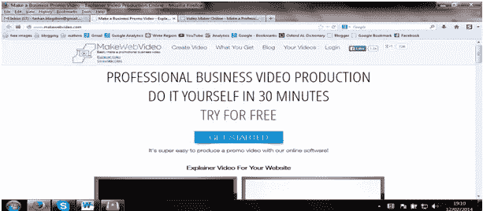

# 使用 MakeWebVideo 制作动画讲解视频

> 原文：<https://www.sitepoint.com/animated-explainer-videos-makewebvideo/>

在所有关于社交媒体的噪音中，人们有时会忘记视频在推广你的业务中的重要性。脸书、Twitter 和 Google+各司其职，但 YouTube 仍然很受欢迎。它通常出现在 Alexa 排名前十的网站中。

Smart Passive Income 的帕特弗林(Pat Flynn)是“无处不在”理念最受欢迎的倡导者之一。除了在通常的可疑网站上——脸书、推特、谷歌+—你还应该在 YouTube、iTunes 等网站上。他说。

不同的人有不同的兴趣，在不同的网站上花费时间。通过无处不在，你将接触到尽可能多的人，并传播你的业务。

让我们把重点放在动画解说视频上。如果你想制作一个专业的视频来推广你的网站和业务，那么我们建议你试试 [MakeWebVideo](http://www.makewebvideo.com/) 。

如果你雇佣一个专业的图形设计师为你制作一个[解说视频](http://www.makewebvideo.com/en/explainervideo)，你将不得不付给他数千美元。但有了 MakeWebVideo，你只需几美元就能获得同样质量的视频。

这是如何实现的。

MakeWebVideo 有一个由专业视频制作者设计的大型视频模板库。然后，您可以访问商店，浏览资料库，并选择您最喜欢的视频模板。然后你可以用你自己的文本、图像、镜头定制视频，并选择你想要播放的背景音乐。

首先，这一切过程非常容易。你不需要有一个设计学位来为自己创作一个视频。只需访问他们的模板库，浏览不同的类别。类别从卡通视频到 3D 设计视频，从墨水效果到幻灯片等等。

然后就是快，快。整个工作流程只需 30 分钟。这个过程在网上进行，完全由设计视频的人，也就是你来管理。你不必等待寻求网站管理员或其他任何人的批准。

一个视频的成本从 29 美元开始。但是你也可以免费制作视频。这是预览视频效果的理想方式。然后，当你对视频的整体外观和设计感到满意时，你可以购买并获得没有水印的高清视频。

视频和播放器将被托管在 MakeWebVideo 网站上，这样可以节省您网站的托管空间。在你的网站上分享和嵌入视频非常容易，在各种电脑和 iOS 设备上都可以很好地播放。

如果你愿意，你也可以下载带水印的视频，然后上传到 YouTube，或者在脸书和推特上与朋友分享，以获得他们的反馈。该文件将是 MP4 格式或 WEBM。

MakeWebVideo 保证让您满意，如果您不满意，他们会退还您的钱，或者允许您选择创建另一个视频。

去试试这个在线视频制作工具，并在下面的评论中告诉我你的想法。

## 分享这篇文章