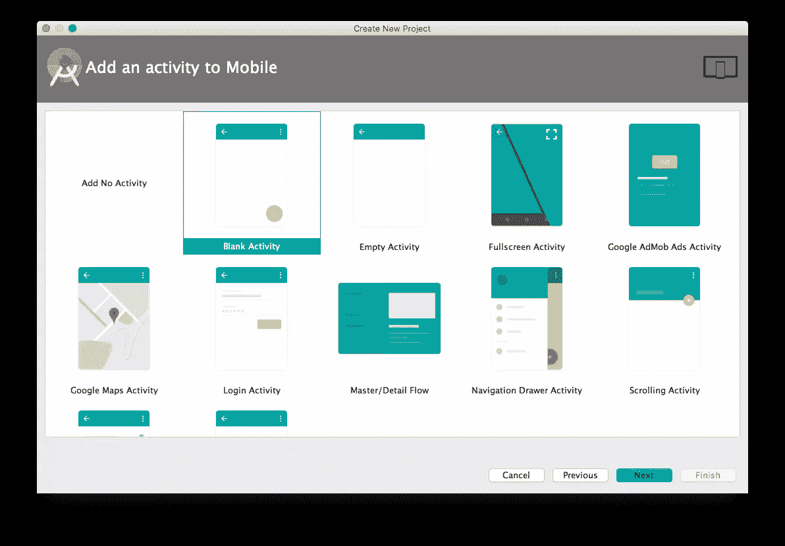
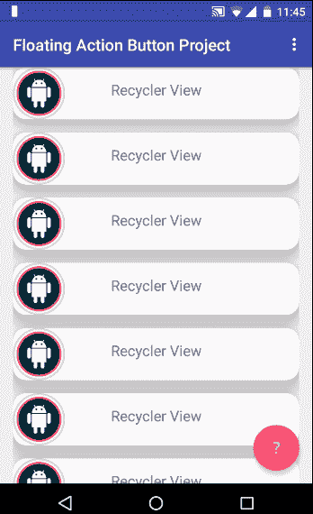
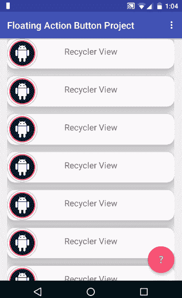
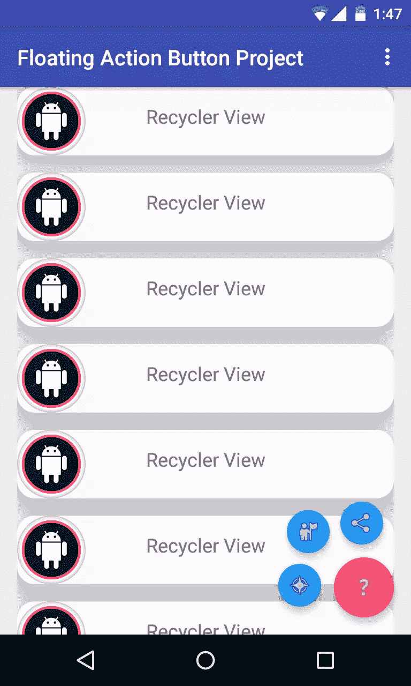
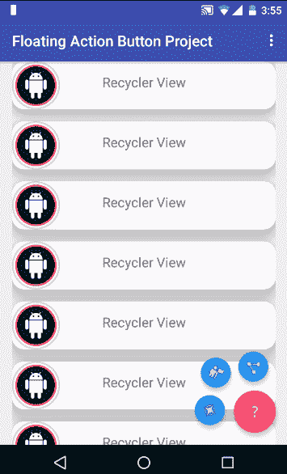

# 动画一个机器人浮动动作按钮

> 原文：<https://www.sitepoint.com/animating-android-floating-action-button/>

自从引入材料设计以来，浮动动作按钮(FAB)已经成为实现起来最简单的组件之一，成为设计师和开发人员快速而基本的最爱。

在本教程中，我将向你展示如何使你的应用程序具有交互性，以及如何制作你自己的动画。但是让我们从简单的开始，将浮动动作按钮添加到一个 Android 项目中。

浮动动作按钮在布局文件中看起来像这样，如果创建一个带有*空白活动*的 Android Studio 项目，它将自动生成:



```
<android.support.design.widget.FloatingActionButton
    android:id="@+id/fab"
    android:layout_width="wrap_content"
    android:layout_height="wrap_content"
    android:layout_gravity="bottom|end"
    android:layout_margin="@dimen/fab_margin"
    android:src="@android:drawable/ic_menu_help"
    /> 
```

## 浮动操作按钮

浮动操作按钮有两种尺寸。默认(56dp)和迷你(40dp)。关于使用晶圆厂的设计原则的进一步讨论，我推荐你阅读[谷歌的官方指南](https://www.google.com/design/spec/components/buttons-floating-action-button.html)。

在大多数最新的 Android 应用程序中，FAB 对元素列表的滚动做出反应，在我看来，应该在滚动时隐藏。我的意思是:



为了展示这个动画，我创建了一个`recyclerView`以便 FAB 可以对滚动做出反应。

有很多函数库可以帮助你用一两行代码实现这一点，但是对于那些好奇的人来说，这里有一个例子:

```
public class FAB_Hide_on_Scroll extends FloatingActionButton.Behavior {

    public FAB_Hide_on_Scroll(Context context, AttributeSet attrs) {
        super();
    }

    @Override
    public void onNestedScroll(CoordinatorLayout coordinatorLayout, FloatingActionButton child, View target, int dxConsumed, int dyConsumed, int dxUnconsumed, int dyUnconsumed) {
        super.onNestedScroll(coordinatorLayout, child, target, dxConsumed, dyConsumed, dxUnconsumed, dyUnconsumed);

        //child -> Floating Action Button
        if (child.getVisibility() == View.VISIBLE && dyConsumed > 0) {
            child.hide();
        } else if (child.getVisibility() == View.GONE && dyConsumed < 0) {
            child.show();
        }
    }

    @Override
    public boolean onStartNestedScroll(CoordinatorLayout coordinatorLayout, FloatingActionButton child, View directTargetChild, View target, int nestedScrollAxes) {
        return nestedScrollAxes == ViewCompat.SCROLL_AXIS_VERTICAL;
    }
} 
```

我使用的是官方文档中的[类`FloatingActionButton.Behavior()`，它的主要功能是移动`FloatingActionButton`视图，这样任何显示的`Snackbars`都不会覆盖它们。但是在我们的例子中，这个类被扩展，这样我们可以实现自己的行为。](http://developer.android.com/reference/android/support/design/widget/FloatingActionButton.Behavior.html)

让我们更详细地了解这个行为类。它的意图是无论何时开始滚动，如果滚动是垂直的，`onStartNestedScroll()`方法将返回`true`,从那里，`onNestedScroll()`方法将隐藏或显示浮动的动作按钮，这取决于它当前的可见性状态。

这个类的构造函数是这个视图行为的一个重要部分，使得这个视图可以从 XML 文件中扩充

```
 public FAB_Hide_on_Scroll(Context context, AttributeSet attrs) {
        super();
    } 
```

要使用此行为，请将`layout_behavior`属性添加到浮动动作按钮。属性包含包名，加上末尾的类名，换句话说，就是这个类在项目中的确切位置。在我的例子中，它看起来像这样:

```
app:layout_behavior="com.valdio.valdioveliu.floatingactionbuttonproject.Scrolling_Floating_Action_Button.FAB_Hide_on_Scroll" 
```

这部动画看起来很酷，但还可以做得更好。我个人更喜欢在滚动应用程序内容时将 FAB 悬浮在屏幕之外，这样更真实。我的意思是:



应用与先前相同的逻辑，只是 FAB 隐藏的方式改变了。

动画很简单。FAB 使用[直线插补器](http://developer.android.com/reference/android/view/animation/LinearInterpolator.html)垂直浮动离开屏幕。FAB 向下浮动一段距离，该距离通过其高度加上底部边距来计算，以将其从屏幕上完全移除，并在向上滚动时浮动回到其原始位置。

如果你仔细看看代码，我删除了`if`语句中的`View.VISIBLE`和`View.GONE`检查，因为在这种情况下视图没有隐藏，只是浮动在屏幕之外。

```
public class FAB_Float_on_Scroll extends FloatingActionButton.Behavior {

    public FAB_Float_on_Scroll(Context context, AttributeSet attrs) {
        super();
    }

    @Override
    public void onNestedScroll(CoordinatorLayout coordinatorLayout, FloatingActionButton child, View target, int dxConsumed, int dyConsumed, int dxUnconsumed, int dyUnconsumed) {
        super.onNestedScroll(coordinatorLayout, child, target, dxConsumed, dyConsumed, dxUnconsumed, dyUnconsumed);

        //child -> Floating Action Button
        if (dyConsumed > 0) {
            CoordinatorLayout.LayoutParams layoutParams = (CoordinatorLayout.LayoutParams) child.getLayoutParams();
            int fab_bottomMargin = layoutParams.bottomMargin;
            child.animate().translationY(child.getHeight() + fab_bottomMargin).setInterpolator(new LinearInterpolator()).start();
        } else if (dyConsumed < 0) {
            child.animate().translationY(0).setInterpolator(new LinearInterpolator()).start();
        }
    }

    @Override
    public boolean onStartNestedScroll(CoordinatorLayout coordinatorLayout, FloatingActionButton child, View directTargetChild, View target, int nestedScrollAxes) {
        return nestedScrollAxes == ViewCompat.SCROLL_AXIS_VERTICAL;
    }
} 
```

## 制作浮动动作按钮菜单

我见过许多 Android 应用程序制作令人印象深刻的浮动操作按钮菜单，它们看起来和工作起来都很好。这里有一个例子:



现在你知道我们在做什么了，让我们开始制作吧。

构建这个菜单的第一步是包含 3 个小按钮的布局。

所有的小按钮都是不可见的，位于布局的底部，在主 FAB 的下面。

内部 *fab_layout.xml*

```
<FrameLayout xmlns:android="http://schemas.android.com/apk/res/android"
    xmlns:app="http://schemas.android.com/apk/res-auto"
    android:layout_width="match_parent"
    android:layout_height="match_parent">

    <android.support.design.widget.FloatingActionButton
        android:id="@+id/fab_1"
        android:layout_width="wrap_content"
        android:layout_height="wrap_content"
        android:layout_gravity="bottom|end"
        android:layout_margin="@dimen/fab_margin"
        android:src="@android:drawable/ic_menu_compass"
        android:visibility="invisible"
        app:backgroundTint="@color/colorFAB"
        app:fabSize="mini" />

    <android.support.design.widget.FloatingActionButton
        android:id="@+id/fab_2"
        android:layout_width="wrap_content"
        android:layout_height="wrap_content"
        android:layout_gravity="bottom|end"
        android:layout_margin="@dimen/fab_margin"
        android:src="@android:drawable/ic_menu_myplaces"
        android:visibility="invisible"
        app:backgroundTint="@color/colorFAB"
        app:fabSize="mini" />

    <android.support.design.widget.FloatingActionButton
        android:id="@+id/fab_3"
        android:layout_width="wrap_content"
        android:layout_height="wrap_content"
        android:layout_gravity="bottom|end"
        android:layout_margin="@dimen/fab_margin"
        android:src="@android:drawable/ic_menu_share"
        android:visibility="invisible"
        app:backgroundTint="@color/colorFAB"
        app:fabSize="mini" />
</FrameLayout> 
```

将此布局包括在主要工厂下的活动布局中。

```
<include layout="@layout/fab_layout" /> 
```

现在布局已经设置好了，下一步是制作动画来显示和隐藏每个小晶圆厂。

### 小心！

在创作这些动画时，我遇到了触摸事件和小晶圆厂的问题。当动画结束时，小晶圆厂的实际位置不会改变，只有视图出现在新位置，因此您无法在正确的位置上实际执行触摸事件。我解决这个问题的方法是将每个 FAB 的布局参数设置到它的新位置，然后执行将视图拉到新位置的动画。

在本教程的其余部分，我将展示制作一个小晶圆厂动画的过程。该过程对于其他的是相同的，但是具有不同的重新定位参数。

### 显示浮动操作按钮菜单

```
 FrameLayout.LayoutParams layoutParams = (FrameLayout.LayoutParams) fab1.getLayoutParams();
  layoutParams.rightMargin += (int) (fab1.getWidth() * 1.7);
  layoutParams.bottomMargin += (int) (fab1.getHeight() * 0.25);
  fab1.setLayoutParams(layoutParams);
  fab1.startAnimation(show_fab_1);
  fab1.setClickable(true); 
```

在这里，我通过给`layoutParams`添加右边距和下边距来重新定位`fab1`，并开始动画。

### 隐藏浮动操作按钮菜单

```
 FrameLayout.LayoutParams layoutParams = (FrameLayout.LayoutParams) fab1.getLayoutParams();
  layoutParams.rightMargin -= (int) (fab1.getWidth() * 1.7);
  layoutParams.bottomMargin -= (int) (fab1.getHeight() * 0.25);
  fab1.setLayoutParams(layoutParams);
  fab1.startAnimation(hide_fab_1);
  fab1.setClickable(false); 
```

隐藏的过程与之前的动画相反。

该工厂使用的动画有:

```
 //Animations
  Animation show_fab_1 = AnimationUtils.loadAnimation(getApplication(), R.anim.fab1_show);
  Animation hide_fab_1 = AnimationUtils.loadAnimation(getApplication(), R.anim.fab1_hide); 
```

现在剩下的就是动画了。在 *res/anim/* 文件夹中，我为所有的动画创建了文件。这没什么大不了的，但是如果你需要帮助理解每个标签或属性的作用，请阅读官方的[文档](http://developer.android.com/guide/topics/resources/animation-resource.html)。

在 *fab1_show.xml* 内部:

```
<?xml version="1.0" encoding="utf-8"?>
<set xmlns:android="http://schemas.android.com/apk/res/android"
    android:fillAfter="true">

    <!-- Rotate -->
    <rotate
        android:duration="500"
        android:fromDegrees="30"
        android:interpolator="@android:anim/linear_interpolator"
        android:pivotX="50%"
        android:pivotY="50%"
        android:repeatCount="4"
        android:repeatMode="reverse"
        android:toDegrees="0"></rotate>

    <!--Move-->
    <translate
        android:duration="1000"
        android:fromXDelta="170%"
        android:fromYDelta="25%"
        android:interpolator="@android:anim/linear_interpolator"
        android:toXDelta="0%"
        android:toYDelta="0%"></translate>

    <!--Fade In-->
    <alpha
        android:duration="2000"
        android:fromAlpha="0.0"
        android:interpolator="@android:anim/decelerate_interpolator"
        android:toAlpha="1.0"></alpha>

</set> 
```

在 *fab1_hide.xml* 内部:

```
<?xml version="1.0" encoding="utf-8"?>
<set xmlns:android="http://schemas.android.com/apk/res/android"
    android:fillAfter="true">

    <!--Move-->
    <translate
        android:duration="1000"
        android:fromXDelta="-170%"
        android:fromYDelta="-25%"
        android:interpolator="@android:anim/linear_interpolator"
        android:toXDelta="0%"
        android:toYDelta="0%"></translate>

    <!--Fade Out-->
    <alpha
        android:duration="2000"
        android:fromAlpha="1.0"
        android:interpolator="@android:anim/accelerate_interpolator"
        android:toAlpha="0.0"></alpha>

</set> 
```

最后，如果您查看负责移动视图的 translate 标记，我重新定位 FAB 的因子(170%和 25%)对应于 java 代码中添加和减去的带有边距的因子。

同样的过程适用于其他两个晶圆厂，但搬迁系数为(150%和 150%) `fab2`和(25%和 170%) `fab3`。

最终项目如下所示:



# 一个新的圆形动画

如果你想用 FABs 制作一些特殊的动画，你可以利用`ViewAnimationUtils`类来制作视图显示动画。

本文的其余部分将特别关注这个类以及如何用它来构建 reveal 动画。不幸的是，这个类只适用于 API 版本 21 (LOLLIPOP)和更高版本。

### 创建新活动

由于本文代码示例的其余部分与上一个示例无关，所以我使用了一个新的活动。如果您决定继续，创建一个名为`RevealActivity`的新空白活动。确保这个活动的布局文件有一个浮动的动作按钮，因为我们将利用它来启动我们的动画。在我的例子中，这个 FAB 有`android:id="@+id/fab"`。

### 构建 Reveal UI

要在视图上制作分隔缝动画，您需要一个在动画执行后显示的布局。

布局取决于你喜欢在应用程序中显示的视图，但为了保持简单，我构建了一个“动画-显示”的示例布局。

在 layouts 文件夹中创建一个新文件，`fab_reveal_layout.xml`并插入以下代码。

```
<?xml version="1.0" encoding="utf-8"?>
<LinearLayout xmlns:android="http://schemas.android.com/apk/res/android"
    xmlns:app="http://schemas.android.com/apk/res-auto"
    android:layout_width="match_parent"
    android:layout_height="match_parent"
    android:id="@+id/fabContainerLayout"
    android:layout_gravity="center_vertical|center_horizontal"
    android:background="@color/colorPrimary"
    android:gravity="center"
    android:visibility="gone"
    android:orientation="horizontal">

    <FrameLayout
        android:layout_width="wrap_content"
        android:layout_height="wrap_content">

        <android.support.design.widget.FloatingActionButton
            android:id="@+id/f2"
            android:layout_width="wrap_content"
            android:layout_height="wrap_content"
            android:layout_marginLeft="@dimen/fab_margin"
            android:layout_marginRight="@dimen/fab_margin"
            android:src="@android:drawable/ic_dialog_email"
            app:backgroundTint="@color/colorFAB" />

        <TextView
            android:layout_width="wrap_content"
            android:layout_height="wrap_content"
            android:layout_gravity="right"
            android:elevation="8dp"
            android:text="Fab2"
            android:textColor="#fff" />
    </FrameLayout>

    <LinearLayout
        android:layout_width="wrap_content"
        android:layout_height="wrap_content"
        android:orientation="vertical">

        <FrameLayout
            android:layout_width="wrap_content"
            android:layout_height="wrap_content"
            android:layout_marginBottom="@dimen/fab_margin"
            android:layout_marginTop="@dimen/fab_margin">

            <android.support.design.widget.FloatingActionButton xmlns:app="http://schemas.android.com/apk/res-auto"
                android:id="@+id/f1"
                android:layout_width="wrap_content"
                android:layout_height="wrap_content"
                android:layout_marginLeft="@dimen/fab_margin"
                android:layout_marginRight="@dimen/fab_margin"
                android:elevation="0dp"
                android:src="@android:drawable/ic_dialog_map"
                app:backgroundTint="@color/colorFAB"
                app:borderWidth="0dp"
                app:fabSize="normal" />

            <TextView
                android:layout_width="wrap_content"
                android:layout_height="wrap_content"
                android:layout_gravity="right"
                android:elevation="8dp"
                android:text="Fab1"
                android:textColor="#fff" />
        </FrameLayout>

        <FrameLayout
            android:layout_width="wrap_content"
            android:layout_height="wrap_content"
            android:layout_marginBottom="@dimen/fab_margin"
            android:layout_marginTop="@dimen/fab_margin">

            <android.support.design.widget.FloatingActionButton
                android:id="@+id/f4"
                android:layout_width="wrap_content"
                android:layout_height="wrap_content"
                android:layout_marginLeft="@dimen/fab_margin"
                android:layout_marginRight="@dimen/fab_margin"
                android:src="@android:drawable/ic_dialog_alert"
                app:backgroundTint="@color/colorFAB" />

            <TextView
                android:layout_width="wrap_content"
                android:layout_height="wrap_content"
                android:layout_gravity="right"
                android:elevation="8dp"
                android:text="Fab4"
                android:textColor="#fff" />
        </FrameLayout>
    </LinearLayout>

    <FrameLayout
        android:layout_width="wrap_content"
        android:layout_height="wrap_content">

        <android.support.design.widget.FloatingActionButton
            android:id="@+id/f3"
            android:layout_width="wrap_content"
            android:layout_height="wrap_content"
            android:layout_marginLeft="@dimen/fab_margin"
            android:layout_marginRight="@dimen/fab_margin"
            android:src="@android:drawable/ic_dialog_dialer"
            app:backgroundTint="@color/colorFAB" />

        <TextView
            android:layout_width="wrap_content"
            android:layout_height="wrap_content"
            android:layout_gravity="right"
            android:elevation="8dp"
            android:text="Fab3"
            android:textColor="#fff" />
    </FrameLayout>
</LinearLayout> 
```

实际上，这个文件中的容器`LinearLayout`有一个可见性属性`visibility="gone"`，所以当您在文件中插入这段代码时，什么也看不见。要检查这个布局，请从`LinearLayout`中移除 visibility 属性，或者看看下面的图片。


创建此文件后，将其包含在活动的布局文件中。

`activity_reveal.xml`

```
<?xml version="1.0" encoding="utf-8"?>
<android.support.design.widget.CoordinatorLayout xmlns:android="http://schemas.android.com/apk/res/android"
    //...>

    //...
    <include layout="@layout/content_reveal" />

    <include layout="@layout/fab_reveal_layout" />

    <android.support.design.widget.FloatingActionButton
        android:id="@+id/fab"
        android:layout_width="wrap_content"
        android:layout_height="wrap_content"
        android:layout_gravity="bottom|end"
        android:layout_margin="@dimen/fab_margin"
        android:src="@drawable/ic_add" />

</android.support.design.widget.CoordinatorLayout> 
```

### 设置`RevealActivity`

将 fab 布局包含在活动布局中后，我们需要设置`CircularReveal`动画。

在`RevealActivity`类中创建以下浮动动作按钮的全局实例，一个`boolean`来跟踪动画状态和`fab_reveal_layout`容器布局。

```
 private LinearLayout fabContainer;
    private FloatingActionButton fab;
    private boolean fabMenuOpen = false; 
```

接下来，在`RevealActivity`的`onCreate()`方法中找到 FAB 的视图引用并添加一个点击监听器。我只启动了活动的 FAB，因为这是启动动画所需要的。

```
 @Override
    protected void onCreate(Bundle savedInstanceState) {
        super.onCreate(savedInstanceState);
        //...

        fabContainer = (LinearLayout) findViewById(R.id.fabContainerLayout);

        fab = (FloatingActionButton) findViewById(R.id.fab);
        fab.setOnClickListener(new View.OnClickListener() {
            @Override
            public void onClick(View view) {
                toggleFabMenu();
            }
        });
    } 
```

`toggleFabMenu()`功能用于创建和启动展示动画。只需在`RevealActivity`类中添加以下代码，我将详细描述它的功能。

```
 @TargetApi(Build.VERSION_CODES.LOLLIPOP)
    private void toggleFabMenu() {
        if (!fabMenuOpen) {
            fab.setImageResource(R.drawable.ic_close);
            int centerX = fabContainer.getWidth() / 2;
            int centerY = fabContainer.getHeight() / 2;
            int startRadius = 0;
            int endRadius = (int) Math.hypot(fabContainer.getWidth(), fabContainer.getHeight()) / 2;

            fabContainer.setVisibility(View.VISIBLE);
            ViewAnimationUtils
                    .createCircularReveal(
                            fabContainer,
                            centerX,
                            centerY,
                            startRadius,
                            endRadius
                    )
                    .setDuration(1000)
                    .start();
        } else {
            fab.setImageResource(R.drawable.ic_add);
            int centerX = fabContainer.getWidth() / 2;
            int centerY = fabContainer.getHeight() / 2;
            int startRadius = (int) Math.hypot(fabContainer.getWidth(), fabContainer.getHeight()) / 2;
            int endRadius = 0;

            Animator animator = ViewAnimationUtils
                    .createCircularReveal(
                            fabContainer,
                            centerX,
                            centerY,
                            startRadius,
                            endRadius
                    );
            animator.setDuration(1000);
            animator.addListener(new Animator.AnimatorListener() {
                @Override
                public void onAnimationStart(Animator animation) {
                }

                @Override
                public void onAnimationEnd(Animator animation) {
                    fabContainer.setVisibility(View.GONE);
                }

                @Override
                public void onAnimationCancel(Animator animation) {
                }

                @Override
                public void onAnimationRepeat(Animator animation) {
                }
            });
            animator.start();
        }
        fabMenuOpen = !fabMenuOpen;
    } 
```

正如我前面提到的，`createCircularReveal()`方法只在 LOLLIPOP 和更新的 Android 版本上起作用，所以这个函数有一个用于 build 版本 LOLLIPOP 的`TargetApi`。这意味着这个函数在棒棒糖之前的设备中启动时不会被调用。

该函数做的第一件事是使用`fabMenuOpen` `Boolean`值检查动画视图是否可见。

在这个函数中，我使用`setImageResource`()方法改变了`fab`的图像。如果你在你的类中添加了这个函数，确保你在`drawable`文件夹中添加了丢失的图片，或者只是从函数中注释掉这几行代码。

如果您现在运行该项目，它将正常工作，如下图所示，但是如果您有兴趣了解`createCircularReveal()`是如何工作的，请查看本文的下一部分。


### `ViewAnimationUtils.createCircularReveal()`法

`createCircularReveal()`方法用于设置动画。它接受五个参数，根据这些参数在视图上创建动画。

第一个参数是对动画圆圈将要显示的视图的引用。
接下来的两个参数是动画开始的屏幕的 X 和 Y 坐标。这些坐标与显示动画的视图相关。

由于动画是一个圆显示，它需要它正在绘制的圆的半径，所以接下来的两个参数是动画的开始和结束半径。

与本文的例子相关，如 GIF 所示，动画将从视图的中心开始，开始半径为“0 ”,结束半径由`Math.hypot()`方法计算。要反转动画，只需相互更改开始和结束半径的值。

循环显示动画的棘手部分是找到与显示动画的视图相协调的动画开始。

例如，我计算了动画的 X 和 Y 坐标，分别是视图的宽度/2 和高度/2，以便找到视图的中心来开始动画。

请看下图，了解如何确定自己动画的坐标。


## 下一步是什么？

我希望我已经让你了解了如何在你自己的项目中制作浮动动作按钮的动画。从这里你应该阅读 Android 的[动画资源](http://developer.android.com/guide/topics/resources/animation-resource.html)并为你的应用程序创建你自己的动画。你可以在 [GitHub](https://github.com/sitepoint-editors/FloatingActionButton_Animation_Project) 上找到这个项目的最终代码，我欢迎你的任何问题或评论。

## 分享这篇文章