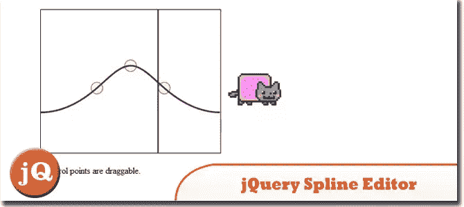
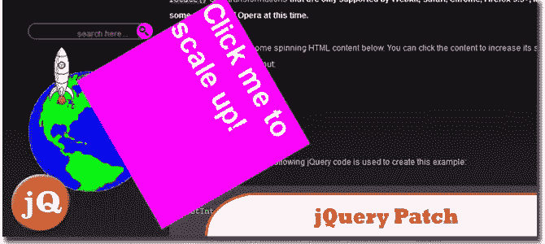
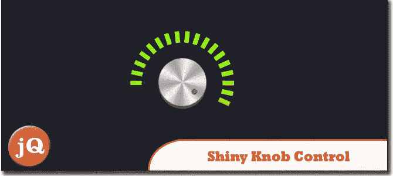
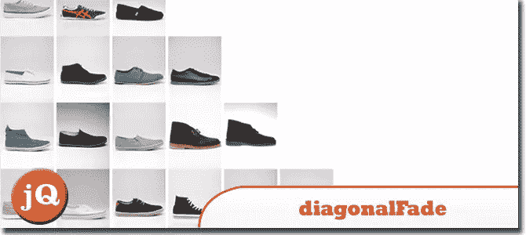
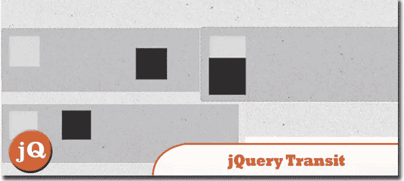
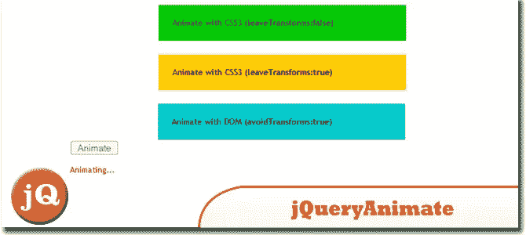
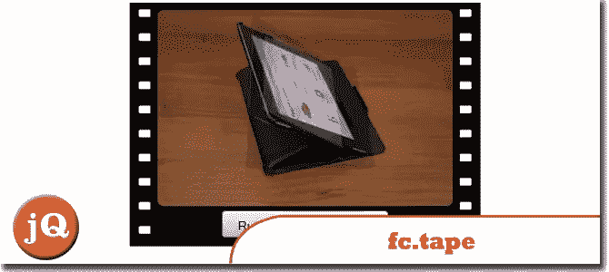

# 8 个 jQuery 动画控件

> 原文：<https://www.sitepoint.com/animation-controls/>

看看我们收集的 8 个 jQuery 动画控制插件。这些插件中的每一个都有自己的特点，这一定会让你的网站脱颖而出。那不是很好吗？！有动漫乐趣！

**相关帖子:**

*   [**8 酷 jQuery 动画特效教程**](http://www.jquery4u.com/animation/8-cool-jquery-animation-effects/)
*   [**10 CSS3 和 jQuery 加载动画解决方案**](http://www.jquery4u.com/animation/10-css3-jquery-loading-animations-solutions/)
*   [**jQuery 动画函数示例**](http://www.jquery4u.com/function-demos/animate/)

## 1.jquery-样条曲线编辑器

jQuery 小部件，用于编辑环绕的三次样条曲线。至少对于控制循环动画是有用的。
 
[来源](https://github.com/Bemmu/jquery-spline-editor#readme) [演示](http://www.bemmu.com/jquery-spline-editor/example4.html)

## 2.jQuery 补丁:动画 CSS 旋转和缩放

使您能够使用 jQuery 独立设置和/或激活任何 HTML 内容的缩放和旋转。
 
[源+演示](http://www.zachstronaut.com/posts/2009/08/07/jquery-animate-css-rotate-scale.html/)

## 3.带有 jQuery 和 CSS3 的闪亮旋钮控件

一个 jQuery 插件，用于创建闪亮的旋钮控件。这个插件恰当地命名为 knobKnob，它将使用 CSS3 转换和 jQuery 新的事件处理方法，为网站访问者提供一种从一个范围内交互选择值的新方式。
 
[来源](http://tutorialzine.com/2011/11/pretty-switches-css3-jquery/) [演示](http://demo.tutorialzine.com/2011/11/pretty-switches-css3-jquery/)

## 4.ASP.NET 动画浏览器

由动画驱动。有了 RIAnimation，向现有的 web 应用程序添加复杂的交互就像放下表单上的控件并设置三个属性一样简单！
 
[源+演示](http://labs.hushhushmedia.com/rianimation/website/)

## 5.对角立面

是一个 jQuery 插件，允许您轻松地为一组元素指定方向、淡入、淡出和许多其他选项。
 
[源+演示](http://jonobr1.github.com/diagonalFade/)

## 6.jQuery Transit

jQuery 的超平滑 CSS3 转换和过渡。
 
[源+演示](http://ricostacruz.com/jquery.transit/)

## 7.jquery.animate 增强插件

该插件将分析你制作动画的属性，并为浏览器选择最合适的方法。这意味着在 Webkit & Mozilla 代理和 Opera 10.50+上，你的左、上和不透明度的过渡将转换为 CSS3 过渡。
 
[源+演示](http://playground.benbarnett.net/jquery-animate-enhanced/)

## 8.fc.tape

精灵动画的 jQuery 小部件。
 
[源+演示](http://source.futurecolors.ru/fc.tape/)

## 分享这篇文章