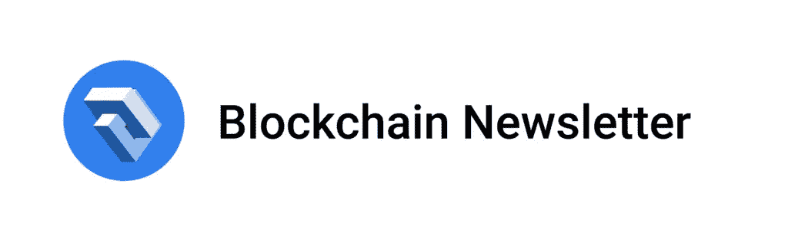

# 宣布 SitePoint 区块链简讯！

> 原文：<https://www.sitepoint.com/announcing-the-sitepoint-blockchain-newsletter/>

[在此注册](https://go.sitepoint.com/h/y/8E2EB509A7FCCD86)在太平洋标准时间周五上午接收每周区块链快讯。

无论是被誉为游戏规则改变者还是被嘲笑为炒作，区块链如今无处不在。但是很难得到关于这项技术的可信的、公正的新闻和教程。如果你想进入区块链开发世界，进入的代价会很高。

区块链技术不仅仅适用于加密货币，这篇简讯将重点介绍这一新兴领域中一些更有趣和令人兴奋的发展，以及自己入门的方法。

你会得到一个由我提供的精选链接，亚当。你可能从每周的后端和设计时事通讯中，或者从版本控制中知道我，我的每日时事通讯和会员出版物集中在 web 开发和设计的前沿。现在我想把我的知识扩展到区块链世界——我希望你们能加入我。

每周五，你会收到一份简讯，里面全是我在自己的研究中发现有用的链接，以及我认为值得的有用工具、教程和项目的链接。此外，没有骗局！

[报名](https://go.sitepoint.com/h/y/8E2EB509A7FCCD86)，我保证既上链又*下链*！

## 分享这篇文章