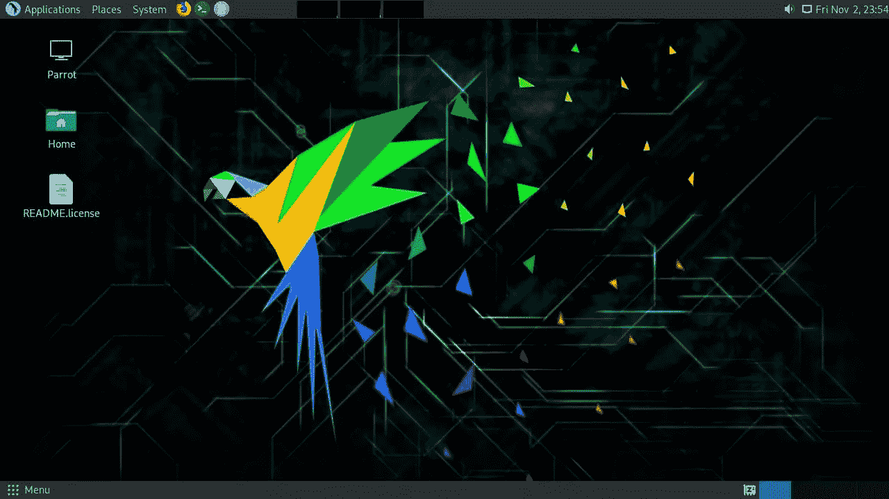
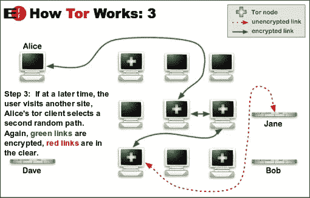
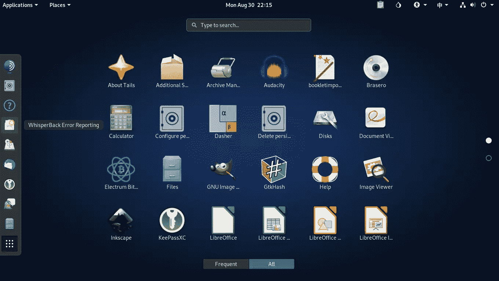
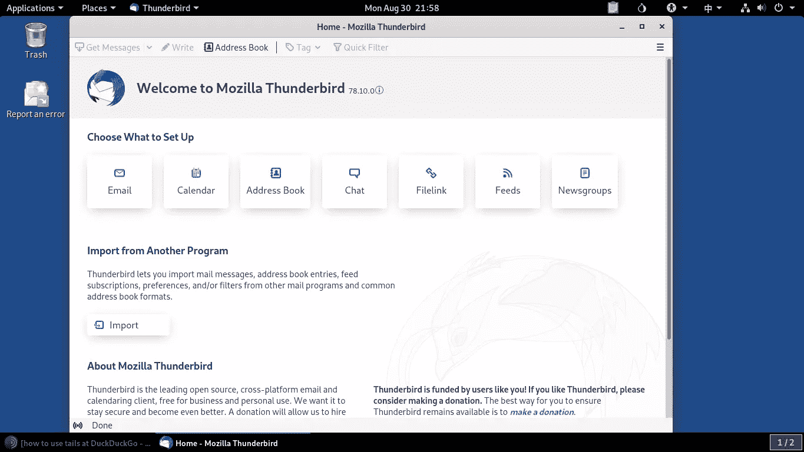
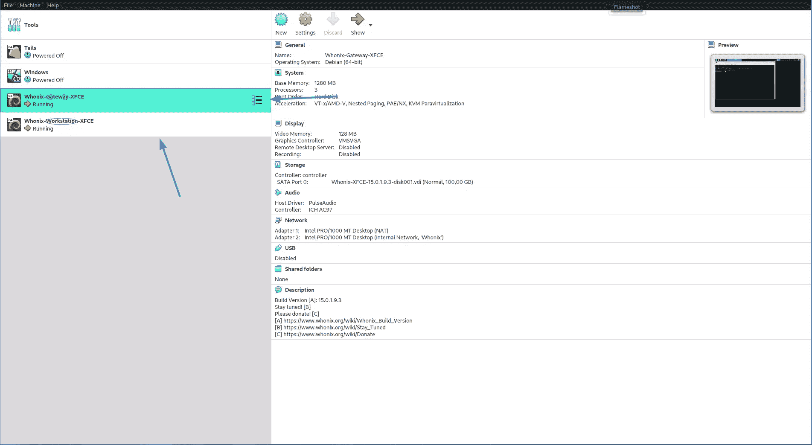
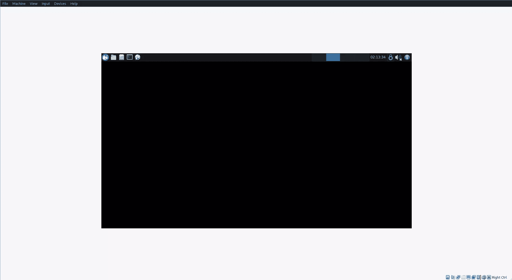
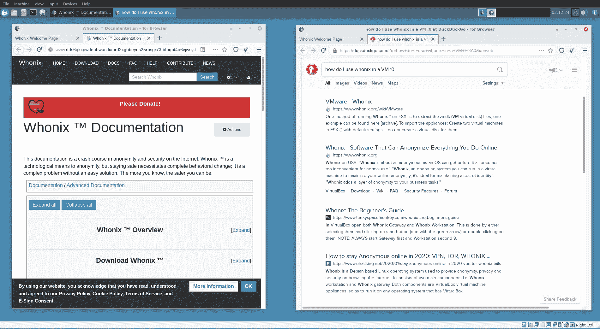
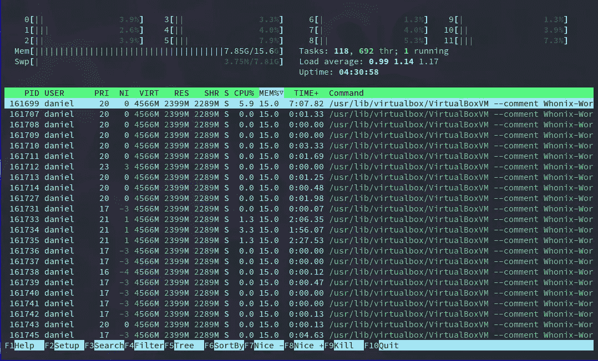
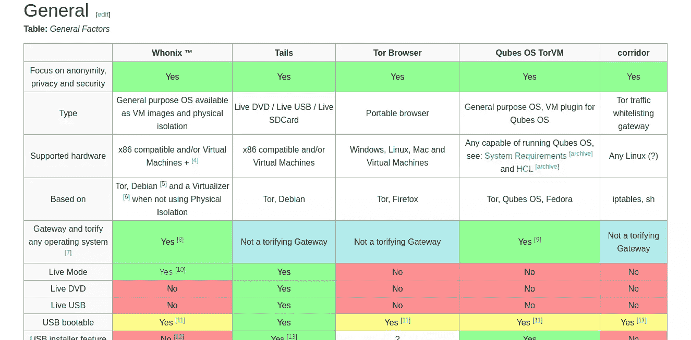
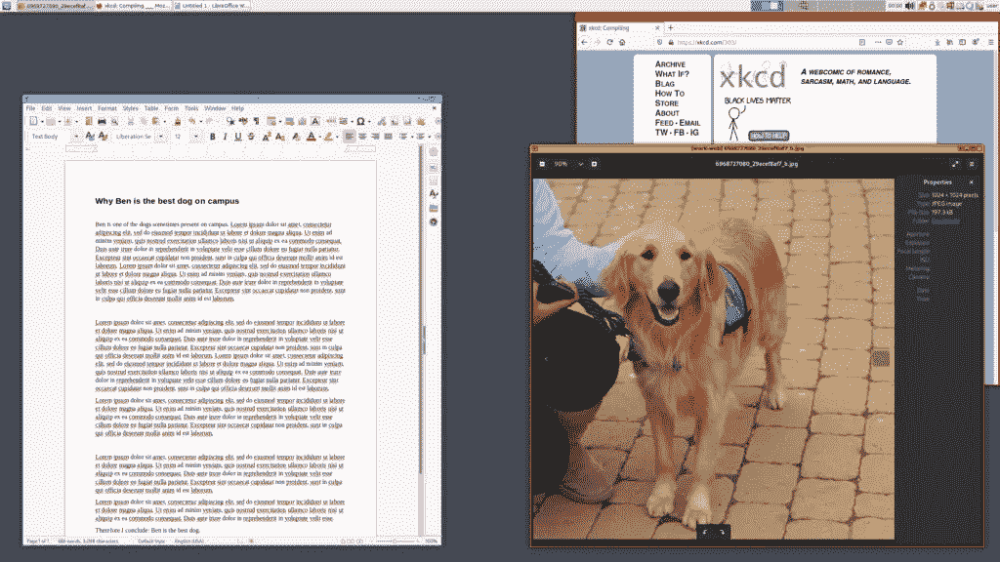

# 帮助你保持匿名的 4 个最好的 Linux 发行版

> 原文：<https://www.sitepoint.com/anonymous-linux-distros/>

在这篇文章中，我们将看看四个帮助你在网络上保持匿名的 Linux 发行版。Linux 操作系统提供了很多隐私选项，如果在线安全和隐私对你来说很重要，它无疑是最好的操作系统。

## 隐私问题

如今在网上匿名很难。无论你是在浏览网页，还是使用连接到互联网的程序，你都会被跟踪。甚至你的操作系统都在看着你。

通过运行像 Windows 这样的操作系统，或者像 VS Code 这样的程序，你会被遥测跟踪。收集到的关于你的大部分数据都被用来改进你每天使用的软件，但是如果你的首要任务是保持匿名，你应该寻找更好的选择。

Linux 操作系统的各种发行版都提供了增强匿名和隐私的特性。但是匿名也有缺点。

在我继续之前，先声明一下。这篇文章的目的是展示什么可以保护你的隐私。这并不是鼓励从事你们国家法律禁止的行为。

## 匿名是什么意思？

保持匿名对不同的人来说意味着不同的事情，所以让我们在继续之前澄清这个概念。

要在网上保持匿名，你需要确定你在躲避谁，以及什么工具能让你隐藏真实身份。

您可以使用威胁建模方法来识别您可能面临的风险。简单地说，美国国家标准与技术研究所(NIST)有四个步骤:

1.  识别和描述感兴趣的系统和数据
2.  确定并选择要包含在模型中的攻击媒介
3.  描述安全控制的特征，以减少攻击媒介
4.  分析威胁模型

如果您想了解更多关于威胁建模的信息，请关注 NIST 草案，其中包含了关于这一过程的详细信息。

例如，一名记者可能希望在网上分享他们的想法时保持匿名。这将消除对歧视或报复的恐惧。简单来说，他们不想让人知道他们是谁，所以他们知道必须躲着谁。

一旦你知道你想对谁保持匿名，是时候使用工具了，比如 Tor 或者下面显示的关注匿名的 Linux 发行版。

当然，匿名有很多优势，但以下是主要优势:

*   言论自由:你可以分享你的想法，而不用担心被评判
*   更少的追踪:更难追踪你在网上做了什么
*   个人安全:没有人知道你的真实身份
*   数据安全:你的数据是珍贵的，保持匿名会使它更难被窃取

## 使用以下 Linux 发行版的各种方法

一般来说，基于 Linux 的操作系统比私有系统更安全，更注重隐私。考虑到这一点，了解以下 Linux 发行版是如何工作的，以及它们将如何帮助您保持匿名是很重要的。

### 使用虚拟机

虚拟机(VM)是作为运行在物理计算机之上的虚拟计算机工作的环境。

虚拟机与系统的其余部分是隔离的，它们可以用于运行几乎任何操作系统，因此它们支持以下 Linux 发行版。

运行虚拟机最流行的软件是 [VirtualBox](https://www.virtualbox.org/) ，这是一个由 Oracle 创建的开源虚拟机管理程序。它可以在 Windows、Linux 和 macOS 上运行，并且易于设置。

从普通用户的角度来看，使用 VM 的主要优点是可以和主机操作系统一起运行，这意味着可以同时使用两者。

### 使用实时启动 USB

实时 USB 无需在您的计算机上安装操作系统即可运行。当你用 USB 安装 Linux 发行版时，它可以让你进入一个真实的环境。这方面的一个很好的例子是 Parrot OS live 环境，如下图所示。

这种方法的主要优点是您不需要安装任何东西，因此您可以在您的计算机上运行实时 USB，使用 Linux 发行版，拔掉 USB，并继续使用您的日常驱动操作系统。

看看 Qubes，它是一个完整的基于 VM 的操作系统。

### 安装在裸机上

如果你想匿名，在你的系统上安装一个 Linux 发行版作为主操作系统并不是最好的选择，因为你将在多个会话中使用你的计算机。

每次使用电脑时，您都会留下您访问过的网站、打开过的文件甚至使用过的 Wi-Fi 网络的信息痕迹。

这就是为什么使用实时启动 USB 或 VM 通常更安全。

一旦你完成了实时环境，关闭它，所有的数据都会消失。同样，对于虚拟机，您可以在作业完成后删除它们。

## 在开始之前，什么是 Tor？

洋葱路由器(Onion Router)是一个开源项目，当你浏览互联网时，它会隐藏你的 IP 地址。它将你的网络请求重定向到一个覆盖全球的网络，这个网络有超过六千个中继站。

当你使用 Tor 时，你通过从不同的人和组织的成千上万的志愿者计算机中选择的三台机器来路由你所有的互联网流量。

第一个中继知道你是谁，但不知道你要连接的下一个中继。第三个中继只知道你要去哪里(外部服务器，如网页)，但不知道你原来的 IP 地址。

所有这些都发生在一个加密的环境中，这就是为什么避免不安全的页面如此重要——那些没有 HTTPS 的页面。

这个[过程](https://2019.www.torproject.org/about/overview.html.en)使得任何人(网站、互联网提供商等等)几乎不可能知道你的 IP 地址。

### 使用 Tor 时不要做什么

Tor 让你隐藏你的 IP 地址，但是如果你使用不当，它就变得没有用了。这里有几件你在使用 Tor 时不应该做的事情:

*   使用你的手机认证
*   在 Tor 中使用个人社交账户(推特、脸书、Gmail)
*   共享个人信息
*   使用旧的 Tor 版本
*   使用谷歌搜索；DuckDuckGo 不收集用户数据
*   浏览任何非 HTPPS(未加密)网页

一旦你掌握了这些技巧，你就可以使用为普通用户设计的快捷方式，Tor 浏览器包。

如今，你可以下载 [Tor 浏览器](https://www.torproject.org/download/)，这是一个运行在所有主要操作系统 Tor 之上的浏览器。如果你愿意，你也可以下载并编译 [Tor 源代码](https://www.torproject.org/download/tor/)。

但是使用 Tor 有一些缺点。最重要的一点是，它限制了你的网速。发生这种情况是因为你通过 Tor 网络路由你的流量，这意味着你做的每个 web 请求必须通过多台计算机。

另一个不利之处是，一些网站，如网飞，银行网站等，被 Tor 屏蔽。此外，如果你经常使用 Tor，你将需要在你访问的大多数页面中填写验证码。

当然，这是为了网络安全和匿名而付出的小小代价。

## 尾部

[Tails](https://tails.boum.org/) 是基于 Debian 的匿名 Linux 发行版。这是一个轻量级的快速操作系统，使用 [Gnome](https://www.gnome.org/) 作为它的默认桌面环境。

它从一个干净的状态开始，当你离开时不留痕迹。这就是所谓的“失忆”，这就是让 Tails 成为安全操作系统的魔力。你可以安全地使用别人的电脑，因为 Tails 在任何时候都不会写入磁盘。

关于 Tails 的另一个很棒的事情是，它使用 Tor 中继作为访问互联网的唯一方式。这意味着您使用的所有网络程序(需要连接到互联网的程序)必须通过 Tor 网络重定向其流量。

因此，即使你使用的是雷鸟这样的简单应用，它从互联网上发送或检索的所有信息都必须通过 Tor。

默认情况下，Tails 安装了以下应用程序:

*   雷鸟
*   [Tor 浏览器](https://www.torproject.org/download)，Ublock Origin，默认搜索引擎为 DuckDuckGo
*   自由办公室
*   GIMP 和 Inkscape 等图形编辑应用程序

使用一段时间后，它感觉像一个坚固而轻量级的操作系统，所以你可以在旧电脑上运行它。(基于 Debian 10)

此外，我发现这个发行版在使用朋友的电脑时很方便，所以你可以保证两个用户的数据安全。

### 尾部特征

*   Tor 中继一切。
*   Tails 的存储不是持久的，所以在你注销后没有办法跟踪你。但是，如果您需要安装其他程序或保存其他设置，您可以启用加密/永久存储。
*   它连接到计算机的硬件，但不与磁盘驱动器交互。
*   在大多数情况下，您可以在感染病毒的设备上使用它，而不会有任何风险。
*   它包括常用应用程序，以及[加密和注重隐私的软件](https://tails.boum.org/doc/about/features/index.en.html)。
*   它允许你安装 Debian 官方仓库中任何可用的软件包。

你可以在 [Tails 的官方网站](https://tails.boum.org/doc/about/features/index.en.html)上获得更详细的功能列表。

### 尾部下载选项

你需要下载 Tails 的 u 盘版本并安装在 8Gb(或更大)的 USB 上。

如果您想要其他选项，Tails 提供了两种使用方式:通过 USB 记忆棒，以及通过虚拟化(用于 VM 内部)。

以下是不同的安装映像:

*   [USB](https://tails.boum.org/install/download/index.en.html)
*   [虚拟机 ISO 镜像](https://tails.boum.org/install/vm-download/index.en.html)

注意:在 VM 中运行 Tails 有两个问题。你的主机操作系统和管理程序可以监控你在 Tails 中做了什么，Tails 可以在硬盘上留下痕迹，这就是为什么当你在 VM 中使用它时它会警告你。

如果你想获得某种程度的舒适(使用 Tails 而不重启你的电脑)，同时失去一点点安全性，这取决于你。

## 鹦鹉操作系统

Parrot OS 用于道德黑客、安全审计和笔式测试。这是一个基于 Debian 的 Linux 发行版，所以您可以获得`apt`包管理器的可靠性。

它自带 Tor、Tor Browser 和 OnionShare 开箱即用，所以你可以开箱即用这个面向匿名的浏览器。

它被认为是一个匿名发行版，因为它的大多数用户知道他们在做什么(他们大多数在网络安全行业工作)，并且他们使用正确的工具来保持匿名。

也许你会认为这只是一个普通的 Debian 发行版，带有很酷很危险的道德黑客软件，但是 Parrot 安全团队创建了一个名为 [Anonsurf](https://linuxhint.com/anonsurf/) 的脚本，它可以让你通过 Tor 找到所有的流量。

如果您将 Parrot 与 Anonsurf 一起使用，会产生与使用 Tails OS 类似的体验。

Parrot 在所有兼容的应用程序中默认使用 [Firejail](https://firejail.wordpress.com/) 。Firejail 是一个通过限制程序工作所需的访问权限来降低安全漏洞风险的程序。

此外，您还有不同的网络工具，如 EtherApe(一个图形网络监视器)，聊天客户端，如 Ricochet(一个匿名的、基于 tor 的聊天客户端)，以及共享文件实用程序，如 OnionShare。

另一方面，由于新增了 [Parrot 的家庭版](https://www.parrotsec.org/home-edition/)，这也是本文唯一可以作为日常驱动的 Linux 发行版。

这可能导致一个缺点，因为不像尾巴，你会在电脑上留下你活动的痕迹。但是如果你是一个寻求匿名的普通用户，Parrot 可以满足你的需求。

你可以把 Parrot 看作是一个关注安全性和匿名性的 Linux 发行版的最佳选择，没有其他发行版如 Qubes 的技术复杂性。

### 特征

*   有一个很棒的[社区](https://www.parrotsec.org/#community)
*   对系统要求低
*   提供家庭版和安全版
*   是用户友好的(与列表中的其他 Linux 发行版相比)
*   附带预装软件
*   包括几个工具，把你的电脑变成一个匿名的机器

### Parrot 下载选项

你可以在官方 [Parrot 网站](https://www.parrotsec.org/download/)下载任何 Parrot OS 版本，也可以用不同的方法使用:

*   [u 盘](https://docs.parrotsec.org/how-to-create-a-parrot-usb-drive.html)
*   [虚拟机 OVA 文件](https://www.parrotsec.org/virtual/)
*   bare metal

## 无名镇

Whonix 不同于我们到目前为止看到的所有其他 Linux 发行版。它由两部分组成:一个充当 Tor 网关的网关(就像 Tails 一样重定向所有的流量)，一个通过 Tor 网关路由所有连接的工作站。

由于没有给出完整的 OS 体验，所以需要一个可以运行 VirtualBox 的主机 OS。

下图显示了网关和工作站同时工作的情况。

网关必须与工作站同时运行。

尽管网关展示了一个基本的 XFCE 环境，但它并不意味着要被使用。把它留在那里处理 Tor 路由。

这是工作站，你可以在这里启动 Tor 浏览器，以及几个只能通过 Tor 中继连接到互联网的应用程序。

但是这个基于匿名的发行版有一个巨大的问题:资源消耗。你正在使用 VirtualBox，这是一个沉重的应用程序，运行两个虚拟机。请记住，工作站依赖于网关。

尽管 Whonix 在 VirtualBox 中运行得非常好，但您可以看到它在没有太多使用的情况下消耗了多少资源。

但是一旦你消除了这些缺点，你就会得到一个在你的操作系统上运行的极其安全和匿名的虚拟机。如果你想匿名，Whonix 是一个不错的选择。

Whonix 的团队在将他们的 Linux 发行版与其他匿名操作系统进行比较方面做得非常出色。

总的来说，Whonix 是你可以在你的主机操作系统上运行的最好的 Linux 发行版，因为它被优化为作为两个独立的虚拟机运行。它有额外的安全加固，如加强 Linux 帐户隔离，以及防止恶意软件传播的虚拟机实时模式。

另外，如果你不关心 GUI 程序，你可以选择只使用一个 [CLI](https://www.whonix.org/wiki/VirtualBox_Testers_Only_Version/CLI) 。

### Whonix 功能

*   适用于所有应用的 Tor 路由
*   实时模式，因此是一种使用 Whonix 的非持久方式
*   按键匿名化
*   坚如磐石的系统，因为它基于 Debian
*   像任何其他基于 Linux 的操作系统一样，免费和开源访问

### Whonix 下载方法

虚拟机是运行 Whonix OS 的唯一途径，你可以根据你当前的 OS 选择合适的[下载方式](https://www.whonix.org/wiki/Download)。

## Qubes

Qubes 是一个开源的、面向安全的操作系统。与本文中涉及的其他 Linux 操作系统不同，Qubes 需要直接安装在您的计算机上。

Qubes 使用 [Xen 级虚拟化](https://wiki.xenproject.org/wiki/Xen_Project_Software_Overview#What_is_the_Xen_Project_Hypervisor.3F)(裸机虚拟化)来创建称为“qubes”的微小隔离隔间。

你可以使用不同的[模板](https://www.qubes-os.org/doc/templates/)来运行不同种类的软件。例如，在 Windows 模板上运行 Microsoft Word，或者使用基于 Debian 模板的终端[应用 qube](https://www.qubes-os.org/doc/glossary/#app-qube) 。

每个 qube 都是一个虚拟机，可以配置成运行你想要的任何程序。这些小虚拟机有不同的目的、性质、颜色或信任级别(绿色代表可信，红色代表不可信)，可以使用 [Whonix](https://www.whonix.org/wiki/Qubes) 通过 Tor 路由所有互联网流量。

[Image source: Qubes](https://www.qubes-os.org/screenshots/)

话虽如此，但不要指望 Qubes 能在低端机器上运行。它为你运行的每个程序创建一个虚拟机，所以它有大量的硬件需求。

需要澄清的是，Qubes 并不适合初学 Linux 的用户。如果你的电脑上有极其重要的私人数据，你可以使用它。但如果你只是想用它匿名浏览互联网，那么使用上面的一些选项会更好。

Qubes OS 有其缺点，但它是你能运行的最安全的操作系统之一。

### 量子特征

*   隔离您使用的软件
*   这是一个非常安全的系统
*   它有大量的[文档](https://www.qubes-os.org/doc/)
*   它包括 Whonix 集成
*   它提供[设备隔离](https://www.qubes-os.org/doc/how-to-use-devices/)

### 量子下载方法

你可以从官方下载页面下载 Qubes 的 ISO 镜像，然后查看 [Qubes 的安装过程](https://www.qubes-os.org/doc/installation-guide/)。

## 结论

上面介绍的所有 Linux 发行版都可以帮助你在通过 Tor 网络使用互联网时保持匿名，但是它们并不是完美的。选择哪一个，以及他们提供多少匿名性，取决于许多因素。

为了决定哪个 Linux 发行版适合你，考虑一下你会给它什么样的用法。

你是一个暴露的人，有重要的私人数据要保护吗？又或许在网上隐藏真实身份对你来说极其重要？如果这些问题的一些答案是“是”，你应该看看 Qubes 或 Whonix。

或者也许你是一个普通用户，正在寻找一点在线隐私。那么，使用 Parrot 和 Tor 浏览器可能是最适合你的。

也许你只是想安全地使用别人的电脑。在这种情况下，尾巴是一个很好的选择。

这完全取决于你有多在乎你的数据，以及你是否愿意使用更多学习曲线更高的私人软件。

最后，请记住，一般来说，任何 Linux 发行版都比 Windows 或 macOS 更加安全和私密，因为:

*   与 Windows 或 macOS 相比，Linux OSs 较少成为网络犯罪分子的目标
*   Linux 操作系统几乎没有安全漏洞，一旦发现，它们会被迅速修复
*   大多数安装在 Linux 上的软件都是开源的，没有恶意软件

如果你是 Linux 新手，可以看看 SitePoint 的[Linux](https://www.sitepoint.com/trying-linux-for-the-first-time-a-beginners-guide/)入门指南。

当然，还有其他方法保持在线匿名，包括使用 VPN。查看“[VPN:它们是什么，以及为什么您需要一个](https://www.sitepoint.com/vpns-what-they-are-why-you-need-one/)”以了解更多信息。

## 分享这篇文章