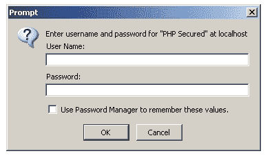
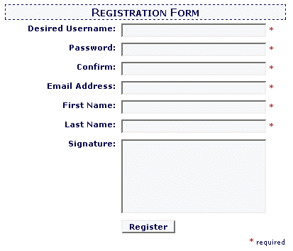
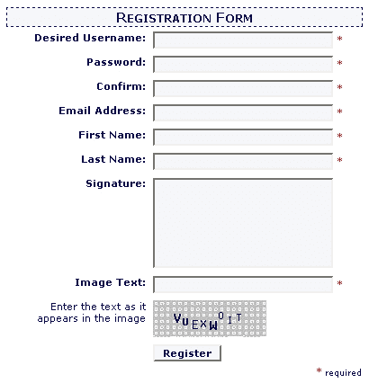
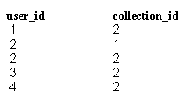

# PHP 选集第 2 卷，第 1 章-访问控制

> 原文：<https://www.sitepoint.com/anthology-2-1-access-control/>

与普通的 HTML 相比，用 PHP 建立你的网站的副作用之一是你将建立动态的网络应用程序而不是静态的网页。你的网站可以让你“做”普通 HTML 做不到的事情。但是你如何确保只有你，或者那些你允许的人，能够“做事情”，并防止互联网上的愤怒人群在你的网站上闹事呢？

在这一章中，我们将会看到一些机制，你可以用 PHP 来建立认证系统和控制对你认为是私有的站点的访问。

在我继续讲下去之前，有一个警告:您构建的任何系统，如果涉及到通过互联网从网页传输数据，默认情况下都会以明文形式发送该信息(需要安全套接字层(SSL)连接的 Web 服务器会在传输过程中安全地加密数据。这是当今 Web 应用程序中保护敏感数据的最佳方式)。这意味着，如果有人在网络上“监听”客户的 Web 浏览器和 Web 服务器之间的内容，这可以使用一种称为数据包嗅探器的工具，他们将能够读取通过您的表单发送的用户名和密码。这种情况发生的几率相当小，因为通常只有像 ISP 这样的可信组织才有拦截数据包的权限。然而，仍然存在风险，这是一个你应该认真对待的问题。

除了为你的站点建立访问控制系统的策略之外，在这一章中你会找到大量有用信息的参考(在附录 C，安全检查表中有更多)。在构建基于 Web 的应用程序时，我再怎么强调一点健康的偏执狂的重要性也不为过。SitePoint 论坛经常收到潜在网站开发者的访问，他们在网站安全方面吃了苦头。

除了第 9 章“网页元素”中的用户表之外，本章还需要以下 MySQL 表。请注意，您将在 sql/目录的代码归档中找到创建所有这些内容的 SQL 代码，以及示例数据。

首先，您需要一个表来存储临时注册信息:

```
CREATE TABLE signup ( 

  signup_id    INT(11)     NOT NULL AUTO_INCREMENT, 

  login        VARCHAR(50) NOT NULL DEFAULT '', 

  password     VARCHAR(50) NOT NULL DEFAULT '', 

  email        VARCHAR(50) DEFAULT NULL, 

  firstName    VARCHAR(50) DEFAULT NULL, 

  lastName     VARCHAR(50) DEFAULT NULL, 

  signature    TEXT        NOT NULL, 

  confirm_code VARCHAR(40) NOT NULL DEFAULT '', 

  created      INT(11)     NOT NULL DEFAULT '0', 

  PRIMARY KEY (signup_id), 

  UNIQUE KEY confirm_code (confirm_code), 

  UNIQUE KEY user_login (login), 

  UNIQUE KEY email (email) 

)
```

您将需要一个表来存储组(注意，我将这个表称为集合。名称“group”会引起问题，因为`GROUP`是 SELECT 查询语法中的一个关键字):

```
CREATE TABLE collection ( 

  collection_id INT(11)     NOT NULL auto_increment, 

  name          VARCHAR(50) NOT NULL default '', 

  description   TEXT        NOT NULL, 

  PRIMARY KEY (collection_id) 

)
```

接下来，有一个用户和组之间的查找表:

```
CREATE TABLE user2collection ( 

  user_id       INT(11)     NOT NULL default '0', 

  collection_id INT(11)     NOT NULL default '0', 

  PRIMARY KEY (user_id, collection_id) 

)
```

不要忘记存储权限的表格:

```
CREATE TABLE permission ( 

  permission_id INT(11)     NOT NULL AUTO_INCREMENT, 

  name          VARCHAR(50) NOT NULL DEFAULT '', 

  description   TEXT        NOT NULL, 

  PRIMARY KEY (permission_id) 

)
```

最后，您将需要这个组和权限之间的查找表:

```
CREATE TABLE collection2permission ( 

  collection_id INT(11)     NOT NULL DEFAULT '0', 

  permission_id INT(11)     NOT NULL DEFAULT '0', 

  PRIMARY KEY (collection_id, permission_id) 

)
```

##### 如何在 PHP 中使用 HTTP 认证？

[超文本传输协议](ftp://ftp.isi.edu/in-notes/rfc2616.txt) (HTTP)定义了自己的认证机制，即“基本”和“摘要”认证，在 [PHP 手册](ftp://ftp.isi.edu/in-notes/rfc2617.txt/#enl#/RFC 2617/#enl#/. If you run PHP on an Apache server, you can take advantage of the basic authentication mechanism (digest authentication is on the list of features yet to be released) using PHP's header function and a couple of predefined variables. A general discussion of these features is provided in the /#nl#/http://www.php.net/features.http-auth)中有定义。

***平视***

首先要理解的是，当你的浏览器向一个 Web 服务器发送一个给它一个网页的请求时，实际上发生了什么。HTTP 是浏览器和 Web 服务器之间的通信协议。当您的 Web 浏览器向 Web 服务器发送请求时，它使用 HTTP 请求来告诉服务器它需要哪个页面。然后服务器回复一个 HTTP 响应，描述发送的文档的类型和特征，然后传送文档本身。

例如，客户端可能会向服务器发送以下请求:

```
GET /subcat/98 HTTP/1.1 

Host: www.sitepoint.com
```

下面是它可能从服务器返回的内容:

```
HTTP/1.1 200 OK 

Date: Tue, 25 Feb 2003 15:18:24 GMT 

Server: Apache/1.3.27 (Unix) PHP/4.3.1 

X-Powered-By: PHP/4.3.1 

Connection: close 

Content-Type: text/html 

<!DOCTYPE html PUBLIC "-//W3C//DTD XHTML 1.0 Strict//EN" 

"https://www.w3.org/TR/xhtml1/DTD/xhtml1-strict.dtd"> 

<html > 

<head> 

<title>SitePoint : Empowering Web Developers Since 1997</title> 

...
```

不相信我？自己尝试一下:

```
Example 1.1\. 1.php 

<?php 

// Connect to sitepoint.com 

$fp = fsockopen('www.sitepoint.com', '80'); 

// Send the request 

fputs($fp, 

  "GET /subcat/98 HTTP/1.1rnHost: www.sitepoint.comrnrn"); 

// Fetch the response 

$response = ''; 

while (!feof($fp)) { 

  $response .= fgets($fp, 128); 

} 

fclose($fp); 

// Convert HTML to entities 

$response = htmlspecialchars($response); 

// Display the response 

echo nl2br($response); 

?>
```

身份验证标头是服务器使用的附加标头，用于指示浏览器必须发送有效的用户名和密码才能查看页面。

在响应对使用基本 HTTP 身份验证保护的页面的普通请求时，服务器可能会使用如下标题进行响应:

```
**HTTP/1.1 401 Authorization Required**  

Date: Tue, 25 Feb 2003 15:41:54 GMT  

Server: Apache/1.3.27 (Unix) PHP/4.3.1  

X-Powered-By: PHP/4.3.1  

**WWW-Authenticate: Basic realm="PHP Secured"**  

Connection: close  

Content-Type: text/html
```

没有发送进一步的信息，但是请注意状态代码 HTTP/1.1 401 需要授权和 WWW-Authenticate 头。总之，这表明该页面受到 HTTP 身份验证的保护，未经授权的用户无法访问。访问者的浏览器如何处理这些信息可能会有所不同，但是，通常，用户会看到一个如图 1.1 所示的小弹出对话框。


图 1.1。让我进去！

该对话框提示站点访问者输入他们的用户名和密码。如果使用 Internet Explorer 的访问者三次错误地输入这些登录信息，浏览器将显示“未授权”消息，而不是再次显示提示。在其他浏览器中，如 Opera，用户可能可以无限期地继续尝试。

注意在对话框中显示了在`WWW-Authenticate`标题中指定的`realm`值。领域是一个“安全空间”或“区域”，在其中一组特定的登录详细信息是有效的。身份验证成功后，浏览器将记住正确的用户名和密码组合，并在将来向该领域发出任何请求时自动重新发送。但是，当用户导航到另一个领域时，浏览器会再次显示新的提示。

在任何情况下，用户都必须提供用户名和密码才能访问该页面。然后，浏览器通过第二个页面请求发送这些凭据，如下所示:

```
GET /admin/ HTTP/1.1  

Host: www.sitepoint.com  

**Authorization: Basic jTSAbT766yN0hGjUi**
```

`Authorization`头包含用 base64 编码的用户名和密码，值得注意的是,*并不*安全——但至少让人看不懂。

服务器将进行检查以确保凭据有效。如果不是，服务器将再次发送`Authorization Required`响应，如前所示。如果凭证有效，服务器将正常发送请求的页面。

***不是靠我的汗毛……***

现在，您对 HTTP 认证的工作原理有了一个大致的了解，那么如何用它来保护 PHP 页面呢？当 PHP 从 Web 浏览器接收到一个`Authorization`头时，它会自动解码用户名和密码组合，并将值分别存储在用户名和密码的变量`$_SERVER['PHP_AUTH_USER']`和`$_SERVER['PHP_AUTH_PW']`中。以下是如何保护一个简单页面的方法:

```
Example 1.2\. 2.php  

<?php  

// An array of allowed users and their passwords  

$users = array(  

  'harryf' => 'secret',  

  'littlepig' => 'chinny'  

);  

// If there's no Authentication header, exit  

if (!isset($_SERVER['PHP_AUTH_USER'])) {  

  header('HTTP/1.1 401 Unauthorized');  

  header('WWW-Authenticate: Basic realm="PHP Secured"');  

  exit('This page requires authentication');  

}  

// If the user name doesn't exist, exit  

if (!isset($users[$_SERVER['PHP_AUTH_USER']])) {  

  header('HTTP/1.1 401 Unauthorized');  

  header('WWW-Authenticate: Basic realm="PHP Secured"');  

  exit('Unauthorized!');  

}  

// Is the password doesn't match the username, exit  

if ($users[$_SERVER['PHP_AUTH_USER']] != $_SERVER['PHP_AUTH_PW'])  

{  

  header('HTTP/1.1 401 Unauthorized');  

  header('WWW-Authenticate: Basic realm="PHP Secured"');  

  exit('Unauthorized!');  

}  

echo 'You're in';  

?>
```

首先，脚本检查浏览器是否发送了身份验证；如果没有，脚本发送`Authorization Required`头并终止。如果登录信息*被*提交，它会检查提交的用户名是否确实存在。如果我们没有检查这一点，我们会得到一个 PHP 通知，说明在对特定的 PHP 配置执行第三次检查时，数组键不存在(见第 10 章，错误处理)。第三次检查确保了`$users`数组中的用户名和密码组合与 Web 浏览器发送的详细信息相匹配。

请注意，我们还可以对照数据库中的表检查用户名和密码——我们将在“如何通过会话验证用户身份”一节中讨论这一点。

*何时发送标题*

在 PHP 中，当你的脚本输出任何想要显示的内容时，Web 服务器就完成了头部的发送，并开始发送内容本身。一旦 HTTP 消息的正文(网页本身)开始发送，就不能再发送 HTTP 头。这意味着如果你在主体开始后使用 header 函数或`session_start`,你会得到一个类似这样的错误信息:

```
Warning: Cannot add header information - headers already  

sent by (output started at...
```

记住，`<?php ... ?>`标签之外的任何文本或空白都会导致输出被发送到浏览器。如果在一个`<?php`标签之前或者在一个`?>`标签之后有空白，你将不能发送标题到浏览器。

这种类型的身份验证很方便，因为它很容易实现，但就用户体验而言，它一点也不漂亮。然而，它确实为 Web 服务提供了一种有用的认证机制——这一点我们将在第 2 章 XML 中看到。

注意，PEAR 提供了 Auth_HTTP 包，如果您打算认真使用 HTTP 认证，应该考虑这个包，因为它可以帮助您避免犯严重错误。有关 PEAR 的详细讨论，请参考附录 D，使用 PEAR。

##### 如何通过会话对用户进行身份验证？

会话是一种允许 PHP 在执行之间保留状态的机制。简单地说，会话允许您存储一个页面中的变量，并在另一个页面中使用它们。因此，如果一个访问者在一个页面上告诉你他的名字是“Bob”(通过一个表格)，sessions 将帮助你记住他的名字，并允许你在网站的所有其他页面上放置个人信息，例如，“Bob，你今天想去哪里？”(不过，如果鲍勃很快离开，不要感到惊讶)。

会话的基本机制是这样的:首先，PHP 生成一个惟一的 32 位字符串来标识会话。然后，它将该值传递给浏览器；同时，它在服务器上创建一个文件，并在文件名中包含会话 ID。PHP 可以通过两种方法通知浏览器它的会话 ID:将 ID 添加到页面上所有相关链接的查询字符串中，或者作为 cookie 发送。在存储在服务器上的文件中，PHP 保存了它被告知为会话存储的变量的名称和值。

当浏览器请求另一个页面时，它通过 URL 查询字符串或通过返回 cookie 告诉 PHP 它被分配给了哪个会话。然后 PHP 查找它在会话开始时创建的文件，这样就可以访问存储在会话中的数据。

一旦会话被建立，它将继续运行，直到被 PHP 专门销毁(例如，响应用户单击“注销”)，或者会话处于非活动状态的时间超过了给定的时间段(默认为 24 分钟)，此时它将被标记为垃圾收集，并将在下次 PHP 检查过时的会话时被删除。

以下 HTTP 响应头显示了服务器将会话 cookie 传递给浏览器，这是 PHP 脚本中的`session_start`函数的结果:

```
HTTP/1.1 200 OK   

Date: Wed, 26 Feb 2003 02:23:08 GMT   

Server: Apache/1.3.27 (Unix) PHP/4.3.1   

X-Powered-By: PHP/4.3.1   

**Set-Cookie: PHPSESSID=ce558537fb4aefe349bb8d48c5dcc6d3; path=/**   

Connection: close   

Content-Type: text/html   

<!DOCTYPE html PUBLIC "-//W3C//DTD XHTML 1.0 Strict//EN"   

"https://www.w3.org/TR/xhtml1/DTD/xhtml1-strict.dtd">   

<html >   

...
```

请注意，我说过会话是作为文件存储在服务器上的。也可以使用其他方式存储会话，比如数据库甚至共享内存。这对于显示“谁在线”类型的信息以及使用单个会话存储库来平衡多个 Web 服务器的负载非常有用，允许访问者(不知不觉地)交换服务器，同时保持他们的会话。

***会话安全***

会话非常有用，但是在应用程序中使用会话时，有一些重要的安全注意事项需要考虑:

*   By default, all a browser has to do to gain control of a session is pass a valid session ID to PHP. In an ideal world, you could store the IP address that registered the session, and double check it on every new request that used the associated session ID. Unfortunately, some ISPs, such as AOL, assign their users a new IP on almost every page request, so this type of security mechanism would soon start throwing valid users out of the system. As such, it’s important to design your application in a manner that assumes that one of your users will eventually have his or her session “hijacked.” The user’s account is only exposed as long as the session hasn’t expired, so your focus should be on preventing the hijackers from doing serious damage while they’re in the system. This means, for example, that for logged-in users to change their accounts’ passwords, they should be asked to provide their old passwords – obviously, hijackers won’t know these. Also, be careful with the personal information you make available to users (such as credit card details), and if you give users the opportunity to make significant changes to their accounts, for instance, changing a shipping address, be sure to send a summary notification to their email address (this will alert users whose sessions have been hijacked).

    为了完全隐藏会话 ID，您需要使用 SSL 来加密会话。此外，您应该只使用传递会话 ID 的 cookie 方法。如果您在 URL 中传递它，那么由于 HTTP 请求中的`referrer`头，您可能会在将访问者引向另一个站点时泄露会话 ID。

*   The files PHP creates for the purpose of storing session information are, by default, stored in the temporary directory of the operating system under which PHP is running. On Unix based systems such as Linux, this will be `/tmp`. And, if you’re on a shared server, this will mean that other users on the server can read the files’ contents. They may not be able to identify which virtual host and PHP script are the owners of the session but, depending on the information you place there, they may be able to guess.

    这是共享 PHP 系统的一个严重问题；最有效的解决方案是将会话存储在数据库中，而不是服务器的临时目录中。我们将在本章后面更仔细地研究自定义会话处理程序，但是一个部分的解决方案是将`session.save_path`选项设置为一个不公开的目录。您需要联系您的托管公司，以便为该目录设置正确的权限，以便运行 PHP 的“nobody”或“wwwuser”用户有权读取、写入和删除该目录中的文件。

    *会话 id 和跨站点脚本*

     *最后一个警告:利用常见的 Web 安全漏洞，跨站脚本(XSS)，攻击者可以在您的站点上放置 JavaScript，这将导致访问者向远程网站泄露他们的会话 ID，从而允许他们的会话被劫持。如果你允许你的访问者张贴任何 HTML，请确保你非常仔细地检查和验证它(参见附录 C，安全检查清单了解更多关于 XSS 和第 5 章，HTML 过滤机制的文本操作)。* 

    记住黄金法则:永远不要依赖客户端技术(比如 JavaScript)来处理安全问题，永远不要相信你从浏览器得到的任何东西。

***入门***

我希望这种介绍不会让你对使用会话如此偏执，以至于你永远也不会碰它们。总的来说，会话提供了一种既简单易用又强大的机制——它是构建在线应用程序的基本工具。

你需要知道的第一个开发技巧是，你应该总是使用预定义的全局变量`$_SESSION`来访问会话变量，而不是函数`session_register`和`session_unregister`。当 PHP 的`register_globals`设置被禁用时，这些函数无法正常工作，这是你应该用 PHP 编程的方式(详见附录 A，PHP 配置)。

为了慢慢开始，这里有一个如何使用会话的简单示例:

```
Example 1.3\. 3.php   

<?php   

session_start();   

// If session variable doesn't exist, register it   

if (!isset($_SESSION['test'])) {   

  $_SESSION['test'] = 'Hello World!';   

  echo '$_SESSION['test'] is registered.<br />' .   

       'Please refresh page';   

} else {   

  // It's registered so display it   

  echo '$_SESSION['test'] = ' . $_SESSION['test'];   

}   

?>
```

使用会话的脚本的第一步是调用`session_start`来加载任何现有的会话变量。

该脚本在页面第一次显示时注册会话变量。下一次(以及此后的所有时间，直到会话因不活动而超时)，脚本将显示会话变量的值。

这是一个如何使用会话的简单例子。我们稍后将使用它们来存储用户名和密码的值，但是首先，我们需要将一些类放在一起，它们将协作处理会话和身份验证。不要慌！这些类本身可能会变得相当复杂，但是从外部脚本使用它们会很容易。

首先，让我们为会话开发一个类。所有代码都将使用这个类来访问会话，而不是直接使用`$_SESSION`变量。这样做的好处是，如果我们想切换到另一种会话处理机制，比如我们自己构建的机制，我们只需要修改类，而不是重写大量代码。我们可以用几个简单的方法为`$_SESSION`变量提供一个接口:

```
Example 1.4\. Session/Session.php (in SPLIB)    

<?php    

/**    

 * A wrapper around PHP's session functions    

 * <code>    

 * $session = new Session();    

 * $session->set('message','Hello World!');    

 * echo ( $session->get('message'); // Displays 'Hello World!'    

 * </code>    

 * @package SPLIB    

 * @access public    

 */    

class Session {    

  /**    

   * Session constructor<br />    

   * Starts the session with session_start()    

   * <b>Note:</b> that if the session has already started,    

   * session_start() does nothing    

   * @access public    

   */    

  function Session()    

  {    

    session_start();    

  }    

  /**    

   * Sets a session variable    

   * @param string name of variable    

   * @param mixed value of variable    

   * @return void    

   * @access public    

   */    

  function set($name, $value)    

  {    

    $_SESSION[$name] = $value;    

  }    

  /**    

   * Fetches a session variable    

   * @param string name of variable    

   * @return mixed value of session varaible    

   * @access public    

   */    

  function get($name)    

  {    

    if (isset($_SESSION[$name])) {    

      return $_SESSION[$name];    

    } else {    

      return false;    

    }    

  }    

  /**    

   * Deletes a session variable    

   * @param string name of variable    

   * @return void    

   * @access public    

   */    

  function del($name)    

  {    

    unset($_SESSION[$name]);    

  }    

  /**    

   * Destroys the whole session    

   * @return void    

   * @access public    

   */    

  function destroy()    

  {    

    $_SESSION = array();    

    session_destroy();    

  }    

}     

?>
```

接下来，我们构建一个名为`Auth`的认证类，它将使用我们在前面章节中看到的 MySQL 类，以及上面的`Session`类。

我们从定义几个常量开始，这些常量使得为不同的环境定制这个类变得容易:

```
Example 1.5\. AccessControl/Auth.php (in SPLIB) (excerpt)    

// Name to use for login variable e.g. $_POST['login']    

@define('USER_LOGIN_VAR', 'login');    

// Name to use for password variable e.g. $_POST['password']    

@define('USER_PASSW_VAR', 'password');    

# Modify these constants to match your user login table    

// Name of users table    

@define('USER_TABLE', 'user');    

// Name of login column in table    

@define('USER_TABLE_LOGIN', 'login');    

// Name of password column in table    

@define('USER_TABLE_PASSW', 'password');
```

前两个常量是我们稍后将构建的登录表单的用户名和密码字段的名称。接下来的三个提供了存储用户信息的表的细节。

接下来是该类的属性和构造函数:

```
Example 1.6\. AccessControl/Auth.php (in SPLIB) (excerpt)    

/**    

 * Authentication class<br />    

 * Automatically authenticates users on construction<br />    

 * <b>Note:</b> requires the Session/Session class be available    

 * @access public    

 * @package SPLIB    

 */    

class Auth {    

  /**    

   * Instance of database connection class    

   * @access private    

   * @var object    

   */    

  var $db;    

  /**    

   * Instance of Session class    

   * @access private    

   * @var Session    

   */    

  var $session;    

  /**    

   * Url to re-direct to in not authenticated    

   * @access private    

   * @var string    

   */    

  var $redirect;    

  /**    

   * String to use when making hash of username and password    

   * @access private    

   * @var string    

   */    

  var $hashKey;    

  /**    

   * Are passwords being encrypted    

   * @access private    

   * @var boolean    

   */    

  var $md5;    

  /**    

   * Auth constructor    

   * Checks for valid user automatically    

   * @param object database connection    

   * @param string URL to redirect to on failed login    

   * @param string key to use when making hash of user name and    

   *               password    

   * @param boolean if passwords are md5 encrypted in database    

   *               (optional)    

   * @access public    

   */    

  function Auth(&$db, $redirect, $hashKey, $md5 = true)    

  {    

    $this->db       = &$db;    

    $this->redirect = $redirect;    

    $this->hashKey  = $hashKey;    

    $this->md5      = $md5;    

    $this->session  = &new Session();    

    $this->login();    

  }
```

`$db`参数接受 MySQL 类的一个实例，它是我们在第 3 章 PHP 和 MySQL 中创建的。

`$redirect`参数指定了一个 URL，如果访问者没有登录，或者他们的用户名或密码不正确，他们将被重定向到这个 URL。例如，这可能是一个登录表单。

`$hashKey`参数是我们提供的一个种子，用于仔细检查已经登录的用户的用户名和密码。稍后我会更详细地解释这一点。

`$md5`参数告诉这个类我们是否已经使用 MD5 加密将密码存储在数据库中。

**MD5 数字签名**

MD5 是一种简单的消息摘要算法(通常称为单向加密)，它将任何字符串(如密码)转换为一系列简短的 ASCII 字符，称为 MD5 摘要。一个特定的字符串将总是产生相同的摘要，但是实际上不可能猜测一个字符串将产生一个给定的摘要。通过在数据库中只存储用户密码的 MD5 摘要，您可以验证他们的登录凭证，而不必在服务器上实际存储密码！内置的 PHP 函数 md5 允许您计算 PHP 中任何字符串的 MD5 摘要。

构造函数继续创建一个新的`Session`类实例，并存储在一个实例变量中，最后调用 login 方法根据数据库验证用户。

登录方法如下:

```
Example 1.7\. AccessControl/Auth.php (in SPLIB) (excerpt)     

  /**     

   * Checks username and password against database     

   * @return void     

   * @access private     

   */     

  function login()     

  {     

    // See if we have values already stored in the session     

    if ($this->session->get('login_hash')) {     

      $this->confirmAuth();     

      return;     

    }     

    // If this is a fresh login, check $_POST variables     

    if (!isset($_POST[USER_LOGIN_VAR]) ||     

        !isset($_POST[USER_PASSW_VAR])) {     

      $this->redirect();     

    }     

    if ($this->md5) {     

      $password = md5($_POST[USER_PASSW_VAR]);     

    } else {     

      $password = $_POST[USER_PASSW_VAR];     

    }     

    // Escape the variables for the query     

    $login = mysql_escape_string($_POST[USER_LOGIN_VAR]);     

    $password = mysql_escape_string($password);     

    // Query to count number of users with this combination     

    $sql = "SELECT COUNT(*) AS num_users     

            FROM " . USER_TABLE . "     

            WHERE     

              " . USER_TABLE_LOGIN . "='$login' AND     

              " . USER_TABLE_PASSW . "='$password'";     

    $result = $this->db->query($sql);     

    $row = $result->fetch();     

    // If there isn't is exactly one entry, redirect     

    if ($row['num_users'] != 1) {     

      $this->redirect();     

    // Else is a valid user; set the session variables     

    } else {     

      $this->storeAuth($login, $password);     

    }     

  }
```

`login`方法首先检查用户名和密码的值当前是否存储在会话中；如果是，它调用`confirmAuth`方法(见下文)。如果用户名和密码值没有存储在会话中，该方法会检查它们在`$_POST`数组中是否可用，如果不可用，它会调用`redirect`方法(见下文)。

假设已经找到了`$_POST`值，脚本对数据库执行查询，看是否能找到与提交的用户名和密码相匹配的记录。必须正好有一个匹配记录，否则访问者将被重定向。最后，假设脚本已经完成了这一步，它使用`storeAuth`方法将用户名和密码注册为会话变量(见下文)，这使得它们可用于将来的页面请求。

关于 login 方法需要注意的一点是，它假设关闭了`magic_quotes_gpc`，因为它使用`mysql_escape_string`来准备提交的值，以便合并到数据库查询中。在利用这个类的脚本中，我们将包含消除神奇引号影响的脚本(参见“如何编写可移植的 PHP 代码？”).

现在让我们看看`login`使用的方法。

```
Example 1.8\. AccessControl/Auth.php (in SPLIB) (excerpt)     

  /**     

   * Sets the session variables after a successful login     

   * @return void     

   * @access protected     

   */     

  function storeAuth($login, $password)     

  {     

    $this->session->set(USER_LOGIN_VAR, $login);     

    $this->session->set(USER_PASSW_VAR, $password);     

    // Create a session variable to use to confirm sessions     

    $hashKey = md5($this->hashKey . $login . $password);     

    $this->session->set('login_hash', $hashKey);     

  }
```

`storeAuth`方法用于将用户名和密码以及哈希值添加到会话中。这由使用 Auth 类定义的种子值组成(还记得构造函数所需的`$hashKey`参数吗？)，以及用户名和密码值。正如我们将在下面的`confirmAuth`方法中看到的，每当用户请求一个页面时，该类不是费力地检查数据库以验证登录凭证，而是简单地检查当前用户名和密码产生的哈希值是否与存储在会话中的哈希值相同。如果您的 PHP 配置启用了`register_globals`，这可以防止潜在的攻击者在登录后试图更改存储的用户名。

正如我刚才所描述的，`confirmAuth`方法用于在用户登录后仔细检查会话中存储的凭证。注意我们是如何复制由`storeAuth`方法构建的散列的。如果这与原始哈希值不匹配，用户将立即被注销。

```
Example 1.9\. AccessControl/Auth.php (in SPLIB) (excerpt)     

  /**     

   * Confirms that an existing login is still valid     

   * @return void     

   * @access private     

   */     

  function confirmAuth()     

  {     

    $login = $this->session->get(USER_LOGIN_VAR);     

    $password = $this->session->get(USER_PASSW_VAR);     

    $hashKey = $this->session->get('login_hash');     

    if (md5($this->hashKey . $login . $password) != $hashKey)     

    {     

      $this->logout(true);     

    }     

  }
```

`logout`方法是`Auth`类中唯一的公共方法。它用于从会话中删除登录凭据，并将用户返回到登录表单:

```
Example 1.10\. AccessControl/Auth.php (in SPLIB) (excerpt)     

  /**     

   * Logs the user out     

   * @param boolean Parameter to pass on to Auth::redirect()     

   *               (optional)     

   * @return void     

   * @access public     

   */     

  function logout($from = false)     

  {     

    $this->session->del(USER_LOGIN_VAR);     

    $this->session->del(USER_PASSW_VAR);     

    $this->session->del('login_hash');     

    $this->redirect($from);     

  }
```

`redirect`方法用于将访问者返回到登录表单(或者我们在实例化`Auth`类时指定的任何 URL):

```
Example 1.11\. AccessControl/Auth.php (in SPLIB) (excerpt)     

  /**     

   * Redirects browser and terminates script execution     

   * @param boolean adverstise URL where this user came from     

   *               (optional)     

   * @return void     

   * @access private     

   */     

  function redirect($from = true)     

  {     

    if ($from) {     

      header('Location: ' . $this->redirect . '?from=' .     

             $_SERVER['REQUEST_URI']);     

    } else {     

      header('Location: ' . $this->redirect);     

    }     

    exit();     

  }
```

除非您告诉它不要这样做，否则这个方法会通过查询字符串将`from`变量发送给浏览器重定向到的脚本。这允许登录表单将用户返回到他们来自的位置；它使用户不必导航回该点，这在会话超时等情况下可能很有用。注意，在注销方法中，我们指定`redirect`不应该提供`from`变量。如果是这样，脚本可能会将用户返回到他们注销时使用的 URL，将他们置于一个无法登录的循环中。

这里需要注意的一点是，重定向 URL(由构造函数设置)应该是绝对的，而不是相对的。根据 HTTP 规范，当使用`Location`头时，必须提供一个绝对 URL。稍后，当我们将这个类投入使用时，我将打破这个规则，使用一个相对 URL，因为我无法猜测脚本在服务器上的位置。这是因为大多数最新的浏览器理解它(尽管它们不应该理解)。在实时网站上，确保提供完整的绝对 URL。

最后，也是最重要的，我们使用`exit`来终止所有进一步的处理。这可以防止调用脚本发送跟随身份验证代码的受保护内容。虽然我们已经发送了一个应该重定向浏览器的头，但我们不能依赖浏览器去做它被告知的事情。例如，如果请求是由一个 Perl 脚本*假装*是一个 Web 浏览器发送的，那么无论是谁使用这个脚本，毫无疑问，都可以完全控制它的行为，并且可以很容易地忽略重定向到其他地方的指令。因此，`exit`语句至关重要。

总的来说，这种方法有助于把我们从自己的错误中拯救出来；如果给定的用户无效，脚本执行会暂停，用户会被重定向到另一个“安全”页面。另一种方法可能是在页面中构建条件语句，如下所示:

```
if ($auth->login()) {     

  echo 'You are logged in';     

} else {     

  echo 'Invalid login';     

}
```

然而，这并不是一个好主意。在一个更复杂的场景中，涉及到多个文件包含，并让类负责应用程序的不同部分，您可能会无意中允许未经授权的访问者访问。重定向的方法简单、可靠，并且不太可能导致如此令人讨厌的意外。

***行动中的认证***

现在您已经看到了`Session`和`Auth`类的内部，让我们来看看使用它们的一些代码。首先，下面是作为登录表单的脚本:

```
Example 1.12\. 4.php      

<?php      

// If $_GET['from'] comes from the Auth class      

if (isset($_GET['from'])) {      

  $target = $_GET['from'];      

} else {      

  // Default URL: usually index.php      

  $target = '5.php';      

}      

?>      

<!DOCTYPE html PUBLIC "-//W3C//DTD XHTML 1.0 Transitional//EN"      

  "https://www.w3.org/TR/xhtml1/DTD/xhtml1-transitional.dtd">      

<html >      

<head>      

<title> Login Form </title>      

<meta http-equiv="Content-type"      

  content="text/html; charset=iso-8859-1" />      

<style type="text/css">      

body, a, td, input      

{      

    font-family: verdana;      

    font-size: 11px;      

}      

h1      

{      

    font-family: verdana;      

    font-size: 15px;      

    color: navy      

}      

</style>      

</head>      

<body>      

<h1>Please log in</h1>      

<form action="<?php echo $target; ?>" method="post">      

<table>      

<tr valign="top">      

<td>Login Name:</td>      

<td><input type="text" name="login" /></td>      

</tr>      

<tr valign="top">      

<td>Password:</td>      

<td><input type="password" name="password" /></td>      

</tr>      

<tr valign="top">      

<td></td>      

<td><input type="submit" value=" Login " /></td>      

</tr>      

</table>      

</form>      

</body>      

</html>
```

在脚本的开始，我们检查查询字符串变量`$_GET['from']`。如果它存在，我们使用它作为表单的动作(即表单提交到的页面)，这样成功的登录会将用户发送到请求的页面。否则，使用默认的目标页面(本例中为 5.php)。

在本章的后面，我们将使用`QuickForm`来复制这个表单，这可能是一个有趣的比较。

接下来，让我们看看安全页面:

```
Example 1.13\. 5.php      

<?php      

// Include Magic Quotes stripping script      

require_once 'MagicQuotes/strip_quotes.php';      

// Include MySQL class      

require_once 'Database/MySQL.php';      

// Include Session class      

require_once 'Session/Session.php';      

// Include Auth class      

require_once 'AccessControl/Auth.php';      

$host   = 'localhost'; // Hostname of MySQL server      

$dbUser = 'harryf';    // Username for MySQL      

$dbPass = 'secret';    // Password for user      

$dbName = 'sitepoint'; // Database name      

// Instantiate MySQL connection      

$db = &new MySQL($host, $dbUser, $dbPass, $dbName);      

// Instantiate the Auth class      

$auth = &new Auth($db, '4.php', 'secret');      

// For logging out      

if (isset($_GET['action']) && $_GET['action'] == 'logout') {      

  $auth->logout();      

}      

?>      

<!DOCTYPE html public "-//W3C//DTD XHTML 1.0 Transitional//EN"      

  "https://www.w3.org/TR/xhtml1/DTD/xhtml1-transitional.dtd">      

<html >      

<head>      

<title> Welcome </title>      

<meta http-equiv="Content-type"      

  content="text/html; charset=iso-8859-1" />      

<style type="text/css">      

body, a, td, input      

{      

    font-family: verdana;      

    font-size: 11px;      

}      

h1      

{      

    font-family: verdana;      

    font-size: 15px;      

    color: navy      

}      

</style>      

</head>      

<body>      

<h1>Welcome</h1>      

<p>You are now logged in</p>      

<?php      

if (isset($_GET['action']) && $_GET['action'] == 'test') {      

  echo '<p>This is a test page. You are still logged in';      

}      

?>      

<p><a href="<?php echo $_SERVER['PHP_SELF'];      

  ?>?action=test">Test page</a></p>      

<p><a href="<?php echo $_SERVER['PHP_SELF'];      

  ?>?action=logout">Logout</a></p>      

</body>      

</html>
```

用户查看此页面的唯一方法是提供正确的用户名和密码。当`Auth`类被实例化时，它执行安全检查。如果已经通过表单提交了有效的用户名和密码值，那么它们将由`Auth`存储在一个会话变量中，允许访问者继续浏览，而不必再次登录。

正如所承诺的，使用`Auth`类非常容易。要用它来保护页面，您需要做的就是将它放在开始处(当然，您还必须包含 Auth.php 文件，该文件包含带有`require_once`的类定义):

```
// Instantiate the Auth class      

$auth = &new Auth(&$db, $loginUrl);
```

如前所述，`$loginUrl`是`Auth`类应该将尚未登录的用户重定向到的 URL。

***提升空间***

`Auth`类的基本机制是稳固的，但是它缺少更复杂的元素，这些元素是阻止任何严重入侵者的努力所必需的。

实现一种机制来监视从单个客户端进行的失败登录尝试的次数是一个好主意。如果您的应用程序总是立即响应任何登录尝试，潜在的入侵者就有可能在很短的时间内发出大量请求，尝试不同的用户名和密码组合。解决方案是建立一种机制，使用一个会话变量来计算失败的尝试次数。每次失败的次数被三整除(即输入了三个不正确的密码)，使用 PHP 的`sleep`函数来延迟下一次尝试，例如十秒钟。您还可以决定，在达到某个阈值(例如，15 次尝试失败)后，在给定时间内(例如一个小时)阻止来自该 IP 地址的所有进一步访问。当然，更改 IP 地址比更改电话号码要容易得多，但你至少会阻止潜在的入侵者，并且可能会让他们的生活变得足够困难，从而说服他们去其他地方。

一个好的安全系统的另一个重要组成部分是“事件记录”机制，它跟踪可疑的访问。在第 4 章“统计和跟踪”中，您将发现记录访问者信息的基本机制，包括如何跟踪 IP 地址，而在第 7 章“设计模式”中找到的观察者模式可以用来“观察”Auth 类的失败尝试次数。

您可能希望将日志记录与某种警报机制联系起来，如果有人攻击您的站点，该机制会向您发出警告，让您有机会立即做出响应。在关键环境中，考虑使用短信网关作为您的警报系统，这样即使您不在线也能收到通知。

##### 我如何建立一个用户注册系统？

拥有一个身份验证系统是很好的，但是首先如何让用户填满它呢？如果只有你自己和几个朋友访问你的网站，你可以通过数据库管理界面为所有用户创建账户。然而，对于一个想要成为任何人都可以自由注册的繁荣社区的网站，你需要自动完成这个过程。你会希望允许访问者自己注册，但是你可能仍然需要某种程度的“筛选”,这样你至少可以获得一些注册用户的信息(比如确认他们身份的方法)。一种常见而有效的筛选方法是让注册人确认他们的电子邮件地址。

筛选机制的目的是让您能够让那些“违反规则”并失去帐户权限的用户难以创建新帐户。你有(至少一个)他们的电子邮件地址-如果他们试图使用该地址再次注册，你可以拒绝他们访问。不过，要小心；一种新型的互联网服务正在流行起来。由 [Mailinator](http://www.mailinator.com/) 开创的这些服务为用户提供了临时的电子邮件地址，他们可以使用这些地址进行注册。

在这里，我们将建立一个注册系统，使用新注册者的电子邮件地址来验证他们；他们将收到一封电子邮件，要求他们通过 URL 确认注册。

***更类！***

注册系统是建立更多类的另一个好机会！不过，这一次会更有趣，因为我们使用 PEAR::HTML_QuickForm 包(第 9 章，网页元素)和`phpmailer`(第 8 章，电子邮件)来为注册系统做一些工作。其余的将由我自己构建的类来处理，但最终结果将便于您在自己的应用程序中自定义和重用。

首先，我们需要可视化(成功)注册新用户的过程:

*   用户填写注册表单。
*   当用户完成表单时，我们在注册表格中插入一条记录，并发送一封确认电子邮件。
*   访问者按照电子邮件中的链接，并确认帐户。
*   我们将注册表中的细节复制到用户表中。该帐户现已激活。

我们使用两个表来处理注册，将“危险”数据与“安全”数据分开。您将希望有一个 cron 作业或类似的作业来定期检查注册表，并删除任何超过 24 小时的条目。分离表可以更容易地清除注册表的内容(避免不必要的错误)，并保持用户表的整洁，这样在用户验证期间就不会对性能产生不必要的影响。

我们首先需要一个类来处理注册过程中的关键步骤。首先，我们必须为该类使用的表名和列名定义一组常量。如果您使用不同的表结构，这将允许您在脚本中覆盖它们的值。

```
Example 1.14\. AccessControl/SignUp.php (in SPLIB) (excerpt)       

# Modify these constants to match your user login and signup       

# tables       

// Name of users table       

@define('USER_TABLE', 'user');       

// Name of signup table       

@define('SIGNUP_TABLE', 'signup');       

// Name of login column in table       

@define('USER_TABLE_LOGIN', 'login');       

// Name of password column in table       

@define('USER_TABLE_PASSW', 'password');       

// Name of email column in table       

@define('USER_TABLE_EMAIL', 'email');       

// Name of firstname column in table       

@define('USER_TABLE_FIRST', 'firstName');       

// Name of lastname column in table       

@define('USER_TABLE_LAST', 'lastName');       

// Name of signature column in table       

@define('USER_TABLE_SIGN', 'signature');       

// Name of ID column in signup       

@define('SIGNUP_TABLE_ID', 'signup_id');       

// Name of confirm_code column in signup       

@define('SIGNUP_TABLE_CONFIRM', 'confirm_code');       

// Name of created column in signup       

@define('SIGNUP_TABLE_CREATED', 'created');
```

常量不存在了，我们可以继续讨论`SignUp`类的成员变量和构造函数:

```
Example 1.15\. AccessControl/SignUp.php (in SPLIB) (excerpt)       

/**       

 * SignUp Class<br />       

 * Provides functionality for for user sign up<br />       

 * <b>Note:</b> you will need to modify the createSignup() method       

 * if you are using a different database table structure       

 * <b>Note:</b> this class requires       

 * @link http://phpmailer.sourceforge.net/ PHPMailer       

 * @access public       

 * @package SPLIB       

 */       

class SignUp {       

  /**       

   * Database connection       

   * @access private       

   * @var object       

   */       

  var $db;       

  /**       

   * The name / address the signup email should be sent from       

   * @access private       

   * @var array       

   */       

  var $from;       

  /**       

   * The name / address the signup email should be sent to       

   * @access private       

   * @var array       

   */       

  var $to;       

  /**       

   * The subject of the confirmation email       

   * @access private       

   * @var string       

   */       

  var $subject;       

  /**       

   * Text of message to send with confirmation email       

   *       

   * @var string       

   */       

  var $message;       

  /**       

   * Whether to send HTML email or not       

   * @access private       

   * @var boolean       

   */       

  var $html;       

  /**       

   * Url to use for confirmation       

   * @access private       

   * @var string       

   */       

  var $listener;       

  /**       

   * Confirmation code to append to $this->listener       

   * @access private       

   * @var string       

   */       

  var $confirmCode;       

  /**       

   * SignUp constructor       

   * @param object instance of database connection       

   * @param string URL for confirming the the signup       

   * @param string name for confirmation email       

   * @param string address for confirmation email       

   * @param string subject of the confirmation message       

   * @param string the confirmation message containing       

   *               <confirm_url/>       

   * @access public       

   */       

  function SignUp(&$db, $listener, $frmName, $frmAddress, $subj,       

                  $msg, $html)       

  {       

    $this->db             = &$db;       

    $this->listener       = $listener;       

    $this->from[$frmName] = $frmAddress;       

    $this->subject        = $subj;       

    $this->message        = $msg;       

    $this->html           = $html;       

  }
```

当我们在上面的构造函数中实例化这个类时，我们需要给它传递一个到数据库的连接；我们使用`MySQL`类来实现这一点。然后，我们告诉它当注册者确认他们的注册时，他们应该被定向到的 URL。我们还给它一个注册邮件的“发件人”姓名和地址(例如你的名字`<you@yoursite.com>`)，以及邮件本身的主题和信息。最后，我们需要识别这是否是一封 HTML 邮件，以便`phpmailer`能够正确地格式化邮件。

不管是不是 HTML，消息至少应该包含一个特殊的标签，`<confirm_url/>`。这充当消息中的“占位符”，标识由`SignUp`类构建的确认 URL 应该插入的位置。

接下来，`createCode`方法在类内部被调用，用于生成确认码，确认码将通过电子邮件发送:

```
Example 1.16\. AccessControl/SignUp.php (in SPLIB) (excerpt)        

  /**        

   * Creates the confirmation code        

   * @return void        

   * @access private        

   */        

  function createCode($login)        

  {        

    srand((double)microtime() * 1000000);         

    $this->confirmCode = md5($login . time() . rand(1, 1000000));        

  }
```

`createSignup`方法用于将记录插入注册表中:

```
Example 1.17\. AccessControl/SignUp.php (in SPLIB) (excerpt)        

  /**        

   * Inserts a record into the signup table        

   * @param array contains user details. See constants defined for        

   *              array keys        

   * @return boolean true on success        

   * @access public        

   */        

  function createSignup($userDetails)        

  {        

    $login     = mysql_escape_string(        

                   $userDetails[USER_TABLE_LOGIN]);        

    $password  = mysql_escape_string(        

                   $userDetails[USER_TABLE_PASSW]);        

    $email     = mysql_escape_string(        

                   $userDetails[USER_TABLE_EMAIL]);        

    $firstName = mysql_escape_string(        

                   $userDetails[USER_TABLE_FIRST]);        

    $lastName  = mysql_escape_string(        

                   $userDetails[USER_TABLE_LAST]);        

    $signature = mysql_escape_string(        

                   $userDetails[USER_TABLE_SIGN]);        

    // First check login and email are unique in user table        

    $sql = "SELECT * FROM " . USER_TABLE . "        

            WHERE        

              " . USER_TABLE_LOGIN . "='$login' OR        

              " . USER_TABLE_EMAIL . "='$email'";        

    $result = $this->db->query($sql);        

    if ($result->size() > 0) {        

      trigger_error('Unique username and email address required');        

      return false;        

    }        

    $this->createCode($login);        

    $toName = $firstName . ' ' . $lastName;        

    $this->to[$toName] = $email;        

    $sql = "INSERT INTO " . SIGNUP_TABLE . " SET        

              " . USER_TABLE_LOGIN . "='$login',        

              " . USER_TABLE_PASSW . "='$password',        

              " . USER_TABLE_EMAIL . "='$email',        

              " . USER_TABLE_FIRST . "='$firstName',        

              " . USER_TABLE_LAST . "='$lastName',        

              " . USER_TABLE_SIGN . "='$signature',        

              " . SIGNUP_TABLE_CONFIRM . "='$this->confirmCode',        

              " . SIGNUP_TABLE_CREATED . "='" . time() . "'";        

    $result = $this->db->query($sql);        

    if ($result->isError()) {        

      return false;        

    } else {        

      return true;        

    }        

  }
```

当提交注册表单时，我们将使用这个方法来创建注册记录。请注意，当系统检查提交的用户名或电子邮件地址是否已经存在于数据库中时，匹配将触发错误。您可以通过定义您自己的自定义错误处理程序来“捕捉”这个错误(参见第 10 章，错误处理了解更多信息)。

我们在传入的字段中添加斜线，以确保没有注入攻击(参见第 3 章，PHP 和 MySQL)。因为我们使用的是 QuickForm，任何由魔术引号添加的斜线都会被自动删除；但是当您不使用 QuickForm 时，请确保包含“我如何编写可移植的 PHP 代码”一节中的脚本，它从表单代码中去掉引号。

接下来，我们使用`sendConfirmation`方法向刚刚注册的人发送一封确认电子邮件:

```
Example 1.18\. AccessControl/SignUp.php (in SPLIB) (excerpt)        

  /**        

   * Sends the confirmation email        

   * @return boolean true on success        

   * @access public        

   */        

  function sendConfirmation()        

  {        

    $mail = new phpmailer();        

    $from = each($this->from);        

    $mail->FromName = $from[0];        

    $mail->From = $from[1];        

    $to = each($this->to);        

    $mail->AddAddress($to[1], $to[0]);        

    $mail->Subject = $this->subject;        

    if ($this->html) {        

      $replace = '<a href="' . $this->listener . '?code=' .        

                 $this->confirmCode . '">' . $this->listener .        

                 '?code=' . $this->confirmCode . '</a>';        

    } else {        

      $replace = $this->listener . '?code=' . $this->confirmCode;        

    }        

    $this->message = str_replace('<confirm_url/>',        

                                 $replace,        

                                 $this->message);        

    $mail->IsHTML($this->html);        

    $mail->Body = $this->message;        

    if ($mail->send()) {        

      return TRUE;        

    } else {        

      return FALSE;        

    }        

  }
```

最后，`confirm`方法用于通过电子邮件中发送的 URL 检查确认:

```
Example 1.19\. AccessControl/SignUp.php (in SPLIB) (excerpt)        

  /**        

   * Confirms a signup against the confirmation code. If it        

   * matches, copies the row to the user table and deletes        

   * the row from signup        

   * @return boolean true on success        

   * @access public        

   */        

  function confirm($confirmCode)        

  {        

    $confirmCode = mysql_escape_string($confirmCode);        

    $sql = "SELECT * FROM " . SIGNUP_TABLE . "        

            WHERE " . SIGNUP_TABLE_CONFIRM . "='$confirmCode'";        

    $result = $this->db->query($sql);        

    if ($result->size() == 1) {        

      $row = $result->fetch();        

      // Copy the data from Signup to User table        

      $sql = "INSERT INTO " . USER_TABLE . " SET        

              " . USER_TABLE_LOGIN . "='" .        

                mysql_escape_string($row[USER_TABLE_LOGIN]) . "',        

              " . USER_TABLE_PASSW . "='" .        

                mysql_escape_string($row[USER_TABLE_PASSW]) . "',        

              " . USER_TABLE_EMAIL . "='" .        

                mysql_escape_string($row[USER_TABLE_EMAIL]) . "',        

              " . USER_TABLE_FIRST . "='" .        

                mysql_escape_string($row[USER_TABLE_FIRST]) . "',        

              " . USER_TABLE_LAST . "='" .        

                mysql_escape_string($row[USER_TABLE_LAST]) . "',        

              " . USER_TABLE_SIGN . "='" .        

                mysql_escape_string($row[USER_TABLE_SIGN]) . "'";        

      $result = $this->db->query($sql);        

      if ($result->isError()) {        

        return FALSE;        

      } else {        

        // Delete row from signup table        

        $sql = "DELETE FROM " . SIGNUP_TABLE . "        

                WHERE " . SIGNUP_TABLE_ID . "='" .        

                  $row[SIGNUP_TABLE_ID] . "'";        

        $this->db->query($sql);        

        return TRUE;        

      }        

    } else {        

      return FALSE;        

    }        

  }        

}
```

如果成功地确认了一个帐户，就将该行复制到用户表中(注意，我必须重新转义存储在注册表中的值，以防它们包含最初插入时转义的 SQL 注入)，并删除注册表中的旧行。如果您的表结构与这里使用的不匹配，您将需要编辑这个方法。

将这个类付诸实践，我们将使用 QuickForm 修改我们在第 9 章“网页元素”中构建的注册表单。为了清楚起见，我将注册表单保留在一个过程清单中，但是在实践中，为了帮助保持代码的可维护性和可读性，最好使用类来重构它。这一次，我还使用了 QuickForm 的模板特性来修改页面的外观；你可以在本章的代码中找到细节。这里，我们将集中讨论注册过程的特定代码:

首先，我们必须包括我们将要使用的五个类:

```
Example 1.20\. 6.php (excerpt)        

<?php        

// Include the MySQL class        

require_once 'Database/MySQL.php';        

// Include the Session class        

require_once 'Session/Session.php';        

// Include the SignUp class        

require_once 'AccessControl/SignUp.php';        

// Include the QuickForm class        

require_once 'HTML/QuickForm.php';        

// Include the phpmailer class        

require_once 'ThirdParty/phpmailer/class.phpmailer.php';        

Once we set up the variables we need, we can instantiate our own classes:        

Example 1.21\. 6.php (excerpt)        

// Settings for SignUp class        

$listener = 'http://localhost/sitepoint/AccessControl/6.php';        

$frmName = 'Your Name';        

$frmAddress = 'noreply@yoursite.com';        

$subj = 'Account Confirmation';        

$msg = <<<EOD        

<html>        

<body>        

<h2>Thank you for registering!</h2>        

<div>The final step is to confirm         

your account by clicking on:</div>        

<div><confirm_url/></div>        

<div>        

<b>Your Site Team</b>        

</div>        

</body>        

</html>        

EOD;        

// Instantiate the MySQL class        

$db = &new MySQL($host, $dbUser, $dbPass, $dbName);        

// Instantiate the Session class        

$session = new Session;        

// Instantiate the signup class        

$signUp = new SignUp($db, $listener, $frmName,        

                     $frmAddress, $subj, $msg, TRUE);        

The following code checks to see if we have an incoming confirmation:        

Example 1.22\. 6.php (excerpt)        

// Is this an account confirmation?        

if (isset($_GET['code'])) {        

  if ($signUp->confirm($_GET['code'])) {        

    $display = 'Thank you. Your account has now been confirmed.' .        

               '<br />You can now <a href="4.php">login</a>';        

  } else {        

    $display = 'There was a problem confirming your account.' .        

               '<br />Please try again or contact the site ' .        

               'administrators';        

  }        

// Otherwise display the form        

} else {        

  // ...form creation code omitted...
```

如果没有，执行将继续构建表单的主体，我将在这里省略，因为它已经在第 9 章，网页元素中讨论过了。如果没有那卷，可以参考代码存档。

在脚本的末尾，出现了将一个值插入注册表的代码，如果一切顺利，将发送确认电子邮件:

```
Example 1.23\. 6.php (excerpt)         

  // If the form is submitted...         

  if ($form->validate()) {         

    // Apply the encryption filter to the password         

    $form->applyFilter('password', 'encryptValue');         

    // Build an array from the submitted form values         

    $submitVars = array(         

        'login' => $form->getSubmitValue('login'),         

        'password' => $form->getSubmitValue('password'),         

        'email' => $form->getSubmitValue('email'),         

        'firstName' => $form->getSubmitValue('firstName'),         

        'lastName' => $form->getSubmitValue('lastName'),         

        'signature' => $form->getSubmitValue('signature')         

    );         

    // Create signup         

    if ($signUp->createSignup($submitVars)) {         

      // Send confirmation email         

      if ($signUp->sendConfirmation()) {         

        $display = 'Thank you. Please check your email to ' .         

                   'confirm your account';         

      } else {         

        $display = 'Unable to send confirmation email.<br />' .         

                   'Please contact the site administrators';         

      }         

    } else {         

      $display = 'There was an error creating your account.' .         

                 '<br />Please try again later or ' .         

                 'contact the site administrators';         

    }         

  } else {         

    // If not submitted, display the form         

    $display = $form->toHtml();         

  }         

}
```

完成的注册表单现在看起来如图 1.2 所示。


图 1.2。在签字处签上姓名(表示同意)

***缺失的棋子***

这样你就不会觉得无聊了，还有几个剩下的部分让你来填。目前，如果已经有一个注册用户使用新注册者提供的登录名或电子邮件，那么`createSignup`方法会触发一个错误。如果您对 QuickForm 满意，您可能希望将该检查拆分为一个单独的方法，QuickForm 可以将该方法作为规则应用于表单中的每个字段。当用户发现他们选择的帐户名已经存在时，这将减少挫败感；QuickForm 将生成一条消息，告诉他们做错了什么，同时保留他们输入的其余值。

如果您计划让用户在创建帐户后更改他们的电子邮件地址，您还需要在根据用户表中的相应记录存储这些地址之前确认这些地址。为此，您应该能够重用`SignUp`类提供的方法。您甚至可以考虑重用注册表来处理这项任务；需要进行一些修改，让`confirm` /方法检查用户表中是否已经存在一条记录，如果存在，就更新它，而不是创建一个新行。但是，要非常小心，不要在安全性上造成漏洞。如果您没有检查用户表中的现有记录，用户可以注册一个新帐户，其详细信息与用户表中的现有行相匹配。然后，您会将现有用户的电子邮件地址更改为新用户的电子邮件地址，这至少会造成一些尴尬的时刻。

##### 如何保护我的网站不被自动注册？

我希望你永远不会遭遇有人试图让你的网站瘫痪的不幸，但是当你将你的应用程序暴露在一个毕竟是全球性的网络中时，你需要为麻烦做好准备。很难既防止对您网站的恶意攻击，又能为真正的用户提供可接受的服务——尤其是如果恶意用户决定向您的网站发送大量页面请求。

就用户注册系统而言，一种常见的攻击方法是创建“机器人”(通常是 Perl 或 PHP 脚本)，它们充当 Web 浏览器，并使用您为注册系统构建的表单，用虚假注册淹没您的数据库。虽然我们已经建立了一个注册系统，需要电子邮件确认帐户，确认过程也可以内置到“机器人”，假设它可以访问电子邮件确认发送到的帐户。Hotmail 和 Yahoo！和其他许多人一样，过去也曾被这种情况刺痛过。

下一个保护级别是引入一种机制，将人从“机器人”中分类出来！令人欣慰的是，人脑仍然比计算机强大得多(至少，这种计算机可能被用来攻击您的站点),并且能够进行超出一般 Perl 脚本范围的强大的光学字符识别。例如，考虑图 1.3。


图 1.3。人类仍然有优势

现在，你和我可以看到图像包含字符“PKPBPI30”，但试图识别这些字母的计算机程序会发现挑战要困难得多。当然这是可能的，但是我希望有能力这样做的人会有更好的事情去做。

***这里有一个我之前写的***

让我们来看一个我准备用来解决这个问题的 PHP 类:

```
Example 1.24\. Images/RandomImageText.php (in SPLIB) (excerpt)         

<?php         

/**         

 * RandomImageText<br />         

 * Generate image text which is hard for OCR programs to         

 * read but can still be read by humans, for use in registration         

 * systems.         

 * @package SPLIB         

 * @access public         

 */         

class RandomImageText {         

  /**         

   * The background image resource         

   * @access private         

   * @var resource         

   */         

  var $image;         

  /**         

   * Image height in pixels         

   * @access private         

   * @var int         

   */         

  var $iHeight;         

  /**         

   * Image width in pixels         

   * @access private         

   * @var int         

   */         

  var $iWidth;         

  /**         

   * Font height in pixels         

   * @access private         

   * @var int         

   */         

  var $fHeight;         

  /**         

   * Font width in pixels         

   * @access private         

   * @var int         

   */         

  var $fWidth;         

  /**         

   * Tracks the x position in pixels         

   * @access private         

   * @var  int         

   */         

  var $xPos;         

  /**         

   * An array of font idenfiers         

   * @access private         

   * @var array         

   */         

  var $fonts;         

  /**         

   * RandomImageText constructor         

   * @param string relative or full path to background jpeg         

   * @param int font height to use         

   * @param int font width to use         

   * @access public         

   */         

  function RandomImageText($jpeg, $fHeight = 10, $fWidth = 10)         

  {         

    $this->image = ImageCreateFromJPEG($jpeg);         

    $this->iHeight = ImageSY($this->image);         

    $this->iWidth = ImageSX($this->image);         

    $this->fHeight = $fHeight;         

    $this->fWidth = $fWidth;         

    $this->xPos = 0;         

    $this->fonts = array(2, 3, 4, 5);         

  }
```

该类需要提供一个 JPEG 图像，这将成为背景，我们将分散的字母。理想情况下，你应该使用一张上面有某种图案的图像，让识别字母的问题变得更加困难。可以调整`$fHeight`和`$fWidth`(字体高度和宽度)，但这实际上只会影响字符周围的空间，而不会增加字符本身的大小。

`addText`方法是巧妙工作发生的地方:

```
Example 1.25\. Images/RandomImageText.php (in SPLIB) (excerpt)          

  /**          

   * Add text to the image which is "randomized"          

   * @param string text to add          

   * @param int red hex value (0-255)          

   * @param int green hex value (0-255)          

   * @param int blue hex value (0-255)          

   * @return boolean true text was added successfully          

   * @access public          

   */          

  function addText($text, $r=38, $g=38, $b=38)          

  {          

    $length = $this->fWidth * strlen($text);          

    if ($length >= ($this->iWidth - $this->fWidth * 2)) {          

      return FALSE;          

    }          

    $this->xPos = floor(($this->iWidth - $length) / 2);          

    $fColor = ImageColorAllocate($this->image, $r, $g, $b);          

    srand((float)microtime() * 1000000);          

    $fonts = array(2, 3, 4, 5);          

    $yStart = floor($this->iHeight / 2) - $this->fHeight;          

    $yEnd = $yStart + $this->fHeight;          

    $yPos = range($yStart, $yEnd);          

    for ($strPos = 0; $strPos < $length; $strPos++) {          

      shuffle($fonts);          

      shuffle($yPos);          

      ImageString($this->image,          

                  $fonts[0],          

                  $this->xPos,          

                  $yPos[0],          

                  substr($text, $strPos, 1),          

                  $fColor);          

      $this->xPos += $this->fWidth;          

    }          

    return TRUE;          

  }
```

这个类提供了一个文本字符串，它将使用随机变化的垂直位置和从列表中随机选择的字体将字母分散在图像上。或者，您可以为该方法提供红色、绿色和蓝色值，这些值将定义文本的颜色。

如果您提供的字符串对于图像来说太大，将不会显示任何文本；代码生成了一个错误通知，但是你必须用你的错误处理器来处理它(见第 10 章，错误处理)，因为它在图像上是不可见的。

接下来的两个方法可用于清除任何注册到该类的现有字体，并添加新字体。默认的 PHP 字体有些单调而且很小，所以你可以考虑添加自己的字体。查看 PHP 的`imagestring`和`imageloadfont`函数了解更多细节。

```
Example 1.26\. Images/RandomImageText.php (in SPLIB) (excerpt)          

  /**          

   * Empties any fonts currently stored for use          

   * @return void          

   * @access public          

   */          

  function clearFonts()          

  {          

    return $this->fonts = array();          

  }          

  /**          

   * Adds a new font for use in text generation          

   * @param string relative or full path to font file          

   * @return void          

   * @access public          

   */          

  function addFont($font)          

  {          

    $this->fonts[] = imageloadfont($font);          

  }
```

如果您不确定背景图像的确切尺寸，并且想在添加之前确定要添加的文本是否适合背景，那么`getHeight`和`getWidth`方法会很有用。

```
Example 1.27\. Images/RandomImageText.php (in SPLIB) (excerpt)          

  /**          

   * Returns the height of the background image in          

   * pixels          

   * @return int          

   * @access public          

   */          

  function getHeight()          

  {          

    return $this->iHeight;          

  }          

  /**          

   * Returns the width of the background image in          

   * pixels          

   * @return int          

   * @access public          

   */          

  function getWidth()          

  {          

    return $this->iWidth;          

  }
```

最后，`getImage`方法返回图像的 PHP 资源标识符。

```
Example 1.28\. Images/RandomImageText.php (in SPLIB) (excerpt)          

  /**          

   * Returns the image resource for use with          

   * the ImageJpeg() function          

   * @return resource          

   * @access public          

   */          

  function getImage()          

  {          

    return $this->image;          

  }          

}
```

我们仍然需要用`imagejpeg`函数将图像转换成 JPEG 格式；我选择返回资源标识符，而不是简单地显示图像本身，因为我可能想用其他代码和类进一步操作图像。

现在我们已经准备好了向图像添加文本的类，我们需要更新`SignUp`类来提供一个生成文本以显示在图像中的方法:

```
Example 1.29\. AccessControl/SignUp.php (in SPLIB) (excerpt)          

  /**          

   * Creates a random string to be used in images          

   * @return string          

   * @access public          

   */          

  function createRandString()          

  {          

    srand((double)microtime() * 1000000);           

    $letters = range ('A','Z');          

    $numbers = range(0,9);          

    $chars = array_merge($letters, $numbers);          

    $randString = '';          

    for ($i=0; $i<8; $i++) {          

      shuffle($chars);          

      $randString .= $chars[0];          

    }          

    return $randString;          

  }
```

现在的技巧是用上面的方法生成一个随机字符串，然后将它存储在一个会话变量中，实际生成图像的代码可以访问这个变量。首先，我们需要修改前一个解决方案中注册表单代码的一两个部分。

在我们开始构建表单的部分，进行以下修改:

```
Example 1.30\. 7.php (excerpt)          

  // Register a session variable for use in the image          

  if (!$session->get('randomString'))          

    $session->set('randomString', $signUp->createRandString());
```

上面的代码检查随机字符串是否已经创建并存储在会话变量中。如果没有，它会创建一个并存储在一个会话变量中。

现在，我们添加表单字段和包含图像的`img`标签:

```
Example 1.31\. 7.php (excerpt)          

  // The image check field for "humanness"          

  $form->addElement('text', 'imageCheck', 'Image Text:',          

                    'class="signupData"');          

  $form->addRule('imageCheck', 'Please enter text from image',          

                 'required', false, 'client');          

  // Server side validation!          

  // Don't give away random string in JavaScript          

  $form->addRule('imageCheck',          

                 'Please confirm the text in the image',          

                 'regex',          

                 '/^' . $session->get('randomString') . '$/',          

                 'server');          

  // The image check field          

  $form->addData('          

    <tr valign="top">          

      <td class="info">          

        Enter the text as it<br />appears in the image          

      </td>          

      <td class="field">          

                  

      </td>          

    </tr>');
```

请注意，我们应用于该字段的验证规则只使用服务器端验证，而不使用客户端验证。如果我们确实使用了客户端验证，那么一个精确描述图像内容的正则表达式将出现在 JavaScript 中，并且可供计算机程序读取。

剩下的就是显示图像本身的代码:

```
Example 1.32\. 8.php          

<?php          

// Include Session class          

require_once 'Session/Session.php';          

// Include RandomImageText class          

require_once 'Images/RandomImageText.php';          

// Instantiate the Session class          

$session = new Session;          

// Instantiate RandomImageText giving the background image          

$imageText = new RandomImageText('reg_image/reg_image.jpg');          

// Add the text from the session          

$imageText->addText($session->get('randomString'));          

// Send the right mime type          

header('Content-type: image/jpeg');          

// Display the image          

ImageJpeg($imageText->getImage());          

?>
```

注意，我们通过会话变量传递随机字符串，而不是查询字符串变量，因为这也可以被“机器人”脚本读取。

图 1.4 展示了使用新的图像检查功能修改后的表单。


图 1.4。仅限人类，谢谢

##### 我如何处理忘记密码的会员？

在最后一个解决方案中，我很高兴地解释了与计算机相比，人类是多么伟大。然而不幸的是，我们有一种“老化”重要信息的倾向，比如我们登录网站所需的密码。允许用户找回忘记的密码是一个重要的时间节省功能。忽略这一点，你可能会浪费很多时间为忘记密码的人更改密码。

如果您对数据库中的密码进行加密，您将需要一种机制来生成新的密码，最好是容易记住的密码。如果你是按原样存储密码，没有加密，简单地将密码发送到用户注册的电子邮件地址可能是可以接受的。使用您已经确认有效的电子邮件地址比“秘密问题”方法更可靠。这种常见的策略是问用户一些简单的问题来唤起他们的记忆，比如“你出生在哪里？”以及“你的生日是哪一天？”问问你自己，你已经把这些信息给了多少组织，无论是线上还是线下。一些在线应用程序，如论坛，甚至让所有人都可以看到你的生日，如果你提供的话。像这样的细节可能是众所周知的。

为了解决这个问题，我们将构建一个通用的`AccountMaintenance`类，它将为我们做一些维护工作，然后向它提供获取未加密密码或生成新的(易记的)密码所需的信息。用于生成易记密码的典型方法受到了在 Codewalkers.com 发现的[安全易记密码生成器的启发。](http://codewalkers.com/seecode/52.html)

***密码提醒***

从简单的密码获取代码开始，`AccountMaintenance`类从常用的常量开始，这允许它在需要时应用于不同的表结构。请特别注意`USER_LOGIN_VAR`常量，它必须包含与`Auth`类定义的值相同的值。

```
Example 1.33\. AccessControl/AccountMaintenance.php (in SPLIB) (excerpt)           

<?php           

/**           

 * Constants which define table and column names           

 */           

# Modify this constant to reflect session variable name           

// Name to use for login variable used in Auth class           

@define('USER_LOGIN_VAR', 'login');           

# Modify these constants to match your user login table           

// Name of users table           

@define('USER_TABLE', 'user');           

// Name of user_id column in table           

@define('USER_TABLE_ID', 'user_id');           

// Name of login column in table           

@define('USER_TABLE_LOGIN', 'login');           

// Name of password column in table           

@define('USER_TABLE_PASSW', 'password');           

// Name of email column in table           

@define('USER_TABLE_EMAIL', 'email');           

// Name of firstname column in table           

@define('USER_TABLE_FIRST', 'firstName');           

// Name of lastname column in table           

@define('USER_TABLE_LAST', 'lastName');           

/**           

 * AccountMaintenance Class<br />           

 * Provides functionality for users to manage their own accounts           

 * @access public           

 * @package SPLIB           

 */           

class AccountMaintenance {           

  /**           

   * Database connection           

   * @access private           

   * @var object           

   */           

  var $db;           

  /**           

   * A list of words to use in generating passwords           

   * @access private           

   * @var array           

   */           

  var $words;           

  /**           

   * AccountMaintenance constructor           

   * @param object instance of database connection           

   * @access public           

   */           

  function AccountMaintenance(&$db)           

  {           

    $this->db = &$db;           

  }           

  /**           

   * Given an email address, returns the user details           

   * that account. Useful is password is not encrpyted           

   * @param string email address           

   * @return array user details           

   * @access public           

   */           

  function fetchLogin($email)           

  {           

    $email = mysql_escape_string($email);           

    $sql = "SELECT           

              " . USER_TABLE_LOGIN . ", " . USER_TABLE_PASSW . ",           

              " . USER_TABLE_FIRST . ", " . USER_TABLE_LAST . "           

            FROM           

              " . USER_TABLE . "           

            WHERE           

              " . USER_TABLE_EMAIL . "='$email'";           

    $result = $this->db->query($sql);           

    if ($result->size() == 1) {           

      return $result->fetch();           

    } else {           

      return FALSE;           

    }           

  } 
```

`fetchLogin`方法查找匹配用户电子邮件地址的单个行(注意，这假设您已经在 email 列上声明了一个`UNIQUE`索引，因此条目只能出现一次。如果使用不同的表结构，就需要用这种方法修改查询)。

接下来，我们用 QuickForm 和`phpmailer`将简单的忘记密码机制付诸实施:

```
Example 1.34\. 9.php (excerpt)           

<?php           

// Include MySQL class           

require_once 'Database/MySQL.php';           

// Include AccountMaintenance class           

require_once 'AccessControl/AccountMaintenance.php';           

// Include QuickForm class           

require_once 'HTML/QuickForm.php';           

// Include phpmailer class           

require_once 'ThirdParty/phpmailer/class.phpmailer.php';           

$host   = 'localhost'; // Hostname of MySQL server           

$dbUser = 'harryf';    // Username for MySQL           

$dbPass = 'secret';    // Password for user           

$dbName = 'sitepoint'; // Database name           

// phpmailer settings           

$yourName  = 'Your Name';           

$yourEmail = 'you@yourdomain.com';           

$subject   = 'Your password';           

$msg       = 'Here are your login details. Please change your ' .           

             'password.';
```

这里，我们像往常一样设置了环境，包括必要的类。我们还为`phpmailer`类定义了变量；不管谁忘记了密码，这些都是一样的。

现在，让我们来设置`QuickForm`:

```
Example 1.35\. 9.php (excerpt)           

// Instantiate the QuickForm class           

$form = new HTML_QuickForm('passwordForm', 'POST');           

// Add a header to the form           

$form->addHeader('Forgotten Your Password?');           

// Add a field for the email address           

$form->addElement('text', 'email', 'Enter your email address');           

$form->addRule('email', 'Enter your email', 'required', FALSE,           

               'client');           

$form->addRule('email', 'Enter a valid email address', 'email',           

               FALSE, 'client');           

// Add a submit button called submit with label "Send"           

$form->addElement('submit', 'submit', 'Get Password');
```

如果表单已经提交，我们实例化`MySQL`和`AccountMaintenance`类，并使用`fetchLogin`方法来确定用户表中是否有匹配的电子邮件地址。如果有，我们使用`phpmailer`向用户发送包含登录名和密码的电子邮件。

```
Example 1.36\. 9.php (excerpt)           

// If the form is submitted...           

if ($form->validate()) {           

  // Instantiate MySQL connection           

  $db = &new MySQL($host, $dbUser, $dbPass, $dbName);           

  // Instantiate Account Maintenance class           

  $aMaint = new AccountMaintenance($db);           

  if (!$details =           

      $aMaint->fetchLogin($form->getSubmitValue('email'))) {           

    echo 'We have no record of your account';           

  } else {           

    $mail = new phpmailer();           

    // Define who the message is from           

    $mail->From = $yourEmail;           

    $mail->FromName = $yourName;           

    // Set the subject of the message           

    $mail->Subject = $subject;           

    // Build the message           

    $mail->Body = $msg . "nnLogin: " . $details['login'] .           

                  "nPassword: " . $details['password'];           

    // Add the recipient           

    $name = $details['firstName'] . ' ' . $details['lastName'];           

    $mail->AddAddress($form->getSubmitValue('email'), $name);           

    // Send the message           

    if(!$mail->Send()) {           

      echo 'An email has been sent to ' .           

           $form->getSubmitValue('email');           

    } else {           

      echo 'Problem sending your details. Please contact the ' .           

           'site administrators';           

    }           

  }           

} else {           

  // If not submitted, display the form           

  $form->display();           

}           

?>
```

***新密码***

正如我提到的，如果你已经加密了密码，你有一个不同的问题要解决。PHP 的 md5 函数提供单向加密；一旦被打乱，就再也收不回来了！在这种情况下，如果成员忘记了密码，您必须为他们重新设置密码。您可以简单地生成一个随机的字符串，但是重要的是要记住，如果您使您的安全系统过于不友好，您将会吓跑合法用户。

这里，我们将向`AccountMaintenance`类添加一些可以生成密码的方法，并随后修改存储在数据库中的密码。我使用了一个包含 1370 个单词的列表，存储在一个文本文件中，来构建容易记忆的密码。请注意，如果有人知道您正在使用的单词列表，破解新密码将会容易得多，因此您应该创建自己的列表。首先，让我们看看新的类方法:

```
Example 1.37\. AccessControl/AccountMaintenance.php (in SPLIB) (excerpt)            

  /**            

   * Given a username / email combination, resets the password            

   * for that user and returns the new password.            

   * @param string login name            

   * @param string email address            

   * @return array of user details or FALSE if failed            

   * @access public            

   */            

  function resetPassword($login, $email)            

  {            

    $login = mysql_escape_string($login);            

    $email = mysql_escape_string($email);            

    $sql = "SELECT " . USER_TABLE_ID . ",            

              " . USER_TABLE_LOGIN . ", " . USER_TABLE_PASSW . ",            

              " . USER_TABLE_FIRST . ", " . USER_TABLE_LAST . "            

            FROM            

              " . USER_TABLE . "            

            WHERE            

              " . USER_TABLE_LOGIN . "='$login'            

            AND            

              " . USER_TABLE_EMAIL . "='$email'";            

    $result = $this->db->query($sql);            

    if ($result->size() == 1) {            

      $row = $result->fetch();            

      if ($password = $this->generatePassword()) {            

        $sql = "UPDATE " . USER_TABLE . "            

                SET            

                " . USER_TABLE_PASSW . "='" . md5($password) . "'            

                WHERE            

                " . USER_TABLE_ID . "='" . $row[USER_TABLE_ID] .            

                "'";            

        $result = $this->dbConn->fetch($sql);            

        if (!$result->isError()) {            

          $row[USER_TABLE_PASSW] = $password;            

          return $row;            

        } else {            

          return FALSE;            

        }            

      } else {            

        return FALSE;            

      }            

    } else {            

      return FALSE;            

    }            

  }
```

当给定登录名和电子邮件地址的组合时，`resetPassword`方法识别用户表中相应的行，并调用`generatePassword`方法(我们稍后将讨论)来创建新密码。然后，它用新密码更新用户表(使用 md5 加密)，并在包含用户详细信息的数组中返回新密码。如果使用不同的表结构，就需要修改这个方法。

请注意，我们使用登录名和电子邮件来标识行，因此其他人重置您的成员的密码会稍微困难一些。虽然个人窃取新密码没有风险(除非他们控制了成员的电子邮件帐户)，但如果他们的密码被不断重置，肯定会激怒人们。需要用户的登录名和电子邮件，这让事情变得有点复杂。

在接下来的两个方法中，`addWords`用于向类提供一个单词索引数组，用于构建易记的密码，而`generatePassword`从这个列表中构造一个随机密码，添加“分隔符”,可以是 0 到 9 之间的任何数字，或者一个下划线字符。密码本身将包含从列表中随机选择的两个单词，以及两个随机分隔符。这些元素在密码中出现的顺序也是随机的。该系统生成的密码看起来像“7correct9computer”和“48courtclothes”，用户相对容易记住。

```
Example 1.38\. AccessControl/AccountMaintenance.php (in SPLIB) (excerpt)            

  /**            

   * Add a list of words to generate passwords with            

   * @param array            

   * @return void            

   * @access public            

   */            

  function addWords($words)            

  {            

    $this->words = $words;            

  }            

  /**            

   * Generates a random but memorable password            

   * @return string the password            

   * @access private            

   */            

  function generatePassword()            

  {            

    srand((double)microtime() * 1000000);            

    $seperators = range(0,9);            

    $seperators[] = '_';            

    $count = count($this->words);            

    if ($count == 0) {            

      return FALSE;            

    }            

    $password = array();            

    for ($i = 0; $i < 4; $i++) {            

      if ($i % 2 == 0) {            

        shuffle($this->words);            

        $password[$i] = trim($this->words[0]);            

      } else {            

        shuffle($seperators);            

        $password[$i] = $seperators[0];            

      }            

    }            

    shuffle($password);            

    return implode('', $password);            

  }
```

首先，我们向表单添加一个新字段，供用户输入他们的登录名:

```
Example 1.39\. 10.php (excerpt)            

// Add a field for the login            

$form->addElement('text', 'login', 'Enter your login name');            

$form->addRule('login', 'Enter your login', 'required', FALSE,            

               'client');
```

现在只需要对表单提交过程做一点小小的修改:

```
Example 1.40\. 10.php (excerpt)            

// If the form is submitted...            

if ($form->validate()) {            

  // Instantiate MySQL connection            

  $db = &new MySQL($host, $dbUser, $dbPass, $dbName);            

  // Instantiate Account Maintenance class            

  $aMaint = new AccountMaintenance($db);            

  // Fetch a list of words            

  $fp = fopen('./pass_words/pass_words.txt', 'rb');            

  $file = fread($fp, filesize('./pass_words/pass_words.txt'));            

  fclose($fp);            

  // Add the words to the class            

  $aMaint->addWords(explode("n", $file));            

  // Reset the password            

  if (!$details = $aMaint->resetPassword(            

        $form->getSubmitValue('login'),            

        $form->getSubmitValue('email'))) {            

    echo 'We have no record of your account';            

  } else {            

    // Instantiate phpmailer class            

    $mail = new phpmailer();            

    ...
```

这一次，我们读取一个文件(关于这个过程的细节，请参考第 4 章，文件)来获得一个单词列表，这个文件每行有一个单词。我们用`addWords`方法将单词列表传递给`AccountMaintenance`类。你是否选择使用一个文件、一个数据库或者甚至一些基于`pspell_suggest`函数的巧妙的代码机制(参见 PHP 手册)取决于你；你只需要提供一个列表来添加 addWords。

`resetPassword`方法在后台更改密码，并以与`fetchPassword`方法相同的方式返回包含用户详细信息的数组；因此，通过电子邮件向用户发送新密码的任务是相同的。因此，上面的清单中省略了该代码。

##### 如何让用户更改密码？

你现在可以和忘记密码的人打交道了。想改密码的人怎么办？

对于许多 PHP 应用程序来说，一个很好的“设计测试”是用户是否可以修改他们的密码，而不需要在事后重新登录到应用程序。如果你想让用户留下来，体谅他们是很重要的。如果您仔细构建您的应用程序，更改他们的密码应该不需要用户重新登录。

回到你在本章前面看到的基于会话的认证机制，你会记得登录名和密码存储在会话变量中，并由 Auth 类在每个新页面上重新检查。诀窍是当用户更改密码时，同时更改会话变量和数据库中的密码值。

重要的事情先来！让我们使用`QuickForm`构建一个新的登录页面:

```
Example 1.41\. 11.php             

<?php             

// Include QuickForm class             

require_once 'HTML/QuickForm.php';             

// If $_GET['from'] comes from the Auth class             

if (isset($_GET['from'])) {             

  $target = $_GET['from'];             

} else {             

  // Default URL: usually index.php             

  $target = '12.php';             

}             

// Instantiate the QuickForm class             

$form = new HTML_QuickForm('loginForm', 'POST', $target);             

// Add a header to the form             

$form->addHeader('Please Login');             

// Add a field for the login name             

$form->addElement('text', 'login', 'Username');             

$form->addRule('login', 'Enter your login', 'required', FALSE,             

               'client');             

// Add a field for the password             

$form->addElement('password', 'password', 'Password');             

$form->addRule('password', 'Enter your password', 'required',             

               FALSE, 'client');             

// Add a submit button             

$form->addElement('submit', 'submit', ' Login ');             

$form->display();             

?>
```

注意，在这种情况下，我们告诉 QuickForm 将表单提交到另一个 PHP 脚本，而不是在同一页面上本地处理。

由于我们已经开发了一个`AccountMaintenance`类，这似乎是添加允许用户更改密码的代码的合理位置:

```
Example 1.42\. AccessControl/AccountMaintenance.php (in SPLIB) (excerpt)             

  /**             

   * Changes a password both in the database             

   * and in the current session variable.             

   * Assumes the new password has been             

   * validated correctly elsewhere.             

   * @param Auth instance of the Auth class             

   * @param string old password             

   * @param string new password             

   * @return boolean TRUE on success             

   * @access public             

   */             

  function changePassword(&$auth, $oldPassword, $newPassword)             

  {             

    $oldPassword = mysql_escape_string($oldPassword);             

    $newPassword = mysql_escape_string($newPassword);             

    // Instantiate the Session class             

    $session = new Session();             

    // Check the the login and old password match             

    $sql = "SELECT *             

            FROM " . USER_TABLE . "             

            WHERE             

              " . USER_TABLE_LOGIN . " =             

              '" . $session->get(USER_LOGIN_VAR) . "'             

            AND             

              " . USER_TABLE_PASSW . " =             

              '" . md5($oldPassword) . "'";             

    $result = $this->db->query($sql);             

    if ($result->size() != 1) {             

      return FALSE;             

    }             

    // Update the password             

    $sql = "UPDATE " . USER_TABLE . "             

            SET             

              " . USER_TABLE_PASSW . " =             

              '" . md5($newPassword) . "'             

            WHERE             

              " . USER_TABLE_LOGIN . " =             

              '" . $session->get(USER_LOGIN_VAR) . "'";             

    $result = $this->db->query($sql);             

    if (!$result->isError()) {             

      // Store the new credentials             

      $auth->storeAuth($session->get(USER_LOGIN_VAR),             

        $newPassword);             

      return TRUE;             

    } else {             

      return FALSE;             

    }             

  }
```

`changePassword`方法接受三个参数:一个`Auth`类的实例(因此它可以使用它提供的`storeAuth`方法)、一个旧密码和一个新密码。

它首先检查旧密码和登录名(从会话中检索)的组合是否正确。在将密码更改为其他密码之前，最好要求输入旧密码；也许用户在网吧登录，然后离开，忘记注销，或者更糟，他们的会话被劫持。这个过程至少排除了一些潜在的损害，因为它防止任何“接管”会话的人能够更改密码，从而获得完全的控制权。相反，只要会话继续，他们就只能登录。

是时候在登录表单提交的页面中将这一点付诸行动了…

```
Example 1.43\. 12.php (excerpt)             

<?php             

// Include MySQL class             

require_once 'Database/MySQL.php';             

// Include Session class             

require_once 'Session/Session.php';             

// Include Authentication class             

require_once 'AccessControl/Auth.php';             

// Include AccountMaintenance class             

require_once 'AccessControl/AccountMaintenance.php';             

// Include QuickForm class             

require_once 'HTML/QuickForm.php';             

$host   = 'localhost'; // Hostname of MySQL server             

$dbUser = 'harryf';    // Username for MySQL             

$dbPass = 'secret';    // Password for user             

$dbName = 'sitepoint'; // Database name             

// Instantiate MySQL connection             

$db = &new MySQL($host, $dbUser, $dbPass, $dbName);             

// Instantiate the Authentication class             

$auth = &new Auth($db, '11.php', 'secret');
```

我们包含代码所需的所有类，然后实例化`MySQL`和`Auth`类。从`Auth`被实例化的那一刻起，提供一个无效的登录/密码组合将会看到访问者返回到登录表单。

这一次，为了多样化，我们使用 switch 语句来控制页面上的逻辑流:

```
Example 1.44\. 12.php (excerpt)             

switch ($_GET['view']) {             

  case 'changePassword':             

    // Instantiate the QuickForm class             

    $form = new HTML_QuickForm('changePass', 'POST',             

                               '12.php?view=changePassword');             

    // A function for comparing password             

    function cmpPass($element, $confirm)             

    {             

      global $form;             

      $password = $form->getElementValue('newPassword');             

      return $password == $confirm;             

    }             

    // Register the compare function             

    $form->registerRule('compare', 'function', 'cmpPass');             

    // Add a header to the form             

    $form->addHeader('Change your Password');             

    // Add a field for the old password             

    $form->addElement('password', 'oldPassword',             

                      'Current Password');             

    $form->addRule('oldPassword', 'Enter your current password',             

                   'required', false, 'client');             

    // Add a field for the new password             

    $form->addElement('password', 'newPassword', 'New Password');             

    $form->addRule('password', 'Please provide a password',             

                   'required', FALSE, 'client');             

    $form->addRule('password',             

                   'Password must be at least 6 characters',             

                   'minlength', 6, 'client');             

    $form->addRule('password',             

                   'Password cannot be more than 12 chars',             

                   'maxlength', 50, 'client');             

    $form->addRule('password',             

                   'Password can only contain letters and ' .             

                   'numbers', 'alphanumeric', NULL, 'client');             

    // Add a field for the new password             

    $form->addElement('password', 'confirm', 'Confirm Password');             

    $form->addRule('confirm', 'Confirm your password',             

                   'compare', false, 'client');             

    // Add a submit button             

    $form->addElement('submit', 'submit', 'Change Password');
```

这里，通常的 QuickForm 安装代码构建了一个用于更改密码的表单。再次注意`cmpPass`函数，它比较新密码和`newPassword`字段的规则。我们在表单中执行新密码的大部分验证，在修改之前，让`AccountMaintenance`类执行旧密码的最后检查。

在验证表单时，我们实例化`AccountMaintenance`类，并告诉它更改密码。

```
Example 1.45\. 12.php (excerpt)             

    // If the form is submitted...             

    if ($form->validate()) {             

      // Instantiate Account Maintenance class             

      $aMaint = new AccountMaintenance($db);             

      // Change the password             

      if ($aMaint->changePassword(             

            $auth,             

            $form->getSubmitValue('oldPassword'),             

            $form->getSubmitValue('newPassword'))) {             

        echo 'Your password has been changed successfully.             

             '<br />Click <a href="' .$_SERVER['PHP_SELF'] .             

             '">here</a>';             

      } else {             

        echo 'Error changing your password.<br />' .             

             'Click <a href="' . $_SERVER['PHP_SELF'] .             

             '">here</a>';             

      }             

    } else {             

      // If not submitted, display the form             

      $form->display();             

    }             

    break;
```

脚本以 switch 语句的默认行为结束；将显示一个简单的菜单，为用户提供更改密码的选项。

```
Example 1.46\. 12.php (excerpt)             

  default:             

    echo '<b>Options:</b><br />';             

    echo '<a href="' . $_SERVER['PHP_SELF'] .             

         '?view=changePassword">Change Password</a>';             

    break;             

}             

?>
```

现在您已经知道了如何更改密码，通过将这些添加到`AccountMaintenance`类中，您应该可以更改其他帐户设置，如名字和姓氏以及签名。如果您想允许用户更改他们的电子邮件地址，您需要检查本章前面使用的注册过程，并修改`SignUp`类。在您允许用户更改新的电子邮件地址之前，您应该确保他们已经确认了该地址。

##### 我如何建立一个权限系统？

到目前为止，您已经有了一个认证系统，它为您的站点提供了一个全局安全系统。但是你网站的所有成员都是平等的吗？例如，您可能不希望所有用户都有权编辑和删除文章。为了解决这个问题，您需要给安全系统增加更多的复杂性，允许您将“权限”分配给有限的成员组，只允许这些用户执行特定的操作。

我们不会将特定的权限分配给特定的帐户，这将很快成为管理的噩梦，我们将构建权限系统的方式是从用户、组和权限的角度来考虑。用户(登录帐户)将被分配到组中，这些组将具有诸如“管理员”、“作者”、“经理”等名称。权限反映了允许用户在网站内执行的操作，它们也将被分配给组。从管理的角度来看，管理所有这些都很容易，因为查看特定组拥有哪些权限以及哪些用户被分配到该组是一件很简单的事情。

为了建立我所描述的关系，需要在表之间建立多对多的关系。对此的解释如下:

*   一个用户可以属于许多组。
*   一个组可能有许多用户。
*   一个权限可以分配给多个组。
*   一个组可能有许多权限。

实际上，在 MySQL 中建立多对多关系的方法是使用一个与另外两个表相关的查找表。查找表存储两列索引，每列是两个相关表之一的键。例如，下面是 here 集合查找表的定义:

```
CREATE TABLE user2collection (              

  user_id INT(11) NOT NULL DEFAULT '0',              

  collection_id INT(11) NOT NULL DEFAULT '0',              

  PRIMARY KEY (user_id, collection_id)              

)
```

请注意，该表的主键使用这两列。这样做可以确保`user_id`和`collection_id`的组合不会出现超过一次。

注意，我在 MySQL 中用“集合”指代“组”；使用“组”会混淆 mysqldump 实用程序的当前版本，正如你从第 3 章 PHP 和 MySQL 中所知道的，它是一个备份数据库的有用工具。

下表显示了 user2group 表中的示例数据:



这告诉我们，用户 1 是组 2 的成员，用户 2 是组 1 和 2 的成员，用户 3 是组 2 的成员，等等。

定义了查找表(另一个被称为 collection2permission)后，我们现在可以跨表执行查询，以确定特定用户被允许的权限。例如，下面的查询返回具有`user_id` 1 的用户的所有权限。

```
SELECT              

  p.name as permission              

FROM              

  user2collection uc, collection2permission cp, permission p              

WHERE              

  uc.user_id = '1' AND              

  uc.collection_id = cp.collection_id AND              

  cp.permission_id = p.permission_id
```

注意，我使用别名作为表名，比如`user2collection ug`，以使编写查询更容易。

有了这些知识，现在是时候为用户创建一个类了。这个类将允许我们获取我们需要的关于用户的所有信息，特别是检查他们的权限。

首先，我们需要为表名和列名定义常量，这样我们就可以针对不同的表结构使用该类:

```
Example 1.47\. AccessControl/User.php (in SPLIB) (excerpt)              

/**              

* Constants defining table and column names              

*/              

# Modify this constants to match the session variable names              

// Name to use for login variable              

@define('USER_LOGIN_VAR', 'login');              

# Modify these constants to match your user login table              

// Name of users table              

@define('USER_TABLE', 'user');              

// Name of ID column in usre              

@define('USER_TABLE_ID', 'user_id');              

// Name of login column in table              

@define('USER_TABLE_LOGIN', 'login');              

// Name of email column in table              

@define('USER_TABLE_EMAIL', 'email');              

// Name of firstname column in table              

@define('USER_TABLE_FIRST', 'firstName');              

// Name of lastname column in table              

@define('USER_TABLE_LAST', 'lastName');              

// Name of signature column in table              

@define('USER_TABLE_SIGN', 'signature');              

// Name of Permission table              

@define('PERM_TABLE', 'permission');              

// Permission table id column              

@define('PERM_TABLE_ID', 'permission_id');              

// Permission table name column              

@define('PERM_TABLE_NAME', 'name');              

// Name of Permission table              

@define('PERM_TABLE', 'permission');              

// Permission table id column              

@define('PERM_TABLE_ID', 'permission_id');              

// Permission table name column              

@define('PERM_TABLE_NAME', 'name');              

// Name of User to Collection lookup table              

@define('USER2COLL_TABLE', 'user2collection');              

// User to Collection table user_id column              

@define('USER2COLL_TABLE_USER_ID', 'user_id');              

// User to Collection table collection_id column              

@define('USER2COLL_TABLE_COLL_ID', 'collection_id');              

// Name of Collection to Permission lookup table              

@define('COLL2PERM_TABLE', 'collection2permission');              

// Collection to Permission table collection id              

@define('COLL2PERM_TABLE_COLL_ID', 'collection_id');              

// Collection to Permission table permission id              

@define('COLL2PERM_TABLE_PERM_ID', 'permission_id');
```

定义好常数后，我们就可以开始研究这个类的核心内容了:

```
Example 1.48\. AccessControl/User.php (in SPLIB) (excerpt)              

/**              

 * User Class<br />              

 * Used to store information about users, such as permissions              

 * based on the session variable "login"<br />              

 * <b>Note:</b> you will need to modify the populate() and               

 * checkPermission() methods if your database table structure              

 * is different to that used here.              

 * @access public              

 * @package SPLIB              

 */              

class User {              

  /**              

   * Database connection              

   * @access private              

   * @var  object              

   */              

  var $db;              

  /**              

   * The id which identifies this user              

   * @access private              

   * @var int              

   */              

  var $userId;              

  /**              

   * The users email              

   * @access private              

   * @var string              

   */              

  var $email;              

  /**              

   * First Name              

   * @access private              

   * @var string              

   */              

  var $firstName;              

  /**              

   * Last Name              

   * @access private              

   * @var string              

   */              

  var $lastName;              

  /**              

   * Signature              

   * @access private              

   * @var string              

   */              

  var $signature;              

  /**              

   * Permissions              

   * @access private              

   * @var array              

   */              

  var $permissions;              

  /**              

   * User constructor              

   * @param object instance of database connection              

   * @access public              

   */              

  function User(&$db)              

  {              

    $this->db = &$db;              

    $this->populate();              

  }
```

首先，我们已经定义了一些数据成员和构造函数，它接受了一个`MySQL`类的实例。构造函数调用方法`populate`:

```
Example 1.49\. AccessControl/User.php (in SPLIB) (excerpt)              

  /**              

   * Determines the user's id from the login session variable              

   * @return void              

   * @access private              

   */              

  function populate()              

  {              

    $session = new Session();              

    $sql = "SELECT              

              " . USER_TABLE_ID . ", " . USER_TABLE_EMAIL . ",               

              " . USER_TABLE_FIRST . ", " . USER_TABLE_LAST . ",              

              " . USER_TABLE_SIGN . "              

            FROM              

              " . USER_TABLE . "              

            WHERE              

              " . USER_TABLE_LOGIN . " =              

              '" . $session->get(USER_LOGIN_VAR) . "'";              

    $result = $this->db->query($sql);              

    $row = $result->fetch();              

    $this->userId = $row[USER_TABLE_ID];              

    $this->email = $row[USER_TABLE_EMAIL];              

    $this->firstName = $row[USER_TABLE_FIRST];              

    $this->lastName = $row[USER_TABLE_LAST];              

    $this->signature = $row[USER_TABLE_SIGN];              

  }
```

`populate`方法从数据库中提取这个用户的记录，并将各种有用的信息存储在对象的变量中，这样当我们想要在页面上显示这个用户的名字时，就可以很容易地得到它们。最重要的是从数据库中收集`user_id`值，用于检查权限。

接下来，我们有一些访问器方法，它们只是用来从对象的变量中获取值:

```
Example 1.50\. AccessControl/User.php (in SPLIB) (excerpt)               

  /**               

   * Returns the user's id               

   * @return int               

   * @access public               

   */               

  function id()               

  {               

    return $this->userId;               

  }               

  /**               

   * Returns the users email               

   * @return int               

   * @access public               

   */               

  function email()               

  {               

    return $this->email;               

  }               

  /**               

   * Returns the users first name               

   * @return string               

   * @access public               

   */               

  function firstName()               

  {               

    return $this->firstName;               

  }               

  /**               

   * Returns the users last name               

   * @return string               

   * @access public               

   */               

  function lastName()               

  {               

    return $this->lastName;               

  }               

  /**               

   * Returns the users signature               

   * @return string               

   * @access public               

   */               

  function signature()               

  {               

    return $this->signature;               

  }
```

`checkPermission`方法确定用户是否有一个指定的权限。如果在本地权限数组中找到指定的权限，它将返回`TRUE`:

```
Example 1.51\. AccessControl/User.php (in SPLIB) (excerpt)               

  /**               

   * Checks to see if the user has the named permission               

   * @param string name of a permission               

   * @return boolean TRUE is user has permission               

   * @access public               

   */               

  function checkPermission($permission)               

  {               

    // If I don't have any permissions, fetch them               

    if (!isset($this->permissions)) {               

      $this->permissions = array();               

      $sql = "SELECT               

                p." . PERM_TABLE_NAME . " as permission               

              FROM               

                " . USER2COLL_TABLE . " uc,               

                " . COLL2PERM_TABLE . " cp,               

                " . PERM_TABLE . " p               

              WHERE               

                uc." . USER2COLL_TABLE_USER_ID . "='" .               

                  $this->userId . "' AND               

                uc." . USER2COLL_TABLE_COLL_ID . "=               

                  cp." . COLL2PERM_TABLE_COLL_ID . " AND               

                cp." . COLL2PERM_TABLE_PERM_ID . "=               

                  p." . PERM_TABLE_ID;               

      $result = $this->db->query($sql);               

      while ($row = $result->fetch()) {               

        $this->permissions[] = $row['permission'];               

      }               

    }               

    if (in_array($permission, $this->permissions)) {               

      return TRUE;               

    } else {               

      return FALSE;               

    }               

  }               

}
```

我们已经设置好了，如果当前没有权限存储在类的`$this->permissions`数组中，`checkPermissions`会获取所有权限。这意味着，如果我们需要在一个页面上不止一次地检查权限，只会以一次查询为代价。您可能会采取另一种观点，即最好在查询中使用权限的名称，然后计算返回的行数。这减少了 PHP 所需的内存量，但是会为您检查的每个权限生成一个查询。这种替代方法的 SQL 语句(显示实际的表名和列名，而不是常数)可以是:

```
$sql = 'SELECT               

          COUNT(*) AS num_rows               

        FROM               

          user2collect uc, collection2permission cp, permission p               

        WHERE               

          uc.user_id = "' . $this->userId . '" AND               

          uc.collection_id = cp.collection_id AND               

          cp.permission_id = p.permission_id AND               

          p.name = "' . $permission . '"';
```

`User`类在“需要知道”的基础上提取数据。也就是说，假设在实例化后不久将需要基本的、可用的用户信息是相当安全的；因此，使用了 populate 方法——否则，我们一开始就不会创建这个对象。然而，每次实例化用户类时，可能并不需要与权限相关的数据。很可能我们将只检查有限数量的页面上的权限，因此当用户查看公共页面时，我们可以为自己保存一个查询，让`checkPermission`方法在需要时被显式调用。这种方法被称为惰性抓取，是减少不必要的查询和性能开销的有效方法。

看过课之后，让我们考虑一个演示。这个登录表单脚本(13.php)与 11.php 相同，但是它将帖子数据发送到一个不同的 URL。让我们来看一个简单的使用权限的例子:首先，我们将像往常一样包含并设置类，并将新的`User`类投入使用:

```
Example 1.52\. 14.php (excerpt)               

<?php               

// Include MySQL class               

require_once 'Database/MySQL.php';               

// Include Session class               

require_once 'Session/Session.php';               

// Include Auth class               

require_once 'AccessControl/Auth.php';               

// Include User class               

require_once 'AccessControl/User.php';               

$host   = 'localhost'; // Hostname of MySQL server               

$dbUser = 'harryf';    // Username for MySQL               

$dbPass = 'secret';    // Password for user               

$dbName = 'sitepoint'; // Database name               

// Instantiate MySQL connection               

$db = &new MySQL($host, $dbUser, $dbPass, $dbName);               

// Instantiate the Authentication class               

$auth = &new Auth($db, '13.php', 'secret');               

// Instantiate the User class               

$user = &new User($db);
```

现在，我们有了根据`$_GET['view']`的值改变页面的代码。每个视图都有不同的权限，我们可以用`User`对象来查找:

```
Example 1.53\. 14.php (excerpt)               

// Switch on the view GET variable               

switch (@$_GET['view']) {               

  case 'create':               

    // Define permission (a name in permissions table)               

    $permission = 'create';               

    // Create a message for users with access to this area               

    $msg = 'From here you can create new content';               

    break;               

  case 'edit':               

    $permission = 'edit';               

    $msg = 'From here you can edit existing content';               

    break;               

  case 'delete':               

    $permission = 'delete';               

    $msg = 'From here you can delete existing content';               

    break;               

  default:               

    $permission = 'view';               

    $msg = 'From here you can read existing content';               

}               

**// Check the user's permission. If inadequate, change the msg               

if (!$user->checkPermission($permission)) {               

  $msg = 'You do not have permission to do this';               

}**               

?>               

<p><?php echo $msg; ?></p>               

<p>               

  <a href="<?php echo $_SERVER['PHP_SELF']; ?>">Main</a> |               

  <a href="<?php echo $_SERVER['PHP_SELF'];               

    ?>?view=create">Create</a> |               

  <a href="<?php echo $_SERVER['PHP_SELF'];               

    ?>?view=edit">Edit</a> |               

  <a href="<?php echo $_SERVER['PHP_SELF'];               

    ?>?view=delete">Delete</a>               

</p>
```

当然，这是一个简单的例子，但是您可以以任何您喜欢的方式使用`checkPermission`方法——也许只是使用 if/else 语句来决定允许用户做什么和看什么。另一种方法是使用一个变量，比如我们在这里使用的`$msg`变量，来存储 PHP 脚本的名称，以便与 include 语句一起使用。

否则，就只有这些了。现在，您需要做的就是构建一个管理界面来控制用户、组和权限！

##### 如何在 MySQL 中存储会话？

正如本章前面所讨论的，PHP 中会话在服务器端的默认行为是创建一个存储会话数据的临时文件。这通常保存在操作系统的临时目录中，因此会给应用程序带来安全风险，尤其是在使用共享服务器的情况下。意识到另一种选择是个好主意；使用自定义会话处理程序提供了完全由您控制的替代数据存储。

在这个解决方案中，我将为您提供一个定制的会话处理程序，它将以不需要修改任何代码的方式将所有会话数据存储在 MySQL 中。自定义处理程序代码是 Jon Parise 编写的 the PostgreSQL 会话处理程序的一个端口，本章的代码在子目录`mysql_session_handler`中提供。

要安装它，您需要做的第一件事是修改文件`mysql_session_handler.php`，更改标识您的数据库连接的行，这里用粗体显示:

```
Example 1.54\. mysql_session_handler/mysql_session_handler.php (excerpt)                

function mysql_session_open($save_path, $session_name)                

{                

  global $mysql_session_handle;                

  /* See: http://www.php.net/manual/function.mysql-connect.php */                

  **$host = 'localhost';                

  $user = 'harryf';                

  $pass = 'secret';**                

  /* See: http://www.php.net/manual/function.mysql-select-db.php*/                

  **$dbas = 'sitepoint';**                

  $mysql_session_handle = mysql_connect($host, $user, $pass);                

  mysql_select_db($dbas, $mysql_session_handle);                

  return $mysql_session_handle;                

}
```

完成之后，下一步是用包含以下内容的`.htaccess`文件覆盖一些 php.ini 设置。注意 PHP 配置设置`auto_prepend_file`只能在`php.ini`中设置或者通过`.htaccess`文件设置。如果你不能以那种方式使用`.htaccess`,你需要在你所有的脚本中包含`mysql_session_handler.php`,最好的方法是把它添加到一个已经被所有其他脚本包含的脚本中，比如保存中央配置信息的脚本。配置值`session.save_handler`和`session_save_path`都可以用`ini_set`函数来控制(详见附录 A，PHP 配置)。这些也需要包含在每个脚本中。在这种情况下，您的`.htaccess`文件必须包含以下内容:

```
Example 1.55\. mysql_session_handler/.htaccess                

php_value session.save_handler 'user'                

php_value session.save_path 'php_sessions'                

php_value auto_prepend_file '/path/to/mysql_session_handler.php'
```

第一行告诉 PHP 不要使用默认的会话处理机制，而是告诉它如何用自己的代码处理会话。值`session.save_path`指的是存储会话的表的名称。最后一行告诉 PHP 在每次执行其他脚本时执行`mysql_session_handler.php`文件。

最后，您需要创建一个名为`php_sessions`的表，其结构如下:

```
CREATE TABLE php_sessions (                

  session_id  VARCHAR(40) NOT NULL DEFAULT '',                

  last_active INT(11)     NOT NULL DEFAULT '0',                

  data        TEXT        NOT NULL,                

  PRIMARY KEY (session_id)                

)
```

将`.htaccess`文件放在 Web 根目录中，所有使用会话的 PHP 脚本将会话数据存储在 MySQL 中，而不是文件中。

会话存储的数据格式如下:

```
myVar|s:11:"Hello World";ip_address|s:9:"127.0.0.1";
```

对于数组，变量本身用分号或{}分隔，而在每个变量中，名称和值用|分隔。值本身以序列化的形式存储(详见 [PHP 手册](http://au3.php.net/serialize))。

所以上面的例子对应两个变量:

```
$myVar = "Hello World";                

$ip_address = "127.0.0.1";
```

在下一个解决方案中，能够用 PHP 解码这些信息将变得很重要。

##### 我如何跟踪谁在线？

你可能见过 vBulletin 和 phpBB 之类的应用程序，它们让访问者看到在给定时刻有多少用户在线(有时，还有哪些用户在线)。现在我们有了一个身份验证系统和一个在 MySQL 中存储会话的自定义会话处理程序，实现了“谁在线？”功能是一件轻而易举的事(嗯，差不多)！

我们首先需要的是(你猜对了！)一个我们可以用来从 MySQL 中读取和解释存储的会话数据的类。

该类的构造函数只是初始化一个数组。这被用作“先进先出”(FIFO)队列，原始会话数据被添加到该队列中，并且从该队列中返回对象以及对应于存储在给定会话中的变量的属性。

```
Example 1.56\. Session/SessionAnalyzer.php (in SPLIB) (excerpt)                

/**                

 * Session Analyzer                

 * Examines serialized session data (as it appears on the file                

 * system or in a database) and builds objects into which it                

 * places the data stored in the session                

 * <code>                

 * $sa = new SessionAnalyzer();                

 * $sa->addSession($some_serialized_session_data);                

 * $sessionStore = $sa->fetch();                

 * </code>                

 * @package SPLIB                

 * @access public                

 */                

class SessionAnalyzer {                

  /**                

   * A list of sessions, their data held in SessionStore objects                

   * @var array                

   */                

  var $sessions;                

  /**                

   * SessionAnalyzer constructor                

   * @param object instance of database connection                

   * @access public                

   */                

  function SessionAnalyzer()                

  {                

    $this->sessions = array();                

  }
```

`addSession`方法用于将原始会话数据放入队列中。它调用私有的`parseSession`方法，这是原始会话数据分析实际发生的地方。`fetchSessions`方法允许我们从队列中取回对象，对象的属性是存储在原始会话数据中的变量。注意，返回的对象与我们在本章前面使用的`Session`类无关。它们只是数据容器 data 类的对象(见下)——没有方法。

```
Example 1.57\. Session/SessionAnalyzer.php (in SPLIB) (excerpt)                

  /**                

   * Gathers the sessions into a local array for analysis                

   * @param string raw serialized session data to parse                

   * @return void                

   * @access public                

   */                

  function addSession($rawData)                

  {                

    $this->sessions[] = $this->parseSession($rawData);                

  }                

  /**                

   * Iteraters over the SessionStore array                

   * @return SessionStore                

   * @access public                

   */                

  function fetch()                

  {                

    $session = each($this->sessions);                

    if ($session) {                

      return $session['value'];                

    } else {                

      reset($this->sessions);                

      return FALSE;                

    }                

  }
```

我将把`parseSession`方法留给您去想象(或者您可以查看代码档案)，因为它必须做一些严肃的字符串操作来正确解释会话数据。

一句警告。如果您在会话中存储自己的类的对象，那么在使用`SessionAnalyzer`之前需要包含类文件，否则您会收到关于未声明类的 PHP 错误。

供您参考，这里有一个`SessionStore`类，它充当已解析会话数据的容器:

```
Example 1.58\. Session/SessionAnalyzer.php (in SPLIB) (excerpt)                

/**                

 * SessionStore                

 * Container class in which to place unserialized session data                

 * @package SPLIB                

 * @access public                

 */                

class SessionStore {}
```

既然我们已经能够分析会话，这里有一个简单的脚本来计算在线用户的数量。它假设我们正在使用您在前面的解决方案中看到的 MySQL 会话处理程序:

```
Example 1.59\. 15.php                

<?php                

// Include MySQL class                

require_once 'Database/MySQL.php';                

// Include SessionAnalyzer class                

require_once 'Session/SessionAnalyzer.php';                

$host   = 'localhost'; // Hostname of MySQL server                

$dbUser = 'harryf';    // Username for MySQL                

$dbPass = 'secret';    // Password for user                

$dbName = 'sitepoint'; // Database name                

// Instantiate MySQL connection                

$db = &new MySQL($host, $dbUser, $dbPass, $dbName);                

// Instantiate the SessionAnalyzer class                

$sAnalyzer = &new SessionAnalyzer();                

$sql = "SELECT data FROM php_sessions";                

$result = $db->query($sql);                

while ($row = $result->fetch()) {                

    // Add the raw session data                

    $sAnalyzer->addSession($row['data']);                

}                

// Initialize variables for results of session analysis                

$guests = 0;                

$members = '';                

// Loop through the queue of parsed sessions                

while ($sessionStore = $sAnalyzer->fetch()) {                

  if (isset($sessionStore->login)) {                

    $members .= $sessionStore->login . ' ';                

  } else {                

    $guests++;                

  }                

}                

// Format the output nicely                

echo 'There are currently ' . $guests . ' guests online<br />';                

echo 'Members online: ' . $members;                

?>
```

显示如下:

```
There are currently 6 guests online                

Members online: HarryF, BillG
```

我承认——我伪造了在线用户的数量，目的是向你展示一些东西！如果我的私人开发电脑有不知名的访客，我会很担心。

“谁在线？”功能不仅仅是一个漂亮的噱头。如果你计划在你的网站上添加任何实时聊天系统，“谁在线？”是让人们见面的必要条件。它还提供了一个用户管理“快照”,显示你的网站上发生了什么，特别是如果你的认证系统刚刚给你发了一条短信，告诉你有人试图闯入。

##### 进一步阅读

*   [WWW 安全常见问题解答](https://www.w3.org/Security/Faq/)这是必读书！
*   [HTTP 头参考](http://www.cs.tut.fi/~jkorpela/http.html)所有 HTTP 头的摘要是一个书签…
*   [用 PHP 进行 Apache HTTP 认证](https://www.sitepoint.com/blog/)本教程看一下用 PHP 进行 HTTP 认证的要点。
*   [基于 Web 的应用程序中的会话固定漏洞](http://www.acros.si/papers/session_fixation.pdf)本文研究了一种会话劫持策略，在这种策略中，入侵者在会话开始之前就有效地劫持了会话。本章中开发的 PHP 认证类应该可以防止这种情况发生在你的站点用户身上。
*   [使用 PHP 会话和 MySQL 管理用户](https://www.sitepoint.com/blog/)这篇文章介绍了使用会话进行用户认证的原理。
*   [用 PHP 4.2 写安全脚本！](https://www.sitepoint.com/blog/)这里有一个教程解释了在`register_globals`关闭的情况下编写脚本的重要性。
*   [PHP 和 OWASP 十大安全漏洞](http://www.sklar.com/page/article/owasp-top-ten)本文提供了来自[开放 Web 应用安全项目](http://www.owasp.org/)的最新发现的摘要，用 PHP 术语描述。是必读！
*   PHP4 中的自定义会话处理程序这个方便的教程很好地解释了如何构建自定义会话处理程序。不过，要注意的是，关于为本教程开发的最终代码已经有了不同的报告；在某些环境中，它似乎会导致各种各样的或间歇性的错误。

在接下来的几周里，请在 SitePoint 上关注 PHP 选集的更多章节！如果你等不及了，[下载样本章节](https://www.sitepoint.com/books/phpant1/signoff.php)，或者[现在就订购你自己的副本](https://www.sitepoint.com/blog/)！

## 分享这篇文章