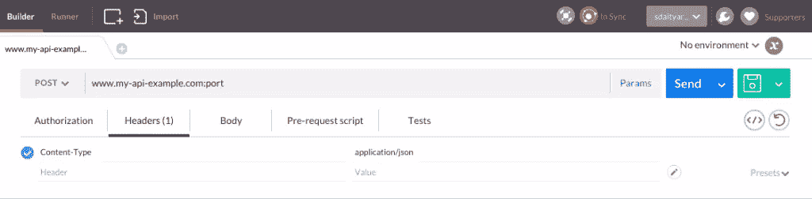
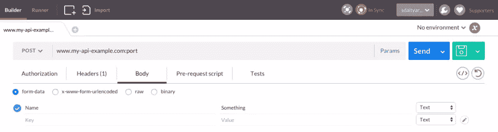
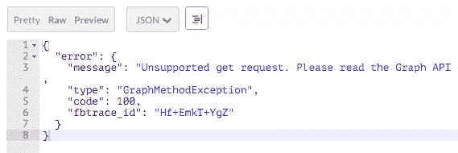
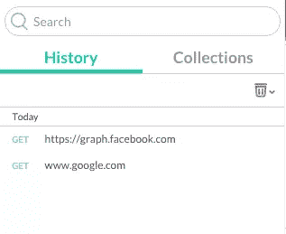
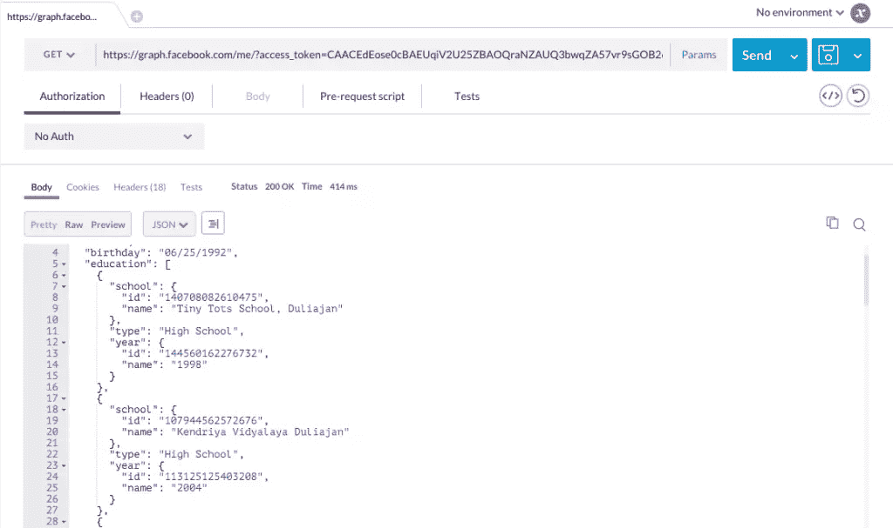
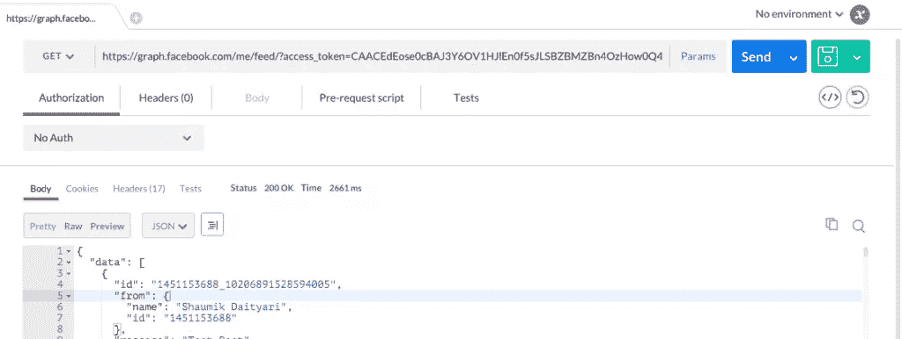
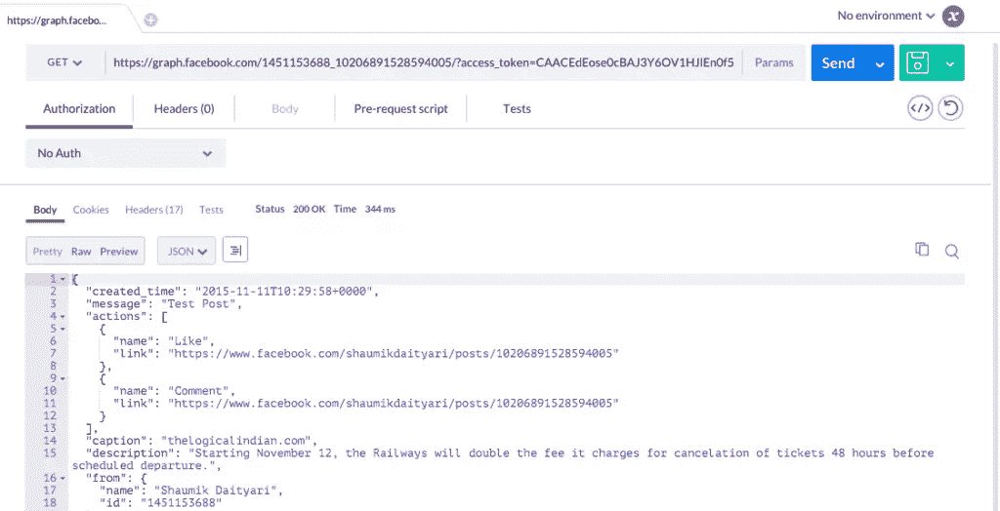
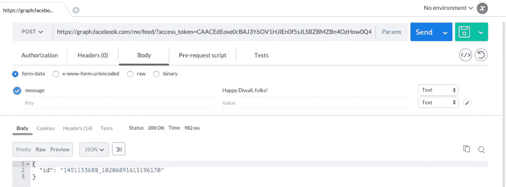
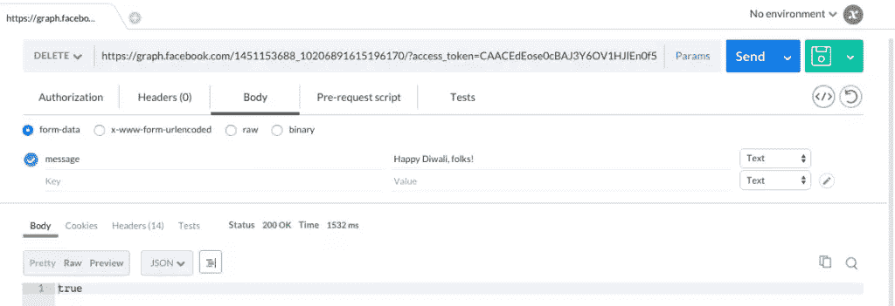

# Postman 简化了 API 构建和测试

> 原文：<https://www.sitepoint.com/api-building-and-testing-made-easier-with-postman/>

*感谢[杰夫·史密斯](https://www.sitepoint.com/author/jeffsmith/)好心帮忙[同行评审](https://www.sitepoint.com/introduction-to-sitepoints-peer-review/)这篇文章。*

* * *

今日 SitePoint 上的热门帖子:

*   [什么是 HTTP/2？](https://www.sitepoint.com/what-is-http2/)
*   [用这三种 CSS 方法驯服不羁的样式表](https://www.sitepoint.com/tame-unruly-style-sheets-three-css-architecture-methodologies/)
*   [你的常规 WordPress 维护清单](https://www.sitepoint.com/regular-wordpress-maintenance-checklist/)
*   [共享服务器托管:利弊](https://www.sitepoint.com/shared-server-hosting/)
*   [为什么每个网站都需要 HTTPS](https://www.sitepoint.com/why-every-website-needs-https/)

* * *


API(应用程序编程接口)是应用程序之间交互的媒介。使用 HTTP 或 HTTPS 的 API 称为 Web APIs。

如果你在互联网上到处看看，大量的服务都使用 API。任何有社交登录的东西都使用 API 电子商务网站的移动应用程序使用 API 甚至你在网上看到的广告也使用 API！

通过为您的服务创建 API，您可以让第三方开发人员基于您的服务创建应用程序。例如，社交报纸 [Frrole](http://frrole.com/) 通过分析大量推文，使用 Twitter API 来生成上下文洞察。

假设您已经评估了创建一个 API 的利弊，让我们简单地谈谈创建和测试 API 的过程。

## 创建 API

尽管创建 API 的方法有很多，但 Web API 是使用 REST(**Re**presentation**S**tate**T**transfer)框架创建的。REST 框架规定了一套创建 API 时必须遵循的准则。由于每天都有大量的 API 被创建，它成为了基于 Web 的 API 的标准。

通过 API 执行的四个最常见的动作是**查看**、**创建**、**编辑**和**删除**对象。REST 框架将四个 HTTP 动词映射到这些动作:`GET`、`POST`、`PUT`和`DELETE`。有很多动词被添加到这个列表中，比如`PURGE`和`PATCH`，但是在这篇文章中，我们将只讨论四个基本的动词。这篇关于实用 RESTful API 的最佳实践的文章，由 Enchant.com 创始人 Vinay Sahni 撰写，可能对第一次开发人员有用。

现在，有许多框架在基本的 HTTP 层上提供了包装器，从而使开发人员的生活更加轻松。你所需要做的就是调用所需的命令或功能，并专注于功能。流行的例子包括 [Slim](http://www.slimframework.com/) 和 [Toro](https://github.com/anandkunal/ToroPHP) ，这两个基于 PHP 的微框架可以帮助你快速创建 REST APIs。

## 通过 CLI 测试 API

创建 API 的主要动机是让其他应用程序(可能是您的或由第三方开发的)能够使用这些服务。因此，在 API 开发过程的每个阶段，一个关键的部分是测试 API 的功能、异常处理和安全性。

使用 API 包括使用一个动词(或方法)对所需资源(通常是一个 URL)的请求。根据您使用的 API 的要求，您可能需要添加头。请求这种资源的一种方法是通过命令行。

在这篇文章中，我们将集中讨论 API 调用的四个部分 URL、HTTP 动词、头和参数。我们将使用 cURL 库通过 CLI 向 API 资源发送请求。cURL 是一个命令行工具，有助于使用 URL 语法传输数据——支持 FTP、FTPS、HTTP 和 HTTPS。

让我们看看下面的命令:

```
curl -i -X POST -H 
    "Content-Type:application/json" 
    http://www.my-api-example.com:port/ -d 
    '{"Name":"Something"}'
```

`-i`命令代表**包含**，它告诉命令请求中存在报头。`-X`选项后面紧跟着 HTTP 动词或**方法**。`-H`指定添加到请求中的定制**头**。最后，`-d`选项指定定制的**表单数据**随请求一起传递。

API 调用的结果是一个 HTTP 响应，通常以 [JSON 格式](https://en.wikipedia.org/wiki/JSON)编码。响应与一个 HTTP 响应代码相关联，该代码给出了关于请求状态的信息(比如 200 表示正常，404 表示资源不存在，500 表示服务器出错，403 表示资源被禁止)。例如，先前的请求可能会导致发送以下响应以及 200 状态代码:

```
{"message":"success","id":"4"}
```

在命令行中测试这样的响应也是一个挑战，尤其是当响应有大量选项时。

Codingpedia 编写的详细指南[中列出了测试 API 时的 CLI 选项列表。](http://www.codingpedia.org/ama/how-to-test-a-rest-api-from-command-line-with-curl/)

## 使用 Postman 简化测试

Postman 是一个 API 开发套件，具有强大的特性，使得 API 开发过程变得快速而轻松。它可以作为 Chrome 扩展和 Mac、Windows 和 Linux 的原生应用程序使用。一百多万开发者已经尝试过了。要安装 Chrome 扩展，你需要先安装 [Chrome](https://www.google.com/chrome/) ，然后前往[Chrome 网上商店的项目页面](https://chrome.google.com/webstore/detail/postman-rest-client-packa/fhbjgbiflinjbdggehcddcbncdddomop?hl=en)。

让我们首先看看如何通过 Postman 模拟我们之前的 CLI 请求。下图显示了在 Postman 中创建 API 调用的过程，包括上面讨论的所有四个部分:





除了预览(如果响应是 HTML 格式的)之外，您通过请求收到的响应也可以以原始或漂亮的形式查看。下图显示了在 Postman 中查看回复的不同方式:



Postman 会自动保存你过去做过的 API 调用，这样在测试 API 的时候可以节省时间。此外，为了方便起见，可以将它们分组到相关的 API 调用中。下面是一个通过 Postman 调用 API 的历史示例:



## 通过 Postman 使用脸书图形 API

演示 Postman 如何工作的一个好方法是通过[脸书图形 API](https://developers.facebook.com/docs/graph-api) 。在这篇文章中，我们将关注用户时间线上的帖子，如何查看帖子的详细信息，以及如何创建和删除帖子。

在使用 Graph API 时，访问令牌是最重要的。有许多权限与令牌相关联。例如，只有在生成令牌时`publish_actions`是所选字段之一，您才可以使用令牌创建帖子。这种额外的安全级别有助于您在通过脸书登录时向给定的应用程序授予特定的操作。

### 查看帖子

要向图形 API 发送请求，您需要[生成一个访问令牌](https://developers.facebook.com/tools/explorer/)。一旦您生成了一个令牌，您应该发送一个`GET`请求到下面的 URL，并将`access_token`作为一个参数:

```
GET /me/
```

下图显示了一个带有您的详细信息的基本图形 API 调用:



您可以通过以下命令检查时间线上的文章列表:

```
GET /me/feed/
```

以下是时间线上帖子列表的详细信息:



要查看单个帖子的详细信息，请使用以下资源:

```
GET /post-id/
```

单个帖子的详细信息如下所示:



### 像一根柱子

要喜欢一个帖子，只需向以下 URL 发送一个`POST`请求(请注意，需要`publish_actions`来喜欢一个帖子):

```
POST /post-id/likes/
```

通过 Postman 发送类似于的<q>请求看起来像这样:</q>


同样，您可以通过向相同的 URL 发送`DELETE`请求来删除赞:

```
DELETE /post-id/likes/
```

### 创建帖子

要创建一个帖子，除了发送`POST`请求之外，还需要发送几个参数。你也需要`publish_actions`来执行这个动作。

您可以将以下选项添加到您的`POST`请求中:

*   `message`:与帖子相关联的消息
*   `link`:外部资源的链接
*   `place`:与岗位关联的地点(类似于<q>签到</q>地点)
*   给任何朋友或页面
*   `privacy`:帖子可见的受众
*   任何现存的脸书邮报

文档解释了所有这些功能的使用。

根据您选择的发送请求的 URL，您可以在您的时间线上或用户、页面、事件或群组的时间线上创建帖子:

```
POST /me/feed/
POST /user-id/feed/
POST /page-id/feed/
POST /event-id/feed/
POST /group-id/feed/
```

让我们试着在我们自己的时间线上发布。如果请求成功，我们将获得创建的文章的 ID。下面是一个使用 Graph API 创建新帖子的示例:



要编辑一篇文章，您需要发送一个`POST`请求(不是`PUT`)到下面的 URL，使用与创建文章相同的参数:

```
POST /post-id/
```

### 删除帖子

就像删除一个赞一样，删除一个帖子需要你发送一个`DELETE`请求到帖子 URL:

```
DELETE /post-id/
```



*注意:我们在这篇文章中已经看到，Postman 有很多有用的特性。从免费版本升级后，还有更多的功能——比如在多个数据值上运行一组 APIs 可用(单个许可证 9.99 美元)。*

## 结论

创建 API 是一项至关重要的任务，它包括许多重要的步骤。Postman 使彻底测试的过程更加容易。截至目前，Postman 似乎很好地解决了一般开发者的问题。然而，它如何随着网络行业中常见的范式转变而演变，还有待观察。

*我们是不是错过了《邮差》的一个重要特点？你使用不同的客户端来测试 API 吗？请在下面的评论中告诉我们。*

## 分享这篇文章