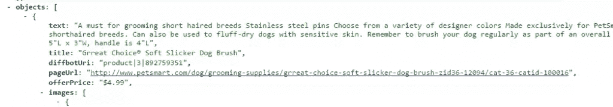
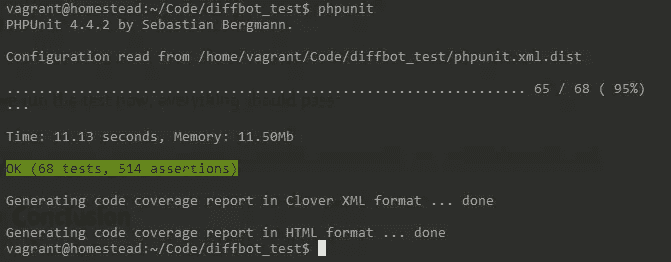

# 带有模拟响应的 API 客户端 TDD

> 原文：<https://www.sitepoint.com/api-client-tdd-mocked-responses/>

在第一部分[和第二部分](https://www.sitepoint.com/starting-new-php-package-right-way/)[中，我们构建了一些非常基本的功能，并使用 TDD 和 PHPUnit 来确保我们的类得到良好的测试。我们还学习了如何测试一个抽象类，以确保它的具体方法有效。现在，让我们继续建设我们的图书馆。](https://www.sitepoint.com/basic-tdd-new-php-package/)


## 赶上

我冒昧地为抽象 API 类的构造函数实现了功能和测试，要求传入 URL。这与我们对 Diffbot 和 DiffbotTest 类所做的非常相似。

我还添加了一些更简单的方法，并使用`__call`将不同的 API 实例化和 API 的定制字段测试到动态设置器和获取器中。这似乎是太琐碎的工作，不能打扰你，因为它高度重复，最终在这一点上是徒劳的，但如果你好奇，请在下面留下评论，我们将在另一篇文章中讨论*第二部分结束>第三部分开始*的差异——你甚至可以区分不同的文件，并在论坛中询问具体的差异，我很乐意尽我所知回答它们，并就它们的设计提出一些建议。此外，我已经将“runInSeparateProcess”指令从整个`DiffbotTest`类转移到只需要一个空静态类的测试中，这将整个测试阶段的持续时间减少到仅仅几秒钟。

如果你刚刚加入我们，请下载[第三部分开始分支](https://github.com/Swader/diffbot-php-client/tree/part3-start)并跟上。

## 数据模拟

我们之前提到过，我们将在这一部分进行数据模拟。这听起来可能更令人困惑，所以请允许我澄清一下。当我们通过 Diffbot 请求一个 URL 时，我们期望得到某个结果。比如，请求一个特定的 Amazon 产品，我们希望获得该产品的解析值。然而，如果我们在测试中依赖这些实时数据，我们将面临两个问题:

1.  测试变慢了 X 倍，其中 X 是从 Amazon 获取数据所需的时间
2.  数据可能会改变并破坏我们的测试。突然，由于返回不同的值，我们之前测试所依赖的一些信息可能会被破坏。

因此，最好是我们离线缓存给定 API 调用的整个响应——头和所有内容——并用它来伪造对 Guzzle 的响应(Guzzle 内置的功能)。通过这种方式，我们可以在测试期间每次给 Diffbot 一个假的，并确保它得到相同的数据，从而给我们一致的结果。Matthew Setter 在[这里](https://www.sitepoint.com/unit-testing-guzzlephp/)之前写了关于用 Guzzle 和 PHPUnit 模拟数据的文章，如果你想看的话。

为了达到我们需要的测试水平，我们将伪造 Diffbot 返回的数据。这难道不意味着我们没有有效地测试 Diffbot 本身，而只是测试我们解析数据的能力吗？确实如此。测试 Diffbot 不是我们的责任——diff bot 的工作人员会这么做。我们在这里测试的是启动 API 调用和解析它们返回的数据的能力——仅此而已。

### 更新主类

首先，我们需要更新 Diffbot 类。我们的 API 子类需要了解令牌，以及我们正在使用的 HTTP 客户端。为了实现这一点，我们将在实例化时在 API 子类中注册 Diffbot 实例。

首先，将以下属性添加到 Api 抽象类中:

```
/** @var  Diffbot The parent class which spawned this one */
    protected $diffbot;
```

然后添加以下方法:

```
/**
     * Sets the Diffbot instance on the child class
     * Used to later fetch the token, HTTP client, EntityFactory, etc
     * @param Diffbot $d
     * @return $this
     */
    public function registerDiffbot(Diffbot $d) {
        $this->diffbot = $d;
        return $this;
    }
```

然后，我们需要稍微更新 Diffbot 类。

将以下内容添加到`Diffbot.php`:

```
// At the top:
use GuzzleHttp\Client;

// As a property:
/** @var Client The HTTP clients to perform requests with */
protected $client;

// Methods:

    /**
     * Sets the client to be used for querying the API endpoints
     *
     * @param Client $client
     * @return $this
     */
    public function setHttpClient(Client $client = null)
    {
        if ($client === null) {
            $client = new Client();
        }
        $this->client = $client;
        return $this;
    }

    /**
     * Returns either the instance of the Guzzle client that has been defined, or null
     * @return Client|null
     */
    public function getHttpClient()
    {
        return $this->client;
    }

    /**
     * Creates a Product API interface
     *
     * @param $url string Url to analyze
     * @return Product
     */
    public function createProductAPI($url)
    {
        $api = new Product($url);
        if (!$this->getHttpClient()) {
            $this->setHttpClient();
        }
        return $api->registerDiffbot($this);
    }

    /**
     * Creates an Article API interface
     *
     * @param $url string Url to analyze
     * @return Article
     */
    public function createArticleAPI($url)
    {
        $api = new Article($url);
        if (!$this->getHttpClient()) {
            $this->setHttpClient();
        }
        return $api->registerDiffbot($this);
    }

    /**
     * Creates an Image API interface
     *
     * @param $url string Url to analyze
     * @return Image
     */
    public function createImageAPI($url)
    {
        $api = new Image($url);
        if (!$this->getHttpClient()) {
            $this->setHttpClient();
        }
        return $api->registerDiffbot($this);
    }

    /**
     * Creates an Analyze API interface
     *
     * @param $url string Url to analyze
     * @return Analyze
     */
    public function createAnalyzeAPI($url)
    {
        $api = new Analyze($url);
        if (!$this->getHttpClient()) {
            $this->setHttpClient();
        }
        return $api->registerDiffbot($this);
    }
```

我们添加了设置客户端的功能，并将其默认为 Guzzle Client 的一个新实例。我们还改进了 API 子类型实例化的直接方法，所有这些方法几乎都是相同的。这是故意的——我们以后可能需要每种 API 类型的特定配置，所以从长远来看，像这样将它们分开对我们有好处。同样，它包含一些相同的代码，我们稍后将使用 PHPCPD (PHP 复制粘贴检测器)检测并修复这些代码。Diffbot 类现在也将自己注入到衍生的 API 类中。

## 工厂和实体

您可能想知道——这难道不是工厂模式的好地方吗？创建一个严格负责创建 API 的对象，仅此而已？当然，可能是这样——但在我看来，这是过度工程化了。Diffbot 类总是返回各种 API 的新实例，因此它通过这些方法执行其功能。同样，我们的图书馆有一个非常具体的目的，从一开始，就打算严重依赖于 Guzzle。抽象太多会让我们迷失在过于简单的事物的复杂性中，浪费我们的时间。Diffbot *是*我们的工厂。

但有一件事它不能也不应该做。我们最终希望这个库能够做的是给我们一个对象，例如一个“产品”对象，用访问器让我们以流畅的、面向对象的方式读取提取和解析的字段。换句话说:

```
// ... set URL etc
$product = $productApi->call();
echo $product->getOfferPrice();
```

这一次，为了实现这一点，我们需要一个工厂。为什么是一个工厂，而不仅仅是让 API 类实例化像“产品”这样的实体呢？因为接触我们的库的人可能希望以不同的方式解析 Diffbot 返回的 JSON 结果——例如，他们可能希望修改输出，使其与他们的数据库匹配，并与直接插入兼容，或者他们可能希望有一种简单的方法将其与他们自己的产品进行比较。

为了能够返回这样的实体，如果它们是可互换的，它们需要一个接口。然而，由于我们知道它们的一些永远在线的功能，让我们做一个抽象。创建`src/Abstracts/Entity.php`:

```
<?php

namespace Swader\Diffbot\Abstracts;

use GuzzleHttp\Message\Response;

abstract class Entity
{
    /** @var Response */
    protected $response;

    /** @var  array */
    protected $objects;

    public function __construct(Response $response)
    {
        $this->response = $response;
        $this->objects = $response->json()['objects'][0];
    }

    /**
     * Returns the original response that was passed into the Entity
     * @return Response
     */
    public function getResponse()
    {
        return $this->response;
    }
}
```

Diffbot API 返回一个带有两个子对象的 JSON 对象:`request`和`objects`，正如登录页面上测试驱动的 JSON 输出所示。Guzzle 的响应消息支持将 JSON 数据输出到数组，但仅此而已。因此，这个类只有一个构造函数，它接受响应对象，然后将“objects”字段的第一个元素(具有有意义数据的元素)绑定到另一个受保护的属性。

为了让工厂可以互换，我们给它一个接口吧。创建`src/Interfaces/EntityFactory.php`:

```
<?php

namespace Swader\Diffbot\Interfaces;

use GuzzleHttp\Message\Response;

interface EntityFactory
{
    /**
     * Returns the appropriate entity as built by the contents of $response
     * 
     * @param Response $response
     * @return Entity
     */
    public function createAppropriate(Response $response);
}
```

现在，我们可以实现它了。创建`src/Factory/Entity.php`:

```
<?php

namespace Swader\Diffbot\Factory;

use GuzzleHttp\Message\Response;
use Swader\Diffbot\Exceptions\DiffbotException;
use Swader\Diffbot\Interfaces\EntityFactory;

class Entity implements EntityFactory
{
    protected $apiEntities = [
        'product' => '\Swader\Diffbot\Entity\Product',
        'article' => '\Swader\Diffbot\Entity\Article',
        'image' => '\Swader\Diffbot\Entity\Image',
        'analyze' => '\Swader\Diffbot\Entity\Analyze',
        '*' => '\Swader\Diffbot\Entity\Wildcard',
    ];

    /**
     * Creates an appropriate Entity from a given Response
     * If no valid Entity can be found for typoe of API, the Wildcard entity is selected
     *
     * @param Response $response
     * @return \Swader\Diffbot\Abstracts\Entity
     * @throws DiffbotException
     */
    public function createAppropriate(Response $response)
    {
        $this->checkResponseFormat($response);

        $arr = $response->json();
        if (isset($this->apiEntities[$arr['request']['api']])) {
            $class = $this->apiEntities[$arr['request']['api']];
        } else {
            $class = $this->apiEntities['*'];
        }
        return new $class($response);
    }

    /**
     * Makes sure the Diffbot response has all the fields it needs to work properly
     *
     * @param Response $response
     * @throws DiffbotException
     */
    protected function checkResponseFormat(Response $response)
    {
        $arr = $response->json();

        if (!isset($arr['objects'])) {
            throw new DiffbotException('Objects property missing - cannot extract entity values');
        }

        if (!isset($arr['request'])) {
            throw new DiffbotException('Request property not found in response!');
        }

        if (!isset($arr['request']['api'])) {
            throw new DiffbotException('API property not found in request property of response!');
        }
    }
}
```

这是我们基本的实体工厂。它检查响应是否有效，然后基于该响应创建一个实体，将响应推入其中，并返回它。如果它找不到有效的实体(例如，响应中的“api”字段与`apiEntities`属性中定义的键不匹配)，它会选择一个通配符实体。稍后，我们甚至可以选择升级这个工厂，使其能够更改部分或所有的`apiEntities`对，这样用户就不必为了尝试不同的实体而编写一个全新的工厂，但是现在让我们先这样做。当然，工厂类也需要测试。要查看测试，请参考帖子底部 Github-link 上的源代码。

最后，我们需要建立一些实体，否则一切都是徒劳。首先，创建`src/Entity/Product.php`。我们可以从我们的产品 API 调用中得到什么？让我们来看看。



只关注“object”属性中的“根”值，我们可以看到我们立即获得了标题、文本、可用性、报价和品牌等。我们可以在这里使用类似于`__call` magic 方法的东西来自动辨别我们在数组中寻找什么，但是为了清楚起见，IDE 自动完成，以及额外解析的可能性，让我们手动进行。让我们现在就建立这几个，我会把剩下的留给你作为练习。如果你想看看我是怎么完成的，可以参考文章末尾的源代码。

```
<?php

namespace Swader\Diffbot\Entity;

use Swader\Diffbot\Abstracts\Entity;

class Product extends Entity
{
    /**
     * Checks if the product has been determined available
     * @return bool
     */
    public function isAvailable()
    {
        return (bool)$this->objects['availability'];
    }

    /**
     * Returns the product offer price, in USD, as a floating point number
     * @return float
     */
    public function getOfferPrice()
    {
        return (float)trim($this->objects['offerPrice'], '$');
    }

    /**
     * Returns the brand, as determined by Diffbot
     * @return string
     */
    public function getBrand()
    {
        return $this->objects['brand'];
    }

    /**
     * Returns the title, as read by Diffbot
     * @return string
     */
    public function getTitle()
    {
        return $this->objects['title'];
    }
}
```

您可以看到，一个潜在的好选择是在产品实体中实现一个货币转换器，甚至支持注入不同的转换器。这将允许用户用非默认货币读回商品价格。

自然，产品实体也需要测试。为了简洁起见，我会在文章的最后给你提供源代码。

最后，我们需要将 EntityFactory 添加到 Diffbot 实例中，类似于我们对 Guzzle 客户端所做的:

```
/**
     * Sets the Entity Factory which will create the Entities from Responses
     * @param EntityFactory $factory
     * @return $this
     */
    public function setEntityFactory(EntityFactory $factory = null)
    {
        if ($factory === null) {
            $factory = new Entity();
        }
        $this->factory = $factory;
        return $this;
    }

    /**
     * Returns the Factory responsible for creating Entities from Responses
     * @return EntityFactory
     */
    public function getEntityFactory()
    {
        return $this->factory;
    }
```

不要忘记添加`factory`受保护的属性:

```
/** @var  EntityFactory The Factory which created Entities from Responses */
    protected $factory;
```

现在，让我们谈论更多关于嘲弄资源的事情。

### 创建模拟

创建用于 Guzzle 的模拟响应文件非常简单(而且是测试我们的类所必需的)。它们需要看起来类似于[这个](https://github.com/sitepoint-examples/GuzzleTesting/blob/master/tests/mock/responses/response1)——只是用 JSON 主体代替 XML。这很容易用 cURL 来实现。首先，创建文件夹`tests/Mocks/Products`。使用终端输入，并执行以下命令:

```
curl -i "http://api.diffbot.com/v3/product?url=http%3A%2F%2Fwww.petsmar t.com%2Fdog%2Fgrooming-supplies%2Fgrreat-choice-soft-slicker-dog-brush-zid36-12094%2Fcat-36-catid-100016&token =demo&fields=saveAmount,mpn,prefixCode,meta,sku,queryString,saveAmountDetails,shippingAmount,productOrigin,regularPriceDetails,offerPriceDetails" > dogbrush.json
```

打开`dogbrush.json`文件将显示响应的全部内容——包括标题和正文。

### 测试呼叫

现在我们有了我们的`dogbrush`响应，并且我们所有的类都准备好了，我们可以用它来测试产品 API。为此，我们需要开发`call`方法。一旦调用被执行，我们期望得到 Diffbot 解析的一些值，并且我们期望它们是正确的。

我们从测试开始。编辑`ProductApiTest.php`如下所示:

```
<?php

namespace Swader\Diffbot\Test\Api;

use GuzzleHttp\Client;
use GuzzleHttp\Subscriber\Mock;
use Swader\Diffbot\Diffbot;

class ProductApiTest extends \PHPUnit_Framework_TestCase
{

    protected $validMock;

    protected function getValidDiffbotInstance()
    {
        return new Diffbot('demo');
    }

    protected function getValidMock(){
        if (!$this->validMock) {
            $this->validMock = new Mock(
                [file_get_contents(__DIR__.'/../Mocks/Products/dogbrush.json')]
            );
        }
        return $this->validMock;
    }

    public function testCall() {
        $diffbot = $this->getValidDiffbotInstance();

        $fakeClient = new Client();
        $fakeClient->getEmitter()->attach($this->getValidMock());

        $diffbot->setHttpClient($fakeClient);
        $diffbot->setEntityFactory();

        $api = $diffbot->createProductAPI('https://dogbrush-mock.com');

        /** @var Product $product */
        $product = $api->call();

        $targetTitle = 'Grreat Choice® Soft Slicker Dog Brush';
        $this->assertEquals($targetTitle, $product->getTitle());
        $this->assertTrue($product->isAvailable());
        $this->assertEquals(4.99, $product->getOfferPrice());
        $this->assertEquals('Grreat Choice', $product->getBrand());
    }

}
```

我们首先获得一个有效的 Diffbot 实例，用我们以前下载的响应创建并注入一个假的 Guzzle 客户端。我们设置实体工厂，在我们调用`call`之后，我们期望返回一个特定的标题。如果这个断言不成立，测试将失败。我们还测试其他已知真实值的属性。

现在我们需要开发`call`方法。它对我们所有的 Api 都是一样的(它们本质上都做同样的事情——对给定 URL 的远程请求)，所以我们把它放入抽象 Api 类:

```
public function call()
    {
        $response = $this->diffbot->getHttpClient()->get($this->buildUrl());
        return $this->diffbot->getEntityFactory()->createAppropriate($response);
    }
```

你可以看到我们在使用一种`buildUrl`方法。这个方法将使用一个 API 的所有定制字段来增强一个默认 URL，并将这些字段与请求一起传递，以便返回我们所请求的附加值。

首先，我们在 ProductApiTest 中为它编写一些测试，这样我们就知道构建对于给定的 API 类型是有效的:

```
public function testBuildUrlNoCustomFields() {
        $url = $this
            ->apiWithMock
            ->buildUrl();
        $expectedUrl = 'http://api.diffbot.com/v3/product/?token=demo&url=https%3A%2F%2Fdogbrush-mock.com';
        $this->assertEquals($expectedUrl, $url);
    }

    public function testBuildUrlOneCustomField() {
        $url = $this
            ->apiWithMock
            ->setOfferPriceDetails(true)
            ->buildUrl();
        $expectedUrl = 'http://api.diffbot.com/v3/product/?token=demo&url=https%3A%2F%2Fdogbrush-mock.com&fields=offerPriceDetails';
        $this->assertEquals($expectedUrl, $url);
    }

    public function testBuildUrlTwoCustomFields() {
        $url = $this
            ->apiWithMock
            ->setOfferPriceDetails(true)
            ->setSku(true)
            ->buildUrl();
        $expectedUrl = 'http://api.diffbot.com/v3/product/?token=demo&url=https%3A%2F%2Fdogbrush-mock.com&fields=sku,offerPriceDetails';
        $this->assertEquals($expectedUrl, $url);
    }
```

下面是完整的方法:

```
protected function buildUrl()
    {
        $url = rtrim($this->apiUrl, '/') . '/';

        // Add Token
        $url .= '?token=' . $this->diffbot->getToken();

        // Add URL
        $url .= '&url='.urlencode($this->url);

        // Add Custom Fields
        $fields = static::getOptionalFields();
        $fieldString = '';
        foreach ($fields as $field) {
            $methodName = 'get' . ucfirst($field);
            $fieldString .= ($this->$methodName()) ? $field . ',' : '';
        }
        $fieldString = trim($fieldString, ',');
        if ($fieldString != '') {
            $url .= '&fields=' . $fieldString;
        }

        return $url;
    }
```

如果我们现在运行测试，一切都会通过:



## 结论

在这一部分，我们做了更多的 TDD，朝着完成的方向前进。由于关于测试的内容非常广泛，我决定在这里把故事缩短。我们应该明确地测试自定义字段是否工作，好的 URL 是否被建立，等等——你可以测试的领域几乎是无限的，但是它会不必要地延长教程，超出一个人的注意力范围。你总能在 Github 上看到完全完成的结果[。然而，如果你有兴趣阅读关于其余逻辑的教程，请让我知道，我会尽力一点一点地继续解释。](https://github.com/Swader/diffbot-php-client)

不要忘记将其他实体和测试作为“作业”来实现！这看起来像是浪费时间，但我保证，最终你会爱上安全测试的。同样，如果你对改进我的方法有任何想法，我总是乐于学习新的东西，并乐意看看拉请求和建设性的反馈。

在下一个也是最后一个部分中，我们将把我们的包部署到 Packagist.org，这样每个人都可以通过 Composer 随意安装它。

## 分享这篇文章