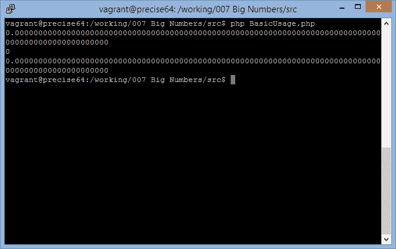
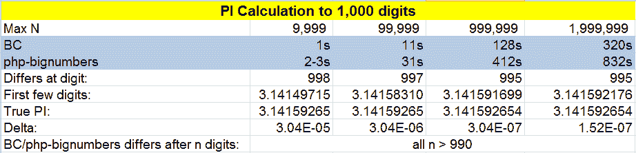
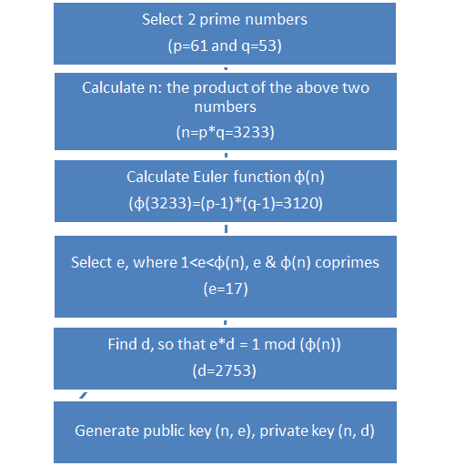
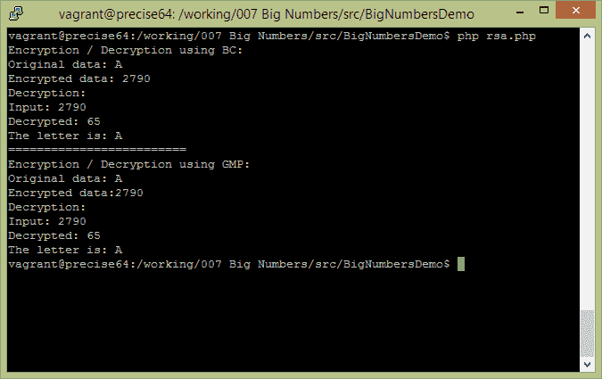

# PHP 中的任意精度和大数

> 原文：<https://www.sitepoint.com/arbitrary-precision-big-numbers-php/>

数学问题和应用总是会触发我。最近我刚读完一本史蒂芬·霍金的书《上帝创造了整数》，能够和历史上那些伟大的数学家“交谈”让我兴奋不已。这是我决定写这个话题的主要原因。

在本文中，我们将通过回顾 3 个 PHP 模块来回顾 PHP 提供任意精度数字计算/大整数计算的能力: [GMP](http://www.php.net/manual/en/book.gmp.php) 、 [BC Math](http://www.php.net/manual/en/book.bc.php) 和[PHP-bignomes](https://github.com/Litipk/php-bignumbers)。我们将展示两个真实世界的例子，以了解每个例子的功能和局限性。第一个是计算任意精度的圆周率——为了本文的目的，我们将精度限制在，比如说，1000 位；第二个是 RSA 加密/解密的简单演示。

让我们开始吧。

### 准备

要获得 GMP PHP 模块，只需在任何 Unix 系统上的终端中发出以下命令(或者在 Windows 系统上手动安装-但是请[使用流浪汉](https://www.sitepoint.com/build-virtual-machines-easily-puphpet/)！):

> 安装 php5-gmp

`php-bignumbers`由[作曲](http://getcomposer.org/)发行。添加需求后，创建一个`composer.json`文件并运行`php composer.phar install`。PHP-bignumbs Github 站点提供了如何编写`composer.json`文件的详细信息。

BC 通常是预装并启用的。

安装完成后，我们可以通过编写一个简单的 PHP 脚本并在终端中运行它来测试一切是否正常:

```
<?php // Below is to test php-bignumber lib require_once 'vendor/autoload.php';  // Required for autoload  use \Litipk\BigNumbers\Decimal as  Decimal; $one =  Decimal::fromInteger(1); $two=  Decimal::fromInteger(2); $three=Decimal::fromInteger(3); $seven =  Decimal::fromString('7.0'); $a=$one->div($seven,  100);  // Should display something like 0.142857142857 .....and the last digit is 9 in consideration of rounding up the 101th digit. 
$b=$two->div($seven,  100); $c=$three->div($seven,  100); echo ($c->sub(($a->add($b))));  //Displays 0.00000... to the last digit echo "\n";  // Now we test GMP echo gmp_strval(gmp_div("1.0",  "7.0"));  //Displays 0\. Not really useful! echo "\n";  // Now we test BC $oneseven=bcdiv('1',  '7',  100);  // Should display something like 0.142857142857 .....but note the last digit is 8, not 9. $twoseven=bcdiv('2','7',  100); $threeseven=bcdiv('3','7',  100); echo bcsub(bcadd($oneseven, $twoseven,100), $threeseven,  100);  // Displays 0.000000000... to the last digit echo "\n";
```

上面的代码将输出如下:



在第一个和第三个输出中(分别使用 php-bignumbers 和 BC)，它们是相同且准确的(1/7+2/7-3/7=0)。

对于 GMP，它只处理大整数，不提供任意精度的浮点数计算方法，所以它说 1/7=0，这是一个整数除以另一个整数的结果。为此，我不会使用 GMP 进行任意精度演示(PI 计算)，只会在 RSA 演示中使用。

### 三个图书馆的简要比较

php-bignumber:

*   新的，正在开发中；
*   面向对象；
*   更多的输入来创建一个数字；
*   有限的运算符和函数(在撰写本文时，它缺少`pow`函数和所有其他重要的数学函数族，如三角学、阶乘等)；
*   提供任意精度的能力，这正是我们所需要的。

公元前:

*   成熟、预装、启用；
*   不是面向对象的；
*   10 个可用函数，缺失所有函数为 php-bignumber，除了`pow`，缺失 log/ln；
*   提供任意精度的能力，这正是我们所需要的。

GMP:

*   成熟，易安装；
*   不是面向对象的；
*   超过 40 个函数可用，但都集中在整数操作；
*   为整数提供任意精度，不完全是我们想要的。

理论上，如果提供了+-*/的话，模拟数字的其他操作实际上是没有限制的。扩展 php-bignumbers 可能比扩展其他两个更容易。所以我很期待 php-bignumbers 的作者以后能加入更多的函数。

如果我们只处理整数，特别是不怎么处理除法(或者至少，正如我们在 RSA 演示中看到的，我们对商和余数更感兴趣)，所有 3 个库都是很好的候选库，GMP 可能更好，因为它提供了最多的函数。但是如果我们决心得到一个任意精度的浮点结果，GMP 就不在考虑范围之内，我们将依赖于 BC 和 PHP-bignomes。

现在，让我们进入真实世界的演示。

### 计算 PI

圆周率作为一个无理数，它的值可以无限计算到任意位数。圆周率的计算本身在测试 PC 的速度和测试算法的优化方面是有用的。

由于这个计算涉及浮点数，我们将使用 BC 和 php-bignumbers。对于这两个程序，我们将使用最简单的方法来计算圆周率:

`π^2/6=1+1/4+1/9+......+1/(2n-1)^2`

这不是计算圆周率最快的方法，因为它的[收敛速度](http://en.wikipedia.org/wiki/Rate_of_convergence)有点慢，但没关系。

为了测试这两个库的速度，我们将设置一个秒表。我知道这是一个漫长的过程，我将使用 PHP 内置的`time`函数来获取时间戳并计算差异——我现在可以告诉你，差异是显而易见的。我们还将比较两个结果是否相同(不够接近，但相同)。

上述公式中使用的最大`n`将被设置为 1，999，999。这是为了避免花太多时间在我的电脑上完成计算。

此外，为了避免额外的函数调用开销，我们不会使用任何额外的用户函数。这可能会产生一些多余的行，但让我们忍受它。

我在计算中做了一些基本的优化。欢迎更多优化建议！

代码(以及后面显示的 RSA 代码)已经上传到 Github。

我已经用不同的`n`测试了性能(在速度和准确性方面),下表显示了总结:



坦白说，这个结果真的让我很失望。将最大 N 设置为 200 万，与实际的圆周率相比，我们只能达到小数点后第 6 位的精度(3.141592)。但这是由于算法本身的收敛速度。

两种方法(BC 和 php-bignumbers)都展示了结果的高度一致性:对于 1000 位以上的数字，它们只在第 990 位之后有所不同。这相当于 10E-990 的差异，这足以让我们对其输出的同一性有相同的置信度。换句话说，给定相同的算法，这两个库给出“相同”的结果。

然而，速度差距很大。粗略算来，BC 只需要 php-bignumbers 的 1/3 时间。我相信这是因为 PHP-bignomes 库在 OO 相关的处理上花费了大量的开销。

两个 libs(还有 GMP)都在内部使用字符串来存储任意精度的数字，方法是将字符串形成我们指定的数字。字符串操作也会降低性能。还有一个事实是，BC 是在低级编写和执行的——用 C——而 bignumbers 只是一个高级 PHP 库。

如果我们将精度降低到 100 位，所用的时间将大大缩短。当 n=999，999 时，BC 和 php-bignumbers 分别需要 15 秒和 85 秒，输出的准确性仍然保持不变。两个 lib 的结果将不同于 100+位中的第 95 位。我们仍然可以放心地说它们是相同的。

所以建议是，现阶段还是推荐 BC。它提供相同的精度，但速度更快。为了节省进行这种任意精度计算的时间，强烈建议设置较低的精度。如果比例是 1/10，时间大约是 1/10 (1000 位数需要 128 秒，而 BC 的 100 位数需要 15 秒。对于 php-bignumbers，虽然只有 1/5)。

为了将我们的讨论发挥到极致，我插入了几行代码，看看如果我们不依赖任何库，只使用内置的浮点数，结果会是怎样。

结果是惊人的。当 n 设置为 999，999 时，内置浮点数给出的结果是 3.1415916986586，与我们从 BC (3.1415916986595…)中可以得到的结果几乎相同。但是你猜怎么着？它几乎瞬间完成！

因此，我的结论是:如果我们真的不关心第 10 位及以上的数字，我们可能根本就不应该使用任何任意的库。

### RSA 演示

RSA 加密曾经非常受信任，但最近的一条新闻将它置于聚光灯下，指责 RSA 可能与 NSA 合作，在 RSA 的加密算法中植入后门([此处](http://www.reuters.com/article/2013/12/20/us-usa-security-rsa-idUSBRE9BJ1C220131220))。尽管如此，算法本身还是值得在这里讨论的。

对 RSA 的详细描述超出了本文的范围。感兴趣的可以参考[其 WIKI 页面](http://en.wikipedia.org/wiki/RSA_%28algorithm%29)进行详细解释。我们将只说明我们编写的实现 RSA 加密和解密的代码。

**注:**下面的代码和步骤说明是受[这篇文章](http://www.ruanyifeng.com/blog/2013/07/rsa_algorithm_part_two.html)的启发，由中国程序员阮先生用中文写的。

我们的 RSA 演示的准备工作如下所示:



我们不会讨论生成这些数字背后的算法。到目前为止，我们只需要知道经过这些步骤产生/选择了 6 个数字:p，q，n，φ(n)，e，d，我们还知道公钥产生为(3233，17)，私钥产生为(3233，2753)。

加密一个数字(字符串应逐字符转换为 ASCII 或 Unicode)是在以下计算中查找`c`的过程中完成的:

`m^e = c (mod n), and m<n`

也就是求`m^e`除以`n`的余数。

假设我们想要加密字母‘A’；它的 ASCII 码是 65，那么:

`65^17 = 2790 (mod 3233)`

所以`c` =2790。我们可以将 2790 发送给我的合作伙伴，他将使用私钥(3233，2753)来解密它。(实际上，我们将从我的合作伙伴那里接收公钥，而他将自己保留私钥。)

解密将类似于解决以下问题:

`c^d=m (mod n)`

也就是求`c^d`除以`n`的余数(`m`)。因此，

`2790^2753 = 65 (mod 3233)`

就是这样！我朋友解密了我的消息(`2790`)得到`65`，正好是‘A’的 ASCII 码！

完成这个过程的 PHP 程序如下所示。我先用 BC，然后用 GMP:

```
<?php

$letter =  'A'; $m = ord($letter);  // ASCII code of letter 'A' $d =  2753; $e =  17; $n =  3233; echo "Encryption / Decryption using BC:\n"; $c = bcmod(bcpow($m, $e,  40), $n); $res = bcmod(bcpow($c, $d,  40), $n); echo "Original data: $letter\n"; echo "Encrypted data: $c\n"; echo "Decryption:\n"; echo "Input: $c\n"; echo "Decrypted: $res\n"; echo "The letter is: ".chr($res)."\n"; echo "=========================\n"; echo "Encryption / Decryption using GMP:\n"; $c = gmp_powm($m, $e, $n); $res = gmp_powm($c, $d, $n); echo "Original data: $letter\n"; echo "Encrypted data:".gmp_strval($c)." \n"; echo "Decryption:\n"; echo "Input: ".gmp_strval($c)."\n"; echo "Decrypted: ".gmp_strval($res)."\n"; echo "The letter is: ".chr(gmp_strval($res))."\n";
```

结果显示在下面的屏幕截图中:



BC 和 GMP 在这个演示中表现同样出色。加密和解密同样快速，并且瞬间完成。由于 RSA 算法只涉及大整数，因此精度保持得很好。

这里没有展示的是两个库都可以处理非常大的数字的能力。例如，在我们的解密过程中，我们计算了一个非常大的数(2790^2753，这是一个 9486 位的数)！

上面的演示当然不能真正作为一个正经的 RSA 程序。密钥的长度(二进制表示的长度为 3233)只有 12。在实际使用中，长度通常应该设置为 1024 位，或者对于特别敏感的信息，长度应该设置为 2048 位。

### 结论

在本文中，我们回顾了提供大整数和/或任意精度计算功能的 3 个库:BC Math、GMP、PHP-bignomes。

作者建议使用 BC Math，因为它支持整数和浮点数，而且运行速度也很快。或者，如果我们只关心前 10 位或更少，我们可以选择依赖 PHP 内置的浮点数。

作为本文的结尾，我将使用上面的 RSA 配置显示一条加密的消息。如果你能解密就告诉我！(Github 中也包含了解密以下序列的代码)

消息是这样的:

1486 1992 745 2185 2578 1313 1992 884 2185 1992 281 2185 2235 884 2412 3179 2570 2160 884 1313 1992 884 2185 1992 2680 3179 884 1313 612 2185 3179 2235 884 1853

## 分享这篇文章