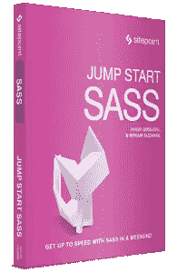
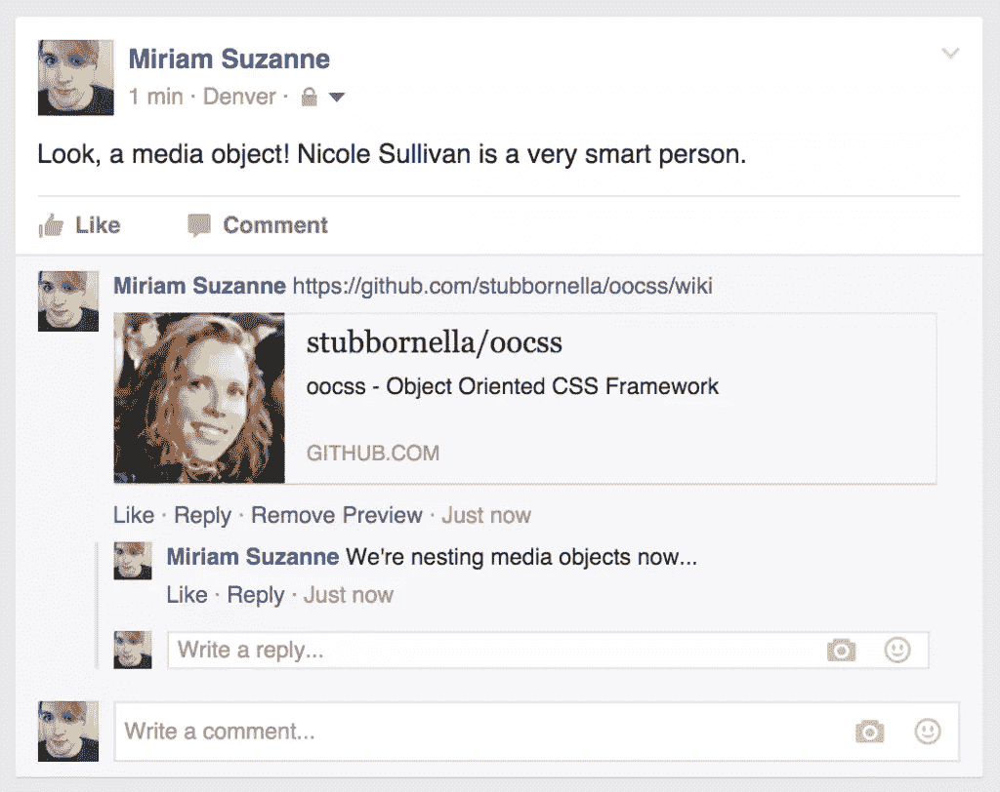
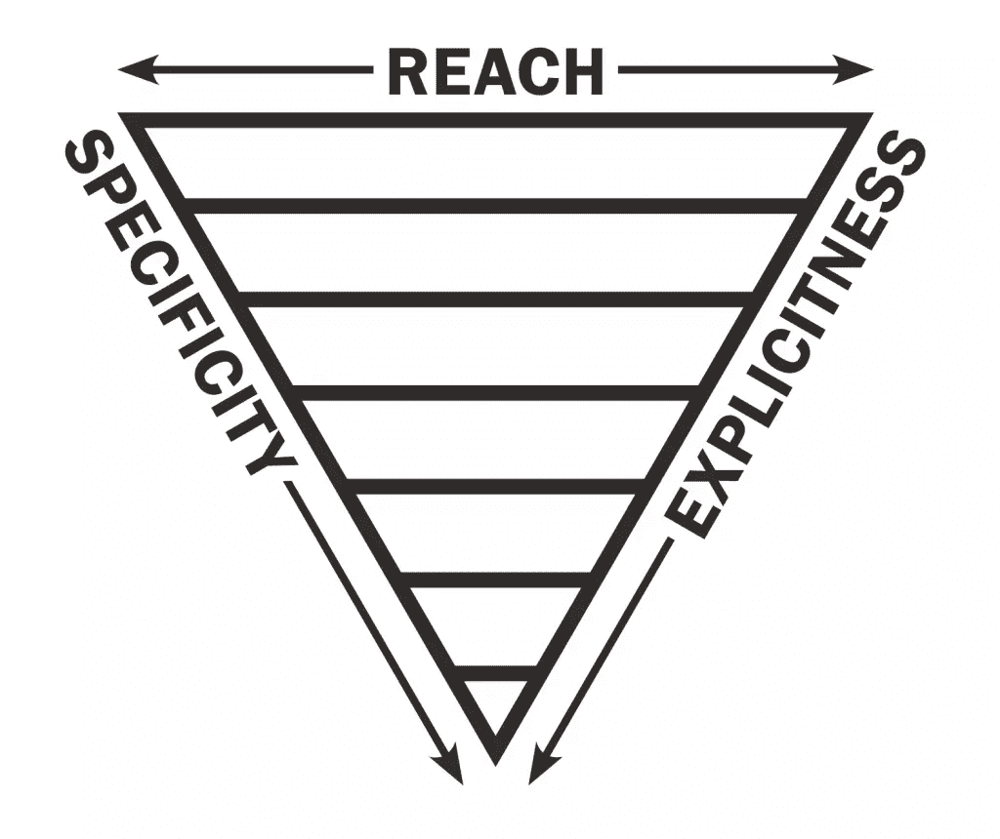
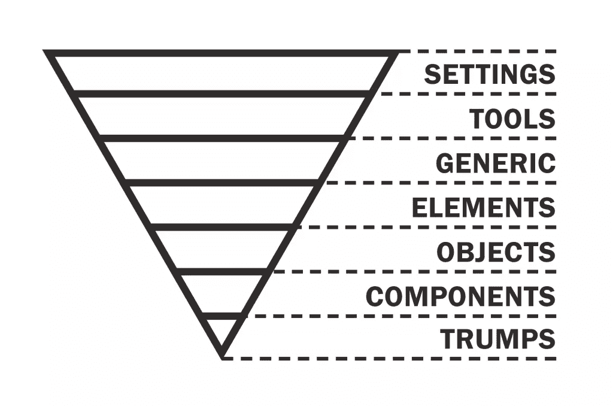

# 快速启动 Sass:Sass 中的架构

> 原文：<https://www.sitepoint.com/architecture-in-sass/>



*以下是我们最近出版的书的简短摘录， [Jump Start Sass](https://www.sitepoint.com/premium/books/jump-start-sass) ，免费提供给 [SitePoint Premium 会员](https://www.sitepoint.com/premium/join)。印刷版在世界各地的商店都有出售，或者你可以在这里[订购](http://shop.oreilly.com/product/9780994182678.do)。我们希望你喜欢这个摘录，并发现它很有用。*

架构一直是 CSS 开发中的主要难点之一。如果没有任何变量、控制指令、宏或对象继承，CSS 代码往往会很长且重复——一个不断增长的文件。虽然在技术上可以将普通的 CSS 分割成多个用`@import`相互引用的文件，但是额外的 HTTP 请求使得这个解决方案很糟糕。正如您所看到的，Sass 对架构难题的每一部分都有一个答案——但是把它们放在一起的最佳方法是什么呢？

问十个专家，你会得到十个不同的答案——其中大部分涉及(或借助)Sass。 [OOCSS](https://github.com/stubbornella/oocss/wiki) 、 [SMACSS](https://smacss.com/) 、[原子设计](http://patternlab.io/)、 [ITCSS](http://technotif.com/manage-large-css-projects-with-itcss/) 、 [BEM](https://en.bem.info/) 都是 CSS 架构的热门系统，但还有很多。如果你使用前端框架，如 [Bootstrap](http://getbootstrap.com/) 或 [Foundation](http://foundation.zurb.com/) ，可能已经内置了一些架构观点。

这些都是可靠的系统，没有一个是按照你的项目设计的。CSS 架构很难，所以相信任何一刀切的解决方案都是错误的。没有对每个项目的每个团队都有效的“正确”答案。我们建议把它们都学会，然后把最好的部分混合在一起，创建一个适合你的系统。

让我们从对构建模块的广泛讨论开始，然后看看如何将它们组合在一起。

## 多个文件和文件夹

将代码分成多个文件是使用预处理器的一个主要优势，并且构成了任何架构的基础。有了 Sass，将您的代码分解成最小的逻辑单元并组织到多个文件和文件夹中是没有坏处的。我们建议充分利用它。

Sass 在 CSS `@import`规则上赋予了新的能力，允许您在编译期间组合 Sass 和 CSS 文件，这样它们就可以作为单个文件发送到浏览器。这是 Sass 唯一触及现有 CSS 指令的地方，因此它在 Sass 中的行为与在 CSS 中不同。

### CSS 导入

如上所述，CSS `@import`指令允许您从一个 CSS 文件引用另一个 CSS 文件。导入由浏览器处理，需要额外的 HTTP 请求——因为导入文件必须在发现`@import`指令之前进行解析。如果你有一个互相导入的文件链，这些导入将按顺序进行，直到所有的 CSS 都被加载后才能呈现文档。出于这个原因，大多数人完全避免 CSS 导入。

使用 CSS 导入，您可以使用相对或绝对路径引用另一个 CSS 文件，甚至为条件导入添加媒体查询规则。尽管 Sass 在相同的 at-rule 下提供不同的功能，但是在许多情况下，Sass 会退回到普通的 CSS 输出，例如:

*   导入文件的扩展名为`.css`

*   文件名以`http://`或`https://`开头

*   文件名是一个`url(..)`函数

*   `@import`有任何媒体疑问

以下内容将编译成标准 CSS 导入，即使在 Sass 中也是如此:

```
@import 'relative/styles.css';
@import 'http://absolute.com/styles.css';
@import url('landscape.css') screen and (orientation: landscape);
```

### Sass 进口和部分

Sass 导入看起来类似于 CSS 导入，但是导入的文件被编译成一个单独的输出文件，就像它们的内容(包括变量、混合、函数和占位符)在编译之前被复制并粘贴到适当的位置一样。这种类型的 Sass 导入只适用于带有的文件。萨斯或。scss 扩展名，但是您可以在导入时关闭该扩展名(只要没有名称相似的文件)。事实上，为了简单起见，我们建议尽可能地删除这个扩展。也可以在一个命令中导入多个文件，或者将文件导入嵌套上下文:

```
// Import an explicit file relative to the current directory
@import 'path/to/explicit.scss';

// Import a file with either the .sass or .scss extension
@import 'implicit';

// Import multiple files...

@import 'path/to/emory.scss', 'miko', 'path/to/gracie';

// Import a file into a nested context...
// (imagine the file copied and pasted into this context)
.latte {
  @import 'espresso';
}
```

Sass 导入最常见的用途是用于 **部分** 文件——Sass 文件本身并不编译，而是用于导入到其他文件中。如果您希望 Sass 文件在导入之前保持未编译状态，请在文件名的开头添加一个下划线( _ )。以 _ 开头的 Sass 文件不会自己编译，但是可以导入到其他文件中。导入分音时，Sass 允许您关闭 _ ，这类似于关闭扩展名。例如:

```
// _authors.scss
.miriam { background: blue; }

// jumpstartsass.scss
@import 'authors'; // Shorthand for importing '_authors.scss'

// jumpstartsass.css (compiled CSS)
.miriam { background: blue; }
```

在这个目录下运行 Sass(`sass --update .`)编译 jumpstartsass.scss 到jumpstartsass . CSS；但是，它不会创建一个 _authors.css 文件，因为它有一个前导下划线。

Sass 部分构成了任何 Sass 架构的基础。因为所有的 Sass 导入都是在编译时处理的，不会中断浏览器，所以使用尽可能多的部分是非常安全的(也是推荐的),将它们编译成一个样式表用于生产。为了便于组织，我们建议将部分内容随意分解，分类到文件夹中，然后全部导入到一个主文件中进行编译。项目的通用 Sass 目录可能如下所示:

```
sass/
|
|– config/
|   |– _colors.scss      # Color palettes
|   |– _webfonts.scss    # Webfont information
|   …                    # Etc.
|
|– layout/
|   |– _navigation.scss  # Navigation
|   |– _banner.scss      # Site Banner
|   …                    # Etc.
|
|– modules/
|   |– _calendar.scss    # Calendar widget styles
|   |– _contact.scss     # Contact form styles
|   …                    # Etc.
|
|– patterns/
|   |– _buttons.scss     # Buttons
|   |– _dropdown.scss    # Dropdown
|   …                    # Etc.
|
|- main.scss             # The primary Sass file to be compiled
```

在组织好所有的片段后，可以将它们导入到单个主 main.scss 文件中进行编译:

```
// Primary Sass File: main.scss
@import 'config/colors';
@import 'config/webfonts';

@import 'patterns/buttons';
@import 'patterns/dropdown';

@import 'layout/navigation';
@import 'layout/banner';

@import 'modules/calendar';
@import 'modules/contact';
```

## 组件和组织

我们建议您使用片段、文件夹和导入，但真正重要的是如何有效地使用它们。这就是大家意见不一的地方，你的里程可能会有所不同。

大多数 CSS 和 Sass 组织系统都是基于一些用户界面“组件”的概念，或者可以放在一起形成一个完整项目的离散部分。组件可以是任何大小或形状，但它们应该以可重用的方式独立完成一项任务。按钮、下拉菜单、日历和搜索表单都是可以在项目的不同位置重用的组件的例子。将您的项目视为组件的集合将有助于您拥有一个有组织的、可维护的架构，无论您使用的是 Sass 还是普通 CSS。

由于 CSS 的工作方式，代码的顺序也会影响其含义:后面的代码在级联中优先于前面的代码。一些流行的品牌架构(你知道名字的那些)试图完全消除级联的这个特性，但是我把它作为一个指南——从最一般的到最具体的组织代码——所以优先级覆盖是有意义的。我们希望在整个站点中普遍应用的代码应该首先出现，随着我们向更独特的组件和特殊情况发展，在特异性和细节方面慢慢增长。

在我使用 Sass 之前，我第一次从 2008 年娜塔莉·唐恩精彩的 [CSS 系统](http://www.slideshare.net/nataliedowne/css-systems-presentation)演讲中了解到这种方法。她当时的体系结构从按“类型”分组的元素(`h2`、`ol`、`ul`等等)开始，然后是按创建的“效果”分组的类，最后是按它们影响的“组件”分组的 id。现在普遍的做法是完全避免使用 IDs，将元素分成更小的部分，但是概念是一样的:首先是全局默认，然后是站点范围的模式和广泛的布局，最后是更具体的模块、主题和覆盖。

Sass 项目包括 CSS 中没有的另一类站点范围的默认设置:没有任何输出的代码——比如变量、函数和 mixin 定义。许多人(包括我自己)将这些代码分解成自己的片段集，并导入到任何可能有用的地方。我有一个完整的文件夹，专门存放不产生输出的站点范围的 Sass 助手和配置。这些文件作为一个单一的、确定的、可重用的配置，定义了项目的边界。通过确保您的配置是无输出的，您可以将其导入到任何地方，而不用担心重复或不需要的样式。

以下是思考架构的一些准则:

1.  将你的代码分成最小的逻辑部分。

2.  根据具体情况将你的部分整理到分组文件夹中。

3.  按照特殊性的顺序将这些部分导入一个主文件。

然而，在人们实现这些想法的具体方式上确实存在许多差异。

您可能还会发现，许多由大公司开发并为大公司开发的品牌系统并不总是转化为较小的团队和产品。每个项目都有不同的要求，所以你永远不要假设 InstaFace 或 MyPinBook 的最佳解决方案就是你的最佳解决方案。

### 面向对象的 CSS (OOCSS)

[**OOCSS**](https://github.com/stubbornella/oocss/wiki) 是最初的前端架构之一，也是给 Sass 增加`@extend`指令的最初灵感。来自[妮可·沙利文](https://twitter.com/stubbornella)的一个项目，它强调为 CSS 对象找到正确的*粒度，这是我们在这里要研究的大多数系统中都会出现的一个主题。*

 *Sullivan 认为，CSS 对象不应该试图匹配后端对象，而应该寻找可以跨各种内容类型使用的更细粒度的设计模式。一个主要的例子是她所谓的 **媒体对象**——一种固定大小的媒体元素(如图像或视频)以及文本等流动内容。



图 9.1。脸书媒体对象

如果你看看 Sullivan 帮助重构的脸书，你会看到整个网站使用一种媒体对象设计来显示各种后端对象——从故事和评论，到通知、广告和个人资料细节。通过在粒度级别定义对象，少量的 CSS 就可以用来设计应用程序的大部分。

在最好的情况下，OOCSS 是简化 CSS 和完善大规模应用程序性能的强大工具。但是走极端的话，OOCSS 方法会给你留下一堆单一用途的实用程序类(比如`.padding-left-10px`)，它们把 HTML 和 CSS 耦合得太紧密，并且消除了你从更多语义代码中可能得到的任何可维护性。你必须为每个项目找到合适的平衡点。

无论您做什么，当您设计自己的架构时，OOCSS 的两个主要原则都值得记住(事实上，要牢记):

*   **把结构和皮肤分开。** 通过拥有多种设计皮肤(颜色、背景、边框等等)，你可以混合搭配结构对象，用更少的代码实现更多的视觉变化是可能的。实际上，这也意味着将样式从 HTML 标签的基本语义中分离出来。通过样式化类(`.primary-header`)而不是标签(`h2`)，您可以更加灵活地保持 HTML 有意义，同时在适当的地方应用一致的样式。

*   **将容器和内容物分开。** OOCSS 对象不应该依赖于它们的位置或上下文，而应该是可重用的，并且能够填充给它们的任何容器。这确保了一个对象在任何环境下看起来都是一样的，开发人员不必猜测一个给定的元素或类在不同的情况下会做什么。

OOCSS 中没有内置的组织结构，但是 GitHub 上有一个[框架，它提供了许多公共对象，以及根据您的需求定制框架的文档。](https://github.com/stubbornella/oocss)

### 原子设计

**[原子设计](http://patternlab.io/)** 也是由粒度问题驱动的。最初由布拉德·弗罗斯特设计，一个原子项目被分成五个阶段:原子、分子、有机体、模板和页面。这种想法是按照顺序设计阶段，从粒度开始，向外展开，每个阶段都建立在前一个阶段的基础上。

根据原子设计， **原子** 可以是调色板、字体、排印比例等抽象信息；它们也可以是标签(如表单标签、按钮和段落)的默认样式。由于我永远记不住科学术语，我将这两个概念进一步分解，并将前者称为“配置”或“设置”(自身没有输出)，将后者称为“基础”或“初始”样式(有输出)。

原子可以放在一起形成 **分子** 。将一个图像与一个段落和按钮(都是原子)结合起来，你就有了一个简单的产品列表分子。分子是完成一项任务的小部件。将这些分子组合在一起，你就有了一个 **有机体** (在这种情况下，是一个产品图库)。生物体是更大的群体组成部分，构成了界面的一部分。你的网站横幅也可能是一个有机体，结合了标志、导航和搜索表单。我将接下来的两个阶段称为“模式”和“组件”，但是建议您和您的团队一起找到您都清楚理解的术语。

至此，原子设计的开发者抛弃了他们的生化类比，转而使用*模板。模板将更小的分子和有机体组合成实际的布局结构。如果你运行一个新闻站点，你可能有一个列表模板和一个文章的细节模板。模板的每个具体实例被称为一个 *页面* 。新闻站点的主页和存档页面可能都使用文章列表模板，但是它们有不同的内容。页面是所有其他阶段最具体的组合。*

 *标准原子设计目录将被组织到以下五个基于阶段的文件夹中:

```
sass/
|
|– atoms/
|   |– _colors.scss
|   |– _buttons.scss
|   …
|
|– molecules/
|   |– _navigation.scss
|   |– _search.scss
|   …
|
|– organisms/
|   |– _banner.scss
|   |– _gallery.scss
|   …
|
|– templates/
|   |– _list.scss
|   |– _detail.scss
|   …
|
|– pages/
|   |– _home.scss
|   |– _archive.scss
|   …
|
|- main.scss
```

原子设计还提供了一个叫做[模式实验室](http://patternlab.io/)的框架。与 OOCSS 一样，避免将框架与设计系统哲学混淆。你可以在任何地方应用这个哲学，但是如果你需要的话，工具仍然是可用的。框架是在大型团队或项目中保持代码一致的好方法，但是永远记住，你比布拉德·弗罗斯特、妮可·沙利文或本书的作者更了解你的项目。如果你的需求和你正在使用的框架之间有冲突，总是把你的项目放在第一位。

### 块、元素、修改器(边界元)

**[BEM](https://en.bem.info/)** 是由 [Yandex](https://www.yandex.com/) 团队开发的系统。这是一个更广泛的系统，它涉及到代码的每个方面——从 JSON 数据结构到模板，以及 CSS。

BEM CSS 架构是围绕其标题中的三个概念构建的。 **块** 是任意大小的组件，可以相互嵌套。`header`块可能包含一个`logo`块、一个`navigation`块和一个`search`块。块是可重用的、独立的和可移动的——所以它们可以放在页面上的任何地方，并且可以根据需要经常重复。 **元素** 是属于特定块的组成部分。一个`menu`块可能由四个`tab`元素组成。 **修饰符** 是块或元素上改变其外观、行为或状态的标志。

BEM 语法最容易识别的方面是复杂的命名约定，它使用长类名而不是嵌套选择器。你应该瞄准`.block__element`，而不是瞄准`.block .element`。确切的语法有所不同，但是正式文档允许在块、元素或修饰符名称中使用连字符(`-`);块名和元素名之间的双下划线(`__`)；和单下划线(`_`)在布尔(真/假)修饰符之前，或者在键值修饰符名称和它的给定值之间。

这里有一个直接来自 BEM 文档的例子，它用一个`_login`布尔修饰符、一个`_theme_forest`键值修饰符和两个元素定义了一个`form`块:

```
<form class="form form_login form_theme_forest">
  <input class="form__input">
  <input class="form__submit form__submit_disabled">
</form>
```

一个相关的 Sass 分部如下所示:

```
.form {}
.form_theme_forest {}
.form_login {}
.form__input {}
.form__submit {}
.form__submit_disabled {}
```

当 BEM 命名变得流行时，人们开始使用 Sass 父选择器(`&`)来自动生成他们的 BEM 类名，减少代码中的重复:

```
.form {
  border: 1px solid black;

  &__submit {
    background-color: green;

    &_disabled {
      background-color: gray;
    }
  }
}
```

```
.form {
  border: 1px solid black;
}
.form__submit {
  background-color: green;
}
.form__submit_disabled {
  background-color: gray;
}
```

从表面上看，这很好——但这是以牺牲搜索性为代价的。如果另一个开发人员必须找到`.form__submit_disabled` Sass 来进行更改，那么在您的 Sass 文件中搜索`.form__submit_disabled`将不会返回任何结果。

BEM 文件结构超越了 CSS 和 Sass，将所有资产(JavaScript、CSS、图像等等)按块组织到共享目录中。元素和修饰符有自己的子目录，使用相同的下划线驱动的命名约定:

```
blocks/
|- input/
|  |- _type/
|  |  |- input_type_search.css
|  |
|  |- __box/
|  |  |- input__box.css
|  |
|  |- input.css
|  |- input.js
|
|- button/
|  |- button.css
|  |- button.js
|  |- button.png
```

### CSS 的可扩展和模块化架构(SMACSS)

**[SMACSS](https://smacss.com/)** 是由 [Jonathan Snook](https://twitter.com/snookca) 所著的一本书、工作坊、哲学。像原子设计一样，这个架构使用五个类别来组织你的 CSS，除了它们不是从小到大组织的。提供了详细的命名模式来帮助保持类名的一致性。它是最受欢迎的品牌架构之一，甚至可能是最全面的。

这里的五个类别是基础、布局、模块、状态和主题。 **基本** 规则定义了元素的默认样式，其工作方式类似于原子设计中的原子。 **布局** 样式用于将文档分成几个部分，这些部分可以包含 **模块** 、设计的单个组件。 **状态** 规则为模块或布局定义不同的依赖于 JavaScript 的状态；即在活动或不活动、折叠或展开时，它是如何变化的？大多数站点不需要 **主题** ，但是可以用来描述同一个模块的多个样式选项。

为了帮助 CSS 和 HTML 模块保持小巧和可移动，SMACSS 特别关注 Snook 所说的 *深度适用性* 。你可能知道 Sass 的“inception rule”，它声明你不应该嵌套超过三层的选择器。这条规则有助于保持选择器的简短(不超过三层)，但是适用性的深度有点不同。它不是计算层数，而是计算第一层和最后一层之间的 *总 DOM 距离* 。

让我们看一个简单的例子。由于`.mammalia > .primates > .hominidae > .sapiens > .rollsman > .erin`的深度为 6，与`.mammalia .sapiens .erin`编写的基本选择器的深度仍然为 6。通过缩短选择器，我们降低了特异性(这是好事！)，但我们仍然有很大的应用深度。这么多深度的问题是，它使我们的 CSS 更加依赖于特定的 HTML 结构。这通常通过保持我们的 HTML 和 CSS 组件小并且独立于它们的容器来解决。

### 雨果的 7-1

Hugo 使用 SMACSS 的变体来组织 Sass partials。他称之为“ [7-1](http://sass-guidelin.es/#the-7-1-pattern) ”系统，因为它使用七个文件夹和一个主文件将它们全部集中在一起。

base/ 文件夹包含了整个网站的广泛标准——比如重置、通用 HTML 标签的默认样式、通用动画和基本的排版。布局文件夹包含了布局网站结构所需的一切；例如，样板式的页眉、页脚和导航，以及网格系统和布局助手。组件文件夹按组件组织成分部； pages 文件夹包含任何特定于页面的样式；一个`themes`文件夹保存任何主题相关的样式(如果你的项目有多个主题)。

7-1 还包括一个用于 Sass 工具和助手的 abstracts 文件夹，它被组织成全局变量、函数、混合和占位符的部分。如果单独编译，该文件夹中的任何内容都不会输出任何 CSS。

雨果留下了按主题(字体、颜色等)组织这些片段的可能性。)而不是类型(变量、混合、函数),但是我建议全面使用。在我看来，主题永远是最重要的区别。占位符是我唯一以特殊方式处理的类型，因为它们的输出保留在它们被定义的位置——而变量、函数和混合在它们被使用的地方创建输出。

最后，还有一个 vendors 文件夹，用于存放第三方库、框架和工具包，如 Normalize、Bootstrap、jQueryUI、FancyButtonsOMG 等等。它们通常是分开存放的，这样在以后需要升级时就不会被编辑。

将所有这些放在一起，您就有了一个类似于以下内容的 Sass 目录:

```
sass/
|
|– base/
|   |– _reset.scss       # Reset/normalize
|   |– _typography.scss  # Typography rules
|   …                    # Etc.
|
|– components/
|   |– _buttons.scss     # Buttons
|   |– _carousel.scss    # Carousel
|   |– _cover.scss       # Cover
|   |– _dropdown.scss    # Dropdown
|   …                    # Etc.
|
|– layout/
|   |– _navigation.scss  # Navigation
|   |– _grid.scss        # Grid system
|   |– _header.scss      # Header
|   |– _footer.scss      # Footer
|   …                    # Etc.
|
|– pages/
|   |– _home.scss        # Home specific styles
|   |– _contact.scss     # Contact specific styles
|   …                    # Etc.
|
|– themes/
|   |– _theme.scss       # Default theme
|   |– _admin.scss       # Admin theme
|   …                    # Etc.
|
|– utils/
|   |– _variables.scss   # Sass Variables
|   |– _functions.scss   # Sass Functions
|   |– _mixins.scss      # Sass Mixins
|   |– _helpers.scss     # Class & placeholders helpers
|
|– vendors/
|   |– _bootstrap.scss   # Bootstrap
|   |– _jquery-ui.scss   # jQuery UI
|   …                    # Etc.
|
`– main.scss             # Main Sass file
```

### 倒三角形 CSS (ITCSS)

*[ITCSS](http://technotif.com/manage-large-css-projects-with-itcss/)* 是一个刚刚开始获得关注的新架构。Harry Roberts 的这个系统很好地定义了 CSS 架构的问题，并提出了一个直接来自 CSS 语言的解决方案。罗伯茨没有围绕 继承性和特异性展开 *工作，而是将它们置于其方法论的中心。*

ITCSS 根据三个指标来组织所有的 Sass 和 CSS:范围、具体性和明确性——可视化为一个倒三角形，如下所示:



图 9.2。伊奇斯倒三角形

代码应该按照从最少到最多 *显式* 的顺序来组织，从通用的总括规则(比如重置)开始，向上移动到更显式的样式(比如`.contact-form`)。类似地，代码从最宽到最窄 *到* 进行组织，这样影响更多 HTML 的样式出现在代码的早期，具有更本地化应用的样式出现在代码的后期。最后，代码从最低到最高 *特殊性* 进行组织，这样后面的代码总是可以覆盖前面的代码。

考虑到这些指标，三角形被分为七层。每一层都比前一层更具体、更明确、范围更窄，如下所示:



图 9.3。ITCSS 层

让我们详细探讨一下这些层是什么。 **设置** 包含全局 Sass 配置，可以在项目中的任何地方访问，如字体大小、颜色等项目配置。 **工具** 是对整个项目都有帮助的全局函数和混合，而不是特定于一个组件。 **Generic** 是具有自己的 CSS 输出的第一层，它包括浏览器重置或规范化、全局框大小调整以及任何其他大范围的规则。 **元素** 层为链接、段落等裸 HTML 元素提供默认样式。它类似于通用层，除了它提供了一种更固执己见的风格。

ITCSS **对象** 类似于 OOCSS 对象，在基于类的选择器中定义。它们定义了可重用的模式，无论应用什么样的内容或修饰风格，这些模式都具有一致的结构，就像 OOCSS 媒体对象一样。 **组件** 是一个界面的可识别部分，比如一个联系表单或者一个产品列表。在初始设置之后，这是项目的大部分功能构建工作发生的地方。最后， **trump** 样式可以用来覆盖任何其他层。特朗普应该谨慎使用，并尽可能缩小范围。

所有这些层次都可以组织成分音组。Roberts 使用多级文件命名约定(`layer-name.partial-name.scss`)，但是我们建议使用文件夹。结果可能如下所示:

```
@import "settings/global";
@import "settings/colors";

@import "tools/functions";
@import "tools/mixins";

@import "generic/box-sizing";
@import "generic/normalize";

@import "elements/headings";
@import "elements/links";

@import "objects/wrappers";
@import "objects/grid";

@import "components/site-nav";
@import "components/buttons";
@import "components/carousel";

@import "trumps/clearfix";
@import "trumps/utilities";
@import "trumps/ie8";
```

### 米里亚姆的混搭

所有这些都很好，但我正在写这一章，我认为我自己的架构比我们讨论过的任何东西都要酷。我还没有给它起名字，但是一旦我决定环游宇宙，我会给我所有的崇拜者们开工作室。女孩也会做梦，对吧？

说实话，我喜欢所有这些系统的部分——尤其是 ITCSS。我接受对我的团队有用的东西，并根据需要从一个项目到下一个项目进行调整。对我来说，这一切都始于一个规则:遵循级联。在实践中，它看起来很像 ITCSS 或原子设计(尽管我觉得后者的生化隐喻令人困惑)。我使用相同的指标，但是以稍微不同的方式划分类别。

我从 Sass 配置文件开始，这些文件没有输出，但是定义了设计的所有参数:颜色、字体、大小、媒体查询、z 索引等等。在我的例子中，它几乎完全是 Sass map 变量，我从一个项目到另一个项目使用了一组强大的函数和 mixin:[OddBird 的](https://github.com/oddbird)acco utment 工具包。 [Chris Sauvé](https://twitter.com/lemonmade) 将这种方法称为“Sass 中枢神经系统”——维护和访问抽象元模式和风格指南的一致系统。我们的看起来像这样:

```
// Accoutrement Config
// -------------------

$colors: (
  // base color palette
  'brand-blue': hsl(195, 100%, 43%),
  'brand-red': hsl(0, 100%, 50%),
  'brand-pink': hsl(330, 100%, 45%),

  // color style guide
  'background': hsl(0, 0%, 100%),
  'text': 'brand-blue' ('shade': 80%),
  'action': 'brand-pink',
  'focus': 'brand-blue',
);

$sizes: (
  // base font size
  'body-text': 22px,

  // type sizes
  'rhythm': 'body-text' ('minor-third': 2),
  'h1': 'body-text' ('minor-third': 3),
  'h2': 'body-text' ('minor-third': 2),
  'h3': 'body-text' ('minor-third': 1),

  // other
  'corners': 3px,
  'page': 30rem,
);

$fonts: (
  // hosted web font
  'body': (
    'name': 'CenturyOldStyle',
    'stack': ('Baskerville', 'Palatino', 'Cambria', 'Georgia', 'serif'),
    'regular': 'CenturyOldStyle-regular', // webfont file names...
    'italic': 'CenturyOldStyle-italic',
    'bold': 'CenturyOldStyle-bold',
  ),

  // web-safe font stack
  'code': (
    'name': 'Consolas',
    'stack': ('Menlo', 'Monaco', 'Lucida Console', 'Liberation Mono', 'DejaVu Sans Mono', 'Bitstream Vera Sans Mono', 'Courier New', 'monospace', 'serif')
  ),
);
```

**工具包** 层是预先构建的，并且随着我们从一个项目移动到另一个项目。它包括让我们的配置发挥作用的函数和混合:自动化`@font-face`导入、字体堆栈和印刷节奏，以及应用我们的调色板。它也有助于可访问的颜色对比，并自动生成视觉风格指南，因此我们可以看到字体，颜色和大小的行动。

下一层是我称之为 **的初始** 样式——重置、网络字体导入、全局默认等等。这是具有实际 CSS 输出的第一层代码，而且是很薄的一层。在这一点上，我们没有设计任何真正的模式，只是试图建立一个更加漂亮和品牌化的浏览器默认版本。

从那里我经常建立网站**布局，根据需要添加模式。布局部分与雨果的相似，描述了该网站的所有主要结构。 **模式** 是设计对象，类似于 OOCSS 和 ITCSS 中的对象。它们与特定的内容无关，可以在任何地方、任何事情上使用。例如，按钮和表单元素总是我在一个项目中的第一个设计模式。**

 **模式是抽象的，在用于 **组件**——出现在网站上的用户界面的实际部分——之前没有真正的意义。组件应该遵循本章前面描述的所有规则:可重用、可重复，并且能够适合任何容器。其他系统所称的页面和主题样式通常被定义为布局模板或恰好全屏的组件。我使用的任何供应商代码都将通过诸如 npm 之类的打包系统，并位于我的可见 Sass 目录之外:

```
sass/
|
|– config/
|   |– _colors.scss      # Color palettes
|   |– _fonts.scss       # Font palettes
|   …                    # Etc.
|
|– initial/
|   |– _init.scss        # reset/normalization
|   |– _root.scss        # global defaults (mostly :root, html, body)
|   |– _webfonts.scss    # @font-face imports
|   …                    # Etc.
|
|– layout/
|   |– _navigation.scss  # Navigation
|   |– _banner.scss      # Site Banner
|   …                    # Etc.
|
|– patterns/
|   |– _buttons.scss     # Buttons
|   |– _dropdown.scss    # Dropdown
|   …                    # Etc.
|
|– components/
|   |– _calendar.scss    # Calendar widget styles
|   |– _contact.scss     # Contact form styles
|   …                    # Etc.
|
|- main.scss             # The primary Sass file to be compiled
```

最近，我还加入了一个样式向导文件夹，以及一个额外的`styleguide.scss`根 Sass 文件，它们将被单独编译。这些文件包含主应用程序不需要的任何特定于 styleguide 的组件—调色板的样式、字体样本等。

## Sass 4 中的模块化导入

在写这一章的时候，Sass 的核心设计者 Natalie Weizenbaum 和 Chris Eppstein 正在为推动 Sass 4 计划的主要新功能**模块化导入制定细节。具体细节仍在不断变化，但他们的发展方向令人兴奋，因此值得让您先睹为快。**

 **模块化导入是从 CSS `@import`语法向更强大和特定于 Sass 的语法的转变。Sass 导入目前的工作方式就像整个导入的文档被剪切并粘贴到位一样，模块化导入为开发人员提供了更多的控制——这是受 Python 和 Dart 等语言的最佳实践的启发。它可能看起来有点像这样:

```
@use 'path/to/sitepoint/author' as 'miriam';

.sitepoint {
  @include miriam.write('Jump Start Sass');
  -webkit-paycheck: miriam.money('millions');
}
```

好吧，也许近期不会有`-webkit-paycheck`地产出现，但其余的看起来不错。那么它到底是什么，我们为什么需要它？

### 位置

在当前的 Sass 导入系统中，变量、混合和函数存在于所有文件的全局名称空间中；冲突是常见的。不可能通过查看单个 Sass 文件来判断在那个全局空间中已经存在什么；然而，对于模块化导入，除非我明确要求，否则没有什么是全局的。在任何导入文件的顶部都可以看到`@use`指令，这给了我一个完整的可用 API 列表，以及我认为合适的命名空间。

如果你在一个文件的顶部`@use 'example/grids' as 'grid'`，并且 example/grids.scss 文件包含一个`span()` mixin 和一个`gutter()`函数，那么它们在你的文件中就变成了`grid.span()`和`grid.gutter()`(其中的`.`语法还在讨论中)。变量也是如此，所以`$columns`变量可以作为`$grid.columns`使用。

```
// example/grids.scss
@mixin span(…) { … }
@function gutter(…) { … }
$columns: 12;

// my-file.scss
@use 'example/grids' as 'grid';

.column {
  @include grid.span(5 of $grid.columns);
  margin-bottom: grid.gutter();
}
```

如果没有提供，Sass 将默认使用文件名作为前缀，并允许您在需要时删除前缀。仍然不清楚前缀是否适用于占位符选择器。

除了使用带有或不带有给定前缀的文件之外，还可以使用整个文件 *作为 mixin* ，因此您可以在任何想要的地方应用该文件的代码——甚至是在嵌套的上下文中。语法仍在考虑中，但它将使整个 CSS 内容(没有包装在 mixin 中的)作为一个 mixin 提供给你。

### 封装

模块化导入也将赋予开发人员——尤其是库作者——更多控制公共 API 的权力。目前，当你加载一个像 Susy 这样的 Sass 库时，你可以访问一页又一页你永远不会用到的未记录的函数。我尽了最大努力将这些函数隐藏在像`_susy-valid-column-math`这样的长名字后面，但是它们仍然不必要地扰乱了全局名称空间。通过封装，您可以控制哪些混合、函数、变量和(可能的)占位符应该公开。将`-`或`_`添加到名字的开头会将其定义为私有。

也有关于一个`@forward`指令的讨论，该指令将允许作者将 API 从一个模块作为另一个模块的一部分传递。例如，如果您想构建一个 Susy flexbox 扩展，您可以告诉您的扩展将 Susy API 转发给您的用户。

当然，所有这些都还在进行中，在今年晚些时候推出之前可能会有所变化。我迫不及待地想看看结果如何——它在哪些方面改变了 Sass 架构，并帮助了 Sass 生态系统。

## 把东西包起来

我们已经对您的 Sass 项目的架构进行了相当深入的研究。我们从讨论`@import`开始，看看如何使用它将项目代码分割成小的逻辑单元，并跨多个文件、部分和文件夹进行组织。这构成了任何项目架构的基础。然后我们继续讨论一系列的架构选择；您选择哪一个将取决于您自己的项目和偏好。最后，我们研究了 Sass 4 中模块化导入的未来选项。**** 

## ****分享这篇文章******