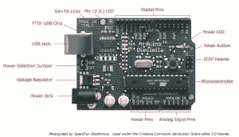

# Arduino 和 Ruby:创建一个 Gmail 通知程序

> 原文：<https://www.sitepoint.com/arduino-and-ruby-create-a-gmail-notifier/>

在本文中，我们将构建一个完整的系统，当你收到电子邮件或大量其他类似事件时，它可以让你闪烁 LED。

为了运行 LED，我们将使用非常流行的 Arduino 平台，为了从 Gmail 获取数据，我们将使用万能的 Ruby 和一台计算机。

让我们开始吧！

## 阿尔杜伊诺

首先，如果你还不熟悉它们，Arduinos 很可能是自面包片以来最酷的东西(或者说，在树莓派发布之前是)。

看看这张照片:



你看到的那块板有点像“小电脑”。但是，这种计算机远没有强大到足以运行像 Linux 这样庞大的东西——这种“计算机”的主要目的是驱动像 led、电机、传感器等东西。好吧，那有什么意义？神奇的是，你可以给这台小电脑编程，让它以特定的方式管理资源。这意味着我们将(以某种方式)对它进行编程，让它在新邮件到达时闪烁 LED。

你到底是怎么给它编程的？嗯，你把它连接到一台电脑上，使用 Arduino 环境(基于处理)，这允许你为它写代码。

其次，它通过打开和关闭其“引脚”来控制 led。如果你见过“集成电路”或“芯片”，你就知道它们看起来像什么。

Arduino 还可以通过 USB 进行通信，因此，Arduino 上的代码可以与电脑来回发送信息。

这是总的概念。问题是 Arduino 本身无法访问互联网(是的，是的，我知道有以太网屏蔽，但这些不是 Arduino 的一部分),因此，我们必须以某种方式向它提供我们必须从 Gmail(或任何你使用的电子邮件)获得的数据，以便它打开 LED。这就是红宝石的由来。

## 红宝石

正如我们都同意的，Ruby 是一种奇妙的、不可思议的通用语言。但是，用它控制 LED 非常困难(特别是通过 USB，这是一个非常高级的协议)，所以这就是我们使用 Arduino 的地方。

我们将使用 Ruby 做两件事。首先，从 Gmail 获取数据，包括未读邮件的数量。其次，将该信息作为“闪烁”或“不闪烁”传递给 Arduino。

Ruby 在这两方面都覆盖了我们。“Gmail”gem 使访问 Gmail API 变得轻而易举，“serial port”gem 允许我们通过 USB 与 Arduino 通信。现在，让我们深入代码！

## Arduino 代码

Arduino 代码基于[处理](http://processing.org)。这种语言非常类似于 Java，如果你有任何“花括号语言”的经验，你应该很快就能学会。事实上，只要你懂任何一门编程语言，Processing 就意味着简单易学。

下面是最简单的 Arduino 程序:

```
void setup() {

}

void loop() {

}
```

这相当清楚。有两种方法/程序，`loop`和`setup`。`setup`(通常)只被调用一次，`loop`被重复调用(只要 Arduino 被供电)。显然，这段代码实际上什么也不做。让我们做一个*居然*简单的例子，用一个 LED:

```
void setup() {
  pinMode(11, OUTPUT);
}

void loop() {
  digitalWrite(11, HIGH);
  delay(500);
  digitalWrite(11, LOW);
  delay(500);
}
```

为了成功实现这一点，您需要将一个 LED 与 Arduino 的引脚 11 相连，阴极(正极)在引脚 11 上，阳极(负极)接地。

这段代码是为了给我们一个简单的闪烁 LED——它调用 Arduino 环境给我们的几个函数(`pinMode`，`digitalWrite`)来完成这个任务。

特别是，调用`pinMode`告诉 Arduino，我们希望管脚 11 是一个*输出*管脚，而不是一个输入管脚(通常用于传感器等)。).然后，在`loop`方法中，我们调用`digitalWrite`通过将引脚设置为高和低(大约 5v 和大约 0v)来打开和关闭 LED。

但是，为了让我们的整个项目(同样是构建一个 GMail 通知程序)正常工作，我们需要与计算机进行通信。我们通过串行来实现这一点:

```
void setup() {
  Serial.begin(9600);
}

void loop() {
  Serial.println("RubySource");
}
```

令人困惑的线可能是`Serial.begin`线。它基本上将“波特率”设置为 9600——这到底意味着什么并不重要，你只需要知道计算机和 Arduino 必须在波特率上达成一致。这段代码通过 USB 反复向计算机发送“RubySourcen”行。如何看待这些消息？如果你将代码上传到 Arduino，你可以点击 Arduino 环境右上角的“串行监视器”图标，以便看到 Arduino 与你对话！

好吧，你可以把 USB 上的东西发到 Arduino 上。接收怎么样？

```
void setup() {
  Serial.begin(9600);
}

void loop() {
  if(Serial.available() > 0) {
    byte byte_read = Serial.read();
    Serial.print("Got: ");
    Serial.print((char)byte_read);
    Serial.print("n");
  }
}
```

这一次，我们使用了`Serial.available`和`Serial.read`函数。它们都很简单。如果有字节可供读取，前者返回一个正数，后者从传入 Arduino 的流中读取一个字节(通常是一个字符)。

太棒了，所以，现在我们可以从串行读取数据并闪烁 LED。我们已经完成了部分工作，让我们让所有的 Arduino 代码工作起来:

```
void setup() {
  Serial.begin(1200);

  //Set pin 11 to be output pin (connect LED here)
  pinMode(11, OUTPUT);

  //set pin 11 to be high initially; LED is usually on, but, not blinking
  digitalWrite(11, HIGH);
}

//this procedure is called if we need to blink the LED
void blink_led() {

  //we can't just blink it once, because that wouldn't be noticeable
  //so, we blink it three times
  for(int i = 0; i<10; i++) {
    digitalWrite(11, HIGH);
    delay(100);
    digitalWrite(11, LOW);
    delay(100);
  }

  //reset the LED back to just on, not blinking
  digitalWrite(11, HIGH);
}

//this function is called when we get a character
//over USB/Serial
void got_char(char x) {

  //if we get b over Serial
  if(x == 'b') {
    //... blink the LED
    blink_led();
  }
}

void loop() {
  //check if there's any data available on serial
  if(Serial.available() > 0) {
    //if there is, we read it
    byte byte_read = Serial.read();

    //and call "got_char"
    got_char((char)byte_read);
  }
}
```

我们走吧！代码非常简单，有一些有趣的注释。首先，我决定 LED 应该默认打开。这意味着我们可以判断系统是否有电(不要介意 Arduino 已经有一个电源 LED——LED 看起来很酷！)所以我们在设置的时候就打开了。

第二，在`blink_led()`内，我们不能只闪烁一次 LED，因为没有人会注意到。因此，我们眨眼十次！

此代码的功能是当 Arduino 通过串行接收到字母“b”时，它会使 LED 闪烁十次。

厉害！现在，让我们进入与互联网通信的 Ruby 代码！

## Ruby 代码

当我第一次开始规划这个项目时，我认为 Ruby 会非常困难，因为大多数 API 总是以这样或那样的方式令人恼火。

但是，后来，我意识到我们有令人敬畏的“gmail”宝石！立即下载:

```
gem install gmail
```

我们还需要一些东西，我们可以使用 Arduino 在 USB 端口上访问和通信。为此，我们可以使用“串行端口”gem:

```
gem install serialport
```

让我们先用 serialport 来感受一下。

```
#This code sends a "b" over Serial every 4 seconds
#That means that the LED connected to the Arduino
#will blink every four seconds.

require 'serialport'

#this *will* be different for you
#You need to find out what port your arduino is on
#and also what the corresponding file is on /dev
#You can do this by looking at the bottom right of the Arduino
#environment which tells you what the path.

#this must be same as the baud rate set on the Arduino
#with Serial.begin
baud_rate = 9600

data_bits = 8
stop_bits = 1
parity = SerialPort::NONE

#create a SerialPort object using each of the bits of information
port = SerialPort.new(port_file, baud_rate, data_bits, stop_bits, parity)

wait_time = 4

#for an infinite amount of time
loop do
  port.write "b"

  #wait a little bit before we send the next one
  sleep wait_time
end
```

我们设置一些变量(例如波特率和称为“数据位”和“stop_bits”的东西)，然后我们能够与 Arduino 通信。

需要注意的最重要的一点是`port_file`变量*对你来说*会有所不同——你必须检查它在使用 Arduino 环境时是什么。如果你看左下角，你可以注意到一个以“/dev/”开头的路径，把这个路径复制到 port_file，你应该准备好了！

一旦我们这样做了，运行的代码应该每 4 秒闪烁一次 LED。厉害！

现在，让我们加入 gmail gem，看看这一切是如何实现的:

```
require 'serialport'
require 'gmail'

#plug in your username and password here
gmail = Gmail.connect("username", "password")

#count the number of unread messages
prev_unread = gmail.inbox.count(:unread)

#this *will* be different for you
#You need to find out what port your arduino is on
#and also what the corresponding file is on /dev
#You can do this by looking at the bottom right of the Arduino
#environment which tells you what the path.
port_file = '/dev/cu.uart'

#this must be same as the baud rate set on the Arduino
#with Serial.begin
baud_rate = 9600

data_bits = 8
stop_bits = 1
parity = SerialPort::NONE

#create a SerialPort object using each of the bits of information
port = SerialPort.new(port_file, baud_rate, data_bits, stop_bits, parity)

wait_time = 4

#for an infinite amount of time
loop do
  #get the number of unread messages in the inbox
  unread = gmail.inbox.count(:unread)

  #lets us know that we've checked the unread messages
  puts "Checked unread."

  #check if the number of unread messages has increased
  #if so, we have a new email! So, blink the LED.
  if unread > prev_unread
    port.write "b"
  end

  #reset the number of unread emails
  prev_unread = unread

  #wait before we make another request to the Gmail servers
  sleep wait_time
end
```

代码不是最优雅的，但它完成了工作，而且做得很清楚(特别是在教程中，我认为清晰比简洁更重要。)

如果你运行这个，并给自己发一封电子邮件，你应该会看到 LED 闪烁！它是如何工作的？它会不断检查未读邮件的数量，如果数量增加，它会闪烁 LED。太棒了，对吧？

## 延伸它

我们已经完成了我们的项目。我们制作了一个带 LED 的 GMail 通知程序。但是，这就是我们对代码所能做的一切吗？

绝对不行。首先，GMail 不一定是我们唯一的数据来源。如果明天有雨，也许你可以让 LED 闪烁(并且一直闪烁)。或者，也许当你在 Reddit 上有消息的时候。或者 RubySource 上有没有新的文章(我喜欢这篇)。Arduino 代码根本不需要改变，大多数 Ruby 代码也保持不变，因为我们改变的只是数据和我们对数据的解释！

从这里你可以去很多其他的方向。你可以用几个 led 和不同的数据源建立一个通知系统，这比 Reddit 和 Hacker News 已经做的更能分散你的注意力！通过这篇文章，您现在可以将 Arduino 与 Ruby 连接起来，从而将 internet 与现实世界的对象连接起来。您可以做的事情实在太多了(当然，不仅仅是切换数据源)，您绝对应该尝试更多的事情！

## 包装它

我希望你喜欢这篇关于在 Ruby 上使用 Arduino 的文章。如果你真的创建了电子邮件通知程序，给自己一个鼓励——这是一件很酷的事情！如果您有任何其他想法、意见和建议，请发表评论！

推文非常感谢:)

## 分享这篇文章