# JavaScript 的艺术和科学

> 原文：<https://www.sitepoint.com/art-science-javascript/>

在本教程中，我们将学习一种使用 CSS 和 JavaScript 构建第一人称视角迷宫的技术，以此向像《地下城主》和《毁灭战士》这样的老派冒险游戏致敬。

事实上，所涉及的脚本相当复杂，我不可能在这一篇教程中详细说明代码的每一个细微差别。事实上，我甚至不会列出脚本中使用的每个方法，因为其中一些方法相当长。不过，我能做的是向您介绍使用 CSS 创建形状和透视图的原则，以及使用 JavaScript 按需生成这些形状的任务，以便从静态的二维地图创建动态的三维透视图。

该脚本及其所有组件都包含在本教程的[可下载代码档案](https://www.sitepoint.com/examples/javascript-3d-maze/javascript-3d-maze.zip)中。所有代码都加了注释，所以你会发现它很容易理解。我建议你在阅读的时候把它拿出来看看，这样你就可以在我们阅读的时候参考它。

在我们深入讨论它是如何构建的之前，让我们来看看最终的结果——如下所示。

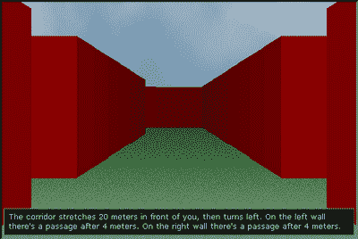

这个截图是用 Opera 拍摄的，这个脚本最初就是在 Opera 中开发的，它也可以在 Firefox、Safari 和 Internet Explorer 7 中正常工作。然而，IE 6 并没有得到完全支持:游戏可以工作，但看起来很差，因为 IE 6 没有我们需要的所有 CSS 支持(最明显的是，它缺乏对透明边框的支持)。本教程是为 SitePoint 的书[*JavaScript*](https://www.sitepoint.com/premium/library)的艺术&科学开发的，你可以[下载保存，离线阅读](https://www.sitepoint.com/blog/)。那个可下载的 PDF 还包括关于表格的章节，我保证你会发现一些惊喜！

我还应该指出，如果你想到的话，我们在这里做的事情没有实际用途。事实上，可以说我们并没有在工作中真正使用正确的技术。我做了这个迷宫，因为我想看看是否有可能——在 JavaScript 和 CSS 能做些什么方面，挑战一下极限。但我们正处于合理的边缘，也许 Flash 或 SVG 更适合构建这样的游戏。

但是，嘿——为什么要爬山呢？因为它就在那里！

##### 基本原则

2001 年，Tantek elik 发表了一项使用 CSS 边框之间的交互来创建形状的技术。我们将使用该技术制作一组直角三角形。

我听到你问为什么是三角形？因为一旦你可以渲染一个三角形，你就可以渲染任何你喜欢的多边形。通过将三角形与我们一直能够渲染的矩形相结合(使用一个很好的旧 div 和背景色属性)，我们可以创建我们的迷宫的墙壁，并有助于透视感。正如你将看到的，我们将通过把玩家的视角分割成若干列来绘制这些墙。

我们还需要一个迷宫的平面图，以及一些将平面图动态转换成代表迷宫墙壁的多边形的方法。

***制作三角形***

如果一个元素有一个非常粗的边框(比如 50px)，并且相邻的边框有不同的颜色，那么这些边框的交叉点会产生一条对角线，如下图所示。

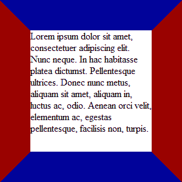

该示例只是一个应用了以下 CSS 规则的`div`元素:

```
width: 200px; 
height: 200px; 
border: 50px solid #900; 
border-color: #009 #900;
```

为了呈现一个三角形，我们实际上不需要那个 div 的内容——我们只需要它的边框。因此，让我们删除文本，并将宽度和高度值减少到零。我们剩下的是下图。


下面是实现这种效果的 CSS:

```
width: 0; 
border: 50px solid #900; 
border-color: #009 #900;
```

如果我们要改变相对的边界宽度(比如说，在左边界应用 50px，在上边应用 25px)，我们可以创建不同角度的三角形。通过将其中一个边框的颜色设置为透明，实线边框的对角线独立存在，如下图所示。


现在，如果我们在第一个 div 元素周围包装第二个 div 元素，我们将能够提取单个离散的三角形。我们可以通过以下方式实现这一目标:

1.  剪裁内部元素

被裁剪的元素需要有绝对定位，所以容器上的相对定位为内部元素提供了定位上下文，如下图所示。

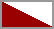

生成该数字的代码仍然非常简单。这是 HTML:

```
<div id="triangle"> 
<div></div> 
</div>
```

这是 CSS:

```
#triangle 
{ 
  border: 2px solid #999; 
  position: relative; 
  width: 50px; 
  height: 25px; 
} 
#triangle > div 
{ 
  border-style: solid; 
  border-color: transparent #900; 
  border-width: 25px 50px; 
  position: absolute; 
  left: 0; 
  top: 0; 
  clip: rect(0, 50px, 25px 0); 
}
```

剪辑和定位是我们使用 CSS 创建谨慎形状的关键。如果我们删除剪辑，我们会得到如下所示的结果。


您可以看到，通过改变内部元素的 clip 和 position 属性，我们可以控制显示它的哪一部分，从而控制哪些三角形可见。如果我们想要右下角的三角形，我们将应用这些值:

```
left: -50px; 
top: -25px; 
clip: rect(25px, 100px, 50px, 50px);
```

我们会得到这里描述的结果。


***定义平面图***

我们迷宫脚本的精髓在于我们能够从二维地图创建三维透视图。但是在我们能够理解透视图是如何工作的之前，我们必须看一下地图——或者，从现在开始，我将参考平面图。

平面图是一个矩阵，它定义了包含行和列的网格。平面图中的每个方块都包含一个四位数的值，用于描述该方块周围的空间，即它的四边是墙还是地板。我们一会儿会看到，四个数字中的每一个都用 1 或 0 来表示。

*理解`clip`*
*`clip`完全把我搞糊涂了——每次使用它，我都要重新思考它是如何工作的。为了帮助唤起你的记忆，下图说明了那个裁剪矩形中的值的含义。*

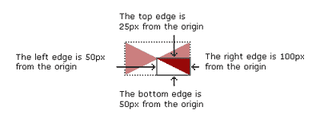

本例中的主要元素(虚线所示)宽 100 像素，高 50 像素。剪辑矩形中的四个值是(按顺序):顶部偏移量、右侧偏移量、底部偏移量和左侧偏移量。这些值中的每一个都定义了该边相对于主元素原点(其左上角)的偏移。

这些值的指定顺序(上、右、下、左)与其他 CSS 属性相同，如边框、填充和边距。想到单词 trouble (TRBL)会帮助你记住正确的顺序。

下图显示了这些方块是如何构建的。

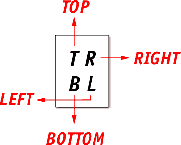

下图显示了一个简单的平面图，其中使用了四个正方形。

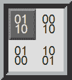

在上图中:

*   一个深灰色的方块代表一个正方形的实心墙。
*   图表边缘的边框也代表实心墙。
*   一个浅灰色的方块代表一个正方形的开放式地板。

对于图表中的每个方块:

*   数字`0`表示“这个方向有坚固的墙。”把数字`0`想象成一块大砖头，意思是“不，你不能在这里走。”
*   数字`1`表示“这个方向有空地。”把数字`1`，一个正值，想象成“是的，你可以走在这个广场上。”
*   当从上面看平面图时，正方形中的四个数字中的每一个都代表一个方向。这些数字应该从左到右、从上到下阅读，并且它们应该以与 CSS 值相同的顺时针顺序出现:上、右、下、左(或者，当从迷宫中某人的角度考虑时:向前、向右、向后、向左)。

因此，上图右上角的正方形代表以下信息:

*   代表的四位数是`0010`。
*   广场的上方、右侧和左侧都有坚固的墙。
*   广场下面有一块空地。

如你所见，这个概念与经典的 Windows 游戏《扫雷》非常相似！

上图中的平面图在 JavaScript 中用下面的矩阵表示:

```
this.floorplan = [['0110','0010'], ['0100','1001']];
```

注意，这些值是字符串，不是数字；对于数字，前导零不会保留，但在这种情况下，这些前导零是数据的重要部分。

到目前为止，我们只看到了非常小的平面图数据示例。为了使我们的迷宫真正有用，我们需要更大的东西——代码档案中包含的平面图是 20 乘 40 的正方形，即使这样也相对较小。

为了好玩，下图显示了平面图的样子——如果你迷路了，可以参考这个平面图！和以前一样，浅色方块代表地板空间，深色方块代表实心墙，而红色十字标记表示在迷宫中导航的人(从这里开始称为玩家)可以站立的位置。

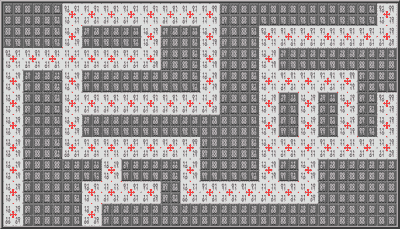

我不指望你能读懂那些数字！但是稍后，当我们讨论游戏附带的平面设计时，你可以在最初的上下文中查看这个平面图。平面图设计器也包含在代码档案中。

*给猫剥皮有很多种方法！*
*当然，像这样的问题有无数种处理方式，每种方式都有其利弊。例如，代替二进制数字，我们可以使用像 WFFW 这样的字母来表示墙壁和地板空间。我们可以使用[嵌套数组](https://singlethread.io/post/find-the-intersection-of-two-arrays/)，就像`[[[0,1,1,0],[0,0,1,0]]]`一样。我们甚至可以只用一个数字来表示每个方块，这无疑会使创建和修改平面图更加容易。*

我之所以选择使用四位数，是因为这样一来，每个方块就能代表它周围的*，而不是方块本身的**。如果我们有一个使用一位数的平面图，并且我们想要表示来自中间正方形的视图，我们不仅需要那个正方形的数据，还需要它周围的四个正方形的数据。*

使用我所采用的方法，我们只需要中间方块的数据就可以知道周围的方块是什么。当然，我们最终会在平面图中发现一些重复的数据。然而，就纯粹的计算效率而言，两者是等价的，使用四位数对我来说更有意义，因为每个方块都更加独立。

***创造视角***

现在，我们已经了解了平面图的工作原理，并且已经了解了如何制作三角形，我们拥有了所有的数据和构建模块，我们需要创建一个 3D 视图。

看一下下图。这张图展示的是在我们的迷宫中创造透视错觉的所有元素的分解。长走廊两边的墙由 16 根柱子组成。每一列都包含四个内部元素，在本章的剩余部分，我们称之为*砖块*。我给砖块贴了标签，并用不同的颜色突出显示，这样更容易区分。在每一列中，*顶部砖块*突出显示为灰色矩形；*上砖*是一个由红蓝三角组成的长方形，*下砖*也是如此；而*中砖*是一个绿色的长方形。

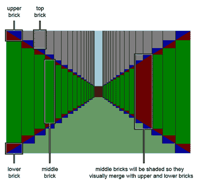

上面和下面的砖块是我们之前看到的三角形的实现，针对我们需要的四个方向进行了不同的剪裁，从而在四个方向上创建了对角线。这些砖块的红色部分将总是可见的，而蓝色部分仅为了演示目的而呈蓝色——实际上，它们将是透明的。顶部的砖块也将是透明的，以暴露天空图案的背景。(使用顶部砖块并不是绝对必要的——我们可以对上面的砖块应用顶部边距——但是，这种方式对我来说更容易想象。)中间的砖块将被涂成与上下砖块中的三角形相同的暗红色，以便砖块融合在一起，并产生墙壁的一部分的外观。

*这不是真实的视角！*
*我们在这里处理的实际上不是一个真正的透视——它稍微有点倾斜，所以消失点是一条短的垂直线，而不是一个点。*

我最初是用一个真实的视角和一个消失点来创建这个迷宫的，但是它看起来不太对劲。相对于墙与墙之间的距离，天花板显得太低了(或者墙与墙之间的距离太远了，这取决于你怎么看)。改变长宽比(也就是说，将视窗变成方形，而不是现在的宽屏比例)会有所不同，但我不想这么做——我想让游戏看起来更像电影！

随着柱状物变小，视野也受到限制，而不是一直延伸到消失点，因为在这样的距离上我们可以达到的分辨率是有限的。视图在我们不再有足够的像素来有效绘制的点处结束，这限制了我们可以表示的走廊的最大长度。我们将在本章末尾再次讨论这个问题，以及这种方法的其他局限性。

如果你仔细观察，你会在上图中看到每个三角形都有相同的角度——只是砖块本身的大小在逐渐减小。这使得透视错觉很好也很容易创造，因为我们不用担心任何复杂的数学。不过，这不是我们想要手工编码的东西。让我们用 JavaScript 来计算每块砖的大小，这样就可以动态生成了…

##### 制作动态视图

使用编程语言来生成复杂的视觉模式的一个好处是，我们不需要手动计算每一条线和每一个角度——我们只需要担心表示模式的数学。

有时候我真希望我在学校的数学课上能更专心一点。但是那时电脑游戏还处于起步阶段，我的老师们对此都知之甚少。所以当我在课堂上问，“这些有什么用？”，他们没有好好回答！

还好，这里涉及的数学并不复杂——我们甚至不需要三角学，因为角度已经为我们确定了。我们需要计算的只是砖块的大小和用于创建三角形的裁剪区域；浏览器的渲染引擎会完成剩下的工作。

***核心战法***

现在让我们来看看脚本。我们将从主脚本`underground.js`开始，它位于代码归档的`scripts`文件夹中。整个脚本太大，无法在本书中完整列出；相反，我只是列出了每种方法的特征，让您对正在发生的事情有一个高层次的了解:

```
Example 6.1\. underground.js (excerpt)   

// DungeonView object constructor   
function DungeonView(floorplan, start, lang, viewcallback)   
{ ... };   

// Create the dungeon view.   
DungeonView.prototype.createDungeonView = function()   
{ ... };   

// Reset the dungeon view by applying all of the necessary   
// default style properties.   
DungeonView.prototype.resetDungeonView = function()   
{ ... };   

// Apply a floorplan view to the dungeon   
// from a given x,y coordinate and view direction.   
DungeonView.prototype.applyDungeonView = function(x, y, dir)   
{ ... };   

// Create the map view.   
DungeonView.prototype.createMapView = function()   
{ ... };   

// Reset the map view.   
DungeonView.prototype.resetMapView = function()   
{ ... };   

// Apply a position to the map view.   
DungeonView.prototype.applyMapView = function()   
{ ... };   

// Clear the view caption.   
DungeonView.prototype.clearViewCaption = function()   
{ ... };   

// Generate the caption for a view.   
DungeonView.prototype.generateViewCaption = function(end)   
{ ... };   

// Shift the characters in a string by n characters to the left,   
// carrying over residual characters to the end,   
// so shiftCharacters('test', 2) becomes 'stte'   
DungeonView.prototype.shiftCharacters = function(str, shift)   
{ ... };   

// Bind events to the controller form.   
DungeonView.prototype.bindControllerEvents = function()   
{ ... };
```

我将解释为我们的脚本完成大部分工作的三个核心方法，而不是在这里检查每一个方法，让您自己按照代码归档中的代码来填补空白。在本节中，我将使用单词 *view* 来表示“平面图上一个位置的 3D 表示”(也就是说，玩家的视角，看北、东、南或西)。

***`createDungeonView`法***

`createDungeonView`方法获取一个空容器，用我们需要的所有元素填充它(列是`div`的，砖块是嵌套的`span`的)，并保存一个引用这些元素的矩阵供以后使用:

```
Example 6.2\. underground.js (excerpt)   

// Create the dungeon view.   
DungeonView.prototype.createDungeonView = function()   
{   
  var strip = this.tools.createElement('div',    
                  { 'class' : 'column C' }   
              );   
  this.grid['C'] = this.dungeon.appendChild(strip);   

  for(var k=0; k<2; k++)   
  {   
    // the column classid direction token is "L" or "R"   
    var classid = k == 0 ? 'L' : 'R';   
    for(var i=0; i<this.config.gridsize[0]; i++)   
    {   
      var div = this.tools.createElement('div',    
          { 'class' : 'column ' + classid + ' ' + classid + i }   
      );   
      this.grid[classid + i] = {    
          'column' : this.dungeon.appendChild(div)    
      };   
      for(var j=0; j<this.config.gridsize[1]; j++)   
      {   
        // create the main span   
        var span = this.tools.createElement('span',    
            { 'class' : 'brick ' + this.bricknames[j] }   
        );   
        if (j == 1 || j == 3)   
        {   
          var innerspan =    
              span.appendChild(this.tools.createElement('span'));   
        }   
        this.grid[classid + i][this.bricknames[j]] =    
            div.appendChild(span);   
      }   
    }   
  }   
  this.resetDungeonView();   
};
```

如果你浏览代码，你会发现这个方法没有更多的内容:它唯一的职责就是创建一组元素，并给每个元素分配`class`名称，这样它们就可以彼此区分开来。我使用的值相当直观，例如，`upper`表示上层砖块。

我使用了 CSS 浮动来排列各列(左浮动表示左边墙上的一列，右浮动表示右边的一列)。为了创建列，我们从边缘向内迭代每一侧(换句话说，最左边的列是组成左墙的第一列，最右边的列是右墙的第一列)。

***`resetDungeonView`法***

`resetDungeonView`方法将样式属性(大小、位置、剪辑、背景和边框颜色)应用于构成最基本视图的元素——当我们的用户直视延伸到我们的脚本所能支持的最大距离的走廊时，就会显示这个视图，如下图所示。

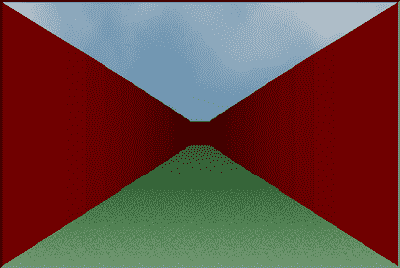

每当我们需要重置视图时，我们都可以调用这个方法，这将在初始化时进行，并且在应用每个新视图之前再次调用。它通过迭代我们在`createDungeonView`中创建的元素引用矩阵来工作；它计算每列的宽度和其中每块砖的高度。

为了进行这种计算，我们需要定义一些结构常数。这些常量可以在配置脚本`config.js`中找到，该脚本也位于代码归档的脚本目录中:

```
Example 6.3\. config.js (excerpt)    

this.viewsize = [600, 400]; // [**1**]    
this.gridsize = [16, 4];    // [**2**]    
this.bricksize = [50, 31];  // [**3**]    
this.multiplier = 0.84;     // [**4**]
```

这些常数代表下列值:

1.  最后，当我们向视图的中心移动时，乘数控制每一列的砖块大小减少的因子。

下图显示了我们在上图中看到的相同的透视图，这一次带有说明这些结构常数如何应用的标题。

*计算数值*
*我很想说我有一个聪明的数学算法来计算我在这里使用的数值(可能有一个)，但是我不能。我只是反复试验，直到找到看起来合适的东西。但是，请注意，这些值是非常密切相关的，因此在调整它们时要非常小心！*

正确值的选择也取决于脚本的整体性能——用大量较小的砖块创建更高分辨率的迷宫是可能的。然而，这意味着我们要渲染更多的对象，这会导致整体性能下降。即使使用我上面设置的默认值，您也需要一台相当不错的计算机来有效地渲染这个迷宫。

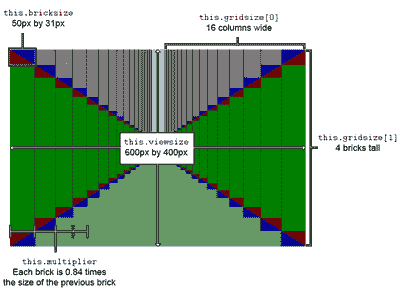

如果你看一下上面的图，你会注意到砖块完美地排列在一起——在每一列中，上面的砖块正好在前一列中上面砖块的下面和旁边；同样，每块较低的砖块都排列在相邻砖块的下方和旁边。随着砖块尺寸的减小，这些砖块的内部元素的“裁剪”和“位置”值会成比例地减小，而顶部和中间砖块的高度会根据完成墙的需要而变化。

最后，为了改善透视的外观，我们希望每一列都比前一列稍微暗一些。为了实现这个目标，我引入了常量来定义砖块的基本颜色和应用于它们的变暗比例。我们将使用 RGB 值来定义墙壁颜色，因为这些值是十进制的而不是十六进制的，所以更容易使用。我们将控制每一列的暗度的常数命名为暗化器。这两个常量都在`config.js`文件中定义:

```
this.wallcolor = [127, 0, 0];    
this.darkener = 0.95;
```

在我们代码的每次迭代中，我们在每一侧呈现一个单独的列，向视图的中心移动；基础颜色会变暗，变暗的程度是在变暗常数中指定的。我选择了深红色作为主演示(深色通常效果最好)，但是如下图所示，你可以使用任何你喜欢的颜色——甚至是粉色！

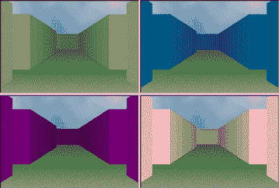

***`applyDungeonView`法***

`applyDungeonView`方法将风格变化应用到基本视图中，在主通道的两侧创建通道。为此，它首先编译一个矩阵，存储在变量`this.squares`中，这是完整平面图的一个子集。这个矩阵只包含那些平面图方块，这些方块是我们从迷宫中的当前位置渲染玩家的视图所必需的。

下图显示了平面图的摘录。绿色方块突出显示玩家当前站立的位置，而蓝色边框围绕玩家可以看到的地方。蓝色边框内的区域定义了为玩家绘制视图所需的计划部分。

在这个例子中，我们朝北看，每个地板方格为我们提供了周围方格的信息。然而，对于任何运动方向，玩家总是“向前看”，我们渲染的是玩家的视角。因此，我们必须做的第一件事是将每个方块中包含的数据转换成玩家面对的方向的准确数据。让我用一个例子来解释这一点…

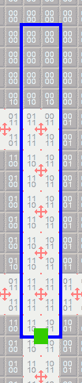

请记住，方块中的数字表示该方块周围有墙或地板，从顶部开始按顺时针方向排列。好吧，我们希望这四个数字总是从顶部开始顺时针指示信息，而不管玩家实际面对的方向。如果我们在面向北方时拥有值`1110`，那么，当玩家面向东方时，同样的正方形将由值`1101`表示。当玩家面朝南时，值将是`1011`，如下所示。

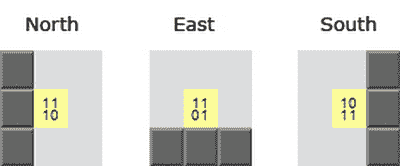

因此，当我们编译`this.squares`矩阵时，我们需要将每个方块的值转换成玩家面对的方向。一个名为`shiftCharacters`的小实用方法执行这种翻译:`str`是四位数的字符串，`shift`是玩家顺时针转动时方块必须逆时针转动的次数。每一圈对应于四个数字中的每一个，这四个数字代表向左移动一个位置的方块(最左边的数字跳到字符串的末尾)。

继续上图中的例子，如果玩家的视角从北(平面图数据为`1110`)变为西(`0111`),`shift`值将为`3`。

`shiftCharacters`方法如下所示:

```
Example 6.4\. underground.js (excerpt)     

DungeonView.prototype.shiftCharacters = function(str, shift)     
{     
  var saved = str.substr(0, shift);     
  str = str.substring(shift);     
  str += saved;     
  return str;     
};
```

一旦我们有了需要的数据，我们就可以遍历它并创建实际的视图。这就是事情变得相当棘手的地方。

首先，我们需要从玩家的当前位置开始，向前迭代方块。在每次迭代中，我们测试每个方块的第一个数字(它告诉我们它前面是什么)，直到我们找到最后一面墙。端墙标志着玩家所能看到的极限——从那一点开始的每一列都应该被赋予相同的高度和颜色。如下图所示，这些柱子会产生一面墙的错觉。

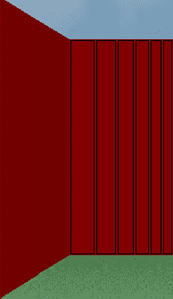

一旦我们知道了玩家的视野范围，我们就从该点开始，通过平面图数据，向玩家的位置进行迭代，寻找相邻的通道。我们需要向后迭代，因为通道面对墙壁的高度是定义它的最远的柱子的高度。

为了说明这一点，下图显示了透视图的另一个摘录，这一次用线条和阴影叠加显示了一个走廊，左边有一个通道。

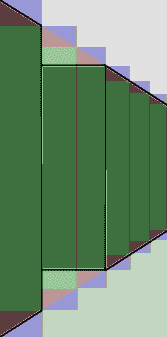

如果我们希望第二列和第三列创建一个向左的通道，我们需要从这些列中移除上面和下面的砖块，只留下中间的砖块，然后必须根据需要调整其大小。但是我们的通道有两列宽，决定墙高度的是最远的一列(或者我们可以称之为*角柱*)——而不是最近的。所以我们需要首先修改那个角柱，这样我们就知道相邻的柱应该有多高。

向前迭代需要我们向前跳两步找到拐角，然后向后移动一格做进一步的调整。这就是为什么我们向后迭代，而不是向前。(我就说有猫腻！)

当我们创建这些通道时，我们也稍微减轻了面对的墙壁，以改善视觉外观，使墙壁看起来更真实。正如我们在加深墙壁时所做的那样，我们使用一个常量值(我称之为变亮器)来确定所需的亮度:

```
this.lightener = 1.25;
```

与高度值一样，照明首先应用于角柱，然后复制到更近的柱上(出于相同的原因)。同样，对于这个脚本中使用的所有常量，我没有神奇的公式来分享这些值是如何获得的？它们只是经过反复试验后看起来正确的东西。

下图再次显示了相同的视图节选——这次没有暴露的构造——看起来就像在最终游戏中一样。

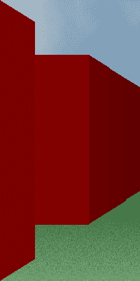

***点睛之笔***

现在，我希望，你应该对这个脚本如何生成透视图有一个相当具体的感觉，根据需要创建墙和通道。从我们到目前为止看到的图表中，您可以理解任何给定的视图都是矩形和三角形的简单组合。

我们需要做的最后一点是将容器内的整个视图向上移动，以便稍微提高地平线。这只是我加入的另一个视觉调整，因为我认为它会产生更好看和更真实的结果，如下图所示。

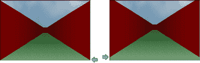

你会注意到我使用了天空和地板图案的图像。这些图像提供了一些纹理来增加我的迷宫的真实感；它们还包含一个轻微的梯度，随着接近地平线变得越来越暗，这再次加强了透视感。

不过，最终结果并不完美:最终输出数字中会出现不可避免的舍入误差，这些误差会导致相邻列之间偶尔出现一两个像素的差异。阴影计算也不精确——有时，在靠近的墙上，您可以看到应该完全相同的两列之间有轻微的色差。

然而，考虑到所有的事情，我们在这里创建的是一个相当令人信服的 3D 迷宫。

***这种方法的局限性***

我们建造这个迷宫的方法对迷宫平面图的设计施加了一些限制，从而限制了我们可以绘制的布局类型:

*   走廊必须总是两个方块宽——我们不能创造更宽的空间，因为我们没有画它们的部件。
*   任何一条走廊都不能超过 16 个正方形，因为这是我们可以绘制的最大列对数。
*   墙壁也必须由偶数个正方形组成——每个方块必须由至少两个正方形乘两个正方形组成。

将平面图上的四个正方形视为一个正方形可能会有所帮助；这些小方块的存在只是为了让我们有更多的元素来应用渐变阴影，从而获得更好看、更真实的 3D 视图。

##### 创建地图视图

在迷宫视图的右边，我们将添加一张地图，显示玩家所在位置的平面图。我最初添加这个功能是为了显示玩家可以实际看到的同一视图的自上而下的视图……但后来我意识到——如果这种地图没有提供额外的优势，那么它有什么意义呢？

取而代之的是，我们将添加一张显示更多周边区域的地图，作为定向的辅助。在下面的视图中，你可以看到玩家在到达一堵墙之前只能向前移动一小段距离，但是右边的地图显示了那堵墙后面更远的走廊。

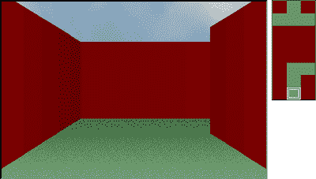

地图本身的构造非常简单——它只是一堆浮动在容器中的跨度。我在有墙的地方应用了纯色背景，在有地板的地方应用了透明背景。这使得容器的绿色背景显示出来，如下图所示。

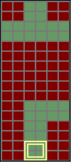

生成地图同样简单，因为它只是数据的二维表示，而数据本身就是 2D 矩阵。

请记住，当我们生成迷宫视图时，我们创建了一个名为 this.squares 的矩阵。该矩阵包含了生成当前视图所需的平面图，数据被转置，以便为玩家呈现一个向前的视图。我们可以用同样的数据矩阵来生成这张 2D 地图。

为了创建地图，我们从给每个方块着色开始(使用 base `wallcolor`属性)。然后，我们遍历正方形矩阵，并将透明度应用于地图中代表开阔地面空间的每个正方形——包括玩家站立位置正下方的空间。文件`underground.js`中的`applyMapView`方法为我们解决了这个问题:

```
Example 6.5\. underground.js (excerpt)      

DungeonView.prototype.applyMapView = function()      
{      
  this.resetMapView();      
  for(var i=0; i<this.squares.L.length; i++)      
  {      
    var n = this.mapsquares.length - 2 - i;      
    if(this.mapsquares[n])      
    {      
      if(this.squares.L[i].charAt(3) == '1')      
      {      
        this.mapsquares[n][0].style.background = 'transparent';      
        this.mapsquares[n][1].style.background = 'transparent';      
        if(i == 0)      
        {      
          this.mapsquares[n+1][0].style.background = 'transparent';      
          this.mapsquares[n+1][1].style.background = 'transparent';      
        }      
      }      

      if(this.squares.R[i].charAt(1) == '1')      
      {      
        this.mapsquares[n][4].style.background = 'transparent';      
        this.mapsquares[n][5].style.background = 'transparent';      
        if(i == 0)      
        {      
          this.mapsquares[n+1][4].style.background = 'transparent';      
          this.mapsquares[n+1][5].style.background = 'transparent';      
        }      
      }      

      if(this.squares.L[i].charAt(1) == '1')      
      {      
        this.mapsquares[n][2].style.background = 'transparent';      
        this.mapsquares[n][3].style.background = 'transparent';      
        if(i == 0)      
        {      
          this.mapsquares[n+1][2].style.background = 'transparent';      
          this.mapsquares[n+1][3].style.background = 'transparent';      
        }      
      }      
    }      
  }      
};
```

##### 添加标题

web 编程最让我兴奋的事情之一是它在提高可访问性方面的潜力。尽管我们在这里制作一个视觉游戏，但是我们的数据格式可以很容易地转换成其他类型的输出，比如纯文本。我们可以使用与制作地图相同的信息来生成每个迷宫视图的实时文本描述，如下图所示。

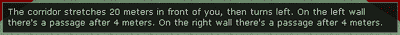

字幕不仅可能有助于有认知或视觉障碍的玩家理解，还可以将基本游戏扩展到完全失明的人——突然之间，我们可以在没有任何视觉效果的情况下在迷宫中导航！诚然，不幸的是，这样玩游戏会困难得多——不仅仅是因为你必须在头脑中记住方位信息，还因为你没有地图可以参考，以获得下一堵墙后面有什么的线索。

尽管如此，这还是一个开始。尝试在禁用 CSS 的情况下观看游戏，你会对如果你是盲人玩游戏的体验有一个基本的感觉。我还确认了游戏可以在 JAWS 8 屏幕阅读器上运行。

为标题生成核心数据很简单？我们只需要知道左边和右边有多少通道，以及它们有多远。我们可以通过以下方式解决这个问题:

*   再次迭代通过`this.squares`矩阵
*   构建数组来存储每个开口的索引

这些开口将被转换成可感知的距离。当我们在迷宫中穿行时，一个正方形看起来大约有两米长，所以我们将采用它作为地图的比例。一旦到达玩家视图的末尾，我们就可以停止迭代——我们已经在`applyDungeonView`方法中创建了一个 end 变量，它是视图结束点处`this.squares`的索引。因此，我们可以在调用时简单地将这个值传递给`generateViewCaption`方法。

在代码中，我使用了`len`来表示前面走廊的总长度，使用了名为`passages.left`和`passages.right`的数组来存储每个通道离玩家的距离。我们迭代的结果可能会产生这样的数据:

```
var len = 16;      
var passages = {      
  'left' : [8, 16],      
  'right' : [4]      
};
```

这看起来足够简单来解释，对不对？嗯，是的……然而，将这种数据结构转换成连贯的英语还是有点棘手。基本转换很容易。使用我们拥有的数据，我们可以粗略地描述这个视图:

“走廊在你面前延伸 16 米。左边是 8 米和 16 米后的通道。右边 4 米后有通道。”

然而，这种语言相当迟钝。首先，如果只有一个段落，我们不会想说“有段落”。相反，我们会说“有一段”此外，左边的最后一个通道是在远端，所以描述为“走廊在你面前延伸 16 米，然后左转”会更好

我们还需要处理异常。例如，如果玩家正站在一堵墙的前面，我们不想说“…在前面延伸 0 米…”同样，如果玩家刚刚右转进入一个通道，我们不想说“在右边 0 米后有一个通道。”

为了满足所有这些例外，脚本接受一个包含替换标记的句子片段的字典，然后根据需要对其进行编译和解析，以获得接近散文的结果。如果您查看一下`init.js`，您会注意到`DungeonView`对象是用这个数据作为参数实例化的。每个语言属性是具有替换标记的句子片段；例如，`%dir`是一个方向标记，将根据需要替换为“左”或“右”。

我鼓励你现在滚动浏览`underground.js`中的`generateViewCaption`方法，并阅读那里解释每种情况的注释。事实上，仍然有改进的空间，但这是你可以改进到第 n 个程度的事情之一，它仍然不会是完美的。(在[维基百科关于自然语言处理的条目](http://en.wikipedia.org/wiki/Natural_language_processing/)中阅读更多关于用英语构建听起来自然的句子的相关问题。)也就是说，我相信最终的结果相当不错——标题足够冗长，足以让信息被理解，足够简洁，读起来不费劲，足够流畅，听起来不太像是由机器生成的(即使它们是！).

##### 设计平面图

在这本书的代码档案中，你会发现一个*平面图设计器*，它是一个独立的 JavaScript 应用程序，生成这个游戏使用的`floorplan`矩阵。这是一个正方形的表格，你可以点击一个正方形在地板和墙壁之间切换。该脚本将计算出与该视图相关的每个正方形的编号，使用我在本章前面介绍的 TRBL 语法来表示正方形的四个边上是有墙还是有地板。

将鼠标悬停在平面图设计器中的一个方块上也会显示一个工具提示，其中包含该方块在网格中的`x,y`位置。该信息对于定义起始位置很有用(在`init.js`中`start`数组的前两个值)。

要使用平面图设计器，首先通过单击方块创建您的平面图。当你对你的迷宫满意时，点击生成输出矩阵按钮，一个`floorplan`矩阵就会为你生成。然后，您可以将这些数据直接复制并粘贴到您的`init.js`文件中——下次运行 maze 应用程序时，您的新平面图数据将被传递到脚本中。

或者，您可以通过将现有平面图数据粘贴到`textarea`字段来开始您的平面图编辑会话。单击显示输入矩阵，平面图设计器将显示您粘贴到字段中的数据的地图表示，然后您可以根据需要对其进行进一步编辑。试着粘贴来自`init.js`的原始`floorplan`矩阵，你会看到我在这一章开始时展示给你的计划，非常精彩！

虽然简单，但如果没有这个工具，制作迷宫平面图将是一个非常痛苦的过程！事实上，我在编写主脚本之前就创建了这个工具。

##### 进一步发展

在我们结束这一章之前，我想花一些时间来讨论迷宫进一步发展的一些一般可能性。更具体地说，我们将看看*回调*工具，它可用于将额外的代码挂钩到每个视图更改中。

***使用回调***

查看一下`init.js`，您会注意到，除了平面图、起始位置和语言参数之外，还有一个可选的第四个参数指定了一个`viewchange`回调函数。这个函数将在每次绘制新视图时被调用，可以用来给游戏增加逻辑。

本例中提到的 viewchange 函数可以在名为`demogame.js`的脚本中找到，该脚本位于代码存档的 addons 目录中。这个脚本及其相关的样式表都包含在`underground.html`中，在 head 部分的最末端(在核心样式表和脚本之后)。

正如您将看到的，回调接受以下参数:

*   `x`–玩家当前的 x 位置
*   `y`–玩家当前的 y 位置
*   `dir`–玩家当前面对的方向
*   `inst`–对这个`DungeonView`对象实例的引用

通过基于前三个参数定义条件，您可以添加仅适用于迷宫中特定位置的逻辑。因为回调函数总是在玩家从起始位置开始在迷宫中导航时被调用，所以您也可以使用回调函数来初始化代码。例如，可以设置一个标志来指示特定于位置的动作已经发生，以便它只发生一次。

第四个参数`inst`是对 DungeonView 实例的引用，可以用于向视图中添加新元素(比如玩家要查找的对象)，或者修改配置属性(为了改变迷宫中某些区域的墙壁颜色)。

在演示游戏示例中，我在平面图中的一个特定位置使用了回调函数——在迷宫中的这一点上，您可以看到前面有一个简单的对象，而在另一个位置上，您正站在该对象的正上方(即捡起它)。这就是演示游戏的全部内容——没有什么突破性的东西——但至少它为漫无目的的迷宫之旅增加了一个最终目的！它还应该用来说明扩展迷宫的原则，并有希望激发你尝试更有雄心和创造性的东西。

在 sitepoint.com，你可以找到一个更复杂的例子，其中一个隐藏的惊喜位于一个更大的迷宫中，而你的任务就是找到它。

##### 蓝天可能性

使用 Ajax 将玩家的位置传递给服务器非常简单——其他玩家可以读取这些数据，从而有助于创建在线多人游戏环境。还应该可以实现一个服务器端程序，生成平面图数据并将其发送回游戏，从而在迷宫中有效地创建多个“关卡”。将这一想法更进一步，玩家可以在他们之间接收和传输平面图数据，从而允许个人管理迷宫关卡。

然而，在视图中表示其他玩家会很棘手？我们需要为每一个额外的玩家提供一个图形，以及八个不同距离的图形版本，面向四个方向。除了将玩家生成为简单的形状，没有纯 CSS 方法来创建这些图形。它们必须是特别绘制的图像的集合，而我没有艺术才能来设计这些角色！

但如果你愿意，请便。如果你有这些图片，将它们添加到游戏中最简单的方法就是绝对定位叠加。放置图像，使其中心位于迷宫的中心。然后，对于每个视图，根据玩家相对于主玩家的位置，计算出哪个图像是正确的。这可能也很棘手，尤其是当你有三个或更多的玩家共享同一个走廊时，但我毫不怀疑这是可行的。

谁知道呢——也许你也可以加入战斗！

##### 摘要

在这一章中，我们让 CSS 和 JavaScript 语言远远超出了它们的预期任务 HTML 文档的表示和基本行为——并用它们来创建一个交互式 3D 迷宫。

首先，我们看了只用 CSS 显示三角形的基本原理。然后我们扩展了这个概念来渲染一个透视图，创造了一个三维的幻觉。接下来，我们建立了一个约定，用于指定平面图数据，并将该数据动态地转换成透视图。通过为用户事件添加监听器，我们成功地创建了一个可以完全定制和扩展的交互式迷宫。最重要的是，我们添加了一些可用性辅助工具，比如自上而下的地图，以及包括键盘导航和标题在内的辅助工具。

虽然我没有深入研究组成游戏脚本的每一个方法的细节(有很多评论，所以我将留给你自己的时间来研究)，但我希望这一章已经说服你以新的眼光看待 JavaScript。可能性真的只受到你的想象力的限制！不要忘记[下载这一章(加上表格的乐趣这一章)以备将来参考](https://www.sitepoint.com/blog/)——并且一定要查看我们在[*JavaScript 的艺术&科学*](https://www.sitepoint.com/books/jsdesign1/) 中涉及的其余技术。

## 分享这篇文章