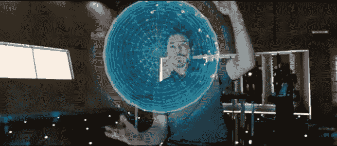
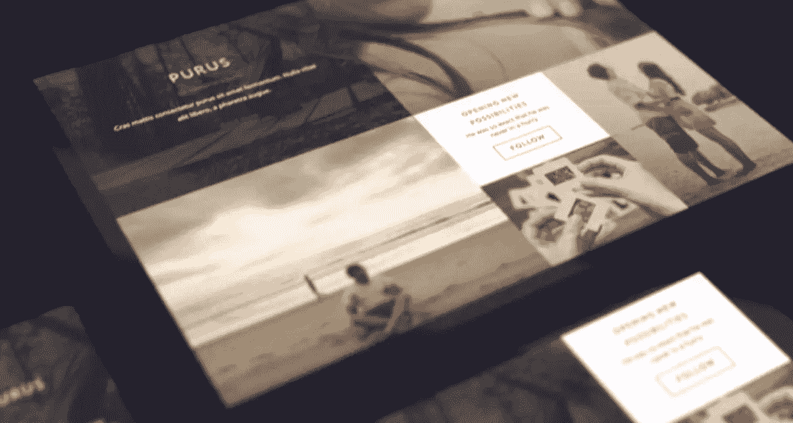
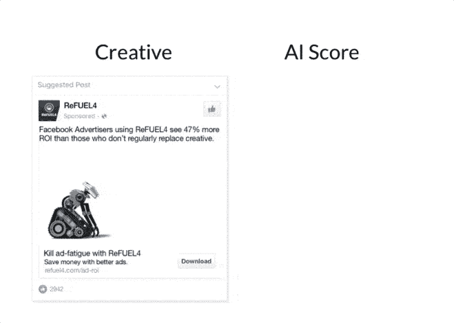
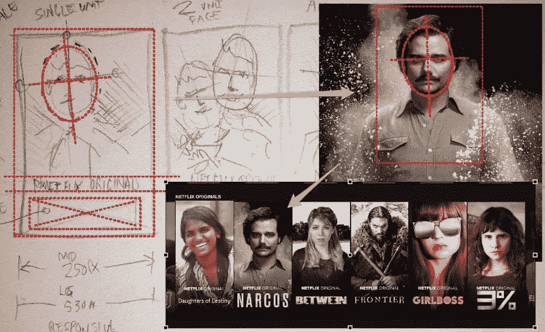

# 人工智能能解决你的 UX 设计问题吗？

> 原文：<https://www.sitepoint.com/artificial-intelligence-in-ux-design/>

马克·扎克伯格 2016 年的关键新年决心之一是打造自己的“[简单人工智能机器人](http://www.vanityfair.com/news/2016/12/mark-zuckerberg-spent-100-hours-building-his-own-robot-butler)”，帮助他做家务。还记得《钢铁侠》中管家贾维斯的形象吗？这是人工智能如何工作的经典好莱坞例子。

但是，人工智能到底是什么，它如何解决当今最常见的 UX 问题？

托尼·斯塔克利用贾维斯。

人工智能(或 AI)是一种高级的类似人类的计算机化系统，具有智能管理人类通常手动进行的活动和系统的能力。虽然像苹果的 Siri 和亚马逊的 Echo 这样的机器人被编程为承担我们最平凡的任务，但像谷歌的 *Deep Dream* 这样的机器人天生具有创造力，可以帮助用户解决问题，从而改善他们的体验。

人工智能正在多个实时场景中找到它的应用:

*   **处理数据爆炸**–随着智能手机和移动设备的出现，数据爆炸。随着数据量的增长，有一个人工智能系统来分析、处理、组织和解释数据是恰当的。
*   解读我们意图的能力——网飞可以从你的行为中预测什么样的电视节目或电影会让你粘在沙发上。想象一下，如果你的 AI 系统可以在你把车从车库开出来的时候调节你的车的温度并关灯。
*   **改善客户体验**–人工智能可以深入挖掘人眼可能会忽略的细节，并帮助您专注于正确的数据。例如， [RightClick.io](https://rightclick.io/#/) 是一个聊天机器人，通过让你参与对话来帮助你创建网站。即使你试图用不相关的问题转移注意力，这个人工智能设备也会让你回到网站创建的实际工作中。

RightClick.io

人工智能正在改变我们创造用户体验的方式。虽然像《终结者》这样的电影给了我们一个关于人工智能的反乌托邦想法，但现实是完全不同的。人工智能是一项强大的技术，可以积极影响消费者行为，使企业能够提供出色的用户体验。

## 了解人工智能在 UX 的作用

首先，让我们看几个现实生活中的场景，看看人工智能是如何影响今天的 UX 的。上下文智能聊天机器人可以通过迅速及时的建议或解决方案取悦您的客户。导航应用程序可以毫不费力地指引你到达目的地。只需轻轻点击几下，你就会在家门口收到你最喜欢的食物。

### 这是如何工作的？

开发人工智能的想法来自科幻小说，描述了可以说话、思考或感觉的机器。人工智能是几种新兴技术的结合——机器学习、深度学习、聊天机器人、增强现实、虚拟现实、机器人——仅举几例。

人工智能涵盖了将智能注入机器/设备的任何事情，以便它们模仿人类独特的推理能力。所有这些都可以通过使用能够发现人类行为模式并从设备接收和存储的数据中产生洞察力的算法来实现。人工智能设备或机器经过精心编程，以便支持未来的决策。

所有这些听起来可能很简单，但这些都是由快速发展的人工智能技术驱动的交互。事实上，当谈到人性化的客户体验时，人工智能将成为 UX 设计师工具箱中不可或缺的工具。然而，除了构建类似人类的对话和行为，人工智能在数字领域还可以做很多事情来生成出色的 UX。

## 1.合作的平台

随着机器人和机器人利用认知智能的力量培养类似人类的互动，人工智能正在成为主流。然而，机器人不能完全取代人类。相反，人工智能培育了 UX 领域富有成效的合作。

例如， [TheGrid.io](https://thegrid.io/) 是一个算法驱动的设计平台，可以让你建立令人印象深刻的优化网站。该平台是围绕连续 A/B 测试和优化布局的概念从头开始构建的。设计师可以筛选这种人工智能驱动的工具提供的多个选项，并选择适合他们的选项。

像任何好的助手一样，它通常在提供新的选择而不是做出关键决定时表现最好。当设计师有一个智能平台来帮助他们选择模板并通过应用算法来验证模板时，它可以帮助他们做出更具创造性的决策。

## 2.用人工智能绘制旅程地图

像 [ReFUEL4](https://www.refuel4.com/) 这样的公司利用预测分析的力量来了解用户的在线旅程，并根据他们的行为将他们划分为不同的群体。最强大的 UX 是理解甚至预测用户兴趣和行为的。

一旦设计者能够绘制出用户的旅程，他就可以理解用户在数字交互过程中应该走的路线。人工智能驱动的旅程地图允许您创建简单、迷人且有利可图的用户界面。

## 3.接手重复性的、低价值的创造性任务

在一个多设备的世界里，设计师经常需要设计许多图形和不同的内容来迎合多种形式的活动。这可能会让人精神麻木，需要很多时间。

网飞布局生成。

这就是为什么像网飞这样的平台会把这些繁琐的任务交给算法。人类设计师可以绘制出布局应该如何工作的“规则”,然后向系统提供原始图形元素库来处理。然后，网飞的系统能够将规则与图像资产结合起来，创建原创电影海报和横幅广告。

当 AI 处理这样的任务时，设计师可以更专注于理解用户的旅程并提炼这些规则。这就像一个高级设计师指导一个初级设计师团队的场景。彼此受益。

机器学习等人工智能技术使数字营销人员能够进行精确定位。例如，IBM 的 Watson 促进了心理用户细分，以便营销人员可以在正确的时间向正确的受众提供正确的内容。

### 沃森人工智能是这样工作的:

沃森将问题分解成不同的关键词或“句子片段”，以便发现统计上相关的短语。它不仅为这个操作创建了一个新的算法，而且同时执行数百个分析算法。

如果更多的算法独立得出相同的答案，那么沃森更有可能是正确的。一旦 Watson 获得了多个解决方案，它就会对照数据库验证潜在的解决方案，以确定其中是否有任何合理的解决方案。

## 你如何为一个更好的 UX 塑造 AI？

人工智能系统有能力快速分析大量数据，并实时学习和调整它们的行为。人工智能系统可以从上下文中进行推断，你需要以业务规则、问题、元数据和类似的其他条件的形式向它们提供额外的信息。

当你通过每个设计阶段来建立一个很好的用户体验时，你可以不断地改进你问你的 AI 系统的问题。这将改变它分析数据的方式。

例如，如果你在管理一个健康保险网站，问一些简单的问题，比如:

*   有多少 40-60 岁的人使用你的应用程序？
*   有多少准妈妈进入系统？

系统接受你的问题，分析数据，并学会给出最佳答案。每当你输入一个新的数据或标准，系统就会利用人工智能技术自我调节，以增强你的用户体验。

## 塑造 AI 的妙处在于:

*   你可以向你的人工智能系统提出一般到具体的问题。系统会回答你的问题，获取数据，并进行自我学习。

*   AI 可以分析你的搜索引擎上的所有查询，收集更多的用户分析，识别趋势，并生成更丰富的发现。

*   用数据改善搜索结果的质量——人工智能可以提出更好的预测搜索词，提供推荐，跨主题推荐(类似于亚马逊提供的内容)，并在顶部提供更多相关内容。

*   最重要的是，人工智能从每个到目前为止访问过你的应用程序的人那里学习，并为你的用户提供所需的内容。这为更丰富的用户体验铺平了道路。

*   AI-AI 信息架构分析您的内部和外部数据，并帮助您为内容管理系统构建信息结构，为最终用户构建导航结构。

用户体验不一定与利用数据洞察力有关，它也与智能有关。人工智能通过将智能注入不同的数据源来连接这些点。

尽管机器学习、聊天机器人、虚拟现实、机器人、增强现实和其他系统等人工智能技术正在获得动力，但这种增长似乎是渐进的。当人工智能与 UX 结合时，它将成为未来科技的标志。将人工智能与 UX 融合是一个公式，应该会让我们提高内容的可发现性和可到达性。

## 分享这篇文章