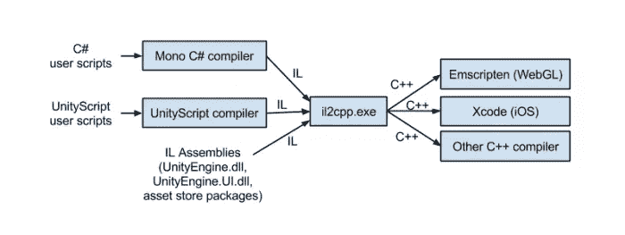
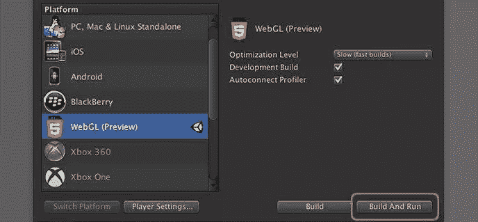
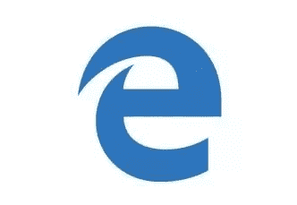
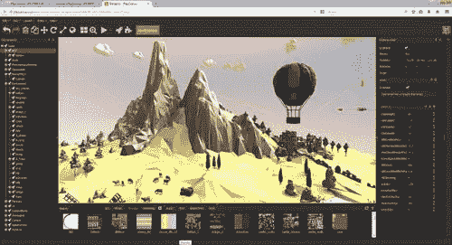
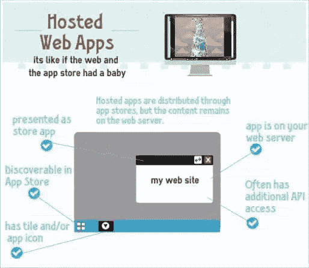

# 用于 Unity 和 Unreal 引擎的 Asm.js 和 WebGL

> 原文：<https://www.sitepoint.com/asm-js-and-webgl-for-unity-and-unreal-engine/>

本文是微软网站开发系列的一部分。感谢您对使 SitePoint 成为可能的合作伙伴的支持。

Unity 和 Epic 的虚幻引擎是游戏开发者经常使用的流行中间件工具，并不局限于创建作为可执行文件运行的编译应用程序。Unity 之前有一个[网络播放器](https://unity3d.com/webplayer?WT.mc_id=13413-DEV-sitepoint-article37)，这是一个使用 ActiveX 的可下载插件。Chrome 终止了对 NPAP(网景插件 API)的支持，但是[在一年前就宣布了。](http://blog.chromium.org/2014/11/the-final-countdown-for-npapi.html?WT.mc_id=13413-DEV-sitepoint-article37)

4 月，随着 Chrome 42 stable 的发布，[他们终于把斧子砍了。](http://arstechnica.com/information-technology/2015/04/chrome-starts-pushing-java-off-the-web-by-disabling-plugins/?WT.mc_id=13413-DEV-sitepoint-article37)原因有很多，但最明显的是他们陈述了“挂起、崩溃、安全事件和代码复杂性”。Google 建议使用 web 标准，比如 WebGL，我将在下面解释。

微软也紧随其后，弃用 ActiveX、VBScript、attachEvent 和其他传统技术，转而支持网络标准。HTML5 时代的功能大大减少了对 ActiveX 控件的需求，这也产生了跨浏览器的可互操作代码。

随着 WebGL 和 asm.js 的出现，开发人员现在可以在浏览器中利用其计算设备的大部分功能，并进入以前无法进入的市场。在本教程中，我将向您展示一部分“如何做”:

## 为什么要编译成 JavaScript？

JavaScript 是唯一适用于所有网络浏览器的语言。虽然只有 JavaScript 可以在浏览器中运行，但是你仍然可以用其他语言编写，并且仍然可以编译成 JavaScript，从而允许它也可以在浏览器中运行。这是由一种被称为 [emscripten](http://kripken.github.io/emscripten-site/?WT.mc_id=13413-DEV-sitepoint-article37) 的技术实现的。

Emscripten 是一个基于 LLVM 的项目，它将 C 和 C++编译成 asm.js 格式的高性能 JavaScript。简而言之:在浏览器内部，使用 C 和 C++，接近本地速度。更好的是，emscripten 将 OpenGL(一种桌面图形 API)转换为 WebGL，这是该 API 的 web 变体。

这段代码是怎么变成 WebGL 的？

Unity 最近也在 WebGL 上对他们的软件进行了一些性能测试。

然而，让代码交叉编译(通常也被称为*也是如此)并非没有陷阱。静态类型语言中常见的性能增强技术，如多线程(JS 是单线程的)和 SIMD(单指令多数据)还不可用。*

 *Mozilla 和其他几家领先的科技公司一直在研究 SIMD.js，因此提高性能和降低功耗可能是不久的将来的事情。点击此处了解更多信息。除了上面的那些性能调整，Unity 依赖于他们新的脚本运行时 IL2CPP(在第 2 行 C++)。这是另一个帖子的故事，但 Unity 每隔几周就会做一个[奇妙的网络系列](http://blogs.unity3d.com/2015/05/06/an-introduction-to-ilcpp-internals/?WT.mc_id=13413-DEV-sitepoint-article37)来说明 IL2CPP 是如何工作的。

IL2CPP 有两个不同的部分:

*   超前的(AOT)编译器
*   支持虚拟机(VM)的运行时库

的中间语言(IL)。NET 编译器通过 AOT 编译器编译成 C++源代码。服务和抽象，比如对线程和文件的独立于平台的访问以及垃圾收集器，是运行时库提供的一些好处。

这么看吧:

图片由 Unity 提供

当你运行。在 Windows 机器上，它实际上不是字节码(0 和 1)。它仍然是 VM 在运行时读取的二进制文件，然后被转换成字节码。Windows 机器上的 DotNet CLI 是可以读取该二进制文件的虚拟机的一个例子。除了二进制以外，CPU 不能理解任何东西，因此需要进行这个额外的步骤。

还在迷茫？这篇[文章解释了更多关于机器码、字节码和虚拟机的区别。](http://www.quora.com/What-are-the-differences-between-bytecode-and-machine-code)

## asm.js 如何融入画面？

Asm.js 是汇编 JavaScript 的缩写，是 JavaScript 的子集。无论是在现有的 JavaScript 引擎中运行，还是在能够识别和优化 asm.js 的超前(AOT)编译引擎中运行，asm.js 程序的行为都是一样的——当然，速度除外！

就速度而言，很难提供与本机代码相比的精确测量，但编译成 asm.js 的 C 程序的初步基准通常比 C、C++和 Obj-C 编程语言的编译器前端 clang 的本机编译慢 2 倍。需要注意的是，这是单线程程序的“最佳”情况。下面将详细介绍 JavaScript 语言的这种局限性。

在后端，Clang 使用 LLVM，这是一个用于构建、优化和产生中间和/或二进制机器代码(又是那些 0 和 1)的库。LLVM 可以用作一个编译器框架，您可以在其中提供“前端”(解析器和词法分析器，如 Clang)和“后端”(将 LLVM 表示转换成实际机器代码的代码)

延伸阅读:Mozilla 的 Alon Zakai 有一个[奇妙的幻灯片](http://kripken.github.io/mloc_emscripten_talk/#/?WT.mc_id=13413-DEV-sitepoint-article37)，它进一步详细介绍了这一切是如何工作的。

那么 asm.js 到底有多酷？它有自己的推特账号， [@asmjs](https://twitter.com/asmjs) 。虽然 [asm 站点有点稀疏](http://asmjs.org/)，但是除了有一个完整的 FAQ 之外，它确实涵盖了 W3C 规范。更好的是，Mozilla 协调了 [*不起眼的 Mozilla Bundle*](https://blog.mozilla.org/blog/2014/10/14/play-awesome-indie-games-directly-in-firefox-including-the-award-winning-ftl/)[I](https://blog.mozilla.org/blog/2014/10/14/play-awesome-indie-games-directly-in-firefox-including-the-award-winning-ftl/)n 2014，让你可以买到一堆利用了 asm.js 的 gamest

## 为什么不直接把你的 JavaScript 代码变成 asm.js 呢？

JavaScript 不能真正编译成 asm.js 并提供很多好处，因为它的动态特性。这与试图将它从[编译成 C](http://stackoverflow.com/q/5192223/1048572) 或者甚至从[编译成本地代码](http://stackoverflow.com/q/2962210/1048572)时的问题是一样的——有了它，一个 VM 就有必要处理那些非静态的方面。但是，您可以手工编写 asm.js。

如果人们已经能够以完全静态的方式翻译标准的 JavaScript，那么还需要有 *asm.js* 。Asm.js 的存在是为了保证 JavaScript 将变得更快，而无需开发人员的任何努力。对于 JIT 来说，理解动态语言和静态编译器是非常困难的。

为了更好地理解这一点，理解*为什么* asm.js 提供了性能优势是很重要的；或者为什么静态类型的语言比动态类型的语言性能更好。一个原因是“运行时类型检查需要时间”，一个经过深思熟虑的答案将包括优化静态类型代码的增强可行性。从静态类型语言如 C 语言发展而来的最后一个好处是，编译器在编译时知道每个对象的类型。

js 是 JS 的一个受限子集，可以很容易地转换成字节码。第一步需要将 JS 的所有高级特性分解成子集，以获得这个优势，这有点复杂。但是 JavaScript 引擎被优化和设计成将所有这些高级特性直接翻译成字节码——所以像 asm.js 这样的中间步骤并没有提供太多的优势。

## WebGL 在做什么？

WebGL (Web Graphics Library)是一个 JavaScript API，用于在任何兼容的 Web 浏览器中渲染交互式 3D 计算机图形和 2D 图形，而无需使用插件。WebGL 有三个明显的优势:

*   **任务**:绘制反光材料或复杂的灯光会产生大量的开销，鉴于 JavaScript 是单线程的且受 CPU 限制，为什么不将一些任务卸载到设备中的 GPU 上，让它来完成这些繁重的工作呢？

*   **性能**:利用硬件加速(你的设备内置的 GPU)，WebGL 非常适合游戏或复杂的可视化。

*   **着色器** : ** ** 复杂的视觉效果可以用被称为“着色器”的小程序来制作。这可能是简单的产生一个棕褐色的颜色效果，或更复杂的模拟，如水或火焰。请访问 [Shadertoy](https://www.shadertoy.com/) 查看一些真正突出这一点的例子。

当您[构建](http://docs.unity3d.com/Manual/PublishingBuilds.html/?WT.mc_id=13413-DEV-sitepoint-article37)一个 WebGL 项目时，Unity 将创建一个包含以下文件的文件夹:

*   一个*index.html*文件，将你的内容嵌入到网页中。
*   包含播放器代码的 JavaScript 文件。
*   答。mem 文件包含一个二进制映像，用于初始化播放器的堆内存。
*   答。包含资产数据和场景的数据文件。
*   一些支持 JavaScript 文件来初始化和加载播放器。

你也可以定制页面的风格来更好地适应你的游戏，尽管建议利用[全屏 API](http://davidwalsh.name/fullscreen) 来获得更身临其境的体验。

有兴趣学习 WebGL 吗？查看 [WebGL 学院](http://www.webglacademy.com/)的完整课程。

## WebGL 缺什么？

WebGL 是 OpenGL ES 规范的子集。这是你经常在移动设备上看到的图形 API，比如 Android 和 iOS 设备。ES(嵌入式系统)规范实际上是 OpenGL 的子集，OpenGL 是桌面机和游戏机(如 PlayStation 和 Wii)可用的图形 API。因为 WebGL 与 OpenGL 不是一对一的直接匹配，所以某些功能将会丢失。

这里有一个简短的列表，列出了目前 Unity games 的 WebGL 版本所没有的功能。预计这将随着时间的推移而改变。

*   物质纹理的运行时生成
*   电影文本
*   除 WWW 类之外的网络(有一个 WebSockets 插件可用)
*   支持网络摄像头和麦克风接入
*   硬件光标支持
*   大多数非基本音频功能
*   脚本调试
*   线
*   任何。需要动态代码生成的. NET 功能

## 浏览器支持呢？

这就是事情变得疯狂的地方。你可以在这里试用他们的两个 WebGL 演示。您需要使用支持 asm.js 的浏览器。在撰写本文时(2015 年 7 月)，asm.js 支持如下:

*   火狐浏览器
*   铬
*   [边缘](http://blogs.windows.com/msedgedev/2015/05/07/bringing-asm-js-to-chakra-microsoft-edge/?WT.mc_id=13413-DEV-sitepoint-article37)
*   旅行队

值得注意的是，asm.js 规范并没有在所有浏览器中 100%实现，所以结果会有所不同。不幸的是，asm.js 没有被列在流行的功能检查网站[CanIUse.com](http://www.caniuse.com/)上，所以很难清楚地了解它在每个浏览器中的支持程度。这在移动浏览器上无法工作，因为它们目前不支持 asm.js，尽管有几个支持 WebGL。2014 年 11 月，我写了一篇关于移动设备上 WebGL 现状的文章。

## 性能呢？

你可以在你的浏览器中尝试 Unity 的基准测试套件，看看他们的 C#到 JavaScript 的转换表现如何。这涵盖了从 Mandelbrot GPU 测试到 2D 物理学和粒子的一切。【2014 年 10 月，在微软的 Edge 浏览器发布之前，Unity 的这篇文章也强调了一些有趣的发现:

*   在几乎所有的基准测试中，带有 asm.js 的 Firefox 都比 Chrome 和 Safari 快，是目前运行 Unity WebGL 内容的最佳浏览器。

*   当您主要受限于 GPU 时，您可以预期 WebGL 的性能与本机代码非常相似。

*   **在某些领域，WebGL 实际上会明显胜过原生代码**。这是非常依赖脚本性能的测试的情况(Mandelbrot 和 CryptoHash，它们都用 C#实现了它们的算法)，因为 IL2Cpp 可以产生更优化的代码(本文中的[更多信息)。](http://blogs.unity3d.com/2015/05/06/an-introduction-to-ilcpp-internals/?WT.mc_id=13413-DEV-sitepoint-article37)

*   对于高度优化以使用多线程和/或 SIMD 的领域，如 3D 物理测试(Unity 5.0 中的 PhysX 3.3 现在完全是多线程的)，本机代码仍然比 WebGL 快几倍。相比之下，当将 Firefox 与 Native 进行比较时，2D 物理学非常接近奇偶校验(Box2D 不是多线程的)。我们希望未来会给 JavaScript 带来 SIMD 和多线程扩展，这一点可能会改变。

那么，作为开发者，这对你意味着什么呢？当然，在某些领域，WebGL 比本地代码慢得多，比如利用多线程的领域，但 WebGL 的性能相当不错，而且每天都在提高。事实上，致力于开发 web 标准的国际组织 W3C 刚刚宣布了 WebAssembly，这是一种新的 web 上安全代码的中间表示。简称“Wasm”，是一种新的低级安全代码的二进制语法，暂时将与 asm.js 并行运行。这将进一步提高浏览器中运行的 JavaScript 应用程序的性能。

Alon Zakai [在三月](https://hacks.mozilla.org/2015/03/asm-speedups-everywhere/)写了一篇文章，概述了 asm 和 JavaScript 的速度在过去的一年里在主流浏览器中是如何提高的。

## 为什么会有人想这么做？

这是一个很常见的问题。不过我听到最多的是 _“谁会想下载 60mb 的网站？_ 你说得对——60mb 对于一个网站来说太大了！但是我想每天从 YouTube 和网飞下载数十亿字节视频内容的人就是这些人。如果你把它看作一个网站，那么当然，它是巨大的。如果你把它看作一个游戏，60mb 是很小的！下面的案例研究很好地说明了这一点。

此外，作为一名开发者，你现在可以绕过应用商店的限制。想要更新您的应用程序吗？没问题，给你的网站推一个新版本。不想等到 iOS 应用商店的一周审批流程结束(也就是说，如果获得批准的话)？完美，推到自己的网站。

当然，你也可以在付费墙后面出售它；或者需要某种授权来播放该标题。此外，你不需要为应用程序商店支付年度许可费用，也不需要为他们的商店准备图像，为他们的桌面准备图标等。现在事情开始变得有吸引力了，而我们仅仅触及了表面。

看看伊利里亚德游戏公司的团队在他们的太空战斗游戏《上升时代》中做了什么。最初，它们只传输一小部分数据，在将额外的数据发送给你之前，这些数据只够你使用。我相信在我们最后一次谈话中，它是从 50mb 开始的。你可以在我和他们的播客中听到更多关于[的内容。](https://indiedevpodcast.wordpress.com/2014/12/14/episode-17-illyriad-games/?WT.mc_id=13413-DEV-sitepoint-article37)用户可以立即进入游戏。无需下载海量客户端，瞬间降低准入门槛。十几岁的我会喜欢这个在我的无尽的任务年。

相比之下，传统的游戏会在你开始玩之前就把所有的东西都发送给你。诚然，游戏机刚刚开始使用“分块”技术，这种技术将一个游戏分成更小的部分，然后开始下载你需要立即播放的部分。

Jonas Echterhoff 指出，在 Unity 中，通过使用 AssetBundles，流式资产已经成为可能。或者，您可以尝试此资产存储包，它重新打包 WebGL 构建数据，以便您的构建中的场景被拆分到多个文件中，并且您的内容可以在加载第一个场景后开始:

[https://www.assetstore.unity3d.com/en/#!/content/38368](https://www.assetstore.unity3d.com/en/#!/content/38368)

为了与太空模拟主题保持一致，我看了看《星际公民》，[它看起来大约有 100gb。](http://www.polygon.com/2015/3/12/8198615/star-citizens-client-will-be-a-100gb-download)您真的相信您会体验所有 100gb 的内容吗？

## 线下体验

只是因为你在指向一个 HTML5 的站点，并不意味着你不能有线下的体验。不相信我？看看这段视频，来自《T2 雪球》的创作者之一 Syd Lawrence。Syd 运行 [We Make Awesome Sh](http://wemakeawesomesh.it/) ，在他的演讲中，他展示了一些用 PhoneGap 制作的令人难以置信的应用，以及他在 2015 年 PhoneGap Day EU 上制作高性能 PhoneGap 应用的 7 大技巧，但特别强调了如何创建线下体验。

明智的做法是在你的应用中混合本地和远程内容。Microsoft Edge 支持的 IndexedDB、localStorage 和 AppCache 等技术允许这样做。本地页面可以保留在您的应用程序包中，仍然可以提供基本的离线体验。

## 案例研究:Owlchemy Labs 的 Aaaaa！从 Unity 转换为 asm.js

Owlchemy 实验室的团队将他们的游戏*aaaaaa！2014 年的*和[对这一过程进行了一次精彩的事后分析。](https://hacks.mozilla.org/2014/10/unity-games-in-webgl-owlchemy-labs-conversion-of-aaaaa-to-asm-js/)去年 6 月，他们使用 WebGL exporter 的 pre-alpha 版本，将所有 C#代码转换成一个 JavaScript 文件，该文件的代码长度超过了 100 万行！

*Aaaaa！*拥有超过 200 个关卡，运行时可以产生 300 多种资源，此外还有 38 首完整长度的歌曲。在 PC/mac 上，他们看到的是一个 388mb 的未压缩文件，所以你可以想象，每次有人想玩游戏时，都必须下载所有这些文件，这会有点麻烦。

他们最大的节省之一是 Unity 的 AudioClip 流媒体解决方案，它可以在运行时按需播放音乐。完成后，他们的最终压缩 WebGL 构建大小，包括所有加载的资产以及 Unity 引擎本身，最终为 wat 68.8 MB。压缩后的独立 PC 版本几乎是这个大小的 3 倍，为 192 MB。

当然，UX 需要做一些改变，包括重新绑定退出键，这在许多游戏中会显示暂停菜单，但在浏览器中会退出全屏模式释放鼠标锁定。此外，由于浏览器的安全模式迫使这些游戏进入沙盒，将大块数据保存到磁盘或从用户的硬盘加载自定义音频可能会有问题。

最后，考虑某种云同步功能也很重要，因为游戏玩家通常不会只在一台机器上玩网络游戏。对于消费者来说，从任何机器加载到他们的简档并让他们的设置/保存直接出现将会方便得多。

## 有没有其他中间件工具利用了这一点？

Epic 的虚幻引擎 4 导出到 WebGL，也利用了 asm.js。你可以在这里找到逐步说明。他们的流程与 Unity 的流程几乎相同，只是少了第一个 C#步骤，因为你在虚幻引擎中编写的代码已经在 C++中了。

Epic 目前的展示作品是 [Tappy Chicken](https://www.unrealengine.com/html5/) ，这是一款 Tappy Bird 类型的游戏，也可以在 iOS 和 Android 上使用。他们在 GDC 2014 上首次展示了 UE 4 在 Firefox 中的工作情况:

在前年的 GDC 上，Mozilla 和 Epic 在他们的一次会谈中让所有人大吃一惊，他们透露 UDK(虚幻引擎 3)在他们的 Epic Citadel 演示工作仅一周后就可以在浏览器中工作了。

来自 NomNom Games 的 Monster Madness 是第一款在网络上发布的商业虚幻引擎 3 游戏，使用 asm.js 。

## 未来会怎样？

WebGL 不仅限于游戏。应用程序也可以很容易地利用这项技术。

一睹虚幻巴黎 1.2 演示的风采，用户可以在精心设计的公寓中穿行。[(下载链接)](http://www.benoitdereau.com/UnrealParis_-_1.2.rar)

想象一下，作为一名建筑师或设计师，试图向客户推销这一点。你可以在浏览器中运行它。更好的是，用户不需要下载整个应用程序。

看看类似[的上升时代。](http://www.ageofascent.com/)下载 54 Mb，你就可以开始播放应用程序了，因为它只播放你需要的内容*，然后*可以使用 [IndexedDB](https://developer.mozilla.org/en-US/docs/Web/API/IndexedDB_API) 等技术将其缓存在本地，所以你不需要再次下载。用户可以在几秒钟内启动并运行。去年 12 月，我在 Ilyriad games 采访了这个团队，以便更好地了解他们是如何整合技术的。

另一方面，我们有起始容量为 70Gb 的 [Star Citizen](https://robertsspaceindustries.com/) 。这对许多人来说是一个巨大的障碍，尤其是在他们可能没有快速宽带的地方。

对于那些可能不想使用 C 或 C++编写应用程序的开发人员来说，您仍然可以使用 WebGL 框架并用 JavaScript 编写。BabylonJS 就是这样一个例子，它包括一个用于 2D 和 3D 应用的物理引擎，以及将所有输入类型(点击、触摸、笔)汇集成指针事件的 handJS。

## 有其他选择吗？

但是当然！PlayCanvas 是一个奇妙的基于 WebGL 的框架，它使用 asm.js 来处理物理问题。更好的是，它有出色的文档和教程，以及基于浏览器的编辑器。

对于此类工具，您需要使用某种包装器(如 Cordova 或 PhoneGap)将其移植到应用商店，如 Google Play、app store 或 Windows Marketplace。ManifoldJS。

ManifoldJS 旨在通过利用 [Web 应用清单](https://www.w3.org/TR/appmanifest/)，让网站声明类似应用的属性，让移动开发者的生活比以往任何时候都更容易。ManifoldJS 为支持它的平台使用该标准，但为不支持它的平台使用 Cordova。科尔多瓦很棒，但 W3C 也考虑了 Mozilla (Firefox 开放网络应用)、谷歌(Chrome 托管应用)和微软所做的工作(Windows 8 有本地网络应用，Windows 10 扩展到托管网络应用)。这样，我们现在可以包装网站并创建可以部署在各种应用程序商店中的混合应用程序，同时仍然可以利用每个设备的许多本机功能(联系人、日历、文件存储、陀螺仪、GPS 等)。)

杰夫·布尔托夫特在 http://www.thishereweb.com/hosted-web-apps-explained/非常好地解释了托管网络应用

当我们将两者结合起来时，我们可以以本地速度创建应用程序，这些应用程序可以部署在许多应用程序商店中，并且主要利用一个代码库。移动开发没有灵丹妙药，但这无疑使过程变得更容易。

## 结论

Unity [概述了将您的标题](http://docs.unity3d.com/Manual/webgl-gettingstarted.html)导出到其文档中的 WebGL 播放器的过程。浏览器对 WebGL 和 asm.js 的支持正在不断改进，Firefox 甚至在今年早些时候的游戏开发者大会上展示了 [WebGL 2.0 的特性。WebGL 2.0 带来了许多改进，包括一次渲染多达 32 个纹理的能力，而不是当前的 8 个标准，此外，开发人员还可以访问抗锯齿和多个渲染目标。](https://blog.mozilla.org/futurereleases/2015/03/03/an-early-look-at-webgl-2/)

将 Unity 游戏移植到 WebGL 有很多好处:

*   通过策划的应用商店之外的来源分发
*   通常是较小的包装尺寸
*   轻松演示或分享项目

开发人员已经证明了该模型的有效性，如 _ Aaaaa 所示！_ Case study 和 Mozilla Humble Bundle，所以这是一个利用浏览器最终提供的功能并增加您的作品曝光率的好时机。

## JavaScript 的更多实践

这篇文章是微软技术倡导者的 web 开发系列的一部分，内容涉及实用的 JavaScript 学习、开源项目和互操作性最佳实践，包括[微软 Edge](http://blogs.windows.com/msedgedev/2015/05/06/a-break-from-the-past-part-2-saying-goodbye-to-activex-vbscript-attachevent/?WT.mc_id=13413-DEV-sitepoint-article37) 浏览器和新的 [EdgeHTML 渲染引擎](http://blogs.windows.com/msedgedev/2015/02/26/a-break-from-the-past-the-birth-of-microsofts-new-web-rendering-engine/?WT.mc_id=13413-DEV-sitepoint-article37)。

我们鼓励您使用 [dev.modern.IE](http://dev.modern.ie/tools/?utm_source=SitePoint&utm_medium=article37&utm_campaign=SitePoint) 上的免费工具跨浏览器和设备进行测试，包括 Windows 10 的默认浏览器 Microsoft Edge:

*   [扫描你的网站，寻找过时的库、布局问题和可访问性](http://dev.modern.ie/tools/staticscan/?utm_source=SitePoint&utm_medium=article37&utm_campaign=SitePoint)
*   [在 Mac、Linux 和 Windows 上使用虚拟机](http://dev.modern.ie/tools/vms/windows/?utm_source=SitePoint&utm_medium=article37&utm_campaign=SitePoint)
*   [在您自己的设备上远程测试 Microsoft Edge](https://remote.modern.ie/?utm_source=SitePoint&utm_medium=article37&utm_campaign=SitePoint)
*   GitHub 上的编码实验室:跨浏览器测试和最佳实践

来自我们的工程师和布道者的关于 Microsoft Edge 和 Web 平台的深入技术学习:

*   【2015 年微软 Edge 网络峰会(对新浏览器、新支持的网络平台标准以及来自 JavaScript 社区的演讲嘉宾有何期待)
*   哇，我可以在 Mac 电脑上测试 Edge & IE 浏览器& Linux！(来自雷伊·班戈)
*   [在不破坏网络的情况下推进 JavaScript】(来自 Christian Heilmann)](http://channel9.msdn.com/Events/WebPlatformSummit/2015/Advancing-JavaScript-without-breaking-the-web/?WT.mc_id=13413-DEV-sitepoint-article37)
*   使网络正常工作的边缘渲染引擎(Jacob Rossi)
*   [用 WebGL 释放 3D 渲染](https://channel9.msdn.com/Events/WebPlatformSummit/2015/Unleash-3D-rendering-with-WebGL-and-Microsoft-Edge/?WT.mc_id=13413-DEV-sitepoint-article37)(来自大卫·卡图赫，包括[伏龙。JS](http://vorlonjs.com) 和 [babylonJS](http://babylonjs.com) 项目)
*   [托管网络应用和网络平台创新](https://channel9.msdn.com/Events/WebPlatformSummit/2015/Hosted-web-apps-and-web-platform-innovations/?WT.mc_id=13413-DEV-sitepoint-article37)(来自律师奶爸和基里尔·赛克谢诺夫，包括[流形。JS](http://manifold.js.com) 项目)

为网络平台提供更多免费的跨平台工具和资源:

*   [适用于 Linux、MacOS 和 Windows 的 Visual Studio 代码](https://code.visualstudio.com/?WT.mc_id=13413-DEV-sitepoint-article37)
*   [用节点编码。JS](https://www.microsoftvirtualacademy.com/en-US/training-courses/building-apps-with-node-js-jump-start-8422/?WT.mc_id=13413-DEV-sitepoint-article37) 和[在 Azure 上免费试用](https://azure.microsoft.com/en-us/pricing/free-trial/?WT.mc_id=13413-DEV-sitepoint-article37)

## 分享这篇文章*