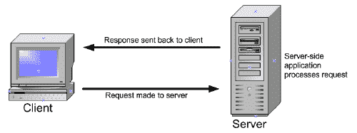
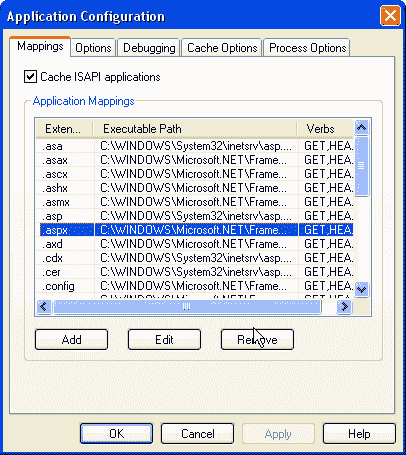
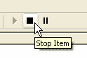
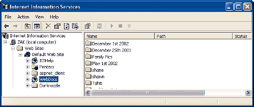
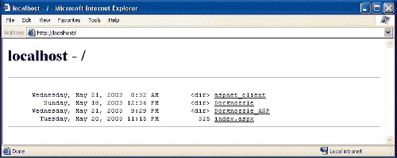
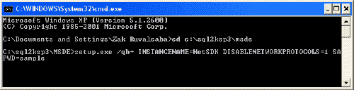
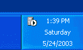
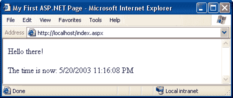

# 用 C#和 VB 建立自己的 ASP.NET 网站。网络:第一章

> 原文：<https://www.sitepoint.com/asp-dot-net-introduction/>

这篇文章写于 2004 年，至今仍是我们最受欢迎的帖子之一。如果你渴望了解更多关于 ASP.NET 的信息，你可能会对这篇最近关于 ASP.NET 4.5 的文章很感兴趣。

ASP.NET 是当今应用最广泛的 Web 应用平台之一。因此，作为一名 Web 开发人员，扩展您的技能并了解某项技术的来龙去脉变得越来越重要，这项技术现已被埃森哲、康柏、AIG、新斯科舍银行、Adobe、戴尔、福特和许多其他公司所采用。

这一系列涵盖了新的基础知识(或实践)。NET 开发人员将需要知道之前，他们正在开发一个网站在 ASP.NET。它由 4 条组成:

## 第一章:介绍。网

这一章以提问开始，“什么是。网？”以及，“什么是 ASP。网？”然后，它继续解释你需要什么开始，以及如何安装所有必要的软件。最后，开发您的第一个 ASP.NET 页面！本章从下面开始。

## [第二章:ASP.NET 基础知识](https://www.sitepoint.com/article/asp-dot-net-basics)

卷起袖子—现在是时候说正经的了，我们将开始详细讨论您在进入. NET 世界时需要了解的基本概念。我们将讨论 ASP.NET 页面结构，并了解视图状态。我们还将了解使用指令所涉及的内容，并讨论不同的 ASP.NET 语言。在这个过程中，你会看到大量的实际例子。

## [第三章:VB.NET 和 C#编程基础知识](https://www.sitepoint.com/web/)

这一期更仔细地观察了两个最流行的。网络语言——c#和 VB.NET。首先，我们将通过几个例子来说明应用于这些语言编程的基本原则，如控件和页面事件、变量、数组、函数、运算符、条件等等。最后，当我们仔细观察代码隐藏时，我们讨论面向对象编程的概念和将设计与内容分离的哲学。

## 第 4 章:Web 窗体和 Web 控件

## 这本书

这四章是我新书的摘录。*使用 C#和 VB.NET 建立自己的 ASP.NET 网站*不仅包含上述 4 章，还包含 13 章，这些章节将带你了解使用这些技术建立自己的动态电子商务网站所需的实用知识。这些章节涵盖了一切，从数据库设计和开发的基础，通过 ADO.NET，安全和用户认证，与文件和电子邮件，以建立自己的 ASP.NET 购物车和消费 XML Web 服务。这本书还附带了三个非常方便的参考，涵盖了 HTML 控件、Web 控件和验证控件。

如果你喜欢阅读 Adobe Acrobat PDF 版本的信息，你可以[免费下载这 4 章](/books/aspnet1/signoff.php "Access the download throught this popup")。

## 您的反馈

如果您对本系列中的任何信息有疑问，快速回复的最佳机会是在 SitePoint.com 论坛上发布您的问题。特别欢迎您提出改进建议以及您可能发现的任何错误(一两个可能已经漏掉了)——将这些提交给 [SitePoint 图书支持](https://www.sitepoint.com/books/contact.php)。

现在，没有更多的麻烦，让我们开始建立你的 ASP.NET 网站！

## 使用 c# & VB.NET 建立你自己的 ASP.NET 网站，第 1 章-简介。网络与 ASP.NET

它被吹捧为“下一个大事件”微软已经在营销、广告和开发上投入了数百万美元，以生产它认为是未来互联网的基础。这是一个公司倡议，其战略被认为是如此重要，以至于微软董事长兼首席执行官比尔盖茨本人决定亲自监督其发展。微软声称，这项技术将在未来几年彻底改变公司在全球开展业务的方式。2000 年 7 月，在佛罗里达州奥兰多举行的专业开发人员会议(PDC)上，盖茨在他的开幕词中指出，这种规模的转变每五到六年才出现一次。这是什么停秀技术？是. NET。

## 什么是。网？

。NET 是微软软件开发产品完全重组的结果，也是该公司交付软件即服务新战略的一部分。关键特征是。净报价包括:

*   **。NET 平台:**。NET 平台包括。NET 框架和工具来构建和操作服务、客户端等等。ASP.NET，这本书的重点，是其中的一部分。NET 框架。
*   **。净产品:**。NET 产品目前包括 MSN.NET，Office.NET，视觉 Studio.NET，和 Windows Server 2003，最初被称为 Windows。NET 服务器。这套经过广泛修改的系统为开发人员提供了一个友好、可用的环境，在这个环境中，他们可以用包括 C++在内的一系列编程语言创建应用程序。NET、Visual Basic.NET、ASP.NET 和 C#。因为所有这些产品都是建立在。NET，它们都共享关键组件，在它们的基本语法下，你会发现它们有很多共同点。
*   **。NET My Services:** 一项原名为“冰雹风暴”的倡议。NET My Services 是一组 XML Web 服务(如果您还不知道什么是 Web 服务，请不要担心。我将在《第 17 章，XML Web Services》中对它们进行解释。)目前由许多合作伙伴、开发人员和组织提供，他们希望为设备和应用程序以及互联网构建企业服务和应用程序。我的服务集合目前扩展到 passport、messenger、通讯录、电子邮件、日历、个人资料、列表、钱包、位置、文档存储、应用程序设置、喜爱的网站、拥有的设备以及接收提醒的首选项。

这本书关注的是。NET 框架:ASP.NET。

## 什么是 ASP.NET？

多年来，动态服务器页面(ASP)一直是 Web 开发人员在 Windows Web 服务器上构建动态网站的首选。ASP 通过几种语言提供简单灵活的脚本而广受欢迎。这一点，再加上它内置于每一个基于微软视窗系统的网络服务器中，使得 ASP 很难被效仿。

2002 年初，微软发布了其用于互联网开发的新技术。最初被称为 ASP+，最终以 ASP.NET 的名字发布，它代表了 ASP 在复杂性和开发人员的生产力方面的一个飞跃。它继续在其支持的语言方面提供灵活性，但现在开发人员可以在几种成熟的编程语言之间进行选择，而不是一系列简单的脚本语言。在 ASP.NET 开发不仅需要理解 HTML 和 Web 设计，还需要牢固掌握面向对象编程和开发的概念。

在接下来的几节中，我将向你介绍 ASP.NET 的基本知识。我将带您在 Web 服务器上安装它，并通过一个简单的动态示例演示 ASP.NET 页面是如何构建的。首先，让我们定义一下 ASP.NET 到底是什么。

**ASP.NET 是一种基于微软开发 Web 应用的服务器端技术。NET 框架**。让我们打破那个充满术语的句子。

**ASP.NET 是服务器端**；也就是说，它运行在 Web 服务器上。大多数网页设计师从学习客户端技术开始，比如 HTML、JavaScript 和层叠样式表(CSS)。当 Web 浏览器请求使用客户端技术创建的网页时，Web 服务器只需获取浏览器(客户端)请求的文件，然后将它们发送出去。客户端完全负责读取文件中的代码，并解释它以在屏幕上显示页面。像 ASP.NET 这样的服务器端技术是不同的。服务器端代码(例如，ASP.NET 页面中的代码)不是由客户端解释，而是由 Web 服务器解释。在 ASP.NET 的情况下，页面中的代码由服务器读取，并动态地用于生成标准的 HTML/JavaScript/CSS，然后发送到浏览器。因为 ASP.NET 代码的所有处理都发生在服务器上，所以它被称为服务器端技术。如图 1.1 所示，用户(客户端)在浏览器中只能看到 HTML、JavaScript 和 CSS。服务器(和服务器端技术)完全负责处理页面的动态部分。


**图 1.1。Web 服务器负责处理服务器端代码，并将输出呈现给用户(客户端)。**

ASP.NET 是一种开发网络应用的技术。Web 应用程序只是动态网站的一个花哨名称。Web 应用程序通常(但不总是)将信息存储在 Web 服务器上的数据库中，并允许网站的访问者访问和更改这些信息。已经开发了许多不同的编程技术和支持的语言来创建 Web 应用程序；PHP、JSP(使用 Java)、CGI(使用 Perl)和 ColdFusion(使用 CFML)只是其中比较流行的几种。然而，ASP.NET 并没有把你束缚在特定的技术和语言上，而是让你使用各种熟悉的编程语言来编写 Web 应用程序。

最后，**ASP.NET 是基于微软。NET 框架**。的。NET Framework 将构建 Windows 应用程序、Web 应用程序和 Web 服务所需的所有技术收集到一个软件包中，该软件包包含二十多种编程语言。要使用 ASP.NET 开发网站，您需要下载。NET Framework 软件开发工具包，我将在接下来的几节中引导您了解它。

即使所有的行话都不再神秘，你可能仍然在想:是什么让 ASP.NET 如此优秀？与构建 Web 应用程序的其他选择相比，ASP.NET 具有以下优势:

*   ASP.NET 允许你使用你最喜欢的编程语言，或者至少是一种非常接近它的语言。的。NET 框架目前支持二十多种语言，其中四种可用于构建 ASP.NET 网站。
*   ASP.NET 页面是*编译*，而不是解释。ASP.NET 不是在每次请求动态页面时都读取并解释代码，而是将动态页面编译成高效的二进制文件，服务器可以非常快速地执行这些文件。与该技术的前身 ASP 相比，这代表了性能上的一大飞跃。
*   ASP.NET 可以完全使用的功能。NET 框架。内置了对 XML、Web 服务、数据库交互、电子邮件、正则表达式和许多其他技术的支持。NET，这样你就不用重新发明轮子了。
*   ASP.NET 允许您将页面中的服务器端代码从 HTML 布局中分离出来。当您与一个由程序员和设计专家组成的团队一起工作时，这种分离非常有帮助，因为它允许程序员修改服务器端代码，而无需踩在设计人员精心制作的 HTML 上，反之亦然。

有了所有这些优势，ASP.NET 相对来说没有什么不利之处。事实上，我想到的只有两个:

*   ASP.NET 是微软的技术。虽然这本身不是问题，但它确实意味着，至少现在，你需要使用 Windows 服务器来运行 ASP.NET 网站。如果你的组织使用 Linux 或其他操作系统作为它的网络服务器，你就不走运了。
*   严肃的 ASP.NET 开发需要对面向对象编程的理解，这一点我们将在接下来的几章中讨论。

还和我在一起吗？太好了！是时候收集工具，开始建设了！

## 我需要什么？

目前，如果你要学习 ASP.NET，你需要一个基于 Windows 的网络服务器。开源倡议正在进行中，以生产将在其他操作系统上运行的 ASP.NET 版本，如 Linux 然而，预计这些产品暂时不会以稳定的形式出现。

虽然开发人员可以选择在 Windows 95、98 或 ME 上试用 ASP，使用 IIS 的缩小版，称为个人 Web 服务器(PWS ),但 ASP.NET 需要真正的东西。在开始之前，您至少需要一台装有 Windows 2000 Professional 的计算机。Windows XP Professional 也能很好地工作，任何 Windows 2000 Server 软件包和 Windows 2003 Server 也一样。

除此之外，您所需要的就是足够的磁盘空间来安装 Web 服务器 Internet 信息服务(18 MB)。NET 框架 SDK(其中包括 ASP.NET；108 MB)和一个文本编辑器。记事本或 [Web Matrix](http://www.asp.net/webmatrix/) 将很适合开始，并且肯定是这本书所需要的全部。然而，如果你对 ASP.NET 很认真，你可能会想投资一个像 [Visual Studio 这样的开发环境。网](http://msdn.microsoft.com/vstudio/)。

## 安装所需的软件

本节将介绍本书所需软件的必要安装和配置，包括:

*   **互联网信息服务(IIS)** : IIS 是我们将要使用的 Web 服务器。安装和配置时，您需要您的 Windows CD。
*   **现代网络浏览器**:您可以使用任何符合标准的现代浏览器来测试您的工作。在本书中，我们将使用 Internet Explorer 6。
*   **The。NET Framework 可再发行版**:正如你在本章中已经了解到的。NET 框架是 ASP.NET 的驱动力。安装。NET Framework 安装运行 ASP.NET 所需的文件。
*   **The。NET 框架 SDK** :这个。NET 框架软件开发工具包(SDK)包含必要的 Web 应用程序开发工具、用于纠错的调试器、MSDE 中的开发数据库引擎以及一套示例和文档。

我们还需要一个数据库。在本书中，我们将使用:

*   Microsoft Access 是一种廉价且易于使用的替代产品，可以单独购买，也可以从 Microsoft Office CD 安装。

或者，您可以使用:

*   **微软 SQL Server 桌面引擎(MSDE)** : SQL Server 是 Access 等小型数据库的企业替代产品。如果您在一家以公司数据为命脉的公司工作，那么 SQL Server 是最佳选择。MSDE 是一个免费的 SQL Server 精简版，可以用于开发目的。
*   Web 数据管理员:如果你要使用 MSDE，那么你需要一个工具来修改数据库中的数据。Web Data Administrator 是微软免费的基于 Web 的数据库管理工具。

## 安装 Internet 信息服务(IIS)

即使最终站点不在本地托管，是否也需要在本地安装 IIS？答案是:可以。即使您通过 FTP 将 Web 应用程序上传到 Web 主机，安装 IIS 也允许您在部署之前在本地查看、调试和配置应用程序。

IIS 随大多数支持服务器的 Windows 操作系统版本一起提供，包括 Windows 2000 Professional、server 和 Advanced Server、Windows XP Professional 和 Windows Server 2003，但它不会在所有版本中自动安装，这就是它可能不在您的计算机上的原因。要查看您是否安装并运行了 IIS，只需导航到您的管理工具菜单并检查 Internet 信息服务是否是一个选项。Windows 2000 Professional 的用户可以在他们的控制面板中找到管理工具，而 XP 和 Server family 用户在他们的开始菜单中也有快捷方式。

如果快捷方式不可见，那么您没有安装它。要安装 IIS，只需按照下列步骤操作:

1.  在控制面板中，选择添加或删除程序。

3.  选择添加/删除 Windows 组件。组件列表将在几秒钟内可见。

5.  在组件列表中，选中 Internet 信息服务(IIS)。

7.  单击下一步。Windows 提示您插入 Windows CD 并安装 IIS。

一旦安装了 IIS，请关闭“添加或删除程序”对话框。您可以通过查看是否能在管理工具菜单中找到 IIS 来检查它是否已正确安装。可以的话就装了。

您现在已经准备好开始托管 Web 应用程序了。虽然我们不会讨论外部使用的 IIS 的配置，但是我将向您展示如何配置 IIS 来支持 ASP.NET 应用程序的本地开发，以便以后可以将它们上传到您的外部 Web 托管提供商。

## 正在安装 Internet Explorer

作为 Windows 用户，您默认安装了 Internet Explorer，但我建议您至少运行 5.5 版。您可以通过从“帮助”菜单中选择“关于 Internet Explorer”来检查您的版本。

如果您的 Internet Explorer 版本低于 5.5，您可以从 [Internet Explorer 网站](http://www.microsoft.com/windows/ie/)免费下载最新版本(撰写本文时为 SP1 版本 6)。请记住，虽然 ASP.NET 将与旧版本的 IE 兼容，但 ASP.NET 的某些功能在最新版本上运行得最好。

Internet Explorer 网站不允许您安装自己选择的版本；它只允许你下载最新的版本。因为最新版本的 Internet Explorer 将包含最新的补丁程序，所以坚持使用他们提供的补丁程序是一个好主意。

## 安装。NET 框架和 SDK

要开始创建 ASP.NET 应用程序，您需要安装。NET 框架和 SDK。的。NET Framework 包括运行和查看 ASP.NET 页面所需的文件，而。NET Framework SDK 包括示例、文档和各种免费工具。

的。NET Framework SDK 还为您提供了安装 MSDE 的能力，这是本书可以使用的免费数据库服务器。一旦。NET 框架和 SDK 已经安装，开始使用 ASP.NET 只需要做很少的工作。的。如果你有幸运行 Windows，那么. NET Framework 是作为操作系统的一部分安装的。NET Server 2003，在这种情况下，您可以直接跳到安装 SDK。如果没有，您需要下载。NET 可再发行软件包，大约 21 MB，包含运行 ASP.NET 应用程序所需的文件。

去发展。NET 应用程序，您还需要安装软件开发工具包，它包括必要的工具以及示例和文档。请注意。NET Framework SDK 的大小是 108 MB，请做好等待的准备！

***警告***

*安装。NET Framework 会阻止您的应用程序正常工作。*

**下载并安装可再发行软件**

获取。NET 框架是直接从网上下载并安装的。要做到这一点，只需遵循以下步骤:

1.  前往位于[http://www.asp.net/](http://www.asp.net/)的 ASP.NET 支持网站，点击下载链接。

3.  点击下载。NET Framework Redist Now 链接。请记住，我们将首先安装可再发行软件，然后我们将安装 SDK。该链接将带您进入下载页面。

5.  选择您想要的安装语言版本，然后点按“下载”。

7.  出现提示时，选择保存将文件保存到本地目录。

9.  下载完成后，双击可执行文件开始安装。

11.  按照提供的步骤操作。直到安装完成。

**下载并安装 SDK**

现在您已经安装了可再发行软件，您需要安装软件开发工具包(SDK):

1.  前往位于[http://www.asp.net/](http://www.asp.net/)的 ASP.NET 支持网站，点击下载链接。

3.  点击下载。NET 框架 SDK 现在链接。该链接将带您进入下载页面。

5.  选择要使用的安装语言版本，然后单击下载，就像下载可再发行软件一样。

7.  出现提示时，选择保存将文件保存到本地目录。

9.  下载完成后，双击可执行文件开始安装。在此之前，我强烈建议您关闭所有其他程序，以确保安装顺利进行。

11.  按照。直到安装完成。/#伊莱#

SDK 的安装时间比可再发行版稍长。一旦完成，检查它是否存在于你的程序菜单中；导航到开始>程序> Microsoft。NET 框架 SDK。

## 配置 IIS

尽管在开始使用 IIS 之前只需要做一些配置，但是我将使用这一部分来介绍 IIS 中的一些基本特性和功能:

*   确定 ASP.NET 是否安装正确
*   确定文件在 Web 服务器上的位置
*   使用本地主机
*   如何启动和停止 Web 服务器
*   如何创建新的虚拟目录并修改其属性

**确定 ASP.NET 安装是否正确**

一旦在您的计算机上安装了 IIS，您可以通过从“管理工具”菜单中选择“Internet 信息服务”来打开它。第一项任务是确保安装时 ASP.NET 已集成到 IIS 中。NET 框架。尽管从逻辑上讲，ASP.NET 应该自动安装，因为它是。NET Framework，有时候不是。不要对此感到惊慌——这是经常发生的事情，在 Microsoft 知识库中有解决方法。您可以通过以下步骤确定 IIS 是否安装正确:

1.  如果您还没有打开 IIS，请打开它，然后单击计算机名称旁边的+符号。

3.  右键单击默认网站并选择属性。

5.  导航至“文档”选项卡。如果 default.aspx 出现在列表中，则 ASP.NET 安装正确。

检查 ASP.NET 安装是否正确的另一种方法是按照下列步骤操作:

1.  通过右键单击根网站节点(您的计算机名称)并选择“属性”,导航到“应用程序映射”菜单。

3.  选择主目录选项卡，然后选择配置。

5.  应用程序映射菜单显示了所有的扩展及其相关的 ISAPI 扩展 dll，如图 1.2 所示。


**图 1.2。如果 ISAPI 扩展 DLL 出现在应用程序映射菜单中，那么 ASP.NET 安装正确。**

因为我可以想象你非常想知道什么是 ISAPI 扩展 DLL，让我解释一下。你可能知道 DLL 是一个*动态链接库*，它本质上是一个独立的代码模块，任何数量的应用程序都可以使用。当 Web 服务器托管动态网站时，页面请求必须由服务器上运行的程序代码处理，然后才能将结果 HTML 发送回请求浏览器(客户端*)。现在，就像传统的 ASP 一样，ASP.NET 在它的*互联网服务器应用程序编程接口(ISAPI)* 扩展 DLL 的帮助下执行这个处理。ISAPI 允许 Web 请求通过 Web 服务器由 DLL 处理，而不是像*通用网关接口(CGI)* 页面那样由 EXE 处理。这种方法很有优势，因为 dll 比可执行文件更高效，需要的资源和内存也少得多。IIS 使用所请求页面的文件扩展名来确定哪个 DLL 应该根据上面屏幕截图中显示的映射来处理请求。因此，我们可以看到，以`.aspx, .asmx,`或`.ascx`结尾的页面，以及其他页面，现在将由 IIS 传递给 ASP.NET DLL(`aspnet_isapi.dll`)进行处理。好了，技术话题说够了。让我们回到正题！*

 *如果您得出的结论是 ASP.NET 没有安装在您的计算机上，您必须从命令提示符手动安装它:

1.  通过选择开始>运行打开命令提示符，键入 CMD，然后选择确定。

3.  键入以下命令(全部在一行中)在 Windows 2000 Professional、Server 或 Advanced Server 上安装 ASP.NET:

```
C:WINNTMicrosoft.NETFrameworkveraspnet_regiis.exe -i
```

或者在 Windows XP Professional 上:

```
C:WINDOWSMicrosoft.NETFrameworkveraspnet_regiis.exe -i
```

在这些命令中，`*ver*`是对应于版本的目录。您已经安装了. NET Framework。

*   一旦 ASP.NET 安装，关闭命令提示符，并再次检查，以确认 ASP.NET 安装是否正确。

如果仍未安装，请尝试访问[微软知识库](http://support.microsoft.com/)寻求帮助。

我的文件放在哪里？

既然您已经安装并运行了 ASP.NET，让我们来看看您的 Web 应用程序文件保存在计算机的什么地方。您可以设置 IIS 在您选择的任何文件夹中查找 Web 应用程序，包括`My Documents`文件夹甚至是网络共享。默认情况下，IIS 将服务器上 C:Inetpub 的`wwwroot`子文件夹映射到您的网站的根目录，它通常被认为是存储和管理您的 Web 应用程序的良好存储库。

如果您在 Windows 资源管理器中打开这个`wwwroot`文件夹，并将其与出现在 IIS 控制台左侧的文件夹树进行比较，您会注意到资源管理器中的文件夹也出现在您的默认网站节点下。请注意，虽然这些文件夹中有几个在 IIS 视图中有常规的资源管理器文件夹图标，但其他文件夹有特殊的 Web 应用程序图标，表示这些文件夹包含特定 Web 应用程序的页面和其他项目。这些特殊的文件夹就是 IIS 所说的虚拟目录*，事实上，它们不必共享它们映射到的物理文件夹的名称。我们很快会看到更多的内容。*

 ***使用本地主机**

通过把你的文件放在`C:Inetpubwwwroot`中，你已经给了你的网络服务器访问它们的权限。如果你已经开发网页很长时间了，习惯可能会驱使你通过双击 HTML 文件直接在浏览器中打开文件。因为 ASP.NET 是一种服务器端语言，所以在文件被发送到浏览器显示之前，您的 Web 服务器需要对其进行破解。如果服务器没有得到这个机会，ASP.NET 代码就不会被转换成浏览器可以理解的 HTML。因此，ASP.NET 文件不能直接从 Windows 资源管理器中打开。

相反，您需要在浏览器中使用表示当前计算机的特殊网址打开它们， [http://localhost/](http://localhost/) 。如果您现在尝试，IIS 将打开一些 HTML 帮助文档，因为我们尚未设置默认网站。这个 localhost 名称实际上相当于所谓的*环回 IP 地址*，127.0.0.1，在浏览器中输入 [http://127.0.0.1/](http://127.0.0.1/) 就可以查到这个 IP；您应该会看到使用 localhost 时看到的相同页面。如果您知道它们，您也可以使用您的服务器名称或您的计算机的真实 IP 地址来达到相同的效果。

请注意，如果您尝试这些等效操作，在页面打开之前会出现一个对话框，询问您的网络凭据，因为您不再使用 localhost 中隐含的本地身份验证。

## 停止和启动 IIS

既然我们已经启动并运行了 IIS，并且安装了 ASP.NET，那么让我们看看如何在需要时启动、停止和重启 IIS。在大多数情况下，您总是希望运行 IIS，除非您在本地使用某些打开端口并允许入侵者危害您计算机安全的程序。由于潜在的安全漏洞，一些程序，如 Kazaa，会在启动时自动停止 IIS。如果您想在不使用 IIS 时停止它，只需遵循下面概述的步骤:

1.  打开 IIS，选择默认网站。播放、停止和暂停图标将变得可见。

3.  选择停止，如图 1.3 所示。


**图 1.3。选择停止图标以停止 IIS。**

*   要再次启动 IIS，您只需单击播放图标。

**虚拟目录**

我已经简要介绍了虚拟目录的概念，这是 IIS 中的一个关键机制；现在我想更清楚地定义一个虚拟目录。

虚拟目录只是一个指向服务器上的本地文件夹或网络共享的名称(或称*别名*)。然后，该别名用于访问该物理位置中的 Web 应用程序。例如，假设您的公司有一个 Web 服务器，提供来自`C:InetpubwwwrootmySiteA`的文档。您的用户可以通过以下 URL 访问这些文档:

```
http://www.mycompany.com/mySiteA/
```

您还可以在 IIS 中将另一个物理位置设置为不同的虚拟目录。例如，如果您正在开发另一个 Web 应用程序，您可以将它的文件存储在`C:devnewSiteB`中。然后，您可以在 IIS 中创建一个名为`CoolPages`的新虚拟目录，它映射到这个位置。然后，可以通过以下 URL 访问这个新网站:

```
http://www.mycompany.com/CoolPages/
```

由于该应用程序正在开发中，您可能希望将 IIS 设置为在项目完成之前对公众隐藏该虚拟目录。您现有的网站仍然可见。

现在让我们在您的服务器上创建一个虚拟目录:

1.  右键单击默认网站，并从新建子菜单中选择虚拟目录。将出现虚拟目录创建向导。单击下一步。

3.  键入虚拟目录的别名。我输入`WebDocs`。单击下一步。

5.  浏览应用程序所在的目录。对于这个例子，我将选择位于`My Documents`目录中的`My Pictures`文件夹。单击下一步。

7.  为您的目录设置访问权限。通常，您需要检查读取、运行脚本和浏览。在我们进入第 15 章*使用文件和电子邮件*中讨论的文件系统之前，您不需要选择写入。单击下一步。

9.  单击完成。

一旦创建了新的虚拟目录，它将出现在网站列表中，如图 1.4 所示。


**图 1.4。创建虚拟目录后，它将出现在站点列表中。**

现在，如果你在浏览器中输入[http://localhost/WebDocs/](http://localhost/WebDocs/)，IIS 会识别出你正在寻找一个保存在`My Pictures`目录中的网站。默认情况下，当我们以这种方式请求一个虚拟目录时，IIS 会寻找一个索引 HTML 页面，比如`index.html`或`default.htm`。如果没有索引页面——在这种情况下，没有——IIS 假定我们希望看到所请求位置的内容。然而，像这样查看一个位置的全部内容通常不是我们希望用户做的事情；然后，他们可以自由地查看和访问构成我们网页的所有文件和目录。这不仅有点混乱和不专业，而且还会给黑客提供攻击我们网站的信息。因此，默认情况下，IIS 不允许这样做——我们将在浏览器中收到一条消息“目录列表被拒绝”。

记住，然而，在某些情况下，我们*确实*想要允许目录列表，所以让我们看看如何在 IIS 中启用它。首先，我们必须在 IIS 控制台中右键单击虚拟目录，并选择 Properties。然后，我们选择虚拟目录选项卡，并选中目录浏览框。当我们单击 OK 并在浏览器中打开(或刷新)同一个 URL 时，我们会看到一个列表，列出了`My Pictures`文件夹中的所有文件。

我们刚刚使用的属性对话框允许我们配置各种其他有用的属性，包括:

***虚拟目录***

允许您配置目录级属性，包括路径信息、虚拟目录名、访问权限等。通过向导设置的所有内容都可以通过该选项卡进行修改。

***文档***

允许您配置当用户键入完整 URL 时显示的默认页面。例如，因为 default.aspx 被列为默认页面，所以用户只需要在浏览器的地址栏中键入`http://www.mysite.com/`，而不是`http://www.mysite.com/default.aspx`。您可以通过选择菜单右侧的相应按钮来轻松更改和删除这些选项。

***目录安全***

为您提供虚拟目录的安全配置设置。

***HTTP 头***

使您能够强制控制服务器上的页面缓存、添加自定义 HTTP 头、编辑分级(帮助识别您的站点向用户提供的内容)以及创建 MIME 类型。暂时不要担心这个。

***自定义错误***

允许您定义自己的自定义错误页。除了出现在 Internet Explorer 中的标准错误消息，您还可以使用您公司的徽标和您选择的错误消息来自定义错误消息。

此时需要注意的一点是，我们可以设置默认网站节点的属性，并选择将它们“传播”到我们创建的所有虚拟目录。所以，现在让我们将目录浏览作为 Web 应用程序的默认选项。请记住我所说的在生产 Web 应用程序上允许目录浏览的危险，并且记住通常不应该在公共可访问的环境中允许目录浏览(即使在内部网中)。然而，在开发过程中，这个工具非常方便，因为它允许我们通过点击浏览器中的列表来导航和运行所有的虚拟目录，而不是每次都必须键入长 URL。

要启用目录浏览:

1.  右键单击默认网站并选择属性。将出现默认网站属性对话框。

3.  首先，我们需要删除为根目录打开 IIS 帮助文档的默认设置，因此选择 Documents 选项卡。

5.  选择`iisstart.asp`，点击删除。

7.  现在选择主目录选项卡。

9.  选中目录浏览复选框，然后选择确定。

11.  当“继承覆盖”对话框出现时，单击全选，然后单击确定。

要尝试一下，打开你的浏览器，在地址栏输入 [http://localhost/](http://localhost/) 。目录列表将出现在浏览器中，如图 1.5 所示。


**图 1.5。为 Web 服务器启用目录浏览使您能够以类似于在 Windows 资源管理器中看到的方式查看目录。**

当您创建 Web 应用程序时，您只需要选择 Web 应用程序所在的目录来启动您的工作，但是如果您以后要公开您的 IIS Web 服务器，一定要记住禁用目录浏览。

## 正在安装 Microsoft Access

Access 是微软为开发人员和小公司提供的数据库解决方案，他们需要将数据存储在一个小而可靠的存储中。因为 Microsoft Access 随处可见，所以它通常是讨论和在像这样的书中使用的最佳选择。虽然在第 5 章“验证控制”之前，我们不会讨论数据访问，但是您可能想开始考虑您或您公司的需求范围，并相应地选择一个数据库。如果您是一家小公司，正在寻找便宜、可靠且易于使用的产品，那么 Access 正适合您。这本书将涵盖使用访问和 MSDE 的例子。即使您计划使用 MSDE，您可能仍然希望阅读本节，因为 Access 提供了一些很好的数据建模工具，这些工具是您无法通过 Web Data Administrator 获得的。

您可以从 [Access 网站](http://www.microsoft.com/office/access/)找到更多关于 Access 的信息。在这里，您可以找到 Microsoft Access 的最新更新、新闻和购买信息。

Access 与 Microsoft Office 套件的专业版捆绑在一起，因此您可能已经安装了它。如果您已经在计算机上安装了 Microsoft Office，但没有同时安装 Access，则需要将其添加到您的安装中。以下假设您手边有 Microsoft Office 2000 或 XP Professional，并且您将从该光盘安装:

1.  导航到位于控制面板中的“添加或删除程序”菜单。

3.  从“程序”菜单中选择您的 Microsoft Office 安装，然后选择“更改”。

5.  当“Microsoft Office 安装程序”对话框出现时，选择“添加/删除功能”，然后单击“下一步”。

7.  从 Access 程序菜单中选择从我的电脑运行。

9.  单击更新。系统将提示您插入 Microsoft Office 光盘，因此请确保您手头有光盘。Access 将立即安装。

如果您计划购买 Access，您可能会考虑购买 Microsoft Office 套装，因为您获得 Access、Word、Outlook、PowerPoint 和 Excel 的价格要比每个组件的总价格低得多。从 Microsoft Access 或 Microsoft Office 光盘安装 Access 很容易，只需插入光盘，按照屏幕提示进行操作，并接受默认安装即可。

这就是全部了。现在，您可以开始使用数据库驱动的 Web 应用程序了。

## 安装 SQL Server 桌面引擎(MSDE)

SQL Server 2000 是微软为大中型公司和企业提供的数据库解决方案。它比 Access 贵得多，通常需要自己专用的“数据库服务器”，有时还需要雇佣一名认证的数据库管理员(DBA)来维护；然而，它为大型 Web 应用程序提供了一个健壮的、可伸缩的解决方案。

我假设，如果您正在阅读这本书，您可能不想投资像 SQL Server 这样庞大的东西，并且您的需求更适合用于测试和开发目的的几乎同样强大的免费东西。如果是这种情况，那么微软的 SQL Server 桌面引擎，或 MSDE，对你来说是完美的。MSDE 是微软的免费数据库替代 SQL Server。它的功能和存储数据与 SQL Server 完全一样，但仅出于开发目的而获得许可。

一旦。安装了. NET Framework SDK，安装 MSDE 很容易，可以按如下方式完成:

1.  选择开始>程序> Microsoft Framework SDK，然后选择示例和快速入门教程。

3.  选择下载并安装 Microsoft SQL Server 2000 桌面引擎链接。您将被重定向到微软网站上的下载页面。

5.  选择步骤 1:下载 Microsoft SQL Server 2000 桌面引擎(68.4 MB)。

7.  将文件保存到硬盘上。将近 70 MB，这可能需要一些时间，所以当下载继续时，您可能想在本章的后面进入`the section called "Your First ASP.NET Page"`，因为我们的第一个例子不使用数据库。下载完成后，请返回并继续安装过程。

9.  双击下载的文件，按照说明解压 MSDE 安装文件。

11.  通过选择开始>运行打开命令提示符；键入`cmd`，并选择确定。

13.  在命令行中使用 cd 切换到您将文件解压缩到的目录。MSDE 默认提取到`C:sql2ksp3MSDE`。

15.  在 MSDE 目录中键入以下命令(全部在一行)来设置 MSDE:

17.  `Setup.exe /qb+ INSTANCENAME=NetSDK DISABLENETWORKPROTOCOLS=1
    SAPWD=PASSWORD`

    完整的命令集如图 1.6 所示。

    
    **图 1.6。通过运行命令行可执行文件并设置必要的参数来安装 MSDE。**

    使用如上所示的 SAPWD 参数设置一个合适的系统管理员密码是一个好主意，尽管您可以通过使用`BLANKSAPWD=1`参数来应用传统的空白密码。

*   MSDE 现在将安装。*   重新启动计算机以使更改生效。

如果一切顺利，当计算机重新启动时，您会注意到任务栏中有一个小图标，看起来像一个圆柱体，顶部有一个播放图标，如图 1.7 所示。


**图 1.7。MSDE 在任务栏中消失了。**

该图标代表数据库服务管理器。它允许您启动和停止数据库引擎；你所要做的就是双击任务栏中的图标。现在双击图标打开服务管理器对话框，您可以在其中选择播放图标来启动服务，或选择停止图标来停止服务。

在某些情况下，你可能既看不到绿色三角形，也看不到红色正方形；相反，你会看到一个空的白色圆圈。当您打开服务管理器时，您会在底部的状态栏中看到消息“未连接”。您需要在服务器下拉列表中键入`*YourComputer*netsdk`(其中*您的计算机*是您计算机的名称)，然后单击刷新服务。然后，MSDE 应该会连接，绿色三角形应该会出现。

## 安装和配置 Web Data Administrator

为了有效地使用 MSDE，您需要某种管理工具来处理您的数据库。Web Data Administrator 是微软提供的另一个免费工具，允许您使用基于 Web 的界面本地和远程管理您的 MSDE 实例。你可以从微软的开发者网站下载这个程序。滚动到页面底部，你会发现两个搜索框。不要看最上面的，在最下面的输入`Web Data Administrator`，然后点击搜索。搜索结果应该包括正确的页面。

下载完成后，只需双击`.msi`文件即可安装。安装后，Web Data Administrator 可以通过您的浏览器访问，网址为[http://localhost/SQL Web admin](http://localhost/SqlWebAdmin)，但在使用之前，您需要启用所谓的 *SQL 混合模式认证*。

这包括对注册表做一个小的改变，但是不要推迟。如果你完全按照这些指示去做，你不会有任何伤害。我们开始吧！单击开始，然后单击运行。在对话框中，键入`regedit`并按 Enter 键打开注册表编辑器。现在，展开左侧窗格中的 HKEY_LOCAL_MACHINE 节点，然后展开软件节点。接下来，找到并打开 Microsoft 节点，在其中打开一个标有 Microsoft SQL Server 的节点。在那里，您应该可以找到一个名为 NETSDK 的节点，其中包含另一个名为 MSSQLServer 的节点。选择该节点，并找到名为 LoginMode 的键(在右侧窗格中)。双击它，将其值数据从 1 更改为 2，然后单击 OK。现在，关闭注册表，并重新启动您的计算机。唷！这是一段艰难的旅程，但是我希望你在实践中发现它比在纸上显示的要容易！

现在，打开上面给出的 Web 数据管理员 URL。您将被要求输入您的 MSDE 实例的登录名、密码和服务器名。在用户名框中键入`sa`，以及您在安装 MSDE 时提供的密码。如果不确定服务器的名称，请双击任务栏中的数据库引擎图标。服务器的名称位于服务器下拉菜单中。

一旦您完成了这些并点击了 Login，您将会看到当前可以从 MSDE 获得的数据库列表，如图 1.8 所示。


**图 1.8。Web Data Administrator 允许您在 MSDE 使用您的数据库。**

关于网络数据管理员、MSDE 和数据库的更多信息将在*第 6 章数据库设计和开发*中介绍。

## 你的第一个 ASP.NET 页面

对于您在 ASP.NET 的第一次运行，我们将创建如图 1.9 所示的简单示例。


**图 1.9。我们将创建一个简单的 ASP.NET 页面，显示“你好”并显示时间。**

我们开始吧！打开你的文本编辑器(记事本也可以——如果你使用记事本，请注意在另存为对话框中，任何不以`.txt`结尾的文件名都需要加上引号。大多数 ASP.NET 文件名以`.aspx`结尾；如果你在保存的时候忘记用引号把它们括起来，你最终会得到一个叫做`*filename*.aspx.txt`的文件！).如果您有自动创建 ASP.NET 页面的软件，如 Visual Studio。请不要使用它。这些程序为快速构建复杂的 ASP.NET 页面提供了许多强大的工具，但是对于像这样的简单例子，它们往往会碍事，而不是提供帮助。

打开文本编辑器，首先输入我们页面的普通 HTML:

```
<html>      

<head>      

<title>My First ASP.NET Page</title>      

</head>      

<body>      

<p>Hello there!</p>      

<p>The time is now: </p>      

</body>      

</html>
```

到目前为止，一切顺利，对吧？现在，我们将添加一些 ASP.NET 代码来创建页面的动态元素，从时间开始。

```
<html>      

<head>      

<title>My First ASP.NET Page</title>      

</head>      

<body>      

<p>Hello there!</p>      

<p>The time is now: <asp:Label runat="server" id="lblTime" /></p>      

</body>      

</html>
```

我们在文档中添加了一个`<asp:Label>`标签。这是一个特殊的标记，让我们可以将动态内容插入到页面中。标签名的`asp:`部分将其标识为内置的 ASP.NET 标签。ASP.NET 有许多内置标签；`<asp:Label>`可以说是最简单的。

runat="server "属性将标签标识为需要在服务器上处理的东西。换句话说，Web 浏览器将永远看不到`<asp:Label>`标签；ASP.NET 看到它，并在页面发送到浏览器之前将其转换为常规的 HTML 标签。由我们来编写代码，告诉 ASP.NET 用当前时间替换这个特殊的标签。

为此，我们必须向页面添加一些脚本。像之前的 ASP 一样，ASP.NET 让你选择在你的脚本中使用许多不同的语言。两种最常见的语言是可视化 Basic.NET(VB.NET)和 C#(发音为“C sharp”)。让我们来看看使用两者的例子。这是一个 VB 版本的页面。网络:

**例 1.1。`FirstPage.aspx`**


这是用 C#写的同一个页面:

**例 1.2。`FirstPage.aspx`**


页面的两个版本实现了完全相同的东西。如果您以前从未做过任何服务器端编程，这可能看起来有点可怕。让我们来分解本页的新元素:

**例 1.3。`FirstPage.aspx`(节选)**

```
<script runat="server">
```

这个标签，也称为*代码声明块*，标志着服务器端代码的开始。像< asp:Label >标签一样，这个<脚本>标签使用 runat="server "属性让 ASP.NET 知道在将页面发送到浏览器之前应该处理这个标签。

**例 1.4。`FirstPage.aspx`(节选)**

```
Sub Page_Load(s As Object, e As EventArgs)
```

**例 1.5。`FirstPage.aspx`(节选)**

```
protected void Page_Load(Object s, EventArgs s) {
```

这里就不赘述了。现在，您需要知道的是，您可以编写脚本片段来响应不同的事件，如单击按钮或从下拉列表中选择项目。第一行基本上说的是“每当页面加载时执行下面的脚本。”注意，C#用花括号将代码分组到块中，而 Visual Basic 倾向于使用 End Sub 之类的语句来标记特定序列的结束。因此，上面 C#代码中的花括号({)标记了第一次加载页面时将执行的脚本的开始。对于技术人员来说，我们刚刚看到的代码是页面加载事件处理程序的方法定义，它本质上是服务器在页面第一次被请求时运行的代码。

最后，这是页面上实际显示时间的一行:

**例 1.6。`FirstPage.aspx`(节选)**

`lblTime.Text = DateTime.Now.ToString()`

**例 1.7。`FirstPage.aspx`(节选)**

`lblTime.Text = DateTime.Now.ToString();`

你可以看到这两个。NET 语言有很多共同点，因为它们都是建立在。NET 框架。事实上，与上面那行代码的唯一区别是，C#用分号(；).简单地说，这一行是这样说的:

将`lblTime`的 Text 属性设置为当前日期/时间，表示为一个文本字符串。

请注意，`lblTime`是我们给< asp:Label >标签的`id`属性的值，我们希望在这里显示时间。所以，`lblTime`的`Text`属性`lblTime.Text`指的是标签将要显示的文本。`DateTime`是一个内置的*类*。NET Framework，它允许您执行各种有用的日期和时间功能。有数千个这样的*类*，它们在。NET 框架。这些类也被称为*。NET 框架类库*。

`DateTime`类有一个名为`Now`的*属性*，它总是包含当前日期和时间。这个`Now`属性有一个名为`ToString()`的*方法*，它将日期和/或时间表示为文本(一段文本在编程界通常称为*字符串*)。类、属性和方法:这些都是任何程序员的词汇表中的重要词汇，我们将在本书的后面讨论它们。现在，你需要从这个讨论中得到的是，`DateTime.Now.ToString()`会给你一个文本字符串形式的当前日期和时间，然后你可以告诉你的< asp:Label >标签显示它。脚本块的其余部分只是简单地将松散的部分连接起来:

**例 1.8。`FirstPage.aspx`(节选)**

```
End Sub      

</script>
```

**例 1.9。`FirstPage.aspx`(节选)**

```
}      

</script>
```

结束(`End Sub`)和(`}`)标记页面加载时要运行的脚本的结尾，`</script>`标记标记脚本块的结尾。

在您的 Web 服务器上创建一个新的子目录`C:Inetpubwwwroot`，并以名称`FirstPage.aspx`保存您的文件。现在，打开您的浏览器，在地址栏中键入以下 URL:

[http://localhost/test/first page . aspx](http://localhost/test/FirstPage.aspx)

用您给保存文件的目录起的名字替换`*test*`。您应该会看到一个类似于我们在图 1.9 中看到的页面。

如果没有显示时间，很可能是您直接在浏览器中打开了文件，而不是通过 Web 服务器加载。因为 ASP.NET 是一种服务器端语言，所以在将文件发送到浏览器进行显示之前，您的 Web 服务器需要访问该文件。如果它不能访问文件，ASP.NET 代码就永远不会被转换成你的浏览器可以理解的 HTML，所以确保你通过键入一个实际的 URL(例如[http://localhost/test/index . aspx](http://localhost/test/index.aspx))来加载页面，而不仅仅是路径和文件名。

当网页显示在浏览器中时，使用“查看源代码”功能(在 Internet Explorer 中为“查看”、“源代码”)查看网页的 HTML 代码。以下是您将看到的内容:

`<html>      
<head>      
<title>My First ASP.NET Page</title>      
</head>      
<body>      
<p>Hello there!</p>      
<p>The time is now: <span id="lblTime">10/13/2003 1:55:09      
PM</span></p>      
</body>      
</html>`

注意，所有的 ASP.NET 代码都不见了！甚至脚本块也被完全删除了，<label>标记被一个包含日期和时间字符串的标记所取代(与我们使用的< asp:Label >标记具有相同的`id`属性)。</label>

这就是 ASP.NET 的工作方式。从 Web 浏览器的角度来看，ASP.NET 页面没有什么特别的；它只是一个普通的 HTML。所有的 ASP.NET 代码都由你的网络服务器运行，并转换成普通的 HTML 格式发送给浏览器。到目前为止，一切顺利:上面的例子相当简单。下一章将变得更有挑战性，因为我们开始向你介绍一些有价值的编程概念。

## ASP.NET 支持网站

微软 ASP.NET 官方支持网站位于[www.asp.net](http://www.asp.net/)。当您开发 ASP.NET Web 应用程序时，您无疑会有需要回答的问题。ASP.NET 支持网站是由微软开发的，作为 ASP.NET 社区的一个门户，回答开发人员在使用 ASP.NET 时遇到的问题。支持网站提供有用的信息，如新闻、下载、文章和论坛。您也可以在 [SitePoint 论坛](https://www.sitepoint.com/forums/)向有经验的社区成员提问。

## 摘要

在本章中，您了解了. NET。您还了解了 ASP.NET 的好处，以及它是。NET 框架。首先，您了解了 ASP.NET 的构造以及如何定位和安装。NET 框架。然后，我们探索了软件，这不仅是本书所需要的，也是为了你或你的公司与 ASP.NET 一起进步。

你已经在 ASP.NET 的世界里打下了坚实的基础！下一章将以这些知识为基础，开始更详细地向您介绍 ASP.NET，包括页面结构、使用的语言、编程概念和表单处理。不要停下来——现在就阅读第 2 章！

在接下来的几周里，请关注使用 C#和 VB.NET 构建你自己的 ASP.NET 网站的更多章节。如果你等不及了，[下载所有的样本章节](https://www.sitepoint.com/books/aspnet1/signoff.php)，或者[现在就订购你自己的副本！](https://www.sitepoint.com/books/aspnet1/)

如果你喜欢读这篇文章，你会爱上[可学的](https://learnable.com/)；向大师们学习新技能和技术的地方。会员可以即时访问 SitePoint 的所有电子书和交互式在线课程，如使用 ASP.NEt 的[入门网站开发和使用 C# & VB 的最新版本](https://learnable.com/courses/introductory-web-development-using-asp-net-125)[构建自己的 ASP.NET 4 网站，第 4 版](https://learnable.com/books/aspnet4)。

## 分享这篇文章**