# ASP.NET 2.0 安全性

> 原文：<https://www.sitepoint.com/asp-net-2-security/>

我不得不承认:我已经使用“Whidbey”Alpha 几个月了，并且迫不及待地想写一篇文章，探讨 ASP.NET 2.0 中的一些最大变化。随着上周测试版的发布，我想现在是时候开始了！

如果您还没有看到 ASP.NET 2.0 中包含的新功能，您一定会喜欢的。微软在 ASP.NET 1 . x 成功的基础上，增加了许多新的特性和功能来简化构建 ASP.NET 网络应用程序的过程。

例如，ASP.NET 2.0 包含了一个基于 Web 的管理控制台，而不是从 Web 应用程序的根目录手动访问 Web.config 文件。管理员和开发人员只需输入应用程序的 URL，然后输入 WebAdmin.axd，就可以访问它。

第二，微软增加了一整套控件(门户控件、数据控件等)。).它还扩展了现有控件的功能，使它们对于桌面和移动设备上的客户端呈现(自适应设备呈现)更加健壮和通用。此外，ASP.NET 2.0 引入了模板、主题、门户框架等等。

总之，ASP.NET 2.0 提供了开发人员在过去几年中一直要求的特性。有关 Whidbey(微软下一代 Visual Studio 的代号)、ASP.NET 和。NET 框架，参见 SitePoint 文章，[“为 Whidbey 做好准备”](https://www.sitepoint.com/microsoft-whidbey-dot-net/)。

我想在这里介绍的是我最感兴趣的功能:ASP.NET 2.0 安全性！具体来说，我们将介绍新的提供者模型、通过网站管理工具进行的安全配置、登录控件套件和成员资格 API。

本文假设您已经下载并安装了 Visual Studio 2005 beta 或 Visual Web Developer 2005 Express beta。如果您还没有这样做，您可以在[ASP.NET 支持站点](http://www.asp.net)下载 Visual Web Developer 2005 Express beta——单击站点主页左侧的突发新闻文章。

另外，不要忘记[下载我将在本文中展示的所有代码的归档文件](https://www.sitepoint.com/examples/aspnetsecurity/aspnetsecurity.zip)。它将帮助您将我们在此讨论的解决方案应用到您自己的站点。

##### 提供商模型

如果你已经下载并使用了来自 www.asp.net 的 ASP.NET 初学者工具包，提供者模型及其实现可能不会带来太大的冲击。微软在 2002 年夏天开始在它的初学者工具包中使用“提供者设计模式”,但是直到开发了 ASP.NET 2.0 的个性化功能才正式将其作为一个模型。

为了不使您对细节感到厌烦，让我概括地说，由于提供者模型，ASP.NET 2.0 中的安全性比以前简单得多，易于配置，并且实现起来也很快。该模型通过在 SQL Server 中自动创建数据库(或者，如果您选择使用 Access，则作为。应用程序的数据文件夹中的 MDB 文件)。现在，您就可以开始根据这个新创建的表注册和验证用户了。手工构建数据库模式，然后调整每个 Web 应用程序以在各自的数据库模式中工作的日子已经一去不复返了。

提供者模型可以分为两个不同的安全提供者:成员资格提供者和角色提供者。成员资格提供程序用于存储用户名和密码；角色提供者用于存储——您猜对了——用户角色。

现成的成员资格提供者包括默认的`AccessMembershipProvider`、`SqlMembershipProvider`和一个抽象的`MembershipProvider`类。例如，如果您需要在 XML 文件中存储用户名和密码，或者通过 Web 服务验证凭据，您可以使用它来创建自己的成员资格提供程序。为了简单起见，在本文中我们将使用默认的`AccessMembershipProvider`。

与`SqlMembershipProvider`一样，`AccessMembershipProivder`将用户名和密码存储在一个数据库中。然而，`AccessMembershipProivder`将这些信息存储在 Access 数据库中，该数据库是在应用程序的 Data 文件夹中自动创建的。每当您创建一个新的 Web 应用程序时，`AccessMembershipProivder`会自动创建您开始注册和认证用户所需的一切。

##### 使用网站管理工具配置安全性

配置您的应用程序使用 ASP.NET 2.0 安全是一个简单的三步过程。首先，我们在 Visual Studio 2005 beta 或 Visual Web Developer 2005 Express beta 中创建一个新网站，并确保该网站被转换为 IIS 中的一个应用程序。其次，我们使用网站管理工具为新创建的应用程序启用和配置安全性。最后，我们使用登录控件套件中可用的控件来构建用户将与之交互的 UI。

为了展示这种简单性以及最重要的灵活性，让我们从创建一个新网站开始。请遵循以下步骤:

1.  打开 Visual Studio 2005 测试版或 Visual Web Developer 2005 Express 测试版。

*   选择文件，新建网站。*   选择 ASP.NET 网站模板。*   在位置文本框中选择网站名称和路径，然后单击确定。对于这篇文章，我会叫我的傻瓜喷嘴。*   您可能想借此机会重命名您的默认 Web 窗体 login.aspx。*   现在网站已经创建好了，将网站转换成应用程序。首先，打开 IIS。*   接下来，展开您的计算机名，展开“网站”文件夹，展开“默认网站”节点，并找到您新创建的站点。*   右键单击网站并选择属性。*   从目录选项卡中选择创建按钮，然后单击确定。*   关闭 IIS。

既然已经创建并配置了 Web 应用程序，就可以通过网站管理工具启用和配置安全性了。同样，网站管理工具只不过是驻留在`C:Inetpubwwwrootaspnet_webadmin2_0_40607`目录中的一组预建的 ASP.NET 2.0 页面和资源。要启用和配置安全性，请打开新创建的 Web 应用程序的网站管理工具:导航到应用程序的 URL，并将`WebAdmin.axd`文件添加到 URL 的末尾。在我的例子中，URL 字符串将如下所示:

```
http://localhost/Dorknozzle/WebAdmin.axd
```

如果您使用的是 Visual Studio 2005 测试版或 Visual Web Developer 2005 Express 测试版，也可以从网站菜单中选择 ASP.NET 配置。无论哪种方式，网站管理工具都会出现。

立即切换到安全选项卡。您的屏幕将如下所示:

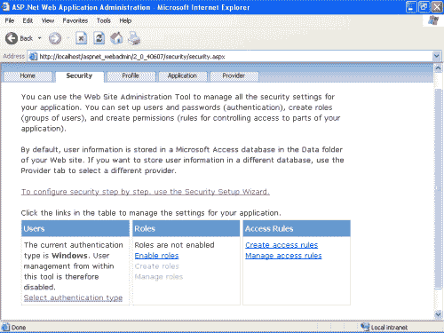

如您所见，在网站管理工具中，安全性分为三个核心组:用户、角色和访问规则。如果您不熟悉如何在网站管理工具中配置安全性，只需选择“要逐步配置安全性，请使用安全性设置向导”这样的链接可能会更容易。这将启动安全设置向导的欢迎屏幕。要开始配置过程，请选择浏览器窗口右下角附近的 Next 按钮前进到步骤 2。

步骤 2 允许您选择身份验证类型。如果您使用的是 Windows 身份验证(默认)，只需单击“下一步”。要使用表单身份验证(正如我们在本文中所做的)，请单击“从 Internet”选项，然后选择“下一步”。

步骤 3 显示了本文前面提到的默认提供程序“AspNetAccessProvider”。因为访问提供者是默认提供者，所以我们不需要在这里配置这个选项。只需选择下一步。

步骤 4 为应用程序启用基于角色的身份验证。如果您正在处理角色，您应该启用此复选框并单击下一步。角色的配置将在主菜单的安全选项卡中处理。现在，不要选中该复选框，单击 Next。

第五步是真正有趣的开始。在这里，您可以向应用程序添加用户、自动生成密码、通过电子邮件发送密码以及激活用户。为了简化这个例子，我将输入一些基本信息，如下所示，然后单击 Create User。

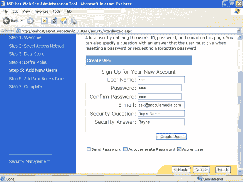

添加用户后，您可以选择继续以创建更多用户，或者选择下一步以前进到下一个屏幕。我将再添加两个用户，然后单击 Next。

步骤 6 允许您配置应用于特定用户的规则。例如，由于用户“zak”是管理员，他将被授予完全访问权限。但是，如果我的 Web 应用程序中有多个部门，我可以配置某些用户只允许访问他们的部门文件夹。此时我不会配置任何规则，因此我将单击“Next”。

Step 7 提醒您已经完成了 Web 应用程序的安全启用和配置。要完成向导，请选择“完成”,您将返回到主菜单中的“安全”选项卡。

现在您已经完成了，您可以继续并关闭网站管理工具。

`AccessMembershipProvider`会自动在应用程序的数据文件夹中创建一个名为 AspNetDB 的 Microsoft Access 数据库文件。打开数据库文件以检查其结构。正如您在下面看到的，创建了十个表，包括包含一般用户信息的`aspnet_Users`表和包含详细用户凭证信息(包括用户的散列密码和 salt)的`aspnet_Membership`表。

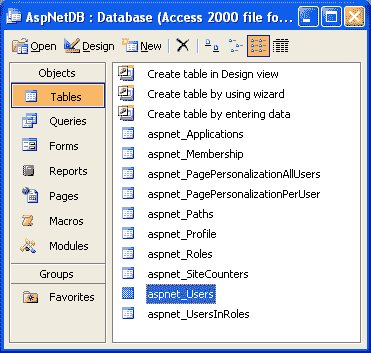

有关散列和加盐密码的更多信息，请参见 SitePoint 文章[“保护数据库中的密码”](https://www.sitepoint.com/securing-passwords-database/)。

##### 使用登录控件

正如我前面提到的，一些最令人兴奋的控件被添加到已经很健壮的 ASP.NET 控件集合中，这些控件包含在被称为登录控件的套件中。登录控件包括`Login`、`LoginView`、`PasswordRecovery`、`LoginStatus`、`LoginName`、`CreateUserWizard`和`ChangePassword`控件，允许在 ASP.NET 2.0 安全和您的 Web 应用程序之间进行快速、无缝的集成。

登录控件与提供者模型紧密集成，充分利用了已配置的提供者。例如，如果您将应用程序配置为使用`AccessMembershipProvider`(这是默认设置)，那么您可以很容易地向页面添加一个登录控件，该控件将根据位于应用程序数据文件夹中的 AspNetDB Access 数据库自动验证用户。或者，如果您将应用程序配置为使用`SqlMembershipProvider`，那么配置的登录控件将根据 SQL 数据库来验证用户。

##### 登录控件

既然您已经掌握了提供者模型，`AccessMembershipProvider`，并且已经通过 Web 站点管理工具启用和配置了您的站点以使用身份验证，那么让我们来构建您的用户可以与之交互的 UI。正如我已经提到的，ASP.NET 2.0 包括了一套由登录控件带头的登录控件。Login 控件提供了必要的界面，用户可以通过该界面输入他们的用户名和密码。在其最基本的功能级别，可以很容易地将登录控件添加到页面中。只需在 Web 表单中包含以下标记:

```
<asp:Login id="lcDorknozzle" runat="server"/>
```

该控件呈现为类似于下图所示的基本登录页。

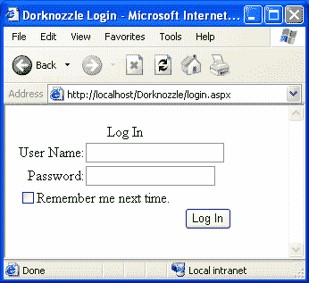

虽然 Login 控件公开了无数的属性，其中一些我将简单介绍一下，但它的大部分在于只有`DestinationPageUrl`属性真正需要配置。设置后，该属性会自动将用户重定向到目标页面。知道了这一点，我们可以配置我们的登录控件，如下所示:

```
<asp:Login  

id="lcDorknozzle"  

runat="server" 

DestinationPageUrl="index.aspx"/>
```

在这种情况下，如果用户输入了有效的凭证，他们将被自动重定向到`index.aspx`。其他重要的属性包括当用户输入错误的凭证时提供定制的错误消息的能力。这个属性，即`FailureText`属性，默认设置为“您的登录尝试不成功。请再试一次。”您可能还希望自动将用户重定向到允许他们创建新用户甚至找回丢失的密码的页面。在这种情况下，您将按如下方式配置`CreateUserText`、`CreateUserUrl`、`PasswordRecoveryText`和`PasswordRecoveryUrl`属性:

```
<asp:Login  

id="lcDorknozzle"  

runat="server"  

DestinationPageUrl="index.aspx"  

CreateUserText="New User?"  

CreateUserUrl="newuser.aspx"  

PasswordRecoveryText="Forget Your Password?"  

PasswordRecoveryUrl="forgotpassword.aspx"/>
```

在这种情况下，控件将在浏览器中呈现如下图所示的内容。

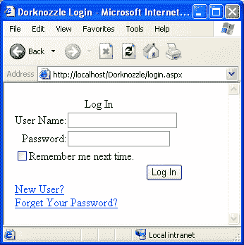

登录控件的灵活性不止于此。除了可用于自定义控件功能的许多其他属性之外，登录控件还通过`EnableTheming`属性支持主题化，通过`CssClass`属性支持自定义 CSS 类，并通过与 Aside 框架中可用的每个控件相关联的许多样式属性支持基本格式。事实上，如果您使用的是 Visual Studio 2005 测试版或 Visual Web Developer 2005 Express 测试版，您只需右键单击控件，选择`Auto Format...`，然后从自动格式对话框中显示的预定义列表中选择一种样式。我选择了优雅的风格，它呈现类似于这样:

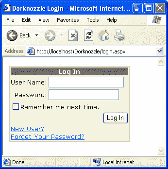

##### `LoginName`和`LoginStatus`控制

一旦用户登录，您可能想要使用`LoginName`和/或`LoginStatus`控件。这两个有用的控件允许您显示关于用户身份验证状态的相关信息。例如，`LoginName`控件允许您简单地显示经过验证的用户的用户名:

```
<asp:LoginName id="lnUser" runat="server"/>
```

另一方面，`LoginStatus`控件允许用户登录或注销您的应用程序。它类似于以下内容:

```
<asp:LoginStatus id=" lsUser" runat="server"/>
```

为了查看这些控件的运行情况，我将它们添加到我的`index.aspx`页面(用户登录后到达的页面):

```
<form runat="server"> 

  Welcome <asp:LoginName id="lnUser" runat="server"/>, your login was successful!<br /><br /> 

  <asp:LoginStatus id="lsUSer" runat="server"/> 

</form>
```

当用户现在登录时，会向他们显示一条包含他们姓名的定制消息，如果他们愿意，还可以注销。输出在浏览器中呈现，如下所示。

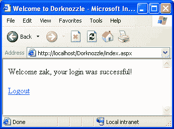

如果用户当前已经登录，那么`LoginStatus`控件将允许他们注销，并且如果他们已经注销，将显示一个到登录页面的链接。

##### `LoginView`控件

另一个有用的登录控件是`LoginView`控件。此控件允许您根据用户的角色自定义将通过模板显示给用户的信息。例如，您可能决定管理员在进入应用程序后能够看到完整的部门列表，但是属于特定部门(假设是工程部门)的人只能看到与公司和工程部门相关的信息。您还可以使用`LoginView`控件来显示基于用户登录状态的定制信息。例如，如果一个匿名用户访问您的站点，您可能希望提醒他们该站点是为注册用户准备的，并让他们知道他们可以单击新用户链接进行注册。或者，您可能希望提醒已登录的用户，他们不需要再次登录。您甚至可以使用前面讨论过的`LoginName`控件向他们显示“欢迎回来”的消息，包括他们的名字。

要使用`LoginView`控件，只需使用以下语法将控件添加到页面中:

```
<asp:LoginView id="lvDorknozzle" runat="server">  

</asp:LoginView>
```

当然，如果不使用模板，控件是没有用的。在这种情况下，我们将确保匿名用户被告知通过点击`New User`链接进行注册，并且已登录的用户会看到他们已经登录的通知。将以下`LoggedInTemplate`和`AnonymousTemplate`子标签添加到`LoginView`父标签中:

```
<asp:LoginView id="lvDorknozzle" runat="server">  

  <LoggedInTemplate>  

    Welcome <asp:LoginName id="lnUser" runat="server"/>  

  </LoggedInTemplate>  

  <AnonymousTemplate>  

    Welcome to the Dorknozzle site!<br />  

    Please click on the New User link to register on our site.  

  </AnonymousTemplate>  

</asp:LoginView>
```

现在，当用户第一次访问`login.aspx`页面时，他们被认为是匿名的，并显示类似这里所示的欢迎消息。

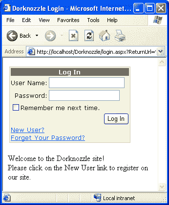

您可以通过根据用户的角色显示定制的消息来进一步配置`LoginView`控件。例如，我可以在`LoginView`标签中添加`RoleGroups`标签。对此，我将添加一个`RoleGroup`控件，其中角色的名称是`Roles`属性的值:

```
<asp:LoginView ID="lvDorknozzle" Runat="server">  

  <RoleGroups>  

    <asp:RoleGroup Roles="Engineering">  

      <ContentTemplate>  

        You are a member of the Engineering department.  

      </ContentTemplate>  

    </asp:RoleGroup>  

  </RoleGroups>  

  <LoggedInTemplate>  

    Welcome <asp:LoginName ID="lnUser" Runat="server" />  

  </LoggedInTemplate>  

  <AnonymousTemplate>  

    Welcome to the Dorknozzle site!<br />  

    Please click on the New User link to register on our site.  

  </AnonymousTemplate>  

</asp:LoginView>
```

##### `CreateUserWizard`控件

如果您经历了通过网站管理工具创建新用户的过程，您可能已经使用了`CreateUserWizard`控件，甚至可能还不知道它。`CreateUserWizard`控件只是允许一个新用户将他们自己添加(或注册)到您的 Web 应用程序中。这个强大的标签提供了许多可定制的功能，但可以通过以下标签快速添加到您的站点中并在其中使用:

```
<asp:CreateUserWizard id="NewUserWiz" runat="server">  

</asp:CreateUserWizard>
```

在浏览器中，页面呈现如下所示。

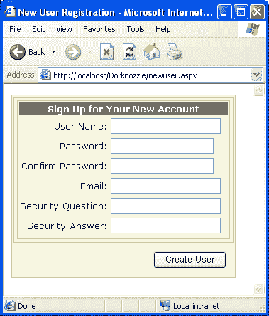

当然，`CreateUserWizard`控件的真正威力在于它的灵活性。控件提供了七个模板(`HeaderTemplate`、`SideBarTemplate`、`StartNavigationTemplate`、`StepNavigationTemplate`、`FinishNavigationTemplate`、`Sign Up For a New Account Template`和一个`Complete Template`)，可以根据您的需要进行定制。更好的是，`CreateUserWizard`控件允许您简单地通过添加如下的`MailDefinition`标签自动向新注册的用户发送电子邮件:

```
<asp:CreateUserWizard id="CreateUserWizard1" runat="server">  

  <MailDefinition   

    BodyFileName="NewUserEmail.txt"   

    From="welcome@dorknozzle.com"  

    Subject="Welcome to the Dorknozzle site!"/>  

</asp:CreateUserWizard>
```

一旦一个新用户被添加到站点，一封电子邮件被发送给那个用户。在文本文件中定义的电子邮件通过`BodyFileName`属性加载，如上面的代码所示。只需在文本文件中添加特殊表达式，如`<% UserName %>`，就可以定制变量。

最后，为了转发电子邮件，必须在`Web.config`文件的`<smtpMail>`邮件部分指定电子邮件服务器:

```
<configuration>  

  <system.web>  

    <authentication mode="Forms"/>  

    <smtpMail serverName="Localhost"/>  

  </system.web>  

</configuration>
```

##### `PasswordRecovery`控件

作为 Web 应用程序的管理员，您最不想做的事情就是为忘记密码的人接听电话和回复电子邮件。`PasswordRecovery`控件可以减轻这个负担。默认情况下，您可以添加以下标记，该标记允许用户输入他们的用户名并回答他们的机密问题。接下来，会生成一封包含每个用户密码的电子邮件，并发送给:

```
<asp:PasswordRecovery id="prForgotPass" runat="server"> </asp:PasswordRecovery>
```

在浏览器中，`PasswordRecovery`控件呈现如下:

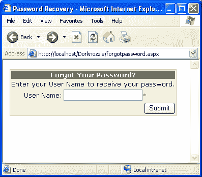

一旦用户输入有效的用户名，他们必须回答他们的机密问题。在浏览器中，页面如下所示。

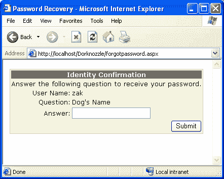

类似于`CreateUserWizard`控件，邮件格式在`MailDefinition`标签中处理:

```
<asp:PasswordRecovery id="prForgotPass" runat="server">   

  <MailDefinition  

    BodyFileName="forgotpassword.txt"  

    From="helpdesk@dorknozzle.com"   

    Subject="Word has it, you forgot your password?"/>  

</asp:PasswordRecovery>
```

如果所有内容的格式都正确，将会发送电子邮件，并向用户显示一条类似以下内容的消息:

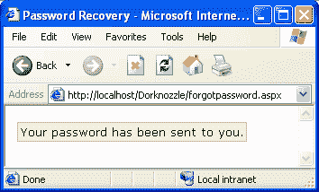

##### `ChangePassword`控件

最后，如您所料，`ChangePassword`控件允许用户修改他们的密码。可以将`ChangePassword`控件添加到带有以下标签的任何页面:

```
<asp:ChangePassword id="cpChangePass" runat="server"/>
```

在浏览器中，控件呈现如下形式:

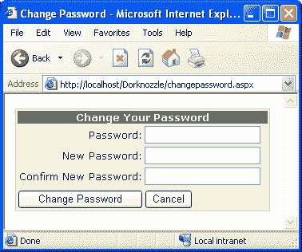

像`CreateUserWizard`和`PasswordRecovery`控件一样，`ChangePassword`控件可以通过`MailDefinition`标签进行配置，在用户成功更改密码后向他们发送确认电子邮件。然而，与`CreateUserWizard`和`PasswordRecovery`控件不同的是，`ChangePassword`控件要求用户登录后才能更改密码。

##### 成员资格 API

在使用安全性的某些情况下，您需要比网站管理工具或登录控件提供的更大的灵活性。在这种情况下，您将希望直接使用成员资格 API。通过`Membership`类公开，成员资格 API 允许您以编程方式创建用户、更改密码以及基于特定标准搜索用户。在很大程度上，我们到目前为止看到的登录控件使用了由`Membership`类公开的方法；您可以直接从代码中使用它们，这是一个额外的好处。以下由`Membership`类公开的方法是您可能会发现自己最常用的方法:

*   `CreateUser`–允许您创建新用户
*   `DeleteUser`–允许您删除现有用户
*   `FindUsersByEmail`–允许您检索一组与电子邮件地址匹配的用户
*   `FindUsersByName`–允许您检索一组与特定用户名匹配的用户
*   `GeneratePassword`–允许您生成随机密码
*   `GetAllUsers`–允许您检索存储在成员资格提供程序中的所有用户
*   `GetNumberOfUsersOnline`–允许您返回当前登录的用户数量
*   `GetUser`–允许您检索与当前或提供的用户相关的会员信息
*   `GetUsernameByEmail`–允许您检索具有特定电子邮件地址的用户的用户名
*   `UpdateUser`–允许您更新特定用户的信息
*   `ValidateUser`–允许您向会员资格提供商验证用户

为了演示这些方法的灵活性，我将如下所示向我的`index.aspx`添加一些文本和一个`Label`控件:

```
Number of Users Online:  

<asp:Label id="lblNumUsersOnline" runat="server"/>
```

在我的代码隐藏中，我将添加一些访问在线用户数量的代码:

```
Sub Page_Load(s As Object, e As EventArgs) Handles MyBase.Load  

  lblNumUsersOnline.Text = _  

    Membership.GetNumberOfUsersOnline().ToString()  

End Sub
```

我还可以向页面添加一个`GridView`控件，如下所示:

```
<asp:GridView id="gvUsers" runat="server" AutoGenerateColumns="False">  

  <Columns>  

    <asp:BoundField HeaderText="Username" DataField="Username" />  

    <asp:BoundField HeaderText="Is Online?" DataField="IsOnline" />  

    <asp:BoundField HeaderText="Is Approved?" DataField="IsApproved" />  

    <asp:BoundField HeaderText="Email" DataField="Email" />  

  </Columns>  

</asp:GridView>
```

在代码隐藏中，我可以将以下内容添加到我的`Page_Load`事件处理程序中，以填充网格:

`gvUsers.DataSource = Membership.GetAllUsers()  
 gvUsers.DataBind()`

输出在浏览器中呈现如下。

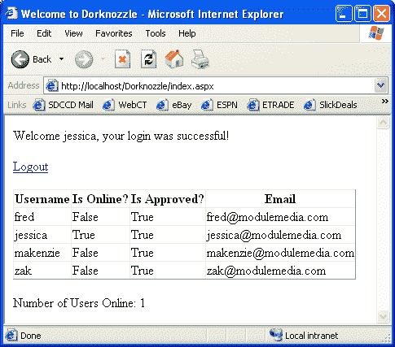

##### 结论

ASP.NET 2.0 通过添加增强的安全功能，构建在已经功能丰富的框架上。

在本文中，我们主要关注。NET 框架 2.0。接下来，我们看了在构建 Web 应用程序时可以利用的登录控件套件。最后，我们看了成员 API 和由`Membership`类公开的方法。你是否使用 ASP.NET 最新版本中提供的部分或全部安全功能取决于你，但我个人认为 ASP.NET 2.0 有很多令人兴奋的地方。

## 分享这篇文章