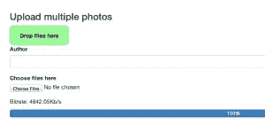
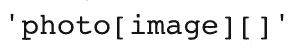

# Rails 中的异步文件上传

> 原文：<https://www.sitepoint.com/asynchronous-file-uploads-rails/>



几周前，我写了一篇名为[与蜻蜓](https://www.sitepoint.com/file-uploads-dragonfly/)一起更好地上传文件的文章，解释了如何设置[蜻蜓](https://github.com/markevans/dragonfly)，这是处理附件的一个法宝。邮报建立了一个演示应用程序，并将蜻蜓集成到，允许我们的用户分享(上传)他们的照片。

今天，我们将进一步探讨文件上传，比如如何使用 Rails 实现异步文件上传，以及使用 AJAX 上传多个文件。

我们将看看两个解决方案:Remotipart 和文件上传。

本文将涉及的一些其他内容:

*   创建一个进度条来跟踪文件上传进度和显示比特率。
*   实现客户端验证。
*   添加一个带有一些不错的 CSS3 效果的“dropzone ”,允许用户拖放要上传的文件。

所有这些将在五次迭代中完成。我们开始吧！

源代码可以在 [GitHub](https://github.com/bodrovis/sitepoint-async-upload) 上获得。

## 准备项目

对于这个演示，我使用的是 Rails 4.1.1，但同样的解决方案也可以用 Rails 3 来实现。

在第一次迭代中，我们将创建一个新项目，并将蜻蜓很快融入其中(更详细的指南请查看我的[上一篇文章](https://www.sitepoint.com/file-uploads-dragonfly/))。

创建一个没有默认测试套件的新应用程序:

```
$ rails new async_uploader -T
```

将一些宝石放入您的宝石档案:

*Gemfile*

```
gem 'dragonfly'
gem 'dragonfly-s3_data_store'
group :production do
  gem 'rack-cache', :require => 'rack/cache'
end
gem 'bootstrap-sass'
gem 'remotipart', '~> 1.2'
```

`dragonfly`是宝石，将处理所有的上传魔术和`dragonfly-s3_data_store`将允许我们使用亚马逊 S3 存储图像(我们将在生产中需要它)。`rack-cache`为生产环境添加了一个简单的缓存机制。`bootstrap-sass`将为我们的应用配备 Twitter Bootstrap。`remotipart`将在下一次迭代中使用。

现在连接 Bootstrap 的样式和脚本(不要忘记，对于真正的应用程序，只选择所需的组件):

*样式表/application.css.scss*

```
@import "bootstrap";
@import 'bootstrap/theme';
```

*JavaScript s/application . js*

```
[...]
//= require bootstrap
```

现在，运行蜻蜓的生成器来创建一个初始化文件:

```
$ rails g dragonfly
```

打开它，用以下内容替换默认的`datastore`设置:

*config/initializer/dragonfly . Rb*

```
[...]
if Rails.env.development? || Rails.env.test?
  datastore :file,
            root_path: Rails.root.join('public/system/dragonfly', Rails.env),
            server_root: Rails.root.join('public')
else
  datastore :s3,
            bucket_name: 'your_bucket_name',
            access_key_id: ENV['AWS_KEY'],
            secret_access_key: ENV['AWS_SEC'],
            url_scheme: 'https'
end
```

对于`access_key_id`和`secret_access_key`，您需要在[亚马逊](https://aws.amazon.com/)注册，然后打开“**您的账户**-安全凭证”，展开“访问密钥”部分，创建新的一对。可以使用 [AWS 管理控制台](https://console.aws.amazon.com)创建一个 bucket。

这个密钥对应该保持安全，所以不要把它放在版本控制中。我正在使用 [Heroku 环境变量](https://devcenter.heroku.com/articles/config-vars)。

同样，如果您在 Rails 4 上，为生产环境启用`rack-cache`:

*配置/环境/生产. rb*

```
[...]
config.action_dispatch.rack_cache = true
[...]
```

我们几乎完成了设置蜻蜓。最后要做的是创建模型，添加文件上传需求。假设我们希望用户上传他们的照片。除了默认字段之外，我们的`photos`表将包含这些列:

*   `image_uid`(`string`)–该列将存储图像的 URI
*   `author`(`string`)–这一栏将包含作者的姓名

很好，现在运行这些命令来创建和应用所需的迁移:

```
$ rails g model Photo image_uid:string title:string
$ rake db:migrate
```

在模型上:

*模特/照片. rb*

```
class Photo < ActiveRecord::Base
  dragonfly_accessor :image

  validates :image, presence: true
  validates_size_of :image, maximum: 500.kilobytes,
                    message: "should be no more than 500 KB", if: :image_changed?

  validates_property :format, of: :image, in: [:jpeg, :jpg, :png, :bmp], case_sensitive: false,
                     message: "should be either .jpeg, .jpg, .png, .bmp", if: :image_changed?
end
```

在这一点上，我们完成了蜻蜓。当然，我们还需要一个控制器和相应的视图。控制器现在非常简单:

*控制器/照片 _ 控制器. rb*

```
class PhotosController < ApplicationController
  def new
    @photos = Photo.order('created_at DESC')
    @photo = Photo.new
  end

  def create
    @photo = Photo.new(photo_params)
    @photo.save
    redirect_to new_photo_path
  end

  private

  def photo_params
    params.require(:photo).permit(:image, :title)
  end
end
```

如你所见，“新照片”不仅允许创建新照片，还会列出所有上传的照片。

路线:

*config/routes.rb*

```
resources :photos, only: [:new, :create]
root to: 'photos#new'
```

布局:

*layouts/application . html . erb*

```
[...]
<body>
<div class="navbar navbar-inverse" role="navigation">
  <div class="container">
    <div class="navbar-header">
      <button type="button" class="navbar-toggle" data-toggle="collapse" data-target=".navbar-collapse">
        <span class="sr-only">Toggle navigation</span>
        <span class="icon-bar"></span>
        <span class="icon-bar"></span>
        <span class="icon-bar"></span>
      </button>
      <a class="navbar-brand" href="#">Uploader</a>
    </div>
    <div class="collapse navbar-collapse">
      <ul class="nav navbar-nav">
        <li><%= link_to 'Upload one', root_path %></li>
      </ul>
    </div>
  </div>
</div>

<div class="container">
  <%= yield %>
</div>
</body>
[...]
```

和观点:

*photos/new.html.erb*

```
<h1>List of photos</h1>

<ul class="row" id="photos-list">
  <%= render @photos %>
</ul>

<%= form_for @photo do |f| %>
  <div class="form-group">
    <%= f.label :author %>
    <%= f.text_field :author, class: 'form-control' %>
  </div>

  <div class="form-group">
    <%= f.label :image %>
    <%= f.file_field :image, required: true %>
  </div>

  <%= f.submit 'Submit', class: 'btn btn-primary btn-lg' %>
<% end %>
```

我使用`render @photos`来渲染所有使用`_photos.html.erb`部分的照片，所以也创建它:

*photos/_photo.html.erb*

```
<li class="col-xs-3">
  <%= link_to image_tag(photo.image.thumb('180x180#').url, alt: photo.author, class: 'img-thumbnail'),
              photo.image.remote_url, target: '_blank' %>
  <p><%= photo.author %></p>
</li>
```

最后，一点造型:

*样式表/application.css.scss*

```
#photos-list {
  padding: 0;
  margin: 0;
  margin-top: 30px;
  clear: both;
  li {
    list-style-type: none;
    padding: 0;
    margin: 0;
    min-height: 272px;
    max-height: 272px;
    margin-bottom: 10px;
    text-align: center;
    img {
      margin-bottom: 10px;
    }
    p {
      margin: 0;
      height: 40px;
      overflow: hidden;
    }
  }
}
```

唷，现在我们完成了第一次迭代！此时，启动服务器并上传几张照片以确保一切正常。

## 使其异步

我们的用户可以上传他们的照片，但页面会在每次提交表单时重新加载。如何使它异步，以便上传的照片预览立即显示？这很容易做到。

您可能认为我们需要做的就是将`remote: true`添加到表单帮助器中，就像这样:

*photos/new.html.erb*

```
[...]
<%= form_for @photo, remote: true do |f| %>
[...]
```

但是这是行不通的，因为 Rails 不知道如何异步发送多部分表单。幸运的是，解决方法很简单。记住，我们将`gem 'remotipart', '~> 1.2'`添加到了我们的 Gemfile 中。由 Steve Schwartz 和 Greg Leppert 创建的这个宝石，支持使用 Rails 3 和 Rails 4 上传 AJAX 文件，这正是我们所需要的。

唯一要做的就是在`application.js`文件中添加一行:

*JavaScript s/application . js*

```
[...]
//= require jquery.remotipart
```

现在我们的应用程序会功夫了！很棒，不是吗？

嗯，控制器需要稍微调整一下，这样它就可以响应 AJAX 请求:

*控制器/照片 _ 控制器. rb*

```
[...]
def create
  respond_to do |format|
    @photo = Photo.new(photo_params)
    @photo.save
    format.html { redirect_to new_photo_path }
    format.js
  end
end
[...]
```

不要忘记创建相应的视图:

*photos/create.js.erb*

```
<% if @photo.new_record? %>
alert('The photo could not be uploaded: <%= j @photo.errors.full_messages.join(', ').html_safe %>');
<% else %>
$('#photos-list').prepend('<%= j render @photo %>');
<% end %>
```

`if @photo.new_record?`条件实际上检查照片是否被成功保存(我们添加了一些验证，还记得吗？).如果不是，那么向用户显示一个显示错误的基本警告框。

如果记录被保存，使用 jQuery 的`prepend`方法将另一个元素添加到`#photos-list`无序列表中。需要使用`j`方法，因为否则来自`_photo.html.erb`部分的所有 HTML 都将被清理。

仅此而已！现在，您可以尝试一些照片，检查异步上传是否有效。

嗯，那是容易的部分。让我们转到第三个迭代，实现允许用户一次异步上传多张照片的功能。

## 异步上传多张照片

创建另一个视图和相应的控制器方法，这样我们就不会弄乱之前编写的代码。

*控制器/照片 _ 控制器. rb*

```
[...]
def new_multiple
  @photos = Photo.order('created_at DESC')
  @photo = Photo.new
end
[...]
```

如你所见，这个方法实际上和`new`是一样的。不同之处在于观点:

*photos/new_multiple.html.erb

```
<h1>List of photos</h1>

<ul class="row" id="photos-list">
  <%= render @photos %>
</ul>

<h3>Upload multiple photos</h3>
<%= form_for @photo do |f| %>
  <div class="form-group">
    <%= f.label :author %>
    <%= f.text_field :author, class: 'form-control' %>
  </div>

  <div class="form-group">
    <%= f.label :image %>
    <%= f.file_field :image, required: true %>
  </div>
<% end %>
```

注意，在这种情况下，我们不需要为表单助手提供`remote: true`。最后，设置路线:

*config/routes.rb*

```
[...]
get '/photos/new_multiple', to: 'photos#new_multiple', as: :new_photo_multiple
```

为了允许多文件上传，我们使用 Sebastian Tschan 创建的 jQuery [文件上传插件](https://blueimp.github%20.io/jQuery-File-Upload/)。这个插件有许多选项和很酷的功能。我鼓励你去看看它的[文档](https://github.com/blueimp/jQuery-File-Upload/wiki)。

我们还将使用 Tors Dalid 的 [`jquery-fileupload-rails`](https://github.com/tors/jquery-fileupload-rails) 将这个插件集成到我们的应用程序中。不幸的是，这个 gem 自 2012 年以来就没有更新过，所以让我们使用一个分叉版本来代替:

*Gemfile*

```
gem 'jquery-fileupload-rails', github: 'Springest/jquery-fileupload-rails'
```

文件上传插件有两个版本:UI 和 basic。我们将实现基本版本，因为它提供了更多的控制，我们可以按照自己的方式设计表单。

*JavaScript s/application . js*

```
[...]
//= require jquery-fileupload/basic
```

现在，对视图进行一些修改:

*photos/new _ multiple . html . erb*

```
[...]
<div class="form-group">
  <%= f.label :image %>
  <%= f.file_field :image, required: true, multiple: true, name: 'photo[image]' %>
</div>
[...]

<script>
  $(document).ready(function() {
    $('#new_photo').fileupload({dataType: 'script'});
  });
</script>
```

`multiple: true`选项告诉文件域用户可以通过按住 CTRL(或 Shift)键选择多个文件。


硬编码字段的名称，因为否则，Rails 将把这个字段命名为


并且文件将作为一个数组提交。我们希望它们被一个一个地提交，文件上传会处理好的。

`$('#new_photo').fileupload();`用文件上传的魔力装备我们的表单，而`dataType: 'script'`表明我们期待 javascript 的响应。

另外，请注意，我们的表单没有“提交”按钮。这是因为一旦用户选择了文件，表单就会自动提交(您可能希望为用户写一条简短的警告消息)。

此时，立刻上传几张照片——控制器的`create`方法不需要修改！一切都应该是可行的，除了作者的名字。照片将被上传，但`author`栏将为空。这是因为默认情况下，文件上传仅提交文件。要解决这个问题，我们需要调整脚本:

*photos/new _ multiple . html . erb*

```
<script>
  $(document).ready(function() {
    var multiple_photos_form = $('#new_photo');
    multiple_photos_form.fileupload({dataType: 'script'});

    multiple_photos_form.on('fileuploadsubmit', function (e, data) {
      data.formData = {'photo[author]': $('#photo_author').val()};
    });
  });
</script>
```

这里，我们监听`fileuploadsubmit`事件(回调列表可用[这里](https://github%20.com/blueimp/jQuery-File-Upload/wiki/Options#callback-options))并将作者字段的值附加到表单数据。

## 添加客户端验证和进度条

我们已经准备好进入第四次迭代。目前，我们的表单功能齐全，但存在一些问题:

*   验证只在服务器端进行。因此，用户将不得不等待他的文件被上传，然后才会被告知任何错误。
*   用户没有得到关于上传过程的反馈。如果互联网连接很慢，上传可能需要很长时间，用户根本看不到任何事情发生。

解决方案很简单:添加客户端验证和进度条。

先说验证。调整脚本:

*photos/new _ multiple . html . erb*

```
[...]
multiple_photos_form.fileupload({
  dataType: 'script',
  add: function (e, data) {
    types = /(\.|\/)(gif|jpe?g|png|bmp)$/i;
    file = data.files[0];
    if (types.test(file.type) || types.test(file.name)) {
      data.submit();
    }
    else { alert(file.name + " must be GIF, JPEG, BMP or PNG file"); }
  }
});
[...]
```

我们正在检查每个文件的格式是否正确。如果是，使用`data.submit();`提交表单，否则，向用户显示一条错误消息。现在，用户将知道文件是否是可接受的格式。

在进度条上。Bootstrap 已经提供了一个漂亮的风格栏，所以让我们使用它:

*photos/new _ multiple . html . erb*

```
[...]
<div class="form-group">
  <%= f.label :image %>
  <%= f.file_field :image, required: true, multiple: true, name: 'photo[image]' %>
</div>

<div class="progress-wrapper">
  <div class="progress">
    <div class="progress-bar" role="progressbar">
      0%
    </div>
  </div>
</div>
[...]
```

我们不希望在表单实际提交之前显示进度条，所以稍微调整一下样式:

*样式表/application.css.scss*

```
[...]
.progress-wrapper {
  display: none;
}
```

为了跟踪整个文件上传进度，脚本必须监听`fileuploadprogressall`事件，获取上传的字节数，并调整进度条。此外，进度条必须显示一旦上传开始，补充的`fileuploadstart`事件。最后，在上传完成后，工具栏应该再次隐藏，在这种情况下`fileuploaddone`会有所帮助。

下面是修改后的脚本:

*photos/new _ multiple . html . erb*

```
[...]
var wrapper = multiple_photos_form.find('.progress-wrapper');
var progress_bar = wrapper.find('.progress-bar');

multiple_photos_form.on('fileuploadstart', function() {
  wrapper.show();
});

multiple_photos_form.on('fileuploaddone', function() {
  wrapper.hide();
  progress_bar.width(0); // Revert progress bar's width back to 0 for future uploads
});

multiple_photos_form.on('fileuploadprogressall', function (e, data) {
  var progress = parseInt(data.loaded / data.total * 100, 10);
  progress_bar.css('width', progress + '%').text(progress + '%');
});
[...]
```

`data.loaded`获取加载的字节数，而`data.total`包含要上传的总字节数。

最后要做的事情是向用户显示比特率(上传速度)。这很简单:

*photos/new _ multiple . html . erb*

```
[...]
<div class="progress-wrapper">
  <p>Bitrate: <span class="bitrate"></span></p>
  <div class="progress">
    <div class="progress-bar" role="progressbar">
      0%
    </div>
  </div>
</div>
[...]
```

剧本是:

```
[...]
var bitrate = wrapper.find('.bitrate');

multiple_photos_form.on('fileuploadprogressall', function (e, data) {
  bitrate.text((data.bitrate / 1024).toFixed(2) + 'Kb/s');

  var progress = parseInt(data.loaded / data.total * 100, 10);
  progress_bar.css('width', progress + '%').text(progress + '%');
});
```

我们的表单看起来非常棒，为用户提供了有用的信息。让我们进入第五个也是最后一个迭代。

## 添加 Dropzone

文件上传插件提供了一种设置所谓“Dropzone”的方法——用户可以在这个区域拖放他们的文件以立即开始上传(查看[浏览器支持](https://github.com/blueimp/jQuery-File-Upload/wiki/Browser-support#drag--drop))。

这是默认文件对话框的一个很好的替代品。只删除一些要上传的文件感觉更自然。

让我们在标记中添加一个新元素:

*photos/new _ multiple . html . erb*

```
[...]
<h3>Upload multiple photos</h3>
<div id="dropzone" class="fade">Drop files here</div>

<%= form_for @photo do |f| %>
  <div class="form-group">
    <%= f.label :author %>
    <%= f.text_field :author, class: 'form-control' %>
  </div>

  <div class="form-group">
    <%= f.label :image, 'Choose files here' %>
    <%= f.file_field :image, required: true, multiple: true, name: 'photo[image]' %>
  </div>

  <div class="progress-wrapper">
    <p>Bitrate: <span class="bitrate"></span></p>
    <div class="progress">
      <div class="progress-bar" role="progressbar">
        0%
      </div>
    </div>
  </div>
<% end %>
[...]
```

剧本:

*photos/new _ multiple . html . erb*

```
[...]
multiple_photos_form.fileupload({
  dataType: 'script',
  dropZone: $('#dropzone'),
  add: function (e, data) {
    types = /(\.|\/)(gif|jpe?g|png|bmp)$/i;
    file = data.files[0];
    if (types.test(file.type) || types.test(file.name)) {
      data.submit();
    }
    else { alert(file.name + " must be GIF, JPEG, BMP or PNG file"); }
  }
});
[...]
```

我们也可以将一些 CSS3 过渡应用到拖放区(文件上传的事件将在这里帮助我们)。以下是您可能会用到的一些样式:

*样式表/application.css.scss*

```
@import "compass/css3/transition";
@import "compass/css3/opacity";
@import "compass/css3/border-radius";

[...]

#dropzone {
  background: palegreen;
  width: 150px;
  text-align: center;
  font-weight: bold;
  height: 50px;
  line-height: 50px;
  border: 1px solid darken(palegreen, 10%);
  @include border-radius(10px);
}

#dropzone.in {
  width: 600px;
  height: 200px;
  line-height: 200px;
  font-size: larger;
}

#dropzone.hover {
  background: lawngreen;
  border: 1px solid darken(lawngreen, 10%);
}

#dropzone.fade {
  @include transition-property(all);
  @include transition-duration(0.5s);
  @include transition-timing-function(ease-out);
  @include opacity(1);
}
```

我正在使用一些 [Compass](http://compass-style.org/) 实用程序(我懒得为 CSS3 属性指定所有的供应商前缀)，所以不要忘记将这些行放到 Gemfile 中:

*Gemfile*

```
[...]
gem 'compass-rails'
gem 'compass'
[...]
```

并运行`bundle install`。

以下是制作 dropzone 动画的脚本:

*photos/new _ multiple . html . erb*

```
$(document).bind('dragover', function (e) {
  var dropZone = $('#dropzone'),
          timeout = window.dropZoneTimeout;
  if (!timeout) {
    dropZone.addClass('in');
  } else {
    clearTimeout(timeout);
  }
  var found = false,
          node = e.target;
  do {
    if (node === dropZone[0]) {
      found = true;
      break;
    }
    node = node.parentNode;
  } while (node != null);
  if (found) {
    dropZone.addClass('hover');
  } else {
    dropZone.removeClass('hover');
  }
  window.dropZoneTimeout = setTimeout(function () {
    window.dropZoneTimeout = null;
    dropZone.removeClass('in hover');
  }, 100);
});
```

你可以在这里阅读更多相关信息[。](https://github.com/blueimp/jQuery-File-Upload/wiki/Drop-zone-effects)

你现在可以测试这个表单，看看所有的东西都工作了。:)

## 结论

我们已经看了两个异步文件上传的解决方案。我希望你已经发现这篇文章有趣和有用。

你曾经尝试过在你的应用中实现异步文件上传吗？你采用了什么解决方案？你面临过什么问题？在评论中分享你的经验吧！

## 分享这篇文章