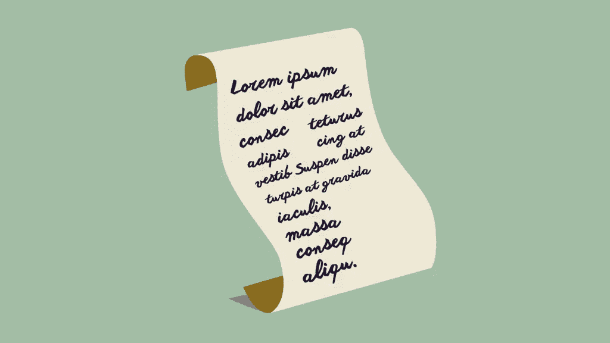

# AtoZ CSS 快速提示:占位符文本

> 原文：<https://www.sitepoint.com/atoz-css-placeholder-text/>

本文是我们 AtoZ CSS 系列的一部分。你可以在这里找到系列[的其他条目。
你可以在这里](https://www.sitepoint.com/blog/)查看相应视频的完整文字稿和截屏，[。](https://www.sitepoint.com/atoz-css-pseudo-elements)

欢迎来到我们的 AtoZ CSS 系列！在这个系列中，我将探索不同的 CSS 值(和属性),每个值都以字母表中不同的字母开始。我们知道有时仅仅截屏是不够的，所以在本文中，我们添加了一个关于样式化占位符文本的新的快速技巧。



## p 代表占位符文本

伪元素`:before`和`:after`非常适合构建复杂的设计特性，不会让非语义元素的标记变得混乱。其他伪元素如`:first-line`和`:first-letter`让我们可以访问 HTML 文档中没有标记的元素的样式部分。

我们在 [Pseudo Elements screencast](https://www.sitepoint.com/atoz-css-pseudo-elements) 中看到了许多这样的元素，但是有一个 Pseudo 元素我们没有看到，它是用于样式化占位符文本的。让我们解决这个问题。

### 选择输入占位符

首先，让我们想象下面的 HTML:

```
<input class="name-field" type="text" placeholder="Enter your name">
```

我们可以将输入文本的`color`设置为红色，如下所示:

```
.name-field {
  color: red;
}
```

我们还可以从占位符属性中选择输入并设置其样式:

```
input[placeholder="Enter your name"] {
  color: red;
}
```

但是这仍然会样式化任何输入到域中的用户输入文本，而不是样式化占位符文本本身的外观。为此，我们需要为占位符伪元素提供一系列厂商前缀选择器。

```
::-webkit-input-placeholder {
  color: red;
}
:-moz-placeholder {/*Firefox 18-*/
  color: red;  
}
::-moz-placeholder {/*Firefox 19+*/
  color: red;  
}
:-ms-input-placeholder {  
  color: red;  
}
```

这可能看起来像是重复，但不幸的是，没有更干燥(不要重复)的方法来做到这一点。

以下将不起作用:

```
::-webkit-input-placeholder,
:-moz-placeholder,
::-moz-placeholder,
:-ms-input-placeholder {
  color: red;  
}
```

这是因为任何浏览器都必须能够“理解”逗号分隔系列中的每个选择器，以便应用大括号内的样式。

### 使用 Sass 设置占位符的样式

解决这种重复 CSS 的一个方法是使用 Sass mixin。这是我在 99%的项目中使用的方法:

```
@mixin input-placeholder {
  ::-webkit-input-placeholder {
    @content;
  }
  :-moz-placeholder {/* Firefox 18- */
    @content;
  }
  ::-moz-placeholder {/* Firefox 19+ */
    @content;
  }
  :-ms-input-placeholder {  
    @content;
  }
}

/* usage */

@include input-placeholder {
  color: red;
}
```

这允许我用一个 Sass `@include`来设置所有浏览器中占位符的样式，这有助于使代码更短，更易于维护。

### 设计占位符样式时要注意特殊性

在 IE 浏览器中，设置输入样式可以覆盖为占位符文本设置的样式。

```
:-ms-input-placeholder {
  color: red;
}
input[type="text"] { 
  color: blue; /* placeholder text will be blue in IE */
}
```

确保 IE 占位符样式具有更高的特异性，以便它们按预期显示。这甚至可能是使用`!important`的情况，但是如果使用这个强大的工具，一定要小心。

### 注意占位符的`opacity`

在 Firefox 中，占位符文本的默认`opacity`在`0.5`左右，因此在占位符上设置`color: red`将导致静音的`color` `unless you also set` `opacity: 1`。

即使你使用的是 [Normalize.css](http://necolas.github.io/normalize.css/) ，这也不会为你重置。如果完全不透明的占位符是你的项目的关键，记住这个提示！

## 分享这篇文章