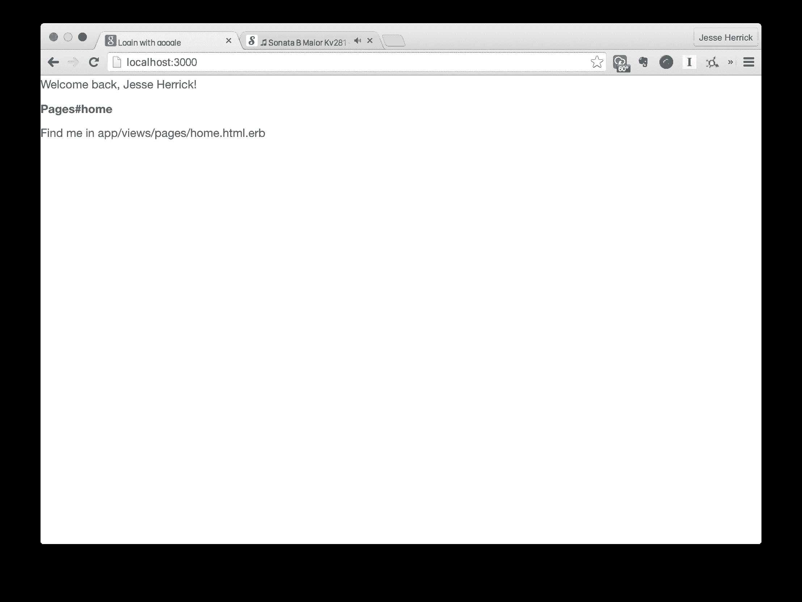

# 向谷歌认证

> 原文：<https://www.sitepoint.com/authenticating-google/>


我有一个绝妙的主意。我将建立一个网站，让`*insert noun*`更容易访问`*insert verb*ing`。但有一个问题:我需要人们能够登录，但我不想处理注册用户，重置他们的密码，*等。*。因此，我已经决定使用谷歌登录是最好的选择。我该如何实现这一点？

有了[设计](https://github.com/plataformatec/devise/)和[全能](https://github.com/intridea/omniauth)的组合，这个过程并不像听起来那么痛苦。本质上，我将使用由 [OAuth 2.0 规范](http://oauth.net/2/)安排的过程来实现我的 NounVerber 的认证。

## 拉起你的吊带裤

`rails new`很好，但我喜欢开箱后有更多的功能，所以我将使用 [thoughtbot 的吊带](https://github.com/thoughtbot/suspenders)宝石。让我们创建我们的应用程序:

```
$ gem install suspenders
$ suspenders login_with_google
# lots and lots of rails app creation output

$ cd login_with_google
```

首先，我们需要创建一些要访问的页面:

*   `home`–根页面，不安全。
*   `secure`–仅在登录时查看。

我们将创建一个拥有这些方法的`pages`控制器。显然，这只是一个占位符，因为静态内容的 Google 登录将是无意义的:

```
$ rails g controller pages home secure
```

将根页面设置为`pages#home`:

```
# config/routes.rb

Rails.application.routes.draw do
  root to: 'pages#home'
  get 'pages/secure'
end
```

太棒了。但是在我们开始实际创建身份验证之前，我们需要创建一个用户模型。我们只使用 Google 的 API 进行身份验证，因此我们只需要以下属性:

*   `uid`–我们用户的唯一提供商给定(Google) id
*   `provider`–认证提供者
*   `name`–从他们的 Google 档案中保存的姓名
*   `email`–从他们的 Google 档案中保存的电子邮件

让我们生成这个模型:

```
$ rails g model user uid provider name email
```

这将创建我们的用户模型。检查完迁移后，我们就可以`rake db:migrate`无忧了。

*注意:*当吊杆试图为 Heroku 做好准备时，您必须在您的计算机上安装 PostgreSQL 以便您的迁移工作。如果您只想使用 SQLite3，那么相应地交换 gems 和数据库配置。

## 添加设备和 Omniauth

既然我们已经有了要显示的页面，并且在数据库中正确地建模了用户，现在是有趣的部分:添加 Devise 和 Omniauth。

首先，添加宝石:

```
# Gemfile

# ...
gem 'devise'
gem 'omniauth-google-oauth2'
# ...
```

这颗宝石 [omniauth-google-oauth2](https://github.com/zquestz/omniauth-google-oauth2) 是具有魔力的东西。现在`bundle install`我们可以出发了！

为了让它正常工作，需要做一些事情:

1.  安装设备
2.  设置机架中间件
3.  添加设计路线
4.  将设备添加到`User`型号
5.  创建回调控制器
6.  向安全页面添加身份验证

## 安装设备

Devise 提供了一个安装命令，便于设置:

```
$ rails g devise:install
```

## 设置 Omniauth 机架中间件

我们需要创建一个 omniauth 中间件初始化器来向 Google 认证我们的客户端应用程序。这是通过客户端 ID 和密码完成的:

```
# 'config/initializers/omniauth.rb'
Rails.application.config.middleware.use OmniAuth::Builder do
  provider :google_oauth2, ENV["GOOGLE_CLIENT_ID"], ENV["GOOGLE_CLIENT_SECRET"]
end
```

哇哦，等一下！我们刚才是在要求尚不存在的凭证吗？是的，我们做到了。我们需要让谷歌为我们生成它们。

首先，去 https://console.developers.google.com/的[创建一个项目。然后，在侧边栏的“API 的& auth”下面，点击“凭证”，然后点击“创建新的客户端 ID”。现在将你得到的凭证复制并粘贴到你的**中。env** 文件为`GOOGLE_CLIENT_ID`和`GOOGLE_CLIENT_SECRET`。吊杆提供了](https://console.developers.google.com/) [dotenv](https://github.com/bkeepers/dotenv) 宝石，允许我们将环境变量放入**中。启动时由 Rails 执行的 env** 文件。这是一个很好的实践，可以确保我们不会将秘密放入源代码控制中。

另一件稍后可能会让您出错的事情是启用 API。出于我们的目的，我们只需要 Google+ API。因此，在谷歌上进入你的项目页面，点击“API”，然后启用 Google+。

## 添加设计路线

Devise 创建了`devise_for`方法来定制认证路由，我们需要添加路由来处理 OAuth 流:

```
# 'config/routes.rb'
devise_for :users, controllers: { omniauth_callbacks: "users/omniauth_callbacks" }
```

请注意，我们定义了一个尚不存在的控制器。我们稍后会谈到这一点。

## 向用户模型添加设备

device 有另一个助手方法`devise`，它配置我们的模型来使用 device 特性。将以下内容添加到`User`型号中:

```
# 'app/models/user.rb'
devise :omniauthable, omniauth_providers: [:google_oauth2]
```

## 创建回调控制器

当用户登录时，它们被发送给提供商(在本例中是 Google ),然后通过回调 URL 返回到原始站点。这个回调基于来自提供者的数据为用户进行身份验证。让我们创建这个回调:

```
# 'app/controllers/users/omniauth_callbacks_controller.rb'

class Users::OmniauthCallbacksController < Devise::OmniauthCallbacksController
  def google_oauth2
    @user = User.from_omniauth(request.env['omniauth.auth'])

    if @user.persisted?
      sign_in_and_redirect root_path, event: :authentication
    else
      redirect_to root_path, flash: { error: 'Authentication failed!' }
    end
  end
end
```

回调控制器中的方法`google_oauth2`将只应用于路由:`/users/auth/google_oauth2/callback`。当调用此方法时，它会找到一个现有用户或创建一个新用户。如果用户存在或刚刚创建，用户将登录并重定向到根路径。否则，用户将被重定向回根目录，并显示一个错误。

在更复杂的应用程序中，重定向路径很可能是不同的，但是我们将使用根页面来实现我们的目的。

等一下！我们调用了一个不存在的名为`User.from_omniauth`的方法！让我们进入用户模型并创建它。此方法将接受用户参数的散列，并查找或创建一个新用户:

```
# 'app/models/user.rb'
...
def self.from_omniauth(auth)
  where(provider: auth[:provider], uid: auth[:uid]).first_or_create do |user|
    user.name = auth[:info][:name]
    user.email = auth[:info][:email]
  end
end
...
```

## 向安全页面添加身份验证

到目前为止，我们已经做了很多，所以让我们`rails s`测试一下认证。打开一个浏览器，进入`http://localhost:3000/users/auth/google_oauth2`并浏览步骤(你知道流程)。如果成功了，你会被重定向到一个空白页！多刺激啊！几乎是革命性的！但是严肃地说，在普通用户看来，他们好像什么也没做。

我们需要在主页上添加一个小小的登录信息部分。打开**应用/视图/主页**:

**无聊。**

```
# 'app/views/pages/home.html.erb'
<h1>Pages#home</h1>
<p>Find me in app/views/pages/home.html.erb</p>
```

**激动人心！**

```
# 'app/views/pages/home.html.erb'

<div class="container">
  <% if user_signed_in?  %>
    <p>Welcome back, <a href="mailto:<%= current_user.email %>"><%= current_user.name %></a>!</p>
  <% else  %>
    <p><%= link_to 'Sign in.', user_omniauth_authorize_path('google_oauth2') %></p>
  <% end %>
</div>

<h1>Pages#home</h1>
<p>Find me in app/views/pages/home.html.erb</p>
```

现在，如果我们访问主页，这里是我们得到的！



我们现在已经登录谷歌了！困难的部分已经完成了。

## 仅限授权人员

还记得我们创建页面控制器的时候吗？这个页面现在会派上用场。

首先，将`get 'pages/secure'`添加到 **config/routes.rb** 中，然后打开页面控制器。我们将确保用户在查看安全页面之前已登录。

```
# 'app/controllers/pages_controller.rb'
class PagesController < ApplicationController
  def home
  end

  def secure
    unless user_signed_in?
      redirect_to root_path, flash: { error: 'Please sign in first.' }
    end
  end
end
```

如果我们试图在没有登录的情况下进入`http://localhost:3000/pages/secure`，我们将返回到主页，并显示一个错误。现在你知道了！

## 结论

有太多的理由说明登录谷歌是一个很好的选择。几乎每个用户都已经有一个谷歌账户，你不必处理用户名/密码重置，也不必担心保护密码，因为你没有任何密码。多亏了蓬勃发展的 Rails 社区，我们有了快速向 Google 认证的工具。你的下一个项目不需要注册页面，为什么不试着登录谷歌呢？

所有示例项目代码都可以在 GitHub 上找到[。](https://github.com/JesseHerrick/login_with_google)

## 分享这篇文章