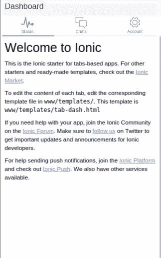
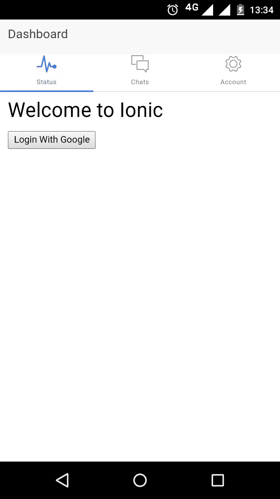
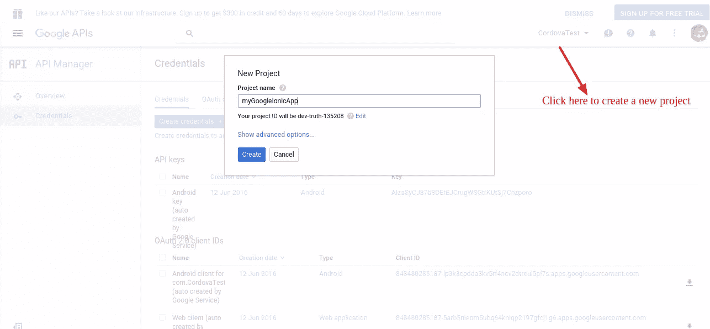
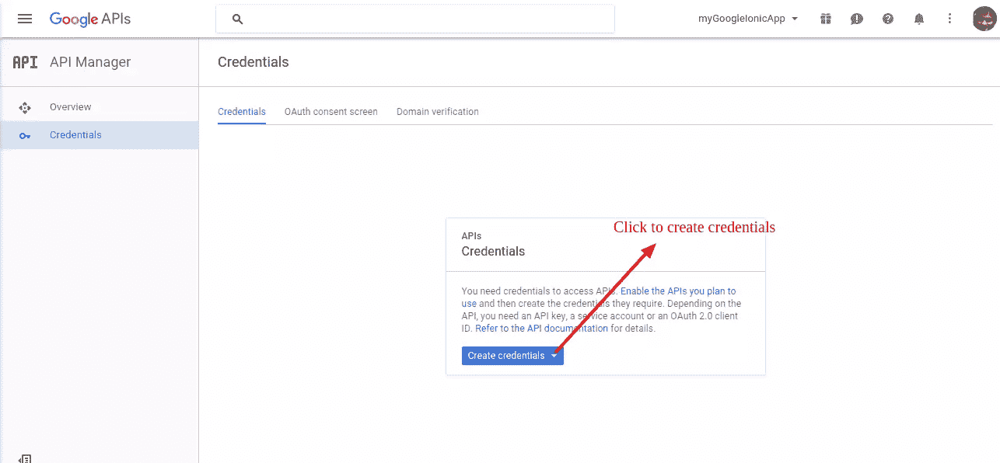
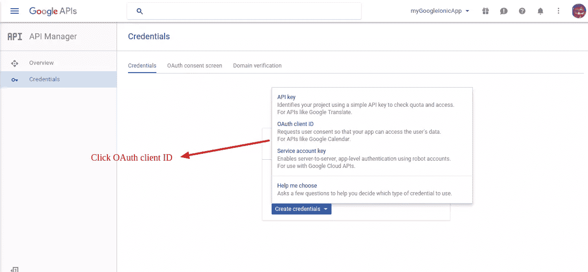
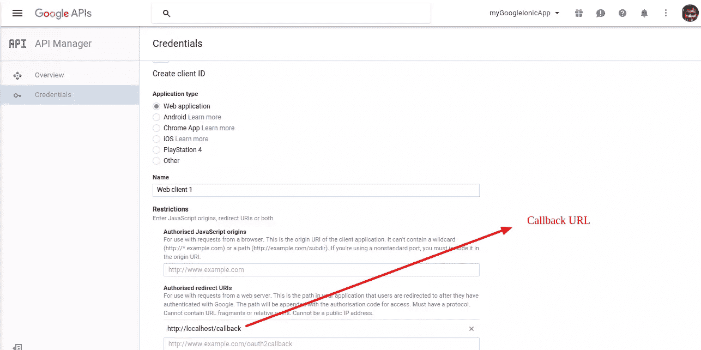
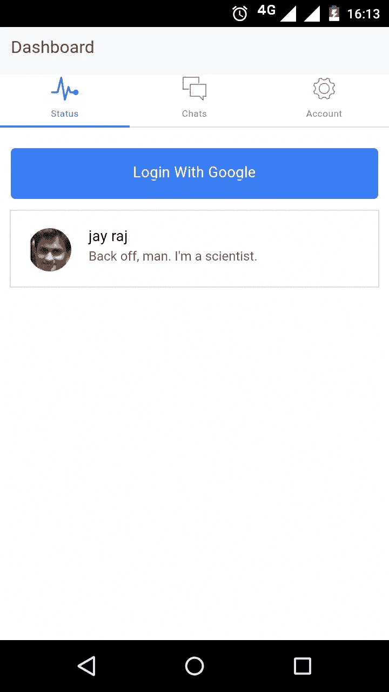

# 使用 Cordova 和 Ionic 通过 OAuth 认证用户

> 原文：<https://www.sitepoint.com/authenticating-users-via-oauth-with-cordova-and-ionic/>

*这篇文章由[沃恩·安切塔](https://www.sitepoint.com/author/wancheta/)进行了同行评审。感谢 SitePoint 的所有同行评审员使 SitePoint 的内容尽可能做到最好！*

对用户进行服务认证是移动应用的重要组成部分。它使您能够确保正确的用户访问您的服务，并使您能够个性化您向他们提供的服务。有许多可用的身份验证方法，但是通过 OAuth 对用户进行身份验证一直是开发人员的最爱。这是一个开放的授权标准，允许用户使用他们在其他服务(如脸书、谷歌等)上的帐户登录应用程序，而无需给应用程序任何凭据。在本教程中，我将介绍 cordovaOAuth 是一个 AngularJS 扩展，它允许移动开发者尽可能简单地将 OAuth 授权添加到基于 Cordova 的应用程序中。

## 该项目

有很多第三方网站提供 OAuth 授权，最流行的是 Google、脸书、GitHub 和 LinkedIn。在本教程中，我将向您展示如何在`$cordovaOauth`的帮助下使用 Google 帐户实现 OAuth 授权。我将使用 Ionic 框架来创建移动应用程序。如果你以前从未使用过 Ionic，我推荐你阅读我的教程，“用 Ionic 框架和 Firebase 创建清单”

本教程的源代码可以在 [GitHub](https://github.com/sitepoint-editors/IonicGoogleOauthApp) 获得。

## 入门指南

你需要安装 Cordova ( [我推荐 SitePoint 的 QuickTip](https://www.sitepoint.com/quick-tip-installing-and-getting-started-with-cordova/) )和 Ionic 框架(再次，[我推荐 SitePoint 的 QuickTip](https://www.sitepoint.com/quick-tip-installing-the-ionic-framework-for-html5-apps/) )

**注意**:这个例子将使用 Android 平台。

使用`tabs`模板创建一个 Ionic 应用。

```
ionic start myGoogleIonicApp tabs 
```

导航到项目目录*mygoogleioncapp*并运行服务器。

```
ionic serve 
```

你现在应该已经在 *[运行这个应用了。](http://localhost:8100)*



## 安装 ngCordova 和$cordovaOauth

导航到*mygoogleioncapp*目录并使用 bower 安装 ngCordova(是的，当然 SitePoint 有一个 [QuickTip](https://www.sitepoint.com/package-management-for-the-browser-with-bower/) ！).

```
bower install ngCordova 
```

在 index.html 页面的*科尔多瓦*脚本之前包含 *ngCordova* 脚本。

```
<script src="lib/ngCordova/dist/ng-cordova.js"></script>
<script src="cordova.js"></script> 
```

将`$cordovaOauth`插件添加到项目中。

```
cordova plugin add https://git-wip-us.apache.org/repos/asf/cordova-plugin-inappbrowser.git 
```

在项目中安装 *ng-cordova-oauth* 。

```
bower install ng-cordova-oauth 
```

在 index.html 页面的 *ngCordova* 脚本之后包含 *$cordovaOauth* 脚本。

```
<script src="lib/ng-cordova-oauth/dist/ng-cordova-oauth.js"></script> 
```

## 创建用户界面

导航到*www/templates/ta B- dash . html*并用以下代码替换现有代码:

```
<ion-view view-title="Dashboard">
  <ion-content class="padding">
    <h2>Welcome to Ionic</h2>
    <div>
      <a href="" ng-click="googleLogin()"><button>Login With Google</button></a>
    </div>
  </ion-content>
</ion-view> 
```

将 Android 平台添加到移动应用程序中，并构建代码:

```
ionic platform add android
ionic build android 
```

使用以下内容运行应用程序:

```
ionic run android 
```

您应该会看到下面的内容:



## 使用 Google 登录实现 OAuth

导航到 *www/js/app.js* ，注入 *ngCordova* 和 *ngCordovaOauth* 模块。

```
angular.module('starter', ['ionic', 'starter.controllers', 'starter.services','ngCordova','ngCordovaOauth']) 
```

在*内部 www/js/controllers.js* 在`DashCtrl`内部添加`googleLogin`函数，如图所示:

```
.controller('DashCtrl', function($scope, $cordovaOauth, $http) {

    $scope.googleLogin = function() {
        $cordovaOauth.google("app-id", ["email", "profile"]).then(function(result) {

        }, function(error) {

        });
    }
}) 
```

分解上面的代码，将`cordovaOauth`模块注入到`DashCtrl`控制器中，并使用`cordovaOauth`模块调用 Google API。您将需要一个应用程序密钥来启用 Google OAuth 登录，您可以从 [Google 开发者控制台](https://console.developers.google.com)获得该密钥。登录后，单击右上角的下拉菜单创建一个新项目。



点击左侧菜单中的*凭证*选项卡，并点击*创建凭证*按钮。



从菜单中选择 *OAuth 客户端 ID* ，点击*创建凭证*。



选择*应用类型*为 *Web 应用*，设置回调 URL，点击*创建*，如图所示:



一旦您创建了客户端，它应该显示客户端 ID，复制值并将其添加到`DashCtrl`中的`googleLogin`方法。

```
$scope.googleLogin = function() {
        $cordovaOauth.google("YOUR GOOGLE CLIENT ID", ["email", "profile"]).then(function(result) {
            $scope.details = result.access_token;
        }, function(error) {
          // Error code here
        });
    } 
```

接下来，您需要将 *scope.details* 绑定到用户界面，看看它是否工作。更改*www/templates/ta B- dash . html*如图所示:

```
<ion-view view-title="Dashboard">
  <ion-content class="padding">
    <h2>Welcome to Ionic</h2>
    <div>
      <a href="" ng-click="googleLogin()"><button>Login With Google</button></a>
      <span>{{details}}</span>
    </div>
  </ion-content>
</ion-view> 
```

保存更改，构建 ionic 应用程序并部署*。apk* 文件到设备。运行应用程序，点击使用谷歌账户登录。成功登录后，您应该能够看到应用程序屏幕上显示的访问令牌。

## 使用访问令牌提取用户信息

使用访问令牌，提取用户信息并显示在应用程序中。在`googleLogin`函数中，对 Google APIs 进行 http 调用以获取用户信息。

```
$http.get("https://www.googleapis.com/plus/v1/people/me", {
        params: {
            access_token: result.access_token
        }
    })
.then(function(res) {
    // success callback
}, function(error) {
    alert("Error: " + error);
}); 
```

在成功回调函数中，将用户信息绑定到一个范围变量，并显示在应用程序中。

```
$scope.details = res.data; 
```

现在，通过向现有按钮添加一个类来更改用户界面。

```
<div>
  <a href="" ng-click="googleLogin()"><button class="button button-block button-positive">Login With Google</button></a>
</div> 
```

要显示用户信息，请添加一个列表，如下所示:

```
<div ng-show="showProfile" class="list">
  <a class="item item-avatar" href="#">
    
    <h2>{{details.displayName}}</h2>
    <p>Back off, man. I'm a scientist.</p>
  </a>
</div> 
```

您添加了`showProfile`范围变量来隐藏应用加载时的列表，当`googleLogin`方法获取用户信息时将`showProfile`变量设置为`true`。

```
$scope.showProfile = true; 
```

下面是完整的`googleLogin`方法:

```
$scope.googleLogin = function(){

  $cordovaOauth.google("YOUR GOOGLE CLIENT ID", ["email","profile"]).then(function(result) {

      $scope.showProfile = false;
      $http.get("https://www.googleapis.com/plus/v1/people/me", {params: {access_token: result.access_token }})
      .then(function(res) {

       $scope.showProfile = true;
       $scope.details = res.data;

      }, function(error) {
          alert("Error: " + error);
      });

  },function(error) {
        // error
        $scope.details = 'got error';
    });
} 
```

保存更改，构建 ionic 应用程序并运行它。尝试通过点击谷歌按钮*登录，成功认证后，用户信息应显示在应用程序中。*



## 使用 ngCordova 插件做更多事情

在本教程中，您学习了如何使用 ngCordova 插件 cordovaOauth 向基于 Cordova 和 Ionic 的应用程序添加 OAuth 身份验证。如果您有兴趣了解更多可能有助于您开发的其他插件，我推荐您阅读 ngCordova 官方文档。

*请在*下方告诉我您的意见和问题。

## 分享这篇文章