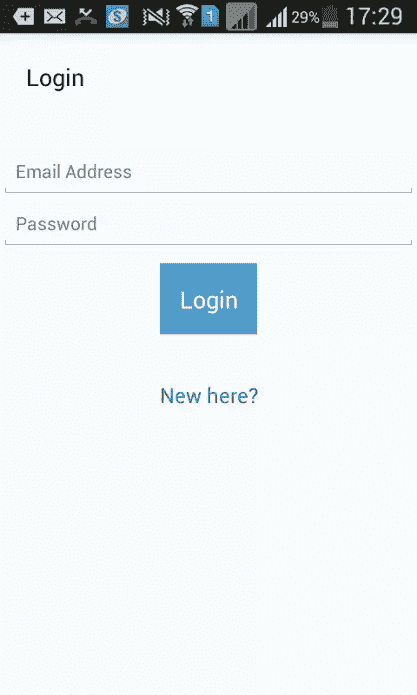
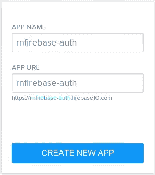
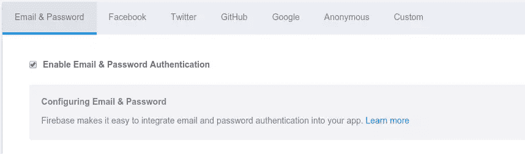

# React Native 与 Firebase 中的身份验证

> 原文：<https://www.sitepoint.com/authentication-in-react-native-with-firebase/>

*这篇文章由[阿德里安·桑杜](http://www.adriansandu.com/)进行了同行评审。感谢 SitePoint 的所有同行评审员使 SitePoint 的内容尽可能做到最好！*

React Native 是使用 JavaScript 和 React 创建跨平台移动应用程序的最受欢迎的选择之一。

对于许多应用程序来说，注册和认证用户是必不可少的，在本教程中，我将使用 [Firebase](https://www.firebase.com/) 在 React 原生应用程序中实现认证。

我在 Android 上测试，但本教程中的代码应该也能在 iOS 上运行。我假设您以前使用过 React Native，所以我不打算详细介绍所有 React Native 代码。如果你是 React Native 的新手，我建议你阅读我之前的教程，学习如何用 React Native 构建一个 Android 应用。

这是最终应用的外观:



最终代码在 [GitHub](https://github.com/sitepoint-editors/rn-firebase-auth) 上。

## 创建 Firebase 应用程序

要使用 Firebase，你首先要在 Firebase 上创建一个应用程序。登录您的[仪表盘](https://www.firebase.com/account/#/)并创建一个新应用。您需要将名称改为独特的名称。



创建完成后，点击*管理应用*按钮，然后*登录&验证*并根据您的喜好更新*会话长度*。此设置允许您更改每个用户会话保持有效的时间。我通常坚持 5 周，这意味着用户将不得不每 5 周登录一次。

接下来，启用*电子邮件&密码认证*，允许用户使用电子邮件和密码组合创建或登录帐户。



## 构建应用程序

该应用程序将是一个具有登录页面，注册页面和帐户页面的基本登录系统。用户将使用电子邮件和密码登录。如果帐户有效，用户将被重定向到显示用户信息和注销按钮的帐户页面。单击 logout 按钮会破坏 Firebase 会话，清除本地存储并使用户返回登录页面。

## 建立

通过执行以下命令创建项目:

```
react-native init rnfirebaseauth 
```

接下来，安装[反应土著天赋旋转器](https://www.npmjs.com/package/react-native-gifted-spinner)和[火焰基座](https://www.npmjs.com/package/firebase):

```
npm install react-native-gifted-spinner firebase --save 
```

顾名思义，“React native gifted spinner”允许您创建微调器来指示应用程序正在加载一些东西。这个应用程序将使用一个旋转器，同时与 Firebase 通信。

### 目录结构

在您的项目目录中创建一个 *src* 文件夹，并在其中创建一个*组件*、*页面*和*样式*文件夹。

您的目录结构现在应该如下所示:

```
rnfirebaseauth
    android
    ios
    node_modules
    package.json
    index.android.js
    index.ios.js
    src
        components
        pages
        styles 
```

以下是 *src* 目录中每个文件夹的用途:

*   *组件*:包含 app 使用的自定义组件。主要是为了方便，这样在使用不同的 UI 组件(如按钮和标题)时，您就不必编写大量代码。
*   *页面*:包含应用的单个页面。
*   *styles* :包含整个应用程序中使用的常用样式。

### 成分

#### 纽扣

按钮组件允许您创建按钮。它使用`props`来指定按钮文本、样式和按钮被按下时要执行的功能。创建*组件/button.js* 并添加以下代码:

```
'use strict';
import React, {
  AppRegistry,
  Component,
  Text,
  View,
  TouchableHighlight
} from 'react-native';

export default class button extends Component {

  render(){
    return (
      <View>
        <TouchableHighlight underlayColor={"#E8E8E8"} onPress={this.props.onpress} style={this.props.button_styles}>
          <View>
              <Text style={this.props.button_text_styles}>{this.props.text}</Text>
          </View>
        </TouchableHighlight>
      </View>
    );
  }
}

AppRegistry.registerComponent('button', () => button); 
```

#### 页眉

header 组件允许您创建标题。一个头有一个标题和一个微调器，显示什么时候`loaded` `props`是`false`。该微调器使用早期安装的 React native gifted 微调器。创建 *components/header.js* 并添加以下代码:

```
'use strict';
import React, {
  AppRegistry,
  Component,
  StyleSheet,
  Text,
  TextInput,
  View
} from 'react-native';

import GiftedSpinner from 'react-native-gifted-spinner';

export default class header extends Component {

  render(){
    return (
      <View style={styles.header}>
        <View style={styles.header_item}>
          <Text style={styles.header_text}>{this.props.text}</Text>
        </View>
        <View style={styles.header_item}>
        {  !this.props.loaded &&
            <GiftedSpinner />
        }
        </View>
      </View>
    );
  }

}

const styles = StyleSheet.create({
  header: {
    padding: 10,
    flexDirection: 'row',
    alignItems: 'center',
    marginBottom: 20,
    flex: 1
  },
  header_item: {
    paddingLeft: 10,
    paddingRight: 10
  },
  header_text: {
    color: '#000',
    fontSize: 18
  }
});

AppRegistry.registerComponent('header', () => header); 
```

### 页

#### 注册页面

注册页面是应用程序的默认页面，允许用户创建帐户。创建*页面/signup.js* 并添加以下内容:

```
'use strict';
import React, {
  AppRegistry,
  Component,
  Text,
  TextInput,
  View
} from 'react-native';

import Button from '../components/button';
import Header from '../components/header';

import Login from './login';

import Firebase from 'firebase';

let app = new Firebase("YOUR-FIREBASE-APP-URL");

import styles from '../styles/common-styles.js';

export default class signup extends Component {

  constructor(props){
    super(props);

    this.state = {
      loaded: true,
      email: '',
      password: ''
    };
  }

  signup(){

    this.setState({
      loaded: false
    });

    app.createUser({
      'email': this.state.email,
      'password': this.state.password
    }, (error, userData) => {

      if(error){
        switch(error.code){

          case "EMAIL_TAKEN":
            alert("The new user account cannot be created because the email is already in use.");
          break;

          case "INVALID_EMAIL":
            alert("The specified email is not a valid email.");
          break;

          default:
            alert("Error creating user:");
        }

      }else{
        alert('Your account was created!');
      }

      this.setState({
        email: '',
        password: '',
        loaded: true
      });

    });

  }

  goToLogin(){
    this.props.navigator.push({
      component: Login
    });
  }

  render() {
    return (
      <View style={styles.container}>
        <Header text="Signup" loaded={this.state.loaded} />
        <View style={styles.body}>

            <TextInput
                style={styles.textinput}
                onChangeText={(text) => this.setState({email: text})}
                value={this.state.email}
            placeholder={"Email Address"}
            />
          <TextInput
            style={styles.textinput}
            onChangeText={(text) => this.setState({password: text})}
            value={this.state.password}
            secureTextEntry={true}
            placeholder={"Password"}
          />
          <Button
            text="Signup"
            onpress={this.signup.bind(this)}
            button_styles={styles.primary_button}
            button_text_styles={styles.primary_button_text} />

          <Button
            text="Got an Account?"
            onpress={this.goToLogin.bind(this)}
            button_styles={styles.transparent_button}
            button_text_styles={styles.transparent_button_text} />
        </View>
      </View>
    );
  }
}

AppRegistry.registerComponent('signup', () => signup); 
```

分解上面的代码。首先导入 react native 并从`React`类中提取所有需要的东西。

```
import React, {
  AppRegistry,
  Component,
  Text,
  TextInput,
  View
} from 'react-native'; 
```

导入按钮和标题组件:

```
import Button from '../components/button';
import Header from '../components/header'; 
```

导入登录页面:

```
import Login from './login'; 
```

导入 Firebase 库，并通过指定应用程序的 URL 来创建对您之前创建的 Firebase 应用程序的引用。

**注意**:应该是*your-app-name.firebaseio.com*，而不是指定整个 URL，比如*http://your-app-name.firebasio.com*。您还需要替换每个文件中的`YOUR-FIREBASE-APP-URL`。

```
import Firebase from 'firebase';

let app = new Firebase("YOUR-FIREBASE-APP-URL"); 
```

导入常用样式:

```
import styles from '../styles/common-styles.js'; 
```

创建一个新组件，并将其导出到其他文件中。

```
export default class signup extends Component {
    ...
} 
```

在构造函数中，设置默认状态。`loaded`设置是否显示微调器。如果`loaded`是`true`，那么微调器是隐藏的，否则微调器是可见的。`email`和`password`是电子邮件和密码文本字段的默认值。

```
constructor(props){
  super(props);

  this.state = {
    loaded: true,
    email: '',
    password: ''
  };
} 
```

当用户点击注册按钮时，执行`signup`方法。首先将`loaded`设置为`false`以显示微调器。然后调用 firebase app 中的`createUser`方法。该方法接受一个包含用户电子邮件和密码的对象作为第一个参数，接受一个回调函数作为第二个参数。如果`error`不为空，则根据`error`的`code`属性提醒用户。否则，假设帐户已创建。最后将`email`和`password`设置为空字符串，以重置文本字段的值。

```
signup(){

  this.setState({
    loaded: false
  });

  app.createUser({
    'email': this.state.email,
    'password': this.state.password
  }, (error, userData) => {

    if(error){
      switch(error.code){

        case "EMAIL_TAKEN":
          alert("The new user account cannot be created because the email is already in use.");
        break;

        case "INVALID_EMAIL":
          alert("The specified email is not a valid email.");
        break;

        default:
          alert("Error creating user:");
      }

    }else{
      alert('Your account was created!');
    }

    this.setState({
      email: '',
      password: '',
      loaded: true
    });

  });

} 
```

`goToLogin`功能导航到登录页面。这通过使用导航组件的`push`方法来实现。`push`方法接受一个包含您想要显示的组件的对象。

```
goToLogin(){
  this.props.navigator.push({
    component: Login
  });
} 
```

`render`方法显示组件的 UI。它有一个标题，一个输入电子邮件和密码的文本字段，一个注册按钮和一个导航到登录页面的按钮。

```
render() {
  return (
    <View style={styles.container}>
      <Header text="Signup" loaded={this.state.loaded} />
      <View style={styles.body}>

        <TextInput
          style={styles.textinput}
          onChangeText={(text) => this.setState({email: text})}
          value={this.state.email}
          placeholder={"Email Address"}
        />
        <TextInput
          style={styles.textinput}
          onChangeText={(text) => this.setState({password: text})}
          value={this.state.password}
          secureTextEntry={true}
          placeholder={"Password"}
        />
        <Button
          text="Signup"
          onpress={this.signup.bind(this)}
          button_styles={styles.primary_button}
          button_text_styles={styles.primary_button_text} />

        <Button
          text="Got an Account?"
          onpress={this.goToLogin.bind(this)}
          button_styles={styles.transparent_button}
          button_text_styles={styles.transparent_button_text} />
      </View>
    </View>
  );
} 
```

注意状态中的`loaded`的值作为标题中的`loaded`属性的值。这允许从父组件控制微调器的显示。

```
<Header text="Signup" loaded={this.state.loaded} /> 
```

对于文本字段，指定`onChangeText`属性并传入一个箭头函数，该函数将更新状态中特定字段的值。

```
onChangeText={(text) => this.setState({password: text})} 
```

对于密码字段，还有另一个名为`secureTextEntry`的属性，它被设置为`true`以指定应该隐藏键入的字符。

```
secureTextEntry={true} 
```

对于按钮，请注意`bind`用于`signup`功能，而不是在按钮被按下时直接执行。这是因为 es6 中的方法不会自动绑定到当前类。

```
<Button
  text="Signup"
  onpress={this.signup.bind(this)}
  button_styles={styles.primary_button}
  button_text_styles={styles.primary_button_text} /> 
```

#### 登录页面

登录页面用于用户登录。创建*页面/login.js* 并添加以下代码:

```
'use strict';
import React, {
  AppRegistry,
  Component,
  StyleSheet,
  Text,
  TextInput,
  View,
  AsyncStorage
} from 'react-native';

import Button from '../components/button';
import Header from '../components/header';

import Signup from './signup';
import Account from './account';

import Firebase from 'firebase';

let app = new Firebase("YOUR-FIREBASE-APP-URL");

import styles from '../styles/common-styles.js';

export default class login extends Component {

  constructor(props){
    super(props);

    this.state = {
      email: '',
      password: '',
      loaded: true
    }
  }

  render(){
    return (
      <View style={styles.container}>
        <Header text="Login" loaded={this.state.loaded} />
        <View style={styles.body}>
          <TextInput
            style={styles.textinput}
            onChangeText={(text) => this.setState({email: text})}
            value={this.state.email}
            placeholder={"Email Address"}
          />
          <TextInput
            style={styles.textinput}
            onChangeText={(text) => this.setState({password: text})}
            value={this.state.password}
            secureTextEntry={true}
            placeholder={"Password"}
          />

          <Button
            text="Login"
            onpress={this.login.bind(this)}
            button_styles={styles.primary_button}
            button_text_styles={styles.primary_button_text} />

          <Button
            text="New here?"
            onpress={this.goToSignup.bind(this)}
            button_styles={styles.transparent_button}
            button_text_styles={styles.transparent_button_text} />
        </View>
      </View>
    );
  }

  login(){

    this.setState({
      loaded: false
    });

    app.authWithPassword({
      "email": this.state.email,
      "password": this.state.password
    }, (error, user_data) => {

      this.setState({
        loaded: true
      });

      if(error){
        alert('Login Failed. Please try again');
      }else{
        AsyncStorage.setItem('user_data', JSON.stringify(user_data));
        this.props.navigator.push({
          component: Account
        });
      }
    });

  }

  goToSignup(){
    this.props.navigator.push({
      component: Signup
    });
  }

}

AppRegistry.registerComponent('login', () => login); 
```

除了`login`函数之外，这里没有什么新东西。`login`函数从 Firebase 应用程序调用`authWithPassword`方法，传递一个包含用户的电子邮件和密码的对象，以及一个回调函数，以便在响应返回时执行。如果响应中没有错误，通过调用`AsyncStorage`对象中的`setItem`方法，使用`AsyncStorage`将用户数据存储在本地存储中。此方法接受项目的名称及其值。

**注意**:你只能存储字符串，所以我们使用`JSON.stringify`方法将`user_data`对象转换成字符串。之后，导航到帐户页面或提醒用户登录失败。

```
login(){

  this.setState({
    loaded: false
  });

  app.authWithPassword({
    "email": this.state.email,
    "password": this.state.password
  }, (error, user_data) => {

    this.setState({
      loaded: true
    });

    if(error){
      alert('Login Failed. Please try again');
    }else{
      AsyncStorage.setItem('user_data', JSON.stringify(user_data));
      this.props.navigator.push({
        component: Account
      });
    }
  });

} 
```

#### 帐户页面

账户页面显示当前用户的基本信息。创建*页面/account.js* 并添加以下内容:

```
'use strict';
import React, {
  AppRegistry,
  Component,
  StyleSheet,
  Text,
  View,
  Image,
  AsyncStorage
} from 'react-native';

import Button from '../components/button';
import Header from '../components/header';

import Login from './login';

import styles from '../styles/common-styles.js';

import Firebase from 'firebase';

let app = new Firebase("YOUR-FIREBASE-APP-URL");

export default class account extends Component {

  constructor(props){

    super(props);
    this.state = {
      loaded: false,
    }

  }

  componentWillMount(){

    AsyncStorage.getItem('user_data').then((user_data_json) => {
      let user_data = JSON.parse(user_data_json);
      this.setState({
        user: user_data,
        loaded: true
      });
    });

  }

  render(){

    return (
      <View style={styles.container}>
        <Header text="Account" loaded={this.state.loaded} />  
        <View style={styles.body}>
        {
          this.state.user &&
            <View style={styles.body}>
              <View style={page_styles.email_container}>
                <Text style={page_styles.email_text}>{this.state.user.password.email}</Text>
              </View>
              <Image
                style={styles.image}
                source={{uri: this.state.user.password.profileImageURL}}
              />
              <Button
                  text="Logout"
                  onpress={this.logout.bind(this)}
                  button_styles={styles.primary_button}
                  button_text_styles={styles.primary_button_text} />
            </View>
        }
        </View>
      </View>
    );
  }

  logout(){

    AsyncStorage.removeItem('user_data').then(() => {    
      app.unauth();
      this.props.navigator.push({
        component: Login
      });
    });

  }

}

const page_styles = StyleSheet.create({
  email_container: {
    padding: 20
  },
  email_text: {
    fontSize: 18
  }
}); 
```

与目前创建的其他页面不同，这个页面有一个`componentWillMount`方法。该方法在组件挂载之前执行，因此是从本地存储获取用户数据的最佳位置。这一次它使用了来自`AsyncStorage`对象的`getItem`方法，该方法接受项目的名称作为其参数。要获得存储的值，使用`then`方法并传入一个函数。然后，这个函数会将值作为参数传递给它。使用`JSON.parse`将值转换回对象，然后将其设置为当前状态。这样你可以使用`this.state.user`从用户对象中提取任何信息。

```
componentWillMount(){

  AsyncStorage.getItem('user_data').then((user_data_json) => {
    let user_data = JSON.parse(user_data_json);
    this.setState({
      user: user_data,
      loaded: true
    });
  });

} 
```

在`render`方法中有一个名为`Image`的新组件。这允许您显示一个非常像 HTML 中的`img`元素的图像，但是指定一个包含`uri`属性的对象的`source`属性。这个`uri`属性指的是您想要显示的图像的 URL。

```
<Image
  style={styles.image}
  source={{uri: this.state.user.password.profileImageURL}} /> 
```

### 风格

每个组件都包含了*src/styles/common-styles . js*，但是这个还没有被创建。该文件充当整个应用程序的全局样式表。创建文件并添加以下代码:

```
'use strict';
import React, {
  StyleSheet
} from 'react-native';

module.exports = StyleSheet.create({
  container: {
    flex: 1,
  },
  body: {
    flex: 9,
    alignItems: 'center',
    backgroundColor: '#F5FCFF',
  },
  textinput: {
    height: 40,
    borderColor: 'red',
    borderWidth: 1
  },
  transparent_button: {
    marginTop: 10,
    padding: 15
  },
  transparent_button_text: {
    color: '#0485A9',
    fontSize: 16
  },
  primary_button: {
    margin: 10,
    padding: 15,
    backgroundColor: '#529ecc'
  },
  primary_button_text: {
    color: '#FFF',
    fontSize: 18
  },
  image: {
    width: 100,
    height: 100
  }
}); 
```

### 将所有东西整合在一起

现在把所有东西放在一起，用下面的代码替换掉 *index.android.js* 中的代码，或者如果你想部署到 ios 上，替换掉 *index.ios.js* 。

```
'use strict';
import React, {
  AppRegistry,
  Component,
  Text,
  View,
  Navigator,
  AsyncStorage
} from 'react-native';

import Signup from './src/pages/signup';
import Account from './src/pages/account';

import Header from './src/components/header';

import Firebase from 'firebase';

let app = new Firebase("YOUR-FIREBASE-APP-URL");

import styles from './src/styles/common-styles.js';

class rnfirebaseauth extends Component {    

  constructor(props){
    super(props);
    this.state = {
      component: null,
      loaded: false
    };
  }

  componentWillMount(){

    AsyncStorage.getItem('user_data').then((user_data_json) => {

      let user_data = JSON.parse(user_data_json);
      let component = {component: Signup};
      if(user_data != null){
        app.authWithCustomToken(user_data.token, (error, authData) => {
          if(error){
            this.setState(component);
          }else{
            this.setState({component: Account});
          }
        });
      }else{
        this.setState(component);
      }
    });

  }

  render(){

    if(this.state.component){
      return (
        <Navigator
          initialRoute={{component: this.state.component}}
          configureScene={() => {
            return Navigator.SceneConfigs.FloatFromRight;
          }}
          renderScene={(route, navigator) => {
            if(route.component){
              return React.createElement(route.component, { navigator });
            }
          }}
        />
      );
    }else{
      return (
        <View style={styles.container}>
          <Header text="React Native Firebase Auth" loaded={this.state.loaded} />  
          <View style={styles.body}></View>
        </View>
      );
    }

  }

}

AppRegistry.registerComponent('rnfirebaseauth', () => rnfirebaseauth); 
```

`componentWillMount`方法检查本地存储器中是否存储有`user_data`。与前面的帐户页面一样，使用`AsyncStorage.getItem`从本地存储中获取数据，然后解析它。如果它返回`null`，那么假设本地存储中没有任何内容，并更新状态以将注册页面设置为当前页面。否则，通过调用`app.authWithCustomToken`并传递用户令牌，尝试使用用户上次尝试使用其电子邮件和密码登录时的令牌对用户进行身份验证。如果成功，将当前页面设置为帐户页面，或者设置为注册页面。

```
componentWillMount(){

  AsyncStorage.getItem('user_data').then((user_data_json) => {

    let user_data = JSON.parse(user_data_json);
    let component = {component: Signup};
    if(user_data != null){
      app.authWithCustomToken(user_data.token, (error, authData) => {
        if(error){
          this.setState(component);
        }else{
          this.setState({component: Account});
        }
      });
    }else{
      this.setState(component);
    }
  });

} 
```

在`render`方法中，检查组件是否设置在状态中。正如您在前面的`constructor`方法中看到的，这是`null`，所以默认情况下将执行`else`语句。在`else`语句中是打开应用程序时显示的默认用户界面。一旦状态被更新，再次调用`render`方法，这次执行`if`条件内的代码。

```
if(this.state.component){
  return (
    <Navigator
      initialRoute={{component: this.state.component}}
      configureScene={() => {
        return Navigator.SceneConfigs.FloatFromRight;
      }}
      renderScene={(route, navigator) => {
        if(route.component){
          return React.createElement(route.component, { navigator });
        }
      }}
    />
  );
}else{
  return (
    <View style={styles.container}>
      <Header text="React Native Firebase Auth" loaded={this.state.loaded} />  
      <View style={styles.body}></View>
    </View>
  );
} 
```

在`if`条件中，`Navigator`组件处理页面之间的导航。它接受了`initialRoute`和`renderScene`属性以及一个可选的`configureScene`属性，以便在页面间导航时定制动画。`initialRoute`允许您使用导航器指定一个包含默认组件信息的对象。`renderScene`方法接受函数，该函数将呈现组件，并将`route`和`navigator`作为参数传递给该函数。`route`是在`initialRoute`属性中传递的对象。

使用`route.component`可以获得对组件的实际引用，并使用`React.createElement`进行渲染。第二个参数是一个对象，包含您想要传递给渲染组件的`props`。在这种情况下，传递的是`navigator`对象，它包含了在不同页面之间导航所需的所有方法。

如果你查看每个页面(登录、注册、账户)的代码，你会看到`navigator`对象被用作`this.props.navigator`，因为它被作为`props`传递。

```
<Navigator
      initialRoute={{component: this.state.component}}
      configureScene={() => {
        return Navigator.SceneConfigs.FloatFromRight;
      }}
      renderScene={(route, navigator) => {
        if(route.component){
          return React.createElement(route.component, { navigator });
        }
      }} /> 
```

## 接下来呢？

在本教程中，您创建了一个应用程序，它通过电子邮件和密码组合来验证使用 Firebase 的用户。在身份验证方面，Firebase 提供了更多的特性。你可能已经注意到，当你创建应用程序时，Firebase 允许你使用脸书、Twitter、Github、Google、匿名和自定义登录。如果您正在寻找其他方法来验证您的用户，我建议您查看这些选项。

您还了解了如何使用`AsyncStorage`在本地持久化用户数据。这允许应用程序在后续应用程序启动时保持登录状态。

Firebase 为您提供了移动应用的基本功能，我希望本教程对您有用，并欢迎您提出意见和问题。

## 分享这篇文章