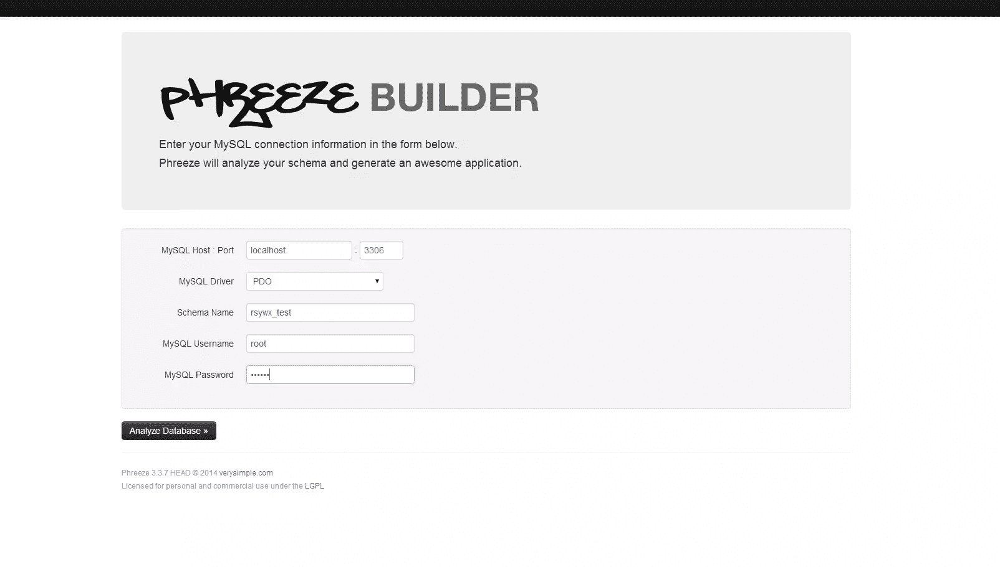
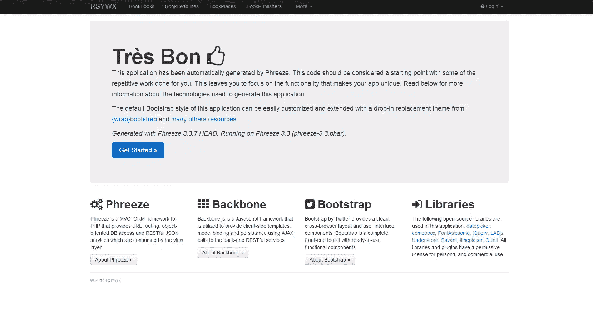
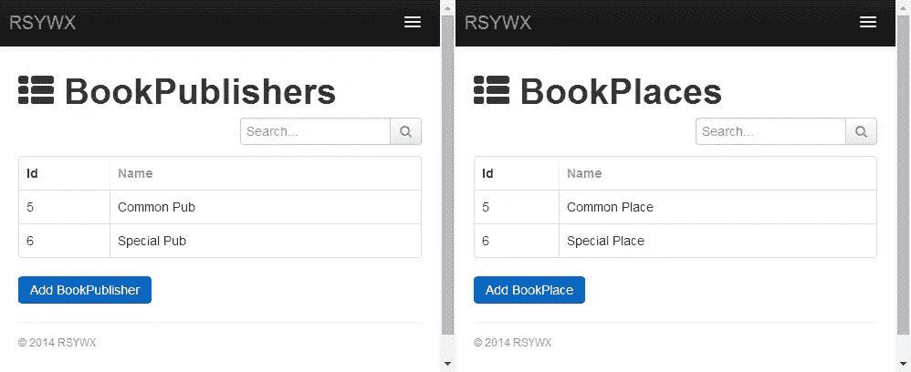
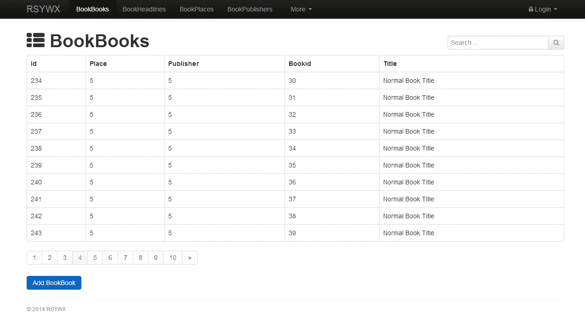

# 使用 Phreeze 自动生成 CRUD 应用程序

> 原文：<https://www.sitepoint.com/autogenerate-crud-apps-phreeze/>

回到 Symfony 1.x 时代，该框架有一个强大的后端模块来帮助开发人员和站点管理员创建足够好的应用程序，并提供必要的 CRUD 特性来管理数据库(并避免我们使用 PHPMyAdmin)。

自 Symfony 2 以来，这一功能已经从核心中移除，开发人员要么不得不依靠自己从头开始，要么在需要这一功能时依靠其他第三方 Symfony 2 捆绑包——在许多情况下都是如此。

在本文中，我们将看一看 [Phreeze](http://www.phreeze.com/) ，这是一个简单易用的 PHP 框架，可以帮助我们生成 MySQL CRUD 后端应用程序。我将使用我的图书收藏测试站点作为底层数据库。关于数据库结构的更多细节，请参考我在 Symfony2 文章中的[数据装置。](https://www.sitepoint.com/data-fixtures-symfony2/)

### 安装和引导

Phreeze 是作为独立版本发布的。你可以从 Github 中克隆其最新版本[的副本。](https://github.com/jasonhinkle/phreeze)

在我的环境中，我创建了一个新的虚拟主机`test`，并将存储库克隆到它的`phreeze`文件夹中，这样我就可以使用`http://test/phreeze/builder`用 Phreeze 开始后端生成。

为了方便后端的生成，Phreeze 引入了两步向导式的屏幕来指导我们。

在第一个屏幕中，我们将提供必要的数据库连接信息(服务器、数据库/模式、用户、密码):



在 MySQL 驱动选项上，Phreeze 提供了 raw `mysql_connect`、`mysqli_connect`以及 PDO。推荐 PDO，因为它现在更受欢迎，`mysql_*`已经过时了。

接下来，我们可以单击“分析数据库”，这将把我们带到第二个也是最后一个屏幕:


默认情况下，会识别和选择数据库中的所有表。如果我们不想在 CRUD 后端包含某个特定的表，我们应该取消选择它。在我的例子中，我已经取消选择了表`book_visit`,因为该表存储了图书详细信息页面的访问信息，并填充在我的应用程序中。

Phreeze 还为每个表建议了生成实体的名称。单数形式的名称(`BookBook`)反映一个表的一个实体(一本书)(`book_book`)，复数形式的名称(`BookBooks`)反映该表的收藏类(所有书)(`book_book`)。

Phreeze 在暗示复数形式时相当聪明(从`Lakers` / `Lakerses`中可以看出)。所以通常我会不动这些建议。

我们可以放心地将“列前缀”留空。在为后端生成实体的过程中，它用于从表的字段名中去除(而不是附加)列前缀。例如，如果您的表有一个名为`fld_firstname`的字段，您可以提供一个列前缀`fld_`，这样在生成的类中，该字段将被映射到一个名为`firstname`的成员，而不是`fld_firstname`。

接下来，在“应用程序选项”中，Phreeze 提供了一些下拉菜单，让我们调整生成的后端应用程序。

**包生成**

它提供两种类型的包:一种是使用不同模板引擎(Savant、Laraval/Blade、Smarty)的跑步 app。目前还不支持 Twig 模板，所以在我的 Symfony 2 站点中，我必须使用 Smarty 来显示我的后端视图。所有模板将使用[引导](http://getbootstrap.com/) CSS 锅炉板。这将有助于我们在后期进一步定制后端视图的布局、样式等。

另一种类型的包称为测试包。If 支持 PHPUnit 和 QUnit。我们不会在本文中讨论这个问题。

**应用程序名称和根 URL**

对于应用程序名称，只要给它一个有意义的你的选择。

在设置应用程序根 url 时，我们需要小心。现在，我们只是给它起一个名字，稍后我们再回到这个设置。

**lib 和自包含的路径**

让“libs 之路”保持原样。

我将选择“是”以使生成的后端应用程序自包含。

**长轮询**

选择“禁用”，这也是默认选项。长轮询确保界面通过 ajax 刷新，这允许你在几个选项卡中使用应用程序，并立即看到一个选项卡中发生的变化，而不必重新加载它们。这在很大程度上是赏心悦目的，但不是必需的。

现在，让我们单击“生成应用程序”。Phreeze 将开始生成所有必要的文件，并将它们压缩到一个归档文件中(在本例中，这个文件被命名为“`backend.zip`”)。

生成的 zip 文件相当大(在我的例子中几乎有 1M)，但其中大部分是由引导文件(CSS、image、js、font 等)和 Phreeze 的 PHAR 归档文件组成的(我们选择了“自包含”并为我们的应用程序包含了 Phreeze 框架)。

### 放在 Symfony 2 项目下

上面创建的`backend.zip`文件是我们启动后端所需的一切。要将这些解压后的文件集成到 Symfony 2 中，我的方法如下:

*   回想一下我们为“应用程序根 URL”提供的内容。这种情况下就是`http://servername/backend`。
*   我的网站将使用这个后端的服务器名称为`rsywx`，所以调用我的后端的 URL 应该类似于`http://rsywx/backend`。
*   由于 Symfony 2 把所有“静态”的东西都放到了它的`web`目录中，我在那个`web`目录下创建了`backend`目录，并将`backend.zip`中的所有文件解压到那个目录中。

要启动后端，我们只需访问`http://rsywx/backend`，后端欢迎屏幕将如下所示:



(**注:**由于 Symfony 2。htaccess 重写规则以及您的 LAMP/WAMP 配置，您可能看不到任何内容，或者只看到一个目录列表。在这种情况下，尝试访问`http://rsywx/backend/index.php`。后一个 URL 总是有效的。)

在页面顶部，我们可以看到一些导航链接。每个都会将我们带到相应表的 CRUD 页面。让我们来看看其中的一些，并尝试 CRUD 一些记录。

(**注意:** CRUD 操作会极大地改变您的数据库/表，因此对于这个演示，我将只在一个测试数据库上应用这些操作。使用我在上一篇文章中讨论的`DataFixtures`,测试数据库总是可以转储相同的数据集。)

以下几张截图显示了`book_publishers`、`book_places`和`book_taglist`(进行插入操作)将显示的内容:




注意，由于`book_taglist`有一个链接到`book_book`的 FK，`bid`字段在一个下拉框中，这样我们可以选择一个有效的图书 id 以避免一致性检查失败。

此外，在上面显示的每个页面中，都有一个“搜索”功能，我们可以用它来进一步过滤显示的结果。

点击表格的头部将在特定字段中对结果进行排序，从升序和降序切换。很方便，对吧？

现在我们来看看`book_book`表的显示。我们点击顶部导航栏中的“BookBooks”链接，预计总共会看到 101 本书。哎呀！为什么只展示了一本书？

在与 Phreeze 的作者讨论之后，我们设法解决了这个问题:在我的`book_book`表设置中，有一个名为`page`的字段。Phreeze 的内部路由/控制器也使用一个`page`参数对结果集进行分页(就像`page=1`显示第一页一样)。但是由于`page`也是我的表的有效字段名，Phreeze 认为我试图过滤结果集，只显示那些`page`字段值为 1 的记录。

在我的测试数据中，只有一条记录的`page`值为 1。这解释了为什么只显示一条记录。

作者(谢谢杰森！)提供了两种解决方案。

一种选择是将该字段重命名为其他名称，比如`pages`。但是这将在我们的 Symfony 2 设置中涉及很多，包括重新导入数据库映射和重新生成实体。所以我就否认了。

第二种，也是我使用的方法，是对生成的代码进行一些修改。以下是方法:

*   找到并打开`BookBookController.php`文件。如果你遵循上面的设置说明，它应该位于我们的 Symfony 2 项目中的`web/backend/libs/Controller`下。
*   在第 60-70 行附近，在名为`Query()`的函数中，应该有这几行:

```
if  (property_exists($criteria, $prop_normal))  { $criteria->$prop_normal =  RequestUtil::Get($prop);  } elseif (property_exists($criteria, $prop_equals))  {  // this is a convenience so that the _Equals suffix is not needed $criteria->$prop_equals =  RequestUtil::Get($prop);  }
```

*   在我们的表字段`page`与 Phreeze 查询参数`page`冲突的特殊情况下，我们修改上面的代码以允许一个例外:

```
if  ($prop !=  'page'  && property_exists($criteria, $prop_normal))  { $criteria->$prop_normal =  RequestUtil::Get($prop);  } elseif ($prop !=  'page'  && property_exists($criteria, $prop_equals))  {  // this is a convenience so that the _Equals suffix is not needed $criteria->$prop_equals =  RequestUtil::Get($prop);  } 
```

*   保存并重新加载。

答对了。以下是我们的图书 CRUD 页面显示的内容:



图书列表显示正确，分页工作正常。(以上截图显示我们在第 4 页。)

### 更改应用程序配置

Phreeze 依靠三个配置文件来正确运行。

*   `_machine_config.php`:该文件保存数据库连接参数和应用程序根 URL 设置。我们需要在部署时更改设置。
*   `_global_config.php`:该文件定义了许多应用特定的设置和基本功能。通常，我们会让它保持原样。
*   `_app_config.php`:该文件定义了所有的路线和其他设置。正常情况下不应该修改。

### 蜜蜂

Phreeze 最出彩的地方在于它提供了一个 API 接口。为了直接调用 API 并查看其 JSON 输出，我们在我们调用的 URI 中添加了`api`来显示数据。

例如，显示图书数据，URI 为:`http://rsywx/backend/bookbooks`；为了从 API 获得 JSON 输出，我们使用这个:`http://rsywx/backend/api/bookbooks`。

这个 API 接口有两个闪光点:

1.  当我们定制视图时，我们有办法直接从各自的 API 获取数据。然后我们可以使用 JSON decode 解析返回的数据，并在我们的模板引擎中使用它们。这将节省我们大量的时间和精力。
2.  它实际上成为一个开箱即用的 RESTful API，向第三方提供数据。

当然，有了 Phreeze 抓取的原始数据，我们或许还能发现一些其他不那么明显的问题和 bug。

### 保护入口

现在，每个人都可以访问这个后端 URL ( `http://rsywx/backend/index.php`)。在大多数情况下，这不是一个好主意，所以让我们保护对这个页面的访问，或者更准确地说，对这个目录的访问(`web/backend`)。

用 Symfony 2 的术语来说，Phreeze 不是一个捆绑包。因此 Symfony 的内置授权并不适用，任何人都可以访问`/backend`。

在这种情况下，我使用了`.htaccess`和`.htpasswd`的组合，通过 HTTP 认证在这个目录上提供一个相当入门级的安全控制。

**注意:** Phreeze 也有自己的认证。它使用一个表来存储用户名和散列密码。但是在这篇简短的入门教程中，我将忽略它。感兴趣的可以下载阅读其[授权演示](http://phreeze.com/phreeze/documentation/assets/authexample.zip)进行深入了解。

Phreeze 有自己的`.htaccess`文件，我们只是在它的末尾添加了几行:

```
AuthName  "RSYWX Backend"  AuthType  Basic  AuthUserFile  .htpasswd require valid-user
```

然后我们可以在 Linux 下用`htpasswd`实用程序创建一个`.htpasswd`文件。我们将那个`.htpasswd`文件复制到一个适当的位置。在我的 Windows EasyPHP 安装中，应该是复制到`f:\EasyPHP\binaries\apache\`的。如果一开始找不到合适的位置，也不要慌。如果这个文件在错误的位置，会有一个 500 错误，Apache `error.log`会一直提示你正确的位置。

**注意:**在 Symfony 2 站点中，不使用 Symfony 内置授权方法(`security.yml`)的 HTTP 认证可能会失败。它在我当前的本地 EasyPHP 设置中运行良好，但在我的生产服务器设置中失败了，区别在于 Apache 版本。推荐 Apache 2.4。

### 一些想法和结论

Phreeze 对我来说非常方便。在它的帮助下，我设法在 10 分钟内为我的网站创建了我的后端 CRUD 模块，没有写一行代码(当然，除了黑客的东西)。

它的特点不是超级丰富，而是足够了。我很喜欢 API，过滤和排序。

它的界面可能仍需要改进。目前，它完全依赖 JavaScript 和 DOM 操作来动态显示新数据(比如，当我们导航到下一页时)。URL 将保持不变，但我希望看到类似`http://rsywx/backend/bookbooks/page/2`的东西，这样我就可以快速导航到我想要的页面，而不是多次单击分页链接(它只有上一页/下一页链接和总共 10 个页面链接)。

我渴望树枝模板支持。Symfony 2 用户大量使用 Twig，Twig 本身也相当成熟和受欢迎。我希望在未来的版本中看到这一点。

缺少其他数据库支持可能会限制其应用范围。在我个人看来，当通过 PDO 支持 MySQL 时，支持其他流行的数据库(SQLite、pgSQL、MongoDB 等)也不是不可能的任务。我希望这在作者的路线图中。

它可能不像 Symfony 2 中的其他管理生成器包那样有花哨的界面，但对于简单快速的后端设置和使用来说已经足够了。毕竟，我们可以用自己的创造力赋予它全新的面貌。

这也有一个好处，就是和 Symfony 2 绑定不紧密。你可以在任何一个 MySQL 支持的站点上使用它。

有关 Phreeze 的详细文档，请参考其官方网站。

我会给 Phreeze 打 4 分(满分 5 分),并推荐你在自己的网站上使用它。

让我知道你的反馈和意见！

## 分享这篇文章