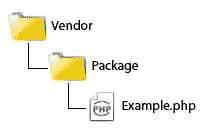
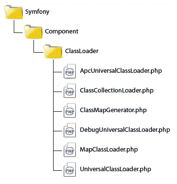

# PHP 和 PSR-0 标准中的自动加载

> 原文：<https://www.sitepoint.com/autoloading-and-the-psr-0-standard/>

假设你有一个 Rectangle.php 文件，它包含了一个`Rectangle`类的定义。在您可以在代码中的其他地方创建对象的实例之前，您首先需要拉入`Rectangle.php`文件，可能是这样写的:

```
<?php
require "Rectangle.php";
$rect = new Rectangle(42, 25);
```

通常我们把每个类的定义放在它自己的文件中以便更好的组织，所以你需要要求/包含你想要使用的每个类文件。如果只有几个文件，那就不是太大的问题，但通常情况并非如此。像这样加载一个包含所有依赖项的大型库是非常麻烦的。

在本文中，我将带您了解“自动加载的历史”，从旧的到现在的 PSR-0 标准自动加载器方法，这种方法在许多 PHP 框架中都能找到，如 Lithium、Symfony、Zend 等。然后我将向您介绍来自 PHP 5.3 的 [Symfony2 项目的](http://symfony.com)[类加载器](https://github.com/symfony/ClassLoader)组件，它遵循 [PSR-0 标准](https://github.com/php-fig/fig-standards/blob/master/accepted/PSR-0.md)。

**警告:**本文开头的大部分代码示例演示了不推荐使用的方法。在生产中使用它们是不明智的。我建议你使用 PSR-0 标准自动装弹机。

## “过去”的自动装弹

PHP 5 引入了神奇的函数`__autoload()`，当你的代码引用一个还没有加载的类或接口时，这个函数会被自动调用。这为运行时提供了在 PHP 出错失败之前加载定义的最后一次机会。

下面是一个非常基本的`__autoload()`实现的例子:

```
<?php
function __autoload($className) {
    $filename = $className . ".php";
    if (is_readable($filename)) {
        require $filename;
    }
}
```

在尝试包含文件之前，确保文件存在是一个好主意，但有时文件可能存在，但没有足够的读取权限，所以最好使用`is_readable()`而不是`file_exists()`，这将测试两种情况。

`__autoload()`功能的主要缺点是你只能提供一个自动加载器。PHP 5.1.2 引入了允许你注册多个自动加载器函数的`spl_autoload()`，在未来`__autoload()`函数将被弃用。

`spl_autoload_register()`的引入给了程序员创建自动加载链的能力，这是一系列可以被调用来尝试加载类或接口的函数。例如:

```
<?php
function autoloadModel($className) {
    $filename = "models/" . $className . ".php";
    if (is_readable($filename)) {
        require $filename;
    }
}

function autoloadController($className) {
    $filename = "controllers/" . $className . ".php";
    if (is_readable($filename)) {
        require $filename;
    }
}

spl_autoload_register("autoloadModel");
spl_autoload_register("autoloadController");
```

一般来说，函数是按照注册的顺序调用的，但是这个顺序也会受到传递给`spl_autoload_register()`的额外参数的影响。

重要的是要记住，一旦用`spl_autoload_register()`注册了一个函数，就不再调用`__autoload()`函数。如果你有一个`__autoload()`功能想作为你的自动加载器链的一部分运行，那么你必须向`spl_autoload_register()`注册它。

当然，到目前为止，我展示的自动加载函数的实现相当简单。真实世界的自动装弹机更加复杂。

在 PHP 5.3 引入真正的名称空间支持之前，开发人员设计了自己的方法来防止命名冲突。PEAR 编码标准使用下划线在类名前面加上它们的目录路径；例如，类`Zend_Translate`将在文件`Zend/Translate.php`中定义。自动加载程序需要用目录分隔符替换下划线来定位定义。

此外，不同的开发人员在命名他们的类文件时采用不同的约定，例如，文件可能以`.php`、`.class.php`、`.inc`等结尾。一些库也可能安装在不同的路径中。加载程序需要在各个地方寻找它们，所以现在加载程序看起来像这样:

```
<?php
function __autoload($className) {
    $extensions = array(".php", ".class.php", ".inc");
    $paths = explode(PATH_SEPARATOR, get_include_path());
    $className = str_replace("_" , DIRECTORY_SEPARATOR, $className);
    foreach ($paths as $path) {
        $filename = $path . DIRECTORY_SEPARATOR . $className;
        foreach ($extensions as $ext) {
            if (is_readable($filename . $ext)) {
                require_once $filename . $ext;
                break;
           }
       }
    }
}
```

自动加载是一个有用的想法，但是这个想法迫切需要一些标准化。

## PSR-0 标准

在 PHP 5.3 引入真正的名称空间支持后，一群来自 PHP 社区的人决定在 2009 年创建 PHP 标准工作组(后更名为[框架互操作性组](https://github.com/php-fig))并建立 PSR-0 标准，该标准概述了自动加载器互操作性必须遵循的各种实践和约束。以下是符合 PSR-0 的要求:

*   完全限定的名称空间和类必须具有以下结构`<Vendor Name>(<Namespace>)*<Class Name>`。
*   每个名称空间必须有一个顶级名称空间(“供应商名称”)。
*   每个名称空间可以有任意数量的子名称空间。
*   从文件系统加载时，每个名称空间分隔符都被转换为 DIRECTORY_SEPARATOR。
*   类名中的每个下划线都被转换成一个`DIRECTORY_SEPARATOR`。下划线在命名空间中没有特殊含义。
*   从文件系统加载时，完全限定的名称空间和类以`.php`为后缀。
*   供应商名称、名称空间和类名中的字母字符可以是小写和大写的任意组合。

根据 PSR-0 标准，应该有一个顶级目录，首先是供应商名称，然后是软件包名称，因此目录树将如下所示:



然后，这些类将相应地命名为:

```
<?php
namespace VendorPackage;
class Example
{
}
```

因此，`DoctrineCommonConnections`的类定义将在`/path/to/project/lib/Doctrine/Common/Connections.php`找到，而`SymfonyCoreRequest`在`/path/to/project/lib/Symfony/Core/Request.php`找到。PSR-0 标准并没有规定路径的基本`/path/to/project/lib`部分是什么，符合标准的自动装弹机提供了不同的解决方法。有些会允许你注册目录，有些会搜索 PHP 的`include_path`，有些两者都提供。下面是一个取自公认的 PSR-0 标准的例子。

```
<?php
function autoload($className)
{
    $className = ltrim($className, '\');
    $fileName  = '';
    $namespace = '';
    if ($lastNsPos = strripos($className, '\')) {
        $namespace = substr($className, 0, $lastNsPos);
        $className = substr($className, $lastNsPos + 1);
        $fileName  = str_replace('\', DIRECTORY_SEPARATOR, $namespace) . DIRECTORY_SEPARATOR;
    }
    $fileName .= str_replace('_', DIRECTORY_SEPARATOR, $className) . '.php';

    require $fileName;
}
```

Jonathan Wage 的这个[要点是一个示例`SplClassLoader`实现，如果您遵循自动加载器互操作性标准，它可以加载您的类。这是当前推荐的加载遵循这些标准的 PHP 5.3 类的方式。](http://gist.github.com/221634)

您可以使用 Symfony、Pear2、AuraPHP(适用于 PHP 5.4 以上版本)等框架中的任何一种 PSR-0 兼容的自动加载器。并使用您自己的代码遵守上面的规则，以利用自动加载，而没有我前面讨论的不确定性。

## 使用 Symfony 的自动装载机

Symfony2 项目是 PHP 5.3 及更高版本的基于组件的框架，可以用作组件库或全栈框架。你可以通过不同的途径下载 Symfony 的自动加载器，即类加载器组件——pear.symfony.com、 [packagist](http://packagist.org/packages/symfony/class-loader) ，或者从 [GitHub](https://github.com/symfony/ClassLoader) 下载。

下面是 Symfony 的类加载器组件的目录结构:



组件的使用如下所示:

```
<?php
require_once "/path/to/Symfony/Component/ClassLoader/UniversalClassLoader.php";
use Symfony\Component\ClassLoader\UniversalClassLoader;

$loader = new UniversalClassLoader();
$loader->registerNamespace("Symfony\Component" => "/path/to/symfony/components");
$loader->registerNamespace("Monolog" => "path/to/monolog/src/");
$loader->registerPrefix("Zend_", "path/to/zend/library");
$loader->register();
```

`registerNamespace()`方法用于通知自动加载器给定名称空间的基目录映射到文件系统的什么位置，并接受名称空间作为第一个参数，path 作为第二个值。您还可以使用`registerNamespaces()`方法在一次调用中注册多个名称空间。

```
<?php
$loader->registerNamespaces(array(
    "Symfony\Component" => "/path/to/symfony/components",
    "Monolog' => "path/to/monolog/src"));
```

在 PHP 中实现真正的名称空间支持之前,`registerPrefix()`方法用于注册 Pear、Zend 和其他库和框架使用的伪名称空间，我们已经在上面介绍过了。您也可以使用`registerPrefixes()`方法注册多个数组，并将其作为关联数组传递。

```
<?php
$loader->registerPrefixes(array(
    "Zend_" => "/path/to/zend/library",
    "Twig_" => "path/to/twig/library"));
```

如果你使用的是可选的 PHP 缓存(APC ),一个免费的 PHP 开源操作码缓存，那么你可以考虑使用`ApcUniversalClassLoader`类。`ApcUniversalClassLoader`扩展了`UniversalClassLoader`，但是使用`apc_store()`和`apc_fetch()`在 APC 的缓存中存储查找信息。标准的`UniversalClassLoader`当然可以与 APC 一起工作，但是`ApcUniversalClassLoader`类提供的额外行为提供了额外的性能优势。

```
<?php
require_once "path/to/Symfony/Component/ClassLoader/UniversalClassLoader.php";
require_once "path/to/Symfony/Component/ClassLoader/ApcUniversalClassLoader.php";
use Symfony\Component\ClassLoader\ApcUniversalClassLoader;
$loader = new ApcUniversalClassLoader("apc.prefix.");
```

`ApcUniversalClassLoader`接受带有构造函数的前缀。关于 APC 的更多信息，我建议阅读 [APC 文档](http://in3.php.net/manual/en/book.apc.php)。

## 摘要

在本文中，我们讨论了自动加载，从早期到现在的 PSR-0 标准，这个标准已经被许多 PHP 框架广泛采用。最近，David Coallier 试图将`[SplClassloader](http://wiki.php.net/rfc/splclassloader)`类推入 PHP 5.4，以提供原生的 PSR-0 兼容的自动加载功能，但由于各种原因没有实现。也许将来我们会看到它的加入。(参见 gist.github.com/1310352.的 C 扩展)

现在[工作组](http://groups.google.com/group/php-standards)中当前的热门讨论集中在缓存上。如果这是你想参与的事情，请随时加入讨论！

<small>图片 via[Matyas Szabo](http://www.shutterstock.com/gallery-606322p1.html)/[Shutterstock](http://shutterstock.com)</small>

如果你喜欢读这篇文章，你会爱上[可学的](https://learnable.com?utm_source=sitepoint&utm_medium=link&utm_campaign=learnablelink)；向大师们学习新技能和技术的地方。会员可以即时访问 SitePoint 的所有电子书和交互式在线课程，如 [Jump Start PHP](https://learnable.com/books/jump-start-php?utm_source=sitepoint&utm_medium=link&utm_campaign=learnablelink) 。

对这篇文章的评论已经关闭。有关于 PHP 的疑问？为什么不在我们的[论坛](https://www.sitepoint.com/forums/forumdisplay.php?34-PHP?utm_source=sitepoint&utm_medium=link&utm_campaign=forumlink)上问呢？

## 分享这篇文章