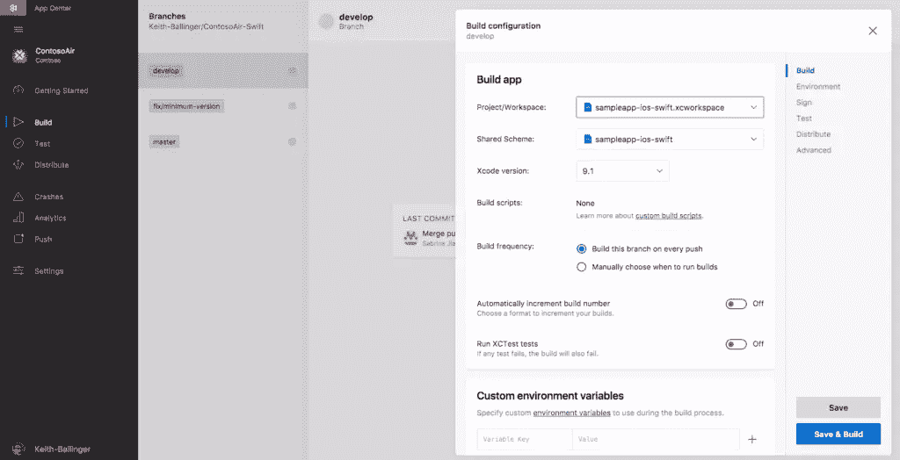
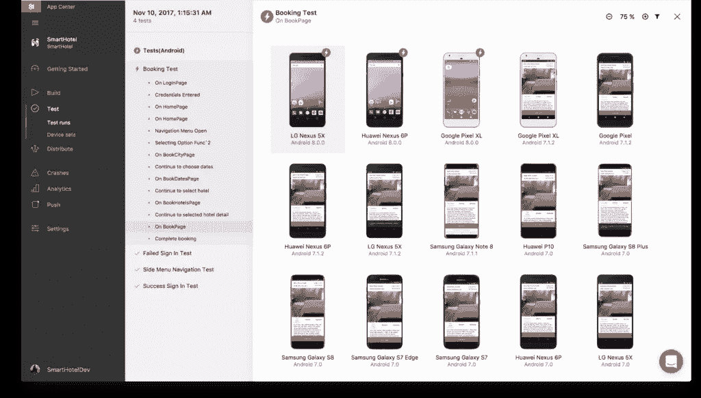
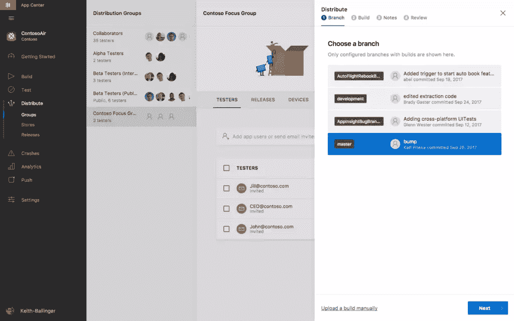

# 自动化 CI/CD，花更多时间编写代码

> 原文：<https://www.sitepoint.com/automate-cicd-visual-app-center/>

*本文由[微软 Visual Studio 应用中心](https://appcenter.ms/signup?utm_source=Sitecore&utm_medium=Blog&utm_campaign=appcenter_connect)赞助。感谢您对使 SitePoint 成为可能的合作伙伴的支持。*

开发软件最好的部分是什么？编写惊人的代码。

最糟糕的是什么？其他的一切。

开发软件是一项美妙的工作。你可以用新的方式解决问题，取悦用户，看到你创造的东西让生活变得更好。但是，尽管我们花了很多时间编写代码，但往往也有同样多的时间花在管理随之而来的开销上——这完全是浪费时间。以下是一些最大的生产力陷阱，以及我们微软如何努力为你节省一些时间。

## 1.建筑物

将你的优秀应用程序交到快乐用户手中的第一步是什么？让它存在。有些人可能认为从源代码转移到二进制代码不会仍然如此痛苦，但它确实如此。根据项目的不同，你可能一天要在不同的平台上编译几次，而所有的等待都是你本来可以用来编码的时间。此外，如果您正在构建 iOS 应用程序，您需要一个 Mac 构建代理——不一定是您的主要开发工具，尤其是如果您正在跨平台框架中构建应用程序。

你想收回那段时间，最好的办法是(这不会是我最后一次这么说)*自动化*。您需要将配置和硬件管理自动化，以便应用程序在应该构建的时候构建。

我们试图通过 Visual Studio App Center Build 来满足这一需求，该服务可以自动执行您不想手动重现的所有步骤，因此您可以在每次签入代码时，或者在您、您的 QA 团队或您的发布经理想要的任何时候进行构建。只需在 Github、Bitbucket 或 VSTS 回购上点击 Build，选择一个分支，配置一些参数，你就可以在云中构建 Android、UWP，甚至 iOS 和 macOS 应用，而无需管理任何硬件。如果您需要做一些特殊的事情，您可以添加后克隆、前构建和后构建脚本进行定制。

## 2.测试

我花了很多年时间测试软件，在我的职业生涯中，有三个问题我一直不喜欢听到:

“你做完了吗？”

“能重现吗？”

“真的有那么糟糕吗？”

在过去，很少有足够的时间或资源来进行彻底、适当的测试，但是移动开发加剧了这个特殊的问题。我们现在更频繁地向更多设备交付更多代码。我们不能浪费时间试图重现那个难以捉摸的关键故障，我们也没有时间争论一个 bug 是否是一个阻碍。与此同时，我们是最终对高曝光率故障或低质量产品负责的把关人，作为团队成员，我们希望提前解决问题，以提高质量，而不仅仅是阻碍运输。

那么答案是什么呢？“自动化”，当然。但是自动化是有意义的。数据的电子表格和截图的文件夹如果不能全部放在一起就毫无意义。当你面临最后期限，必须说服产品负责人打电话时，你需要提供他们可以理解的信息，同时仍然给开发人员提供他们需要的修复细节。

为了帮助实现这一点，我们创建了 App Center Test，这是一项在数千台真实设备上对数百种配置进行自动化 UI 测试的服务。由于测试是自动化的，您每次都运行完全相同的测试，因此您可以在每次构建时立即识别性能和 UX 偏差。测试会生成截图或视频以及性能数据，因此任何人都可以发现问题，开发人员可以点击详细的日志并立即开始修复。每次提交时，您可以通过在一些设备上进行测试来抽查您的代码，然后在数百个设备上运行回归，以验证一切对您的所有用户都有效。

## 3.分配

因此，你已经建立了一个应用程序，它应该执行。太好了！但是现在迭代真正开始了。在把它推向最终用户之前，你想知道人们对它的看法。但是怎么做呢？编写一个测试程序已经够难了，但是确保每个人都有你的应用程序的最新版本(如果是移动应用程序，确保你的用户甚至可以安装应用程序)是一项全职工作——而且这是你的团队中没有人想要的工作。

再次，*自动化*。当你准备好推送一个构建时，你需要自动化通知过程*和*应用分发过程，并且你需要能够在每次构建时(或者每次发布经理这么说时)触发这两个过程。

我们的答案是应用中心的分布式服务。如果您有一个电子邮件地址列表，您就有了将您的构建交到内部或 beta 测试人员手中所需的东西。创建一个分发组，上传一个构建(或者从 repo 构建一个)，Distribute 处理剩下的工作。如果你认为这听起来像 HockeyApp，那你就对了。App Center Distribute 是 HockeyApp 的下一代产品，将它的分发自动化与我们的 CI/CD 服务集成在一起。一旦你完成了 beta 测试，Distribute 还可以将你的应用送到你的用户手中，部署到 Google Play、苹果应用商店，或者——对于企业用户——微软 Intune。

## 4.结束循环

人们经常谈论部署管道，但我们不只是在单向推动。如果你能了解到你的应用发布后发生了什么，你就能把这些反馈带给开发者，创造一个闭环，让你的产品更好、更快。这些信息有两种形式——分析用户如何与你的应用程序交互，最重要的是，报告这些应用程序如何以及何时出现故障。

让我们从第二个开始，因为崩溃是最糟糕的。当一个应用程序出现故障时，你想快速了解它，但你也需要知道它到底有多重要。影响到每个人的一个模糊功能的崩溃通常比 iPhone 4 的全面发布失败更糟糕。App Center 崩溃将类似的崩溃报告分组，并向您显示受影响最大的平台，以便您做出明智的分类决策。当您准备好开始解决问题时，崩溃会被完全符号化，这样您就有了开始解决问题所需的信息。您可以在 bug tracker 中自动创建条目，这样开发人员就可以在不离开工作流程的情况下开始修复问题。同样，更多的自动化意味着更多的时间来编写更好的代码。

对于分析，你想要一些现成的有用的东西。App Center Analytics 提供了用户希望看到的专注于参与度的用户和设备级指标应用；比如谁在使用哪些设备、使用频率、来自哪里以及他们将停留多长时间。但你的应用程序与其他人的不同，因此我们允许你创建和跟踪自定义指标，如“预订搭车”或“订购送货上门”如果您想要更深入的分析，我们可以持续导出到 [Azure Application Insights](https://azure.microsoft.com/en-us/services/application-insights/) 。

## 5.利用你所拥有的

你可以整天在理论上构思完美的 CI/CD 解决方案，但如果你不能付诸行动，这些都是无用的。重要的是获得您现在可以使用的东西，无论这意味着与您真正喜欢的(或无法摆脱的)现有系统集成，还是只是自动化手动过程的一部分，直到您可以获得其余部分。只要方向正确，哪怕只迈出一小步也总是好的。

很明显，我有偏见，认为你应该试试我们的整个系统，但是开发者需要不同的东西。如果你只是想采用应用中心的一部分，我们已经把它建成完全模块化。我们为每个应用中心服务都提供了 REST APIs，并且我们已经预先构建了与 VSTS 等服务的集成。事情就应该是这样的，因为你正在构建你的应用程序，所以你应该用你的方式来构建你的应用程序。

我们很乐意让您[尝试一下 Visual Studio 应用中心](https://appcenter.ms/signup?utm_source=Sitecore&utm_medium=Blog&utm_campaign=appcenter_connect)—它今天是全新的，可以免费开始使用。我们想听听你的想法！

## 分享这篇文章