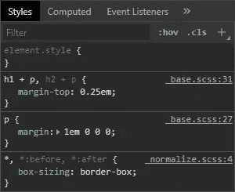

# 如何使用 Gulp.js 自动化你的 CSS 任务

> 原文：<https://www.sitepoint.com/automate-css-tasks-gulp/>

在本文中，我们将探讨如何使用 Gulp.js 来自动化一系列重复的 CSS 开发任务，从而加快工作流程。

Web 开发只需要一个文本编辑器。然而，您很快就会对重复的任务感到沮丧，这些任务对于现代网站和快速的性能来说是必不可少的，例如:

*   转换或传输
*   串联文件
*   缩小生产代码
*   将更新部署到开发、试运行和实际生产服务器。

有些任务必须在每次做出改变时重复。最可靠的开发人员会忘记优化一两张图像，前期制作任务变得越来越艰巨。

幸运的是，计算机从不抱怨令人头脑麻木的工作。本文演示了如何使用 [Gulp.js](https://gulpjs.com/) 来自动化 CSS 任务，包括:

*   优化图像
*   编译 Sass `.scss`文件
*   处理和内联资产
*   自动附加供应商前缀
*   移除未使用的 CSS 选择器
*   缩小 CSS
*   报告文件大小
*   输出用于浏览器开发工具的源地图
*   当源文件改变时，在浏览器中实时重载。

## 为什么要用 Gulp？

各种任务运行器可用于 web 项目，包括[吞咽](https://gulpjs.com/)、[咕哝](https://gruntjs.com/)、 [webpack](https://webpack.js.org/) 、[包裹](https://parceljs.org/)，甚至 npm 脚本。最终，选择权在你，你使用什么并不重要，因为*你的网站/应用程序访问者会知道或关心*。

Gulp 已经有几年的历史了，但是它稳定、快速，支持[许多插件](https://gulpjs.com/plugins/)，并且使用 JavaScript 代码进行配置。用代码编写任务有几个优点，您可以根据条件修改输出——例如在为实时部署构建最终文件时删除 CSS sourcemaps。

## 演示代码

本教程的代码可从 [GitHub](https://github.com/craigbuckler/gulp4-css) 获得。确保安装了 Git 和 [Node.js](https://nodejs.org) ，然后在您的终端中输入以下命令来安装并运行演示:

```
git clone https://github.com/craigbuckler/gulp4-css
cd gulp4-css
npm i gulp-cli -g
npm i
gulp 
```

在浏览器中，导航至显示的`http://localhost:8000/`或`External` URL。

或者，您可以按照以下步骤创建自己的项目。

## 示例项目概述

本教程使用 Gulp 4.0。这是最新的稳定版本，也是 [npm](https://www.npmjs.com/package/gulp) 上的当前默认版本。

通过优化 JPG、GIF 和 PNG 位图以及 SVG 矢量图形的 [gulp-imagemin](https://www.npmjs.com/package/gulp-imagemin) ，图像文件大小将被最小化。

CSS 文件是使用以下内容构建的:

1.  [Sass 预处理器](https://sass-lang.com/)，它将`.scss`语法和部分编译成一个单独的`main.css`文件，以及
2.  [PostCSS 后处理器](https://postcss.org/)，它补充了`main.css`，通过自己的插件提供资产管理、厂商前缀、缩小等功能。

使用预处理器和后处理器提供了编码灵活性。

Sass 可能不像以前那么重要了，但它仍然是文件分割、组织、(静态)变量、混合和嵌套的实用选项。替代的预处理器包括用于少[的](http://lesscss.org/)[少](https://www.npmjs.com/package/gulp-less)和用于[针](http://stylus-lang.com/)的[多针](https://www.npmjs.com/package/gulp-stylus)。

下面的示例代码中使用了 [gulp-sass](https://www.npmjs.com/package/gulp-sass) 插件。这使用 [node-sass](https://www.npmjs.com/package/node-sass) 来调用 [LibSass](http://sass-lang.com/libsass) C/C++引擎，是目前最快的选项。然而，您可以考虑 [Dart Sass](https://sass-lang.com/dart-sass) ，它已经成为主要的实现并首先接收语言更新。要使用 Dart Sass，请相应地将所有 npm 安装和`require`引用从`gulp-sass`更改为`gulp-dart-sass`。

最后，您可以放弃预处理器，对所有 CSS 转换使用 [PostCSS](https://postcss.org/) 。它提供了一系列[插件](https://www.postcss.parts/)，包括那些[复制许多(但不是全部)Sass 语法选项](https://www.postcss.parts/tag/sass)的插件。

## Gulp 入门

如果你以前从未用过 Gulp，请阅读“[Gulp . js 简介](https://www.sitepoint.com/introduction-gulp-js/)”。这些是从您的终端开始的基本步骤:

1.  确保安装了最新版本的 [Node.js](https://nodejs.org) 。
2.  用`npm i gulp-cli -g`全局安装 Gulp 命令行界面。
3.  创建一个新的项目文件夹—例如，`mkdir gulpcss` —并输入它(`cd gulpcss`)。
4.  运行`npm init`并回答每个问题(默认就可以了)。这将创建一个`package.json`项目配置文件。
5.  为源文件`mkdir src`创建一个`src`子文件夹。

示例项目使用以下子文件夹:

*   `src/images` —图像文件
*   `src/scss` —源 Sass 文件
*   `build` —生成编译文件的文件夹

## 测试 HTML 页面

本教程专注于 CSS 相关的任务，但是根文件夹中的`index.html`文件对于测试很有用。向构建的样式表中添加您自己的带有`<link>`的页面代码。例如:

```
<!DOCTYPE html>
<html lang="en">
<head>
  <meta charset="UTF-8">
  <meta name="viewport" content="width=device-width,initial-scale=1.0">
  <title>Using Gulp.js for CSS tasks</title>
  <link rel="stylesheet" media="all" href="build/css/main.css">
</head>
<body>

  <h1>My example page</h1>

</body>
</html> 
```

## 模块安装

对于本教程，大多数 Node.js 模块都是作为项目依赖项安装的，因此 CSS 可以在本地开发或实际生产服务器上构建。或者，您可以使用 npm `--save-dev`选项将它们作为开发依赖项安装，这样它们必须在部署之前在本地构建。

要安装 Gulp 和所有插件，在您的终端中从项目文件夹运行下面的`npm`命令:

```
npm i gulp gulp-imagemin gulp-newer gulp-noop gulp-postcss gulp-sass gulp-size gulp-sourcemaps postcss-assets autoprefixer cssnano usedcss 
```

所有模块将被安装并在`package.json`的`"dependencies"`部分列出。

现在可以安装[浏览器同步](https://browsersync.io/)测试服务器——作为一个开发依赖项，因为在实际生产设备上永远不需要它:

```
npm i browser-sync --save-dev 
```

该模块将在`package.json`的`"devDependencies"`部分列出。

## 创建一个吞咽任务文件

Gulp 任务是在项目根目录下名为`gulpfile.js`的 JavaScript 文件中定义的。创建它，然后在编辑器中打开文件( [VS 代码](https://code.visualstudio.com/)是一个很好的选择)。添加以下代码:

```
(() => {

  'use strict';

  /**************** gulpfile.js configuration ****************/

  const

    // development or production
    devBuild  = ((process.env.NODE_ENV || 'development').trim().toLowerCase() === 'development'),

    // directory locations
    dir = {
      src         : 'src/',
      build       : 'build/'
    },

    // modules
    gulp          = require('gulp'),
    noop          = require('gulp-noop'),
    newer         = require('gulp-newer'),
    size          = require('gulp-size'),
    imagemin      = require('gulp-imagemin'),
    sass          = require('gulp-sass'),
    postcss       = require('gulp-postcss'),
    sourcemaps    = devBuild ? require('gulp-sourcemaps') : null,
    browsersync   = devBuild ? require('browser-sync').create() : null;

  console.log('Gulp', devBuild ? 'development' : 'production', 'build');

})(); 
```

这定义了自执行函数和常数，用于:

*   `devBuild` —当`NODE_ENV`为空或设置为`development`时，设置`true`
*   `dir.src`—`src/`源文件文件夹
*   `dir.build`—`build/`构建文件夹
*   吞咽和所有插件模块

注意`sourcemaps`和`browsersync`只是为开发构建而配置的。

## 吞咽图像任务

创建一个`src/images`文件夹，并将一些图像文件复制到该文件夹或其子文件夹中。

在`gulpfile.js`中的`console.log`下面插入以下代码，定义一个`images`处理任务:

```
/**************** images task ****************/
const imgConfig = {
  src           : dir.src + 'images/**/*',
  build         : dir.build + 'images/',
  minOpts: {
    optimizationLevel: 5
  }
};

function images() {

  return gulp.src(imgConfig.src)
    .pipe(newer(imgConfig.build))
    .pipe(imagemin(imgConfig.minOpts))
    .pipe(size({ showFiles:true }))
    .pipe(gulp.dest(imgConfig.build));

}
exports.images = images; 
```

配置参数在`imgConfig`中定义，它设置:

*   将`.src`指向`src/images`或子文件夹中的任何图像
*   `.build`文件夹到`build/images`，以及
*   [gulp-imagemin](https://www.npmjs.com/package/gulp-imagemin) 优化选项。

一个`images`函数返回一个 Gulp 流，它通过一系列插件传输数据:

1.  `gulp.src`被传递一个源文件夹 glob 来检查
2.  [gulp-newer](https://www.npmjs.com/package/gulp-newer) 插件删除构建文件夹中已经存在的任何更新的图像
3.  [gulp-imagemin](https://www.npmjs.com/package/gulp-imagemin) 插件优化剩余的文件
4.  [gulp-size](https://www.npmjs.com/package/gulp-size) 插件报告所有已处理文件的大小
5.  文件被保存到`gulp.dest`构建文件夹中。

最后，导出一个调用`images`函数的公共 Gulp `images`任务。

保存`gulpfile.js`，然后从命令行运行`images`任务:

```
gulp images 
```

终端将显示如下日志:

```
Gulp development build
[18:03:38] Using gulpfile /gulp4-css/gulpfile.js
[18:03:38] Starting 'images'...
[18:03:38] cave-0600.jpg 48.6 kB
[18:03:38] icons/alert.svg 308 B
[18:03:38] icons/fast.svg 240 B
[18:03:38] icons/reload.svg 303 B
[18:03:38] cave-1200.jpg 116 kB
[18:03:38] cave-1800.jpg 162 kB
[18:03:38] gulp-imagemin: Minified 3 images (saved 203 B - 19.3%)
[18:03:38] all files 328 kB
[18:03:38] Finished 'images' after 507 ms 
```

检查创建的`build/images`文件夹，找到图像的优化版本。如果您再次运行`gulp images`，什么也不会发生，因为只处理较新的文件。

## 吞咽 CSS 任务

用名为`main.scss`的文件创建一个`src/scss`文件夹。这是导入其他部分的根 Sass 文件。您可以随意组织这些文件，但是要开始，请添加:

```
// main.scss
@import 'base/_base'; 
```

用以下代码创建一个`src/scss/base`文件夹并添加一个`_base.scss`文件:

```
// base/_base.scss partial
$font-main: sans-serif;
$font-size: 100%;

body {
  font-family: $font-main;
  font-size: $font-size;
  color: #444;
  background-color: #fff;
} 
```

在`gulpfile.js`中的`images`任务下面插入以下代码，定义一个`css`处理任务:

```
/**************** CSS task ****************/
const cssConfig = {

  src         : dir.src + 'scss/main.scss',
  watch       : dir.src + 'scss/**/*',
  build       : dir.build + 'css/',
  sassOpts: {
    sourceMap       : devBuild,
    imagePath       :img/',
    precision       : 3,
    errLogToConsole : true
  },

  postCSS: [
    require('usedcss')({
      html: ['index.html']
    }),
    require('postcss-assets')({
      loadPaths: ['images/'],
      basePath: dir.build
    }),
    require('autoprefixer')({
      browsers: ['> 1%']
    }),
    require('cssnano')
  ]

};

function css() {

  return gulp.src(cssConfig.src)
    .pipe(sourcemaps ? sourcemaps.init() : noop())
    .pipe(sass(cssConfig.sassOpts).on('error', sass.logError))
    .pipe(postcss(cssConfig.postCSS))
    .pipe(sourcemaps ? sourcemaps.write() : noop())
    .pipe(size({ showFiles: true }))
    .pipe(gulp.dest(cssConfig.build))
    .pipe(browsersync ? browsersync.reload({ stream: true }) : noop());

}
exports.css = gulp.series(images, css); 
```

配置参数在`cssConfig`中定义，它设置:

*   `.src`文件到`src/scss/main.scss`
*   一个`.watch`文件夹到`src/scss`或其子文件夹中的任何文件
*   `.build`文件夹到`build/css`，以及
*   [节点-萨斯选项](https://github.com/sass/node-sass#options)通过[大口-萨斯](https://www.npmjs.com/package/gulp-sass)进入`.sassOpts`。

`cssConfig.postCSS`定义了一组 [PostCSS](https://postcss.org/) 插件和配置选项。第一个是 [usedcss](https://www.npmjs.com/package/usedcss) ，它通过检查示例`index.html`文件来移除未使用的选择器。

接下来是 [postcss-assets](https://www.npmjs.com/package/postcss-assets) ，它可以解析 css 文件中的图像 URL 路径和信息。例如，如果`myimage.png`是一个 400×300 的 PNG 位图，下面的代码:

```
.myimage {
  background-image: resolve('myimage.jpg');
  width: width('myimage.png');
  height: height('myimage.png');
  background-size: size('myimage.png');
} 
```

被翻译成:

```
.myimage {
  background-image: urlimg/myimage.png');
  width: 400px;
  height: 300px;
  background-size: 400px 300px;
} 
```

也可以内嵌位图和 SVG 图像。例如:

```
.mysvg {
  background-image: inline('mysvg.svg');
  /* url('data:image/svg+xml;charset=utf-8,... */
} 
```

autoprefixer 是著名的 PostCSS 插件，它根据来自 caniuse.com[的信息添加厂商前缀。在上面的配置中，任何全球市场份额达到或超过 1%的浏览器都会添加供应商前缀。例如:](http://caniuse.com/)

```
user-select: none; 
```

变成了:

```
-webkit-user-select: none;
-moz-user-select: none;
-ms-user-select: none;
user-select: none; 
```

最后， [cssnano](https://www.npmjs.com/package/cssnano) 通过重新排列属性、删除不必要的单元、删除空白等等来缩小生成的 CSS 文件。有几个替代方法可用，比如[后清理](https://www.npmjs.com/package/postcss-clean)，但是 cssnano 会在演示代码中生成一个稍微小一点的文件。

一个`css`函数返回一个 Gulp 流，它通过一系列插件传输数据:

1.  `gulp.src`被传递一个源`src/scss/main.scss`文件来检查。
2.  如果`devBuild`为`true`，则[吞咽源地图](https://www.npmjs.com/package/gulp-sourcemaps)插件被初始化。否则，[按钮什么也不做。](https://www.npmjs.com/package/gulp-noop)
3.  [gulp-sass](https://www.npmjs.com/package/gulp-sass) 插件使用`cssConfig.sassOpts`配置选项对`main.scss`进行 CSS 预处理。注意`on('error')`事件处理程序防止遇到 Sass 语法错误时 Gulp 终止。
4.  产生的 CSS 通过管道进入 [gulp-postcss](https://www.npmjs.com/package/gulp-postcss) ，它应用了上面描述的插件。
5.  如果启用了 sourcemap，它将作为数据附加到 CSS 文件的末尾。
6.  [gulp-size](https://www.npmjs.com/package/gulp-size) 插件显示 CSS 文件的最终大小。
7.  文件被保存到`gulp.dest`构建文件夹中。
8.  如果`browsersync`被启用(`devBuild`必须是`true`)，一个指令被发送到[浏览器同步](https://www.npmjs.com/package/browser-sync)以刷新所有连接的浏览器中的 CSS(见下文)。

最后，导出一个公共的`css`任务，该任务使用`gulp.series()`依次调用`images`函数和`css`函数。这是必要的，因为 CSS 依赖于`build/images`文件夹中的图片。

保存`gulpfile.js`，然后从命令行运行任务:

```
gulp css 
```

终端将显示如下日志:

```
Gulp development build
[14:16:25] Using gulpfile /gulp4-css/gulpfile.js
[14:16:25] Starting 'css'...
[14:16:25] Starting 'images'...
[14:16:25] gulp-imagemin: Minified 0 images
[14:16:25] Finished 'images' after 61 ms
[14:16:25] Starting 'css'...
[14:16:26] main.css 9.78 kB
[14:16:26] Finished 'css' after 900 ms
[14:16:26] Finished 'css' after 967 ms 
```

检查创建的`build/css`文件夹，找到包含源地图数据的结果`main.css`文件的开发版本:

```
body {
  font-family: sans-serif;
  font-size: 100%;
  color: #444;
  background-color: #fff; }

/*# sourceMappingURL=data:application/json;charset=utf8;base64,... 
```

## 自动化您的工作流程

一次运行一个任务，手动刷新所有浏览器并不好玩。幸运的是， [Browsersync](https://browsersync.io/) 提供了一个看似神奇的解决方案:

*   它实现一个开发 web 服务器或代理一个现有的服务器。
*   代码更改是动态应用的，CSS 可以刷新，无需重新加载整个页面
*   连接的浏览器可以镜像滚动和表单输入。例如，您在桌面 PC 上完成一个表单，然后看到它在移动设备上发生。
*   它完全兼容 Gulp 和其他构建工具。

在`gulpfile.js`中的`css`任务下插入以下代码，定义一个启动 Browsersync 的`server`函数和一个监控文件更改的`watch`函数:

```
/**************** server task (private) ****************/
const syncConfig = {
  server: {
    baseDir   : './',
    index     : 'index.html'
  },
  port        : 8000,
  open        : false
};

// browser-sync
function server(done) {
  if (browsersync) browsersync.init(syncConfig);
  done();
}

/**************** watch task ****************/
function watch(done) {

  // image changes
  gulp.watch(imgConfig.src, images);

  // CSS changes
  gulp.watch(cssConfig.watch, css);

  done();

}

/**************** default task ****************/
exports.default = gulp.series(exports.css, watch, server); 
```

[浏览器同步](https://www.npmjs.com/package/browser-sync)配置参数在`syncConfig`中定义，设置端口、默认文件等[选项](https://browsersync.io/docs/options)。

`server`函数启动 Browsersync 并执行一个`done()`回调，这样 Gulp 就知道它已经完成了。

Browsersync 能够监视文件本身的变化，但是在这种情况下，我们希望通过 Gulp 来控制它，以确保只有在 Sass 变化导致重建`main.css`时才进行刷新。

`watch`函数使用 [`gulp.watch()`](https://gulpjs.com/docs/en/api/watch) 来监控文件并触发适当的函数(可选地在`gulp.series()`或`gulp.parallel()`方法内)。同样，一旦函数完成，就会执行一个`done()`回调。

最后，创建一个默认任务，可以通过不带参数运行`gulp`来执行。它调用`css`任务(它也运行`images()`来构建所有文件，运行`watch()`函数来监控更新，并启动 Browsersync 服务器。

保存`gulpfile.js`并从命令行运行默认任务:

```
gulp 
```

终端将显示日志，但与以前不同的是，它不会终止并继续运行:

```
Gulp development build
[14:32:05] Using gulpfile /gulp4-css/gulpfile.js
[14:32:05] Starting 'default'...
[14:32:05] Starting 'images'...
[14:32:05] gulp-imagemin: Minified 0 images
[14:32:05] Finished 'images' after 64 ms
[14:32:05] Starting 'css'...
[14:32:05] main.css 9.78 kB
[14:32:05] Finished 'css' after 843 ms
[14:32:05] Starting 'watch'...
[14:32:05] Finished 'watch' after 33 ms
[14:32:05] Starting 'server'...
[14:32:06] Finished 'server' after 19 ms
[14:32:06] Finished 'default' after 967 ms
[Browsersync] Access URLs:
 -------------------------------------
       Local: http://localhost:8000
    External: http://192.168.1.234:8000
 -------------------------------------
          UI: http://localhost:3001
 UI External: http://localhost:3001
 -------------------------------------
[Browsersync] Serving files from: ./ 
```

您的电脑现在正在运行来自`http://localhost:8000`的 web 服务器。网络上的其他设备可以连接到**外部** URL。在一两个浏览器中打开 URL，然后对任何`.scss`文件进行更改。结果会立即刷新。

检查 devtools 中的任何元素， **Styles** 面板将显示预编译的 Sass 代码的位置。您可以单击文件名查看完整的源代码:



最后，按下`Ctrl` + `C`停止你终端运行的 Gulp 任务。

## 实时生产代码

环境变量`NODE_ENV`必须设置为`production`，这样 Gulp 任务就知道何时生成最终代码并禁用 sourcemap 生成。在 Linux 和 macOS 终端上:

```
NODE_ENV=production 
```

Windows Powershell:

```
$env:NODE_ENV="production" 
```

Windows 传统命令行:

```
set NODE_ENV=production 
```

您可以:

1.  安装 Gulp，直接在 live 服务器上运行任务。理想情况下，`NODE_ENV`应该通过修改启动脚本在生产机器上永久设置。例如，将`export NODE_ENV=production`添加到 Linux `~/.bashrc`文件的末尾。
2.  在本地创建生产代码，然后上传到实时服务器。

运行`gulp css`生成最终代码。

要返回开发模式，将`NODE_ENV`更改为`development`或空字符串。

## 后续步骤

本文演示了一个可能的 Gulp CSS 工作流，但是它可以适用于任何项目:

*   超过[3700 Gulp 插件](https://gulpjs.com/plugins/)。许多工具都有助于 CSS，但是你会发现其他工具有 HTML、模板、图像处理、JavaScript、服务器端语言、林挺等等。
*   有数百个 PostCSS 插件，[编写自己的](https://www.sitepoint.com/build-css-preprocessor-postcss/)很简单。

无论您选择哪种工具，我都建议您:

*   首先自动化最令人沮丧、最耗时或最能提高性能的任务。例如，优化图像可以从页面总重量中节省数百千字节。
*   不要让你的构建过程过于复杂。几个小时应该足够开始了。
*   尝试其他任务跑步者，但不要一时兴起就切换！

上面的代码可以从 [GitHub](https://github.com/craigbuckler/gulp4-css) 获得，你可以查看整个 [`gulpfile.js`配置](https://github.com/craigbuckler/gulp4-css/blob/master/gulpfile.js)。请随意使用。

## 分享这篇文章