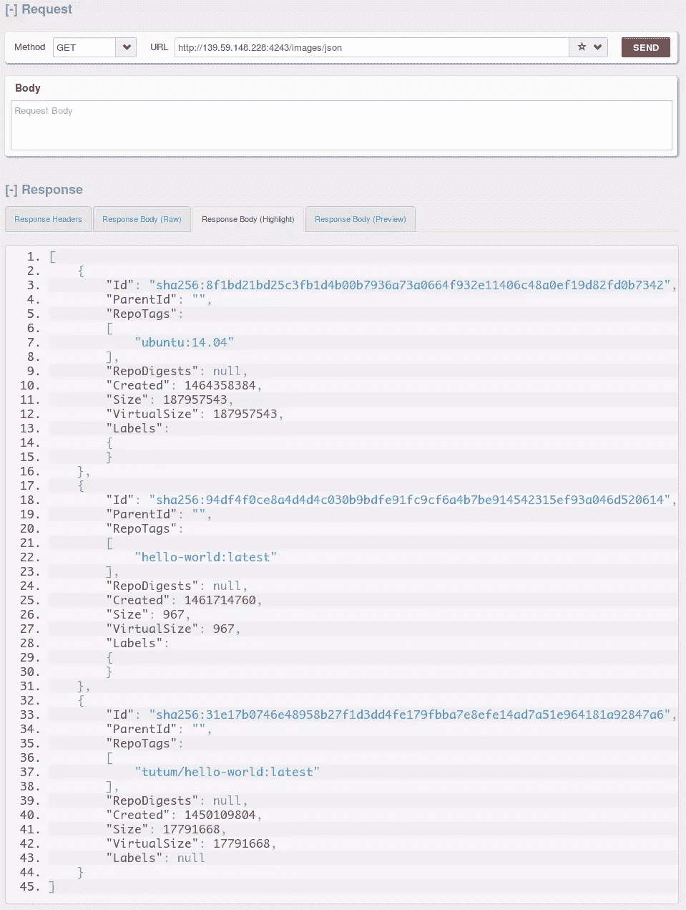

# 用远程 API 和 Ruby 自动化 Docker

> 原文：<https://www.sitepoint.com/automate-docker-with-the-remote-api-and-ruby/>


Docker 是一个非常好用的工具。许多开发人员用它来简化开发过程。我们为 Docker 做了很多专题，你可以在这里查看[。如果你还没有在你的机器上安装 Docker，你可以通过那些文章或者 Docker 网站上的](https://www.sitepoint.com/web/docker/)[找到方法。](https://docs.docker.com/engine/installation/)

在这篇文章中，我将介绍 Docker 的远程 API。如果您一直使用 Docker，很可能是通过命令行界面，它实际上是一个使用远程 API 的客户端。顺便说一下，我假设你了解 Docker 的所有基础知识。如果没有，请阅读我上面链接的文章。

在我们与 API 交互之前，我们必须配置 Docker 来监听特定的 TCP 端口。让我们编辑 Docker 配置文件:

路径:`/etc/init/docker.conf`

添加这一行:

```
DOCKER_OPTS='-H tcp://0.0.0.0:4243 -H unix:///var/run/docker.sock' 
```

重启 docker:

```
service docker restart 
```

现在我们可以使用端口 **4243** 连接到我们的 Docker 服务器。在继续之前，让我们测试一下与服务器的连接。这可以通过命令行工具来完成

```
curl -X GET http://139.59.148.228:42img/json
```

这将打印我们 Docker 服务器上的所有图像。当处理更多数据时，我倾向于使用 REST 客户端:



Firefox 的 RESTClient 附加组件

这证实了我们可以访问我们的 Docker 服务器。

## 红宝石

让我们开始红宝石部分。我们将使用 [docker-api](https://github.com/swipely/docker-api) gem。这将允许我们对 Docker 远程 API 有一个面向对象的接口。

我们可以从终端直接安装它:

```
gem install docker-api 
```

或者将其添加到 gem 文件中:

```
gem "docker-api" # followed by a `bundle install` 
```

我们将在整个教程中使用 IRB(交互式 Ruby Shell ),但是任何示例都可以在 Ruby 文件中完成。

第一步是导入 docker-api gem:

```
require 'docker-api' 
```

指向我们的 docker 服务器:

```
Docker.url = 'tcp://139.59.148.228:4243/' 
```

现在让我们测试我们的连接，这可以通过使用版本方法很容易地完成:

```
Docker.version
 => {"Version"=>"1.11.1", "ApiVersion"=>"1.23", "GitCommit"=>"5604cbe", "GoVersion"=>"go1.5.4", "Os"=>"linux", "Arch"=>"amd64", "KernelVersion"=>"3.13.0-85-generic", "BuildTime"=>"2016-04-26T23:30:23.291099901+00:00"} 
```

服务器用 Docker 服务器的主机系统的一些信息来响应。如果您收到一个错误，抱怨“连接被拒绝”，如下所示:

```
Excon::Errors::SocketError: Connection refused - connect(2) for 139.59.148.228:42432 (Errno::ECONNREFUSED) 
```

那你可能是服务器有问题。**注意**:检查您是否连接到正确的端口，并确保您的防火墙配置允许连接到该特定端口。

## Docker 图像

处理图像非常简单:

```
image = Docker::Image.create('fromImage' => 'rails:4.2') 
```

这可能需要一些时间，取决于网络连接，它将从 [Docker Hub](https://hub.docker.com/_/rails/) 中提取 Rails 映像。

这里需要注意的是:我们正在分离 Rails 和我们想要的版本(4.2)。这是一个 docker 图像名称和标记约定，适用于许多其他 Docker 图像，如`ruby:latest`或`debian:latest`。

让我们确保我们在服务器上有图像。SSH 到您的 Docker 服务器(这可能只是您的本地机器)并运行:

```
$ docker images 
```

快速提示:如果您已经下载了大量图像，您可以运行:

```
$ docker images | grep ruby 
```

这将只列出带有单词`ruby`的图像。输出可能如下所示:

```
ruby                latest               2d43e11a3406        2 weeks ago         729.1 MB` 
```

显示的信息是:

*   存储库的**名称**
*   图像的**标签**或版本，这可以指定为数字或名称，如`ruby:latest`或`ruby:1-wheezy`
*   **图像 ID**
*   **创建日期**
*   **大小**。

这表明我们已经成功提取了一个映像。现在让我们通过 API 来看看 Docker 服务器中有哪些图像。如果我们执行`Image.all`方法，我们将得到图像的 JSON 表示:

```
Docker::Image.all
=> [#<Docker::Image:0x00000001834e28 @id="sha256:299e53ed9d2a9d07391855b2f49a823af145c1cf66bd711968b3b2ccc29d49d8", @info={"ParentId"=>"", "RepoTags"=>["rails:4.2"], "RepoDigests"=>nil, "Created"=>1464136334, "Size"=>837203335, "VirtualSize"=>837203335, "Labels"=>{}, "id"=>"sha256:299e53ed9d2a9d07391855b2f49a823af145c1cf66bd711968b3b2ccc29d49d8"}, @connection=#<Docker::Connection:0x0000000176c6f8 @url="tcp://139.59.148.228:4243/", @options={}>>, #<Docker::Image:0x00000001834cc0 @id="sha256:31e17b0746e48958b27f1d3dd4fe179fbba7e8efe14ad7a51e964181a92847a6", @info={"ParentId"=>"", "RepoTags"=>["tutum/hello-world:latest"], "RepoDigests"=>nil, "Created"=>1450109804, "Size"=>17791668, "VirtualSize"=>17791668, "Labels"=>nil, "id"=>"sha256:31e17b0746e48958b27f1d3dd4fe179fbba7e8efe14ad7a51e964181a92847a6"}, @connection=#<Docker::Connection:0x0000000176c6f8 @url="tcp://139.59.148.228:4243/", @options={}>>] 
```

## 容器

也可以将这些图像的实例作为容器来创建和运行:

```
container = Docker::Container.create('Image' => 'ubuntu', 'Tty' => true) 
```

这将创建一个包含我们服务器上的 **Ubuntu** 映像的容器。注意`'Tty' => true`部分，l 检查我们的容器是否通过 SSH 运行。如果我们不添加`Tty`参数，那么我们的容器将会退出，因为它只是一个进程，它将会死亡(退出)。

```
=> #<Docker::Container:0x000000025f6bb0 @id="5bbf21e99459052a816cd74006aec00a53cf9bd0814d5517804257a5869f3329", @info={"Warnings"=>nil, "id"=>"5bbf21e99459052a816cd74006aec00a53cf9bd0814d5517804257a5869f3329"}, @connection=#<Docker::Connection:0x00000002541b98 @url="tcp://139.59.148.228:4243/", @options={}>> 
```

容器已经创建，我们需要启动它:

```
container.start 
```

是时候检查一下我们的容器是否在运行了。返回到 shell 会话并运行以下命令:

```
$ docker ps
ba13a1bfb728        ubuntu              "/bin/bash"              1 minutes ago       Up 52 seconds                           pedantic_torvalds 
```

我们已经确认我们的 Docker 容器正在运行。现在从 API 回到`irb`:

```
container.top
=> [{"UID"=>"root", "PID"=>"28267", "PPID"=>"28248", "C"=>"0", "STIME"=>"12:43", "TTY"=>"pts/5", "TIME"=>"00:00:00", "CMD"=>"/bin/bash"}] 
```

我们得到一个代表运行容器的简化返回值。还有一些其他方法可以用来停止、重新启动和暂停容器。查看文档以获得关于它们的更多细节。

### 请求一个容器

如果我们有一个现有的容器，并且我们想附加到它，该怎么办？只需通过 ID 或名称请求容器:

```
container = Docker::Container.get('500f53b25e6e') 
```

这将使用 ID 获取容器。如果我们想通过名称来请求它，首先在终端中运行`docker ps`命令来获取正在运行的容器及其名称的列表:

| 集装箱 ID | 图像 | 命令 | 创造 | 状态 | 港口 | 名称 |
| 5e2ff2107855 | 导轨:4.2 | " irb " | 4 天前 | 最多 4 天 |  | 生病的奥斯汀 |

在这个例子中，如果我们想请求我们的 rails 容器，它的名字是 **`sick_austin`** 。名称总是不同的，即使您有来自同一图像的两个容器。每个容器都有不同的名称。

```
container = Docker::Container.get('sick_austin') 
```

这将打印出大量关于容器的信息；我们运行的是什么样的 ruby 版本，bundler 版本，甚至网络信息。

现在我们可以轻松地停止容器(暂时不要这样做…我们还有工作要做):

```
container.stop 
```

我们还可以向容器传递命令并捕捉输出，比如将返回目录列表的`ls`命令:

```
container.exec(['ls'])
[["bin\nboot\ndev\netc\nhome\nlib\nlib64\nmedia\nmnt\nopt\nproc\nroot\nrun\nsbin\nsrv\nsys\ntmp\nusr\nvar\n"], [], 0]` 
```

## 从容器创建图像

从容器创建图像非常有用。假设我们有这样一个场景，我们在一个特殊的环境中工作，有很多配置，我们想从中创建一个映像。

首先，让我们对容器进行更改。在我们的例子中，我们已经创建了这个名为 **sitepoint.conf** 的非常重要的配置文件。

```
container.exec(["touch", "sitepoint.conf"]) 
```

我们正在使用我们之前使用的相同的`exec`方法，传入两个参数`touch`和`sitepoint.conf`。`touch`是一个 Linux 命令，将创建一个空文件，另一个参数是我们要创建的文件的名称。

我们现在应该检查我们的配置文件是否在我们的容器中:

```
container.exec(["ls")
[["bin\nboot\ndev\netc\nhome\nlib\nlib64\nmedia\nmnt\nopt\nproc\nroot\nrun\nsbin\nsitepoint.conf\nsrv\nsys\ntmp\nusr\nvar\n"], [], 0] 
```

我们可以看到 **sitepoint.conf** 列在我们的服务器上:

### 创建图像

`commit`方法将从容器中创建图像:

```
container.commit 
```

现在，如果我们列出我们的 docker 图像，我们将看到我们的新图像。为了更好地预览，我通过 SSH 会话来做这件事:

```
$ docker images 
```

它将返回:

| 仓库 | 标签 | 图像 ID | 创造 | 大小 |
|  |  | " 8ee 633 c7c b 6 " | 两秒钟前 | 837.2 兆字节 |
| 轨道 | Four point two | " 299e53ed9d2a " | 三周前 | 837.2 兆字节 |
| 轨道 | Four point two | " 299e53ed9d2a " | 三周前 | 837.2 兆字节 |
| 人的本质 | 最近的 | " 2fa927b5cdd3 " | 三周前 | 122 兆字节 |
| 轨道 | Four point two | " 299e53ed9d2a " | 三周前 | 837.2 兆字节 |

最上面的是我们容器的复制图像，可以通过它的创建日期来识别。此外，新创建的图像没有存储库或标记。

使用新图像的 ID 创建一个启动 bash 提示符的新容器:

```
$ docker run -i -t 8eee633c7cb6 /bin/bash 
```

我们现在在容器中有了一个交互式外壳，可以使用`ls`命令:

```
$ ls
bin  boot  dev  etc  home  lib  lib64  media  mnt  opt  proc  root  run  sbin  sitepoint.conf  srv  sys  tmp  usr  var 
```

有一个 **sitepoint.conf** 文件，活得好好的。这证实了我们已经从上面创建的映像构建了一个新的容器。

## 结论

从不同的环境访问我们的 Docker 服务器可以极大地帮助我们实现工作流程的自动化。这为 Docker 提供了创造性的解决方案和新想法。仍然有一些事情需要被覆盖，比如保护到 API 的连接，你可以在这里阅读更多关于那个[的内容。现在，使用 Ruby 和远程 API 来自动化您的 Docker 工作流。](https://docs.docker.com/engine/security/https/)

## 分享这篇文章