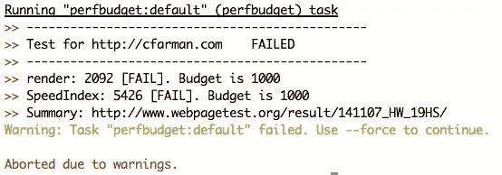
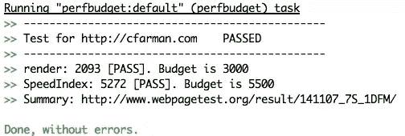
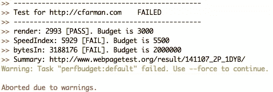

# 使用 Grunt.js 自动化性能测试

> 原文：<https://www.sitepoint.com/automate-performance-testing-grunt-js/>

在这个 2 MB 网页的时代，性能预算正在成为我们 web 开发过程中必要的一部分。与项目的利益相关者合作，为网站的性能设定目标已经成为每个人的责任——包括设计师和开发者。

您可以为许多不同的度量标准设置预算:例如，500 千字节的目标页面权重，项目中的任何一页都不能超过它。添加到页面中超过 500kb 的元素需要对照页面上的其他元素进行评估，以确定它们是否包含在设计中。正如 Tim Kadlec 描述的那样，你的决定必须走三条路中的一条:

1.  优化页面上的现有功能或资产
2.  从页面中移除现有功能或资产
3.  不要添加新功能或资产

您还可以根据[WebPageTest.org](http://www.webpagetest.org/)为下载的图片总量、每次请求的产品图片数量或网站的平均下载时间设定预算。

一旦你设定了预算，在整个开发阶段测量你的网站的表现就是一项额外的任务。如何在不增加繁重的人工测试到 QA 过程的情况下实现这一点呢？输入 Grunt.js！

## WebPageTest.org =自动化性能测试的幸福

虽然有很多 [Grunt 插件可以帮助你衡量你的网站性能](http://cognition.happycog.com/article/grunt-plugins-reviewed)，但我将重点放在我发现的最准确的一个上: [Grunt Perfbudget](https://github.com/tkadlec/grunt-perfbudget) 。这个奇妙的任务使用 WebPageTest.org API 来衡量你的站点，比如页面权重、图片大小、脚本权重和渲染时间。你也可以为这些指标设置明确的预算，然后插件将根据这些指标来衡量你的网站！

### 获取 API 密钥

在你可以设置你的 Grunt 任务之前，你需要[发电子邮件给 WebPageTest.org，要一个 API 密钥](http://www.webpagetest.org/forums/showthread.php?tid=466)包含在你的 Grunt 文件中。(好消息:这个过程有一个[替代方案](https://github.com/tkadlec/grunt-perfbudget/issues/13)！)

### 安装 Grunt Perfbudget 插件

如果这是你第一次使用 Grunt，请查看我的教程，学习如何使用 Grunt 。

如果您的计算机上已经安装了 Grunt，那么在我们设置性能测试之前，您只需要[安装 Perfbudget 插件](https://github.com/tkadlec/grunt-perfbudget/#getting-started)。通过命令行导航到您的项目文件夹，然后运行:

```
npm install grunt-perfbudget --save-dev
```

或者，如果你想要一个示例项目，转到我的 Github 库， [grunt-perfbudget-demo](https://github.com/cfarm/grunt-perfbudget-demo) ，然后运行`npm install`就可以开始了。

### 配置性能预算任务

一旦你安装了插件，你将需要设置你的插件选项并在你的 Gruntfile.js 中创建一个任务。我已经创建了一个[演示 Gruntfile](https://github.com/cfarm/grunt-perfbudget-demo/blob/master/Gruntfile.js) ,它作为默认 Grunt 命令的一部分运行 perfbudget 任务，只有最少的选项开始-一个要测试的 URL 和你的 API 密钥:

```
module.exports = function(grunt){
  require("matchdep").filterDev("grunt-*").forEach(grunt.loadNpmTasks);

  grunt.initConfig({
    pkg: grunt.file.readJSON('package.json'),

    perfbudget: {
      default: {
        options: {
          url: 'http://cfarman.com',
          key: 'APIKEY'
        }
      }
    }
  });

  grunt.registerTask('default', ['perfbudget']);
};
```

当我用我的 API 键集运行默认的`grunt`任务时，我在控制台中得到以下输出:



为什么我的任务失败了？因为我的网站没有通过默认预算:1000ms 以内渲染。它在一个名为“ [SpeedIndex](https://sites.google.com/a/webpagetest.org/docs/using-webpagetest/metrics/speed-index) 的指标上也失败了如何进一步了解我的网页性能？幸运的是，WebPageTest 有一个我可以参考的非常详细的 URL，在我的 Perfbudget 测试中直接从控制台链接！

为了让我的网站通过并且不导致繁重的任务失败(因此在自动化构建环境中停止任何网站构建)，我有两个选择:我可以编辑我的预算直到我通过(对测试有用，对性能没什么用！)或者我可以遵循我的性能预算规则:优化、删除内容或停止添加内容，直到我通过默认指标。现在，让我们玩一下我们的 Grunt 任务，看看通过测试是什么样子的。

### 性能预算选项和网页测试指标

像大多数繁重的任务一样，Perfbudget 任务允许我定制一系列选项。而且由于 WebPageTest 测量的指标非常详细，我可以测试我的性能预算的各种指标，看看我是通过还是失败。

首先，我要改变我的选项，这样我的网站就不会再失败，而 Grunt 任务会报告我在预算之内。这需要在我的 perfbudget 任务中添加一个名为“budget”的属性:

```
perfbudget: {
  default: {
    options: {
      url: 'http://cfarman.com',
      key: 'APIKEY',
      budget: {
        render: '3000',
        SpeedIndex: '5500'
      }
    }
  }
}
```

我的网站在这一点上相当慢，所以我的值很高，以通过测试。

结果呢？我通过了！



这意味着咕哝任务不会失败，如果我的咕哝文件中有其他任务，它们会正常进行——成功！

除了默认指标，我们还能测量什么？[各种各样的东西](https://github.com/tkadlec/grunt-perfbudget/#optionsbudget)，包括:

*   loadTime:以毫秒为单位的总加载时间
*   请求:请求的文件总数
*   bytesIn:以字节为单位的总页面权重

最后一个指标是我最常报告的指标，也是我为了预算目的想要跟踪的指标，所以让我们来看看如何衡量它:

```
perfbudget: {
  default: {
    options: {
      url: 'http://cfarman.com',
      key: 'APIKEY',
      budget: {
        render: '3000',
        SpeedIndex: '5500',
      bytesIn: '2000000'
      }
    }
  }
}
```

我选择了 200 万字节的总预算，因为此时的平均页面重量徘徊在 2 兆字节以下。编辑完预算选项后，我可以通过再次运行`grunt`任务来查看我的表现:



我的网站时钟在 3+兆字节，把它的方式超过预算！看起来我有一些工作要做。但是，作为一名开发人员，手头有这些信息对我来说非常有用。没有其他 Grunt 插件以如此轻量级、易于测试的方式提供关于页面总重量的信息。测量这些重要的指标允许我在编写代码时看到开发决策的真正影响，并帮助我提高性能。

## 分享这篇文章