# 如何开始自动电子邮件营销

> 原文：<https://www.sitepoint.com/automated-email-marketing-getting-started/>

自动电子邮件营销是发送个性化信息的最佳选择。借助自动化工作流程，您可以在相关时间向客户发送个性化报价，为增加收入奠定基础。

在本文中，我们将了解:

*   什么是电子邮件营销自动化
*   电子邮件营销自动化的好处
*   在您自己的公司中启动电子邮件营销自动化工作流需要采取的步骤

我们还将讨论最流行的电子邮件营销自动化软件选项，以帮助您找到最适合您的。最后，我们将看看您可以在短时间内开始向客户发送的电子邮件的具体示例。

## 电子邮件营销的潜力

电子邮件营销的潜力不容忽视。根据 2019 年营销者电子邮件跟踪报告，每花费 1 美元，电子邮件的投资回报率已上升至[58 美元。](https://dma.org.uk/uploads/misc/marketers-email-tracker-2019.pdf)

但是，考虑到 72%的消费者只回复个性化的数字营销信息，仅仅手动发送电子邮件是不够的。

事实上，手动个性化电子邮件是不可想象的，因为有相当数量的客户或计划扩大您的电子商务企业或小企业。

这就是电子邮件营销自动化隆重登场的地方。

## 什么是自动化电子邮件营销

自动电子邮件营销是一个工作流程，其中电子邮件会自动发送给订户。

然而，这些电子邮件不会在任何时候自动发送给任何人。

如果您的自动化电子邮件营销策略设计合理且执行良好，*正确的电子邮件会在正确的时间发送给正确的用户*。

谈到自动营销邮件的内容，很大程度上取决于你的创造力。你可以想出几乎任何种类的电子邮件发送给你的用户。但是从技术上来说，有三种主要类型的自动邮件。

首先是**触发邮件**，也叫**自动回复**。这些可以在特定的设定时间之后或者在任何预定义的用户动作之后发送。例如，您可以设置一封触发重新参与的电子邮件，当用户在特定天数内未登录其帐户时发送该邮件。或者，当新用户创建帐户时，会自动发送一封欢迎电子邮件，推荐后续步骤。

与自动回复类似的还有**行为邮件**。不同之处在于，这些邮件是基于用户与之前发送的电子邮件的交互而发送的。例如，如果用户在一封电子邮件中点击了你的报价，但没有完成购买，你可以给他们发送一个后续的折扣代码。

除了单次触发的电子邮件和自动回复，您还可以发送自动的**电子邮件点滴活动**。电子邮件点滴活动是一系列培养潜在客户的电子邮件，它们共同努力，在系列结束时转化潜在客户。这些自动电子邮件可以由特定的用户操作触发，但您也可以按计划发送它们。

最终，所有自动发送的电子邮件都应该反映接收电子邮件的特定用户在客户旅程中所处的位置。电子邮件应该总是以某种形式个性化，以符合用户的意图和需求。

在某种程度上，自动化营销邮件类似于交易邮件。然而，他们的主要目标不是分享日常信息。相反，自动化电子邮件营销旨在吸引用户并推广你的产品或服务。

幸运的是，自动化电子邮件营销比听起来更容易实现。如果你花最初的时间去做，你最终会节省很多时间，并为你的客户创造额外的价值。

## 电子邮件营销的好处

如果处理得当，一封执行良好且个性化的自动化电子邮件可以:

*   给一个不活跃的用户一个回来使用你的服务的理由，感谢他们最喜欢的产品类别的报价(**重新参与电子邮件**)
*   说服犹豫不决的买家完成购买，并检查他们留在购物车中的物品(**废弃购物车电子邮件**)
*   让不知所措的用户了解你的复杂服务的特点和好处(**信息邮件**)

当你将你的电子邮件营销工作自动化时，你最终会得到准时的、更个性化的、因此与你的客户更相关的电子邮件。简而言之，电子邮件营销自动化让你的业务增长，你一定会在各方面受益。让我们仔细看看，如果你设置了电子邮件营销自动化，你可以实现什么。

### 提高用户参与度

首先，自动化电子邮件营销增加了用户参与度。如果你的用户看到一封完全符合他们兴趣的个性化邮件，他们更有可能打开邮件，点击报价，最终购买。

### 改善用户体验

最重要的是，电子邮件自动化改善了用户体验。这要归功于这样一个事实，即自动化营销电子邮件更加个性化，因此也更加相关。事实上，如果你自动发送带有促销信息的电子邮件，甚至只是提到某个特定用户感兴趣的产品种类，他们就更有可能对你的服务感到满意。

### 打造更强大的品牌

其次，自动化营销电子邮件有助于建立你的品牌和建立更强的客户关系。根据前面两点，如果你给你的电子邮件订阅者发送个性化的、相关的、吸引人的电子邮件，他们一定会认为你的品牌是可靠的，有助于满足他们的需求。这样，他们更有可能回来，甚至向其他人推荐你的品牌。

### 轻松扩展您的电子邮件营销策略

电子邮件自动化让您轻松扩展您的电子邮件营销策略。有了电子邮件营销自动化软件，无论你是将电子邮件发送给 100，10，000，还是 1，000，000 个用户都没有关系。的确，提出相关报价和创建电子邮件模板需要时间。但是，一旦你完成了这些，自动化的电子邮件营销软件将做繁重的工作，你将能够节省时间和发展你的业务。

### 增加收入

最后，发送自动营销电子邮件有助于增加收入。以弃车邮件为例。[根据 Klaviyo](https://www.klaviyo.com/marketing-resources/abandoned-cart-benchmarks) 的数据，弃车电子邮件的打开率可高达 41.18%，平均每个收件人可增加 5.81 美元的收入。考虑到设置废弃购物车电子邮件是多么容易，这就像找钱一样简单。

### 总是准时收到自动邮件

除了上面提到的所有好处之外，电子邮件营销自动化还有一个额外的好处，那就是你总是可以在它对你的潜在客户最相关和最有帮助的时候发送它。如果你在任何时候都依赖手动给新客户发信息，你可能会错过线索或者只是发邮件太晚了。

## 如何开始使用电子邮件营销自动化

如你所见，自动化你的电子邮件营销工作有巨大的好处。但是为了获得利益，你必须首先把整个事情安排好。

那么，如何开始电子邮件营销自动化呢？

让我们通过必要的步骤来找出答案。

### 1.设定目标

首先，你应该设定你的目标。你到底想通过电子邮件营销自动化实现什么？

最有可能的是，你的最终目标是增加销售和收入。更具体地说，这个目标可以分解成其他几个常见的电子邮件营销目标:

*   [增加网站流量](https://www.sitepoint.com/grow-traffic-capture-audience/)
*   获得新客户
*   强化品牌形象
*   与现有客户建立关系
*   提高电子邮件打开率

然而，请记住，这些只是一些最常见的目标，而且非常笼统。根据你自己的总体目标，你应该设定可衡量的、有时限的目标，帮助你成功地实施你的战略。

如果你想了解更多关于这一步的内容，你可以看看这本关于如何创造成功策略的伟大的 [Mailchimp 指南](https://mailchimp.com/resources/create-an-email-marketing-strategy/)。

### 2.规划内容

根据你的目标和目的，你现在应该计划你的内容。换句话说，你应该决定发送哪种类型的营销邮件。您可以稍后再编写实际内容。

现在，你的目标是与现有客户建立更牢固的关系，并确保他们忠于你的品牌吗？在这种情况下，你可以根据用户之前购买的产品和服务设置[个性化生日折扣](https://www.campaignmonitor.com/blog/email-marketing/birthday-email-marketing-guide/)。

或者，如果你的目标之一是让更多的人注册在线课程，你可以在课程开始前发送一封电子邮件，介绍课程计划，甚至提供早期和最后一分钟的折扣。

在这篇文章的最后，有更多的自动化例子来帮助你搞清楚你的内容计划。最重要的是，有很好的电子邮件模板可用，大多数电子邮件营销自动化工具也能够简化内容规划过程。

这使我们进入下一步。

### 3.选择自动化的电子邮件营销工具

现在，您已经计划好了要发送哪些自动电子邮件来实现您的目标，您可以选择一个电子邮件营销工具来帮助您完成计划。

由于有许多电子邮件营销服务，你应该选择一个对你来说容易使用，具有最重要的功能，并符合你的营销策略的需要。

根据对不同电子邮件营销服务的分析，这些是你应该寻找的基本特征:

*   批量添加电子邮件联系人的功能
*   详细报告
*   高产能
*   活动管理工具
*   营销自动化工具(当然)

除此之外，A/B 测试和电子邮件分段也是非常有用的功能。

不过，请记住，在选择电子邮件营销自动化工具时，人们很容易对花哨的功能过于兴奋。但是，如果你刚刚开始电子邮件营销，你可能不需要最先进的工具和功能，如登录页面生成器，花哨的 CRM 或脸书广告集成。

幸运的是，大多数服务都提供免费试用或计划，所以你可以尝试几种营销自动化工具，并确保只选择最适合你的工具。

### 4.建立一个邮件列表

一旦你设定了目标，创建了内容计划，并选择了合适的电子邮件营销工具，你就可以开始收集联系人列表了。现在，如果你已经有了一个订户名单，你可以简单地把它上传到你正在使用的电子邮件营销软件中。

但是如果你没有列表，你应该马上[设置一个线索捕获表](https://wpforms.com/lead-capture-form/)，这样你就可以在设置电子邮件营销自动化的同时获得一些新的注册。

本质上，你应该提出一个提议，让你的网站访问者给你他们的电子邮件地址。这可以是一个简单的信息通讯或折扣代码。或者，如果你有内容，你可以提供电子书或工具包来换取电子邮件地址。你甚至可以使用几个优惠来确保访问者找到一个与他们相关的。

这些优惠可以通过多种方式设置:以弹出窗口、横幅、粘贴栏的形式，甚至是登录页面的形式。无论你选择哪个，你都应该确保这个提议是有帮助的，而不是打扰的。

通过阅读这个[有用的指南，你可以找到更多关于如何从头开始建立电子邮件列表的信息。但是无论你决定如何组合你的邮件列表，确保你包含了一个让用户取消订阅你的邮件信息的选项。](https://unbounce.com/campaign-strategy/how-to-build-an-email-list/)

### 5.创建内容

当你的销售线索捕捉表已经设置好并为你获取新的销售线索时，你就可以开始制作实际的电子邮件了。

使用您选择的自动化电子邮件活动工具，您可以选择相关的电子邮件模板，或者从头开始设计电子邮件。大多数像样的电子邮件营销工具都有直观的拖放编辑器来简化设计过程——或者你可以创建一封[纯文本电子邮件](https://www.business2community.com/email-marketing/the-great-plain-text-versus-html-email-debate-2018-style-02076674)。

在任何情况下，你都应该定制你计划发送的每封自动邮件的设计和副本，以便每封邮件都符合你的营销目标和品牌。

此外，根据您的营销计划，您可能需要在此步骤中创建一些新的博客帖子、登录页面或一些社交媒体内容，除非您已经拥有重定向订户所需的所有内容。

### 6.自动化、分析和测试

一旦你整理好了你的联系人列表，完成了电子邮件的设计和复制，是时候设置自动化了。

为此，您需要按照您选择的特定电子邮件营销平台提供的说明来设置自动电子邮件。通常，这是相对容易的，因为大多数电子邮件营销软件都有直观的工作流程。您可以随时联系支持人员以获得帮助或查阅知识库。

在您设置了自动化并发送了第一封电子邮件后，您可以使用内置的活动工具来实时跟踪最重要的指标，如打开率、点击率、转换率等。将这些比率与你的行业平均水平进行比较是一个好主意。这可以帮助你了解你的电子邮件做得有多好。

如果你的电子邮件没有你想要的那样好，你可以测试副本、主题行、发送时间和星期几等的变化。

## 流行的电子邮件营销自动化软件:利弊

正如上面的步骤 3(“选择自动化电子邮件营销工具”)所述，在选择电子邮件营销自动化软件时，有几个关键功能需要考虑，如详细的报告和活动管理工具。不过，找到适合你的软件可能是一件麻烦事。

因此，让我们来看看一些流行的电子邮件营销自动化工具，它们具有发送自动化电子邮件活动所需的关键要素。我们将讨论它们的易用性、特性、定价，以及它们对小企业、创作者、代理或电子商务的适用性。

### 你是谁

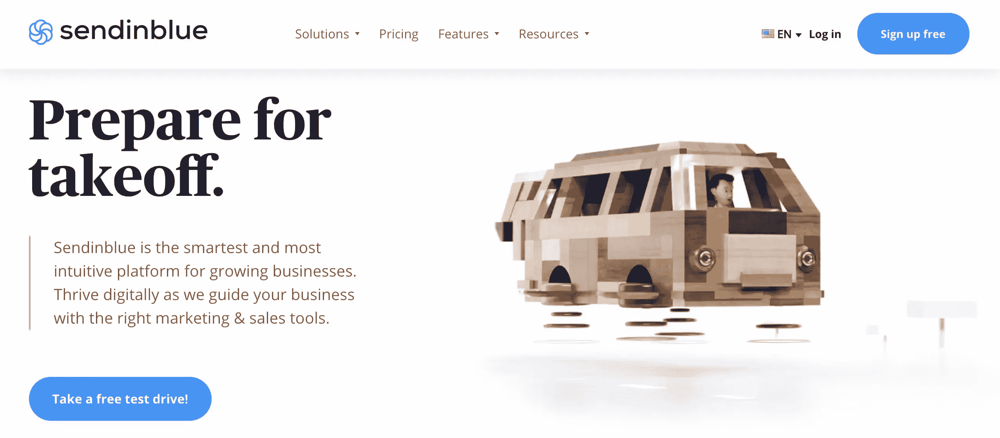

[Sendinblue](https://sendinblue.com/) 提供易于使用且直观的电子邮件营销自动化软件，具备所有关键功能。他们最便宜的计划每月 25 美元起，但他们也有一个免费计划，包括无限联系，每天多达 300 封电子邮件，电子邮件模板和一个移动友好的设计师。

不过，免费计划不提供 A/B 测试，通过该计划发送的电子邮件底部有一个小小的“Sent by Sendinblue”标志。此外，Sendinblue 没有退款保证，但由于免费计划，你仍然可以在承诺之前尝试他们的服务。

总的来说，Sendinblue 是小企业或任何刚刚开始使用电子邮件营销自动化的人的一个很好的选择。

### 经常接触

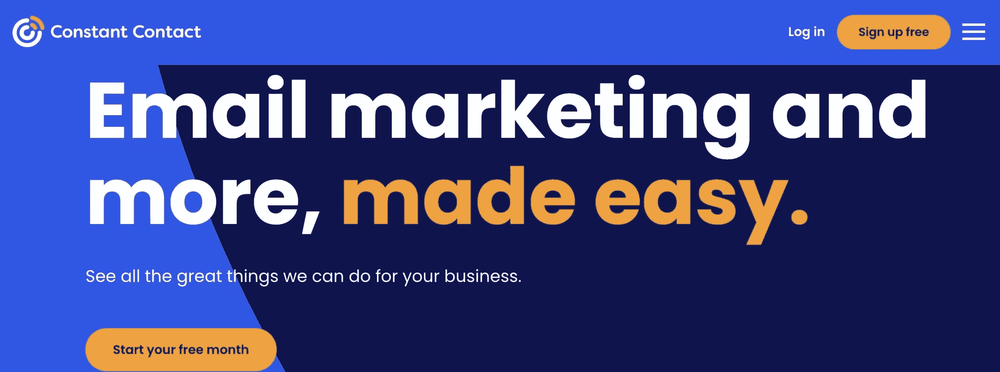

[恒接触](https://www.constantcontact.com/)也是相当好用，很有特色。他们没有免费计划，但是你可以通过 30 天的免费试用来感受他们的服务。他们最便宜的计划(20 美元/月)包括 500 个联系人、无限制的电子邮件发送、各种应用集成、模板和一个移动友好的编辑器。

尽管相对容易使用，但当谈到其活动管理工具时，Constant Contact 确实有一点学习曲线。

总之，不断接触是一个伟大的电子邮件营销自动化软件的小企业，因为他们的计划还包括网站托管和移动响应网站模板。

### GetResponse

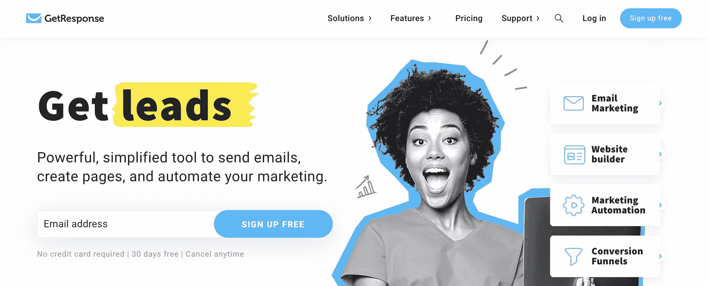

[GetResponse](https://www.getresponse.com/) 通常被认为是最直观、最易用的电子邮件自动化工具之一。他们提供 30 天的免费试用，最便宜的计划是每月 15 美元起。这将给你 1000 个联系人，无限的电子邮件发送，自动回复，一个网站建设者，和一些电子商务功能。

没有退款保证，但由于免费试用，您将能够发现它们有多符合您的需求。GetResponse 确实有一个单独的移动应用程序，但不幸的是，它有些有限，只有最少的定制选项。

尽管如此，GetResponse 仍然是电子商务和小型企业开始使用自动回复器的绝佳选择，因为由于计划和试用价格低廉，风险较低。一旦你掌握了他们的服务，你可以随时升级到功能更丰富的计划。

### 转换工具

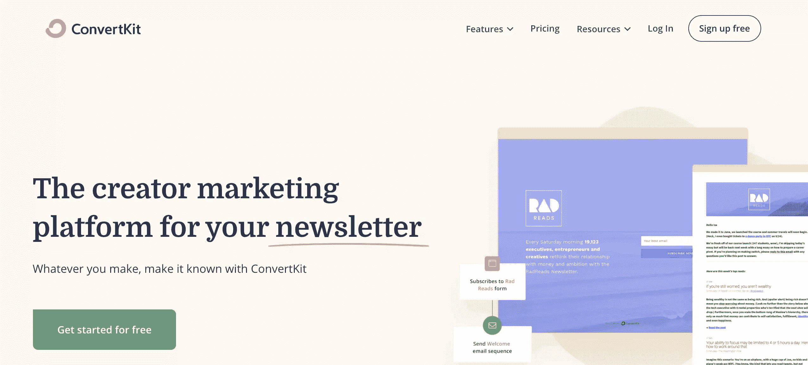

ConvertKit 提供了出色的电子邮件营销自动化软件，用户体验非常简单。他们最便宜的付费计划起价为每月 29 美元(有 30 天退款保证)，它可以让你拥有 1000 个订户，无限的电子邮件发送，一个登录页面和表单生成器，以及一个移动友好的编辑器。

也有一个免费计划提供类似的额外津贴，但不幸的是，它缺乏自动电子邮件功能。最重要的是，ConvertKit 的电子邮件设计工具提供的定制选项非常少。这对初学者来说可能很有用，因为他们不会被无限的可能性所吓倒。

综上所述，ConvertKit 是创作者和小企业的绝佳选择。它简单明了，容易上手，你可以快速设计邮件。

### Mailchimp

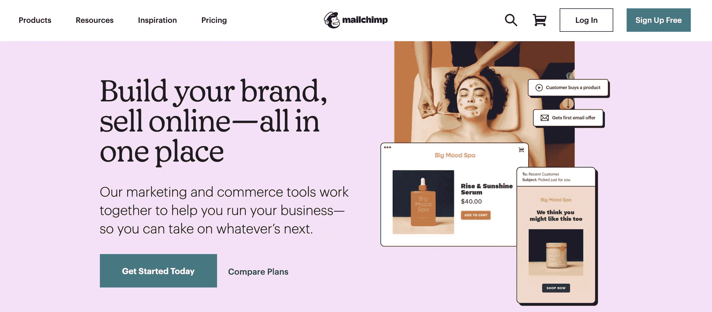

Mailchimp 的电子邮件营销自动化软件因其简单易用而闻名。你将为他们最便宜的计划每月支付 9.99 美元，该计划为你提供 500 个联系人、5000 封月度电子邮件、A/B 测试、登录页面、基本自动化功能和一个伟大的移动应用程序。

也有一个免费计划可用，但这没有任何自动化功能——只有有限的免费预览。不提供免费试用或退款保证，但至少你可以通过免费订阅了解他们的服务。

总的来说，Mailchimp 是小型企业的一个很好的选择，因为它功能丰富，价格实惠，或者是代理商的一个很好的选择，因为 Premium 计划非常先进。

### 尝试几种电子邮件营销自动化工具，找到合适的

总之，所有这些电子邮件自动化工具都有不错的可用性和有用的功能。但是为了找到最适合你的电子邮件活动需求的电子邮件服务，你应该尝试几种不同的服务。最后，一切都取决于你个人觉得哪种服务最方便，以及你的用户名单有多大。

## 自动化营销电子邮件示例

以下是一些最常见的自动电子邮件营销活动的例子。只有创造力是这里的限制，所以这个列表可以用更多的自动化例子和想法来扩展。

### 欢迎电子邮件

欢迎电子邮件是问候新订户的好方法，可以向他们简要介绍您的服务，告诉他们接下来应该采取的步骤，或者询问他们的偏好。感谢自动欢迎电子邮件，您可以更好地了解您的客户，并开始向他们发送更多相关的电子邮件。

您还可以向新订户发送一系列欢迎信息。一个受欢迎的电子邮件点滴活动可以介绍你所有的产品或服务，或者分享重要博客页面的链接，让客户充分了解他们可以从你这里获得的价值。

 [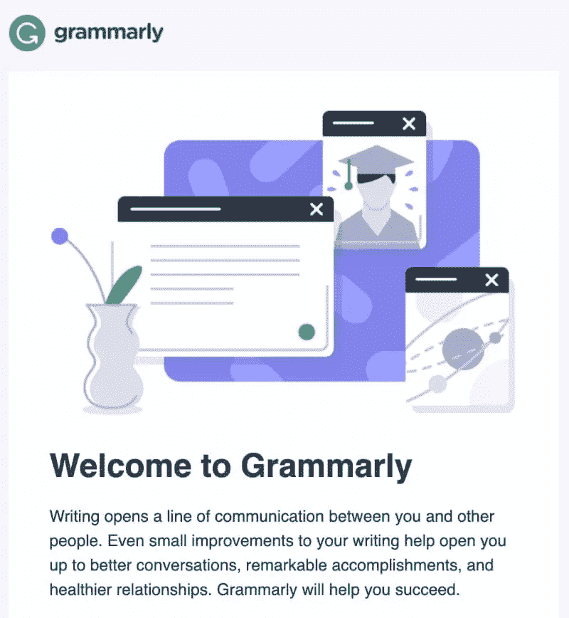](https://uploads.sitepoint.com/wp-content/uploads/2021/09/1630740334welcome-email.jpg)[Click to view the full image](https://uploads.sitepoint.com/wp-content/uploads/2021/09/1631061291welcome-email.jpg) (source: [grammarly.com](https://www.grammarly.com/))

### 废弃购物车电子邮件

发送废弃购物车电子邮件是让被退回的访客回到结账流程完成购买的好方法。这些电子邮件设置起来相对简单，你不用做太多额外的工作就能轻松增加收入。如前所述，就像找钱一样。

 [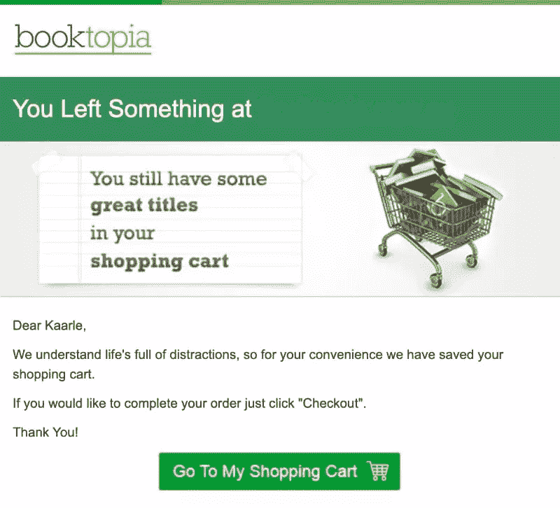](https://uploads.sitepoint.com/wp-content/uploads/2021/09/1630741245abandoned-cart-email.jpg)[Click to view the full image](https://uploads.sitepoint.com/wp-content/uploads/2021/09/1630741245abandoned-cart-email.jpg) (source: [booktopia.com.au](https://www.booktopia.com.au/))

### 新的博客帖子电子邮件

管理博客和写文章需要花费大量的时间和精力。如果所有的工作都白费了，那就太可惜了，因为没有人知道新的职位。但是，如果你在你的最新帖子发布后向你的订阅者发送自动更新，你可以确保他们从你的内容中获得新闻和最佳价值。

 [Click to view the full image](https://uploads.sitepoint.com/wp-content/uploads/2021/09/1630829195new-blog-post.jpg) (source: [reallygoodemails.com](https://reallygoodemails.com/emails/cordial-blog-post-upcoming-ios-privacy-updates))

### 推广新功能或新活动

推出一个新功能对你的用户来说绝对是一个好消息，也是一个惊人的营销机会。如果你恰当地引入了新功能，你就能促使更多的用户去尝试，并从中获得最大的价值。

如果你正在组织一个新的活动，你可以发送一封自动发送的电子邮件或一系列电子邮件来让你的订户注册。如果你要录制的是网上研讨会，那么在活动结束后发送一封自动邮件也是一个不错的主意，邮件中会附上录制内容的链接或附加资源。

 [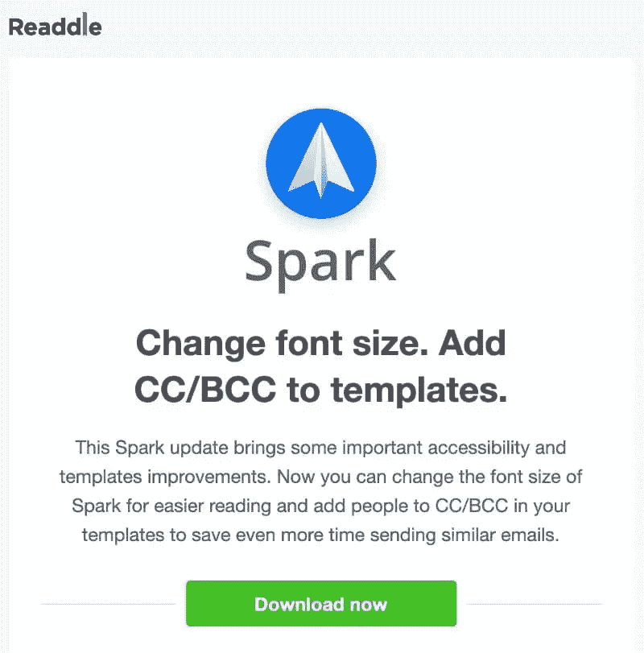](https://uploads.sitepoint.com/wp-content/uploads/2021/09/1630829724new-feature.jpg)[Click to view the full image](https://uploads.sitepoint.com/wp-content/uploads/2021/09/1630829724new-feature.jpg) (source: [reallygoodemails.com](https://reallygoodemails.com/emails/spark-update-change-fonts-size-templates-improvements))

### 关于到期和续订的通知

到期电子邮件不仅仅是一封简单的交易电子邮件。即将到期或续订实际上是鼓励回头客的好方法。提前通知您的客户他们的订购即将结束，并提供一个可以让他们续订其计划的报价，甚至追加销售一个更高级的计划。

 [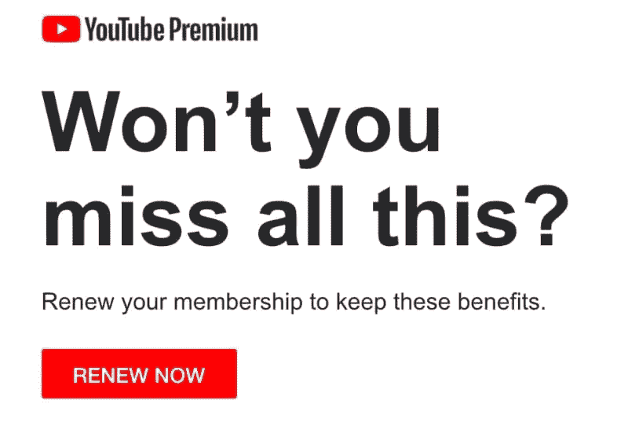](https://uploads.sitepoint.com/wp-content/uploads/2021/09/1630830104expiration-renewal.jpg)[Click to view the full image](https://uploads.sitepoint.com/wp-content/uploads/2021/09/1630830104expiration-renewal.jpg) (source: [reallygoodemails.com](https://reallygoodemails.com/emails/time-is-almost-up-your-youtube-premium-benefits-end-soon-renew-now))

### 关于截止日期和约会的提醒

提醒电子邮件可以是许多不同的自动化电子邮件系列的一部分。如果你正在组织一个关于你的一个产品的点滴活动或一系列电子邮件，你可能会从包含一封提醒邮件中受益。在某种程度上，这些电子邮件类似于到期和续订电子邮件，但你可以发送几乎任何事情的提醒。

如果你有一个限时优惠，你可以给你的订户发送一个截止日期的提醒，制造一点错过 T1 的恐惧。或者发送关于用户注册的即将到来的在线课程、研讨会或现场直播的提醒。

 [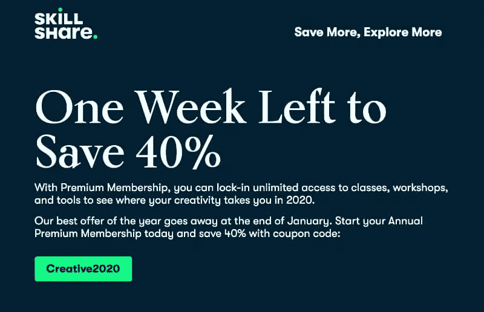](https://uploads.sitepoint.com/wp-content/uploads/2021/09/1630830551deadline.jpg)[Click to view the full image](https://uploads.sitepoint.com/wp-content/uploads/2021/09/1630830551deadline.jpg) (source: [reallygoodemails.com](https://reallygoodemails.com/emails/40-off-creative-exploration))

### 创建电子邮件课程

电子邮件课程在某种程度上类似于一系列入职电子邮件，在这种意义上，你可以在欢迎电子邮件之后立即将其发送给你的新订户。这是展示某个特定主题的价值和权威的好方法，并且可以让你先睹为快。或者，你的电子邮件课程可以是你用来首先获得线索的提议。如果访问者留下他们的电子邮件，他们将获得课程。

简而言之，电子邮件课程是收集和培养潜在客户的好方法。你可以向新订户介绍你的整个品牌和产品系列，让他们觉得在购买之前他们已经从你这里获得了一些有价值的东西。

 [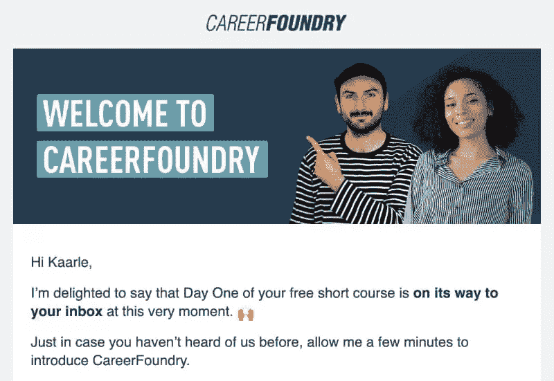](https://editor.sitepoint.com/wp-content/uploads/2021/09/1630830925email-course.jpg)[Click to view the full image](https://editor.sitepoint.com/wp-content/uploads/2021/09/1630830925email-course.jpg) (source: [https://careerfoundry.com](https://careerfoundry.com/))

### 提供周年纪念和生日惊喜

向您的用户发送注册周年或生日电子邮件，并在报价中包含特殊促销或折扣。这是一个很好的方法，可以与你的客户建立更强、更个性化的联系，让他们感到被欣赏。根据你提供的服务，在他们生日前发送电子邮件是一个好主意，这样他们就可以在实际生日那天使用该服务。

然而，发送生日邮件要求你提供更多的个人数据，这可能会在注册表格中引起摩擦。反过来，这会导致填写包含出生日期字段的注册表单的潜在客户减少。因此，你可能会受益于发送一封注册周年电子邮件。至少这个值得 A/B 测试。

 [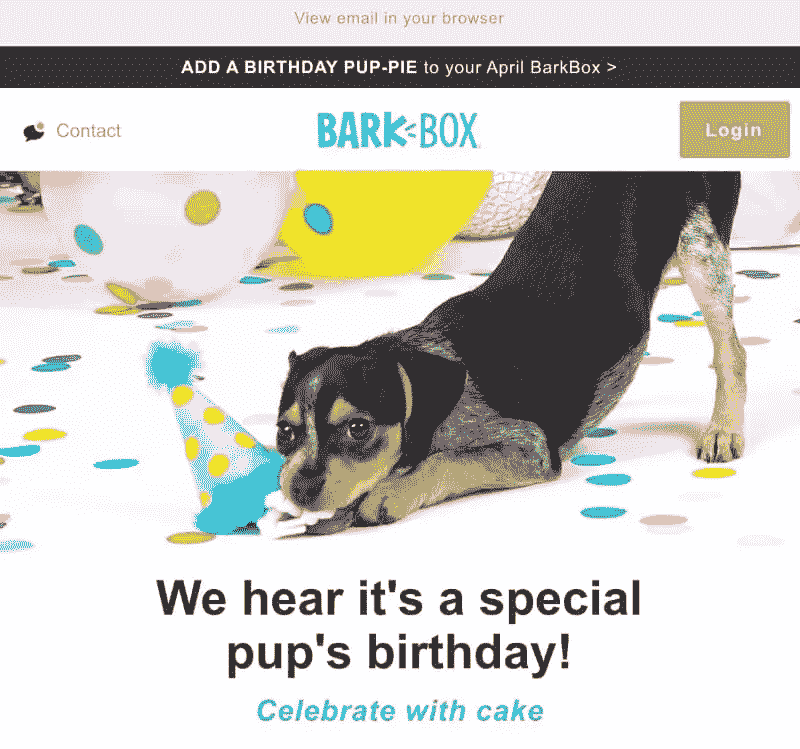](https://uploads.sitepoint.com/wp-content/uploads/2021/09/1630831400birthday-email.jpg)[Click to view the full image](https://uploads.sitepoint.com/wp-content/uploads/2021/09/1630831400birthday-email.jpg) (source: [reallygoodemails.com](https://reallygoodemails.com/emails/barkbox-birthday-barkbox))

### 其他信息和重新参与电子邮件

如果您发现订户没有使用您的全部功能或服务，或者只是提醒他们您的业务存在，您还可以向他们发送其他信息性电子邮件。用优惠重新吸引他们，或者给他们发一系列电子邮件来提高兴趣，让客户再次登录。这样，他们可以提醒自己你的服务和它的好处。

 [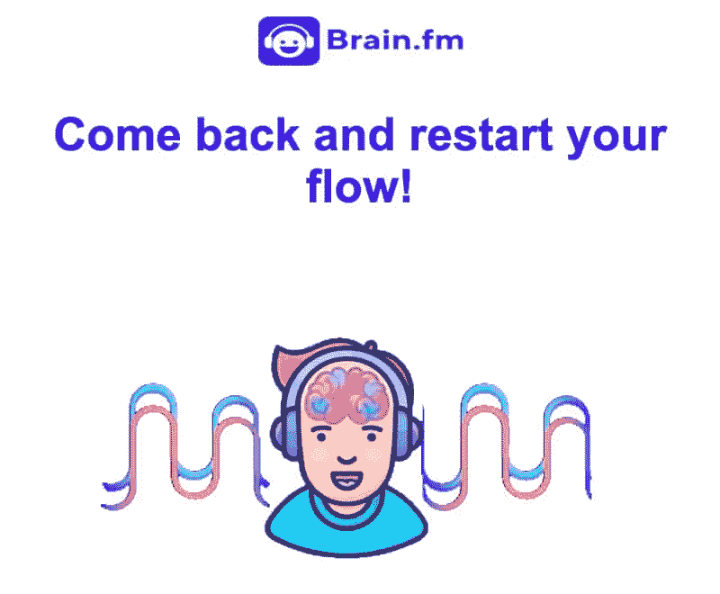](https://uploads.sitepoint.com/wp-content/uploads/2021/09/1630831718re-engagement-email.jpg)[Click to view the full image](https://uploads.sitepoint.com/wp-content/uploads/2021/09/1630831718re-engagement-email.jpg) (source: [reallygoodemails.com](https://reallygoodemails.com/emails/come-back-and-restart-your-flow))

## 结论

设置电子邮件营销自动化可以节省时间，并确保您的营销电子邮件总是准时发送。做好准备需要一些工作，但是开始比听起来容易。

而且你也不用一口气完全实现。你可以先发一些自动邮件，比如欢迎邮件和废弃购物车邮件。

一旦你掌握了其中的诀窍，并开始看到第一个积极的结果，你就可以增加你的电子邮件营销自动化计划的复杂性。只需设定新的目标，制定内容计划，必要时选择额外的工具，创建内容，然后自动完成！当然，保持 A/B 测试不同的主题行、副本变化、发送时间和其他方面是明智的。

因此，花时间进行电子邮件自动化绝对是值得的，因为你可以节省资源，确保你的电子邮件总是准时，建立更强大的客户关系，并增加销售。

遵循本入门指南中的简单步骤，开始您的自动化电子邮件营销工作流程之旅。

## 分享这篇文章