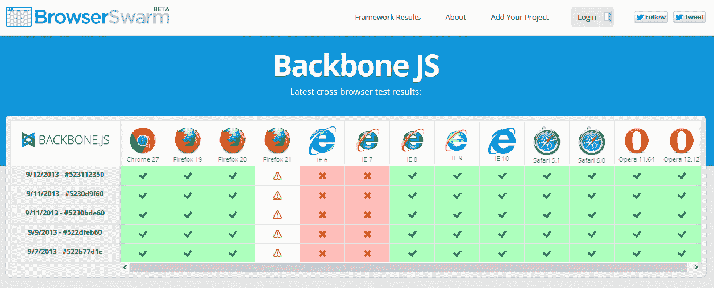
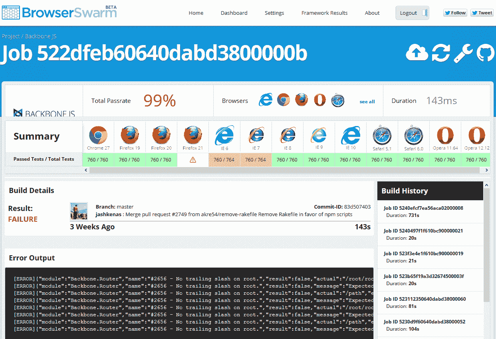

# 使用浏览器 warm 进行自动化 JavaScript 测试

> 原文：<https://www.sitepoint.com/automated-javascript-testing-browserswarm/>

有些开发人员编写的代码非常完美，他们从来不需要测试。他们通常也是那些拒绝添加评论、使用源代码控制或与同事讨论技术的人。对于我们其他人来说，测试是必不可少的——但是令人麻木的乏味。Web 开发人员还有一项繁重的任务，那就是在不同 PC 和 OS 上的众多 web 浏览器中部署他们的代码。

幸运的是， [**BrowserSwarm**](http://www.browserswarm.com/) 是一个新的基于云的系统，这使得 JavaScript 测试变得更加容易忍受。这些步骤非常简单:

1.  [在 BrowserSwarm 注册账户](http://www.browserswarm.com/signup)。
2.  添加您的项目。你可以自动链接 GitHub 或者添加你自己的库。
3.  使用诸如 [QUnit](http://qunitjs.com/) 这样的工具来配置你的单元测试。
4.  查看或下载为多个浏览器生成的测试结果；通常是 Firefox、Chrome、Safari 和 Opera 的几个最新版本以及 IE6 到 IE10。那些拥有 SauceLabs 账户的人也可以在其他设备上测试更多种类的桌面、平板和移动浏览器。

Backbone.js 的一组测试结果示例:

可以查看任何测试作业的更详细的错误报告:

你可以找到其他流行库的测试包括 [jQuery](http://www.browserswarm.com/framework/results/jquery) 、 [jQuery UI](http://www.browserswarm.com/framework/results/jquery-ui) 、 [Dojo](http://www.browserswarm.com/framework/results/dojo) 、 [MooTools](http://www.browserswarm.com/framework/results/mootools-core) 、[原型](http://www.browserswarm.com/framework/results/prototype)和[更多](http://www.browserswarm.com/)。

该服务快速、易用，并消除了我们每天遇到的大量测试负担。BrowserSwarm 也是一个开源项目；你可以贡献其他的库、框架、单元测试或者任何你想要的特性。

哦，对了，我忘了说 BrowserSwarm 是免费的！

谁负责这个神奇的开源工具？微软。是的，你没看错。这项服务是微软、[appendo](http://appendto.com/)和 [SauceLabs](https://saucelabs.com/) 之间的合作，以补充已经在 [modern 提供的浏览器测试设施。即](http://modern.ie/)。

[**BrowserSwarm**](http://www.browserswarm.com/) 目前处于测试阶段，可能需要更多的帮助和文档，但它将使我们的开发生活变得更加容易。

## 分享这篇文章