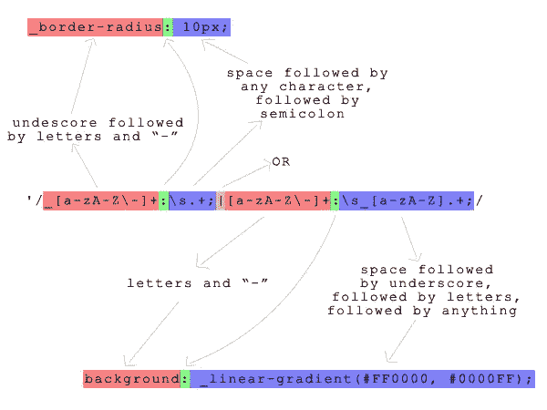
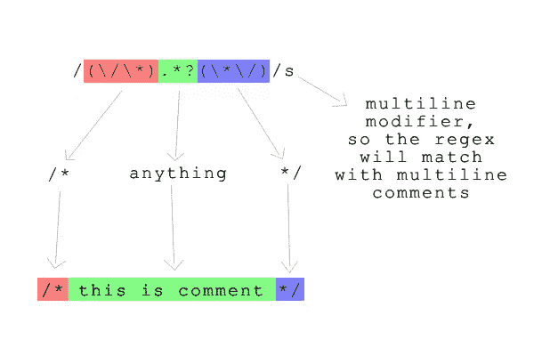
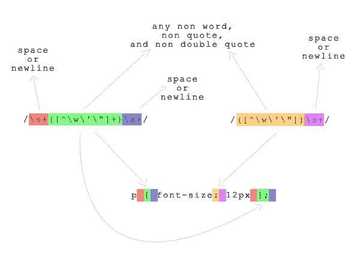
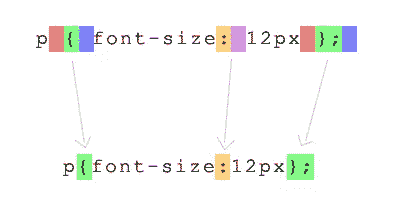

# 自动 CSS3 预混合器和压缩机

> 原文：<https://www.sitepoint.com/automatic-css3-prefixer-and-compressor/>

有许多方法可以压缩 CSS 文件或自动生成特定于浏览器的 CSS3 前缀，但通常会使用额外的工具，这非常烦人。我将向您展示如何只用 PHP 来完成这些任务。在本文中，我们将了解如何:

*   使用特定于浏览器的前缀生成 CSS3 属性，这样我们就不用手动获取它们了
*   连接所有的 CSS 文件，去掉注释和不必要的空白，以减少服务器请求的数量和页面的加载时间
*   当网页被请求时，即时执行该过程

这里有一个例子，展示了最终结果是多么容易使用。

在 CSS 中，浏览器特定的前缀被替换为下划线，如下所示:

```
_border-radius: 10px;
```

该代码将生成一个完整的属性列表，如下所示:

```
-o-border-radius: 10px;
-moz-border-radius: 10px;
-webkit-border-radius: 10px;
border-radius: 10px;
```

然后，在 HTML 中，像这样编写一个链接来导入样式:

```
<link rel="stylesheet" href="css/css.php?f=css_file1|css_file2|css_file3">
```

使用单个`link`元素，三个 CSS 文件将作为一个文件加载。`css.php`脚本将读入列出的文件(`css_file1.css`、`css_file2.css`和`css_file3.css`)，组合它们，并作为一个文件返回。

它看起来很容易使用，对吗？所以，事不宜迟，让我们开始写一些代码吧！

## 编写代码

继续使用以下代码创建文件`css.php`:

```
<?php
$files = explode("|", $_GET["f"]);

$contents = "";
foreach ($files as $file) {
    $contents .= file_get_contents($file . ".css");
}

preg_match_all('/_[a-zA-Z-]+:s.+;|[a-zA-Z-]+:s_[a-zA-Z].+;/',
    $contents, $matches, PREG_PATTERN_ORDER);

$prefixes = array("-o-", "-moz-", "-webkit-", "");
foreach ($matches[0] as $property) {
    $result = "";
    foreach ($prefixes as $prefix) {
        $result .= str_replace("_", $prefix, $property);
    }
    $contents = str_replace($property, $result, $contents);
}

$contents = preg_replace('/(/*).*?(*/)/s', '', $contents);
$contents = preg_replace(array('/s+([^w'"]+)s+/', '/([^w'"])s+/'), '\1', $contents);

header("Content-Type: text/css");
header("Expires: " . gmdate('D, d M Y H:i:s GMT', time() + 3600));
echo $contents;
```

代码首先从 URL 参数(在 PHP 中可作为`$_GET["f"]`访问)中以字符串形式接收要处理的 CSS 文件列表。每个文件都用管道字符分隔。`explode()`函数分割管道上的字符串，返回文件名数组。

函数`file_get_contents()`获取每个文件的内容，这些内容被一个接一个地添加到变量`$contents`中。

在 CSS 文件的内容被检索之后，下一步是找到任何以下划线开头的 CSS 属性，并用特定于浏览器的前缀属性替换它们。函数`preg_match_all()`查找文本中匹配正则表达式的所有部分，并将匹配作为数组放入`$matches[0]`中。

我就不解释为什么`$matches`的数组索引为 0 了，因为你可以在 PHP 手册里读到关于该函数的清晰解释。相反，我想重点解释一下我们程序的流程。

此图像解释了正则表达式的模式:



数组`$prefixes`包含特定于浏览器的前缀数组；根据需要，您可以添加更多前缀，甚至删除一些前缀。`$matches[0]`中的每个属性定义都将被转换成一组带有特定于浏览器的前缀的 CSS3 属性。该代码循环访问每个属性并创建一个结果缓冲区，用浏览器特定的前缀替换属性中的下划线并将结果推入缓冲区，然后用缓冲区的内容替换文本中的原始属性。

在扩展特定于浏览器的前缀并将其合并回`$contents`之后，脚本会去掉内容中的任何注释以减小其大小。下图解释了相关的正则表达式:



然后，另一个正则表达式删除任何不必要的空白和新行，以进一步减少内容的大小。



与正则表达式匹配的部分将被括号内的字符替换，例如:



最后，存储在`$contents`中的 CSS 准备好发送。第一个`header()`调用通知浏览器输出应该被视为一个 CSS 文件。第二个`header()`调用告诉浏览器这个文件在一个小时后过期，所以浏览器将缓存它一个小时，并使用缓存的副本，而不是再次从服务器请求它。

## 使用脚本

我想给你一个我们刚刚制作的脚本的简单用法示例。将`css.php`放入您的`css`目录，连同这三个 CSS 文件。

第一个文件是`header.css`:

```
#header {
  width: 800px;
  height: 100px;
  padding: 20px;

  _border-radius: 10px;
  _box-shadow: 0px 0px 10px #000000;
  background: _linear-gradient(#D30000, #3D0000);
}
```

第二档是`center.css`:

```
#center {
  width: 800px;
  height: 400px;
  padding: 20px;
  margin: 20px 0px;

  _border-radius: 10px;
  _box-shadow: 0px 0px 10px #000000;
  background: _linear-gradient(#8ED300, #213D00);
}
```

第三档是`footer.css`:

```
#footer {
  width: 800px;
  height: 100px;
  padding: 20px;

  _border-radius: 10px;
  _box-shadow: 0px 0px 10px #000000;
  background: _linear-gradient(#006ED3, #00203D);
}
```

看看 CSS3 属性是如何编写的；具有特定于浏览器的前缀的前缀只出现一次，前面有一个下划线。

接下来，创建将使用这些样式的文件`index.html`。

```
<!doctype html>  
<html lang="en">  
 <head>  
  <meta charset="utf-8">  
  <title>example</title>  
  <link rel="stylesheet" href="css/css.php?f=header|center|footer">
 </head>  
 <body>
  <div id="header">header</div>
  <div id="center">center</div>
  <div id="footer">footer</div>
 </body>
</html>
```

查看链接标签中的`href`属性。每个 CSS 文件名由一个管道分隔。

## 结论

在本文中，我向您展示了如何使用 PHP 来自动化一些常见的 CSS 操作。该脚本非常依赖正则表达式，这是一种非常强大的语言，允许我们以我们认为合适的方式操作字符串。总的来说，这个脚本非常简单，但是它提供了很多好处。试着在你的下一个项目中使用它。

<small>图片通过[1x pert](http://www.shutterstock.com/gallery-476578p1.html)/[Shutterstock](http://shutterstock.com)</small>

## 分享这篇文章